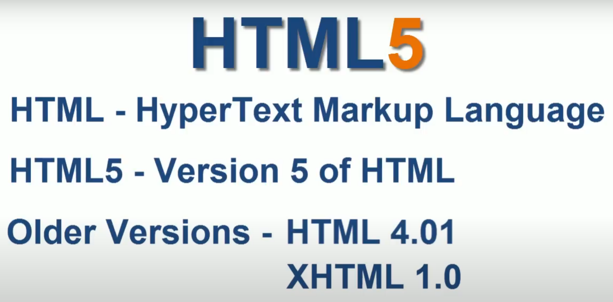
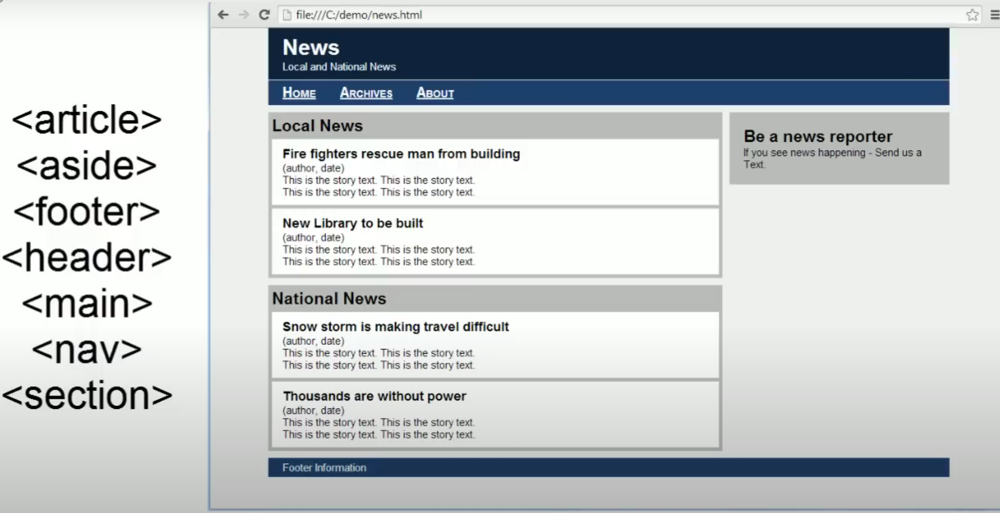
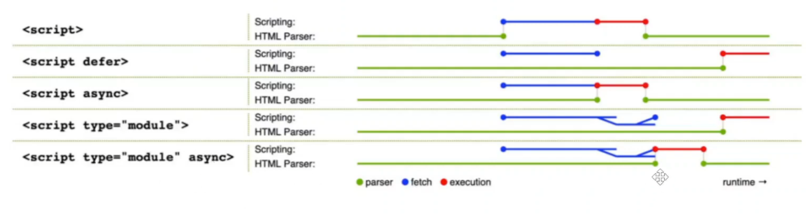
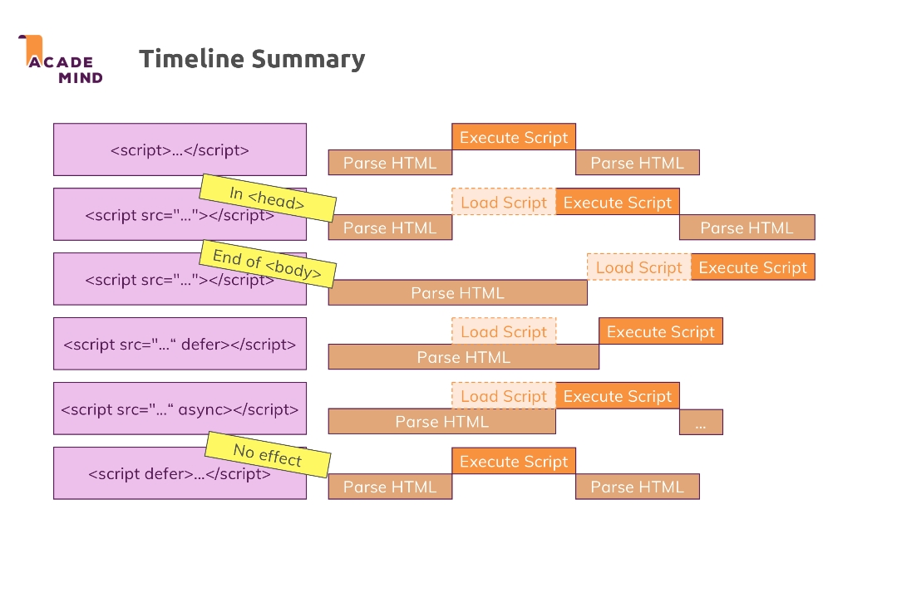
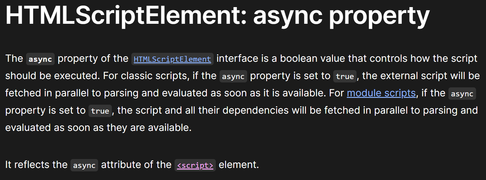
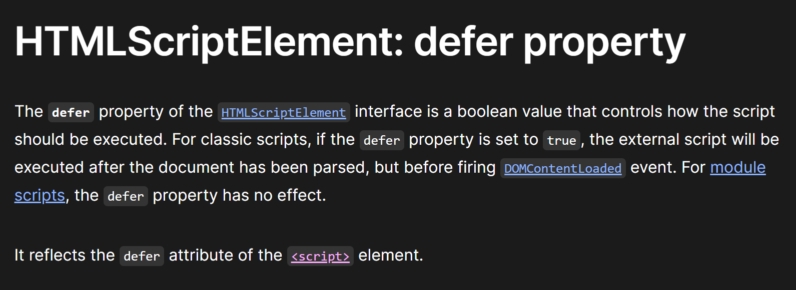

<details >
 <summary style="font-size: large; font-weight: bold">HTML5</summary>



1. Tag
```html
<title>
```

2. Element
```html
<title>Hello</title>
```

3. Attribute
```html
<title id="head">Hello</title>
```

1. New HTML Elements better for Semantic



2. Native video support


https://www.greatfrontend.com/questions/quiz/html5-as-an-open-web-platform-building-blocks?format=quiz

---
</details>


<details >
 <summary style="font-size: large; font-weight: bold">Script Loading</summary>

Render-blocking resources can include scripts, stylesheets, and HTML imports.




**Case-1 & 6:** 
- The script starts executing as soon as they are encountered

**Case-2:**
- As soon as scripts are encountered, HTML parsing is stopped and
we load the script then starts executing. JS file are Parser blocking

**Case-3(End Of Body):**
- Once all HTML is parsed, scripts load and execute

**Case-4(Defer):**
- Scripts load parallelly, and as soon as HTML parsing is done we execute the 
script
- It maintains the order of execution of scripts as it is declared, hence 
good for a situation when we have interdependency of a script on each other

**Case-5(Async):**
- Scripts loads parallelly and as soon as loading complete it start 
executing and stop HTML parsing.
- Sequence of script execution is not guarantee, hence it is useful for
loading scripts which has no dependency like Google Analytics

**Note:** Even though `async` and `defer` help to make script downloading asynchronous, the scripts are still eventually executed on the main thread. If these scripts are computationally intensive, it can result in laggy/frozen UI. [Partytown](https://partytown.builder.io/) is a library that helps relocate script executions into a [web worker](https://developer.mozilla.org/en-US/docs/Web/API/Web_Workers_API) and off the [main thread](https://developer.mozilla.org/en-US/docs/Glossary/Main_thread), which is great for third-party scripts where you do not have control over the code.

https://www.greatfrontend.com/questions/quiz/describe-the-difference-between-script-async-and-script-defer?practice=practice&tab=quiz





<details >
 <summary style="font-size: medium; font-weight: bold">Why is it generally a good idea to position CSS link between head and JS scripts just before body?</summary>

https://www.greatfrontend.com/questions/quiz/css-link-between-head-and-js-script-just-before-body?practice=practice&tab=quiz

In a nutshell, such a placement of CSS `<link>`s and JavaScript `<script>`s allows for faster rendering of the page and better overall performance.

### Placing `<link>`s in `<head>`

Putting `<link>`s in `<head>` is part of the proper specification in building an optimized website. When a page first loads, HTML and CSS are being parsed simultaneously; HTML creates the DOM (Document Object Model) and CSS creates the CSSOM (CSS Object Model). Both are needed to create the visuals in a website, allowing for a quick "first meaningful paint" timing. Placing CSS `<link>`s in the `<head>` ensures that the stylesheets are loaded and ready for use when the browser starts rendering the page.


### Placing `<script>`s just before `</body>`

`<script>` tags block HTML parsing while they are being downloaded and executed which can slow down the display of your page. Placing the `<script>`s at the bottom will allow the HTML to be parsed and displayed to the user first.

An exception for positioning of `<script>`s at the bottom is when your script contains `document.write()`, but these days it's not a good practice to use `document.write()`. Also, placing `<script>`s at the bottom means that the browser cannot start downloading the scripts until the entire document is parsed. This ensures your code that needs to manipulate DOM elements will not throw an error and halt the entire script. If you need to put `<script>`s in the `<head>`, use the `defer` attribute, which will achieve the same effect of running the script only after the HTML is parsed but the browser can kick off the network request earlier to download the script.

Keep in mind that putting scripts just before the closing `</body>` tag will create the illusion that the page loads faster on an empty cache (since the scripts won't block downloading the rest of the document). However, if you have some code you want to run during page load, it will only start executing after the entire page has loaded. If you put those scripts in the `<head>` tag, they would start executing before - so on a primed cache the page would actually appear to load faster.

### `<head>` and `<body>` tags are now optional

As per the HTML5 specification, certain HTML tags like `<head>` and `<body>` are optional. Google's style guide even recommends removing them to save bytes. However, this practice is still not widely adopted and the performance gain is likely to be minimal and for most sites it's not likely going to matter.

---
</details>


---
</details>


<details >
 <summary style="font-size: large; font-weight: bold">Block and Inline Elements</summary>

An inline element does not start on a new line.

An inline element only takes up as much width as necessary.

```html
    <a>
    <button>
    
    <input>
    <script>
    <select>
    <textarea>
    <label>
    <abbr>
    <acronym>
    <b>
    <bdo>
    <big>
    <br>
    <cite>
    <code>
    <dfn>
    <em>
    <i>
    <kbd><map><object><output><q><samp><small><span><strong><sub><sup><time><tt><var>
```

**Note:** An `inline element` **cannot** contain a `block-level` element!

---
</details>


<details >
 <summary style="font-size: medium; font-weight: bold">What's the difference between an "attribute" and a "property" in the DOM?</summary>

## TL;DR

Attributes are defined in the HTML and provide initial values for properties. Properties are part of the DOM and represent the current state of an element. For example, the `value` attribute of an `<input>` element sets its initial value, while the `value` property reflects the current value as the user interacts with it.

---

## Difference between an "attribute" and a "property" in the DOM

### Attributes

Attributes are defined in the HTML markup and provide initial values for elements. They are static and do not change once the page is loaded unless explicitly modified using JavaScript.

#### Example

```html
<input type="text" value="initial value" />
```

In this example, `value="initial value"` is an attribute.

### Properties

Properties are part of the DOM and represent the current state of an element. They are dynamic and can change as the user interacts with the page or through JavaScript.

#### Example

```javascript
const inputElement = document.querySelector('input');
console.log(inputElement.value); // Logs the current value of the input element
inputElement.value = 'new value'; // Changes the current value of the input element
```

In this example, `value` is a property of the `inputElement` object.

### Key differences

- **Initialization**: Attributes initialize DOM properties.
- **State**: Attributes are static, while properties are dynamic.
- **Access**: Attributes can be accessed using `getAttribute` and `setAttribute` methods, while properties can be accessed directly on the DOM object.

#### Example

```html
<input id="myInput" type="text" value="initial value" />
```

```javascript
const inputElement = document.getElementById('myInput');

// Accessing attribute
console.log(inputElement.getAttribute('value')); // "initial value"

// Accessing property
console.log(inputElement.value); // "initial value"

// Changing property
inputElement.value = 'new value';
console.log(inputElement.value); // "new value"
console.log(inputElement.getAttribute('value')); // "initial value"
```

In this example, changing the `value` property does not affect the `value` attribute.

## Further reading

- [MDN Web Docs: Element.getAttribute()](https://developer.mozilla.org/en-US/docs/Web/API/Element/getAttribute)
- [MDN Web Docs: Element.setAttribute()](https://developer.mozilla.org/en-US/docs/Web/API/Element/setAttribute)
- [MDN Web Docs: HTML attributes vs. DOM properties](https://developer.mozilla.org/en-US/docs/Web/HTML/Attributes#html_attributes_vs_dom_properties)

---
</details>


<details >
 <summary style="font-size: medium; font-weight: bold">What are `data-` attributes good for?</summary>

https://www.greatfrontend.com/questions/quiz/what-are-data-attributes-good-for?practice=practice&tab=quiz

Before JavaScript frameworks became popular, developers used `data-` attributes to store extra data within the DOM itself, without other hacks such as non-standard attributes, extra properties on the DOM. It is intended to store custom data private to the page or application, for when there are no more appropriate attributes or elements.

Another common use case for `data-` attributes is to store information used by third-party libraries or frameworks. For example, the Bootstrap library uses data attributes to cause `<button>`s to trigger actions on a modal elsewhere on the page ([example](https://getbootstrap.com/docs/5.2/components/modal/#via-data-attributes)).

```html
<button type="button" data-bs-toggle="modal" data-bs-target="#myModal">
  Launch modal
</button>
...
<div class="modal fade" id="myModal">Modal contents</div>
```

These days, using `data-` attributes is generally not encouraged. One reason is that users can modify the data attribute easily by using "inspect element" in the browser. The data model is better stored within JavaScript environment and have them kept in-sync with the DOM via virtual DOM reconciliation or two-way data binding possibly through a library or a framework.

However, one perfectly valid use of data attributes, is to add an identifier for **end-to-end** testing frameworks (e.g. Playwright, Puppeteer, Selenium), without adding classes or ID attributes just for tests which are primarily for other purposes. The element needs a way to be selected and something like `data-test-id="my-element"` is a valid way to do so without convoluting the semantic markup otherwise.

---
</details>


<details >
 <summary style="font-size: medium; font-weight: bold">XYZ</summary>


---
</details>


<details >
 <summary style="font-size: medium; font-weight: bold">XYZ</summary>


---
</details>


<details >
 <summary style="font-size: medium; font-weight: bold">XYZ</summary>


---
</details>


<details >
 <summary style="font-size: medium; font-weight: bold">XYZ</summary>


---
</details>
