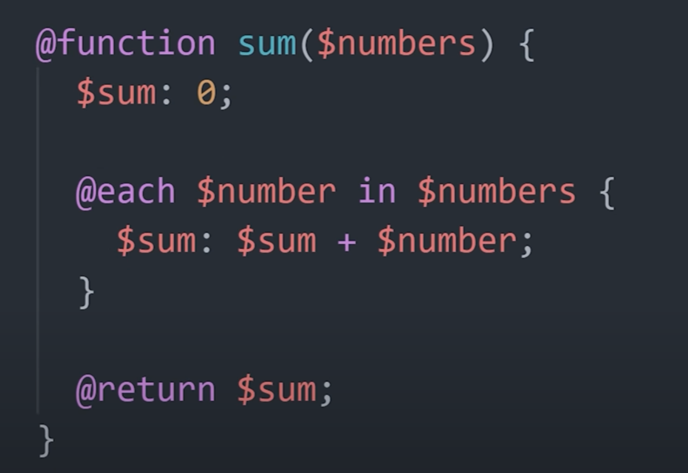

### `height` & `width`

- **Thumb rule** - Always set height/width of parent container first only when required, 
first always try to solve using whatever default html is providing.

- **Overflow** - After first rule check where you need to set `height` / `width`, use 
things like % instead of unit then use `overflow: auto`. In case of long word don't use 
`overflow` instead use things like `word-break`

A very good example is `product-chat` app here: https://github.com/anjaysahoo/mini-apps/tree/master/product-chat

### ``

- For different image size to be shown consistently of uniform size use things like `min-width`
- Read this for optimize image loading: https://www.builder.io/blog/fast-images


### Flex

1. Flex-basis: It is like how much width you want to give to a box
   1. By default, it is `auto`(space taken is dependent on whatever value is defined for that element)
2. Flex-Grow: `1` means grow whatever available space, `0` means don't grow
3. Flex-shrink: `1` means shrink as much as possible, `0` means don't shrink
```css
/* Three values: flex-grow | flex-shrink | flex-basis */
flex: 2 2 10%;

/* Default value */
flex: initial; /* 0 1 auto */

/* Keyword value */
flex: none; /* 0 0 auto */

/* One value, unitless number: flex-grow
flex-basis is then equal to 0%. */
flex: 2; /* 2 1 0% */

/* One value, width/height: flex-basis */
flex: auto; /* 1 1 auto */
flex: 10em; /* 1 1 10em */
flex: 30%;
flex: min-content;

/* Two values: flex-grow | flex-basis */
flex: 1 30px; /* 1 1 30px */

/* Two values: flex-grow | flex-shrink */
flex: 2 2; /* 2 2 0% */

```

Short Video Explanation: https://youtu.be/1zKX71GYisE?si=OyuV4mzevtMUsCuN&t=375
<details >
 <summary style="font-size: large; font-weight: bold">CSS3</summary>


- Rounded Corners and Gradients. When CSS was released, developers used design images to create rounded corners with different gradients and structures
- Pseudo-classes. CSS supports pseudo-classes that let developers define a particular state of an HTML element. For example, developers can use the pseudo-class to highlight the links on a web page that a user has already clicked on or style an HTML element when the user's mouse hovers over it.

- https://www.simplilearn.com/difference-between-css-and-css3-article#:~:text=CSS3%20features%20the%20Selector%20concept,be%20applied%20to%20CSS%20styles.
</details>


<details >
 <summary style="font-size: large; font-weight: bold">SASS vs LESS vs SCSS</summary>

https://www.greatfrontend.com/questions/quiz/what-are-the-advantages-disadvantages-of-using-css-preprocessors

LESS stands for Leaner Style Sheets. It is a backward-compatible language extension for CSS. It allows us to use features like variables, nesting, mixins, etc, all in a CSS-compatible syntax. LESS is influenced by SASS and has influenced the newer “SCSS” syntax of SASS. LESS was used in Bootstrap 3 but was replaced by SASS in Bootstrap 4.

SASS (Syntactically Awesome Stylesheets), SCSS (Sassy CSS), and LESS (Leaner Style Sheets) are all CSS preprocessors that help in writing more maintainable and reusable CSS code. Here’s a detailed explanation of each with examples:

100 seconds short video: https://www.youtube.com/watch?v=akDIJa0AP5c&t=14s

### 1. SASS (Syntactically Awesome Stylesheets)

**SASS** is the original syntax of the SASS preprocessor. It uses indentation rather than braces and semicolons, making it cleaner and shorter.

#### Example
```sass
// Variables
$primary-color: #333

// Mixin
@mixin border-radius($radius) 
  -webkit-border-radius: $radius
  -moz-border-radius: $radius
  border-radius: $radius

// Nesting
nav 
  ul 
    margin: 0
    padding: 0
    list-style: none
  
  li 
    display: inline-block
    
  a 
    display: block
    padding: 6px 12px
    text-decoration: none

// Using mixin
.box 
  @include border-radius(10px)
  background: $primary-color
  color: #fff
  padding: 10px
```

#### SASS Functions




### 2. SCSS (Sassy CSS)

**SCSS** is a newer syntax of SASS and is fully compatible with CSS syntax. It uses braces and semicolons, making it easier for developers familiar with CSS to pick up.

#### Example
```scss
// Variables
$primary-color: #333;

// Mixin
@mixin border-radius($radius) {
  -webkit-border-radius: $radius;
  -moz-border-radius: $radius;
  border-radius: $radius;
}

// Nesting
nav {
  ul {
    margin: 0;
    padding: 0;
    list-style: none;
  }

  li {
    display: inline-block;
  }

  a {
    display: block;
    padding: 6px 12px;
    text-decoration: none;
  }
}

// Using mixin
.box {
  @include border-radius(10px);
  background: $primary-color;
  color: #fff;
  padding: 10px;
}
```

### 3. LESS (Leaner Style Sheets)

**LESS** is another CSS preprocessor similar to SASS/SCSS but with its own syntax and features. LESS is written in JavaScript and can be run on the client-side or server-side.

#### Example
```less
// Variables
@primary-color: #333;

// Mixin
.border-radius(@radius) {
  -webkit-border-radius: @radius;
  -moz-border-radius: @radius;
  border-radius: @radius;
}

// Nesting
nav {
  ul {
    margin: 0;
    padding: 0;
    list-style: none;
  }

  li {
    display: inline-block;
  }

  a {
    display: block;
    padding: 6px 12px;
    text-decoration: none;
  }
}

// Using mixin
.box {
  .border-radius(10px);
  background: @primary-color;
  color: #fff;
  padding: 10px;
}
```

### Key Differences

1. **Syntax**:
    - SASS uses indentation-based syntax without braces and semicolons.
    - SCSS uses CSS-like syntax with braces and semicolons.
    - LESS uses a syntax similar to SCSS but with some differences in features and functions.

2. **Features**:
    - All preprocessors support variables, nesting, mixins, and functions.
    - SASS/SCSS and LESS have different implementations and additional features (like loops and conditionals).

3. **Compatibility**:
    - SCSS is fully compatible with CSS, making it easier to transition from CSS.
    - LESS also supports a CSS-like syntax but might have some differences in advanced features.

4. **Compilation**:
    - SASS/SCSS is compiled using the Ruby-based `sass` or the Dart-based `dart-sass`.
    - LESS is typically compiled using JavaScript-based tools.
</details>


<details >
 <summary style="font-size: large; font-weight: bold">CSS Selector</summary>
Three basic types: element, class, and ID

1. **What are some of the "gotchas" for writing efficient CSS?**
   Firstly, understand that browsers match selectors from rightmost (key selector) to left. Browsers filter out elements in the DOM according to the key selector and traverse up its parent elements to determine matches. The shorter the length of the selector chain, the faster the browser can determine if that element matches the selector. Hence avoid key selectors that are tag and universal selectors. They match a large number of elements and browsers will have to do more work in determining if the parents do match.

BEM (Block Element Modifier) methodology recommends that everything has a single class, and, where you need hierarchy, that gets baked into the name of the class as well, this naturally makes the selector efficient and easy to override.

Be aware of which CSS properties trigger reflow, repaint, and compositing. Avoid writing styles that change the layout (trigger reflow) where possible.

https://www.greatfrontend.com/questions/quiz/what-are-some-of-the-gotchas-for-writing-efficient-css

2. **Explain how a browser determines what elements match a CSS selector.**

This question is related to the question about writing efficient CSS. Browsers match selectors from rightmost (key selector) to the left. Browsers filter out elements in the DOM according to the key selector and traverse up its parent elements to determine matches. The shorter the length of the selector chain, the faster the browser can determine if that element matches the selector.

For example, with a selector p span, browsers firstly find all the <span> elements and traverse up its parent all the way up to the root to find the <p> element. For a particular <span>, as soon as it finds a <p>, it knows that the <span> matches the selector, and can stop traversing its parents.
https://www.greatfrontend.com/questions/quiz/explain-how-a-browser-determines-what-elements-match-a-css-selector?format=quiz


https://developer.mozilla.org/en-US/docs/Learn/CSS/Building_blocks/Selectors
https://youtu.be/1h5StQJ8hww?si=Sxyq0sqt-IVHQR7c
</details>
