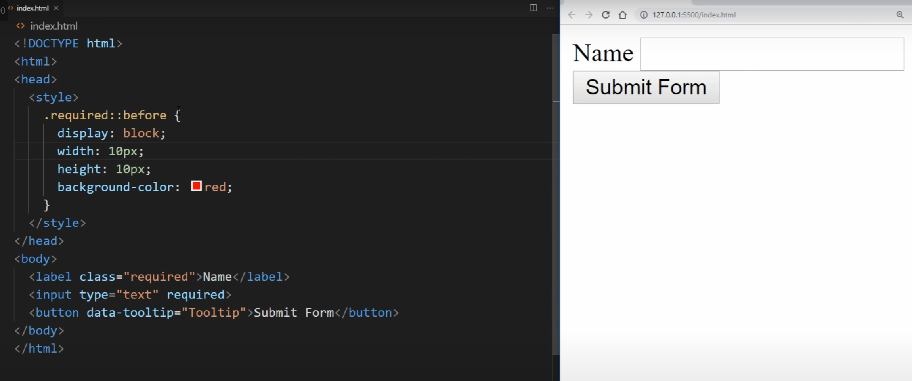

<details >
 <summary style="font-size: large; font-weight: bold">Point to remember while writing CSS</summary>

### `height` & `width`

- **Thumb rule** - Always set height/width of parent container first only when required,
  first always try to solve using whatever default html is providing.

- **Overflow** - After first rule check where you need to set `height` / `width`, use
  things like % instead of unit then use `overflow: auto`. In case of long word don't use
  `overflow` instead use things like `word-break`

A very good example is `product-chat` app here: https://github.com/anjaysahoo/mini-apps/tree/master/product-chat

### ``

- For different image size to be shown consistently of uniform size use things like `min-width`
- Read this for optimize image loading: https://www.builder.io/blog/fast-images

---
</details>


<details >
 <summary style="font-size: large; font-weight: bold">Useful CSS Snippets</summary>

1. Always apply below css in root css file of project, putting it any where will not work

https://www.greatfrontend.com/questions/quiz/what-does-box-sizing-border-box-do-what-are-its-advantages?format=quiz
```css
*{
  box-sizing: border-box;/*So that padding & border are considered in height*/
}
```

2. Remove default style of button disabled. Put below CSS in class which is applied to the respective button
```css
.overriding-class-of-button {
   color: inherit;
}
```


---
</details>


<details >
 <summary style="font-size: large; font-weight: bold">Flex & Grid</summary>

### Flex

1. Flex-basis: It is like how much width you want to give to a box
   1. By default, it is `auto`(space taken is dependent on whatever value is defined for that element)
2. Flex-Grow: `1` means grow whatever available space, `0` means don't grow
3. Flex-shrink: `1` means shrink as much as possible, `0` means don't shrink
```css
/* Three values: flex-grow | flex-shrink | flex-basis */
flex: 2 2 10%;

/* Default value */
flex: initial; /* 0 1 auto */

/* Keyword value */
flex: none; /* 0 0 auto */

/* One value, unitless number: flex-grow
flex-basis is then equal to 0%. */
flex: 2; /* 2 1 0% */

/* One value, width/height: flex-basis */
flex: auto; /* 1 1 auto */
flex: 10em; /* 1 1 10em */
flex: 30%;
flex: min-content;

/* Two values: flex-grow | flex-basis */
flex: 1 30px; /* 1 1 30px */

/* Two values: flex-grow | flex-shrink */
flex: 2 2; /* 2 2 0% */

```

Short Video Explanation: https://youtu.be/1zKX71GYisE?si=OyuV4mzevtMUsCuN&t=375

### Grid

https://fireship.io/lessons/three-responsive-css-grid-layouts/

```css
.basic-grid {
    display: grid;
    gap: 1rem;
    grid-template-columns: repeat(auto-fill, minmax(240px, 1fr));
 }
```


---
</details>


<details >
 <summary style="font-size: large; font-weight: bold">Explain your understanding of the box model and how you would tell the browser in CSS to render your layout in different box models.</summary>

### Always apply below css in root css file of project, putting it any where will not work

```css
*{
  box-sizing: border-box;/*So that padding & border are considered in height*/
}
```

| Property  | `box-sizing: content-box` (default) | `box-sizing: border-box` |
| --------- | ----------------------------------- | ------------------------ |
| content   | Yes                                 | Yes                      |
| `padding` | No                                  | Yes                      |
| `border`  | No                                  | Yes                      |
| `margin`  | No                                  | No                       |

- https://www.greatfrontend.com/questions/quiz/what-does-box-sizing-border-box-do-what-are-its-advantages?format=quiz
- https://www.greatfrontend.com/questions/quiz/what-does-box-sizing-border-box-do-what-are-its-advantages?practice=practice&tab=quiz

The CSS box model describes the rectangular boxes that are generated for elements in the document tree and laid out according to the visual formatting model. Each box has a content area (e.g. text, an image, etc.) and optional surrounding `padding`, `border`, and `margin` areas.

The CSS box model is responsible for calculating:

- How much space a block element takes up.
- Whether or not borders and/or margins overlap, or collapse.
- A box's dimensions.

## Box Model Rules

- The dimensions of a block element are calculated by `width`, `height`, `padding`s, and `border`s.
- If no `height` is specified, a block element will be as high as the content it contains, plus `padding` (unless there are floats, for which, see [describe floats and how they work](/questions/quiz/describe-floats-and-how-they-work)).
- If no `width` is specified, a non-`float`-ed block element will expand to fit the width of its parent minus the `padding`, unless it has a `max-width` property set, in which case it will be no wider than the specified maximum width.
   - Some block-level elements (e.g. `table`, `figure`, and `input`) have inherent or default width values, and may not expand to fill the full width of their parent container.
   - Note: `span` is an inline-level element and does not have a default width, so it will not expand to fit.
- The `height` of an element is calculated by the content's `height`.
- The `width` of an element is calculated by the content's `width`.
- By default (`box-sizing: content-box`), `padding`s and `border`s are not part of the `width` and `height` of an element.

Note that `margin`s are not counted towards the actual size of the box. It affects the total space that the box will take up on the page, but only the space outside the box. The box's area stops at the `border` — it does not extend into the `margin`.

## Extra

Look up the `box-sizing` property, which affects how the total heights and widths of elements are calculated.

- `box-sizing: content-box`: This is the default value of `box-sizing` and adheres to the rules above.
- `box-sizing: border-box`: The `width` and `height` will include the content, padding and border, but not including the margin. This is a much more intuitive way to think about boxes and hence many CSS frameworks (e.g. Bootstrap, Tailwind, Bulma) set `* { box-sizing: border-box; }` globally, so that all elements use such a box model by default. See the [question on `box-sizing: border-box`](/questions/quiz/what-does-box-sizing-border-box-do-what-are-its-advantages) for more information.

## References

- [The box model | MDN](https://developer.mozilla.org/en-US/docs/Learn/CSS/Building_blocks/The_box_model#the_standard_css_box_model)


---
</details>


<details >
 <summary style="font-size: large; font-weight: bold">CSS3</summary>


- Rounded Corners and Gradients. When CSS was released, developers used design images to create rounded corners with different gradients and structures
- Pseudo-classes. CSS supports pseudo-classes that let developers define a particular state of an HTML element. For example, developers can use the pseudo-class to highlight the links on a web page that a user has already clicked on or style an HTML element when the user's mouse hovers over it.

- https://www.simplilearn.com/difference-between-css-and-css3-article#:~:text=CSS3%20features%20the%20Selector%20concept,be%20applied%20to%20CSS%20styles.

---
</details>


<details >
 <summary style="font-size: large; font-weight: bold">SASS vs LESS vs SCSS</summary>

<details >
 <summary style="font-size: medium; font-weight: bold">What are the advantages/disadvantages of using CSS preprocessors?</summary>

https://www.greatfrontend.com/questions/quiz/what-are-the-advantages-disadvantages-of-using-css-preprocessors

## Advantages

- CSS is made more maintainable.
- Easier to write nested selectors.
- Variables for consistent theming. Can share theme files across different projects. This is not necessarily useful with CSS custom properties (frequently called CSS variables).
- Mixins to generate repeated CSS.
- Sass and Less have features like loops, lists, and maps can make configuration easier and less verbose.
- Splitting your code into multiple files during development. CSS files can be split up too but doing so will require an HTTP request to download each CSS file.

## Disadvantages

- Requires tools for preprocessing. Re-compilation time can be slow.
- Not writing currently and potentially usable CSS. For example, by using something like [postcss-loader](https://github.com/postcss/postcss-loader) with [webpack](https://webpack.js.org/), you can write potentially future-compatible CSS, allowing you to use things like CSS variables instead of Sass variables. Thus, you're learning new syntax that could pay off if/when they become standardized.

---
</details>


LESS stands for Leaner Style Sheets. It is a backward-compatible language extension for CSS. It allows us to use features like variables, nesting, mixins, etc, all in a CSS-compatible syntax. LESS is influenced by SASS and has influenced the newer “SCSS” syntax of SASS. LESS was used in Bootstrap 3 but was replaced by SASS in Bootstrap 4.

SASS (Syntactically Awesome Stylesheets), SCSS (Sassy CSS), and LESS (Leaner Style Sheets) are all CSS preprocessors that help in writing more maintainable and reusable CSS code. Here’s a detailed explanation of each with examples:

100 seconds short video: https://www.youtube.com/watch?v=akDIJa0AP5c&t=14s

### 1. SASS (Syntactically Awesome Stylesheets)

**SASS** is the original syntax of the SASS preprocessor. It uses indentation rather than braces and semicolons, making it cleaner and shorter.

#### Example
```sass
// Variables
$primary-color: #333

// Mixin
@mixin border-radius($radius) 
  -webkit-border-radius: $radius
  -moz-border-radius: $radius
  border-radius: $radius

// Nesting
nav 
  ul 
    margin: 0
    padding: 0
    list-style: none
  
  li 
    display: inline-block
    
  a 
    display: block
    padding: 6px 12px
    text-decoration: none

// Using mixin
.box 
  @include border-radius(10px)
  background: $primary-color
  color: #fff
  padding: 10px
```

#### SASS Functions


### 2. SCSS (Sassy CSS)

**SCSS** is a newer syntax of SASS and is fully compatible with CSS syntax. It uses braces and semicolons, making it easier for developers familiar with CSS to pick up.

#### Example
```scss
// Variables
$primary-color: #333;

// Mixin
@mixin border-radius($radius) {
  -webkit-border-radius: $radius;
  -moz-border-radius: $radius;
  border-radius: $radius;
}

// Nesting
nav {
  ul {
    margin: 0;
    padding: 0;
    list-style: none;
  }

  li {
    display: inline-block;
  }

  a {
    display: block;
    padding: 6px 12px;
    text-decoration: none;
  }
}

// Using mixin
.box {
  @include border-radius(10px);
  background: $primary-color;
  color: #fff;
  padding: 10px;
}
```

### 3. LESS (Leaner Style Sheets)

**LESS** is another CSS preprocessor similar to SASS/SCSS but with its own syntax and features. LESS is written in JavaScript and can be run on the client-side or server-side.

#### Example
```less
// Variables
@primary-color: #333;

// Mixin
.border-radius(@radius) {
  -webkit-border-radius: @radius;
  -moz-border-radius: @radius;
  border-radius: @radius;
}

// Nesting
nav {
  ul {
    margin: 0;
    padding: 0;
    list-style: none;
  }

  li {
    display: inline-block;
  }

  a {
    display: block;
    padding: 6px 12px;
    text-decoration: none;
  }
}

// Using mixin
.box {
  .border-radius(10px);
  background: @primary-color;
  color: #fff;
  padding: 10px;
}
```

### Key Differences

1. **Syntax**:
    - SASS uses indentation-based syntax without braces and semicolons.
    - SCSS uses CSS-like syntax with braces and semicolons.
    - LESS uses a syntax similar to SCSS but with some differences in features and functions.

2. **Features**:
    - All preprocessors support variables, nesting, mixins, and functions.
    - SASS/SCSS and LESS have different implementations and additional features (like loops and conditionals).

3. **Compatibility**:
    - SCSS is fully compatible with CSS, making it easier to transition from CSS.
    - LESS also supports a CSS-like syntax but might have some differences in advanced features.

4. **Compilation**:
    - SASS/SCSS is compiled using the Ruby-based `sass` or the Dart-based `dart-sass`.
    - LESS is typically compiled using JavaScript-based tools.

---
</details>


<details >
 <summary style="font-size: large; font-weight: bold">CSS Selector</summary>
Three basic types: element, class, and ID

1. **What are some of the "gotchas" for writing efficient CSS?**
   Firstly, understand that browsers match selectors from rightmost (key selector) to left. Browsers filter out elements in the DOM according to the key selector and traverse up its parent elements to determine matches. The shorter the length of the selector chain, the faster the browser can determine if that element matches the selector. Hence avoid key selectors that are tag and universal selectors. They match a large number of elements and browsers will have to do more work in determining if the parents do match.

BEM (Block Element Modifier) methodology recommends that everything has a single class, and, where you need hierarchy, that gets baked into the name of the class as well, this naturally makes the selector efficient and easy to override.

Be aware of which CSS properties trigger reflow, repaint, and compositing. Avoid writing styles that change the layout (trigger reflow) where possible.

https://www.greatfrontend.com/questions/quiz/what-are-some-of-the-gotchas-for-writing-efficient-css

2. **Explain how a browser determines what elements match a CSS selector.**

This question is related to the question about [writing efficient CSS](/questions/quiz/what-are-some-of-the-gotchas-for-writing-efficient-css). Browsers match selectors from rightmost (key selector) to the left. Browsers filter out elements in the DOM according to the key selector and traverse up its parent elements to determine matches. The shorter the length of the selector chain, the faster the browser can determine if that element matches the selector.

For example, with a selector `p span`, browsers firstly find all the `<span>` elements and traverse up its parent all the way up to the root to find the `<p>` element. For a particular `<span>`, as soon as it finds a `<p>`, it knows that the `<span>` matches the selector, and can stop traversing its parents.
https://www.greatfrontend.com/questions/quiz/explain-how-a-browser-determines-what-elements-match-a-css-selector?format=quiz


https://developer.mozilla.org/en-US/docs/Learn/CSS/Building_blocks/Selectors
https://youtu.be/1h5StQJ8hww?si=Sxyq0sqt-IVHQR7c

---
</details>


<details >
 <summary style="font-size: large; font-weight: bold">z-index & Stacking Context</summary>

---
title: Describe `z-index` and how stacking context is formed.
---

The `z-index` property in CSS controls the vertical stacking order of elements that overlap. `z-index` only affects positioned elements (elements which have a `position` value which is not `static`) and its descendants or flex items.

Without any `z-index` value, elements stack in the order that they appear in the DOM (the lowest one down at the same hierarchy level appears on top). Elements with non-static positioning (and their children) will always appear on top of elements with default static positioning, regardless of the HTML hierarchy.

A stacking context is an element that contains a set of layers. Within a local stacking context, the `z-index` values of its children are set relative to that element rather than to the document root. Layers outside of that context — i.e. sibling elements of a local stacking context — can't sit between layers within it. **If an element B sits on top of element A, a child element of element A, element C, can never be higher than element B even if element C has a higher `z-index` than element B.**

Each stacking context is self-contained - after the element's contents are stacked, the whole element is considered in the stacking order of the parent stacking context. A handful of CSS properties trigger a new stacking context, such as `opacity` less than 1, `filter` that is not `none`, and `transform` that is not`none`.

_**Note**: What exactly qualifies an element to create a stacking context is listed in this long set of [rules](https://developer.mozilla.org/en-US/docs/Web/CSS/CSS_Positioning/Understanding_z_index/The_stacking_context#The_stacking_context)._

For Video explanation: https://www.youtube.com/watch?v=uS8l4YRXbaw

---
</details>


<details >
 <summary style="font-size: large; font-weight: bold">Position</summary>

-

You always use `absolute` along with `relative` to position element in respect to its parent.

- `relative` alone is not that useful, because if you make something `relative` it just go out of the flow of the page.

https://www.youtube.com/watch?v=jx5jmI0UlXU


A positioned element is an element whose computed `position` property is either `relative`, `absolute`, `fixed` or `sticky`.

- `static`: The default position; the element will flow into the page as it normally would. The `top`, `right`, `bottom`, `left` and `z-index` properties do not apply.
- `relative`: The element's position is adjusted relative to itself, without changing layout (and thus leaving a gap for the element where it would have been had it not been positioned).
- `absolute`: The element is removed from the flow of the page and positioned at a specified position relative to its closest positioned ancestor if any, or otherwise relative to the initial containing block. Absolutely-positioned boxes can have margins, and they do not collapse with any other margins. These elements do not affect the position of other elements.
- `fixed`: The element is removed from the flow of the page and positioned at a specified position relative to the viewport and doesn't move when scrolled.
- `sticky`: Sticky positioning is a hybrid of relative and fixed positioning. The element is treated as `relative` positioned until it crosses a specified threshold, at which point it is treated as `fixed`-positioned.

---
</details>


<details >
 <summary style="font-size: large; font-weight: bold">Display:  `none`, `block`, `inline`, `inline-block`, `flex`, `grid`, `table`, `table-row`, `table-cell`, `list-item`</summary>

| `display` Value | Description |
| :-- | :-- |
| `none` | Does not display an element (the element no longer affects the layout of the document). All child element are also no longer displayed. The document is rendered as if the element did not exist in the document tree. |
| `block` | The element consumes the whole line in the block direction (which is usually horizontal). |
| `inline` | Elements can be laid out beside each other. |
| `inline-block` | Similar to `inline`, but allows some `block` properties like setting `width` and `height`. |
| `flex` | Behaves as a block-level `flex` container, which can be manipulated using flexbox model. |
| `grid` | Behaves as a block-level `grid` container using grid layout. |
| `table` | Behaves like the `<table>` element. |
| `table-row` | Behaves like the `<tr>` element. |
| `table-cell` | Behaves like the `<td>` element. |
| `list-item` | Behaves like a `<li>` element which allows it to define `list-style-type` and `list-style-position`. |

https://www.greatfrontend.com/questions/quiz/what-is-the-css-display-property-and-can-you-give-a-few-examples-of-its-use?practice=practice&tab=quiz
<details >
 <summary style="font-size: medium; font-weight: bold">What's the difference between `block`, `inline`, and `inline-block`?</summary>

https://youtu.be/x_i2gga-sYg?si=FUEZnOE8iaTnsqpB

### `inline`
1. `Height` and `Width` does not affect inline element. Hence you can see nothing is happening even if height is added here

2. But `font-size` is added 

3. While `Padding` does get added to element but it does not affect any other element


### `inline-block`
To solve above overlap issue with `inline` element using padding we use `inline-block`


https://www.greatfrontend.com/questions/quiz/whats-the-difference-between-inline-and-inline-block?practice=practice&tab=quiz

| Property | `block` | `inline-block` | `inline` |
| --- | --- | --- | --- |
| Size | Fills up the width of its parent container. | Depends on content. | Depends on content. |
| Positioning | Start on a new line and tolerates no HTML elements next to it (except when you add `float`) | Flows along with other content and allows other elements beside it. | Flows along with other content and allows other elements beside it. |
| Can specify `width` and `height` | Yes | Yes | No. Will ignore if being set. |
| Can be aligned with `vertical-align` | No | Yes | Yes |
| Margins and paddings | All sides respected. | All sides respected. | Only horizontal sides respected. Vertical sides, if specified, do not affect layout. Vertical space it takes up depends on `line-height`, even though the `border` and `padding` appear visually around the content. |
| Float | - | - | Becomes like a `block` element where you can set vertical margins and paddings. |
| Use Cases | Layout elements like `<div>`, `<p>`, `<section>`. | Used for buttons, images, and form fields that need custom sizes but stay in line with text. | Links `<a>`, text formatting `<span>`, text styling - bold `<b>`, italics `<i>`.|

---
</details>

---
</details>


<details >
 <summary style="font-size: large; font-weight: bold">`Pseudo-elements ::` & `Pseudo-classes:`</summary>

<details >
 <summary style="font-size: medium; font-weight: bold">`Pseudo-elements ::`</summary>


1.


- To apply pseudo-element we need to add `content` in it
- Also it is inside given element


2. It won't work on an element that doesn't have `content` like `<input/>` element are **self-closing** hence don't have any `content`. Therefore, a pseudo-element won't work on it


3. We can have only one pseudo-element to a element

4. Usage
    1. Tootip shown on hover
      

    2. Clean Semantic HTML
       
       
   3. Clean Semantic HTML
      
      
   4. **`::selection`**
      

- https://www.youtube.com/watch?v=e1KpKBHJOrA
- https://www.youtube.com/watch?v=OtBpgtqrjyo

---
</details>


<details >
 <summary style="font-size: medium; font-weight: bold">`Pseudo-classes:`</summary>


1. Child Pseudo Element


2. Hover Pseudo Element


3. `lang` attribute


https://www.youtube.com/watch?v=kpXKwDGtjGE

---
</details>

---
</details>


<details >
 <summary style="font-size: medium; font-weight: bold">Specificity</summary>


Blog: https://blog.webdevsimplified.com/2020-02/css-specificity/
Refer: https://youtu.be/CHyPGSpIhSs?si=LY1e6dmLNTGhoj7j

----
</details>
