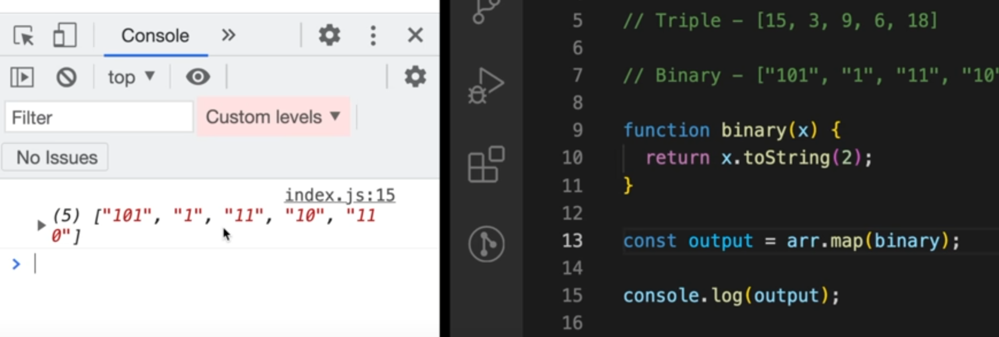
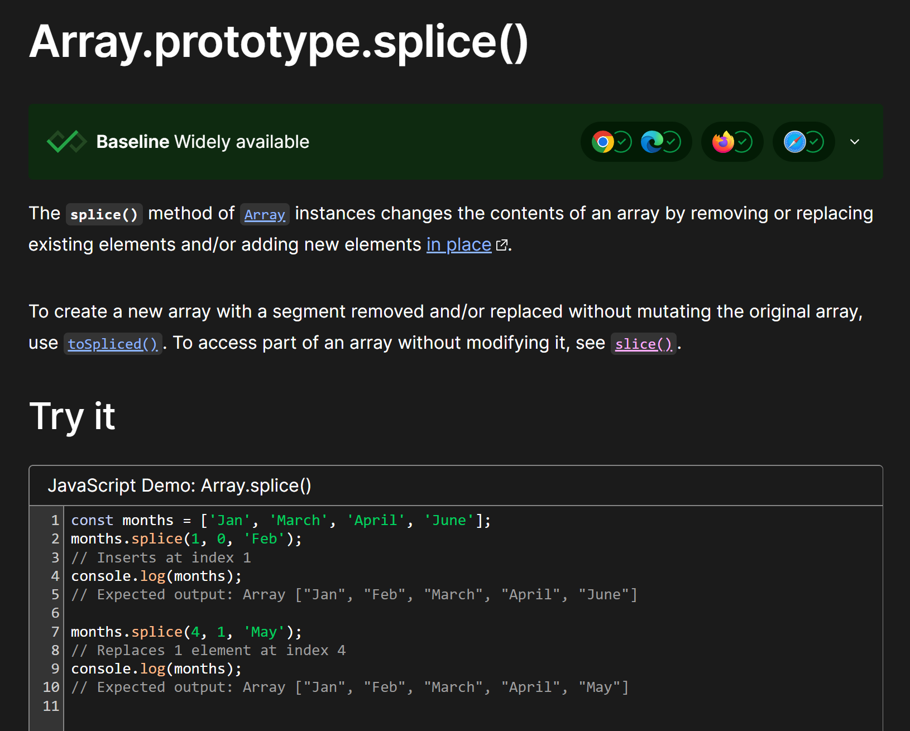

<details >
 <summary style="font-size: x-large; font-weight: bold">Looping through an `Array`</summary>

```javascript
const scores = [22, 54, 76, 92, 43, 33];
```
The `for…in` loop is an easier way to loop through arrays as it gives us the key
```javascript
for (i in scores) {
    console.log(scores[i]);
}
```

The `for...of` Loop iterates over iterable objects such as arrays, sets, maps, strings, and so on. 
It has the same syntax as the for...in loop, but instead of getting the key, 
it gets the element itself.
```javascript
for (score of scores) {
    console.log(score);
}
```

```javascript
scores.forEach((score) => {
    console.log(score);
});
```
Output
```
22
54
76
92
43
33
```

Referred Article: https://www.freecodecamp.org/news/how-to-loop-through-an-array-in-javascript-js-iterate-tutorial/

#### Looping Array fixed number of time in React

```jsx
{
    Array(10).fill(null).map((_, index) => <p key={index}>Hello</p>)
}
```

```jsx
{
    [...Array(10)].map((_, index) => <p key={index}>Hello</p>)
}
```


Right way to update 2-D array


<details >
 <summary style="font-size: medium; font-weight: bold">Good/Tricky Examples</summary>

```js
let score = Array(4).fill(Array(4)).map(a => a.fill(0));
```
This is wrong way to initialize an array.

In this case, you're creating an array with 4 elements using Array(4). Then you use fill(Array(4)) to fill each of those elements with the same array reference (which is [0, 0, 0, 0]). This means all elements in the outer array refer to the same inner array. Finally, you use map to apply fill(0) to each inner array. This fills each inner array with zeros.


#### Right Way to fill 2D Array
```js
let score = Array(4).fill().map(() => Array(4).fill(0));
```
</details >
</details >


<details >
 <summary style="font-size: x-large; font-weight: bold">Sort Array (`sort()`) & Convert to Array (`Array.from()`)</summary>

<details >
 <summary style="font-size: large; font-weight: bold">Sort Array (`sort()`)</summary>


https://developer.mozilla.org/en-US/docs/Web/JavaScript/Reference/Global_Objects/Array/sort

```js
let nums1 = [1,5,2,9,6];
let nums2 = [1,5,2,9,6];

nums1.sort((a, b) => b - a); //[9, 6, 5, 2, 1]
nums2.sort((a, b) => a - b); //[1, 2, 5, 6, 9]
```
</details>


<details >
 <summary style="font-size: large; font-weight: bold">Convert to Array (`Array.from()`)</summary>

The Array.from() static method creates a new, shallow-copied Array instance from an iterable or array-like object.

```js
console.log(Array.from('foo'));
// Expected output: Array ["f", "o", "o"]

console.log(Array.from([1, 2, 3], (x) => x + x));
// Expected output: Array [2, 4, 6]
```

### Map
```js
const map = new Map([
  [1, 2],
  [2, 4],
  [4, 8],
]);
Array.from(map);
// [[1, 2], [2, 4], [4, 8]]

const mapper = new Map([
  ["1", "a"],
  ["2", "b"],
]);
Array.from(mapper.values());
// ['a', 'b'];

Array.from(mapper.keys());
// ['1', '2'];

```

### Set
```js
const set = new Set(["foo", "bar", "baz", "foo"]);
Array.from(set);
// [ "foo", "bar", "baz" ]

```

Note: Spreading a Set has issues when compiled with TypeScript (See issue #8856). It's safer to use `Array.from` above instead.

`const array = [...mySet];`

https://developer.mozilla.org/en-US/docs/Web/JavaScript/Reference/Global_Objects/Array/from
</details>

</details>


<details >
 <summary style="font-size: x-large; font-weight: bold">Object, Map & Set</summary>

1. **Set: The Set object lets you store `unique` values of any type, whether primitive values or object references.**

2. **Map:** The Map object holds key-value pairs and remembers the original insertion order of the keys. Any value (both objects and primitive values) may be used as either a key or a value.

<details >
 <summary style="font-size: large; font-weight: bold">Iterate</summary>

### `Object`
We have three object static methods, which are:

1. `Object.keys()`

2. `Object.values()`

3. `Object.entries()`

```javascript
const population = {
  male: 4,
  female: 93,
  others: 10
};

let populationArr = Object.entries(population);

console.log(populationArr);
```

```
[["male", 4], ["female", 93], ["others", 10]]
```

```javascript
for ([key, value] of populationArr){
  console.log(key);
}
```

Referred Article: https://www.freecodecamp.org/news/how-to-iterate-over-objects-in-javascript/

### `Map`

```js
const frequencyMap = new Map();

// Iterate over map
for (const [key, count] of frequencyMap.entries()) {
   
}
```

### `Set`
For Set objects there is no key like in Map objects. However, to keep the API similar to the Map object, each entry has the same value for its key and value here, so that an array [value, value] is returned.
```js
const set1 = new Set();
set1.add(42);
set1.add('forty two');

const iterator1 = set1.entries();

for (const entry of iterator1) {
  console.log(entry);
  // Expected output: Array [42, 42]
  // Expected output: Array ["forty two", "forty two"]
}
```
</details>

<details >
 <summary style="font-size: large; font-weight: bold">`has()`</summary>

### Map
```js
const map1 = new Map();
map1.set('bar', 'foo');

console.log(map1.has('bar'));
// Expected output: true

console.log(map1.has('baz'));
// Expected output: false
```

### Set
```js
const set1 = new Set([1, 2, 3, 4, 5]);

console.log(set1.has(1));
// Expected output: true

console.log(set1.has(6));
// Expected output: false
```
</details>


<details >
 <summary style="font-size: large; font-weight: bold">`delete()`</summary>

### Map
```js
const map1 = new Map();
map1.set('bar', 'foo');

console.log(map1.delete('bar'));
// Expected result: true
// True indicates successful removal

console.log(map1.has('bar'));
// Expected result: false
```

### Set
```js
const set1 = new Set();
set1.add({ x: 10, y: 20 }).add({ x: 20, y: 30 });

// Delete any point with `x > 10`.
set1.forEach((point) => {
  if (point.x > 10) {
    set1.delete(point);
  }
});

console.log(set1.size);
// Expected output: 1
```
</details>

<details >
 <summary style="font-size: large; font-weight: bold">`set()`, `get()` & `add()`</summary>

### Map
```js
const map1 = new Map();

map1.set('a', 1);
map1.set('b', 2);
map1.set('c', 3);

console.log(map1.get('a'));
// Expected output: 1

map1.set('a', 97);

console.log(map1.get('a'));
// Expected output: 97
```

### Set
```js
const set1 = new Set();

set1.add(42);
set1.add(42);
set1.add(13);

for (const item of set1) {
  console.log(item);
  // Expected output: 42
  // Expected output: 13
}
```
</details>

Map: https://developer.mozilla.org/en-US/docs/Web/JavaScript/Reference/Global_Objects/Map
<br>
Set: https://developer.mozilla.org/en-US/docs/Web/JavaScript/Reference/Global_Objects/Set/add

</details>


<details >
 <summary style="font-size: x-large; font-weight: bold">`typeof()`</summary>


```javascript
typeof([])
// "object"

//Check if an object is an array
Array.isArray([])
```

Referred Article: https://developer.mozilla.org/en-US/docs/Web/JavaScript/Data_structures#bigint_type

</details>


<details >
 <summary style="font-size: x-large; font-weight: bold">map, filter & reduce</summary>

### `map()`



### `filter()`


### `reduce()`

We use reduce whenever we want to reduce an array to a single value.
This single value can be anything like string, number, array, Object,etc.


acc: accumulator
curr: current
second param: initial value of `accumulator`

### Example


Referred Video: https://youtu.be/zdp0zrpKzIE?si=B6N_S7e4XUy7SoOd
</details>


<details >
 <summary style="font-size: x-large; font-weight: bold">Slice, Splice & Split</summary>

### `slice()`


https://developer.mozilla.org/en-US/docs/Web/JavaScript/Reference/Global_Objects/Array/slice

https://developer.mozilla.org/en-US/docs/Web/JavaScript/Reference/Global_Objects/String/slice


### `splice()`


https://developer.mozilla.org/en-US/docs/Web/JavaScript/Reference/Global_Objects/Array/splice

### `split()`


https://developer.mozilla.org/en-US/docs/Web/JavaScript/Reference/Global_Objects/String/split


### `substring()` v/s `slice()`

The choice between `slice()` and `substring()` in JavaScript depends on your specific use case and requirements. Both methods are used to extract a portion of a string, but they have some differences in behavior:

1. **Parameters**:
    - `slice(startIndex, endIndex)`: Accepts two parameters. `startIndex` is the index at which to begin extraction (inclusive), and `endIndex` is the index at which to end extraction (exclusive).
    - `substring(startIndex, endIndex)`: Also accepts two parameters. `startIndex` is the index at which to begin extraction, and `endIndex` is the index at which to end extraction. However, if `startIndex` is greater than `endIndex`, `substring()` will swap the two arguments.

2. **Negative Indices**:
    - `slice()` allows negative indices, which count from the end of the string. For example, `-1` refers to the last character of the string.
    - `substring()` does not accept negative indices. If negative values are provided, it treats them as if they were `0`.

3. **Mutability**:
    - Both methods do not modify the original string; they return a new string.

4. **Compatibility**:
    - `slice()` is part of the ECMAScript standard and is supported in all modern browsers.
    - `substring()` is also widely supported but may behave differently in some older browsers, particularly with negative indices.

Here are some scenarios where you might choose one over the other:

- If you need to extract a substring based on an index range and you want to support negative indices or if you're working with APIs that return negative indices (e.g., `slice(-3)` to get the last 3 characters), then `slice()` is a better choice.
- If you need to ensure that the start index is less than or equal to the end index, and you don't need to handle negative indices, `substring()` could be more convenient because it automatically swaps the indices if necessary.

In general, both methods are quite similar, and the choice between them often comes down to personal preference or specific requirements of the task at hand.
</details>


<details >
 <summary style="font-size: x-large; font-weight: bold">Falsy value </summary>

```js
['', 'products', '1'].filter((x) => x);

// Output: ['products', '1']
```


**Best practice:**

1. To avoid the pitfalls associated with boolean coercion, 
constructions such as `if (variableName)` should only be used when `variableName` 
is known to be a boolean value. For variables of other types, an explicit comparison
is preferred. For example, `if (variableName > 0)` or `if (variableName != undefined)`.
2. 
```js
// Example without the Boolean function
const value = '';

if (value) {
console.log('It is a TRUTHY value');
} else {
console.log('It is a FALSY value');
}

// Example with the Boolean function
const value = ''

if (Boolean(value)) {
console.log('It is a TRUTHY value');
} else {
console.log('It is a FALSY value');
}
```
Both examples do the same thing. But in the second example, it's explicit 
that you're checking the boolean representation of the given value.


### Truthy


</details>


<details >
 <summary style="font-size: x-large; font-weight: bold">Stack, Queue, Shift, Unshift</summary>

- `Push` & `Pop` happens from **END** of the array
- While `Unshift` & `Shift` happens from **BEGINNING** of the array


### Stack
```js
var stack = [];
stack.push(2);       // stack is now [2]
stack.push(5);       // stack is now [2, 5]
var i = stack.pop(); // stack is now [2]
alert(i);            // displays 5 // displays 2
```

### Queue
```js
var queue = [];
queue.push(2);         // queue is now [2]
queue.push(5);         // queue is now [2, 5]
var i = queue.shift(); // queue is now [5]
alert(i);              // displays 2
```
https://www.codecademy.com/article/creating-queues-using-javascript
</details>


<details >
 <summary style="font-size: x-large; font-weight: bold">Spread & Rest Operator</summary>

### Spread Operator

1. Combining Array
```js
const arr1 = [1, 2, 3];
const arr2 = [4, 5, 6];
const combined = [...arr1, ...arr2];
console.log("Combined array:", combined); // [1, 2, 3, 4, 5, 6]
```

2. Passing arguments to function
```js
function sum(a, b, c) {
    return a + b + c;
}

const nums = [1, 2, 3];
const result = sum(...nums);
console.log("Result of sum:", result); // 6
```

3. Copying Array
```js
const original = [1, 2, 3];
const copy = [...original];
console.log("Copied array:", copy); // [1, 2, 3]
```

4. Copying & Overriding in Object
```js
const obj1 = { foo: "bar", x: 42 };
const obj2 = { foo: "baz", y: 13 };

const mergedObj = { x: 41, ...obj1, ...obj2, y: 9 }; // { x: 42, foo: "baz", y: 9 }
```

5. Conditionally adding
```js
const isSummer = false;
const fruits = {
  apple: 10,
  banana: 5,
  ...(isSummer ? { watermelon: 30 } : {}),
};
// { apple: 10, banana: 5 }
```


### Rest Operator

While the spread operator expands elements, the rest operator condenses them into a single entity within function parameters or array destructuring. It collects remaining elements into a designated variable, facilitating flexible function definitions and array manipulation.

1. 
```js
const [first, ...rest] = [1, 2, 3, 4, 5];
console.log("First element:", first); // 1
console.log("Rest of the elements:", rest); // [2, 3, 4, 5]
```

2. Handling Variable-Length Function Arguments
```js
function sum(...numbers) {
    return numbers.reduce((total, num) => total + num, 0);
}

console.log("Sum:", sum(1, 2, 3, 4, 5)); // Sum: 15
console.log("Sum:", sum(10, 20)); // Sum: 30
```

The `...numbers` syntax collects all passed arguments into an array named 
`numbers`, enabling flexible function definitions.
</details>


<details >
 <summary style="font-size: x-large; font-weight: bold">UseFul Fn: Concat</summary>


</details>
