<details >
 <summary style="font-size: x-large; font-weight: bold">Array</summary>

<details>
 <summary style="font-size: large; font-weight: bold">Looping through an `Array`</summary>

```javascript
const scores = [22, 54, 76, 92, 43, 33];
```
The `for…in` loop is an easier way to loop through arrays as it gives us the key
```javascript
for (i in scores) {
    console.log(scores[i]);
}
```

The `for...of` Loop iterates over iterable objects such as arrays, sets, maps, strings, and so on. 
It has the same syntax as the for...in loop, but instead of getting the key, 
it gets the element itself.
```javascript
for (score of scores) {
    console.log(score);
}
```

```javascript
scores.forEach((score) => {
    console.log(score);
});
```
Output
```
22
54
76
92
43
33
```

Referred Article: https://www.freecodecamp.org/news/how-to-loop-through-an-array-in-javascript-js-iterate-tutorial/

#### Looping Array fixed number of time in React

```jsx
{
    Array(10).fill(null).map((_, index) => <p key={index}>Hello</p>)
}
```

```jsx
{
    [...Array(10)].map((_, index) => <p key={index}>Hello</p>)
}
```

</details >


<details >
 <summary style="font-size: large; font-weight: bold">Initialization & Update 2D Array</summary>

#### ✅✅ Right Way to fill 2D Array
```js
let score = Array(4).fill().map(() => Array(4).fill(0));
```

#### ❌❌ Wrong Way to fill 2D Array
```js
let score = Array(4).fill(Array(4)).map(a => a.fill(0));
```


This is wrong way to initialize an array.

In this case, you're creating an array with 4 elements using Array(4). Then you use fill(Array(4)) to fill each of those elements with the same array reference (which is [0, 0, 0, 0]). This means all elements in the outer array refer to the same inner array. Finally, you use map to apply fill(0) to each inner array. This fills each inner array with zeros.
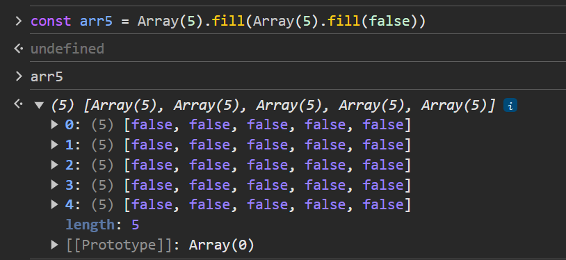

#### ✅ Right way to update 2-D array


---
</details>


<details >
 <summary style="font-size: large; font-weight: bold">Sort Array (`sort()`)</summary>


https://developer.mozilla.org/en-US/docs/Web/JavaScript/Reference/Global_Objects/Array/sort

```js
let nums1 = [1,5,2,9,6];
let nums2 = [1,5,2,9,6];

nums1.sort((a, b) => b - a); //[9, 6, 5, 2, 1]
nums2.sort((a, b) => a - b); //[1, 2, 5, 6, 9]
```

<details >
 <summary style="font-size: medium; font-weight: bold">Alphabetical Sort</summary>

### Alphabetical sort based on one key value
Sorting done here based on `name` key value


Other helpful methods: https://dev.to/sanchithasr/how-to-add-modify-and-delete-javascript-object-literal-properties-49cd

---
</details>

---
</details>


<details >
 <summary style="font-size: large; font-weight: bold">`includes()`, `some()`, `every()`, `indexOf()`, `findIndex()` & `find()`</summary>

1. `.includes()` `Array` `String`
```js
const array1 = [1, 2, 3];

console.log(array1.includes(2));
// Expected output: true

const pets = ['cat', 'dog', 'bat'];

console.log(pets.includes('cat'));
// Expected output: true

console.log(pets.includes('at'));
// Expected output: false
```

2. `Array.prototype.some()` `Function`

The some() method of Array instances tests whether at least one element in the array passes the test implemented by the provided function. It returns true if, in the array, it finds an element for which the provided function returns true; otherwise it returns false. It doesn't modify the array.

```js
const array = [1, 2, 3, 4, 5];

// Checks whether an element is even
const even = (element) => element % 2 === 0;

console.log(array.some(even));
// Expected output: true
```


3. `Array.prototype.every()` `Function`

The every() method of Array instances tests whether all elements in the array pass the test implemented by the provided function. It returns a Boolean value.

```js
const isBelowThreshold = (currentValue) => currentValue < 40;

const array1 = [1, 30, 39, 29, 10, 13];

console.log(array1.every(isBelowThreshold));
// Expected output: true
```

4. `.indexOf()` `Array` `String`
```js
const beasts = ['ant', 'bison', 'camel', 'duck', 'bison'];

console.log(beasts.indexOf('bison'));
// Expected output: 1

// Start from index 2
console.log(beasts.indexOf('bison', 2));
// Expected output: 4

console.log(beasts.indexOf('giraffe'));
// Expected output: -1

const paragraph = "I think Ruth's dog is cuter than your dog!";

const searchTerm = 'dog';
const indexOfFirst = paragraph.indexOf(searchTerm);

console.log(`The index of the first "${searchTerm}" is ${indexOfFirst}`);
// Expected output: "The index of the first "dog" is 15"
```

5. `Array.prototype.findIndex()` `Function`

The findIndex() method of Array instances returns the index of the first element in an array that satisfies the provided testing function. If no elements satisfy the testing function, -1 is returned.
```js
const array1 = [5, 12, 8, 130, 44];

const isLargeNumber = (element) => element > 13;

console.log(array1.findIndex(isLargeNumber));
// Expected output: 3
```

6. `Array.prototype.find()` `Function`

The `find()` method of Array instances returns the **first element** in the provided array that satisfies the provided **testing function**. If **no values satisfy** the testing function, **undefined** is returned.
```js
const array1 = [5, 12, 8, 130, 44];

const found = array1.find((element) => element > 10);

console.log(found);
// Expected output: 12
```

---
</details>


<details >
 <summary style="font-size: large; font-weight: bold">`join()` & `concat()`</summary>

1. `Array.prototype.join()`
   The join() method of Array instances creates and returns a new string by concatenating all of the elements in this array, separated by commas or a specified separator string. If the array has only one item, then that item will be returned without using the separator.
```js
const elements = ['Fire', 'Air', 'Water'];

console.log(elements.join());
// Expected output: "Fire,Air,Water"

console.log(elements.join(''));
// Expected output: "FireAirWater"

console.log(elements.join('-'));
// Expected output: "Fire-Air-Water"
```

2. `Array.prototype.concat()`
```js
const array1 = ['a', 'b', 'c'];
const array2 = ['d', 'e', 'f'];
const array3 = array1.concat(array2);

console.log(array3);
// Expected output: Array ["a", "b", "c", "d", "e", "f"]
```

---
</details>


<details >
 <summary style="font-size: large; font-weight: bold">`fill()`, `flat()`, `reverse()`</summary>

1. `Array.prototype.fill()`
The fill() method of Array instances changes all elements within a range of indices in an array to a static value. It returns the modified array.
```js
const array1 = [1, 2, 3, 4];

// Fill with 0 from position 2 until position 4
console.log(array1.fill(0, 2, 4));
// Expected output: Array [1, 2, 0, 0]

// Fill with 5 from position 1
console.log(array1.fill(5, 1));
// Expected output: Array [1, 5, 5, 5]

console.log(array1.fill(6));
// Expected output: Array [6, 6, 6, 6]
```

2. `Array.prototype.flat()`
```js
const arr1 = [0, 1, 2, [3, 4]];

console.log(arr1.flat());
// expected output: Array [0, 1, 2, 3, 4]

const arr2 = [0, 1, [2, [3, [4, 5]]]];

console.log(arr2.flat());
// expected output: Array [0, 1, 2, Array [3, Array [4, 5]]]

console.log(arr2.flat(2));
// expected output: Array [0, 1, 2, 3, Array [4, 5]]

console.log(arr2.flat(Infinity));
// expected output: Array [0, 1, 2, 3, 4, 5]

```

3. `Array.prototype.reverse()`
```js
const array1 = ['one', 'two', 'three'];
console.log('array1:', array1);
// Expected output: "array1:" Array ["one", "two", "three"]

const reversed = array1.reverse();
console.log('reversed:', reversed);
// Expected output: "reversed:" Array ["three", "two", "one"]

// Careful: reverse is destructive -- it changes the original array.
console.log('array1:', array1);
// Expected output: "array1:" Array ["three", "two", "one"]
```

---
</details>


<details >
 <summary style="font-size: large; font-weight: bold">Convert to Array (`Array.from()`)</summary>

The Array.from() static method creates a new, shallow-copied Array instance from an iterable or array-like object.

```js
console.log(Array.from('foo'));
// Expected output: Array ["f", "o", "o"]

console.log(Array.from([1, 2, 3], (x) => x + x));
// Expected output: Array [2, 4, 6]
```

### Map
```js
const map = new Map([
  [1, 2],
  [2, 4],
  [4, 8],
]);
Array.from(map);
// [[1, 2], [2, 4], [4, 8]]

const mapper = new Map([
  ["1", "a"],
  ["2", "b"],
]);
Array.from(mapper.values());
// ['a', 'b'];

Array.from(mapper.keys());
// ['1', '2'];

```

### Set
```js
const set = new Set(["foo", "bar", "baz", "foo"]);
Array.from(set);
// [ "foo", "bar", "baz" ]

```

Note: Spreading a Set has issues when compiled with TypeScript (See issue #8856). It's safer to use `Array.from` above instead.

`const array = [...mySet];`

https://developer.mozilla.org/en-US/docs/Web/JavaScript/Reference/Global_Objects/Array/from

---
</details>


---
</details>


<details >
 <summary style="font-size: x-large; font-weight: bold">String</summary>

1. `String.prototype.charAt()` & `String.prototype.charCodeAt()`
```js
const sentence = 'The quick brown fox jumps over the lazy dog.';

const index = 4;

console.log(
        `Character code ${sentence.charCodeAt(index)} is equal to ${sentence.charAt(
                index,
        )}`,
);
// Expected output: "Character code 113 is equal to q"
```

2. `String.prototype.replace()` & `String.prototype.replaceAll()`

The original string is left unchanged.

```js
const paragraph = "I think Ruth's dog is cuter than your dog!";

console.log(paragraph.replace("Ruth's", 'my'));
// Expected output: "I think my dog is cuter than your dog!"

const regex = /Dog/i;
console.log(paragraph.replace(regex, 'ferret'));
// Expected output: "I think Ruth's ferret is cuter than your dog!"
```

```js
const paragraph = "I think Ruth's dog is cuter than your dog!";

console.log(paragraph.replaceAll('dog', 'monkey'));
// Expected output: "I think Ruth's monkey is cuter than your monkey!"

// Global flag required when calling replaceAll with regex
const regex = /Dog/gi;
console.log(paragraph.replaceAll(regex, 'ferret'));
// Expected output: "I think Ruth's ferret is cuter than your ferret!"
```
#### Global flag `//g` in regex is required while using `replaceAll`

3. `String.prototype.trim()`, `String.prototype.trimEnd()`, `String.prototype.trimStart()`
```js
const greeting = '   Hello world!   ';

console.log(greeting);
// Expected output: "   Hello world!   ";

console.log(greeting.trim());
// Expected output: "Hello world!";

const greeting = '   Hello world!   ';

console.log(greeting);
// Expected output: "   Hello world!   ";

console.log(greeting.trimEnd());
// Expected output: "   Hello world!";

```

4. `String.prototype.toString()` & `String.prototype.valueOf()`
```js
const stringObj = new String('foo');

console.log(stringObj);
// Expected output: String { "foo" }

console.log(stringObj.toString());
// Expected output: "foo"
```
````js
const stringObj = new String('foo');

console.log(stringObj);
// Expected output: String { "foo" }

console.log(stringObj.valueOf());
// Expected output: "foo"
````

5. `String.prototype.toLowerCase()` & `String.prototype.toUpperCase()`
```js
const sentence = 'The quick brown fox jumps over the lazy dog.';

console.log(sentence.toLowerCase());
// Expected output: "the quick brown fox jumps over the lazy dog."
```

---
</details>


<details >
 <summary style="font-size: x-large; font-weight: bold">Object, Map & Set</summary>

1. **Set: The Set object lets you store `unique` values of any type, whether primitive values or object references.**

2. **Map: Any value (both objects and primitive values) may be used as either a key or a value.**

The main common difference between `Map` or `Set` vs `Object` is that **in `Object` insertion order is not maintained**

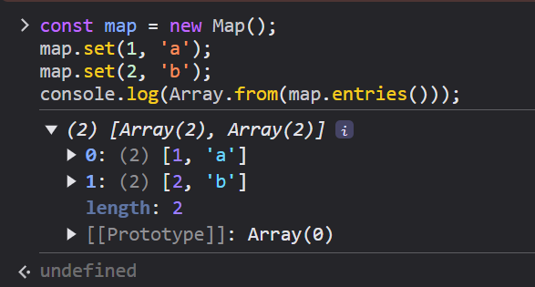
<details >
 <summary style="font-size: large; font-weight: bold">Length</summary>

### 1. Object
```js
var size = Object.keys(myObj).length;
```

### 2. Set
```js
const set1 = new Set();
const object1 = {};

set1.add(42);
set1.add('forty two');
set1.add('forty two');
set1.add(object1);

console.log(set1.size);
// Expected output: 3
```

### 3. Map
```js
const map1 = new Map();

map1.set('a', 'alpha');
map1.set('b', 'beta');
map1.set('g', 'gamma');

console.log(map1.size);
// Expected output: 3
```

---
</details>


<details >
 <summary style="font-size: large; font-weight: bold">Iterate</summary>

### `Object`
We have three object static methods, which are:

1. `Object.keys()`

2. `Object.values()`

3. `Object.entries()`

```javascript
const population = {
  male: 4,
  female: 93,
  others: 10
};

let populationArr = Object.entries(population);

console.log(populationArr);
```

```
[["male", 4], ["female", 93], ["others", 10]]
```

```javascript
for ([key, value] of populationArr){
  console.log(key);
}
```


Referred Article: https://www.freecodecamp.org/news/how-to-iterate-over-objects-in-javascript/

### **Always use below strategy to iterate over `Map` & `Set`**

1. `Map`
```js
const map = new Map();

map.set('a', 1);
map.set('b', ['football', 'basketball']);
map.set('c', {
    1: "Apple",
    2: "Orange"
});

for(let [potato, tomato] of Array.from(map.entries())){
   console.log(potato, tomato)
}
```
2. `Set

```js
const set = new Set();

set.add('a');
set.add({
    1: "Apple",
    2: "Orange"
});

for(let [potato, tomato] of Array.from(set.entries())){
   console.log(potato, tomato)
}
```

Here is good example where any other method might fail:
https://www.greatfrontend.com/questions/javascript/data-selection?list=three-months

### `Map`


### `Set`
For Set objects there is no key like in Map objects. However, to keep the API similar to the Map object, each entry has the same value for its key and value here, so that an array [value, value] is returned.
```js
const set1 = new Set();
set1.add(42);
set1.add('forty two');

const iterator1 = set1.entries();

for (const entry of iterator1) {
  console.log(entry);
  // Expected output: Array [42, 42]
  // Expected output: Array ["forty two", "forty two"]
}
```


---
</details>

<details >
 <summary style="font-size: large; font-weight: bold">`hasOwnProperty()` & `has()`</summary>

The `hasOwnProperty()` method of Object instances returns a boolean indicating whether this object has the specified property as its own property (as opposed to inheriting it).

### Object
```js
const object1 = {};
object1.property1 = 42;

console.log(object1.hasOwnProperty('property1'));
// Expected output: true

console.log(object1.hasOwnProperty('toString'));
// Expected output: false

console.log(object1.hasOwnProperty('hasOwnProperty'));
// Expected output: false
```

### Map
```js
const map1 = new Map();
map1.set('bar', 'foo');

console.log(map1.has('bar'));
// Expected output: true

console.log(map1.has('baz'));
// Expected output: false
```

### Set
```js
const set1 = new Set([1, 2, 3, 4, 5]);

console.log(set1.has(1));
// Expected output: true

console.log(set1.has(6));
// Expected output: false
```

---
</details>


<details >
 <summary style="font-size: large; font-weight: bold">`delete` & `delete()`</summary>

### Object
```js
const Employee = {
  firstname: 'Maria',
  lastname: 'Sanchez',
};

console.log(Employee.firstname);
// Expected output: "Maria"

delete Employee.firstname;

console.log(Employee.firstname);
// Expected output: undefined
```

### Map
```js
const map1 = new Map();
map1.set('bar', 'foo');

console.log(map1.delete('bar'));
// Expected result: true
// True indicates successful removal

console.log(map1.has('bar'));
// Expected result: false
```

### Set
```js
const set1 = new Set();
set1.add({ x: 10, y: 20 }).add({ x: 20, y: 30 });

// Delete any point with `x > 10`.
set1.forEach((point) => {
  if (point.x > 10) {
    set1.delete(point);
  }
});

console.log(set1.size);
// Expected output: 1
```

---
</details>

<details >
 <summary style="font-size: large; font-weight: bold">`set()`, `get()` & `add()`</summary>

### Map
```js
const map1 = new Map();

map1.set('a', 1);
map1.set('b', 2);
map1.set('c', 3);

console.log(map1.get('a'));
// Expected output: 1

map1.set('a', 97);

console.log(map1.get('a'));
// Expected output: 97
```

### Set
```js
const set1 = new Set();

set1.add(42);
set1.add(42);
set1.add(13);

for (const item of set1) {
  console.log(item);
  // Expected output: 42
  // Expected output: 13
}
```

---
</details>

<details >
 <summary style="font-size: large; font-weight: bold">Initialize</summary>


---
</details>


<details >
 <summary style="font-size: large; font-weight: bold">Sort</summary>

### Alphabetical sort based on one key value
Sorting done here based on `name` key value


Other helpful methods: https://dev.to/sanchithasr/how-to-add-modify-and-delete-javascript-object-literal-properties-49cd

---
</details>

Map: https://developer.mozilla.org/en-US/docs/Web/JavaScript/Reference/Global_Objects/Map
<br>
Set: https://developer.mozilla.org/en-US/docs/Web/JavaScript/Reference/Global_Objects/Set/add

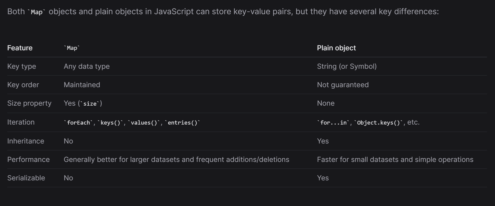

---
</details>


<details >
 <summary style="font-size: x-large; font-weight: bold">`typeof()`, `instanceof`</summary>

### `typeof()`

In JavaScript, a primitive (primitive value, primitive data type) is data that is not an `object` and has no methods or properties. There are 7 primitive data types:


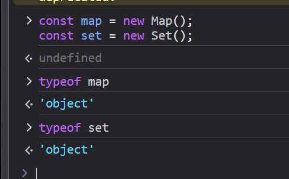
- Most of the time, a primitive value is represented directly at the lowest level of the language implementation.
- All primitive types, except `null` and `undefined`, have their corresponding object wrapper types, which provide useful methods for working with the primitive values. For example, the `Number` object provides methods like `toExponential()`.


```javascript
typeof([])
// "object"

//Check if an object is an array
Array.isArray([])
```

**Everything related to datatype + better way to get all datatype correctly :**
https://www.zhenghao.io/posts/js-data-type

```js
Object.prototype.toString.call({}); // "[object Object]"
Object.prototype.toString.call(1); // "[object Number]"
Object.prototype.toString.call('1'); // "[object String]"
Object.prototype.toString.call(true); // "[object Boolean]"
Object.prototype.toString.call(new String('string')); // "[object String]"
Object.prototype.toString.call(function () {}); // "[object Function]"
Object.prototype.toString.call(null); //"[object Null]"
Object.prototype.toString.call(undefined); //"[object Undefined]"
Object.prototype.toString.call(/123/g); //"[object RegExp]"
Object.prototype.toString.call(new Date()); //"[object Date]"
Object.prototype.toString.call([]); //"[object Array]"
Object.prototype.toString.call(document); //"[object HTMLDocument]"
Object.prototype.toString.call(window); //"[object Window]
```

```js
function getType(obj) {
  const lowerCaseTheFirstLetter = (str) => str[0].toLowerCase() + str.slice(1);
  const type = typeof obj;
  if (type !== 'object') {
    return type;
  }

  return lowerCaseTheFirstLetter(
    Object.prototype.toString.call(obj).replace(/^\[object (\S+)\]$/, '$1')
  );
}

getType([]); // "array"
getType('123'); // "string"
getType(null); // "null"
getType(undefined); // "undefined"
getType(); // "undefined"
getType(function () {}); // "function"
getType(/123/g); // "regExp"
getType(new Date()); // "date"
getType(new Map()); // "map"
getType(new Set()); // "set
```

Referred Article: https://developer.mozilla.org/en-US/docs/Web/JavaScript/Data_structures#bigint_type


### `object`
- Understand that in JavaScript most things are `objects`, and you've probably used objects every time you've touched JavaScript.
- In JavaScript, `objects` are the only mutable values.
- `Functions` are, in fact, also objects with the additional capability of being callable.
```js
const person = {
   name: ["Bob", "Smith"],
   age: 32,
   bio() {
   console.log(`${this.name[0]} ${this.name[1]} is ${this.age} years old.`);
   },
   introduceSelf() {
   console.log(`Hi! I'm ${this.name[0]}.`);
   },
};
```
- An object like this is referred to as an object literal — we've literally written out the object contents as we've come to create it. This is different compared to objects instantiated from classes
- Using object literals is fine when you only need to create one object


```js
function createPerson(name) {
    const obj = {};
    obj.name = name;
    obj.introduceSelf = function () {
        console.log(`Hi! I'm ${this.name}.`);
    };
    return obj;
}

```
- This function creates and returns a new `object` each time we call it. The object will have two members:
  - a property `name`
  - a method `introduceSelf()`.
- We can use `Factory Function`, `Constructor Function` or `Class` for creating objects in much better way

About how functions and objects are related in javascript, consider the following points:

- All non-primitive types are objects in JavaScript.
- All objects directly or indirectly inherit from Object.prototype (unless prototype is changed explicitly using setPrototypeOf).
- All native functions inherit from Function.prototype which inherits from Object.prototype, so it means function indirectly inherits from Object.prototype because functions are treated as objects in JavaScript.
- The reason functions are treated as objects is because they can be passed as parameters to other functions and can be returned from functions i.e. higher order functions(a powerful feature of javascript).
- A function can be called using the () operator because the JavaScript engine knows it is declared using a function keyword and has executable code. So whenever it is called, the JavaScript engine creates a new execution context and set the this binding and then executes the function. None of that happens when you try to call an object instead an error is thrown i.e. "is not a function".

So we can say that not every object is a function because they may have not been declared using the function keyword and not have executable code.

As the function is treated as an object in JavaScript, we can add properties to it, create new objects from it.
A non-function type object cannot be called using () because it does not have executable code and is not declared using the function keyword. Instead, it is declared using new Object() or object notation and contains methods and properties.


More Details:-
- https://developer.mozilla.org/en-US/docs/Learn_web_development/Core/Scripting/Object_basics#introducing_constructors

- https://stackoverflow.com/questions/54861385/is-object-a-function-in-javascript
### `instanceof`
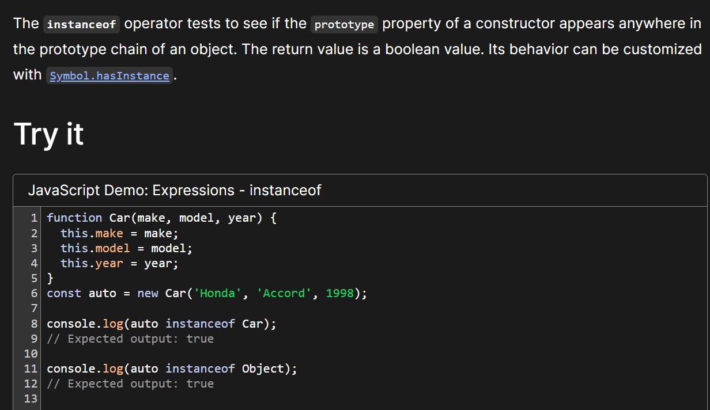

You can also use to check whether a variable is `Promise` or not
```js
function isPromise(value) {
  return value instanceof Promise;
}

const myPromise = new Promise(() => {});
console.log(isPromise(myPromise)); // true
console.log(isPromise("hello")); // false
```

https://developer.mozilla.org/en-US/docs/Web/JavaScript/Reference/Operators/instanceof

---
</details>


<details >
 <summary style="font-size: x-large; font-weight: bold">map, filter & reduce</summary>

### `map()`
The map() method of Array instances `CREATES a NEW ARRAY` populated with the results of calling a provided function on every element in the calling array.


### `filter()`

The filter() method of Array instances creates a `shallow copy of a portion of a given array`, filtered down to just the elements from the given array that pass the test implemented by the provided function.


### `reduce()`

We use reduce whenever we want to reduce an array to a single value.
This single value can be anything like string, number, array, Object,etc.


acc: accumulator
curr: current
second param: initial value of `accumulator`

### Example


Referred Video: https://youtu.be/zdp0zrpKzIE?si=B6N_S7e4XUy7SoOd

```js
const getMax = (a, b) => Math.max(a, b);

// callback is invoked for each element in the array starting at index 0
[1, 100].reduce(getMax, 50); // 100
[50].reduce(getMax, 10); // 50

// callback is invoked once for element at index 1
[1, 100].reduce(getMax); // 100

// callback is not invoked
[50].reduce(getMax); // 50
[].reduce(getMax, 1); // 1

[].reduce(getMax); // TypeError
```
https://developer.mozilla.org/en-US/docs/Web/JavaScript/Reference/Global_Objects/Array/reduce

---
</details>


<details >
 <summary style="font-size: x-large; font-weight: bold">Slice, Splice & Split</summary>

### `slice()`


https://developer.mozilla.org/en-US/docs/Web/JavaScript/Reference/Global_Objects/Array/slice

https://developer.mozilla.org/en-US/docs/Web/JavaScript/Reference/Global_Objects/String/slice


### `splice()`

### Always execute splice function first then assign because it does not return anything 

https://developer.mozilla.org/en-US/docs/Web/JavaScript/Reference/Global_Objects/Array/splice

### `split()`


https://developer.mozilla.org/en-US/docs/Web/JavaScript/Reference/Global_Objects/String/split


### `substring()` v/s `slice()`

The choice between `slice()` and `substring()` in JavaScript depends on your specific use case and requirements. Both methods are used to extract a portion of a string, but they have some differences in behavior:

1. **Parameters**:
    - `slice(startIndex, endIndex)`: Accepts two parameters. `startIndex` is the index at which to begin extraction (inclusive), and `endIndex` is the index at which to end extraction (exclusive).
    - `substring(startIndex, endIndex)`: Also accepts two parameters. `startIndex` is the index at which to begin extraction, and `endIndex` is the index at which to end extraction. However, if `startIndex` is greater than `endIndex`, `substring()` will swap the two arguments.

2. **Negative Indices**:
    - `slice()` allows negative indices, which count from the end of the string. For example, `-1` refers to the last character of the string.
    - `substring()` does not accept negative indices. If negative values are provided, it treats them as if they were `0`.

3. **Mutability**:
    - Both methods do not modify the original string; they return a new string.

4. **Compatibility**:
    - `slice()` is part of the ECMAScript standard and is supported in all modern browsers.
    - `substring()` is also widely supported but may behave differently in some older browsers, particularly with negative indices.

Here are some scenarios where you might choose one over the other:

- If you need to extract a substring based on an index range and you want to support negative indices or if you're working with APIs that return negative indices (e.g., `slice(-3)` to get the last 3 characters), then `slice()` is a better choice.
- If you need to ensure that the start index is less than or equal to the end index, and you don't need to handle negative indices, `substring()` could be more convenient because it automatically swaps the indices if necessary.

In general, both methods are quite similar, and the choice between them often comes down to personal preference or specific requirements of the task at hand.

---
</details>


<details >
 <summary style="font-size: x-large; font-weight: bold">Falsy value & Sparse Array </summary>

### Falsy value
```js
['', 'products', '1'].filter((x) => x);

// Output: ['products', '1']
```


**Best practice:**

1. To avoid the pitfalls associated with boolean coercion, 
constructions such as `if (variableName)` should only be used when `variableName` 
is known to be a boolean value. For variables of other types, an explicit comparison
is preferred. For example, `if (variableName > 0)` or `if (variableName != undefined)`.
2. 
```js
// Example without the Boolean function
const value = '';

if (value) {
console.log('It is a TRUTHY value');
} else {
console.log('It is a FALSY value');
}

// Example with the Boolean function
const value = ''

if (Boolean(value)) {
console.log('It is a TRUTHY value');
} else {
console.log('It is a FALSY value');
}
```
Both examples do the same thing. But in the second example, it's explicit 
that you're checking the boolean representation of the given value.


### Truthy


### Sparse Array

```js
const sparseArr = [1,,0,"",null,undefined]
```

If we just want to skip not defined values in sparse array
then use `Object.hasOwn(sparseArr, index)` like shown in below.

Any other way will skip other values like `null`, `undefined` etc.


### `Object.hasOwn()`

The `Object.hasOwn()` static method returns `true` if the specified object has the indicated property as its own property. If the property is inherited, or does not exist, the method returns `false`.

```js
const object1 = {
  prop: 'exists',
};

console.log(Object.hasOwn(object1, 'prop'));
// Expected output: true

console.log(Object.hasOwn(object1, 'toString'));
// Expected output: false

console.log(Object.hasOwn(object1, 'undeclaredPropertyValue'));
// Expected output: false
```

```js
const example = {};
Object.hasOwn(example, "prop"); // false - 'prop' has not been defined

example.prop = "exists";
Object.hasOwn(example, "prop"); // true - 'prop' has been defined

example.prop = null;
Object.hasOwn(example, "prop"); // true - own property exists with value of null

example.prop = undefined;
Object.hasOwn(example, "prop"); // true - own property exists with value of undefined
```
https://developer.mozilla.org/en-US/docs/Web/JavaScript/Reference/Global_Objects/Object/hasOwn

---
</details>


<details >
 <summary style="font-size: x-large; font-weight: bold">Stack, Queue, Shift, Unshift</summary>

- `Push` & `Pop` happens from **END** of the array
- While `Unshift` & `Shift` happens from **BEGINNING** of the array


### Stack
```js
var stack = [];
stack.push(2);       // stack is now [2]
stack.push(5);       // stack is now [2, 5]
var i = stack.pop(); // stack is now [2]
alert(i);            // displays 5 // displays 2
```

### Queue
```js
var queue = [];
queue.push(2);         // queue is now [2]
queue.push(5);         // queue is now [2, 5]
var i = queue.shift(); // queue is now [5]
alert(i);              // displays 2
```
https://www.codecademy.com/article/creating-queues-using-javascript

---
</details>


<details >
 <summary style="font-size: x-large; font-weight: bold">Spread & Rest Operator</summary>

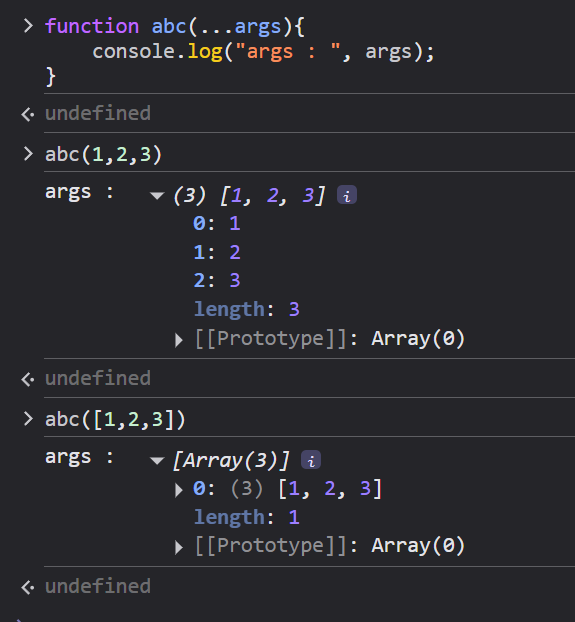

### Spread Operator

1. Combining Array
```js
const arr1 = [1, 2, 3];
const arr2 = [4, 5, 6];
const combined = [...arr1, ...arr2];
console.log("Combined array:", combined); // [1, 2, 3, 4, 5, 6]
```

2. Passing arguments to function
```js
function sum(a, b, c) {
    return a + b + c;
}

const nums = [1, 2, 3];
const result = sum(...nums);
console.log("Result of sum:", result); // 6
```

3. Copying Array
```js
const original = [1, 2, 3];
const copy = [...original];
console.log("Copied array:", copy); // [1, 2, 3]
```

4. Copying & Overriding in Object
```js
const obj1 = { foo: "bar", x: 42 };
const obj2 = { foo: "baz", y: 13 };

const mergedObj = { x: 41, ...obj1, ...obj2, y: 9 }; // { x: 42, foo: "baz", y: 9 }
```

5. Conditionally adding
```js
const isSummer = false;
const fruits = {
  apple: 10,
  banana: 5,
  ...(isSummer ? { watermelon: 30 } : {}),
};
// { apple: 10, banana: 5 }
```


### Rest Operator

While the spread operator expands elements, the rest operator condenses them into a single entity within function parameters or array destructuring. It collects remaining elements into a designated variable, facilitating flexible function definitions and array manipulation.

1. 
```js
const [first, ...rest] = [1, 2, 3, 4, 5];
console.log("First element:", first); // 1
console.log("Rest of the elements:", rest); // [2, 3, 4, 5]
```

2. Handling Variable-Length Function Arguments
```js
function sum(...numbers) {
    return numbers.reduce((total, num) => total + num, 0);
}

console.log("Sum:", sum(1, 2, 3, 4, 5)); // Sum: 15
console.log("Sum:", sum(10, 20)); // Sum: 30
```

The `...numbers` syntax collects all passed arguments into an array named 
`numbers`, enabling flexible function definitions.

---
</details>


<details >
 <summary style="font-size: x-large; font-weight: bold">Math Functions</summary>

https://developer.mozilla.org/en-US/docs/Web/JavaScript/Reference/Global_Objects/Math/abs

1. `Math.abs()`
```js
function difference(a, b) {
  return Math.abs(a - b);
}

console.log(difference(3, 5));
// Expected output: 2

console.log(difference(5, 3));
// Expected output: 2

console.log(difference(1.23456, 7.89012));
// Expected output: 6.6555599999999995
```

2. `Math.ceil()`
```js
console.log(Math.ceil(0.95));
// Expected output: 1

console.log(Math.ceil(4));
// Expected output: 4

console.log(Math.ceil(7.004));
// Expected output: 8

console.log(Math.ceil(-7.004));
// Expected output: -7
```

3. `Math.floor()`
```js
console.log(Math.floor(5.95));
// Expected output: 5

console.log(Math.floor(5.05));
// Expected output: 5

console.log(Math.floor(5));
// Expected output: 5

console.log(Math.floor(-5.05));
// Expected output: -6
```

4. `Math.max()`
```js
console.log(Math.max(1, 3, 2));
// Expected output: 3

console.log(Math.max(-1, -3, -2));
// Expected output: -1

const array1 = [1, 3, 2];

console.log(Math.max(...array1));
// Expected output: 3
```

5. `Math.pow()`
```js
console.log(Math.pow(7, 3));
// Expected output: 343

console.log(Math.pow(4, 0.5));
// Expected output: 2

console.log(Math.pow(7, -2));
// Expected output: 0.02040816326530612
//                  (1/49)

console.log(Math.pow(-7, 0.5));
// Expected output: NaN
```

6. `Math.random()`
```js
function getRandomInt(max) {
  return Math.floor(Math.random() * max);
}

console.log(getRandomInt(3));
// Expected output: 0, 1 or 2

console.log(getRandomInt(1));
// Expected output: 0

console.log(Math.random());
// Expected output: a number from 0 to <1
```

7. `Math.round()`
   The Math.round() static method returns the value of a number rounded to the nearest integer.
```js
console.log(Math.round(0.9));
// Expected output: 1

console.log(Math.round(5.95), Math.round(5.5), Math.round(5.05));
// Expected output: 6 6 5

console.log(Math.round(-5.05), Math.round(-5.5), Math.round(-5.95));
// Expected output: -5 -5 -6
```

8. `Math.sqrt()`
```js
function calcHypotenuse(a, b) {
  return Math.sqrt(a * a + b * b);
}

console.log(calcHypotenuse(3, 4));
// Expected output: 5

console.log(calcHypotenuse(5, 12));
// Expected output: 13

console.log(calcHypotenuse(0, 0));
// Expected output: 0
```

---
</details>


<details >
 <summary style="font-size: x-large; font-weight: bold">Date & Time</summary>

### 1. Create a Date Object

```js
const today = new Date();
const birthday = new Date("December 17, 1995 03:24:00"); // DISCOURAGED: may not work in all runtimes
const birthday2 = new Date("1995-12-17T03:24:00"); // This is standardized and will work reliably
const birthday3 = new Date(1995, 11, 17); // the month is 0-indexed
const birthday4 = new Date(1995, 11, 17, 3, 24, 0);
const birthday5 = new Date(628021800000); // passing epoch timestamp
```

### 2. Formats of toString method return values

```js
const date = new Date("2020-05-12T23:50:21.817Z");
date.toString(); // Tue May 12 2020 18:50:21 GMT-0500 (Central Daylight Time)
date.toDateString(); // Tue May 12 2020
date.toTimeString(); // 18:50:21 GMT-0500 (Central Daylight Time)
date[Symbol.toPrimitive]("string"); // Tue May 12 2020 18:50:21 GMT-0500 (Central Daylight Time)

date.toISOString(); // 2020-05-12T23:50:21.817Z
date.toJSON(); // 2020-05-12T23:50:21.817Z

date.toUTCString(); // Tue, 12 May 2020 23:50:21 GMT

date.toLocaleString(); // 5/12/2020, 6:50:21 PM
date.toLocaleDateString(); // 5/12/2020
date.toLocaleTimeString(); // 6:50:21 PM

```


### 3. To get Date, Month and Year or Time
```js
const date = new Date("2000-01-17T16:45:30");
const [month, day, year] = [
  date.getMonth(),
  date.getDate(),
  date.getFullYear(),
];
// [0, 17, 2000] as month are 0-indexed
const [hour, minutes, seconds] = [
  date.getHours(),
  date.getMinutes(),
  date.getSeconds(),
];
// [16, 45, 30]

```


### 4. Calculating elapsed time
```js
// Using Date objects
const start = Date.now();

// The event to time goes here:
doSomethingForALongTime();
const end = Date.now();
const elapsed = end - start; // elapsed time in milliseconds
```

```js
// Using built-in methods
const start = new Date();

// The event to time goes here:
doSomethingForALongTime();
const end = new Date();
const elapsed = end.getTime() - start.getTime(); // elapsed time in milliseconds
```

```js
// To test a function and get back its return
function printElapsedTime(testFn) {
  const startTime = Date.now();
  const result = testFn();
  const endTime = Date.now();

  console.log(`Elapsed time: ${String(endTime - startTime)} milliseconds`);
  return result;
}

const yourFunctionReturn = printElapsedTime(yourFunction);
```

Referred from: https://developer.mozilla.org/en-US/docs/Web/JavaScript/Reference/Global_Objects/Date


<details >
 <summary style="font-size: medium; font-weight: bold">Flight Booker Example</summary>


```jsx
import { useState } from 'react';

const TODAY = formatDate(new Date());
const DAY_IN_SECONDS = 24 * 60 * 60 * 1000;

function formatDate(date) {
  const year = date.getFullYear();
  const month = (date.getMonth() + 1)
    .toString()
    .padStart(2, '0');
  const day = date.getDate().toString().padStart(2, '0');

  return [year, month, day].join('-');
}

export default function App() {
  const [flightOption, setFlightOption] =
    useState('one-way');
  const [departureDate, setDepartureDate] = useState(
    formatDate(new Date(Date.now() + DAY_IN_SECONDS)), // Tomorrow.
  );
  const [returnDate, setReturnDate] =
    useState(departureDate);

  function submitForm(event) {
    event.preventDefault();
    if (flightOption === 'one-way') {
      alert(
        `You have booked a one-way flight on ${departureDate}`,
      );
      return;
    }

    alert(
      `You have booked a return flight, departing on ${departureDate} and returning on ${returnDate}`,
    );
  }

  return (
    <div>
      <form className="flight-booker" onSubmit={submitForm}>
        <select
          value={flightOption}
          onChange={(event) => {
            setFlightOption(event.target.value);
          }}>
          <option value="one-way">One-way flight</option>
          <option value="return">Return flight</option>
        </select>
        <input
          aria-label="Departure date"
          type="date"
          value={departureDate}
          onChange={(event) => {
            setDepartureDate(event.target.value);
          }}
          min={TODAY}
        />
        {flightOption === 'return' && (
          <input
            aria-label="Return date"
            type="date"
            value={returnDate}
            min={departureDate}
            onChange={(event) => {
              setReturnDate(event.target.value);
            }}
          />
        )}
        <button>Book</button>
      </form>
    </div>
  );
}
```

---
</details>

---
</details>


<details >
 <summary style="font-size: x-large; font-weight: bold">UseFul Info</summary>

1. Create MAX & MIN number
```js
let n = Infinity;
let m = -Infinity;
```
```js
console.log(0*Infinity); /* NaN */
console.log(Infinity); /* Infinity */
console.log(Infinity + 1); /* Infinity */
console.log(Math.pow(10, 1000)); /* Infinity */
console.log(Math.log(0)); /* -Infinity */
console.log(1 / Infinity); /* 0 */
console.log(1 / 0); /* Infinity */
```

2. Number formatting is tricky:
   1. `Number()` constructor: converts a value into a number or NaN if not possible. note that this returns `Number(anyFalseyValue)` gives `0`, so we need to differentiate the empty string case from a real `0`.
   2. `Number.IsNaN()`: determine if a value is a number.


3. `toFixed()` &  `parseFloat()`

4. **Switch Statement**
```js
const expr = 'Papayas';
switch (expr) {
  case 'Oranges':
    console.log('Oranges are $0.59 a pound.');
    break;
  case 'Mangoes':
  case 'Papayas':
    console.log('Mangoes and papayas are $2.79 a pound.');
    // Expected output: "Mangoes and papayas are $2.79 a pound."
    break;
  default:
    console.log(`Sorry, we are out of ${expr}.`);
}
```

5. `isPlainObject(value)`  Plain Old JavaScript Object (POJO)

Return `true` if value is a plain object, false otherwise (for **arrays**, **functions**, etc).

There are two types of plain objects:
1. Objects without prototypes, created using `Object.create(null)`s.
2. Object defined using literals (e.g. `let a = {}`).

To check for the first case, `Object.getPrototypeOf(value)` will be exactly `null`. To check for the second case, we can use the constructor of its prototype, similar to how we check if an object is an `Array`.

```js
function isPlainObject(value) {
  // For null and undefined.
  if (value == null) {
    return false;
  }

  const prototype = Object.getPrototypeOf(value);
  return prototype === null || prototype === Object.prototype;
}
```
This useful when we want to discard `Set`, `Map`, `Array` etc which are also Object type.


6. **Symbols**
   Symbols in JavaScript are a new primitive data type introduced in ES6 (ECMAScript 2015). They are `unique and immutable identifiers` that is primarily for object property keys to avoid name collisions. These values can be created using Symbol(...) function, and each Symbol value is guaranteed to be unique, even if they have the same key/description. Symbol properties are not enumerable in for...in loops or Object.keys(), making them suitable for creating private/internal object state.

```js
const sym1 = Symbol();
const sym2 = Symbol("foo");
const sym3 = Symbol("foo");
Symbol("foo") === Symbol("foo"); // false
```
https://developer.mozilla.org/en-US/docs/Web/JavaScript/Reference/Global_Objects/Symbol
https://www.greatfrontend.com/questions/quiz/what-are-symbols-used-for


7. **Deep Clone**

i. 
```js
export default function deepClone(value) {
  return JSON.parse(JSON.stringify(value));
}
```
- Recursive data structures: `JSON.stringify()` will throw when you give it a recursive data structure. This can happen quite easily when working with linked lists or trees.
- Built-in types: `JSON.stringify()` will throw if the value contains other JS built-ins like `Map`, `Set`, `Date`, `RegExp` or `ArrayBuffer`.
- Functions: `JSON.stringify()` will quietly discard functions.

ii.
```js
const myDeepCopy = structuredClone(myOriginal);
```
https://www.greatfrontend.com/questions/javascript/deep-clone

---
</details>


<details >
 <summary style="font-size: x-large; font-weight: bold">Regex</summary>

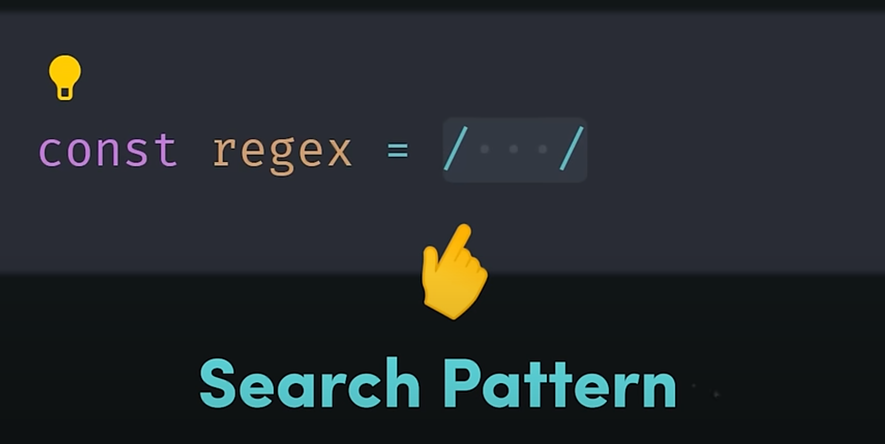

1. Below will just find first match
```js
const regex = /bob/
```

2. Below will find all matches in a string
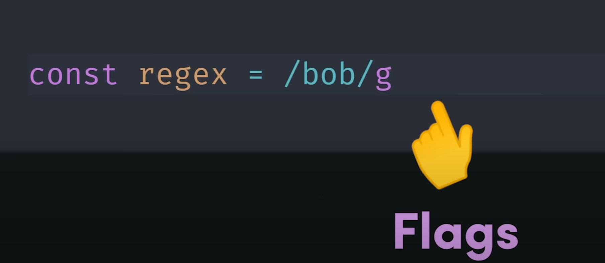

We can add additional `Flags` as per our need
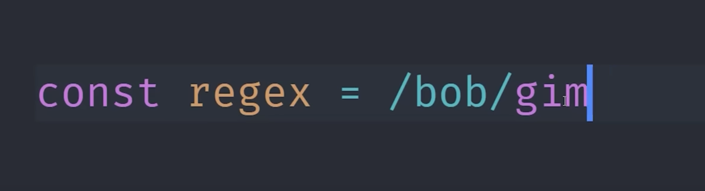

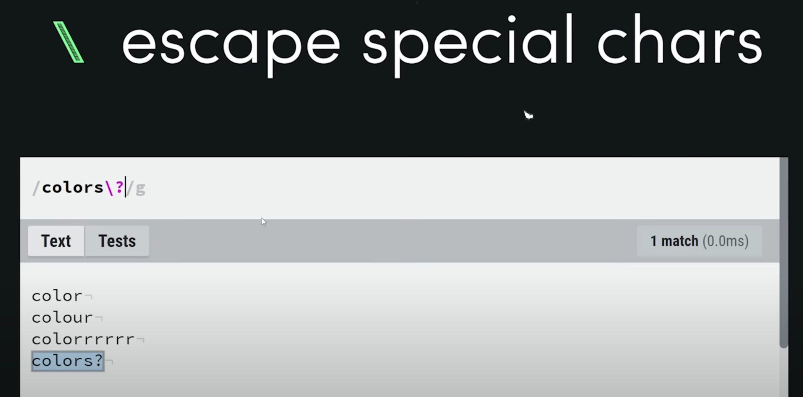
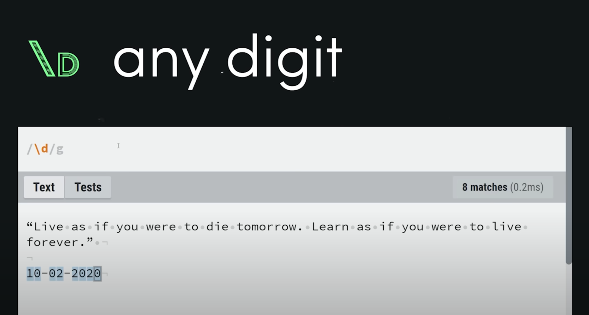
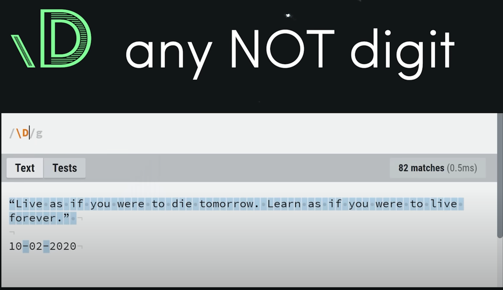
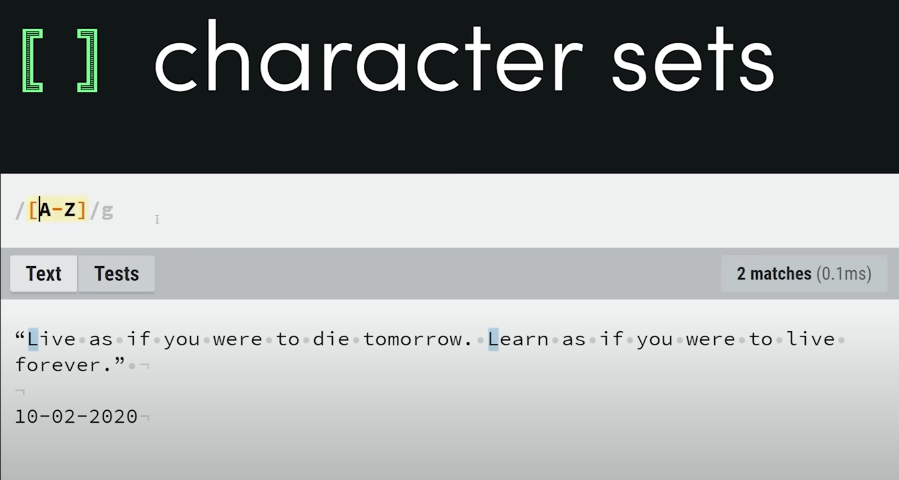
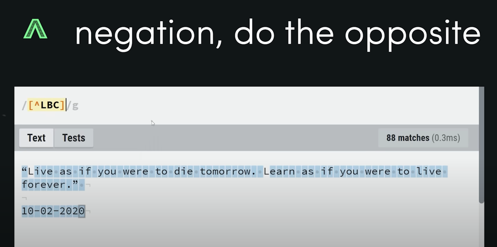

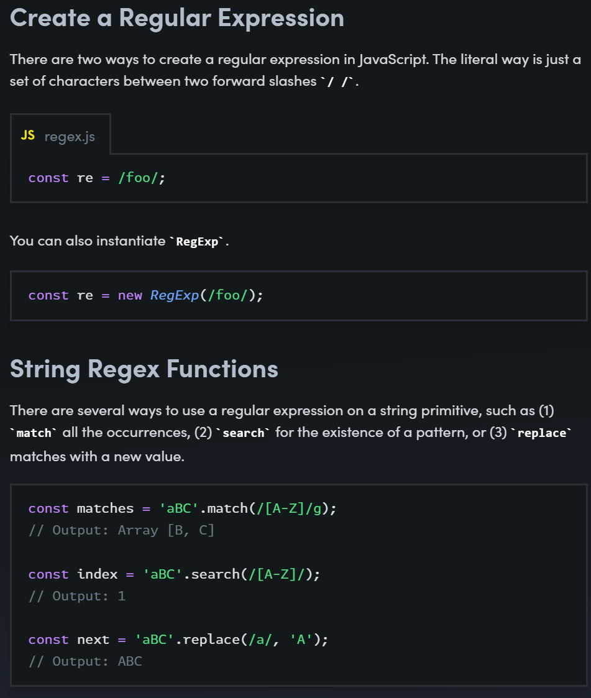.
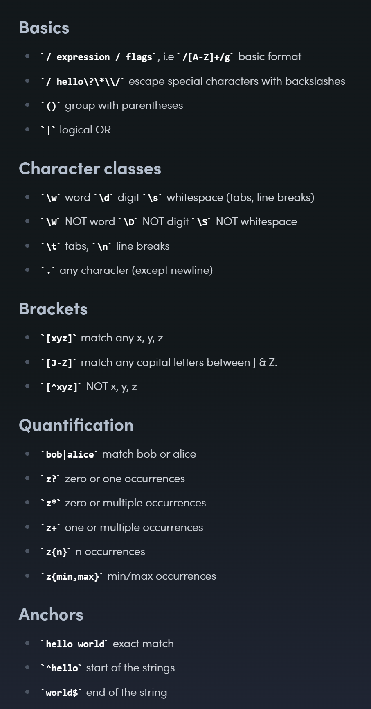

Reference: https://fireship.io/lessons/regex-cheat-sheet-js/

---
</details>


<details >
 <summary style="font-size: x-large; font-weight: bold">Things to Pay Attention while Solving Questions</summary>

1. Always return `this` in any function **CHAIN** type of question
   1. Good Example 1: [3-short-questions/greatFrontEnd/07-jQuery.css](../../3-short-questions/greatFrontEnd/code.md#07)
   2. Good Example 2: [3-short-questions/general/01](../../3-short-questions/general/code.md#01)
2. Read question properly before solving 
3. While any questions always first think about what you need to return like a `function`, `Promise`, `object` etc. Once you know then just write that first then think about anything else
4. Put console.log start debugging don't spend time looking at code again and again
3. Go thorough given testcase to get hint. Don't keep spending time by reading question again and again
4. Be calm and try to give answer slowly but correctly. It will save lot of time as interviewer will understood your answer easily and no cross question because of not able to understand. Also, it looks good to get answer correct in one go. Don't panic if wrong then again think and answer slowly

---
</details>
