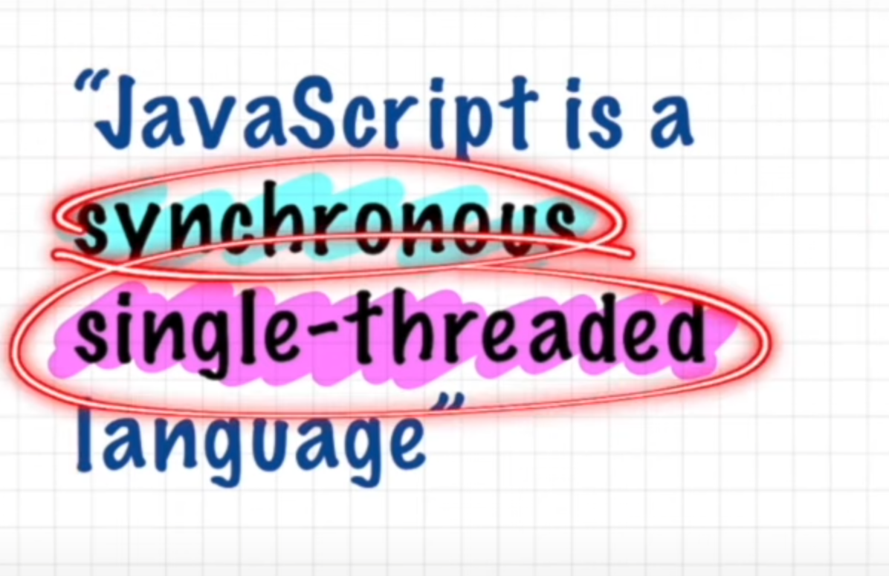
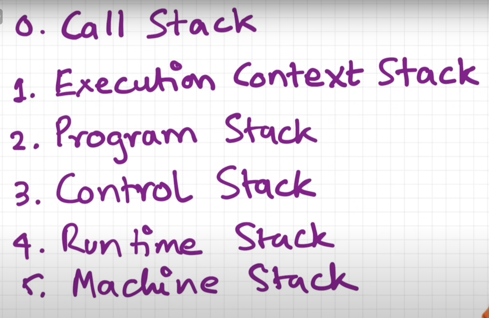
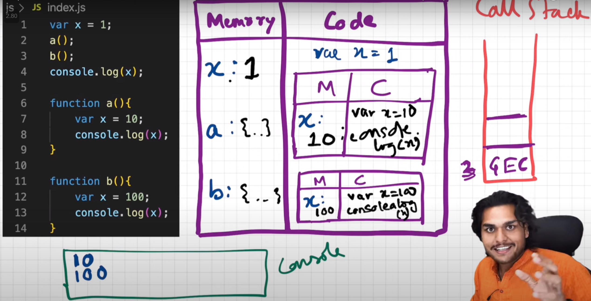

## Execution Context & Call Stack




Below is how every code run on javascript engine, we create
`Execution Context` which is maintained by `Call Stack`

First we have **Memory Creation Phase** 👇🏻
<br>
`square` function has exact code stored in `Memory`


Second we have **Code Execution Phase**
<br>
Here we allocate value to `n` & for `square2` function is invoked
and again we start with `Memory Creation Phase` for `square2`


Once `square2` function is done executing, we assign return value to `square2`
and `Execution context` of `square2` is removed from `call stack`


Final state when everything is done👇🏻


Other names of `call stack`


Referred Video: https://youtu.be/iLWTnMzWtj4?si=p4HnXVWvBMZVNnf-


<details >
 <summary style="font-size: x-large; font-weight: bold">Hoisting</summary>


Hoisting can be easily explained once we understand 
`Execution Context` and `Call Stack`

Hoisting is very good example to understand `Execution Context` and `Call Stack`

Referred Video: https://youtu.be/Fnlnw8uY6jo?si=OhllLmcreDPizLTg

## How `function` works & `Variable Environment`




Referred Video: https://youtu.be/gSDncyuGw0s?si=HEtpY-xlWwKfQBgJ

## `window` & `this`


Referred Video: https://youtu.be/QCRpVw2KXf8?si=TWgw76S-loHhUkoQ


## TL;DR

Hoisting is a JavaScript mechanism where variable and function declarations are moved ("hoisted") to the top of their containing scope during the compile phase.

- **Variable declarations (`var`)**: Declarations are hoisted, but not initializations. The value of the variable is `undefined` if accessed before initialization.
- **Variable declarations (`let` and `const`)**: Declarations are hoisted, but not initialized. Accessing them results in `ReferenceError` until the actual declaration is encountered.
- **Function expressions (`var`)**: Declarations are hoisted, but not initializations. The value of the variable is `undefined` if accessed before initialization.
- **Function declarations (`function`)**: Both declaration and definition are fully hoisted.
- **Class declarations (`class`)**: Declarations are hoisted, but not initialized. Accessing them results in `ReferenceError` until the actual declaration is encountered.
- **Import declarations (`import`)**: Declarations are hoisted, and side effects of importing the module are executed before the rest of the code.

The following behavior summarizes the result of accessing the variables before they are declared.

| Declaration                    | Accessing before declaration |
| ------------------------------ | ---------------------------- |
| `var foo`                      | `undefined`                  |
| `let foo`                      | `ReferenceError`             |
| `const foo`                    | `ReferenceError`             |
| `class Foo`                    | `ReferenceError`             |
| `var foo = function() { ... }` | `undefined`                  |
| `function foo() { ... }`       | Normal                       |
| `import`                       | Normal                       |

---

## Hoisting

Hoisting is a term used to explain the behavior of variable declarations in JavaScript code.

Variables declared or initialized with the `var` keyword will have their declaration "moved" up to the top of their containing scope during compilation, which we refer to as hoisting.

Only the declaration is hoisted, the initialization/assignment (if there is one), will stay where it is. Note that the declaration is not actually moved – the JavaScript engine parses the declarations during compilation and becomes aware of variables and their scopes, but it is easier to understand this behavior by visualizing the declarations as being "hoisted" to the top of their scope.

Let's explain with a few code samples. Note that the code for these examples should be executed within a module scope instead of being entered line by line into a REPL like the browser console.

### Hoisting of variables declared using `var`

Hoisting is seen in action here as even though `foo` is declared and initialized after the first `console.log()`, the first `console.log()` prints the value of `foo` as `undefined`.

```js
console.log(foo); // undefined
var foo = 1;
console.log(foo); // 1
```

You can visualize the code as:

```js
var foo;
console.log(foo); // undefined
foo = 1;
console.log(foo); // 1
```

### Hoisting of variables declared using `let`, `const`, and `class`

Variables declared via `let`, `const`, and `class` are hoisted as well. However, unlike `var` and `function`, they are not initialized and accessing them before the declaration will result in a `ReferenceError` exception. The variable is in a "temporal dead zone" from the start of the block until the declaration is processed.

```js
y; // ReferenceError: Cannot access 'y' before initialization
let y = 'local';
```

```js
z; // ReferenceError: Cannot access 'z' before initialization
const z = 'local';
```

```js
Foo; // ReferenceError: Cannot access 'Foo' before initialization

class Foo {
  constructor() {}
}
```

### Hoisting of function expressions

Function expressions are functions written in the form of variable declarations. Since they are also declared using `var`, only the variable declaration is hoisted.

```js
console.log(bar); // undefined
bar(); // Uncaught TypeError: bar is not a function

var bar = function () {
  console.log('BARRRR');
};
```

### Hoisting of function declarations

Function declarations use the `function` keyword. Unlike function expressions, function declarations have both the declaration and definition hoisted, thus they can be called even before they are declared.

```js
console.log(foo); // [Function: foo]
foo(); // 'FOOOOO'

function foo() {
  console.log('FOOOOO');
}
```

The same applies to generators (`function*`), async functions (`async function`), and async function generators (`async function*`).

### Hoisting of `import` statements

Import declarations are hoisted. The identifiers the imports introduce are available in the entire module scope, and their side effects are produced before the rest of the module's code runs.

```js
foo.doSomething(); // Works normally.

import foo from './modules/foo';
```

## Under the hood

In reality, JavaScript creates all variables in the current scope before it even tries to execute the code. Variables created using `var` keyword will have the value of `undefined` where variables created using `let` and `const` keywords will be marked as `<value unavailable>`. Thus, accessing them will cause a `ReferenceError` preventing you to access them before initialization.

In ECMAScript specifications `let` and `const` declarations are [explained as below](https://tc39.es/ecma262/#sec-let-and-const-declarations):

> The variables are created when their containing Environment Record is instantiated but may not be accessed in any way until the variable's LexicalBinding is evaluated.

However, this statement is [a little different for the `var` keyword](https://tc39.es/ecma262/#sec-variable-statement):

> Var variables are created when their containing Environment Record is instantiated and are initialized to `undefined` when created.

## Modern practices

In practice, modern code bases avoid using `var` and use `let` and `const` exclusively. It is recommended to declare and initialize your variables and import statements at the top of the containing scope/module to eliminate the mental overhead of tracking when a variable can be used.

ESLint is a static code analyzer that can find violations of such cases with the following rules:

- [`no-use-before-define`](https://eslint.org/docs/latest/rules/no-use-before-define): This rule will warn when it encounters a reference to an identifier that has not yet been declared.
- [`no-undef`](https://eslint.org/docs/latest/rules/no-undef): This rule will warn when it encounters a reference to an identifier that has not yet been declared.

## Further reading

- [Hoisting | MDN](https://developer.mozilla.org/en-US/docs/Glossary/Hoisting)
- [JavaScript Visualized: Hoisting](https://dev.to/lydiahallie/javascript-visualized-hoisting-478h)
---
</details>
