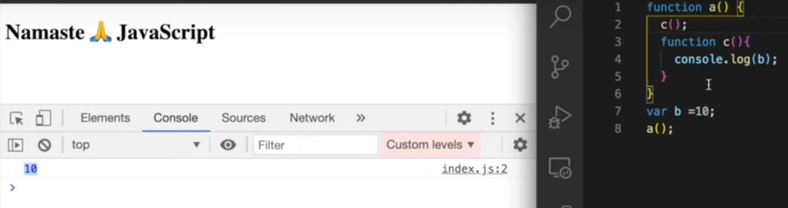
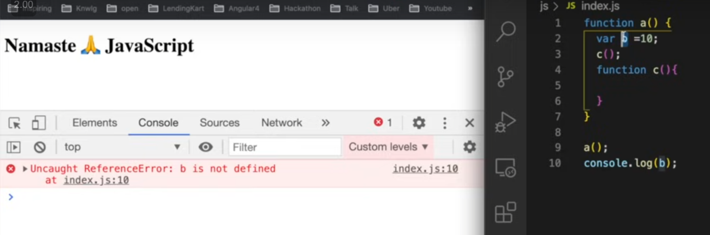
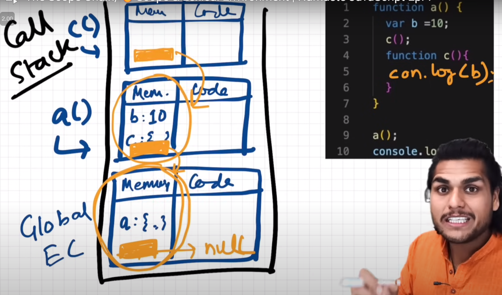

## Lexical Environment

1. Here _yellow_ part is `lexical` environment of its parent
2. `Lexical` environment is created whenever a `execution context` is created
3. `Lexical` environment is **local env + reference to lexical environment of its parent**

## Scope Chain

This chain of `lexical` environment is called `scope chain`.
So every time a variable is first checked in its local environment
and if it is not found then it will check in its parent lexical environment
and so on.

Referred Video: https://youtu.be/uH-tVP8MUs8?si=nu2zD3kule3JGmpy

