## `var`, `let` & `const`

Variables declared using the `var` keyword are scoped to the function in which they are created, or if created outside of any function, to the global object. `let` and `const` are _block scoped_, meaning they are only accessible within the nearest set of curly braces (function, if-else block, or for-loop).

```js
function foo() {
  // All variables are accessible within functions.
  var bar = 'bar';
  let baz = 'baz';
  const qux = 'qux';

  console.log(bar); // bar
  console.log(baz); // baz
  console.log(qux); // qux
}

console.log(bar); // ReferenceError: bar is not defined
console.log(baz); // ReferenceError: baz is not defined
console.log(qux); // ReferenceError: qux is not defined
```

```js
if (true) {
  var bar = 'bar';
  let baz = 'baz';
  const qux = 'qux';
}

// var declared variables are accessible anywhere in the function scope.
console.log(bar); // bar
// let and const defined variables are not accessible outside of the block they were defined in.
console.log(baz); // ReferenceError: baz is not defined
console.log(qux); // ReferenceError: qux is not defined
```

`var` ,`let` and `const` declared variables are all hoisted. `var` declared variables are auto-initialised with an undefined value. However, `let` and `const` variables are not initialised and accessing them before the declaration will result in a `ReferenceError` exception because they are in a **"temporal dead zone"** from the start of the block until the declaration is processed.

```js
console.log(foo); // undefined

var foo = 'foo';

console.log(baz); // ReferenceError: can't access lexical declaration 'baz' before initialization

let baz = 'baz';

console.log(bar); // ReferenceError: can't access lexical declaration 'bar' before initialization

const bar = 'bar';
```

Redeclaring a variable with `var` will not throw an error, but `let` and `const` will.

```js
var foo = 'foo';
var foo = 'bar';
console.log(foo); // "bar"

let baz = 'baz';
let baz = 'qux'; // Uncaught SyntaxError: Identifier 'baz' has already been declared
```

`let` and `const` differ in that `let` allows reassigning the variable's value while `const` does not.

```js
// This is fine.
let foo = 'foo';
foo = 'bar';

// This causes an exception.
const baz = 'baz';
baz = 'qux';
```

### Notes

- Since most browsers support `let` and `const` these days, using `var` is no longer recommended. If you need to target older browsers, write your code using `let`, and use a transpiler like Babel to compile your code to older syntax.

Good in-depth video: https://youtu.be/BNC6slYCj50?si=Olv9qeCAtFbArgl6

## Block Scope
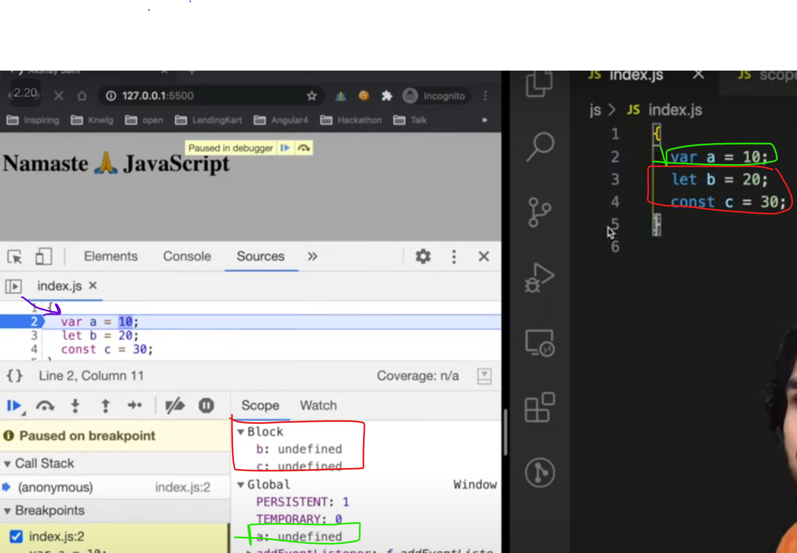


## Shadowing


1. In `var` case
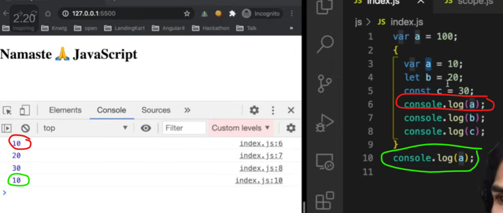
Since both `block` and outside `a` was sharing same global execution space
that's why value get updated. But same thing won't happened if it was within a function
in that case, since all function will have their own execution space so value will not be updated


2. In `let` case
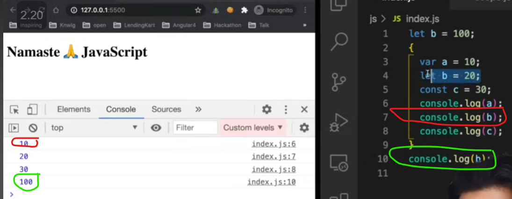


3. In `const` case


It works same for `function`


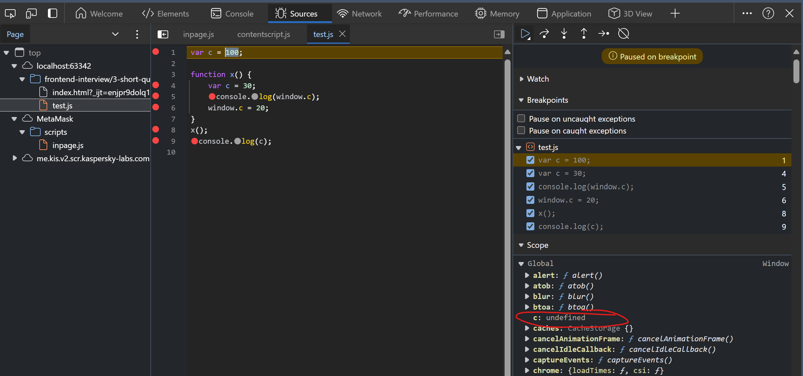
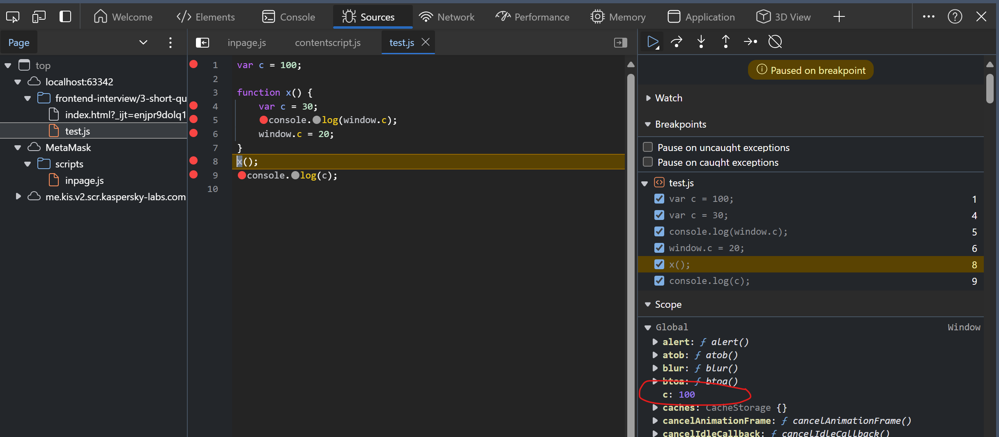
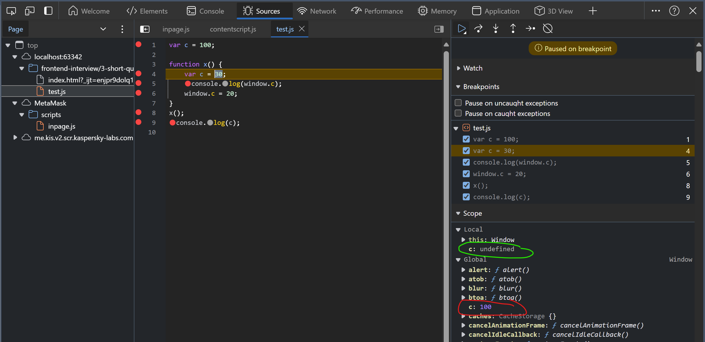
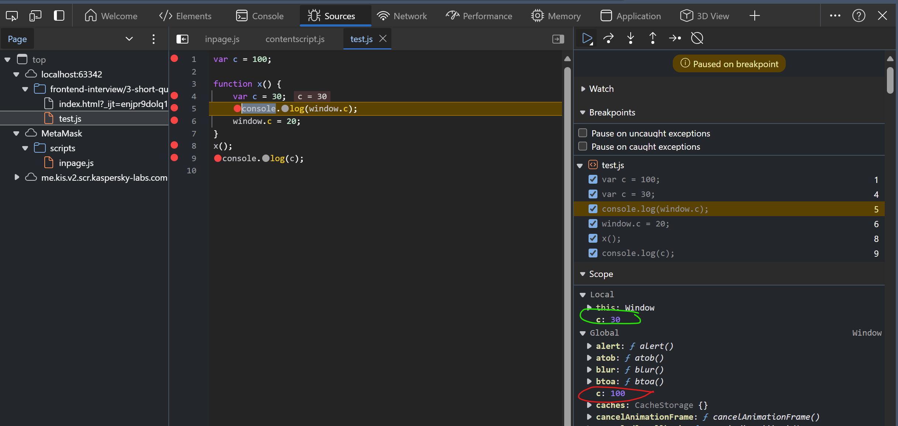
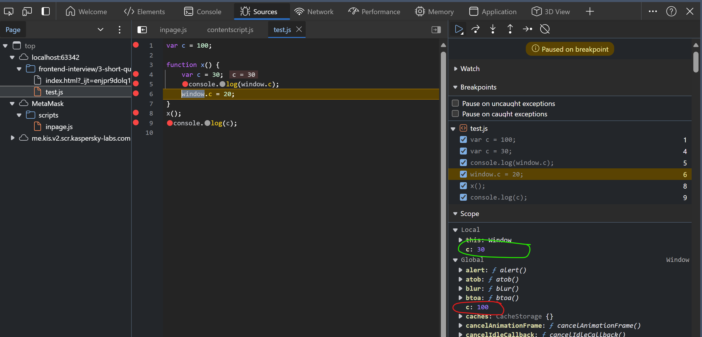
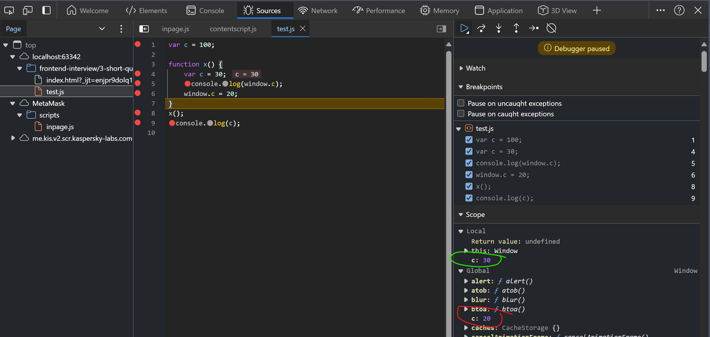

## Illegal Shadowing

This is invalid and illegal shadowing
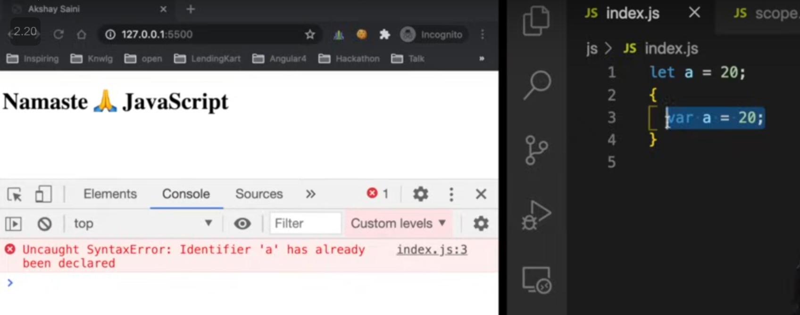

Below is valid


Note:
1. `Block scope` follow same like `lexical scope`
2. Arrow function scope is same like normal function

Referred Video: https://youtu.be/lW_erSjyMeM?si=t9omkRS3sVmgXrwZ


### `Undecalred`
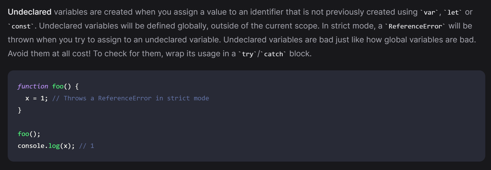

### `undefined`
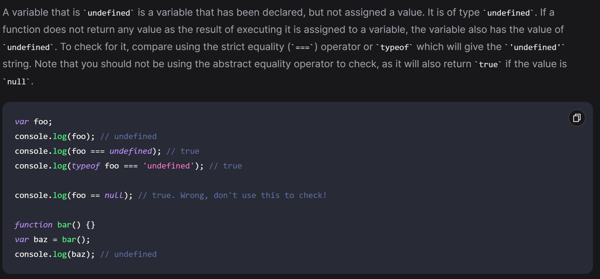

### `null`
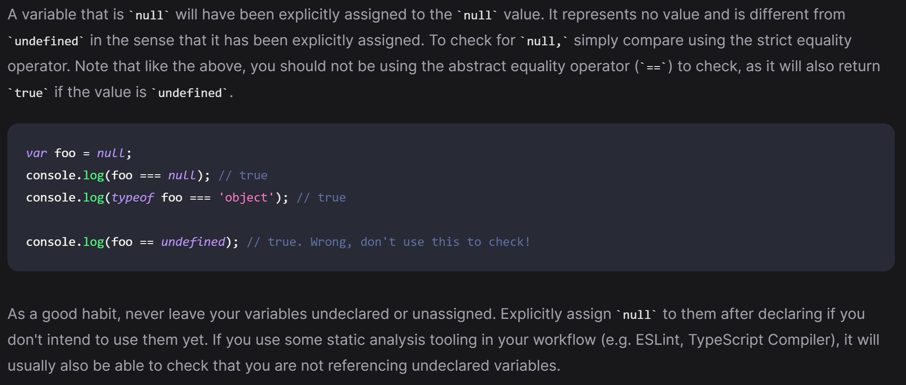
