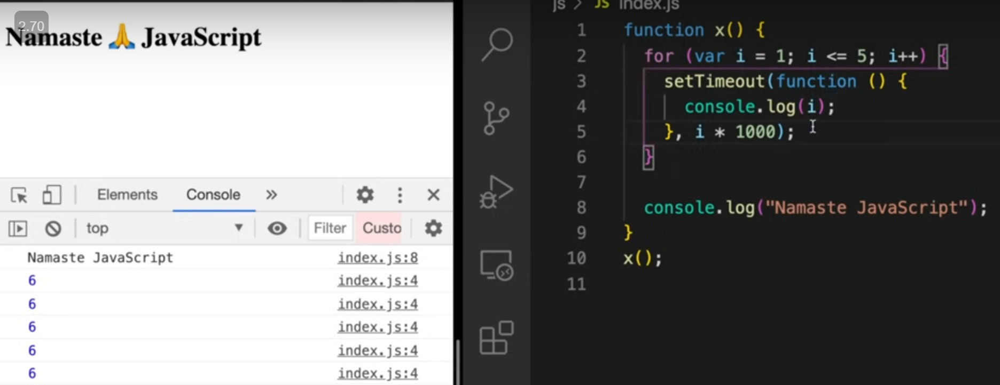
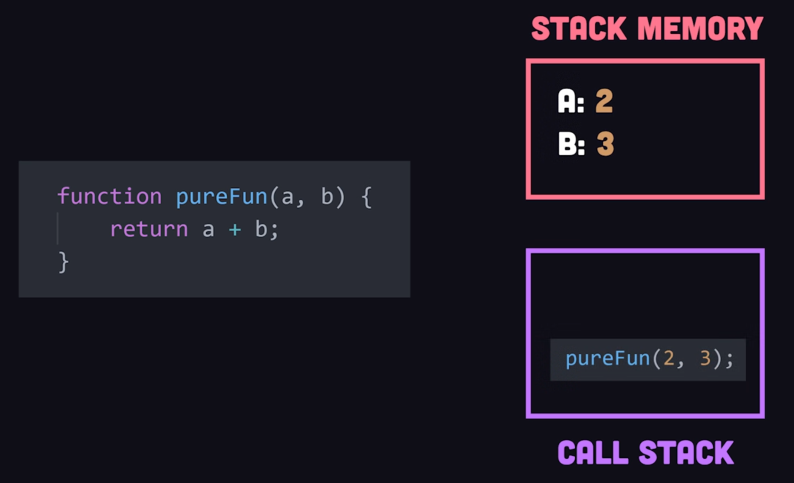
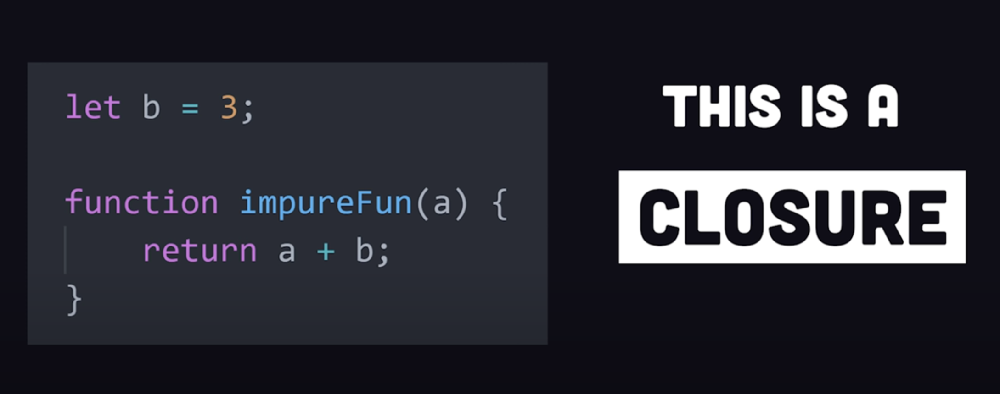
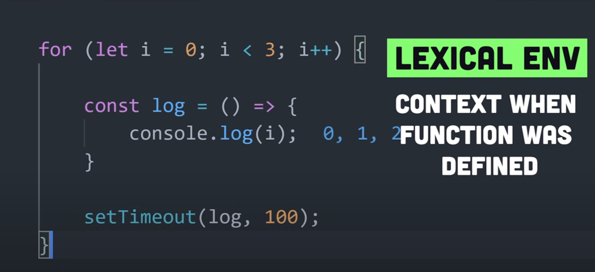

## Closure


Here even though `x()` execution context is removed from
`call stack` after line _8_, but when `z()` execute it remembers the value of 
`a` because of `closure` hence print `7`

### Function with its `lexical` scope bundle together is called closure

How to create closure?

Whenever we want to create Closure then just create a function wraping
variables & functions in them

### Closure is created irrespective of `Arrow` or `Normal` function in all inner and outer function permutation

### Also, there is a need to be variable defined and used inside inner function to see the closure in the browser dev tool

If defined but not used, then it will skip in the browser dev tool

**Few more examples**

Here we have closure of both `x()` and `z()`


Using Closure to know the button clicked count without any global variable

### Closure Usecase


Data Privacy & Security(Encapsulation)

Here count can only be increased through `counter()` function

Here both `counter1` & `counter2` has access to its own copy of `count`

### Disadvantage of closure

1. Since it uses `Heap` memory so over use of closure can led to memory leak

Referred Video: https://youtu.be/qikxEIxsXco?si=DNd_PMIGTem9dGZM

## Closures in React

Closures are everywhere. Below code shows a simple example of increasing a counter on a button click. In this code, `handleClick` forms a closure. It has access to it's outer scope variable `count` and `setCount`

```jsx
import React, { useState } from 'react';

function Counter() {
  // Define a state variable using the useState hook
  const [count, setCount] = useState(0);

  // This handleClick function is a closure
  function handleClick() {
    // It can access the 'count' state variable
    setCount(count + 1);
  }

  return (
    <div>
      <p>Count: {count}</p>
      <button onClick={handleClick}>Increment</button>
    </div>
  );
}

function App() {
  return (
    <div>
      <h1>Counter App</h1>
      <Counter />
    </div>
  );
}

export default App;
```

## Why use closures?

Using closures provide the following benefits:

1. **Data encapsulation**: Closures provide a way to create private variables and functions that can't be accessed from outside the closure. This is useful for hiding implementation details and maintaining state in an encapsulated way.
1. **Functional programming**: Closures are fundamental in functional programming paradigms, where they are used to create functions that can be passed around and invoked later, retaining access to the scope in which they were created, e.g. [partial applications or currying](https://medium.com/javascript-scene/curry-or-partial-application-8150044c78b8#.l4b6l1i3x).
1. **Event handlers and callbacks**: In JavaScript, closures are often used in event handlers and callbacks to maintain state or access variables that were in scope when the handler or callback was defined.
1. **Module patterns**: Closures enable the [module pattern](https://www.patterns.dev/vanilla/module-pattern) in JavaScript, allowing the creation of modules with private and public parts.

https://www.greatfrontend.com/questions/quiz/what-is-a-closure-and-how-why-would-you-use-one?practice=practice&tab=quiz

<details >
 <summary style="font-size: x-large; font-weight: bold">`setTimeout` Closure</summary>
## 


Here 5 copy of `setTimeout` are referring to same copy of `i` hence will print 6
all the time

Here since `let` is block scoped so every copy of `setTimeout` closure will have its own 
value of `i`

How to solve this with `var` only?

Here using `Closure` we can solve this

Referred Video:https://youtu.be/eBTBG4nda2A?si=d1TUmSR3h1IO4CFM

---
</details>

<details >
 <summary style="font-size: x-large; font-weight: bold">Closure Questions</summary>

1. 

Here since `a` was not there in local scope so we scope chain towards global scope
and if it is not there then we get `Reference error` of `a` not defined.


2. **Garbage Collector**

Here `x` value is garbage collected once `a()` execution is done

Here `x` is not garbage collected because of closure

3. **Smart Garbage Collection**


Here `z` is garbage collected once we reach line _4_, hence we get `Reference error`

### Garbage collection

Garbage collection in JavaScript is an automatic memory management mechanism that reclaims memory occupied by objects and variables that are no longer in use by the program. The two most common algorithms are mark-and-sweep and generational garbage collection.

**Mark-and-sweep**

The most common garbage collection algorithm used in JavaScript is the Mark-and-sweep algorithm. It operates in two phases:

- **Marking phase**: The garbage collector traverses the object graph, starting from the root objects (global variables, currently executing functions, etc.), and marks all reachable objects as "in-use".
- **Sweeping phase**: The garbage collector sweeps through memory, removing all unmarked objects, as they are considered unreachable and no longer needed.

This algorithm effectively identifies and removes objects that have become unreachable, freeing up memory for new allocations.

**Generational garbage collection**

Leveraged by modern JavaScript engines, objects are divided into different generations based on their age and usage patterns. Frequently accessed objects are moved to younger generations, while less frequently used objects are promoted to older generations. This optimization reduces the overhead of garbage collection by focusing on the younger generations, where most objects are short-lived.

Different JavaScript engines (differs according to browsers) implement different garbage collection algorithms and there's no standard way of doing garbage collection.
More Details on garbage collection: https://www.greatfrontend.com/questions/quiz/how-does-javascript-garbage-collection-work?format=quiz

---
</details>

<details >
 <summary style="font-size: x-large; font-weight: bold">From Fireship.io</summary>

### When ever, a function tries to access a variable which is not created in that function; then it is called as closure.

1. 
2. 
3. 
4. 
5. In closure values are stored inside heap. Stacks are shortly lived while heaps are long-lived.

6. It requires 

7. **Usecase**

a. To prevent data leakage


b. Many javascript functions are callback-based functions


### Famous Tricky Questions
1. 
Ans. 

In `let` i is not hoisted



In case `var` `i` lived in Heap while in `let` it was in Stack


2. 
Referred Video: https://www.youtube.com/watch?v=3a0I8ICR1Vg


### Referred Video: https://www.youtube.com/watch?v=vKJpN5FAeF4

---
</details>
