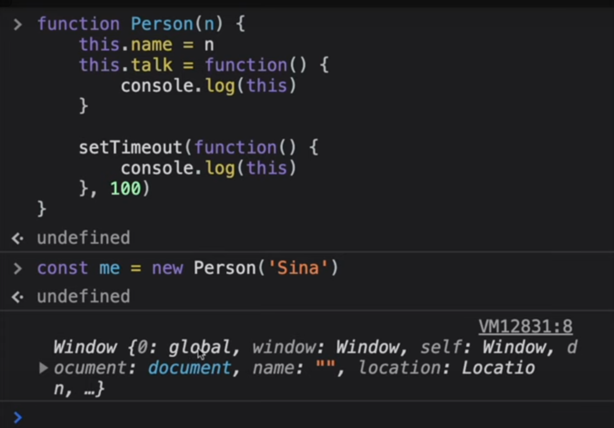
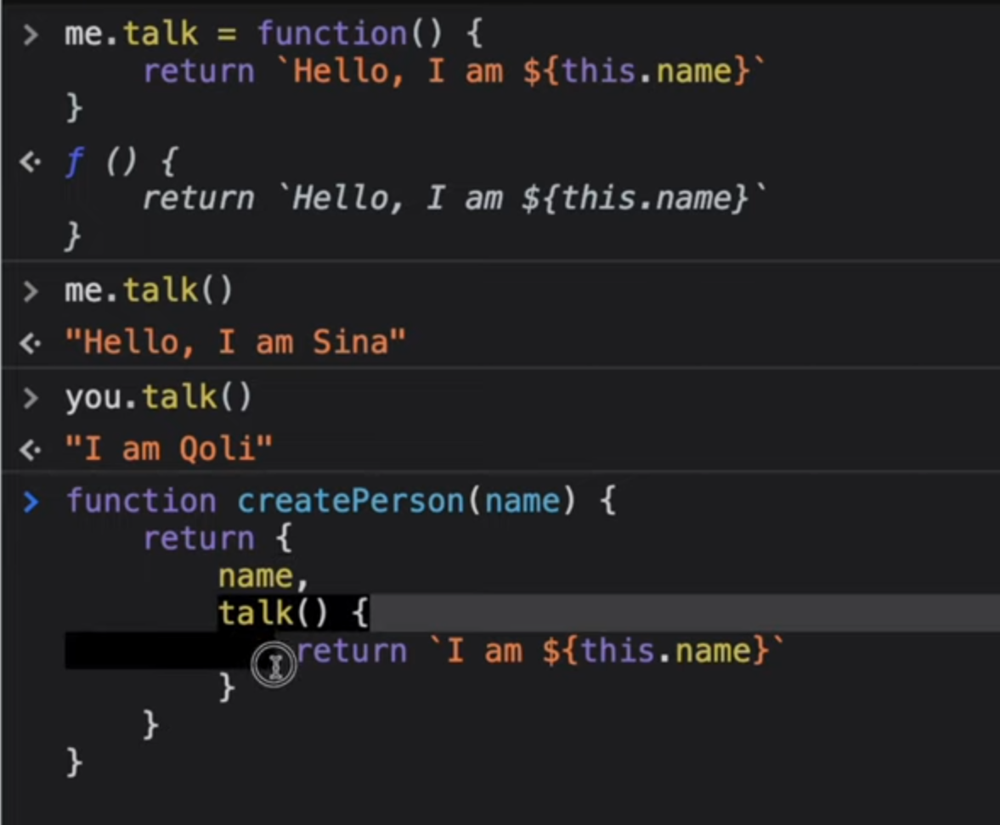
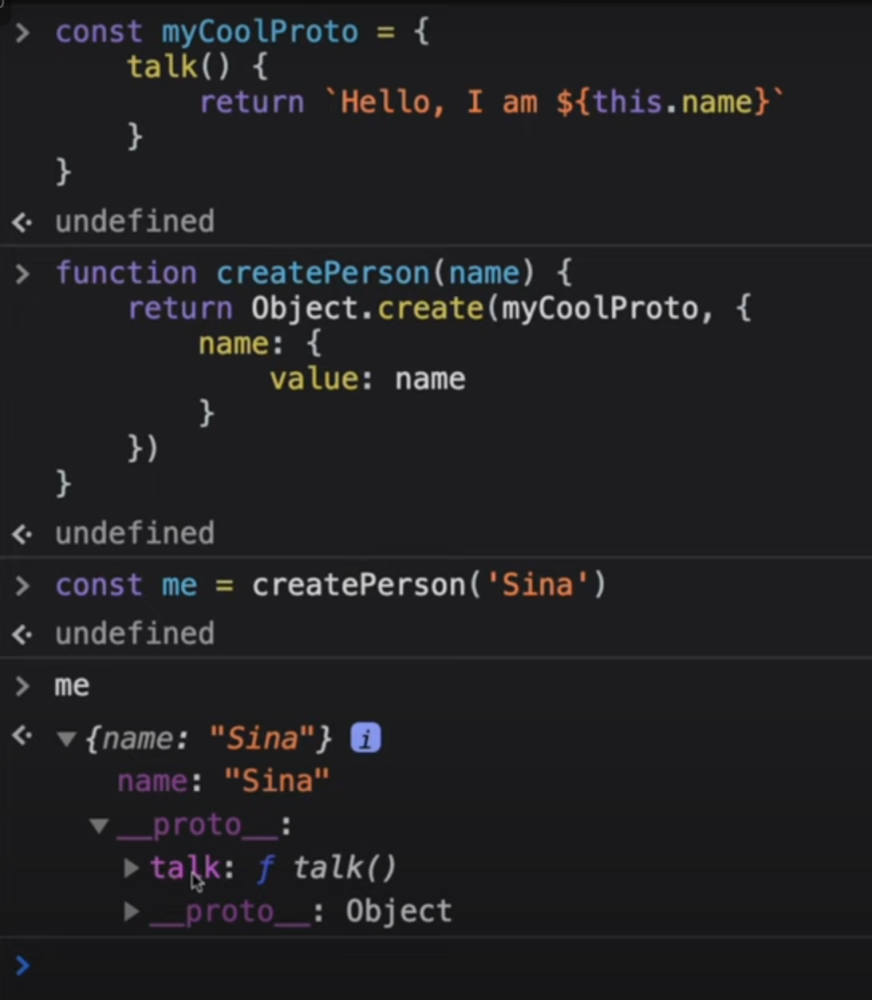
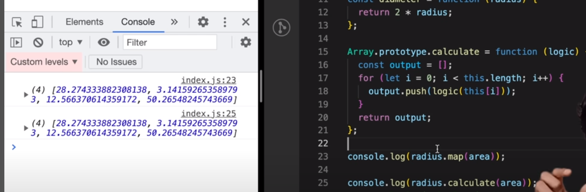

## Functions

<details >
 <summary style="font-size: medium; font-weight: bold">Function Statement or Function Declaration vs Function Expression</summary>

`Function Statement` are also called `Function Declaration`


Understand this by knowing `Execution Context`


<details >
 <summary style="font-size: small; font-weight: bold">Explain the differences on the usage of `foo` between `function foo() {}` and `var foo = function() {}` in JavaScript</summary>

https://www.greatfrontend.com/questions/quiz/explain-the-differences-on-the-usage-of-foo-between-function-foo-and-var-foo-function?practice=practice&tab=quiz
## TL;DR

`function foo() {}` a function declaration while the `var foo = function() {}` is a function expression. The key difference is that function declarations have its body hoisted but the bodies of function expressions are not (they have the same hoisting behavior as `var`-declared variables).

If you try to invoke a function expression before it is declared, you will get an `Uncaught TypeError: XXX is not a function` error.

Function declarations can be called in the enclosing scope even before they are declared.

```js live
foo(); // 'FOOOOO'
function foo() {
  console.log('FOOOOO');
}
```

Function expressions if called before they are declared will result in an error.

```js live
foo(); // Uncaught TypeError: foo is not a function
var foo = function () {
  console.log('FOOOOO');
};
```

Another key difference is in the scope of the function name. Function expressions can be named by defining it after the `function` and before the parenthesis. However when using named function expressions, the function name is only accessible within the function itself. Trying to access it outside will result in an error or `undefined`.

```js live
const myFunc = function namedFunc() {
  console.log(namedFunc); // Works
};

myFunc(); // Runs the function and logs the function reference
console.log(namedFunc); // ReferenceError: namedFunc is not defined
```

**Note**: The examples uses `var` due to legacy reasons. Function expressions can be defined using `let` and `const` and the key difference is in the hoisting behavior of those keywords.

---

## Function declarations

A function declaration is a statement that defines a function with a name. It is typically used to declare a function that can be called multiple times throughout the enclosing scope.

```js live
function foo() {
  console.log('FOOOOO');
}
foo(); // 'FOOOOO'
```

## Function expressions

A function expression is an expression that defines a function and assigns it to a variable. It is often used when a function is needed only once or in a specific context.

```js live
var foo = function () {
  console.log('FOOOOO');
};
foo(); // 'FOOOOO'
```

**Note**: The examples uses `var` due to legacy reasons. Function expressions can be defined using `let` and `const` and the key difference is in the hoisting behavior of those keywords.

## Key differences

### Hoisting

The key difference is that function declarations have its body hoisted but the bodies of function expressions are not (they have the same hoisting behavior as `var`-declared variables). For more explanation on hoisting, refer to the quiz question on [hoisting](/questions/quiz/explain-hoisting). If you try to invoke a function expression before it is defined, you will get an `Uncaught TypeError: XXX is not a function` error.

Function declarations:

```js live
foo(); // 'FOOOOO'
function foo() {
  console.log('FOOOOO');
}
```

Function expressions:

```js live
foo(); // Uncaught TypeError: foo is not a function
var foo = function () {
  console.log('FOOOOO');
};
```

### Name scope

Function expressions can be named by defining it after the `function` and before the parenthesis. However when using named function expressions, the function name is only accessible within the function itself. Trying to access it outside will result in `undefined` and calling it will result in an error.

```js live
const myFunc = function namedFunc() {
  console.log(namedFunc); // Works
};

myFunc(); // Runs the function and logs the function reference
console.log(namedFunc); // ReferenceError: namedFunc is not defined
```

## When to use each

- Function declarations:
   - When you want to create a function on the global scope and make it available throughout the enclosing scope.
   - If a function is reusable and needs to be called multiple times.
- Function expressions:
   - If a function is only needed once or in a specific context.
   - Use to limit the function availability to subsequent code and keep the enclosing scope clean.

In general, it's preferable to use function declarations to avoid the mental overhead of determining if a function can be called. The practical usages of function expressions is quite rare.

## Further reading

- [Function declaration | MDN](https://developer.mozilla.org/en-US/docs/Web/JavaScript/Reference/Statements/function)
- [Function expression | MDN](https://developer.mozilla.org/en-US/docs/Web/JavaScript/Reference/Operators/function)

---
</details>

---
</details>


<details >
 <summary style="font-size: medium; font-weight: bold">Anonymous Functions</summary>

A function without any name are called `Anonymous Function`


Anonymous function are used as value like above or we get syntax error


<details >
 <summary style="font-size: small; font-weight: bold">What's a typical use case for anonymous functions in JavaScript?</summary>

https://www.greatfrontend.com/questions/quiz/whats-a-typical-use-case-for-anonymous-functions?practice=practice&tab=quiz

## TL;DR

**They are typically used as arguments to other functions or assigned to variables.**

```js
// The filter method is passed an anonymous function.
arr.filter((x) => x > 1);
```

They are often used as arguments to other functions, known as **higher-order functions**, which can take functions as input and return a function as output. Anonymous functions can access variables from the outer scope, a concept known as closures, allowing them to "close over" and remember the environment in which they were created.

```js
// Encapsulating Code
(function () {
  // Some code here.
})();

// Callbacks
setTimeout(function () {
  console.log('Hello world!');
}, 1000);

// Functional programming constructs
const arr = [1, 2, 3];
const double = arr.map(function (el) {
  return el * 2;
});
console.log(double); // [2, 4, 6]
```

---

## Anonymous functions

Anonymous functions provide a more concise way to define functions, especially for simple operations or callbacks. Besides that, they can also be used in the following scenarios

### Immediate execution

Anonymous functions are commonly used in Immediately Invoked Function Expressions (IIFEs) to encapsulate code within a local scope. This prevents variables declared within the function from leaking to the global scope and polluting the global namespace.

```js
// This is an IIFE
(function () {
  var x = 10;
  console.log(x); // 10
})();

// x is not accessible here
console.log(typeof x); // undefined
```

In the above example, the IIFE creates a local scope for the variable `x`. As a result, `x` is not accessible outside the IIFE, thus preventing it from leaking into the global scope.

### Callbacks

Anonymous functions can be used as callbacks that are used once and do not need to be used anywhere else. The code will seem more self-contained and readable when handlers are defined right inside the code calling them, rather than having to search elsewhere to find the function body.

```js
setTimeout(() => {
  console.log('Hello world!');
}, 1000);
```

### Higher-order functions

It is used as arguments to functional programming constructs like Higher-order functions or Lodash (similar to callbacks). Higher-order functions take other functions as arguments or return them as results. Anonymous functions are often used with higher-order functions like `map()`, `filter()`, and `reduce()`.

```js
const arr = [1, 2, 3];
const double = arr.map((el) => {
  return el * 2;
});
console.log(double); // [2, 4, 6]
```

### Event Handling

In React, anonymous functions are widely used for defining callback functions inline for handling events and passing callbacks as props.

```jsx
function App() {
  return <button onClick={() => console.log('Clicked!')}>Click Me</button>;
}
```

## Follow-Up Questions

- How do anonymous functions differ from named functions?
- Can you explain the difference between arrow functions and anonymous functions?

---
</details>

---
</details>


<details >
 <summary style="font-size: medium; font-weight: bold">Named Functions Expression</summary>


Red : Argument 

Green: parameter

---
</details>


<details >
 <summary style="font-size: medium; font-weight: bold">First Class Function</summary>

The ability to use function as value and return it as a value is called `First Class Function`


---
</details>

Referred Video: https://youtu.be/SHINoHxvTso?si=T8jxyj-IHrnRx2tx


<details >
 <summary style="font-size: medium; font-weight: bold">Factory Functions</summary>

It is very similar to actual factory where we put raw material and get finished
product.

Factory function just create `Object`'s and return them

```js
function factory() {
    return {...}
}
```

### Problems

Why we can't just create `Object` itself directly instead of using `factory` function?
1. There are lot of thing in common but few slight differences in all objects
   
   Because of this there is lot of code duplicaton
2. 
   Object value can be updated like above which can again create problem


### Solution


1. Not very complex like `Class`
2. No code duplication
3. Can't inject any bug through updating any value directly

Example


Referred Video: https://youtu.be/lE_79wkP-1U?si=Yskr4mqmfg8Nd51r


---
</details>


<details >
 <summary style="font-size: medium; font-weight: bold">Pure / Impure Function</summary>


---
</details>


<details >
 <summary style="font-size: medium; font-weight: bold">Constructor Function</summary>

- `Constructor functions` create object for us just like `Factory Function`
- It is good practice to use `PascalCase`, but not compulsory


Just like a waiter giving order to cook, they have blueprint of how they should
pass order info so that there is less waste of time. Same thing is for
constructor function we define blueprint of object and pass the changed part to it.


Using `new` automatically add above 2 lines, therefore we need not to return 
anything unlike `Factory Function`


Referred Video: https://youtu.be/I37qHG0DxmE?si=7BGR0tQStjXih67o




<details >
 <summary style="font-size: small; font-weight: bold">Good Example</summary>

Input->
computeAmount().Iacs(15).
crore(5).crore(2).lacs(20).thousand(45).crore(7).value()

1. **Solution-1**
```js
function ComputeAmount(amount){
    this.totalAmount = amount;

    this.lac = function (multiplier){
        this.totalAmount += multiplier*100000;
        return this;
    }

    this.value = () => {
        return this.totalAmount;
    }
}


console.log("computeAmount : ", new ComputeAmount(0).lac(2).lac(2).value());
```
Here everything is stored inside local `this` which is pointing to (`Object`)instance
of `ComputeAmount` constructor function


2. **Solution-2**

```js
function computeAmount(amount){
    this.totalAmount = amount;

    this.lac = (multiplier) => {
        this.totalAmount += multiplier*100000;
        return this;
    }

    this.value = () => {
        return this.totalAmount;
    }

    return this;
}


console.log("computeAmount : ", computeAmount(0).lac(2).lac(2).value());
```

- This solution also yields the same result, which is more accurate to what question asked
- It has a same result because here we're explicitly returning `this` alike creating new instance
from constructor function which on using `new` keyword create empty object which is assigned 
to `this` and returned
- Here `this` points to `window` object because it is not instance of anything
- Also, it does not matter whether `lac` function is normal or arrow both will return a same result


Referred Video: https://youtu.be/_tNErId8xlc?si=t8fEbbGmefLTogd-&t=126

---
</details>


---
</details>


<details >
 <summary style="font-size: medium; font-weight: bold">Factory Function v/s Constructor Function v/s Class</summary>

`Factory Function`

Factory function just create Object's and return them


`Constructor Function`

Constructor function also create object for us and provide kind of blueprint how the 
object should be created.


Both side-by-side


### In case of Factory Function




So here in case of `factory function` when we changed function definition for
`me` object , it didn't affect `you` object. As each object get there own space
for this function and we have separate copy of this function.

Two issues with this
1. Take extra space
2. No clear inheritance

Way to fix this 
1.


This is not very great as `speak` function is present on every single Object 

2. 

This is bit better than above as we are able to send it to `__proto__`

### In case of Contructor Function


Here after adding new function to constructor function using above code
we are able to add this function to every object created using this constructor function


We can now also change the function and it will be reflected in every object created 
using this constructor function.

**This is now showing clear inheritance of object created from constructor function.**

1. This show clear benefit that using `constructor function` for creating object,
we have **clear inheritance**
2. But we use `factory function` for creating object.
   - It is lot simpler than `constructor function`, as we don't have use `new` keyword and all
   - We have also **Data Privacy**, as each one is getting its own copy so there is very less
   chance of manipulation of data

### Classes

It is exactly same like `Constructor Function` and use same prototype concept. It was
introduce in ES6


Referred Video: https://youtu.be/fbuyliXlDGI?si=bg1whNVtEbIY2ci5

---
</details>


<details >
 <summary style="font-size: medium; font-weight: bold">Arrow Function</summary>

The main advantage of using an arrow function as a method inside a constructor is that the value of `this` gets set at the time of the function creation and can't change after that. When the constructor is used to create a new object, `this` will always refer to that object.

### Limitations

Arrow functions cannot be used as constructors and will throw an error when used with the `new` keyword.

```js live
const Foo = () => {};
const foo = new Foo(); // TypeError: Foo is not a constructor
```

They also do not have `arguments` keyword; the arguments have to be obtained from using the rest operator (`...`) in the arguments.

```js
const arrowFunction = (...args) => {
  console.log(arguments); // Throws a TypeError
  console.log(args); // [1, 2, 3]
};

arrowFunction(1, 2, 3);
```

Since arrow functions do not have their own `this`, they are not suitable for defining methods in an object. Traditional function expressions or function declarations should be used instead.

```js live
const obj = {
  value: 42,
  getValue: () => this.value, // `this` does not refer to `obj`
};

console.log(obj.getValue()); // undefined
```


1. 

In normal function we have `arguments` array present


But in arrow we don't


2. 

We cannot have named arrowed function

3. 


Refer `this` concept to better understand this output


4. 

In constructor we can't use arrow function


5. 


---
</details>


<details >
 <summary style="font-size: medium; font-weight: bold">Callback Function</summary>


---
</details>


<details >
 <summary style="font-size: medium; font-weight: bold">Object Methods</summary>


---
</details>


<details >
 <summary style="font-size: medium; font-weight: bold">Functional Programming</summary>

### Without Functional Programming


### With Functional Programming


---
</details>


<details >
 <summary style="font-size: medium; font-weight: bold">Higher Order Function</summary>

Function that takes another function as argument(callback function) is known as **Higher order functions.**
Ex: map(), reduce(), filter(), ...etc


1. Follow DRY(Don't Repeat Yourself) principle while coding.
2. Use function to stop writing repeating line of codes.
3. It is this ability that function can be stored, passed and returned,  they are called **first class citizens.**
4. If  we use Array.property.function-name. This function is accessible to any array in your code.



Referred Video: https://youtu.be/HkWxvB1RJq0?si=zjardBsnBI1OLe9q


### Practical examples

1. **Logging decorator**: A higher-order function that adds logging functionality to another function:

```js live
function withLogging(fn) {
  return function (...args) {
    console.log(`Calling ${fn.name} with arguments`, args);
    return fn.apply(this, args);
  };
}

function add(a, b) {
  return a + b;
}

const loggedAdd = withLogging(add);
console.log(loggedAdd(2, 3)); // Output: Calling add with arguments [2, 3] 5
```

The `withLogging` function is a higher-order function that takes a function fn as an argument and returns a new function that logs the function call before executing the original function

2. **Memoization**: A higher-order function that caches the results of a function to avoid redundant computations:

```js live
function memoize(fn) {
  const cache = new Map();
  return function (...args) {
    const key = JSON.stringify(args);
    if (cache.has(key)) {
      return cache.get(key);
    }
    const result = fn.apply(this, args);
    cache.set(key, result);
    return result;
  };
}

function fibonacci(n) {
  if (n <= 1) return n;
  return fibonacci(n - 1) + fibonacci(n - 2);
}

const memoizedFibonacci = memoize(fibonacci);
console.log(memoizedFibonacci(10)); // Output: 55
```

The `memoize` function is a higher-order function that takes a function `fn` as an argument and returns a new function that caches the results of the original function based on its arguments.

https://www.greatfrontend.com/questions/quiz/what-is-the-definition-of-a-higher-order-function?practice=practice&tab=quiz

---
</details>


