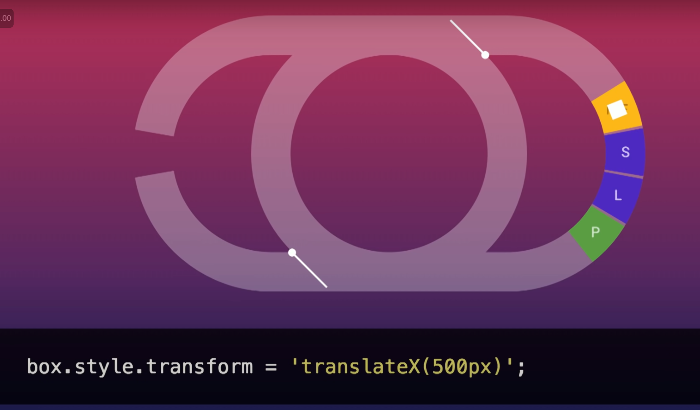
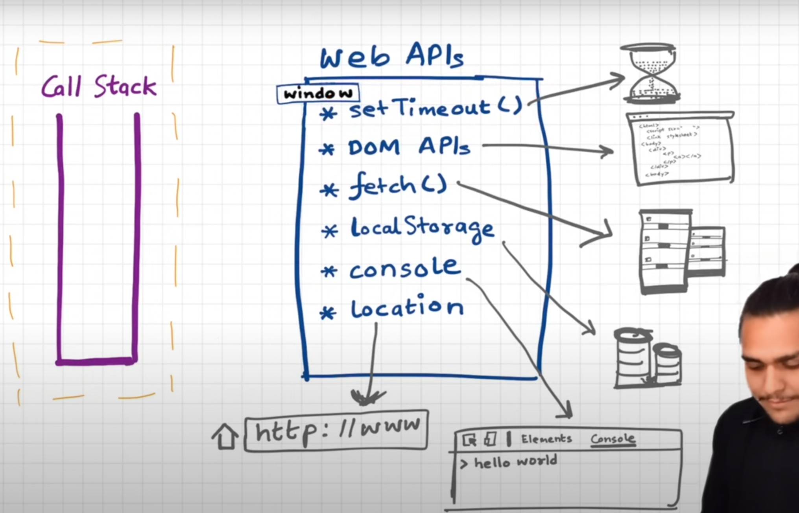

  ## Event Loop, Callback or Task Queue, Animation Queue, MicroTask Queue

Philip Roberts at JSConf EU: https://www.youtube.com/watch?v=8aGhZQkoFbQ

Jake Archibald at JSConf: https://www.youtube.com/watch?v=cCOL7MC4Pl0

Amazing tool to simulate whole thing mentioned in above talks
interactively 
1. https://www.jsv9000.app/
2. http://latentflip.com/loupe/

### Basic Concepts

In V8 Engine we don't have functions like setTimeout, setInterval etc but these 
functions or webAPIs are there in browser.

If we just see v8 engine then we can clearly see javascript is single threaded 
having only `Heap` and `Call Stack` in it.

But what make it look like `multi threaded` is by using 
1. Event Loop
2. Callback Queue or Tasks Queue or MacroTask Queue: (`setTimeout()`, DOM APIs, ..)
3. Animation Queue
4. MicroTask Queue: (`Promise`, `fetch()`, Mutation Observer, ..)

### MicroTask Queue >> Callback Queue

`Microtask Queue` has **higher priority** than `Callback Queue`

<details >
 <summary style="font-size: x-large; font-weight: bold">Philip Roberts' Talk</summary>

He discussed about `Event Loop` and `Callback Queue` to explain this whole thing


### Call Stack


### Concurrency & Event Loop
Time Stamp:https://youtu.be/8aGhZQkoFbQ?si=VX6d-MAwBQK1gkFu&t=768


1. Using `setTimeout` 0 is to solve `Blocking Issue` by using this we
let any ajax, http request or setTimeout to finish under `webapis`
once they are done running we push it to `Callback Queue or Task Queue`
and `Event loop` push back to `Call Stack` once everything cleared from it.

    By this any `Asynchronous task` does not block Call Stack and we are able to 
    use thing on browser like click button or highlight text etc.

2. `setTimeout` is **not guarantee time of execution**, but it is a minimum time of
execution.

Running example: https://youtu.be/8aGhZQkoFbQ?si=wqVXk6cU2grRaD8_&t=1170


---
</details>


<details >
 <summary style="font-size: x-large; font-weight: bold">Jake Archibald's Talk</summary>


 We may feel user might see flash of `el` element since apply 
style 'none' after appending but it won't because of how Event Loop works

#### Main Thread


Here this main thread is V8 engine which has just one `Call Stack`

`Callback or Task Queue` is on **LEFT**

`Render Steps` is on **RIGHT**

In below diagrams
<details >
 <summary style="font-size: large; font-weight: bold">Callback or Task Queue</summary>


---
</details>

<br>

<details >
 <summary style="font-size: large; font-weight: bold">Render Steps</summary>

It involves
1. Style calculation: Looking at all CSS element and calculating what applies to each element
2. Layout: Render tree and figuring out where everything is on page
3. Painting: Creating pixel data, doing actual painting


<details >
 <summary style="font-size: medium; font-weight: bold">Example 1: `while (true);`</summary>

Once we click on `while (true);` button everything comes to stand still, we can't do anything
on browser


Since `main thread(Call Stack)` is busy doing above task so it will just queue up all other
task like button click, text highlight, cat gif animation  etc and will be able to push one by one
to Call Stack when it is completely empty.


Now we can understand why there will no flash of `el` since a code must run to its completion
before it can get back to render steps

---
</details>

<details >
 <summary style="font-size: medium; font-weight: bold">Example 2: `setTimeout loop`</summary>


Here we keep queueing up tasks and will be able to push one by one to Call Stack.
Therefore `Event Loop` is able to push `Render step task` like cat gif animation to `Callback Queue`.
Hence it is `Non blocking`.


---
</details>


---
</details>

<br>

<details >
 <summary style="font-size: large; font-weight: bold">`requestAnimationFrame`</summary>


Here `setTimeout` move faster than `requestAnimationFrame`

Many task can happen before browser goes to render step and update the display

Most commonly display refresh at 60 times per second(60 Hz).
Browser won't run render step if browser is in background as that will be waste of
resource.


`setTimeout(callback, 0)` is not exactly 0 ms it is around 4.7 ms.

<details >
 <summary style="font-size: small; font-weight: bold">Visualizing Timing</summary>
In below figure Green & Purple color represent Render step 

Yellow part are task queue


If we use setTimeout()[Task Queue] for animation, then it will happen randomly since
Task Queue is always prioritised than a Render step


But if we use `requestAnimationFrame` then it will happen always at the start

---
</details>


---
</details>

<br>

<details >
 <summary style="font-size: medium; font-weight: bold">Example: Animate Box 0-> 1000 -> 500</summary>

1.

Above code will not animate from 0 -> 1000 -> 500, since browser will just render 0 -> 500.
Since this is something ran to completion on Task Queue side and whatever was set, browser looks that
and render it on broswer during Render step

2. 




In above case also we didn't able to animate since both Task Queue and requestAnimationFrame happen
before it get painted on browser

3.


Using twice requestAnimationFrame help to animate properly


Till 2018 Edge & Safari put requestAnimationFrame after Styling & Painting


---
</details>

<br>

<details >
 <summary style="font-size: large; font-weight: bold">Micro Tasks</summary>


Above `promise` use microtask queue


In here also whole things hang after button click of `Microtask loop`


Visualizing how tasked are picked and completed in below cases


1. Callback or  Task Queue

One task is completed one at a time


2. Animation Callback(requestAnimationFrame)


All the item are completed till the completion and new once are just
stacked for second iteration

3. Micro Task Queue

All item plus newly added item are also completed.


---
</details>

<br>
<details >
 <summary style="font-size: large; font-weight: bold">Quiz</summary>


<details >
 <summary style="font-size: medium; font-weight: bold">Question-1</summary>


After running task we go to Micro Task Queue


Same thing done for Listener 2


---
</details>

<details >
 <summary style="font-size: medium; font-weight: bold">Question-2(Using script for button click)</summary>


Here since script haven't completed yet therefore we move to listener 2


Be careful while automating anything using script

---
</details>

Use above tool to better visualize above example

---
</details>


---
</details>


<details >
 <summary style="font-size: x-large; font-weight: bold">Namaste JS</summary>




Referred Video: https://youtu.be/8zKuNo4ay8E?si=HOCnXMoqEvLG-G8h

## JS Engine


Depending on the browser engine, the JS can use `Interpreter` or `Compiler`


---
</details>


<details >
 <summary style="font-size: x-large; font-weight: bold">Reflow and Repaint</summary>


In CRP([Networking -> How Web Work -> CRP](../../09-networking/readme.md)) we have 

**3.1 Reflow:** Keeps on happening when changes are made to the elements, that affect the layout of the partial or whole page. The Reflow of the element will cause the subsequent reflow of all the child and ancestor elements in the DOM. Reflow means re-calculating the positions and geometries of elements in the document.

**4.1 Repaint:**  Keeps on happening when changes are made to the appearance of the elements that change the visibility, but doesn't affect the layout
Eg: Visibility, background color, outline

> Reflows are very expensive in terms of performance, and is one of the main causes of slow DOM scripts, especially on devices with low
processing power, such as phones. In many cases, they are equivalent to laying out the entire page again.

**What Causes the Reflows and Repaints**
- Reflow will happen when Adding, Removing, Updating the DOM nodes
- Hiding DOM Element with display: none will cause both reflow and repaint
- Hiding DOM Element with visibility: hidden will cause the only repaint, because no layout or position change

```js
var bodyStyle = document.body.style; // cache

bodyStyle.padding = "20px"; // reflow, repaint
bodyStyle.border = "10px solid red"; // reflow, repaint

bodyStyle.color = "blue"; // repaint only, no dimensions changed
bstyle.backgroundColor = "#cc0000"; // repaint

bodyStyle.fontSize = "2em"; // reflow, repaint

// new DOM element - reflow, repaint
document.body.appendChild(document.createTextNode('Hello!'));
```

Full article: https://dev.to/gopal1996/understanding-reflow-and-repaint-in-the-browser-1jbg

---
</details>
