**Synchronous functions are blocking while asynchronous functions are not.**

Explain the difference between synchronous and asynchronous functions in JavaScript?
https://www.greatfrontend.com/questions/quiz/explain-the-difference-between-synchronous-and-asynchronous-functions?practice=practice&tab=quiz


<details >
 <summary style="font-size: medium; font-weight: bold">What are the pros and cons of using Promises instead of callbacks in JavaScript?</summary>

## TL;DR

Promises offer a cleaner alternative to callbacks, helping to avoid callback hell and making asynchronous code more readable. They facilitate writing sequential and parallel asynchronous operations with ease. However, using promises may introduce slightly more complex code.

---

## Pros

### Avoid callback hell which can be unreadable.

Callback hell, also known as the "pyramid of doom," is a phenomenon that occurs when you have multiple nested callbacks in your code. This can lead to code that is difficult to read, maintain, and debug. Here's an example of callback hell:

```js
function getFirstData(callback) {
  setTimeout(() => {
    callback({ id: 1, title: 'First Data' });
  }, 2000);
}

function getSecondData(data, callback) {
  setTimeout(() => {
    callback({ id: data.id, title: data.title + ' Second Data' });
  }, 2000);
}

function getThirdData(data, callback) {
  setTimeout(() => {
    callback({ id: data.id, title: data.title + ' Third Data' });
  }, 2000);
}

// Callback hell
getFirstData((data) => {
  getSecondData(data, (data) => {
    getThirdData(data, (result) => {
      console.log(result); // Output: {id: 1, title: "First Data Second Data Third Data"}
    });
  });
});
```

Promises address the problem of callback hell by providing a more linear and readable structure for your code.

```js
// Example of sequential asynchronous code using setTimeout and Promises
function getFirstData() {
  return new Promise((resolve, reject) => {
    setTimeout(() => {
      resolve({ id: 1, title: 'First Data' });
    }, 2000);
  });
}

function getSecondData(data) {
  return new Promise((resolve, reject) => {
    setTimeout(() => {
      resolve({ id: data.id, title: data.title + ' Second Data' });
    }, 2000);
  });
}

function getThirdData(data) {
  return new Promise((resolve, reject) => {
    setTimeout(() => {
      resolve({ id: data.id, title: data.title + ' Third Data' });
    }, 2000);
  });
}

getFirstData()
  .then(getSecondData)
  .then(getThirdData)
  .then((data) => {
    console.log(data); // Output: {id: 1, title: "First Data Second Data Third Data"}
  })
  .catch((error) => console.error('Error:', error));
```

### Makes it easy to write sequential asynchronous code that is readable with `.then()`.

In the above code example, we use `.then()` method to chain these Promises together, allowing the code to execute sequentially. It provides a cleaner and more manageable way to handle asynchronous operations in JavaScript.

### Makes it easy to write parallel asynchronous code with `Promise.all()`.

Both `Promise.all()` and callbacks can be used to write parallel asynchronous code. However, `Promise.all()` provides a more concise and readable way to handle multiple Promises, especially when dealing with complex asynchronous workflows.

```js
function getData1() {
  return new Promise((resolve, reject) => {
    setTimeout(() => {
      resolve({ id: 1, title: 'Data 1' });
    }, 2000);
  });
}

function getData2() {
  return new Promise((resolve, reject) => {
    setTimeout(() => {
      resolve({ id: 2, title: 'Data 2' });
    }, 2000);
  });
}

function getData3() {
  return new Promise((resolve, reject) => {
    setTimeout(() => {
      resolve({ id: 3, title: 'Data 3' });
    }, 2000);
  });
}

Promise.all([getData1(), getData2(), getData3()])
  .then((results) => {
    console.log(results); // Output: [[{ id: 1, title: 'Data 1' }, { id: 2, title: 'Data 2' }, { id: 3, title: 'Data 3' }]
  })
  .catch((error) => {
    console.error('Error:', error);
  });
```

### With promises, these scenarios which are present in callbacks-only coding, will not happen:

- Call the callback too early
- Call the callback too late (or never)
- Call the callback too few or too many times
- Fail to pass along any necessary environment/parameters
- Swallow any errors/exceptions that may happen

## Cons

- Slightly more complex code (debatable).

## Practice

- Try implementing your own [`Promise.resolve()` method](/questions/javascript/promise-resolve), [`Promise.reject()` method](/questions/javascript/promise-reject) and [`Promise.all()` method](/questions/javascript/promise-all) on GreatFrontEnd.

## Further reading

- [Promise | MDN](https://developer.mozilla.org/en-US/docs/Web/JavaScript/Reference/Global_Objects/Promise)
- [Callback function | MDN](https://developer.mozilla.org/en-US/docs/Glossary/Callback_function)
---
</details>


<details >
 <summary style="font-size: x-large; font-weight: bold">Callback</summary>

Callback are used to handle asynchronous code. 
It is a function that is passed as an argument to another function. 


### Callback Hell


One function called inside another because each one need to happen
after the other. 

Like in first create order -> Proceed To payment -> show order summary

### Inversion of Control

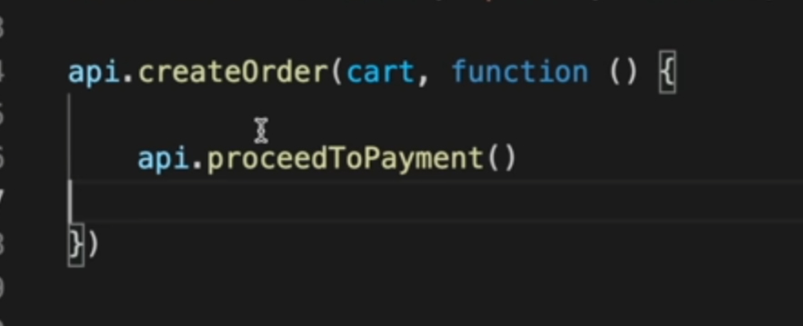

Here execution of `proceedToPayment` is dependent on `createOrder` function,
hence we have lost the control over it. There code multiple issues
with `createOrder` function which will affect `proceedToPayment` function.

---
</details>

<details >
 <summary style="font-size: x-large; font-weight: bold">Promise</summary>

### A `Promise` is an object representing the eventual completion or failure of an asynchronous operation.

<details >
 <summary style="font-size: medium; font-weight: bold">Namaste JS</summary>

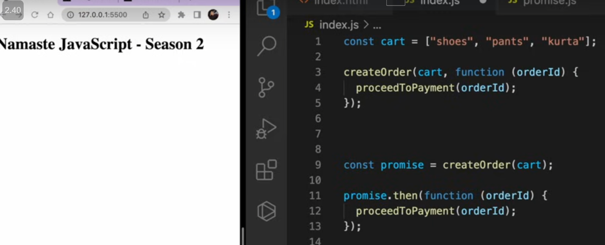


Alike in callback we where passing function we are attaching `proceedToPayment` function to it.
This gives more control over it.


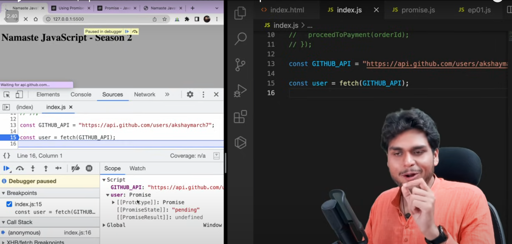

Initially `user` will be undefined but after line 15 `user` will have `promise` object.
It has two value
1. PromiseState (pending, fulfilled, rejected)
2. PromiseResult

Solving Callback Hell


Referred Video: https://youtu.be/ap-6PPAuK1Y?si=XgXdtziWUV-JRDId

**Creating a Promise**


### What is Callback Hell?

**Callback hell** refers to the situation where multiple asynchronous functions are nested within each other, leading to code that is difficult to read, maintain, and debug. This usually happens when callbacks are used in a sequential manner, and each subsequent operation depends on the result of the previous one.

#### Example of Callback Hell

```javascript
function getUser(userId, callback) {
    setTimeout(() => {
        console.log("Fetched user");
        callback({ userId, name: "John" });
    }, 1000);
}

function getPosts(userId, callback) {
    setTimeout(() => {
        console.log("Fetched posts");
        callback([{ postId: 1, content: "Post 1" }, { postId: 2, content: "Post 2" }]);
    }, 1000);
}

function getComments(postId, callback) {
    setTimeout(() => {
        console.log("Fetched comments");
        callback([{ commentId: 1, content: "Nice post!" }, { commentId: 2, content: "Thanks!" }]);
    }, 1000);
}

// Callback hell with nested functions
getUser(1, (user) => {
    getPosts(user.userId, (posts) => {
        getComments(posts[0].postId, (comments) => {
            console.log(comments);
        });
    });
});
```

In the above example, the code becomes increasingly nested as we fetch user data, posts, and comments in sequence, which makes it harder to follow and maintain.

### How Promises Solve Callback Hell

Promises are used to handle asynchronous operations in a more readable and maintainable way by chaining them, rather than nesting. Promises help flatten the structure of asynchronous calls, allowing better readability.

#### Example Using Promises

```javascript
function getUser(userId) {
    return new Promise((resolve, reject) => {
        setTimeout(() => {
            console.log("Fetched user");
            resolve({ userId, name: "John" });
        }, 1000);
    });
}

function getPosts(userId) {
    return new Promise((resolve, reject) => {
        setTimeout(() => {
            console.log("Fetched posts");
            resolve([{ postId: 1, content: "Post 1" }, { postId: 2, content: "Post 2" }]);
        }, 1000);
    });
}

function getComments(postId) {
    return new Promise((resolve, reject) => {
        setTimeout(() => {
            console.log("Fetched comments");
            resolve([{ commentId: 1, content: "Nice post!" }, { commentId: 2, content: "Thanks!" }]);
        }, 1000);
    });
}

// Promise chaining to avoid callback hell
getUser(1)
    .then(user => getPosts(user.userId))
    .then(posts => getComments(posts[0].postId))
    .then(comments => console.log(comments))
    .catch(error => console.error(error));
```

### Key Differences:
- **Readability**: Promises allow us to chain operations in a flat structure, making the code easier to read.
- **Error Handling**: Promises provide a built-in way to handle errors using `.catch()`, whereas error handling in callbacks can become cumbersome.


---
</details>

<details >
 <summary style="font-size: medium; font-weight: bold">Maximilian Schwarzmüller</summary>

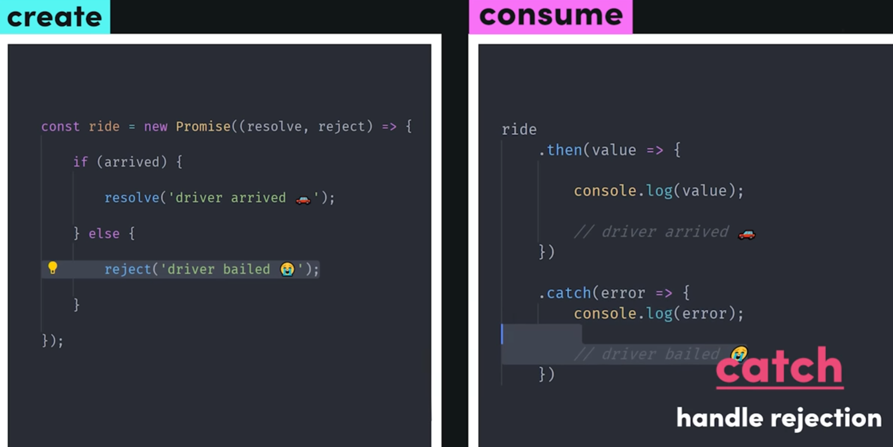
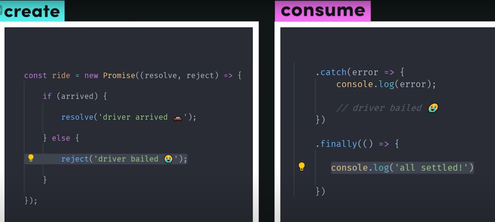

Go through these below video for more details:
https://www.udemy.com/course/javascript-the-complete-guide-2020-beginner-advanced/learn/lecture/16329906#overview


---
</details>

**MUST do `Promise.all` polyfill question:**
[1-important-concept -> 04-js-concept -> polyfills -> promise.all](../polyfills/readme.md)


Nice article by Builder.io:
https://www.builder.io/blog/promises

<details >
 <summary style="font-size: medium; font-weight: bold">Promise API's</summary>

<details >
 <summary style="font-size: small; font-weight: bold">Promise.all()</summary>

1. All success cases


2. Some failure cases


As soon we get error from any one promise error is thrown and no other 
promise will be executed.

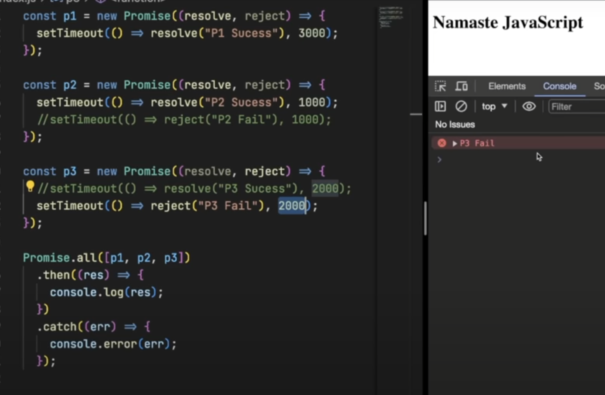


---
</details>

<details >
 <summary style="font-size: small; font-weight: bold">Promise.allSettled()</summary>

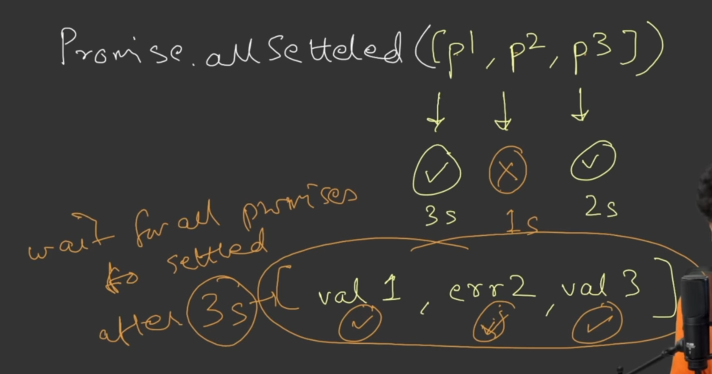


---
</details>

<details >
 <summary style="font-size: small; font-weight: bold">Promise.race()</summary>


Value of **first settled promise** will be returned irresptive of error or failure


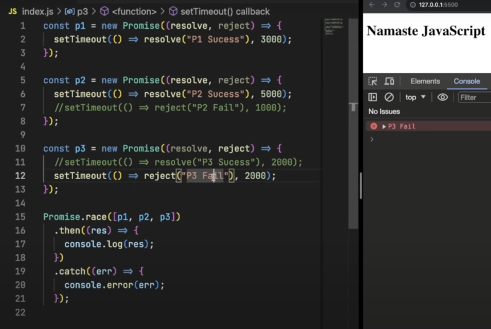


---
</details>

<details >
 <summary style="font-size: small; font-weight: bold">Promise.any()</summary>

Value of **first success settled promise** will be returned

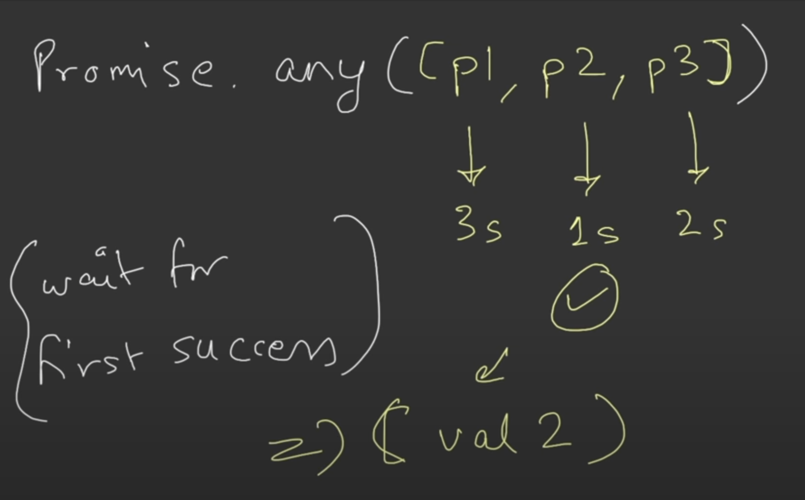

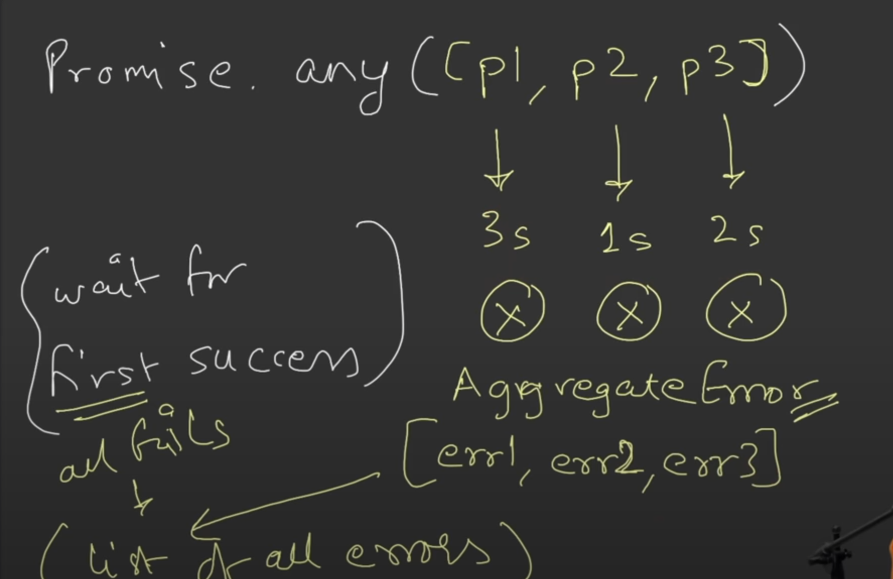
If all error case then **aggregateError** is thrown


---
</details>

Referred Video: https://youtu.be/DlTVt1rZjIo?si=UlMdAtzKcaydIACp

---
</details>


---
</details>


<details >
 <summary style="font-size: x-large; font-weight: bold">Async / Await</summary>


### Async functions Always return a promise

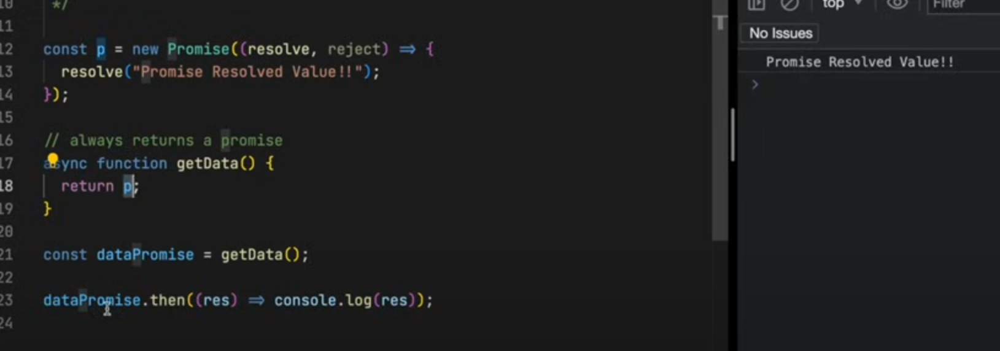

If we returning Promise in async function then it will same like above and it 
return Promise of promise

**For async/await go through the Maximilian Schwarzmüller video**

---
</details>
