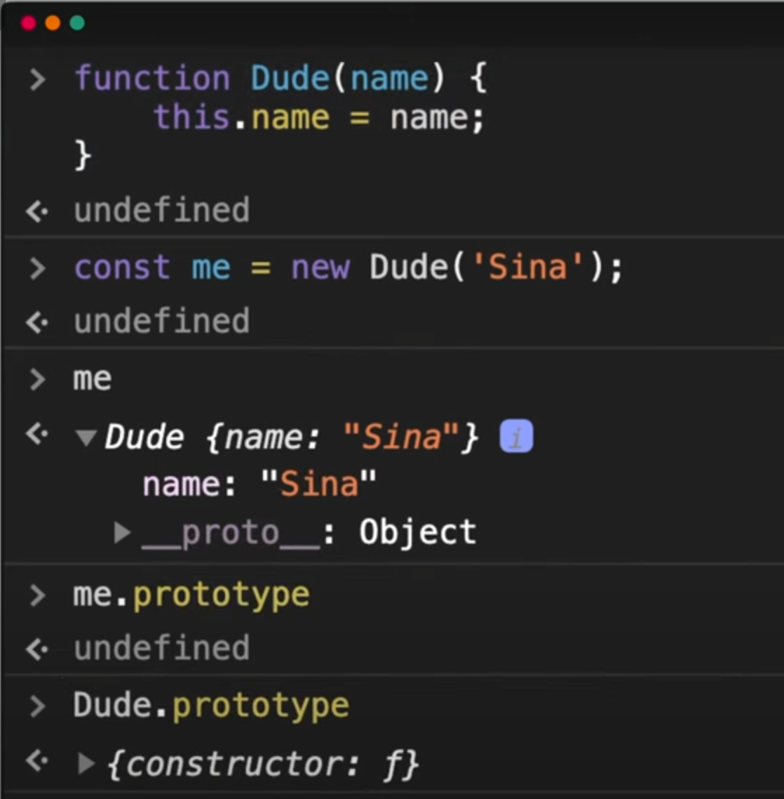

<details >
 <summary style="font-size: x-large; font-weight: bold">Inheritance</summary>


1. #### Inheritance using `Classes`

```javascript
class Person {
  talk() {
    return 'Talking';
  }
}

const me = new Person();
const you = new Person();
me.talk(); // Talking
you.talk(); // Talking

// To update the function for both instances you only have to do it once:
Person.prototype.talk = function () {
  return 'New and improved Talking';
}; 
```

2. Inheritance using a `Constructor Function`

```javascript
function Person() {};
Person.prototype.talk = function () {
  return 'Talking';
}

const me = new Person();
const you = new Person();
me.talk(); // Talking
you.talk(); // Talking
```

3. **Prototypal Inheritance:** Inheritance using `pure objects with Object.create`

```javascript
const person = {
  talk() {
    return 'Talking';
  }
}
const me = Object.create(person);
me.talk(); // Talking
```
Note: Using Object.create to build the inheritance chain is no longer recommended. Use Object.setPrototypeOf instead.

4. Inheritance using `pure objects with Object.setPrototypeOf`

```javascript
const person = {}
person.__proto__.talk = function (){
  return 'Talking';
}
const me = {};
Object.setPrototypeOf(me, person);
me.talk(); // Talking
```

5. Extending a Class using `extends`
```javascript
class Person {
  talk() {
    return 'talking';
  }
}

class SuperHuman extends Person {
  fly() {
    return 'flying';
  }
}
const me = new Person();
console.log(me.talk); // talk exists
console.log(me.fly); // fly does NOT exists

const you = new SuperHuman();
console.log(you.fly); // fly exists
console.log(you.talk); // talk also exists!
```

Important caveat

1. `Properties vs. Methods`


Anything that is not defined as `method` will not change for child instances
even if we change it in the parent. Like in above example property `age` is not changed even
after changing `age` of parent `person`


_**`Property` is what a parent have and `Method` are what they do**_

Referred Video: https://youtu.be/1UTqFAjYx1k?si=FHSI15TwIILvqMIs


---
</details>


<details >
 <summary style="font-size: x-large; font-weight: bold">`prototype` Vs `__proto__`</summary>

### `__proto__`

Creating an Object

```javascript
//1.
const me = {};

//2.
const me = new Object();

//3. 
const me = Object.create({});
```


Every `Object` has an `__proto__` property.


1. `__proto__` in `Array`
   

2. `__proto__` in `String`
   

3. `__proto__` in `Chain of Object`
   

Creating instance of `ben` from `sina` object


### `prototype`


`prototype` does not belong to any `Object` or instances but only to `Constructor functions` or
`Classes`




We are creating instances of `me` constructor function of Object


Referred Video: https://youtu.be/1UTqFAjYx1k?si=_rYdylQi8aK3zaO6


---
</details>


