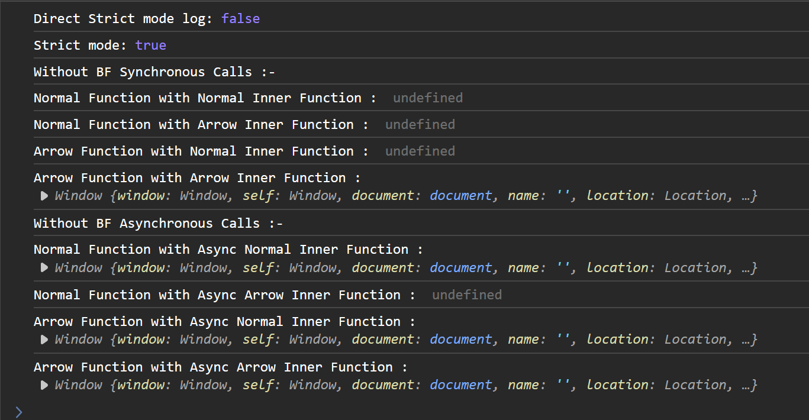

        


All `undefined` output in below cases in `Non-Strict` mode will return `window` object


All Below code are in `Strict` Mode


# All of these need to be memorized first, and once it is done, then we can apply them logically in other places like constructor function, factory function, class etc

## Synchronous Scenarios


Object Definitions:-

```js
"use strict";

console.log('Direct Strict mode log:', typeof this === 'undefined')

function myFunction() {
    console.log('Strict mode:', typeof this === 'undefined'); // Logs true
}

myFunction();

let bfKapoorObject = {
    name: "Ranbir Kapoor",
    age: 41,
    gfFunction: function() {
        console.log("Kapoor Normal Function : ", this)
    },
    gfArrowFunction: () => {
        console.log("Kapoor Arrow Function : ", this)
    }
}

let bfSinghObject = {
    name: "Ranbir Singh",
    age: 38,
    gfFunction() {
        console.log("Singh Normal Function : ", this)
    },
    gfArrowFunction: () => {
        console.log("Singh Arrow Function : ", this)
    }
}
```
### Normal BF Calls

```js

//Case-1
console.log("With BF Normal Function : ");
bfKapoorObject.gfFunction()

//Case-2
console.log("With BF Arrow Function : ");
bfKapoorObject.gfArrowFunction();

//Case-3
console.log("Without BF Normal Function: ");
const withoutBfNormalGfFn = bfKapoorObject.gfFunction;
withoutBfNormalGfFn();

//Case-4
console.log("Without BF Arrow Function: ");
const withoutBfArrowGfFn = bfKapoorObject.gfArrowFunction;
withoutBfArrowGfFn();
```

Output:


<details >
 <summary style="font-size: small; font-weight: bold">⭐Dev Tool Explanation[Important]</summary>


### Case-1

**Here `normal gf function` is _attached_ to its `bf object`, hence calling out his name**


### Case-2
**Even though `arrow gf function` is with `bf object`, but it is attached to `Nearest parent -> global scope`, hence it will call global scope**


### Case-3
**Here we are just storing `normal gf function` definition and because during the time of execution there
is no one with `normal gf function`, hence it will call `Next Nearest parent -> global scope`**


### Case-4
**Same as above, just storing `arrow gf function` definition and calling `Nearest parent -> global scope`  irrespective of with or without `bf object`**


---
</details>

### Change BF Techniques using `call()`/`apply()`

### `call()`/`apply()` help `Normal GF Function` change its `BF Object` with `Other BF Object` irrespective with or without its `BF Object`
```js
//Case-1
console.log("Call: With BF Normal Function : ");
bfKapoorObject.gfFunction.call(bfSinghObject)

//Case-2
console.log("Call: With BF Arrow Function : ");
bfKapoorObject.gfArrowFunction.call(bfSinghObject);

//Case-3
console.log("Call: Without BF Normal Function: ");
const withoutBfNormallGfCallFn = bfKapoorObject.gfFunction;
withoutBfNormallGfCallFn.call(bfSinghObject);

//Case-4
console.log("Call: Without BF Arrow Function: ");
const withoutBfArrowGfCallFn = bfKapoorObject.gfArrowFunction;
withoutBfArrowGfCallFn.call(bfSinghObject);
```

Output: 


<details >
 <summary style="font-size: small; font-weight: bold">⭐Dev Tool Logs[Important]</summary>

### Case-1


### Case-2


### Case-3


### Case-4


---
</details>

### Marry BF using `bind()`

```js
//Case-1
console.log("Bind: BF Normal Function: ");
const BfNormalGfBindFn = bfKapoorObject.gfFunction.bind(bfSinghObject);
BfNormalGfBindFn();

//Case-2
console.log("Bind: BF Arrow Function: ");
const BfArrowGfBindFn = bfKapoorObject.gfArrowFunction.bind(bfSinghObject);
BfArrowGfBindFn();
```

Output:


<details >
 <summary style="font-size: small; font-weight: bold">⭐Dev Tool Logs[Important]</summary>

### Case-1


### Case-2


---
</details>


## Asynchronous Inner Function Scenarios

Object Definitions:-
```js
"use strict";

console.log('Direct Strict mode log:', typeof this === 'undefined')

function myFunction() {
    console.log('Strict mode:', typeof this === 'undefined'); // Logs true
}

myFunction();

let bfSyncObject = {
    name: "Ranbir Kapoor",
    age: 41,
    gfFnInnerFn: function() {
        function inner() {
            console.log("Normal Function with Normal Inner Function : ", this)
        }
        inner();
    },
    gfFnArrowInnerFn: function() {
        const inner = () => {
            console.log("Normal Function with Arrow Inner Function : ", this)
        }
        inner();
    },
    gfArrowFnInnerFn: () => {
        function inner() {
            console.log("Arrow Function with Normal Inner Function : ", this)
        }
        inner();
    },
    gfArrowFnArrowInnerFn: () => {
        const inner = () => {
            console.log("Arrow Function with Arrow Inner Function : ", this)
        }
        inner();
    }
}


let bfAsynObject = {
    name: "Ranbir Kapoor",
    age: 41,
    gfFnAsyncInnerFn: function() {
        setTimeout(function() {
            console.log("Normal Function with Async Normal Inner Function : ", this)
        }, 1000)
    },
    gfFnAsyncArrowInnerFn: function() {
        setTimeout(() => {
            console.log("Normal Function with Async Arrow Inner Function : ", this)
        }, 1000)
    },
    gfArrowFnAsyncInnerFn: () => {
        setTimeout(function() {
            console.log("Arrow Function with Async Normal Inner Function : ", this)
        }, 1000)
    },
    gfArrowFnAsyncArrowInnerFn: () => {
        setTimeout(() => {
            console.log("Arrow Function with Async Arrow Inner Function : ", this)
        }, 1000)
    }
}

```


### With BF Synchronous / Asynchronous Inner Function

```js
//With BF Synchronous Calls

console.log("With BF Synchronous Calls :-");

//Case-1

bfSyncObject.gfFnInnerFn();

//Case-2
bfSyncObject.gfFnArrowInnerFn();

//Case-3
bfSyncObject.gfArrowFnInnerFn();

//Case-4
bfSyncObject.gfArrowFnArrowInnerFn();


//With BF Asynchronous Calls

console.log("With BF Asynchronous Calls :-");

//Case-1
bfAsynObject.gfFnAsyncInnerFn();

//Case-2
bfAsynObject.gfFnAsyncArrowInnerFn();

//Case-3
bfAsynObject.gfArrowFnAsyncInnerFn();

//Case-4
bfAsynObject.gfArrowFnAsyncArrowInnerFn();
```

Output:


<details >
 <summary style="font-size: small; font-weight: bold">⭐Dev Tool With BF Sync Explanation[Important]</summary>

### Case-1


When we start executing `gfInnerFn` we can see in its execution context we have `this` pointing to its attached `bf object`
and `inner` function definition

Then once we start executing `inner` function we can see in its execution context we have `this` pointing to `global scope`

### Case-2


When we start executing `gfArrowInnerFn` we can see in its execution context we have `this` pointing to its attached `bf object`
and `inner` function definition


Now since `inner` function is an arrow function, we can see in its execution context we have `this` pointing to `Nearest parent -> bfSyncObject`

---
</details>


### Without BF Synchronous / Asynchronous Inner Function

```js
//Without BF Synchronous Calls

console.log("Without BF Synchronous Calls :-");

//Case-1

const withoutBfGfFnInnerFn = bfSyncObject.gfFnInnerFn;
withoutBfGfFnInnerFn();

//Case-2
const withoutBfGfFnArrowInnerFn = bfSyncObject.gfFnArrowInnerFn;
withoutBfGfFnArrowInnerFn();

//Case-3
const withoutBfGfArrowFnInnerFn = bfSyncObject.gfArrowFnInnerFn;
withoutBfGfArrowFnInnerFn();

//Case-4
const withoutBfGfArrowFnArrowInnerFn = bfSyncObject.gfArrowFnArrowInnerFn;
withoutBfGfArrowFnArrowInnerFn();


//Without BF Asynchronous Calls

console.log("Without BF Asynchronous Calls :-");

//Case-1
const withoutBfGfFnAsyncInnerFn = bfAsynObject.gfFnAsyncInnerFn;
withoutBfGfFnAsyncInnerFn();

//Case-2
const withoutBfGfFnAsyncArrowInnerFn = bfAsynObject.gfFnAsyncArrowInnerFn;
withoutBfGfFnAsyncArrowInnerFn();

//Case-3
const withoutBfGfArrowFnAsyncInnerFn = bfAsynObject.gfArrowFnAsyncInnerFn;
withoutBfGfArrowFnAsyncInnerFn();

//Case-4
const withoutBfGfArrowFnAsyncArrowInnerFn = bfAsynObject.gfArrowFnAsyncArrowInnerFn;
withoutBfGfArrowFnAsyncArrowInnerFn();

```

Output:



---
title: What advantage is there for using the JavaScript arrow syntax for a method in a constructor?
---

## TL;DR

The main advantage of using an arrow function as a method inside a constructor is that the value of `this` gets set at the time of the function creation and can't change after that. When the constructor is used to create a new object, `this` will always refer to that object.

For example, let's say we have a `Person` constructor that takes a first name as an argument has two methods to `console.log()` that name, one as a regular function and one as an arrow function:

```js
const Person = function (name) {
  this.name = name;
  this.sayName1 = function () {
    console.log(this.name);
  };
  this.sayName2 = () => {
    console.log(this.name);
  };
};

const john = new Person('John');
const dave = new Person('Dave');

john.sayName1(); // John
john.sayName2(); // John

// The regular function can have its `this` value changed, but the arrow function cannot
john.sayName1.call(dave); // Dave (because `this` is now the dave object)
john.sayName2.call(dave); // John

john.sayName1.apply(dave); // Dave (because `this` is now the dave object)
john.sayName2.apply(dave); // John

john.sayName1.bind(dave)(); // Dave (because `this` is now the dave object)
john.sayName2.bind(dave)(); // John

const sayNameFromWindow1 = john.sayName1;
sayNameFromWindow1(); // undefined (because `this` is now the window object)

const sayNameFromWindow2 = john.sayName2;
sayNameFromWindow2(); // John
```

The main takeaway here is that `this` can be changed for a normal function, but `this` always stays the same for an arrow function. So even if you are passing around your arrow function to different parts of your application, you wouldn't have to worry about the value of `this` changing.

More Details: https://www.greatfrontend.com/questions/quiz/what-advantage-is-there-for-using-the-arrow-syntax-for-a-method-in-a-constructor?format=quiz

## Conclusion

1. **Normal** GF function **with BF** output **BF** object
2. GF **without BF** output **Global Scope**(`window` object or `undefined`) object
3. Change BF using `call()`/`apply()` output **changed BF** object
4. Marry BF using `bind()` output **married BF** object
5. Only Inner Arrow function(Synchronous/ Asynchronous[`setTimeout()`, ...etc]) 
**inside Normal GF Function** does child marriage when called with BF hence output **child married BF** object

All rule is followed from top to bottom meaning: 
GF function called without BF in case of "Normal Function with Async Arrow Inner Function"
So rule 2 is applied and nothing else matter. Hence will output Global scope object

**_Arrow function execute wrt to global scope normally and wrt to defined BF object scope 
if executed inside normal GF function. Basically it executes to its Lexical Scope which is global all
the time, until it is defined inside any function_**

If `arrow function` execute inside another `arrow function` then 

**Referred Video:** https://www.youtube.com/watch?v=hwoU8NCICSE


`this` does not bind to any object it binds to function that's why arrow function
behave differently than normal function

You can think what would happen if arrow function was not there, it will behave 
same if we have arrow function


<details >
 <summary style="font-size: medium; font-weight: bold">Some More Example/Questions</summary>

1. 


2. 


3. 


4. 


5. 

6.


---
</details>


Some silly mistake😅


Here we are getting above error as `gfFunction()` is not return anything,
it is just logging the value


