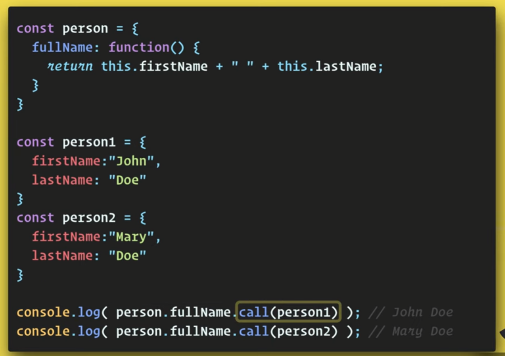
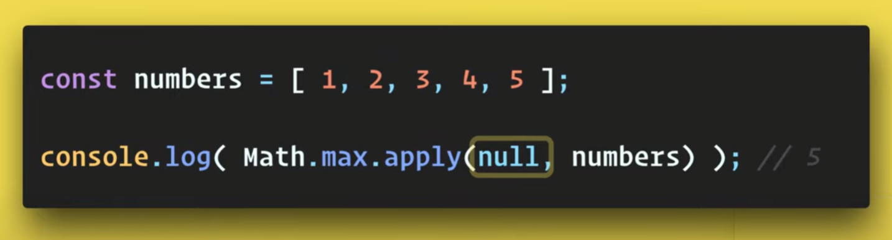

1. If we want to know the `context` of any given function then we use `this` to know.

2. What is context?
   - It is simply an `object` that can be accessed by a function using `this` keyword.
   Content changes based on different scenarios. Like we have `Window` object
   holding all browser API's and other globally defined variables.

   - It also can be `Function` which is actually a `object` only. Like in case if we write pollyfill of `call` where `this` point to function on its called etc

3. 
   1. For `Arrow Function`, it is simply context of the nearest parent function, and **we cannot
      change or add context to it by any means** 
   2. For a `Normal Function`, we have different way to `change` and `add` context to a given function. If we don't give any context, then it is `undefined` by default
      1. **Directly**: `bfObj.gfFn()`(`bfObj` is context of `gfFn`)  or `gfFn.call(bfObj)` (`gfFn` is context of `call` method)
      2. Use `call`/`apply` method with it to change its context `bfObj1.gfFn.call(bfObj2)`
      3. Use `bind` method with it to make its context permanent `bfObj1.gfFn.bind(bfObj2)`


Q. Why there is sometime `undefined` and sometime `window`?

Q. Whats the difference in output for objects created using `constructor` v/s `factor` v/s `class` function


- For any object created using `new` keyword in case of `constructor Function` & `class`,
If we have`Arrow Function` inside then execution context is set for that `Arrow Function` during the creation time only and
since we cannot change context of `Arrow Function`[through `call`, `apply`, `bind`], so `this` inside the
`Arrow Function` is always point to the `object` which is created using `new` keyword.

- Whereas in case of `Normal Function` it always needs context to make `this` defined. And if we don't
give context using any of the methods like `call`, `apply`, `bind` or executing it with given object
then it will always be `undefined`.


- For normal function it really does not matter how it was created, the only thing important
for normal function is that while we execute are we able to give context to it

- For Arrow function only thing matter is how it was created. While executing it does not
matter how you want to execute it. Nothing can change context. Only way to provide context
to arrow function is through wrapping it into a normal function or or using `constructor` or `class` while creating object.

  
- While executing `setTimeout` execution context is `Windows` for it

### Good Example below proving above points

#### Preserving context and fixing the `this` value in callbacks

When you pass a function as a callback, the `this` value inside the function can be unpredictable because it is determined by the execution context. Using `bind()` helps ensure that the correct `this` value is maintained.

```js
class Person {
  constructor(name) {
    this.name = name;
  }
  greet() {
    console.log(`Hello, my name is ${this.name}`);
  },
};

const john = new Person('John Doe');

// Without bind(), `this` inside the callback will be the global object
setTimeout(john.greet, 1000); // Output: "Hello, my name is undefined"

// Using bind() to fix the `this` value
setTimeout(john.greet.bind(john), 2000); // Output: "Hello, my name is John Doe"
```

You can also use [arrow functions](https://developer.mozilla.org/en-US/docs/Web/JavaScript/Reference/Functions/Arrow_functions) to define class methods for this purpose instead of using `bind`. Arrow functions have the `this` value bound to its lexical context.

```js
class Person {
  constructor(name) {
    this.name = name;
  }
  greet = () => {
    console.log(`Hello, my name is ${this.name}`);
  };
}

const john = new Person('John Doe');
setTimeout(john.greet, 1000); // Output: "Hello, my name is John Doe"
```


<details >
 <summary style="font-size: large; font-weight: bold">Fireship `this`</summary>


Depends on where it is used

1. If it is used in browser, it will return a window object & if it is used in node, it will return a global object
   
   
   In `use strict` mode `this` will be undefined in browser, so always tend to use `Window` or
   `Global` directly
   
   

Referred Video: https://www.youtube.com/watch?v=YOlr79NaAtQ


---
</details>


<details >
 <summary style="font-size: large; font-weight: bold">.call(), .apply() & .bind() Examples</summary>

## `call()`





## `apply()`


#### Usecase

Keep `this` as null since it is not required and we are able to pass array for getting max value
which won't be possible without `apply()`



Useful mnemonic is "**A** for array and **C** for comma" to remember `apply()` and `call()`
## `bind()`

## TL;DR

`Function.prototype.bind` is a method in JavaScript that allows you to create a new function with a specific `this` value and optional initial arguments. It's primary purpose is to:

- **Binding `this` value to preserve context**: The primary purpose of `bind` is to bind the `this` value of a function to a specific object. When you call `func.bind(thisArg)`, it creates a new function with the same body as `func`, but with `this` permanently bound to `thisArg`.
- **Partial application of arguments**: `bind` also allows you to pre-specify arguments for the new function. Any arguments passed to `bind` after `thisArg` will be prepended to the arguments list when the new function is called.
- **Method borrowing**: `bind` allows you to borrow methods from one object and apply them to another object, even if they were not originally designed to work with that object.

The `bind` method is particularly useful in scenarios where you need to ensure that a function is called with a specific `this` context, such as in event handlers, callbacks, or method borrowing.

https://www.greatfrontend.com/questions/quiz/explain-function-prototype-bind?practice=practice&tab=quiz


Referred Video: https://www.youtube.com/watch?v=rZc7_2YXbP8

---

---
</details>


