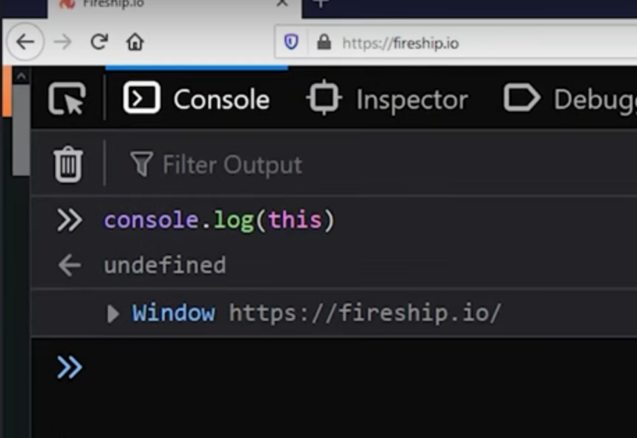
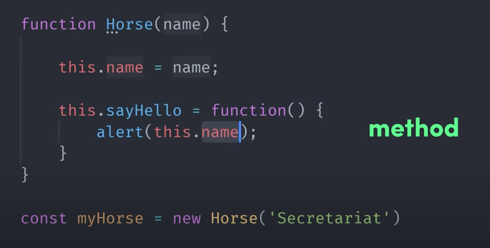
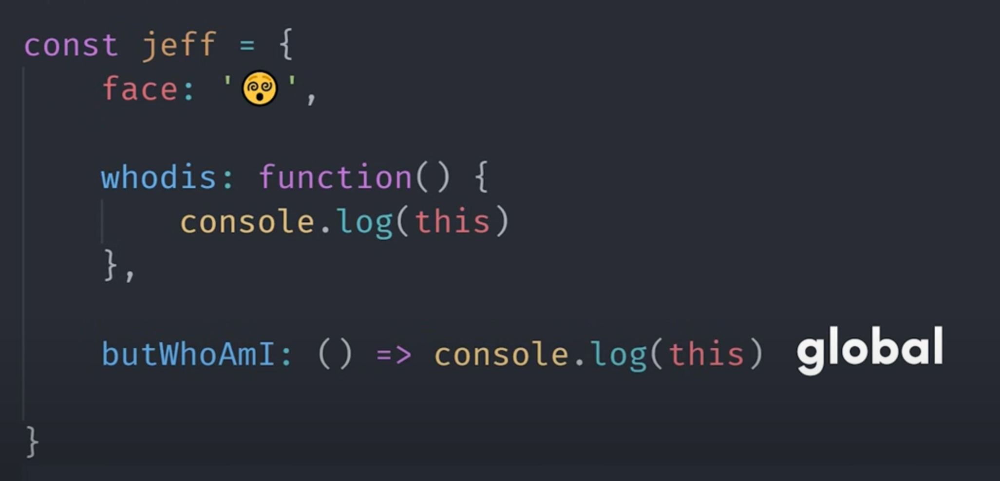

## `this`

Depends on where it is used

1. If it is used in browser, it will return a window object & if it is used in node, it will return a global object

In `use strict` mode `this` will be undefined in browser, so always tend to use `Window` or
`Global` directly

2. If it is used in a function, it will refer to an object that is calling it

### Most usecase found in 

1. Constructor

### Weird Caveat
1. 

In case of normal function `this` will be the object that is calling it

But in arrow function `this` will be undefined in `use strict` mode and
in non `use strict` mode it will be the global object

In arrow function it is basically based on an **enclosing object of execution context** in this example it is `global`

