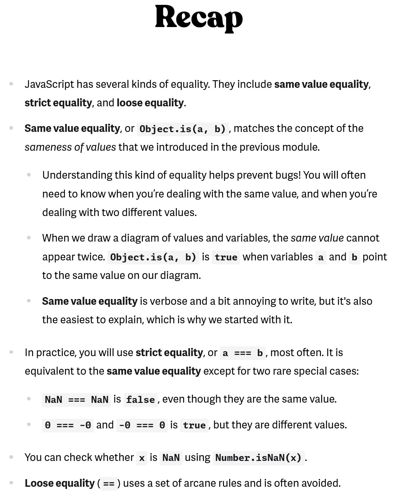
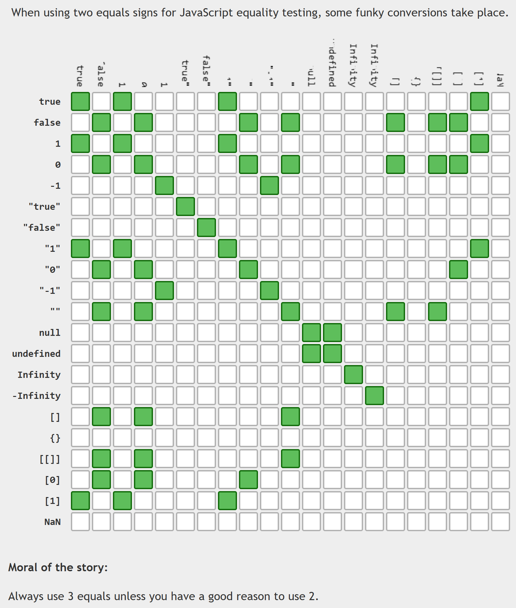

<details >
 <summary style="font-size: large; font-weight: bold">Explain the differences between CommonJS modules and ES modules in JavaScript
</summary>


## TL;DR

In JavaScript, modules are reusable pieces of code that encapsulate functionality, making it easier to manage, maintain, and structure your applications. Modules allow you to break down your code into smaller, manageable parts, each with its own scope.

**CommonJS** is an older module system that was initially designed for server-side JavaScript development with Node.js. It uses the `require()` function to load modules and the `module.exports` or `exports` object to define the exports of a module.

```js
// my-module.js
const value = 42;
module.exports = { value };

// main.js
const myModule = require('./my-module.js');
console.log(myModule.value); // 42
```

**ES Modules** (ECMAScript Modules) are the standardized module system introduced in ES6 (ECMAScript 2015). They use the `import` and `export` statements to handle module dependencies.

```js
// my-module.js
export const value = 42;

// main.js
import { value } from './my-module.js';
console.log(value); // 42
```

**CommonJS vs ES modules**

| Feature | CommonJS | ES modules |
| --- | --- | --- |
| Module Syntax | `require()` for importing `module.exports` for exporting | `import` for importing `export` for exporting |
| Environment | Primarily used in Node.js for server-side development | Designed for both browser and server-side JavaScript (Node.js) |
| Loading | Synchronous loading of modules | Asynchronous loading of modules |
| Structure | Dynamic imports, can be conditionally called | Static imports/exports at the top level |
| File extensions | `.js` (default) | `.mjs` or `.js` (with `type: "module"` in `package.json`) |
| Browser support | Not natively supported in browsers | Natively supported in modern browsers |
| Optimization | Limited optimization due to dynamic nature | Allows for optimizations like tree-shaking due to static structure |
| Compatibility | Widely used in existing Node.js codebases and libraries | Newer standard, but gaining adoption in modern projects |

---

## Modules in Javascript

Modules in JavaScript are a way to organize and encapsulate code into reusable and maintainable units. They allow developers to break down their codebase into smaller, self-contained pieces, promoting code reuse, separation of concerns, and better organization. There are two main module systems in JavaScript: CommonJS and ES modules.

### CommonJS

CommonJS is an older module system that was initially designed for server-side JavaScript development with Node.js. It uses the require function to load modules and the `module.exports` or `exports` object to define the exports of a module.

- **Syntax**: Modules are included using `require()` and exported using `module.exports`.
- **Environment**: Primarily used in `Node.js`.
- **Execution**: Modules are loaded synchronously.
- Modules are loaded dynamically at runtime.

```js
// my-module.js
const value = 42;
module.exports = { value };

// main.js
const myModule = require('./my-module.js');
console.log(myModule.value); // 42
```

### ES Modules

ES Modules (ECMAScript Modules) are the standardized module system introduced in ES6 (ECMAScript 2015). They use the `import` and `export` statements to handle module dependencies.

- **Syntax**: Modules are imported using `import` and exported using `export`.
- **Environment**: Can be used in both browser environments and Node.js (with certain configurations).
- **Execution**: Modules are loaded asynchronously.
- **Support**: Introduced in ES2015, now widely supported in modern browsers and Node.js.
- Modules are loaded statically at compile-time.
- Enables better performance due to static analysis and tree-shaking.

```js
// my-module.js
export const value = 42;

// main.js
import { value } from './my-module.js';
console.log(value); // 42
```
</details>


<details >
<summary style="font-size: large; font-weight: bold">How do you abort a web request using `AbortController` in JavaScript?</summary>


## TL;DR

`AbortController` is used to cancel ongoing asynchronous operations like fetch requests.

```js
const controller = new AbortController();
const signal = controller.signal;

fetch('https://jsonplaceholder.typicode.com/todos/1', { signal })
  .then((response) => {
    // Handle response
  })
  .catch((error) => {
    if (error.name === 'AbortError') {
      console.log('Request aborted');
    } else {
      console.error('Error:', error);
    }
  });

// Call abort() to abort the request
controller.abort();
```

Aborting web requests is useful for:

- Canceling requests based on user actions.
- Prioritizing the latest requests in scenarios with multiple simultaneous requests.
- Canceling requests that are no longer needed, e.g. after the user has navigated away from the page.

---

## `AbortController`s

`AbortController` allows graceful cancelation of ongoing asynchronous operations like fetch requests. It offers a mechanism to signal to the underlying network layer that the request is no longer required, preventing unnecessary resource consumption and improving user experience.

## Using `AbortController`s

Using `AbortController`s involve the following steps:

1. **Create an `AbortController` instance**: Initialize an `AbortController` instance, which creates a signal that can be used to abort requests.
1. **Pass the signal to the request**: Pass the signal to the request, typically through the `signal` property in the request options.
1. **Abort the request**: Call the `abort()` method on the `AbortController` instance to cancel the ongoing request.

Here is an example of how to use `AbortController`s with the `fetch()` API:

```js
const controller = new AbortController();
const signal = controller.signal;

fetch('https://jsonplaceholder.typicode.com/todos/1', { signal })
  .then((response) => {
    // Handle response
  })
  .catch((error) => {
    if (error.name === 'AbortError') {
      console.log('Request aborted');
    } else {
      console.error('Error:', error);
    }
  });

// Call abort() to abort the request
controller.abort();
```

## Use cases

### Canceling a `fetch()` request on a user action

Cancel requests that take too long or are no longer relevant due to user interactions (e.g., user cancels uploading of a huge file).

```js
// HTML:
// <div>
//   <button id="cancel-button">Cancel upload</button>
// </div>

const controller = new AbortController();
const signal = controller.signal;

fetch('https://jsonplaceholder.typicode.com/todos/1', { signal })
  .then((response) => {
    // Handle successful response
  })
  .catch((error) => {
    if (error.name === 'AbortError') {
      console.log('Request canceled');
    } else {
      console.error('Network or other error:', error);
    }
  });

document.getElementById('cancel-button').addEventListener('click', () => {
  controller.abort();
});
```

When you click the "Cancel upload" button, in-flight request will be aborted.

### Prioritizing latest requests in a race condition

In scenarios where multiple requests are initiated for the same data, use `AbortController` to prioritize the latest request and abort earlier ones.

```js
let latestController = null; // Keeps track of the latest controller

function fetchData(url) {
  if (latestController) {
    latestController.abort(); // Abort any previous request
  }

  const controller = new AbortController();
  latestController = controller;
  const signal = controller.signal;

  fetch(url, { signal })
    .then((response) => {
      // Handle successful response
    })
    .catch((error) => {
      if (error.name === 'AbortError') {
        console.log('Request canceled');
      } else {
        console.error('Network or other error:', error);
      }
    });
}
```

In this example, when the `fetchData()` function is called multiple times triggering multiple fetch requests, `AbortController`s will cancel all the previous requests except the latest request. This is common in scenarios like type-ahead search or infinite scrolling, where new requests are triggered frequently.

### Canceling requests that are no longer needed

In situations where the user has navigated away from the page, aborting the request can prevent unnecessary operations (e.g. success callback handling), and freeing up resources by lowering the likelihood of memory leaks.

## Notes

- `AbortController`s is not `fetch()`-specific, it can be used to abort other asynchronous tasks as well.
- A singular `AbortContoller` instance can be reused or multiple async tasks and cancel all of them at once.
- Calling `abort()` on `AbortController`s does not send any notification or signal to the server. The server is unaware of the cancelation and will continue processing the request until it completes or times out.

## Further reading

- [AbortController | MDN](https://developer.mozilla.org/en-US/docs/Web/API/AbortController)
- [Fetch: Abort | Javascript.info](https://javascript.info/fetch-abort)

</details>


<details >
 <summary style="font-size: large; font-weight: bold">What is the difference between `==` and `===` in JavaScript?</summary>


https://justjavascript.com/learn/07-equality-of-values

https://www.greatfrontend.com/questions/quiz/what-is-the-difference-between-double-equal-and-triple-equal?practice=practice&tab=quiz


https://dorey.github.io/JavaScript-Equality-Table/
</details>
