<details >
 <summary style="font-size: x-large; font-weight: bold">Callback</summary>

Callback are used to handle asynchronous code. 
It is a function that is passed as an argument to another function. 


### Callback Hell
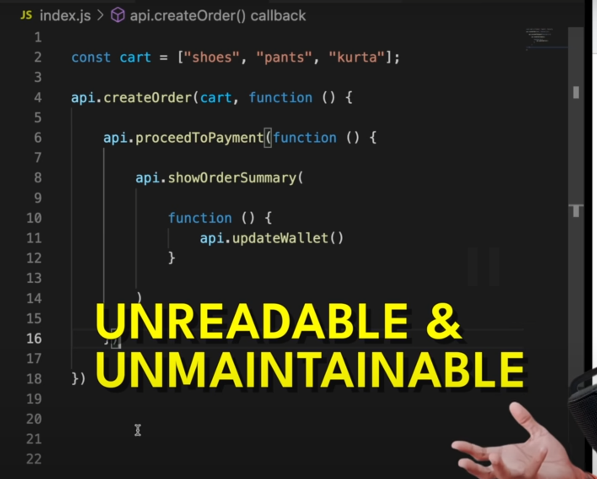


One function called inside another because each one need to happen
after the other. 

Like in first create order -> Proceed To payment -> show order summary

### Inversion of Control


Here execution of `proceedToPayment` is dependent on `createOrder` function,
hence we have lost the control over it. There code multiple issues
with `createOrder` function which will affect `proceedToPayment` function.
</details>

<details >
 <summary style="font-size: x-large; font-weight: bold">Promise</summary>

### A `Promise` is an object representing the eventual completion or failure of an asynchronous operation.

<details >
 <summary style="font-size: medium; font-weight: bold">Namaste JS</summary>


Alike in callback we where passing function we are attaching `proceedToPayment` function to it.
This gives more control over it.

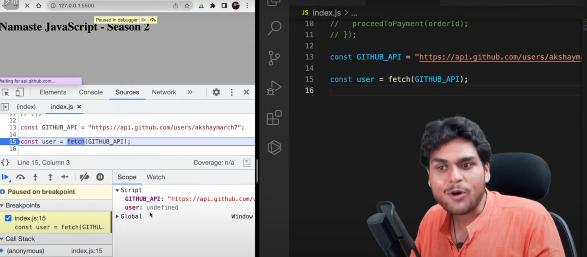
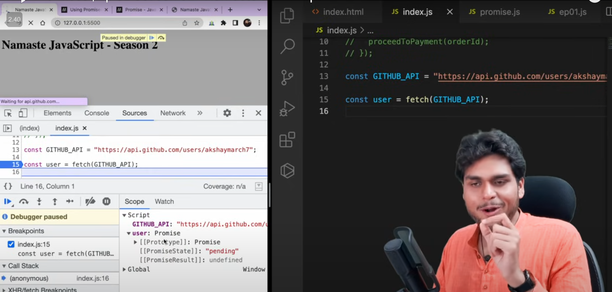

Initially `user` will be undefined but after line 15 `user` will have `promise` object.
It has two value
1. PromiseState (pending, fulfilled, rejected)
2. PromiseResult

Solving Callback Hell
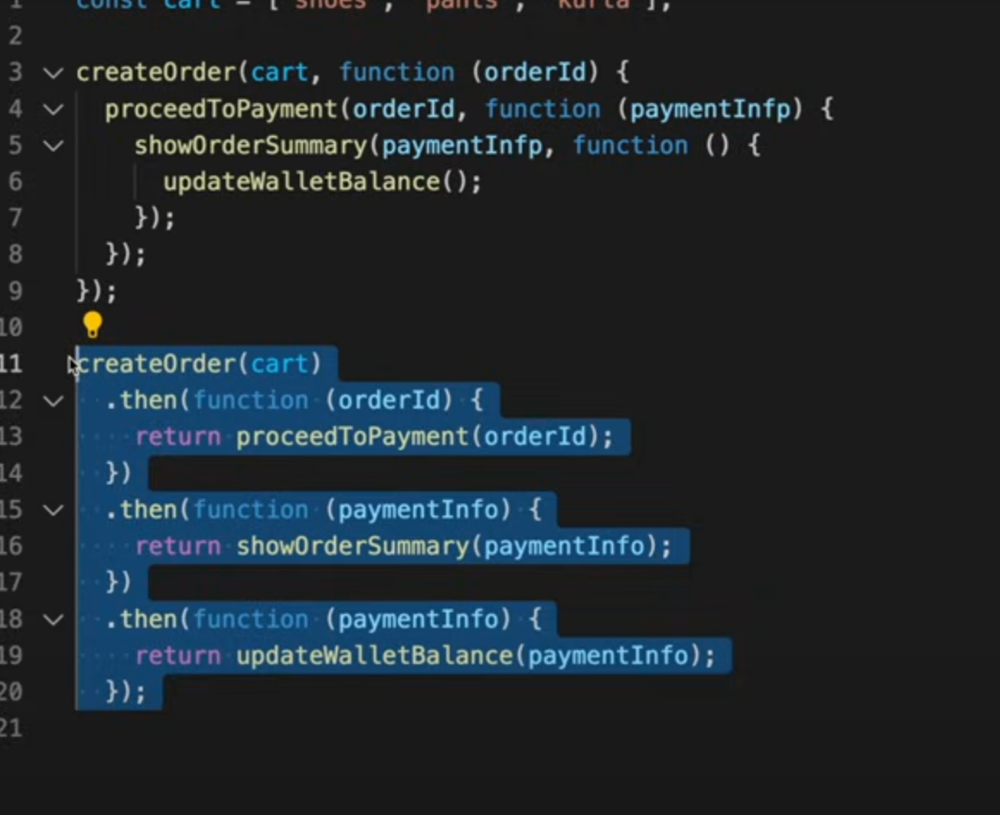


Referred Video: https://youtu.be/ap-6PPAuK1Y?si=XgXdtziWUV-JRDId

**Creating a Promise**
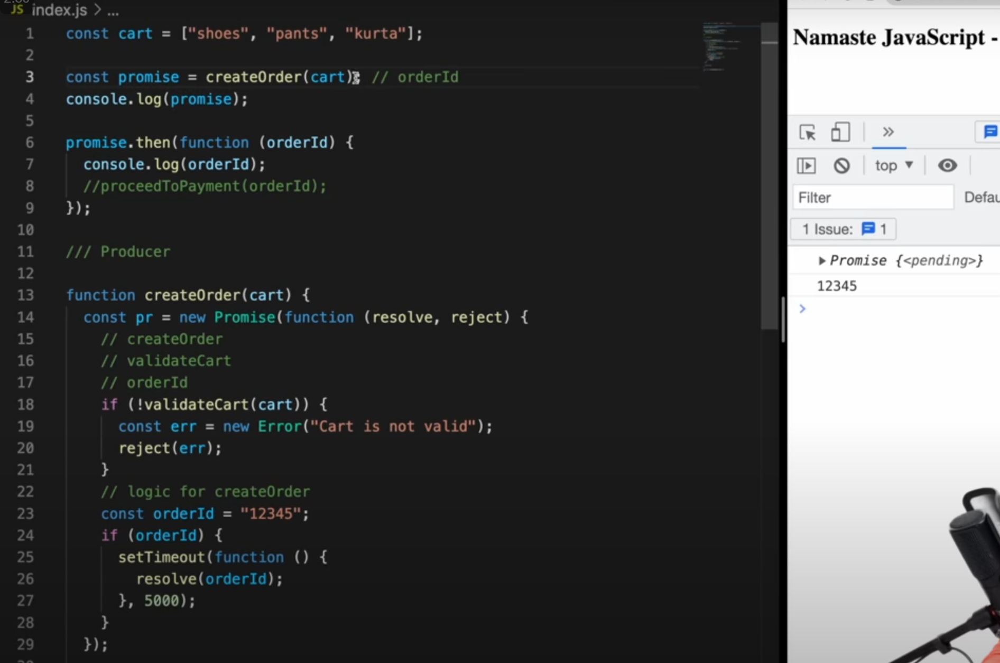

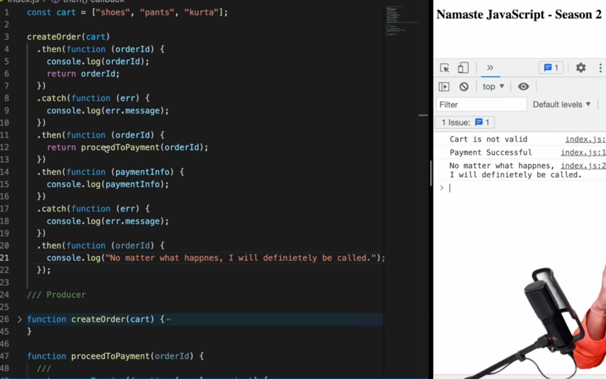

### What is Callback Hell?

**Callback hell** refers to the situation where multiple asynchronous functions are nested within each other, leading to code that is difficult to read, maintain, and debug. This usually happens when callbacks are used in a sequential manner, and each subsequent operation depends on the result of the previous one.

#### Example of Callback Hell

```javascript
function getUser(userId, callback) {
    setTimeout(() => {
        console.log("Fetched user");
        callback({ userId, name: "John" });
    }, 1000);
}

function getPosts(userId, callback) {
    setTimeout(() => {
        console.log("Fetched posts");
        callback([{ postId: 1, content: "Post 1" }, { postId: 2, content: "Post 2" }]);
    }, 1000);
}

function getComments(postId, callback) {
    setTimeout(() => {
        console.log("Fetched comments");
        callback([{ commentId: 1, content: "Nice post!" }, { commentId: 2, content: "Thanks!" }]);
    }, 1000);
}

// Callback hell with nested functions
getUser(1, (user) => {
    getPosts(user.userId, (posts) => {
        getComments(posts[0].postId, (comments) => {
            console.log(comments);
        });
    });
});
```

In the above example, the code becomes increasingly nested as we fetch user data, posts, and comments in sequence, which makes it harder to follow and maintain.

### How Promises Solve Callback Hell

Promises are used to handle asynchronous operations in a more readable and maintainable way by chaining them, rather than nesting. Promises help flatten the structure of asynchronous calls, allowing better readability.

#### Example Using Promises

```javascript
function getUser(userId) {
    return new Promise((resolve, reject) => {
        setTimeout(() => {
            console.log("Fetched user");
            resolve({ userId, name: "John" });
        }, 1000);
    });
}

function getPosts(userId) {
    return new Promise((resolve, reject) => {
        setTimeout(() => {
            console.log("Fetched posts");
            resolve([{ postId: 1, content: "Post 1" }, { postId: 2, content: "Post 2" }]);
        }, 1000);
    });
}

function getComments(postId) {
    return new Promise((resolve, reject) => {
        setTimeout(() => {
            console.log("Fetched comments");
            resolve([{ commentId: 1, content: "Nice post!" }, { commentId: 2, content: "Thanks!" }]);
        }, 1000);
    });
}

// Promise chaining to avoid callback hell
getUser(1)
    .then(user => getPosts(user.userId))
    .then(posts => getComments(posts[0].postId))
    .then(comments => console.log(comments))
    .catch(error => console.error(error));
```

### Key Differences:
- **Readability**: Promises allow us to chain operations in a flat structure, making the code easier to read.
- **Error Handling**: Promises provide a built-in way to handle errors using `.catch()`, whereas error handling in callbacks can become cumbersome.


</details>

<details >
 <summary style="font-size: medium; font-weight: bold">Maximilian Schwarzmüller</summary>

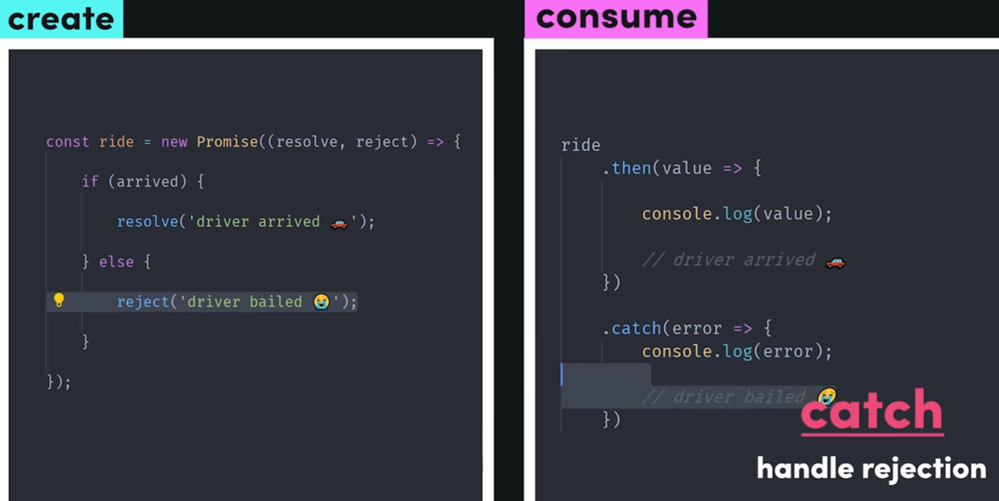
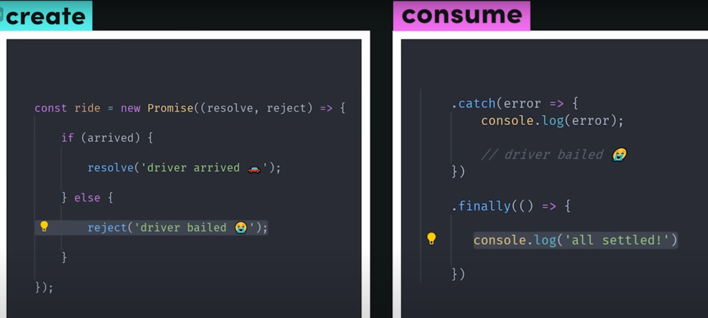

Go through these below video for more details:
https://www.udemy.com/course/javascript-the-complete-guide-2020-beginner-advanced/learn/lecture/16329906#overview

</details>

**MUST do `Promise.all` polyfill question:**
[1-important-concept -> 04-js-concept -> polyfills -> promise.all](../polyfills/readme.md)


Nice article by Builder.io:
https://www.builder.io/blog/promises

<details >
 <summary style="font-size: medium; font-weight: bold">Promise API's</summary>

<details >
 <summary style="font-size: small; font-weight: bold">Promise.all()</summary>

1. All success cases


2. Some failure cases


As soon we get error from any one promise error is thrown and no other 
promise will be executed.

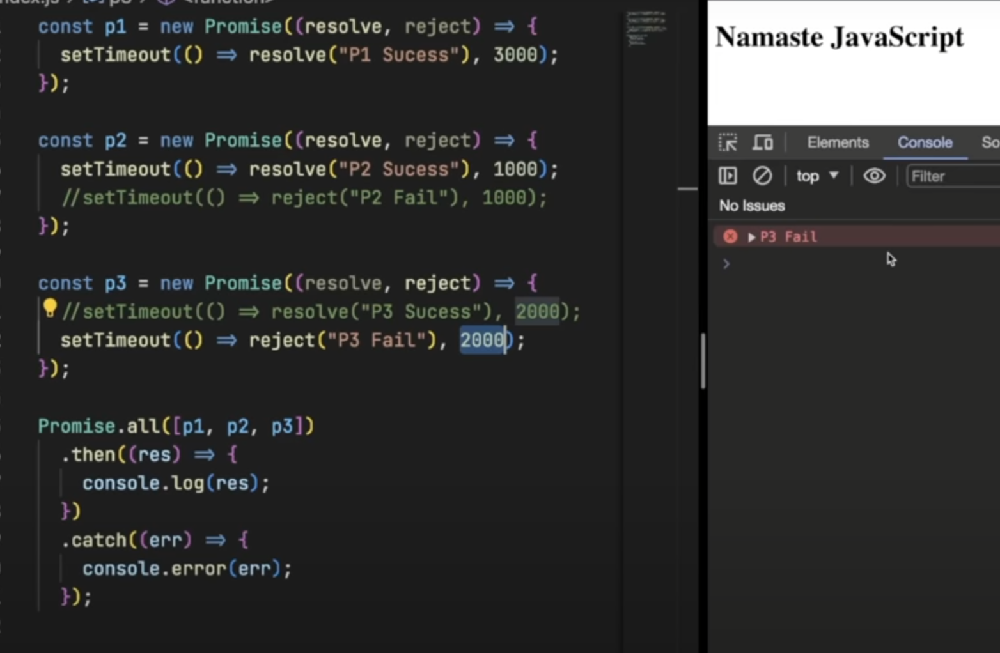

</details>

<details >
 <summary style="font-size: small; font-weight: bold">Promise.allSettled()</summary>

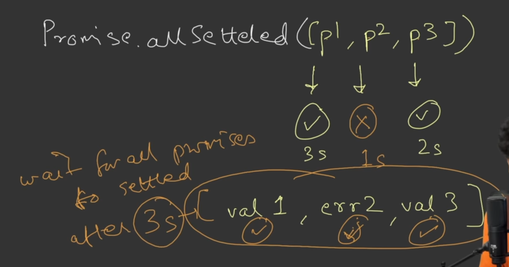


</details>

<details >
 <summary style="font-size: small; font-weight: bold">Promise.race()</summary>

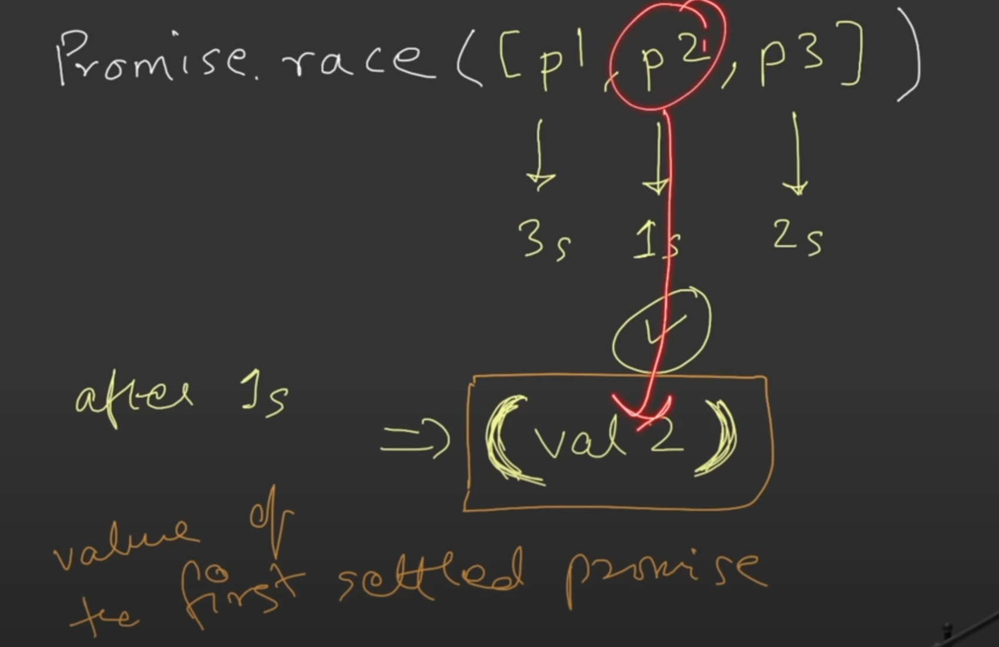

Value of **first settled promise** will be returned irresptive of error or failure

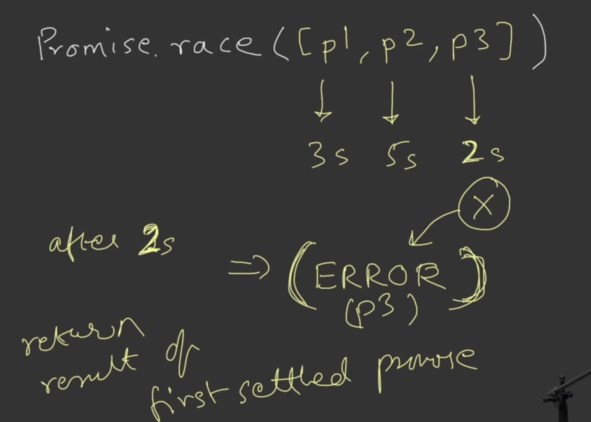


</details>

<details >
 <summary style="font-size: small; font-weight: bold">Promise.any()</summary>

Value of **first success settled promise** will be returned

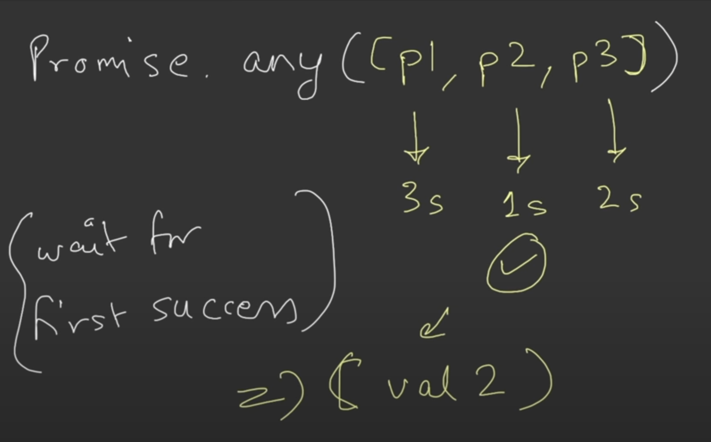


If all error case then **aggregateError** is thrown


</details>

Referred Video: https://youtu.be/DlTVt1rZjIo?si=UlMdAtzKcaydIACp
</details>

</details>


<details >
 <summary style="font-size: x-large; font-weight: bold">Async / Await</summary>

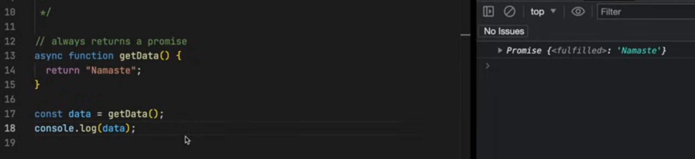

### Async functions Always return a promise


If we returning Promise in async function then it will same like above and it 
return Promise of promise

**For async/await go through the Maximilian Schwarzmüller video**
</details>
