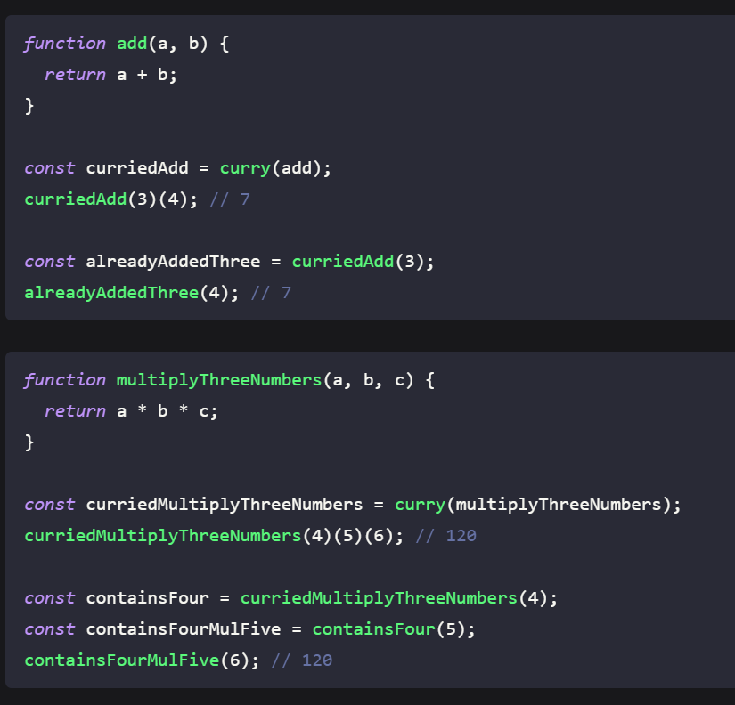
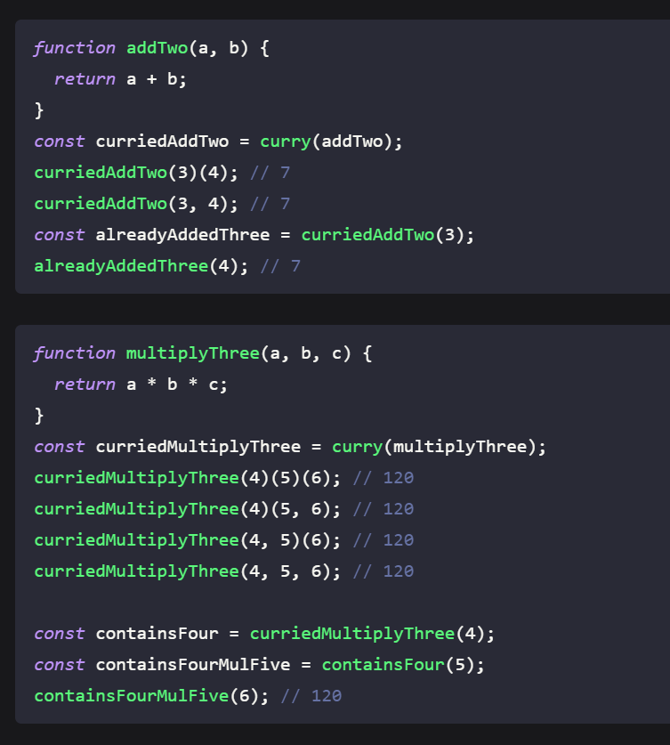
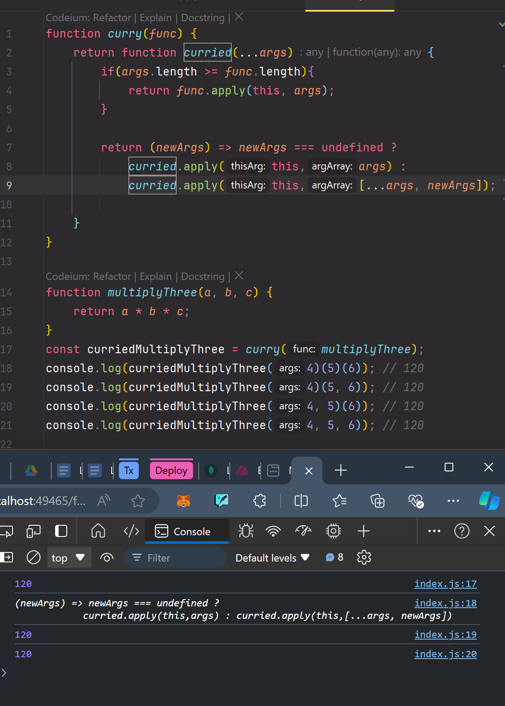
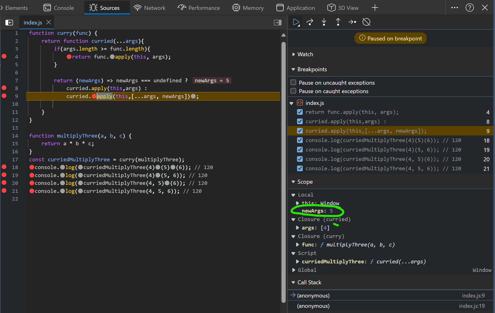
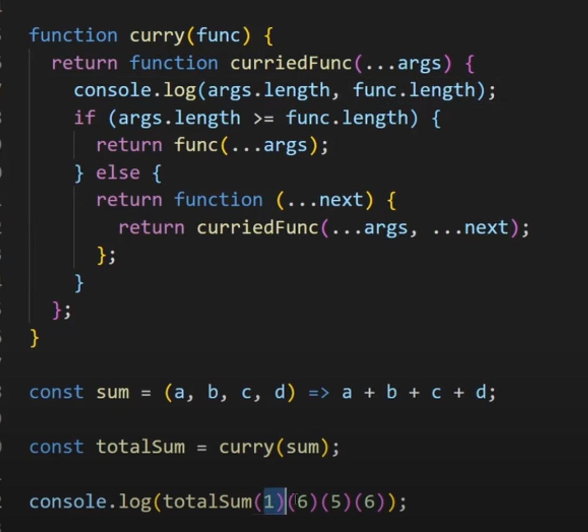
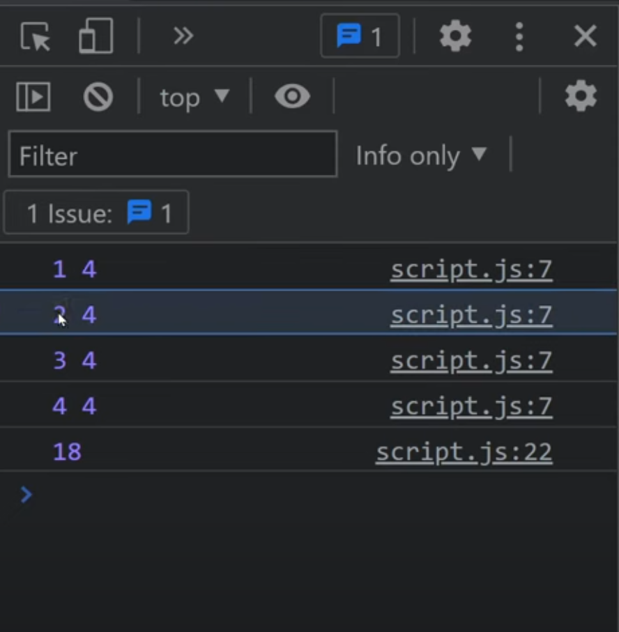

## Curry


<details >
 <summary style="font-size: medium; font-weight: bold">Basic</summary>

Convert f(a, b) into f(a)(b).

```javascript
/*f(a,b) implementation */
function f(a,b) {
    return "Works"
}
```

```javascript
/*f(a)(b) implementation */
function f(a) {
    return (b) => {
         "Works"
    }
}
console.log(f(1)(2)) // works
console.log(f(1)); /* (b) => {return "Works" } */

```

Why should currying be used?
1. It makes a function pure which makes it expose to less errors and side effects.
2.  It helps in avoiding the same variable again and again.
3.  It is a checking method that checks if you have all the things before you proceed.
4. It divides one function into multiple functions so that one handles one set of responsibility.


```javascript
/*Simple function*/ 
const add = (a, b, c)=>{
    return a+ b + c
}
console.log(add(1,2 ,3)); // 6

/* Curried Function */
const addCurry = (a) => { // takes one argument
    return (b)=>{                 //takes second argument
        return (c)=>{             //takes third argument
            return a+b+c
        }
    }
}
console.log(addCurry(1)(2)(3)); //6
```

Evaluate(”sum”)(2)(4) ⇒ 2+4 = 6 on basis of input given to first param.


```javascript
function sum(operation) {
    return (a) => {
        return (b) => {
        if(operation === "sum")
                  return a + b;
                    else if(operation === "multiply")
                    return a * b;
                    else if(operation === "divide")
                    return a / b;
                    else if(operation === "subtract")
                    return a - b;
                    else return "No / Invalid Operation Selected"
        }
    }
}
```


Q. Program to implement sum(2)(3)(4)() should return 9 ?


```javascript
function sum(a) {
  if (a === undefined) return 0; // If called without arguments, return 0
  return function (b) {
    if (b === undefined) return a; // If called with no further arguments, return accumulated sum
    return sum(a + b); // Keep accumulating
  };
}

console.log(sum(2)(3)(4)()); // Output: 9
```

### Explanation:
1. The function `sum` returns another function that keeps accumulating the sum.
2. When an empty call `()` is made, it stops the execution and returns the final sum.

Let me know if you need any modifications! 🚀

---
</details>


<details >
 <summary style="font-size: medium; font-weight: bold">Curry-1 & 2</summary>

**Question: Curry-1**


**Question: Curry-2**


**Solution**

We first need to understand a few terms:

- **Arity:** The number of arguments or operands taken by a function.
- **Closure**: A closure is the combination of a function bundled together with references to its lexical environment (surrounding state).
The curried function will stop accepting arguments after the number of arguments that have been passed into the curried function equals the arity of the original function.

We can keep a record of the curried function arguments so far via closures. Each time the curried function is called, we compare the number of arguments so far with the arity of the original function.

If they're the same, we call the original function with the arguments.
If more arguments are needed, we will return a function that accepts more arguments and invokes the curried function with the new arguments.
Note that the inner function needs to be defined using arrow functions to preserve the same lexical this or manually tracked using a separate variable like in [Debounce](../debounce-throttle/readme.md).

<details >
 <summary style="font-size: small; font-weight: bold">Using `apply()`</summary>

**For Curry-1**
```js
export default function curry(func) {
  return function curried(...args) {
    if (args.length >= func.length) {
      return func.apply(this, args);
    }

    return (newArgs) =>
      newArgs === undefined
        ? curried.apply(this, args)
        : curried.apply(this, [...args, newArgs]);
  };
}
```

**For Curry-2**


Curry-1 solution won't work for curry-2 because in above you can see
for 2nd case we are getting only `5` in `newArgs`, therefore, we never hit
`if` condition and function is returned. This is happening because 
in `newArgs` we're expecting only one argument, but it can be multiple
hence using spread operator properly like below will yield a right
result.
[Refer spread operator notes to understand better](../../03-js-basics/readme.md)
```js
export default function curry(func) {
  return function curried(...args) {
    if (args.length === func.length) {
      return func.apply(this, args);
    }

    return (...args2) => curried.apply(this, [...args, ...args2]);
  };
}
```

My preferred solution
```js
export default function curry(func) {
  return function curried(...args){
    if(args.length >= func.length){
      return func.apply(this, [...args]);
    }

    return (...newArgs) => newArgs === undefined ? 
    curried.apply(this, [...args]) : 
    curried.apply(this,[...args,...newArgs]);
  }
}
```

---
</details>


<details >
 <summary style="font-size: small; font-weight: bold">Using `call()`</summary>


```js
/**
 * @param {Function} func
 * @return {Function}
 */
export default function curry(func) {
  return function curried(...args) {
    if (args.length >= func.length) {
      return func.call(this, ...args);
    }

    return (newArgs) =>
      newArgs === undefined
        ? curried.call(this, ...args)
        : curried.call(this, ...args, newArgs);
  };
}

```

**For Curry-2**
```js
export default function curry(func) {
  return function curried(...args){
    if(args.length >= func.length){
      return func.call(this, ...args);
    }

    return (...newArgs) => newArgs === undefined ? 
    curried.call(this, ...args) : 
    curried.call(this,...args,...newArgs);
  }
}
```


---
</details>


<details >
 <summary style="font-size: small; font-weight: bold">Using `bind()`</summary>


**Works for both curry-1 and curry-2**
```js
/**
 * @param {Function} func
 * @return {Function}
 */
export default function curry(func) {
  return function curried(...args) {
    if (args.length >= func.length) {
      return func.apply(this, args);
    }

    return curried.bind(this, ...args);
  };
}
```
Since the innermost function is essentially meant for preserving the this scope 
and passing arguments along, it can be achieved with `Function.prototype.bind`. 
This solution is also more flexible because it accepts multiple arguments


---
</details>


---
</details>


<details >
 <summary style="font-size: medium; font-weight: bold">Questions</summary>

Write a function curry() that converts f(a,b,c) into a curried function f(a)(b)(c) .
```javascript
/**
 * @param {Function} func
 * @return {Function}
 */
export default function curry(func) {
  return function curried(...args) {
    if (args.length >= func.length) {
      return func.apply(this, args);
    }

    return curried.bind(this, ...args);
  };
}
```


<br>
Referred Article: https://roadsidecoder.hashnode.dev/javascript-interview-questions-currying-output-based-questions-partial-application-and-more
<br>
Referred Video: https://www.youtube.com/watch?v=k5TC9i5HonI


---
</details>
