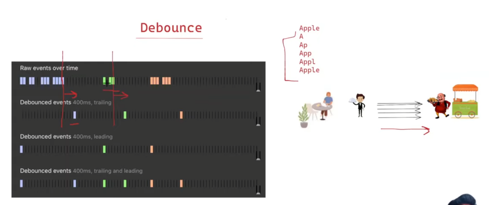
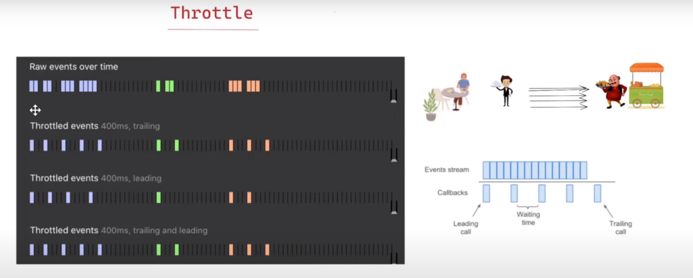
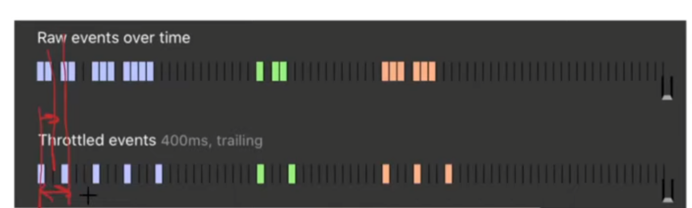

## Debounce & Throttle explained like a 5 year Old

Imagine you are holding a magic button that makes a bell ring.

To summarize:

- **Debounce** waits for you to stop pressing (leading rings first, trailing rings last).
- **Throttle** rings at regular intervals (leading rings immediately, trailing rings at the end of the wait).


#### 1. **Trailing Debounce**

Imagine your bell is very picky and only wants to ring after it is sure you have stopped pressing the button:

- When you press the button, the bell doesn’t ring immediately. It waits for a short time to see if you will press the button again.
- If you keep pressing the button, the bell keeps waiting. It will only ring after you’ve completely stopped pressing the button for a little while.
- After you stop pressing and the waiting time is over, the bell rings just once. Ding!

**Trailing debounce** is like waiting until you're completely done pressing the button, and then the bell rings once at the end.

#### 2. **Leading Debounce**

Now, imagine the bell wants to ring as soon as it senses the first press, but then it becomes shy:

- When you press the button for the first time, the bell rings immediately. Ding!
- After the first ring, if you keep pressing the button, the bell won’t ring again until you stop pressing for a while.
- Once you stop pressing and wait a bit, the bell is ready to ring immediately again on the next button press.

**Leading debounce** is like ringing the bell on the first press and then waiting until you stop pressing for a while before it can ring immediately again.

#### 3. **Trailing Throttle**

For **trailing throttle**, the bell wants to make sure it rings at a steady pace, no matter how often you press the button:

- When you press the button, the bell waits for a set amount of time. If you press the button again during this time, the bell remembers only the last press.
- After the wait is over, the bell rings once. Ding!
- If you keep pressing the button, the bell will wait for the same amount of time again before it rings with the most recent press.

**Trailing throttle** is like ringing the bell at the end of a waiting period, but it only remembers the last press during that time.

#### 4. **Leading Throttle**

With **leading throttle**, the bell is eager to ring right away but needs time to rest between rings:

- When you press the button, the bell rings immediately. Ding!
- Then, the bell takes a rest. If you press the button again while it is resting, it won’t ring.
- After the bell is rested, if you press the button again, it rings immediately and repeats the process.

**Leading throttle** is like ringing the bell right away on the first press and then waiting until it has rested before it can ring right away again.


# Debounce



**1. Trailing Debounce:** Here the waiter goes to moto bhai only when the customer pauses for a certain time 
from last order, and it places the order to Moto bhai whatever he has written finally in his diary

**Here we check for last event and then act on it after XYZ time is elapsed**

**2. Leading Debounce:** Here the waiter goes immediately to moto bhai and places the order for the 
things he has written in his diary if there was nothing said before that for a certain time

**Here we check for FIRST EVENT and then act on it if there were no other events within XYZ time before that**


Below is code for trialing debounce
```javascript
function debounce(cb, delay = 1000) {
    let timeout

    return (...args) => {
        clearTimeout(timeout)
        timeout = setTimeout(() => {
            cb(...args)
        }, delay)
    }
}
```

Weird Caveat in order to take care of edge case

- With Arrow Function
```javascript
/**
 * @callback func
 * @param {number} wait
 * @return {Function}
 */
export default function debounce(func, wait = 0) {
  let timeoutID = null;
  return function (...args) {
    clearTimeout(timeoutID);

    timeoutID = setTimeout(() => {
      timeoutID = null; // Not strictly necessary but good to include.
      // Has the same `this` as the outer function's
      // as it's within an arrow function.
      func.apply(this, args);
    }, wait);
  };
}
```

- With Normal Function, we use extra variable `context` to keep reference of `this`
```js
/**
 * @param {Function} func
 * @param {number} wait
 * @return {Function}
 */
export default function debounce(func, wait = 0) {
  let timeoutID = null;
  return function (...args) {
    // Keep a reference to `this` so that
    // func.apply() can access it.
    const context = this;
    clearTimeout(timeoutID);

    timeoutID = setTimeout(function () {
      timeoutID = null; // Not strictly necessary but good to do this.
      func.apply(context, args);
    }, wait);
  };
}

```
To understand above code, please go through the 
1. `call()`, `apply()` & `bind()` in important concept
2. `this` in [important concept](../11-this-call-apply-bind/chirag-this-call-apply-bind/readme.md)
3. Lastly go through this for more details: https://www.greatfrontend.com/questions/javascript/debounce?list=one-week

### Use case
1. Autocomplete


For Leading and Trailing Debounce
```js
/**
 * @callback func
 * @param {number} wait
 * @param {Object} options
 * @param {boolean} options.leading - Whether to invoke at the beginning.
 * @param {boolean} options.trailing - Whether to invoke at the end.
 * @return {Function}
 */
function debounce(func, wait = 0, options = { leading: false, trailing: true }) {
    let timeoutID = null;
    let lastArgs = null; // Store the last arguments
    let lastContext = null; // Store the last context
    let isInvoked = false; // Track if the leading function has been invoked

    const invokeFunc = () => {
        func.apply(lastContext, lastArgs);
        lastArgs = null; // Clear after invocation
        lastContext = null; // Clear after invocation
    };

    const debounced = function (...args) {
        lastArgs = args;
        lastContext = this;

        if (timeoutID) {
            clearTimeout(timeoutID);
        }

        if (options.leading && !isInvoked) {
            // Leading call
            invokeFunc();
            isInvoked = true;
        }

        timeoutID = setTimeout(() => {
            if (options.trailing && lastArgs) {
                invokeFunc();
            }
            timeoutID = null; // Clear timeout
            isInvoked = false; // Reset for future calls
        }, wait);
    };

    return debounced;
}
```

# Throttle


**Trailing Throttle:** In pistol shooting game we can use it to limit the number of bullets fired.
So we don't allow a bullet to be fired until the difference between last fired bullet is greater than 400ms




1. Below is code for trialing throttle
```javascript
function throttle(cb, delay = 1000) {
    let shouldWait = false
    let waitingArgs
    const timeoutFunc = () => {
        if (waitingArgs == null) {
            shouldWait = false
        } else {
            cb(...waitingArgs)
            waitingArgs = null
            setTimeout(timeoutFunc, delay)
        }
    }

    return (...args) => {
        if (shouldWait) {
            waitingArgs = args
            return
        }

        cb(...args)
        shouldWait = true

        setTimeout(timeoutFunc, delay)
    }
}
```

2. For Leading & Trailing Both
```js
/**
 * @param {(...args: any[]) => any} func
 * @param {number} wait
 * @param {boolean} option.leading
 * @param {boolean} option.trailing
 * @returns {(...args: any[]) => any}
 */
function throttle(cb, delay = 1000, options = { leading: true, trailing: true }) {
    let shouldWait = false;
    let waitingArgs = null;
    let timeoutId = null;

    const timeoutFunc = () => {
        if (options.trailing && waitingArgs !== null) {
            cb(...waitingArgs);  // Invoke callback with the most recent arguments
            waitingArgs = null;
            timeoutId = setTimeout(timeoutFunc, delay);
        } else {
            shouldWait = false;  // Reset wait flag if no trailing call needed
            timeoutId = null;
        }
    };

    return (...args) => {
        if (!shouldWait && options.leading) {
            cb(...args);  // Invoke immediately if leading is true
            shouldWait = true;
            timeoutId = setTimeout(timeoutFunc, delay);
        } else {
            waitingArgs = args;  // Store the latest arguments for a trailing call
        }

        if (!shouldWait && !options.leading) {
            shouldWait = true;
            timeoutId = setTimeout(timeoutFunc, delay);
        }
    };
}
```


### Use case
1. Mouse tracking
2. Window resizing


## Referred Videos
1. https://www.youtube.com/watch?v=cjIswDCKgu0
2. https://youtu.be/IKRbWT6LqIY?si=IoOgDRnxJB8yi6pW&t=2201
