## Polyfills

<details >
 <summary style="font-size: medium; font-weight: bold">What are JavaScript polyfills for?</summary>

https://www.greatfrontend.com/questions/quiz/what-are-javascript-polyfills-for?practice=practice&tab=quiz

## TL;DR

Polyfills in JavaScript are pieces of code that provide modern functionality to older browsers that lack native support for those features. They bridge the gap between the JavaScript language features and APIs available in modern browsers and the limited capabilities of older browser versions.

They can be implemented manually or included through libraries and are often used in conjunction with feature detection.

Common use cases include:

- **New JavaScript Methods**: For example, `Array.prototype.includes()`, `Object.assign()`, etc.
- **New APIs**: Such as `fetch()`, `Promise`, `IntersectionObserver`, etc. Modern browsers support these now but for a long time they have to be polyfilled.

Libraries and services for polyfills:

- **`core-js`**: A modular standard library for JavaScript which includes polyfills for a wide range of ECMAScript features.

  ```js
  import 'core-js/actual/array/flat-map'; // With this, Array.prototype.flatMap is available to be used.

  [1, 2].flatMap((it) => [it, it]); // => [1, 1, 2, 2]
  ```

- **Polyfill.io**: A service that provides polyfills based on the features and user agents specified in the request.

  ```js
  <script src="https://polyfill.io/v3/polyfill.min.js"></script>
  ```

---

## Polyfills in JavaScript

Polyfills in JavaScript are pieces of code (usually JavaScript) that provide modern functionality on older browsers that do not natively support it. They enable developers to use newer features of the language and APIs while maintaining compatibility with older environments.

## How polyfills work

Polyfills detect if a feature or API is missing in a browser and provide a custom implementation of that feature using existing JavaScript capabilities. This allows developers to write code using the latest JavaScript features and APIs without worrying about browser compatibility issues.

For example, let's consider the `Array.prototype.includes()` method, which determines if an array includes a specific element. This method is not supported in older browsers like Internet Explorer 11. To address this, we can use a polyfill:

```js
// Polyfill for Array.prototype.includes()
if (!Array.prototype.includes) {
  Array.prototype.includes = function (searchElement) {
    for (var i = 0; i < this.length; i++) {
      if (this[i] === searchElement) {
        return true;
      }
    }

    return false;
  };
}
```

By including this polyfill, we can safely use `Array.prototype.includes()` even in browsers that don't support it natively.

## Implementing polyfills

1. **Identify the missing feature**: Determine if the feature is compatible with the target browsers or detect its presence using feature detection methods like `typeof`, `in`, or `window`.
1. **Write the fallback implementation**: Develop the fallback implementation that provides similar functionality, either using a pre-existing polyfill library or pure JavaScript code.
1. **Test the polyfill**: Thoroughly test the polyfill to ensure it functions as intended across different contexts and browsers.
1. **Implement the polyfill**: Enclose the code that uses the missing feature in an if statement that checks for feature support. If not supported, run the polyfill code instead.

### Considerations

- **Selective loading**: Polyfills should only be loaded for browsers that need them to optimize performance.
- **Feature detection**: Perform feature detection before applying a polyfill to avoid overwriting native implementations or applying unnecessary polyfills.
- **Size and performance**: Polyfills can increase the JavaScript bundle size, so minification and compression techniques should be used to mitigate this impact.
- **Existing libraries**: Consider using existing libraries and tools that offer comprehensive polyfill solutions for multiple features, handling feature detection, conditional loading, and fallbacks efficiently

### Libraries and services for polyfills

- **`core-js`**: A modular standard library for JavaScript which includes polyfills for a wide range of ECMAScript features.

  ```js
  import 'core-js/actual/array/flat-map'; // With this, Array.prototype.flatMap is available to be used.

  [1, 2].flatMap((it) => [it, it]); // => [1, 1, 2, 2]
  ```

- **Polyfill.io**: A service that provides polyfills based on the features and user agents specified in the request.

  ```js
  <script src="https://polyfill.io/v3/polyfill.min.js"></script>
  ```

## Further reading

- [Polyfill - MDN](https://developer.mozilla.org/en-US/docs/Glossary/Polyfill)
- [Polyfills and transpilers](https://javascript.info/polyfills)
- [Polyfills: How do they work?](https://medium.com/alienbrains/polyfills-how-do-they-work-ea6a12b792b)
- [Polyfill in Javascript](https://www.linkedin.com/pulse/polyfill-javascript-divyansh-singh)
- [Shubham Dutta](https://dev.to/shubhamdutta2000/polyfills-for-javascript-a-full-overview-3f7m)

---
</details>

<details >
 <summary style="font-size: large; font-weight: bold">filter()</summary>

https://www.greatfrontend.com/questions/javascript/array-filter?list=one-week

Basic Solution:
```js
Array.prototype.myFilter = function(cb) {
    let temp = [];
    for(let i = 0; i < this.length; i++){
        if(cb(this[i], i, this)){
            temp.push(this[i]);
        }
    }
    
    return temp;
}
```

Solution Covering Edge Cases:
```js
Array.prototype.myFilter = function (callbackFn, thisArg) {
  let res = [];

  for(let i = 0; i < this.length; i++){
    if(
       // Ignore index if value is not defined for index (e.g. in sparse arrays [1, 2, , 4]).
      Object.hasOwn(this, i) && 
        // Some callback functions may require  element, index, array, and this. 
      callbackFn.call(thisArg, this[i], i, this)
      ){
        res.push(this[i]);
      }
  }

  return res;
};
```
Edge Case:
1. Passing the `index` and `array` to the filter callback.
   TestCase:
```js
const isSquareEven = (_: any, index: number, array: Array<any>) =>
  (array[index] * array[index]) % 2 === 0;

test('reducer uses array argument when provided', () => {
    expect([1, 2, 3, 4].myFilter(isSquareEven)).toStrictEqual([2, 4]);
});
```

2. Invoking the filter callback with the correct `this` if `thisArg` is specified.
3. Sparse arrays, e.g. `[1, 2, , 4]`. The empty values should be ignored while traversing the array.

---
</details>


<details >
 <summary style="font-size: large; font-weight: bold">map()</summary>

https://www.greatfrontend.com/questions/javascript/array-map

**Basic Solution:**
```js
// arr.map((num, i, arr) => {})
Array.prototype.myMap = function(cb) {
    let temp = [];
    
    for(let i = 0; i < this.length; i++){
        temp.push(cb(this[i], i, this));
    }
    
    return temp;
}
```

Inside the loop, we call the callback function with three arguments:
- `this[i]`: The current element of the array.
- `i`: The index of the current element.
- `this`: The original array (useful for methods that need context).

Usage
```js
const nums = [1,2,3,4];

const multiplyThree = nums.myMap((num, i, arr) => {
    return num * 3;
})

console.log(multiplyThree);
```

In TypeScript

```ts
Array.prototype.map<T, U>(callback: (value: T, index: number, array: T[]) => U): U[] {
    const newArray: U[] = [];
    for (let i = 0; i < this.length; i++) {
      newArray.push(callback(this[i], i, this));
    }
    return newArray;
  }
```


**Solution Covering Edge Cases:**
```js
Array.prototype.myMap = function (callbackFn, thisArg) {
    let res = [];

    for(let i = 0; i < this.length; i++){
        if(Object.hasOwn(this, i))
            res[i] = callbackFn.call(thisArg, this[i], i, this);
    }

    return res;
};
```

Edges Cases:
- Passing the `index` and `array` to the map callback.
- Calling the map callback with the correct this if `thisArg` is specified.
- Sparse arrays (e.g. `[1, 2, , 4]`). The empty values should be ignored while traversing the array.

---
</details>


<details >
 <summary style="font-size: large; font-weight: bold">reduce()</summary>

https://www.greatfrontend.com/questions/javascript/array-reduce

Basic Solution:
```js
// arr.reduce((accumulator, curr, i, arr) => {}, initialValue)
Array.prototype.myReduce = function(cb, initialValue){
    var accumulator = initialValue;
    
    for(let i = 0; i < this.length; i++){
        //checking accumulator first is important because
        //if we don't have initialValue, accumulator will be undefined
        accumulator = accumulator ? cb(accumulator, this[i], i, this) : this[i];
    }
    
    return accumulator;
}
```

Covering Edge Cases:
```js
Array.prototype.myReduce = function (callbackFn, initialValue) {
  let acc = initialValue;
  let i = 0;

  if((initialValue === undefined || initialValue === null)){
    if(this.length > 0){
      acc = this[0];
      i++;
    }
    else
      throw new Error("Invalid call")
  }
    

  for(; i < this.length; i++){
    //for handling sparse array value
    if(Object.hasOwn(this, i))
      acc = callbackFn(acc,this[i], i, this);
  }

  return acc;
};
```

**Edge Cases:**
- Empty array, with and without the `initialValue` argument.
- Single-value array, with and without the `initialValue` argument.
- Passing the `index` and `array` to the reducer callback.
- Sparse arrays, e.g. `[1, 2, , 4]`. The empty values should be ignored while traversing the array.

```js
const getMax = (a, b) => Math.max(a, b);

// callback is invoked for each element in the array starting at index 0
[1, 100].reduce(getMax, 50); // 100
[50].reduce(getMax, 10); // 50

// callback is invoked once for element at index 1
[1, 100].reduce(getMax); // 100

// callback is not invoked
[50].reduce(getMax); // 50
[].reduce(getMax, 1); // 1

[].reduce(getMax); // TypeError
```
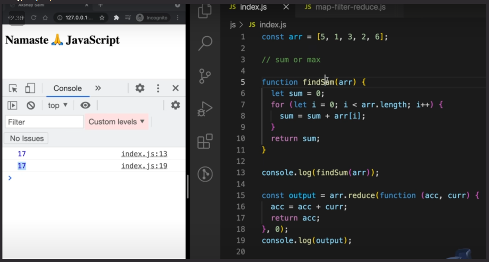
    

---
</details>

<details >
 <summary style="font-size: large; font-weight: bold">call()</summary>

https://www.greatfrontend.com/questions/javascript/function-call
```js
Function.prototype.myCall = function (context = {}, ...args) {
    if(typeof this !== 'function' || !this)
        throw new Error('Invalid call');

    /** If nothing is provided for context then
     * above empty param will fill the context
     * variable with {}.
     * But if explicitly null or undefined is given
     * then below code will fill {}
     */
    if(!context)
        context = {};

    context.fn = this;
    return context.fn(...args);
};
```


In the given code, `this` refers to the function on which `myCall` is being invoked. This is because `myCall` is added to the `Function.prototype`, meaning it becomes a method that can be called on any function.

### Example Usage:

Suppose you have a function `greet`:

```javascript
function greet(message) {
    console.log(`${message}, ${this.name}`);
}
```

You can use `myCall` to call `greet` with a specific context:

```javascript
const person = { name: 'Alice' };

greet.myCall(person, 'Hello');  // Output: "Hello, Alice"
```

In this example:
- `this` inside `myCall` refers to the `greet` function.
- `context` is the `person` object `{ name: 'Alice' }`.
- `context.fn = this` assigns the `greet` function to `context.fn`.
- `context.fn(...args)` calls the `greet` function with `person` as the context and `'Hello'` as the argument.
We can use same logic like GF function called by BF, hence `this` will point to BF object

**Note:** _With `call()` function, we are trying to make sure our provided function
is called in the **context of a provided object**. Therefore, we defined our 
provided function inside a given context object then try to execute it._

**Other Solutions:**
1. 
```js
Function.prototype.myCall = function (context ={}, ...arg) {
return this.bind(context)(...arg);
};
```
```js
Function.prototype.myCall = function (context ={}, ...arg) {
return this.bind(context, ...arg)();
};
```
```js
Function.prototype.myCall = function (context ={}, ...arg) {
return this.apply(context, [...arg]);
};
```

---
</details>

<details >
 <summary style="font-size: large; font-weight: bold">apply()</summary>

https://www.greatfrontend.com/questions/javascript/function-apply
```js
Function.prototype.myApply = function (context = {}, args = []) {
    if(typeof this !== 'function')
        throw new Error('Invalid Call');

    if(!Array.isArray(args))
        throw new Error("args must be array");

    if(!context)
        context = {};

    context.fn = this;
    return context.fn(...args);
};
```

Here last return line is very important if you don't spread arguments
then you get below error
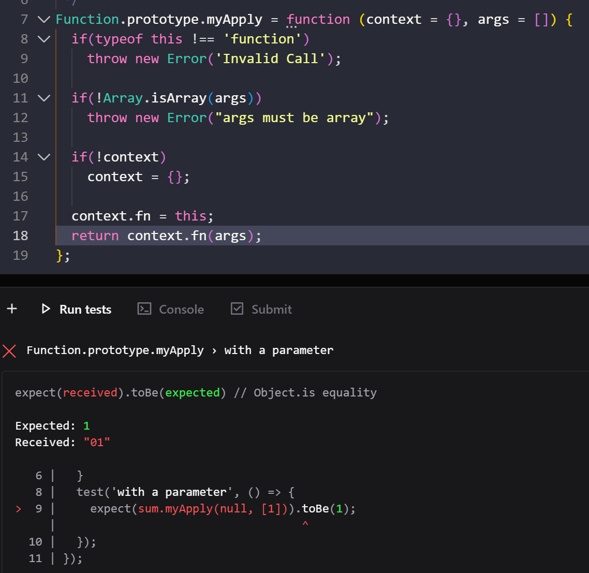
Testcase Used:
```js
import './function-apply';

describe('Function.prototype.myApply', () => {
  function sum(...args: Array<number>) {
    return args.reduce((acc, num) => acc + num, 0);
  }

  test('with a parameter', () => {
    expect(sum.myApply(null, [1])).toBe(1);
  });
});
```

**Reason:** When you use `context.fn(args)`, you're passing the `args` array as a single argument, rather than spreading it out as individual arguments

**Other Solution:**
1. 
```js
Function.prototype.myApply = function (context = {}, argArray = []) {
  return this.bind(context)(...argArray);
};
```
2. Or you can also pass the argArray into bind() before executing it.
```js
Function.prototype.myApply = function (context = {}, argArray = []) {
  return this.bind(context, ...argArray)();
};
```
3.
```js
Function.prototype.myApply = function (context = {}, argArray = []) {
  return this.call(context, ...argArray);
};
```

---
</details>

<details >
 <summary style="font-size: large; font-weight: bold">bind()</summary>

https://www.greatfrontend.com/questions/javascript/function-bind
More Accurate Solution:
```js
Function.prototype.myBind = function (context = {}, ...initialArgs) {
  if(typeof this !== 'function')
    throw new Error("Invalid Call");

  if(!context)
    context = {};

  context.fn = this;

  return function(...newArgs){
    return context.fn(...initialArgs,...newArgs);
  }
};
```

Basic Solution:
```js
Function.prototype.myBind = function(context = {}, ...args){
    if(typeof this !== 'function'){
        throw new TypeError(this + 'cannot be bound as its not callable');
    }
    
    context.fn = this;
    return function(...newArgs){
        return context.fn(...args, ...newArgs);
    }
}
```

Check `once()` function explanation and try to execute above in browser with below
break point to understand this better
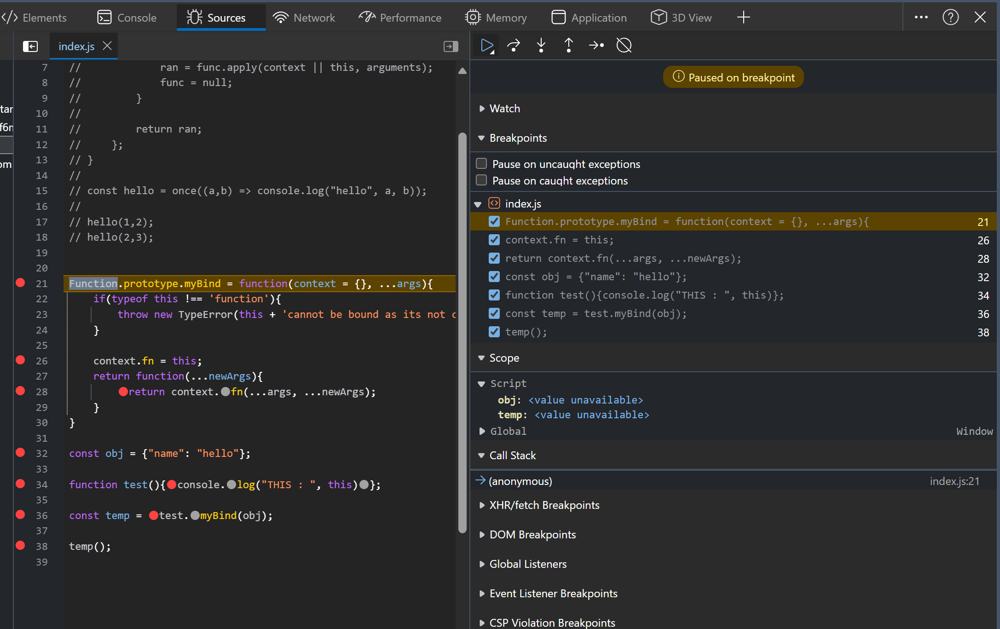


**Other Solutions:**
Look in greatfrontend solutions

---
</details>

<details >
 <summary style="font-size: large; font-weight: bold">once()</summary>

https://www.greatfrontend.com/questions/javascript/once

Solution-1:
```js
function once(func, context){
    let ran;
    
    return function() {
        if(func) {
            ran = func.apply(context || this, arguments);
            func = null;
        }
        
        return ran;
    };
}
```

My Solution:
```js
export default function once(func, context) {
  let ran;

   return function(...args) {
    if(!ran){
      ran = func.apply(context || this, args);
    }

    return ran;
   }
}
```

Usage
```js
const hello = once((a,b) => console.log("hello", a, b));

hello(1,2);
hello(2,3);
```
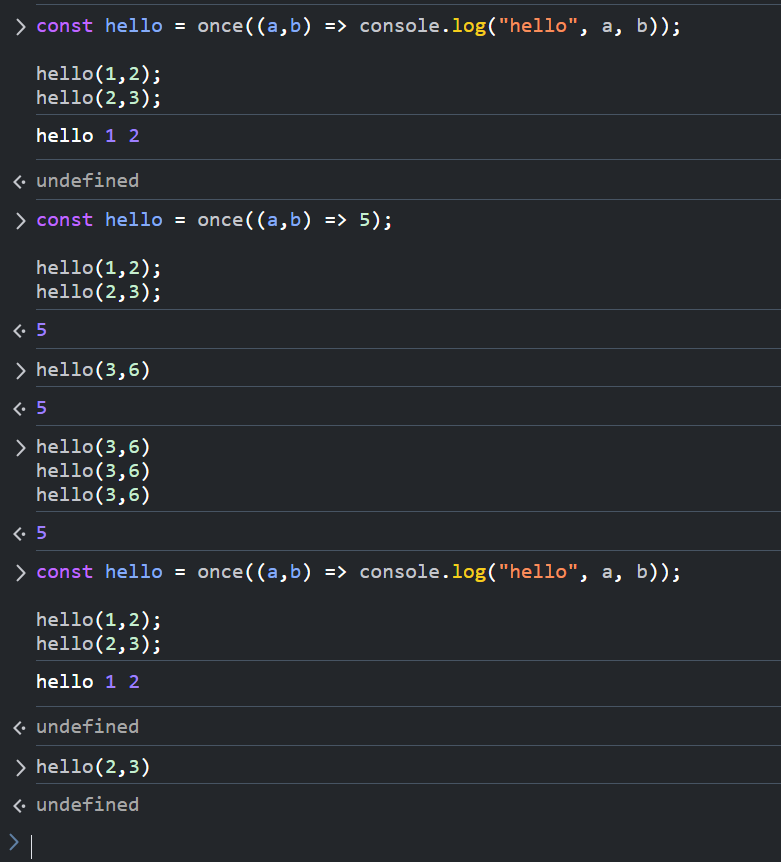

<details >
 <summary style="font-size: small; font-weight: bold">My Explanation</summary>

I have added different break-points and they will stop the code
when we hit them.

1. Memory Creation Phase👇🏻
<br>
We have `hello` stored with value `<value unavailable>` and `once`
is stored with its code
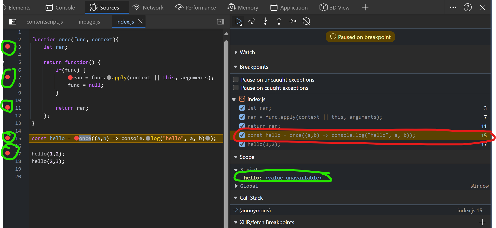

2. Code Execution Phase, we start with line 15 straight. Push the `once` in `Call Stack`
After line 15 execute we hit line 3 break-point and below are values we have
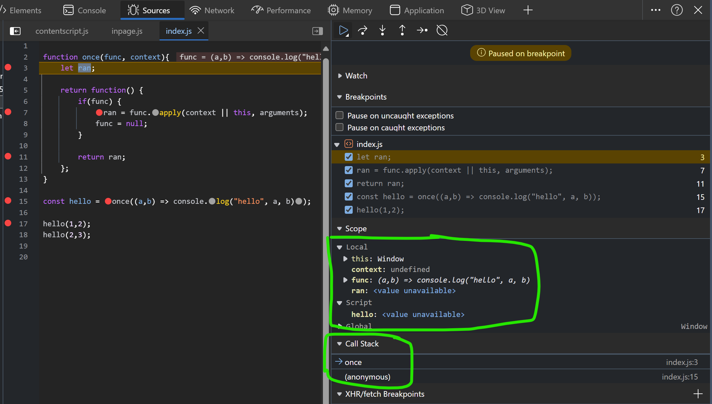

3. Next we hit line-17, before this line execution we have 
`hello` function under the script with closure.
Call stack have Global execution context right now
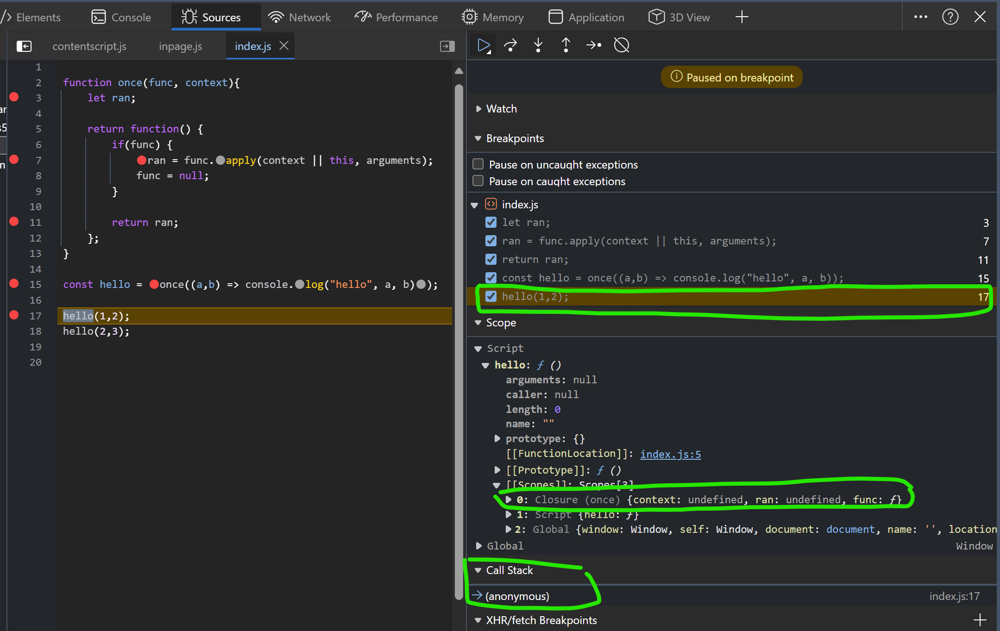

4. Next when line-17 start executing we first hit line-7 breakpoint, since we are trying to 
execute returned anonymous function by `once` function.
Call stack hold this anonymous function 


6. Once line-7 execute we move to next break-point line-11. Now our `closure` `func` becomes `null`
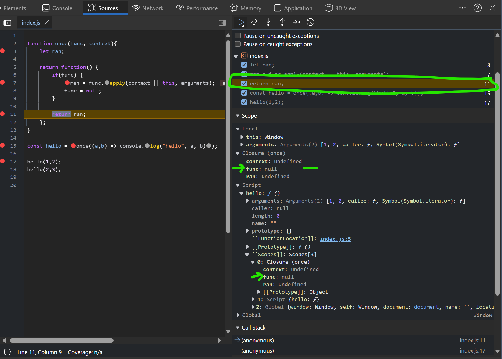

7. Next we hit line-11 again, as `closure` `func` was set to `null` previously hence we didn't 
go into the if condition. We can also confirm the func value from below screenshot
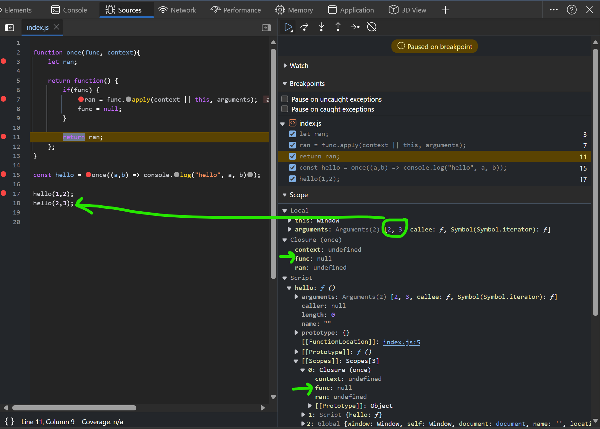

8. finally everything clear up from Call stack and memory
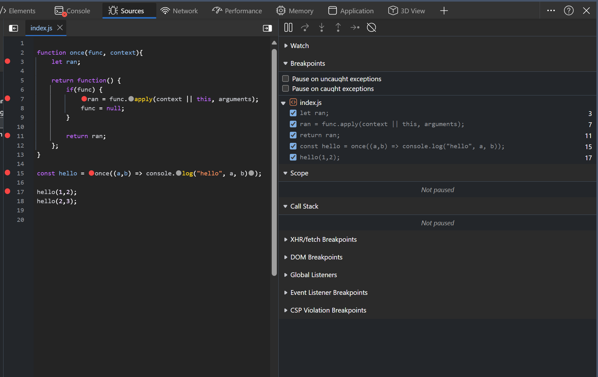

---
</details>

<details >
 <summary style="font-size: small; font-weight: bold">Gemini's Explanation</summary>

I'd be glad to explain the code line by line, including closure creation and state changes:

**Line 1:**

```javascript
function once(func, context) {
```

- **Function declaration:** This line declares a function named `once`.
- **Parameters:** The function takes two parameters:
    - `func`: This is expected to be a function that will be executed only once.
    - `context` (optional): This is an optional parameter that specifies the context (`this` value) in which `func` should be called. If not provided, `this` will refer to the function where `once` is called.

**Line 2:**

```javascript
let ran;
```

- **Variable declaration:** A variable named `ran` is declared inside the `once` function with `let`. This variable will be used to store the return value of `func` if it has been executed. It is initially set to `undefined`.

**Line 3:**

```javascript
return function() {
```

- **Function return:** The `once` function returns another function (an inner function). This creates a closure.

**State after line 3:**

- At this point, the `once` function has not been executed yet. The `ran` variable is still `undefined`.

**Inner function (closure):**

The inner function returned by `once` is where the closure magic happens. It has access to the variables declared within the `once` function's scope (including `ran` and the arguments passed to `once`). This creates a closure because the inner function "remembers" the state of its outer function even when the outer function has finished executing.

**Lines 4-7 (inside the inner function):**

```javascript
if (func) {
  ran = func.apply(context || this, arguments);
  func = null;
}
return ran;
};
```

- **Conditional check:** This checks if `func` is still a function (not null). This ensures that `func` is executed only once.
- **Execution (if `func` is not null):**
    - `ran = func.apply(context || this, arguments);`: If `func` is not null, it's executed using `apply`. This allows you to specify the `context` (`this` value) and arguments for the function call.
        - `context || this`: If `context` is provided, it's used as the context for `func`. Otherwise, `this` refers to the object where the inner function is called.
        - `arguments`: The arguments passed to the inner function are used as arguments for `func`.
    - `func = null;`: After `func` is executed, it's set to `null` to prevent further execution.
- **Return:** The inner function returns the value stored in `ran` (the result of `func` if it was executed, or `undefined` otherwise).

**State after executing the inner function for the first time (hello(1, 2)):**

- `func` is now set to `null` inside the closure.
- `ran` holds the return value of `console.log("hello", 1, 2)`.

**State after executing the inner function for the second time (hello(2, 3)):**

- Since `func` is already `null`, the `if` condition fails, and `func` is not executed again.
- The inner function simply returns the previously stored value in `ran` (which remains the result of the first call).

**Output:**

The code will print "hello 1 2" only once, even though `hello` is called twice. This demonstrates how the closure ensures that `func` is executed at most once.

---
</details>

---
</details>

<details >
 <summary style="font-size: large; font-weight: bold">memoize()</summary>

https://www.greatfrontend.com/questions/javascript/memoize-ii

```js
function myMemoize(fn, context){
    const res = {};
    
    return function (...args){
       var argsCache = JSON.stringify(args);
       if(!res[argsCache]){
           res[argsCache] = fn.call(context || this, ...args);
       }
       return res[argsCache];
    }
}
```

Usage
```js
const clumsyProduct = (num1, num2) => {
    for(let i = 1; i <= 10000000; i++){}
    
    return num1 * num2;
}

const memoizedClumzyProduct = myMemioze(clumsyProduct);

console.log(memoizedClumzyProduct(2, 3));
console.log(memoizedClumzyProduct(2, 3));
```

---
</details>

<details >
 <summary style="font-size: large; font-weight: bold">Promise()</summary>

<details >
 <summary style="font-size: small; font-weight: bold">Stage-1</summary>

- Basic structure
- Asynchronous `.then()` execution


```js
// Create a Constructor Function
function PromisePolyFill(executor){
    let onResolve, onReject;

    function resolve(value){
        onResolve(value);
    }

    function reject(value){
        onReject(value);
    }

    this.then = function(callback){
        onResolve = callback;
        return this;
    }

    this.catch = function(callback){
        onReject = callback;
        return this;
    }

    executor(resolve, reject);
}


const examplePromise = new PromisePolyFill((res, rej) => {
    setTimeout(() => {
        res(2);
    }, 1000);
})

examplePromise.then((res) => {
    console.log("res : ", res)
}).catch((error) => {
    console.log("error : ", error)
});

```

- Try to run this in browser with break points you will get error for synchronous execution, as 
no `onResolve` function is defined when we try to execute the `.then()`

- Synchronous execution
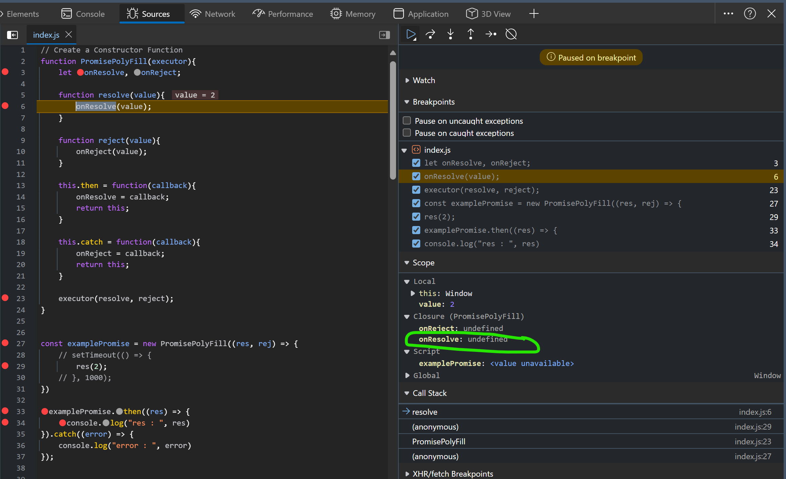

- Asynchronous execution
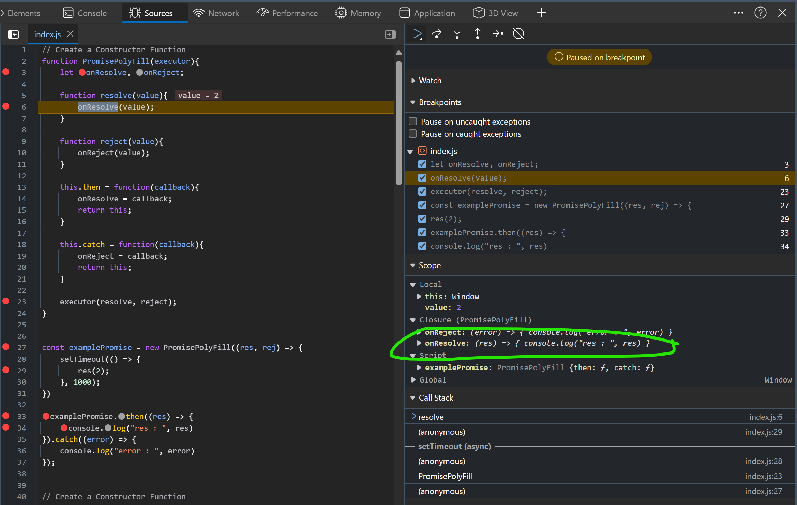

---
</details>

<details >
 <summary style="font-size: small; font-weight: bold">Stage-2</summary>

- Synchronous `.then()` execution

```js
// Create a Constructor Function
function PromisePolyFill(executor){
    let onResolve,
        onReject,
        isFullfilled = false,
        isCalled,
        value;

    function resolve(val){
        isFullfilled = true;
        value = val;

        if(typeof onResolve === 'function'){
            onResolve(val);
            isCalled = true;
        }
    }

    function reject(val){
        onReject(val);
    }

    this.then = function(callback){
        onResolve = callback;

        if(isFullfilled && !isCalled){
            onResolve(value);
            isCalled = true;
        }
        return this;
    }

    this.catch = function(callback){
        onReject = callback;
        return this;
    }

    executor(resolve, reject);
}


const examplePromise = new PromisePolyFill((res, rej) => {
    // setTimeout(() => {
    res(2);

    // }, 1000);
})

examplePromise.then((res) => {
    console.log("res : ", res)
}).catch((error) => {
    console.log("error : ", error)
});
```

---
</details>


<details >
 <summary style="font-size: small; font-weight: bold">Stage-3</summary>

- Similarly do it for `reject` part

```js
// Create a Constructor Function
function PromisePolyFill(executor){
    let onResolve,
        onReject,
        isFullfilled = false,
        isRejected = false,
        isCalled,
        value;

    function resolve(val){
        isFullfilled = true;
        value = val;

        if(typeof onResolve === 'function'){
            onResolve(val);
            isCalled = true;
        }
    }

    function reject(val){
        isRejected = true;
        value = val;

        if(typeof onReject === 'function'){
            onReject(val);
            isCalled = true;
        }
    }

    this.then = function(callback){
        onResolve = callback;

        if(isFullfilled && !isCalled){
            onResolve(value);
            isCalled = true;
        }
        return this;
    }

    this.catch = function(callback){
        onReject = callback;

        if(isRejected && !isCalled){
            onReject(value);
            isCalled = true;
        }
        return this;
    }

    //Error Handling through `try` `catch` block for executor
    try{
        executor(resolve, reject);
    }
    catch(error){
        reject(error);
    }
}


const examplePromise = new PromisePolyFill((res, rej) => {
    // setTimeout(() => {
    rej(2);
    // }, 1000);
})

examplePromise.then((res) => {
    console.log("res : ", res)
}).catch((error) => {
    console.log("error : ", error)
});

```

---
</details>

Referred Video: https://youtu.be/Th3rZjfKKhI?si=q4-ACTNygFJqkEb7&t=1576
<br>
Referred Article: https://dev.to/vijayprwyd/polyfill-for-promises-1f0e

---
</details>


<details >
 <summary style="font-size: large; font-weight: bold">⭐PromisePolyFill.resolve(), PromisePolyFill.reject() & PromisePolyFill.all()</summary>

This is an important interview question, `promise` polyfill can be skipped but
this needs to be covered. 

Here we can use our own `promise` polyfill or use inbuilt `Promise` to write
polyfill for the above functions 

`Promise.allPolyfill` like this, but it will have same implementation

```js
PromisePolyFill.resolve = (val) =>
  new PromisePolyFill(function executor(resolve, _reject) {
    resolve(val);
  });

PromisePolyFill.reject = (reason) =>
  new PromisePolyFill(function executor(resolve, reject) {
    reject(reason);
  });
```


```js
PromisePolyFill.all = (promises) => {
  let fulfilledPromises = [],
    result = [];

  function executor(resolve, reject) {
    promises.forEach((promise, index) =>
      promise
        .then((val) => {

          fulfilledPromises.push(true);
          result[index] = val;

          if (fulfilledPromises.length === promises.length) {
            return resolve(result);
          }
        })
        .catch((error) => {
          return reject(error);
        })
    );
  }
  return new PromisePolyFill(executor);
};

```

Here again we create our own executor function, and return back our promise object which would take in this executor.
Our executor function would work as below :

- We maintain an array named fulfilledPromises and push values to it whenever any promise is resolved.
- If all promises are resolved ( fulfilledPromises.length === promises.length ) we invoke resolve .
- If any promise is rejected we invoke the reject


---
</details>


<details >
 <summary style="font-size: large; font-weight: bold">⭐Promise.all() [GreatFrontend Edge Cases]</summary>

Same like above, only using inbuilt `Promise` and covering some edge cases which above 
solution fails to resolve

https://www.greatfrontend.com/questions/javascript/promise-all?list=one-week

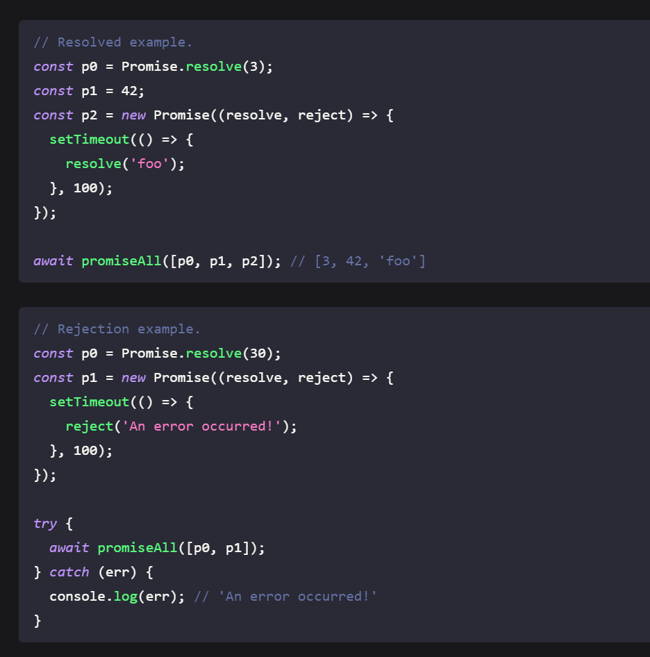

Solution:1 
```js
/**
 * @param {Array} iterable
 * @return {Promise<Array>}
 */
export default function promiseAll(iterable) {
    let unresolvedCount = iterable.length;
    let res = [];

    if(unresolvedCount === 0){
        return Promise.resolve([]);
    }

    const promise = new Promise((resolve, reject) => {

        iterable.forEach((p, index) => {
            
            p.then((data) => {
                res[index] = data;
                unresolvedCount--;

                if(unresolvedCount === 0){
                    resolve(res);
                    return;
                }
            })
            .catch((error) => {
                reject(error);
                return;
            })
            
        })

    })

    return promise;

}
```
This will fail if `iterable` array don't have `Promise`, but some are just plain value like 4, "dd" etc

Solution-2
```js
/**
 * @param {Array} iterable
 * @return {Promise<Array>}
 */
export default function promiseAll(iterable) {
  let unresolvedCount = iterable.length;
  let res = [];

  if(unresolvedCount === 0){
    return Promise.resolve([]);
  }

  const promise = new Promise((resolve, reject) => {

      iterable.forEach((p, index) => {
        if(!(p instanceof Promise)){
          unresolvedCount--;
          res[index] = p;

          if(unresolvedCount === 0){
            resolve(res);
            return;
          }
        }
        else{
          p.then((data) => {
          res[index] = data;
          unresolvedCount--;

          if(unresolvedCount === 0){
            resolve(res);
            return;
          }
        })
        .catch((error) => {
          reject(error);
          return;
        })
        }
      })
      
  })

  return promise;

}
```

Here we check whether given element in an array is `Promise` or not

Solution-3:(Much Better and Clean Solution)

```js
/**
 * @param {Array} iterable
 * @return {Promise<Array>}
 */
export default function promiseAll(iterable) {
  return new Promise((resolve, reject) => {
    let result = new Array(iterable.length);
    let unresolvedCount = iterable.length;

    if(unresolvedCount === 0){
      resolve(result);
      return;
    }

    iterable.forEach((p, index) => {
        /**
         * Here we could have did just `p.then((data) => { ... })`
         * but we have to check whether `p` is `Promise` or not
         * Hence using `Promise.resolve(p)`
         */
      Promise.resolve(p).then((data) => {
        result[index] = data;
        unresolvedCount--;

        if(unresolvedCount === 0){
          resolve(result);
          return;
        }
      }, (error) => {
        reject(error);
        return;
      })
    })
  })
}
```

---
</details>

https://jsvault.com/iife-example
