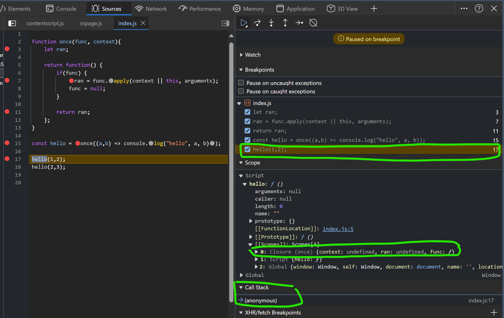
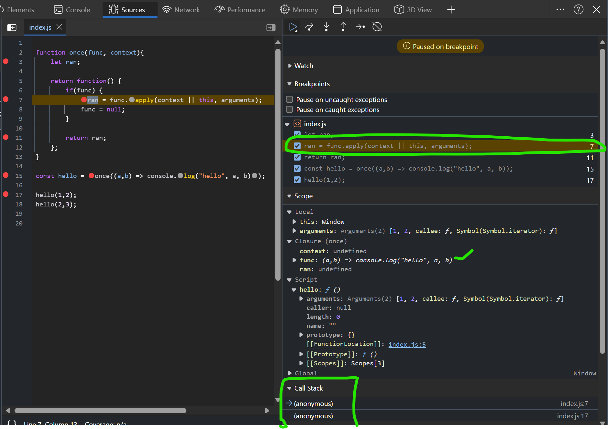
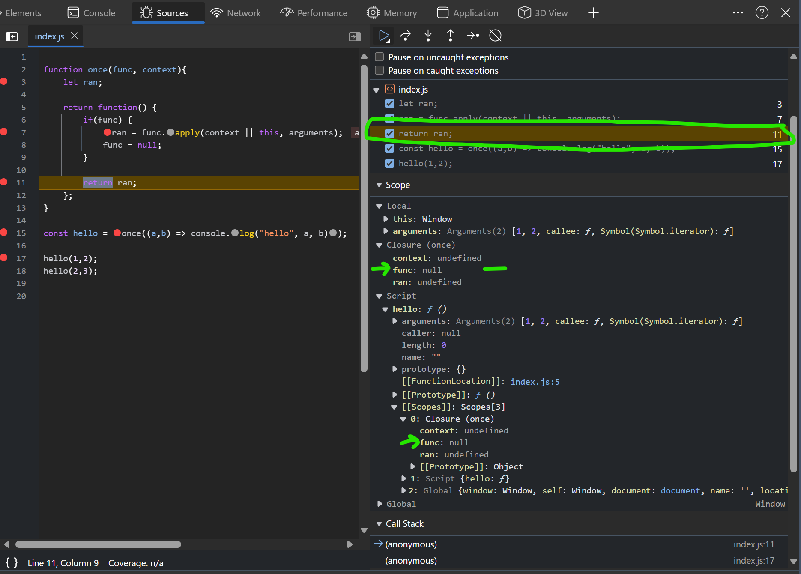
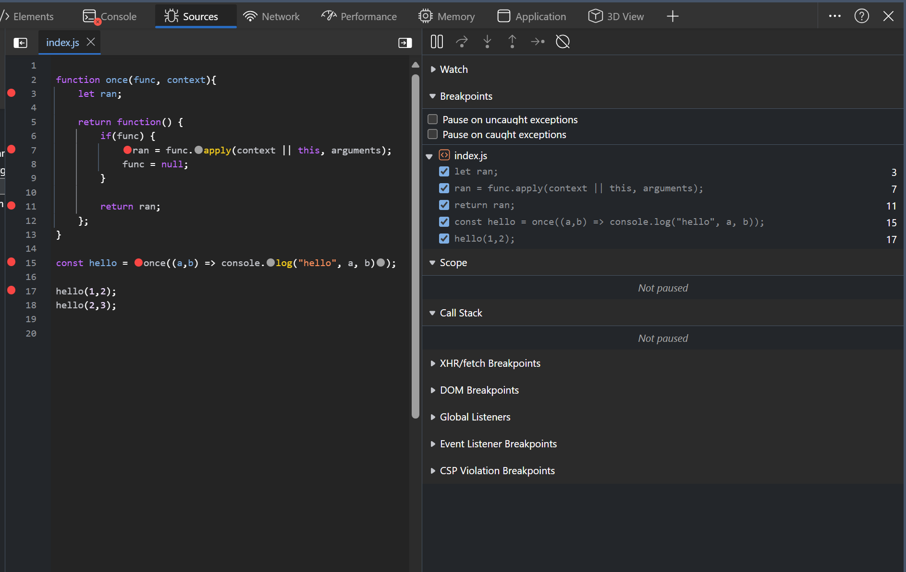
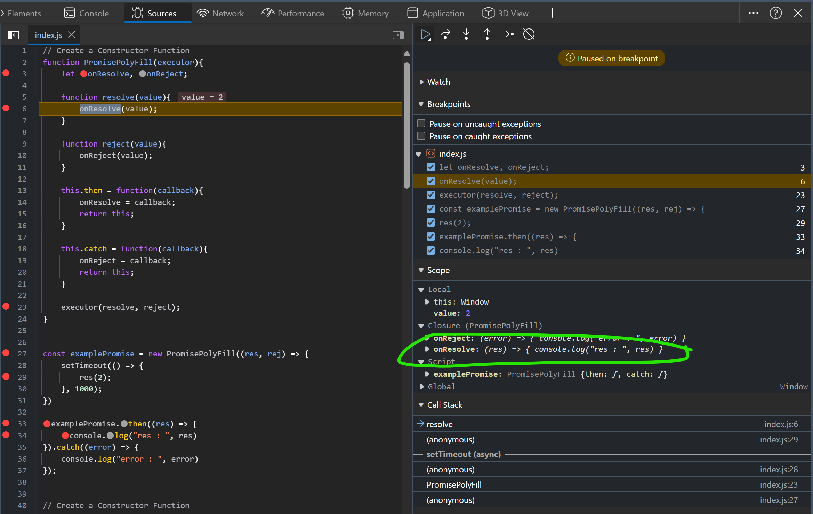

## Polyfills

<details >
 <summary style="font-size: large; font-weight: bold">map()</summary>

```js
// arr.map((num, i, arr) => {})
Array.prototype.myMap = function(cb) {
    let temp = [];
    
    for(let i = 0; i < this.length; i++){
        temp.push(cb(this[i], i, this));
    }
    
    return temp;
}
```

Inside the loop, we call the callback function with three arguments:
- `this[i]`: The current element of the array.
- `i`: The index of the current element.
- `this`: The original array (useful for methods that need context).

Usage
```js
const nums = [1,2,3,4];

const multiplyThree = nums.myMap((num, i, arr) => {
    return num * 3;
})

console.log(multiplyThree);
```


In TypeScript

```ts
Array.prototype.map<T, U>(callback: (value: T, index: number, array: T[]) => U): U[] {
    const newArray: U[] = [];
    for (let i = 0; i < this.length; i++) {
      newArray.push(callback(this[i], i, this));
    }
    return newArray;
  }
```
</details>

<details >
 <summary style="font-size: large; font-weight: bold">filter()</summary>

```js
Array.prototype.myFilter = function(cb) {
    let temp = [];
    for(let i = 0; i < this.length; i++){
        if(cb(this[i], i, this)){
            temp.push(this[i]);
        }
    }
    
    return temp;
}
```
</details>

<details >
 <summary style="font-size: large; font-weight: bold">reduce()</summary>

```js
// arr.reduce((accumulator, curr, i, arr) => {}, initialValue)
Array.prototype.myReduce = function(cb, initialValue){
    var accumulator = initialValue;
    
    for(let i = 0; i < this.length; i++){
        //checking accumulator first is important because
        //if we don't have initialValue, accumulator will be undefined
        accumulator = accumulator ? cb(accumulator, this[i], i, this) : this[i];
    }
    
    return accumulator;
}
```
</details>

<details >
 <summary style="font-size: large; font-weight: bold">call()</summary>

```js
Function.prototype.myCall = function (context = {}, ...args){
    if(typeof this !== 'function'){
        throw new TypeError('Its not callable');
    }
    
    context.fn = this;
    context.fn(...args);
}
```


In the given code, `this` refers to the function on which `myCall` is being invoked. This is because `myCall` is added to the `Function.prototype`, meaning it becomes a method that can be called on any function.

### Example Usage:

Suppose you have a function `greet`:

```javascript
function greet(message) {
    console.log(`${message}, ${this.name}`);
}
```

You can use `myCall` to call `greet` with a specific context:

```javascript
const person = { name: 'Alice' };

greet.myCall(person, 'Hello');  // Output: "Hello, Alice"
```

In this example:
- `this` inside `myCall` refers to the `greet` function.
- `context` is the `person` object `{ name: 'Alice' }`.
- `context.fn = this` assigns the `greet` function to `context.fn`.
- `context.fn(...args)` calls the `greet` function with `person` as the context and `'Hello'` as the argument.
We can use same logic like GF function called by BF, hence `this` will point to BF object
</details>

<details >
 <summary style="font-size: large; font-weight: bold">apply()</summary>

```js
Function.prototype.myApply = function (context = {}, args=[]){
    if(typeof this !== 'function'){
        throw new TypeError('Its not callable');
    }
    
    if(!Array.isArray(args)){
        throw new TypeError('Its not an array');
    }
    
    context.fn = this;
    context.fn(...args);
}
```
</details>

<details >
 <summary style="font-size: large; font-weight: bold">bind()</summary>

```js
Function.prototype.myBind = function(context = {}, ...args){
    if(typeof this !== 'function'){
        throw new TypeError(this + 'cannot be bound as its not callable');
    }
    
    context.fn = this;
    return function(...newArgs){
        return context.fn(...args, ...newArgs);
    }
}
```

Check `once()` function explanation and try to execute above in browser with below
break point to understand this better

</details>

<details >
 <summary style="font-size: large; font-weight: bold">once()</summary>

```js
function once(func, context){
    let ran;
    
    return function() {
        if(func) {
            ran = func.apply(context || this, arguments);
            func = null;
        }
        
        return ran;
    };
}
```

Usage
```js
const hello = once((a,b) => console.log("hello", a, b));

hello(1,2);
hello(2,3);
```

<details >
 <summary style="font-size: small; font-weight: bold">My Explanation</summary>

I have added different break-points and they will stop the code
when we hit them.

1. Memory Creation Phase👇🏻
<br>
We have `hello` stored with value `<value unavailable>` and `once`
is stored with its code


2. Code Execution Phase, we start with line 15 straight. Push the `once` in `Call Stack`
After line 15 execute we hit line 3 break-point and below are values we have


3. Next we hit line-17, before this line execution we have 
`hello` function under the script with closure.
Call stack have Global execution context right now


4. Next when line-17 start executing we first hit line-7 breakpoint, since we are trying to 
execute returned anonymous function by `once` function.
Call stack hold this anonymous function 


6. Once line-7 execute we move to next break-point line-11. Now our `closure` `func` becomes `null`


7. Next we hit line-11 again, as `closure` `func` was set to `null` previously hence we didn't 
go into the if condition. We can also confirm the func value from below screenshot


8. finally everything clear up from Call stack and memory

</details>

<details >
 <summary style="font-size: small; font-weight: bold">Gemini's Explanation</summary>

I'd be glad to explain the code line by line, including closure creation and state changes:

**Line 1:**

```javascript
function once(func, context) {
```

- **Function declaration:** This line declares a function named `once`.
- **Parameters:** The function takes two parameters:
    - `func`: This is expected to be a function that will be executed only once.
    - `context` (optional): This is an optional parameter that specifies the context (`this` value) in which `func` should be called. If not provided, `this` will refer to the function where `once` is called.

**Line 2:**

```javascript
let ran;
```

- **Variable declaration:** A variable named `ran` is declared inside the `once` function with `let`. This variable will be used to store the return value of `func` if it has been executed. It is initially set to `undefined`.

**Line 3:**

```javascript
return function() {
```

- **Function return:** The `once` function returns another function (an inner function). This creates a closure.

**State after line 3:**

- At this point, the `once` function has not been executed yet. The `ran` variable is still `undefined`.

**Inner function (closure):**

The inner function returned by `once` is where the closure magic happens. It has access to the variables declared within the `once` function's scope (including `ran` and the arguments passed to `once`). This creates a closure because the inner function "remembers" the state of its outer function even when the outer function has finished executing.

**Lines 4-7 (inside the inner function):**

```javascript
if (func) {
  ran = func.apply(context || this, arguments);
  func = null;
}
return ran;
};
```

- **Conditional check:** This checks if `func` is still a function (not null). This ensures that `func` is executed only once.
- **Execution (if `func` is not null):**
    - `ran = func.apply(context || this, arguments);`: If `func` is not null, it's executed using `apply`. This allows you to specify the `context` (`this` value) and arguments for the function call.
        - `context || this`: If `context` is provided, it's used as the context for `func`. Otherwise, `this` refers to the object where the inner function is called.
        - `arguments`: The arguments passed to the inner function are used as arguments for `func`.
    - `func = null;`: After `func` is executed, it's set to `null` to prevent further execution.
- **Return:** The inner function returns the value stored in `ran` (the result of `func` if it was executed, or `undefined` otherwise).

**State after executing the inner function for the first time (hello(1, 2)):**

- `func` is now set to `null` inside the closure.
- `ran` holds the return value of `console.log("hello", 1, 2)`.

**State after executing the inner function for the second time (hello(2, 3)):**

- Since `func` is already `null`, the `if` condition fails, and `func` is not executed again.
- The inner function simply returns the previously stored value in `ran` (which remains the result of the first call).

**Output:**

The code will print "hello 1 2" only once, even though `hello` is called twice. This demonstrates how the closure ensures that `func` is executed at most once.
</details>
</details>

<details >
 <summary style="font-size: large; font-weight: bold">memoize()</summary>

```js
function myMemoize(fn, context){
    const res = {};
    
    return function (...args){
       var argsCache = JSON.stringify(args);
       if(!res[argsCache]){
           res[argsCache] = fn.call(context || this, ...args);
       }
       return res[argsCache];
    }
}
```

Usage
```js
const clumsyProduct = (num1, num2) => {
    for(let i = 1; i <= 10000000; i++){}
    
    return num1 * num2;
}

const memoizedClumzyProduct = myMemioze(clumsyProduct);

console.log(memoizedClumzyProduct(2, 3));
console.log(memoizedClumzyProduct(2, 3));
```
</details>

<details >
 <summary style="font-size: large; font-weight: bold">Promise()</summary>

<details >
 <summary style="font-size: small; font-weight: bold">Stage-1</summary>

- Basic structure
- Asynchronous `.then()` execution


```js
// Create a Constructor Function
function PromisePolyFill(executor){
    let onResolve, onReject;

    function resolve(value){
        onResolve(value);
    }

    function reject(value){
        onReject(value);
    }

    this.then = function(callback){
        onResolve = callback;
        return this;
    }

    this.catch = function(callback){
        onReject = callback;
        return this;
    }

    executor(resolve, reject);
}


const examplePromise = new PromisePolyFill((res, rej) => {
    setTimeout(() => {
        res(2);
    }, 1000);
})

examplePromise.then((res) => {
    console.log("res : ", res)
}).catch((error) => {
    console.log("error : ", error)
});

```

- Try to run this in browser with break points you will get error for synchronous execution, as 
no `onResolve` function is defined when we try to execute the `.then()`

- Synchronous execution


- Asynchronous execution

</details>

<details >
 <summary style="font-size: small; font-weight: bold">Stage-2</summary>

- Synchronous `.then()` execution

```js
// Create a Constructor Function
function PromisePolyFill(executor){
    let onResolve,
        onReject,
        isFullfilled = false,
        isCalled,
        value;

    function resolve(val){
        isFullfilled = true;
        value = val;

        if(typeof onResolve === 'function'){
            onResolve(val);
            isCalled = true;
        }
    }

    function reject(val){
        onReject(val);
    }

    this.then = function(callback){
        onResolve = callback;

        if(isFullfilled && !isCalled){
            onResolve(value);
            isCalled = true;
        }
        return this;
    }

    this.catch = function(callback){
        onReject = callback;
        return this;
    }

    executor(resolve, reject);
}


const examplePromise = new PromisePolyFill((res, rej) => {
    // setTimeout(() => {
    res(2);

    // }, 1000);
})

examplePromise.then((res) => {
    console.log("res : ", res)
}).catch((error) => {
    console.log("error : ", error)
});
```
</details>


<details >
 <summary style="font-size: small; font-weight: bold">Stage-3</summary>

- Similarly do it for `reject` part

```js
// Create a Constructor Function
function PromisePolyFill(executor){
    let onResolve,
        onReject,
        isFullfilled = false,
        isRejected = false,
        isCalled,
        value;

    function resolve(val){
        isFullfilled = true;
        value = val;

        if(typeof onResolve === 'function'){
            onResolve(val);
            isCalled = true;
        }
    }

    function reject(val){
        isRejected = true;
        value = val;

        if(typeof onReject === 'function'){
            onReject(val);
            isCalled = true;
        }
    }

    this.then = function(callback){
        onResolve = callback;

        if(isFullfilled && !isCalled){
            onResolve(value);
            isCalled = true;
        }
        return this;
    }

    this.catch = function(callback){
        onReject = callback;

        if(isRejected && !isCalled){
            onReject(value);
            isCalled = true;
        }
        return this;
    }

    //Error Handling through `try` `catch` block for executor
    try{
        executor(resolve, reject);
    }
    catch(error){
        reject(error);
    }
}


const examplePromise = new PromisePolyFill((res, rej) => {
    // setTimeout(() => {
    rej(2);
    // }, 1000);
})

examplePromise.then((res) => {
    console.log("res : ", res)
}).catch((error) => {
    console.log("error : ", error)
});

```
</details>

Referred Video: https://youtu.be/Th3rZjfKKhI?si=q4-ACTNygFJqkEb7&t=1576
<br>
Referred Article: https://dev.to/vijayprwyd/polyfill-for-promises-1f0e
</details>


<details >
 <summary style="font-size: large; font-weight: bold">⭐PromisePolyFill.resolve(), PromisePolyFill.reject() & PromisePolyFill.all()</summary>

This is an important interview question, `promise` polyfill can be skipped but
this needs to be covered. 

Here we can use our own `promise` polyfill or use inbuilt `Promise` to write
polyfill for the above functions 

`Promise.allPolyfill` like this, but it will have same implementation

```js
PromisePolyFill.resolve = (val) =>
  new PromisePolyFill(function executor(resolve, _reject) {
    resolve(val);
  });

PromisePolyFill.reject = (reason) =>
  new PromisePolyFill(function executor(resolve, reject) {
    reject(reason);
  });
```


```js
PromisePolyFill.all = (promises) => {
  let fulfilledPromises = [],
    result = [];

  function executor(resolve, reject) {
    promises.forEach((promise, index) =>
      promise
        .then((val) => {

          fulfilledPromises.push(true);
          result[index] = val;

          if (fulfilledPromises.length === promises.length) {
            return resolve(result);
          }
        })
        .catch((error) => {
          return reject(error);
        })
    );
  }
  return new PromisePolyFill(executor);
};

```

Here again we create our own executor function, and return back our promise object which would take in this executor.
Our executor function would work as below :

- We maintain an array named fulfilledPromises and push values to it whenever any promise is resolved.
- If all promises are resolved ( fulfilledPromises.length === promises.length ) we invoke resolve .
- If any promise is rejected we invoke the reject

</details>

