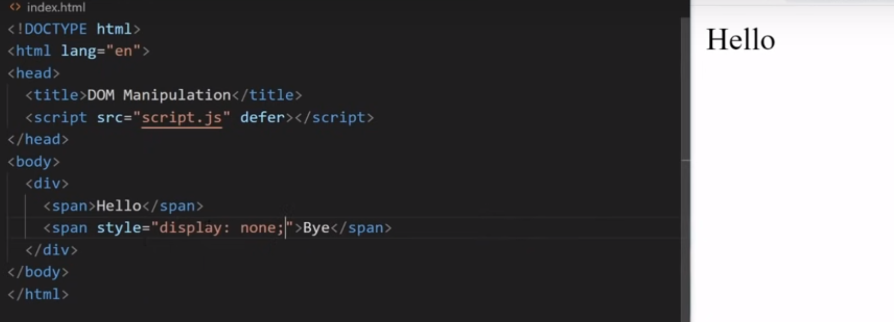
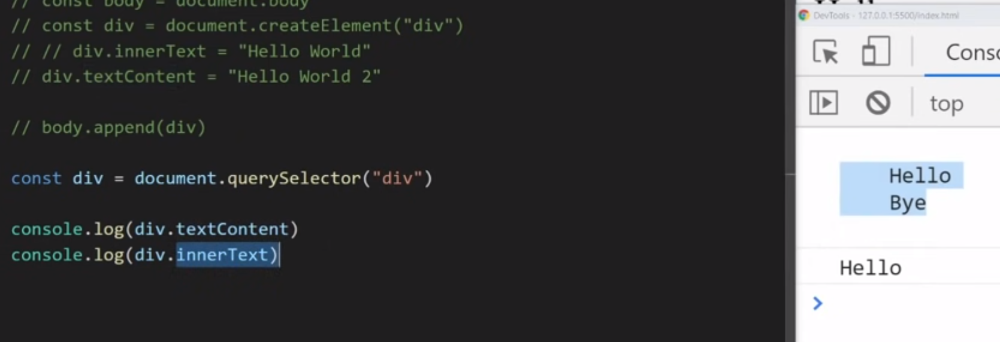
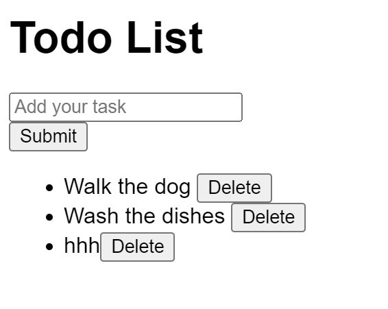

# DOM Manipulation

## Modifying Element

```javascript
const body = document.body;

const div = document.createElement('div');
div.innerText = 'Hello World';

body.append(div);
```

### `innerText` vs `textContent`




## Inserting HTML in DOM
```javascript
const body = document.body;

const div = document.createElement('div');

// 1st Method: Unsafe
// div.innerHTML = "<strong>Hello World</strong>";

// 2nd Method: Safe
const strong = document.createElement('strong');
strong.innerText = 'Hello World';
div.append(strong);

body.append(div);
```


## Removing HTML from DOM

```html

<body>
<div>
    <span id="hello">Hello</span>
    <span id="bye">Bye</span>
</div>

<script src="index.js"></script>
</body>
```

```javascript
const body = document.body;
const div = document.querySelector('div');
const spanHello = document.querySelector('#hello');
const spanBye = document.querySelector('#bye');

spanBye.remove();
```


## Fetching, Adding & Removing Attributes
```javascript
console.log(spanHello.getAttribute('id'));
spanHello.setAttribute('id', "span-hello-id");
spanHello.removeAttribute('id')


// 2nd Method
spanHello.id = 'span-hello-id';
```

## Data Attributes

```html
<div
  id="test-div"
  data-first-name="Kyle"
  data-last-name="Cook"
  data-active
></div>
```

### Reading
```javascript
const div = document.getElementById("test-div")

console.log(div.dataset)
```

Our dataset looks like this.
```json
{
  "active": "",
  "firstName": "Kyle",
  "lastName": "Cook"
}
```

### Writing 
```javascript
const div = document.getElementById("test-div")

div.dataset.test = "Hi"
console.log(div.dataset.test)
// Hi
```

```html
<div
  id="test-div"
  data-test="Hi"
  data-first-name="Kyle"
  data-last-name="Cook"
  data-active
></div>
```

### Delete
```javascript
const div = document.getElementById("test-div")

delete div.dataset.active
console.log(div.dataset.active)
// undefined
```

```html
<div id="test-div" data-first-name="Sally" data-last-name="Cook"></div>
```

Referred article: https://blog.webdevsimplified.com/2020-10/javascript-data-attributes/


## `classList`

### Remove & Add
```javascript
element.classList.add("new-class", "another-class")
console.log(element.classList.value)
// new-class another-class

element.classList.remove("another-class")
console.log(element.classList.value)
// new-class
```

### Contains
```javascript
console.log(element.classList.contains("new-class"))
// false

element.classList.add("new-class")
console.log(element.classList.contains("new-class"))
// true
```

### Toggle
This method lets you toggle a class on/off depending on if the class is already on the element.

```javascript
element.classList.toggle("new-class")
```

The above is the same as the below.
```javascript
if (element.classList.contains("new-class")) {
  element.classList.remove("new-class")
} else {
  element.classList.add("new-class")
}
```

Referred article: https://blog.webdevsimplified.com/2020-11/class-list/


## Modifying Element Style

Convert property name to camel case
```javascript
spanHi.style.backgroundColor = "red";
```

Referred Video: https://www.youtube.com/watch?v=y17RuWkWdn8&t=1s


## Good Example of DOM Manipulation

<details >
 <summary style="font-size: large; font-weight: bold">How can you add a span element inside a div element using web APIs?</summary>

```js
// Get a reference to the div element
const myDiv = document.getElementById('myDiv');

// Create a new span element
const newSpan = document.createElement('span');

// Set attributes (optional)
newSpan.id = 'mySpan';
newSpan.className = 'mySpanClass';

// Add text content (optional)
newSpan.textContent = 'This is some text';

// Append the span to the div
myDiv.appendChild(newSpan);
```

---
</details>

<details >
 <summary style="font-size: large; font-weight: bold">Todo List</summary>



```html
<!doctype html>
<html lang="">
<head>
    <meta charset="UTF-8"/>
    <meta
            name="viewport"
            content="width=device-width, initial-scale=1.0"/>
    <title></title>
</head>
<body>
<div>
    <h1>Todo List</h1>
    <div>
        <input
                aria-label="Add new task"
                type="text"
                placeholder="Add your task"/>
        <div>
            <button id="submit">Submit</button>
        </div>
    </div>
    <ul>
        <li>
            <span>Walk the dog</span>
            <button>Delete</button>
        </li>
        <li>
            <span>Water the plants</span>
            <button>Delete</button>
        </li>
        <li>
            <span>Wash the dishes</span>
            <button>Delete</button>
        </li>
    </ul>
</div>
<script src="src/index.js"></script>
</body>
</html>
```

```javascript
import './styles.css';

(() => {
  // Retain a reference to the elements which persist
  // throughout usage of the app.
  const $inputEl = document.querySelector('input');
  const $submitButtonEl = document.querySelector('#submit');
  const $todoListEl = document.querySelector('ul');

  function addTask(label) {
    // Create the DOM elements for the new task.
    const $newTaskElement = document.createElement('li');

    const $span = document.createElement('span');
    $newTaskElement.appendChild($span);
    // Using Node.textContent here instead of Element.innerHTML
    // to prevent XSS (Cross Site Scripting).
    $span.textContent = label;

    const $btn = document.createElement('button');
    $btn.textContent = 'Delete';
    $newTaskElement.appendChild($btn);

    // Add the new task to the list.
    $todoListEl.append($newTaskElement);
  }

  function deleteTask($itemEl) {
    // Remove the task from the list.
    $itemEl.parentNode.removeChild($itemEl);
  }

  $submitButtonEl.addEventListener('click', () => {
    addTask($inputEl.value);
    // Reset the input so that new tasks can be added.
    $inputEl.value = '';
  });

  // Add a listener to the list instead of individual tasks.
  // This is called event delegation and the benefit is that
  // the Delete button of newly-added tasks will also respond
  // to clicks without you having to manually add event listeners
  // to them. You also don't have to remove any event listeners
  // when the task is removed.
  $todoListEl.addEventListener('click', (event) => {
    // Check that the button is being clicked and not something
    // else (e.g. the task label).
    if (event.target.tagName === 'BUTTON') {
      deleteTask(event.target.parentNode);
    }
  });
})();

```

Referred from: https://www.greatfrontend.com/questions/user-interface/todo-list/vanilla

---
</details>
