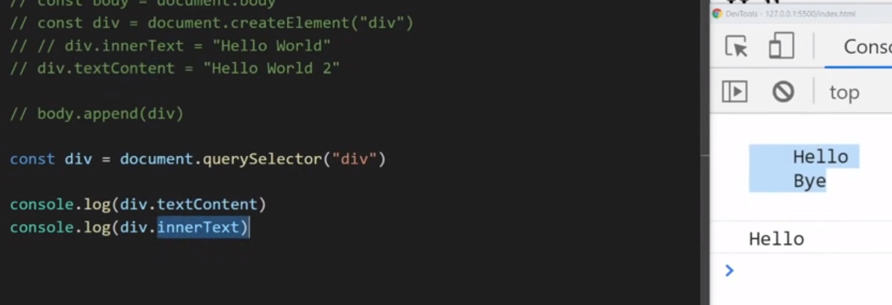
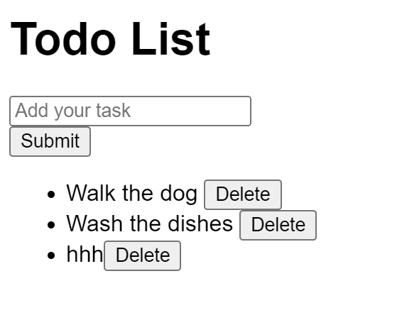

<details >
 <summary style="font-size: x-large; font-weight: bold">DOM Traversal</summary>

### 1. `getElementById`

```html
<div class="grandparent" id="grandparent-id">
        <div class="parent">
            <div class="child"></div>
            <div class="child"></div>
        </div>
        <div class="parent">
            <div class="child"></div>
            <div class="child"></div>
        </div>
    </div>
```

```javascript
const grandparent = document.getElementById("grandparent-id");

const changeColor = (element) => {
    element.style.backgroundColor = "grey";
}

changeColor(grandparent);

```


### 2. `getElementsByClassName`

```javascript
const parents = Array.from(document.getElementsByClassName("parent"));

parents.forEach(changeColor);
```

### 3. `querySelector`

```javascript
const grandparent = document.querySelector("#grandparent-id");
const grandparent = document.querySelector(".grandparent");
changeColor(grandparent);
```
If want to know all selectors we can use refer "CSS Selector Cheat Sheet - Dark" pdf present in this repo

By defult it will select first element
```javascript
const parent = document.querySelector(".parent");
```

To select all the elements
```javascript
const parents = document.querySelectorAll(".parent");
```

#### i. Selecting Children

```javascript
const grandparent = document.querySelector(".grandparent");
const parents = Array.from(grandparent.children);

parents.forEach(changeColor)
```

```javascript
const parentOne = parents[0];
const childerns = parentOne.children;

changeColor(childerns[0]);
```

#### ii. Selecting Parent

```javascript
const childOne = document.querySelector("#child-one");

const parent = childOne.parentElement;
const grandparent = parent.parentElement;

changeColor(grandparent)
```

Referred Video: https://www.youtube.com/watch?v=v7rSSy8CaYE&t=334s


---
</details>


<details >
 <summary style="font-size: x-large; font-weight: bold">DOM Manipulation</summary>


### 1. Modifying Element

```javascript
const body = document.body;

const div = document.createElement('div');
div.innerText = 'Hello World';

body.append(div);
```

### 2. `innerText` vs `textContent`




### 3. Inserting HTML in DOM
```javascript
const body = document.body;

const div = document.createElement('div');

// 1st Method: Unsafe
// div.innerHTML = "<strong>Hello World</strong>";

// 2nd Method: Safe
const strong = document.createElement('strong');
strong.innerText = 'Hello World';
div.append(strong);

body.append(div);
```


### 4. Removing HTML from DOM

```html

<body>
<div>
    <span id="hello">Hello</span>
    <span id="bye">Bye</span>
</div>

<script src="index.js"></script>
</body>
```

```javascript
const body = document.body;
const div = document.querySelector('div');
const spanHello = document.querySelector('#hello');
const spanBye = document.querySelector('#bye');

spanBye.remove();
```


### 5. Fetching, Adding & Removing Attributes
```javascript
console.log(spanHello.getAttribute('id'));
spanHello.setAttribute('id', "span-hello-id");
spanHello.removeAttribute('id')


// 2nd Method
spanHello.id = 'span-hello-id';
```

### 6. Data Attributes

```html
<div
  id="test-div"
  data-first-name="Kyle"
  data-last-name="Cook"
  data-active
></div>
```

#### i. Reading
```javascript
const div = document.getElementById("test-div")

console.log(div.dataset)
```

Our dataset looks like this.
```json
{
  "active": "",
  "firstName": "Kyle",
  "lastName": "Cook"
}
```

#### ii. Writing
```javascript
const div = document.getElementById("test-div")

div.dataset.test = "Hi"
console.log(div.dataset.test)
// Hi
```

```html
<div
  id="test-div"
  data-test="Hi"
  data-first-name="Kyle"
  data-last-name="Cook"
  data-active
></div>
```

#### iii. Delete
```javascript
const div = document.getElementById("test-div")

delete div.dataset.active
console.log(div.dataset.active)
// undefined
```

```html
<div id="test-div" data-first-name="Sally" data-last-name="Cook"></div>
```

Referred article: https://blog.webdevsimplified.com/2020-10/javascript-data-attributes/


### 7. `classList`

#### i. Remove & Add
```javascript
element.classList.add("new-class", "another-class")
console.log(element.classList.value)
// new-class another-class

element.classList.remove("another-class")
console.log(element.classList.value)
// new-class
```

#### ii. Contains
```javascript
console.log(element.classList.contains("new-class"))
// false

element.classList.add("new-class")
console.log(element.classList.contains("new-class"))
// true
```

#### iii. Toggle
This method lets you toggle a class on/off depending on if the class is already on the element.

```javascript
element.classList.toggle("new-class")
```

The above is the same as the below.
```javascript
if (element.classList.contains("new-class")) {
  element.classList.remove("new-class")
} else {
  element.classList.add("new-class")
}
```

Referred article: https://blog.webdevsimplified.com/2020-11/class-list/


### 8. Modifying Element Style

Convert property name to camel case
```javascript
spanHi.style.backgroundColor = "red";
```

Referred Video: https://www.youtube.com/watch?v=y17RuWkWdn8&t=1s


### Good Example of DOM Manipulation

<details >
 <summary style="font-size: medium; font-weight: bold">How can you add a span element inside a div element using web APIs?</summary>

```js
// Get a reference to the div element
const myDiv = document.getElementById('myDiv');

// Create a new span element
const newSpan = document.createElement('span');

// Set attributes (optional)
newSpan.id = 'mySpan';
newSpan.className = 'mySpanClass';

// Add text content (optional)
newSpan.textContent = 'This is some text';

// Append the span to the div
myDiv.appendChild(newSpan);
```

---
</details>


<details >
 <summary style="font-size: medium; font-weight: bold">Todo List</summary>



```html
<!doctype html>
<html lang="">
<head>
    <meta charset="UTF-8"/>
    <meta
            name="viewport"
            content="width=device-width, initial-scale=1.0"/>
    <title></title>
</head>
<body>
<div>
    <h1>Todo List</h1>
    <div>
        <input
                aria-label="Add new task"
                type="text"
                placeholder="Add your task"/>
        <div>
            <button id="submit">Submit</button>
        </div>
    </div>
    <ul>
        <li>
            <span>Walk the dog</span>
            <button>Delete</button>
        </li>
        <li>
            <span>Water the plants</span>
            <button>Delete</button>
        </li>
        <li>
            <span>Wash the dishes</span>
            <button>Delete</button>
        </li>
    </ul>
</div>
<script src="src/index.js"></script>
</body>
</html>
```

```javascript
import './styles.css';

(() => {
  // Retain a reference to the elements which persist
  // throughout usage of the app.
  const $inputEl = document.querySelector('input');
  const $submitButtonEl = document.querySelector('#submit');
  const $todoListEl = document.querySelector('ul');

  function addTask(label) {
    // Create the DOM elements for the new task.
    const $newTaskElement = document.createElement('li');

    const $span = document.createElement('span');
    $newTaskElement.appendChild($span);
    // Using Node.textContent here instead of Element.innerHTML
    // to prevent XSS (Cross Site Scripting).
    $span.textContent = label;

    const $btn = document.createElement('button');
    $btn.textContent = 'Delete';
    $newTaskElement.appendChild($btn);

    // Add the new task to the list.
    $todoListEl.append($newTaskElement);
  }

  function deleteTask($itemEl) {
    // Remove the task from the list.
    $itemEl.parentNode.removeChild($itemEl);
  }

  $submitButtonEl.addEventListener('click', () => {
    addTask($inputEl.value);
    // Reset the input so that new tasks can be added.
    $inputEl.value = '';
  });

  // Add a listener to the list instead of individual tasks.
  // This is called event delegation and the benefit is that
  // the Delete button of newly-added tasks will also respond
  // to clicks without you having to manually add event listeners
  // to them. You also don't have to remove any event listeners
  // when the task is removed.
  $todoListEl.addEventListener('click', (event) => {
    // Check that the button is being clicked and not something
    // else (e.g. the task label).
    if (event.target.tagName === 'BUTTON') {
      deleteTask(event.target.parentNode);
    }
  });
})();

```

Referred from: https://www.greatfrontend.com/questions/user-interface/todo-list/vanilla

---
</details>


<details >
 <summary style="font-size: medium; font-weight: bold">Signup Form</summary>


```html
//index.html

<!doctype html>
<html>
<head>
    <meta charset="UTF-8" />
    <meta
            name="viewport"
            content="width=device-width, initial-scale=1.0" />
</head>
<body>
<form>
    <div>
        <label for="username-input">Username</label>
        <input
                id="username-input"
                name="username"
                required
                type="text"
                pattern="^[a-zA-Z0-9]+$"
                minlength="4" />
    </div>
    <div>
        <label for="email-input">Email</label>
        <input
                id="email-input"
                name="email"
                required
                type="email" />
    </div>
    <div>
        <label for="password-input">Password</label>
        <input
                id="password-input"
                name="password"
                required
                type="password"
                minlength="6" />
    </div>
    <div>
        <label for="password-confirm-input">
            Confirm Password
        </label>
        <input
                id="password-confirm-input"
                name="password_confirm"
                required
                type="password"
                minlength="6"
                aria-describedby="password-mismatch-error" />
        <div
                class="error hidden"
                id="password-mismatch-error">
            The passwords do not match
        </div>
    </div>
    <div>
        <button type="submit">Sign Up</button>
    </div>
</form>
<script src="src/index.js"></script>
</body>
</html>
```


```js
//index.js

import './styles.css';

/**
 * @param {string} username
 * @param {string} email
 * @param {string} password
 * @param {string} passwordConfirm
 */
async function submitForm(
    username,
    email,
    password,
    passwordConfirm,
) {
    try {
        const response = await fetch(
            'https://www.greatfrontend.com/api/questions/sign-up',
            {
                method: 'POST',
                headers: {
                    'Content-Type': 'application/json',
                },
                body: JSON.stringify({
                    username,
                    email,
                    password,
                    password_confirm: passwordConfirm,
                }),
            },
        );

        const { message } = await response.json();
        alert(message);
    } catch (_) {
        alert('Error submitting form!');
    }
}

(() => {
    const $form = document.querySelector('form');
    const $passwordConfirmInput = document.getElementById(
        'password-confirm-input',
    );
    const $passwordMismatchError = document.getElementById(
        'password-mismatch-error',
    );

    $form.addEventListener('submit', async (event) => {
        event.preventDefault();
        // Reset the password confirm field.
        $passwordConfirmInput.removeAttribute('aria-invalid');
        $passwordMismatchError.classList.add('hidden');

        // Construct a FormData object based on form values.
        const formData = new FormData($form);
        const password = formData.get('password');
        const passwordConfirm = formData.get(
            'password_confirm',
        );

        // The only fields we cannot leverage the browser to validate
        // is the password confirmation, so we use JavaScript to achieve that.
        if (password !== passwordConfirm) {
            $passwordConfirmInput.setAttribute(
                'aria-invalid',
                'true',
            );
            $passwordMismatchError.classList.remove('hidden');
            return;
        }

        await submitForm(
            formData.get('username'),
            formData.get('email'),
            formData.get('password'),
            formData.get('password_confirm'),
        );
    });
})();
```

Referred from: https://www.greatfrontend.com/questions/user-interface/signup-form/solution

---
</details>


---
</details>


<details >
 <summary style="font-size: x-large; font-weight: bold">Important Coding Questions</summary>


<details >
 <summary style="font-size: large; font-weight: bold">1. getElementsByTagName</summary>

**Question:**

https://www.greatfrontend.com/questions/javascript/get-elements-by-tag-name?list=three-months


**Solution:**
```js
/**
 * @param {Element} element
 * @param {string} tagName
 * @return {Array<Element>}
 */
export default function getElementsByTagName(element, tagNameParam) {
  const elements = [];
  const tagName = tagNameParam.toUpperCase();

  function traverse(el) {
    if (el == null) {
      return;
    }

    if (el.tagName === tagName) {
      elements.push(el);
    }

    for (const child of el.children) {
      traverse(child);
    }
  }

  for (const child of element.children) {
    traverse(child);
  }

  return elements;
}

```

---
</details>


<details >
 <summary style="font-size: large; font-weight: bold">2. Identical DOM Trees</summary>

**Question:**

https://www.greatfrontend.com/questions/javascript/identical-dom-trees?list=three-months

**My Solution:** 
```js
/**
 * @param {Node} nodeA
 * @param {Node} nodeB
 * @return {boolean}
 */
export default function identicalDOMTrees(nodeAParam, nodeBParam) {

  const isIdentical = (nodeA, nodeB) => {
    
    if(nodeA.tagName !== nodeB.tagName)
      return false;
    
    if(nodeA.classList.value !== nodeB.classList.value)
      return false;
    
    if(nodeA.children.length !== nodeB.children.length)
      return false;
    
    /**
     * `innerText` also clear all testcase but
     * scenario where display is none, innerText will skip
     * that part and might yield wrong result if anything
     * different is there in both node
     */
    if(nodeA.textContent !== nodeB.textContent)
      return false;
    
    if(JSON.stringify(nodeA.style) !== JSON.stringify(nodeB.style))
      return false;
      
    if(JSON.stringify(nodeA.dataset) !== JSON.stringify(nodeB.dataset))
       return false;
     

    for(let i = 0; i < nodeA.children.length; i++){
      if(!isIdentical(nodeA.children[i], nodeB.children[i]))
        return false;
    }

    return true;
  }

  return isIdentical(nodeAParam, nodeBParam)
}
```


**GFE Solution:**
```js
/**
 * @param {Node} nodeA
 * @param {Node} nodeB
 * @return {boolean}
 */
export default function identicalDOMTrees(nodeA, nodeB) {
  if (nodeA.nodeType !== nodeB.nodeType) {
    return false;
  }

  if (nodeA.nodeType === Node.TEXT_NODE) {
    return nodeA.textContent === nodeB.textContent;
  }

  // We can assume it's an element node from here on.
  if (nodeA.tagName !== nodeB.tagName) {
    return false;
  }

  if (nodeA.childNodes.length !== nodeB.childNodes.length) {
    return false;
  }

  if (nodeA.attributes.length !== nodeB.attributes.length) {
    return false;
  }

  const hasSameAttributes = nodeA
    .getAttributeNames()
    .every(
      (attrName) =>
        nodeA.getAttribute(attrName) === nodeB.getAttribute(attrName),
    );

  if (!hasSameAttributes) {
    return false;
  }

  return Array.prototype.every.call(nodeA.childNodes, (childA, index) =>
    identicalDOMTrees(childA, nodeB.childNodes[index]),
  );
}
```

**Notes on native DOM APIs**

1. We use `nodeType` when checking the types of nodes. There is a similar API called `tagName` that only works for HTML elements, not for text nodes and comment nodes.
2. We use the `childNodes` property - as opposed to the `children` property - to get the list of children nodes. The reason is, again, children only returns elements while childNodes returns all nodes, including text nodes and comment nodes.
3. We "borrowed" the `every` method from `Array.prototype` via `Array.prototype.every.call(treeA.childNodes)` as opposed to just calling every on `childNodes`. This is because what childNodes returns is not a JavaScript array, rather an array-like data structure called `NodeList`, which doesn't come with all the array methods right out of box. Calling array methods such as every on it would throw an error. The other way to use array methods on a NodeList is to convert it to an array first via `Array.from`. i.e. `Array.from(treeA.childNodes).every(...)`.


One Liner Solution:

```js
function identicalDOMTrees(treeA, treeB) {
  return treeA.isEqualNode(treeB);
}
```

---
</details>


<details >
 <summary style="font-size: large; font-weight: bold">3. jQuery.css</summary>

**Question:**

https://www.greatfrontend.com/questions/javascript/jquery-css?list=three-months

```js
/**
 * @param {string} selector
 * @return {{css: Function}}
 */
export default function $(selector) {
   const el = document.querySelector(selector);

   return {
      /**
       * @param {string} prop
       * @param {boolean|string|number} value
       * @return {Object|void|string}
       */
      css: function (prop, value) {
         // Getter case.
         if (value === undefined) {
            // No matching els.
            if (el == null) {
               return undefined;
            }

            const value = el.style[prop];
            return value === '' ? undefined : value;
         }

         // Setter case.
         if (el != null) {
            el.style[prop] = value;
         }

         return this;
      },
   };

   /*Below code fails if 'el' is undefined, because
   we are trying to chain on undefined. While getting
   value will not cause error because we are not chaining
   while getting but while setting we need to return `this`  */
   // return {
   //   css(prop, value) {
   //     if(el != null) {
   //       if(!value){
   //         return el.style[prop] ? el.style[prop] : undefined;
   //       }
   //       else{
   //         el.style[prop] = value;
   //         return this;
   //       }
   //     }
   //   }
   // }
}
```

---
</details>


<details >
 <summary style="font-size: large; font-weight: bold">4. getElementsByStyle
</summary>

**Question:**

https://www.greatfrontend.com/questions/javascript/get-elements-by-style


```js
/**
 * @param {Element} element
 * @param {string} property
 * @param {string} value
 * @return {Array<Element>}
 */
export default function getElementsByStyle(element, property, value) {
   const res = [];

   function helper(el) {
      // if(el.style[property] === value)
      //   res.push(el);

      /*We need to use below rather than above because 
      getComputedStyle() returns an object that represents the final resolved
      styles of an element after all styles have been applied, including styles
      from CSS files, inline styles, and browser defaults. The style property
      on elements allows you to access and modify inline styles directly on
      the element. If an element is not styled using inline styles, the 
      values of all the keys on the style property is empty.

      // Assuming a typical <body> element with no inline styles specified.
      console.log(document.body.style.fontSize); // '' (empty string)
      console.log(getComputedStyle(document.body).getPropertyValue('font-size')); // 16px;
      */

      if (getComputedStyle(el).getPropertyValue(property) === value)
         res.push(el);

      for(let child of el.children){
         helper(child);
      }
   }

   for(let child of element.children){
      helper(child);
   }


   return res;
}


```


---
</details>

1. AJAX: 
   1. https://www.greatfrontend.com/questions/quiz/what-are-the-advantages-and-disadvantages-of-using-ajax?format=quiz
   2. https://www.greatfrontend.com/questions/quiz/explain-ajax-in-as-much-detail-as-possible
2. ES6: https://www.interviewbit.com/es6-interview-questions/#compare-es5-and-es6-codes-for-object-initialization-and-parsing-returned-objects

---
</details>
