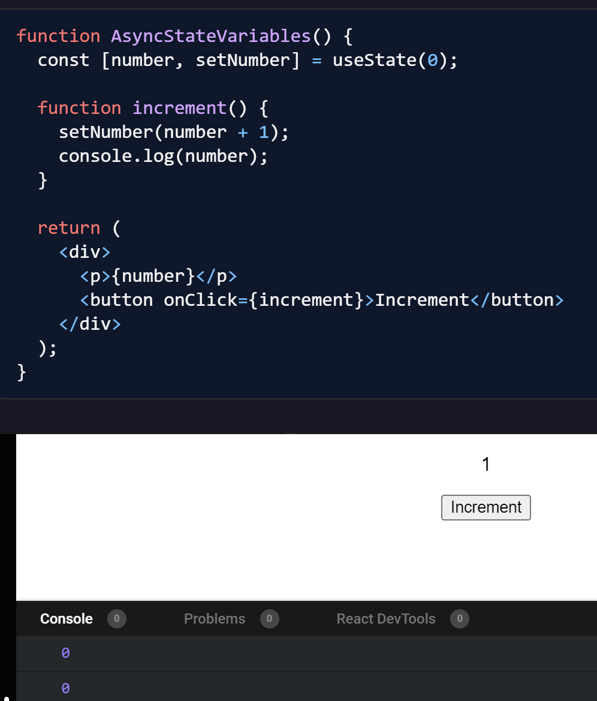
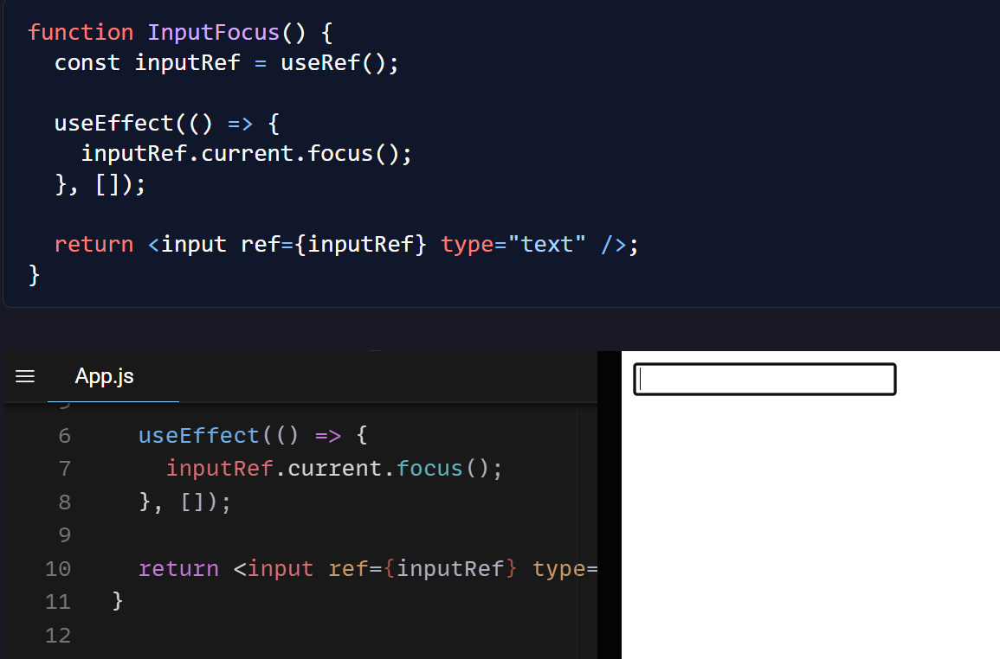
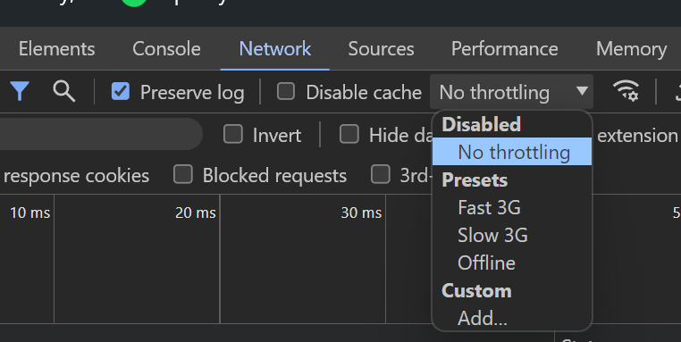
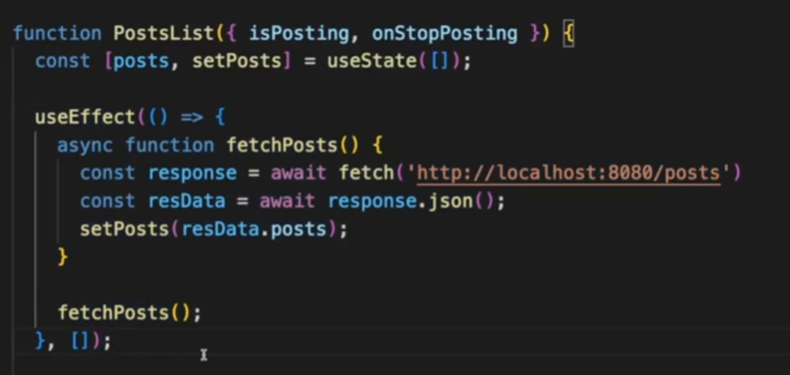
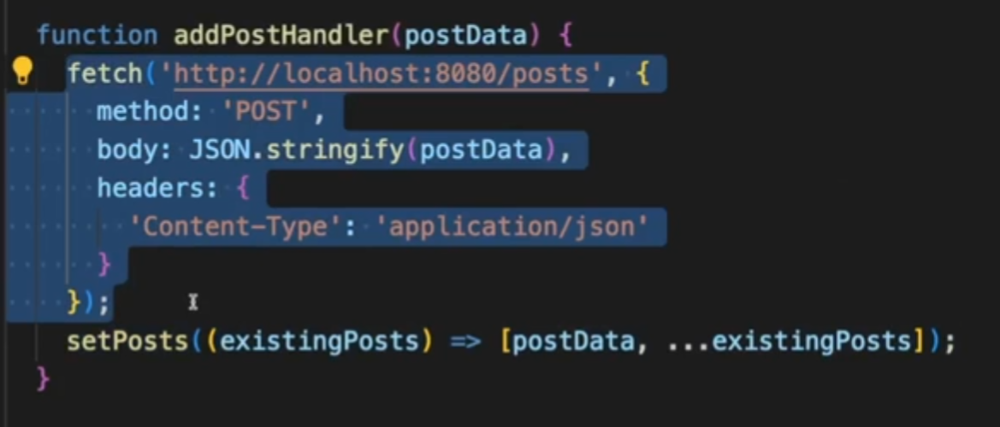
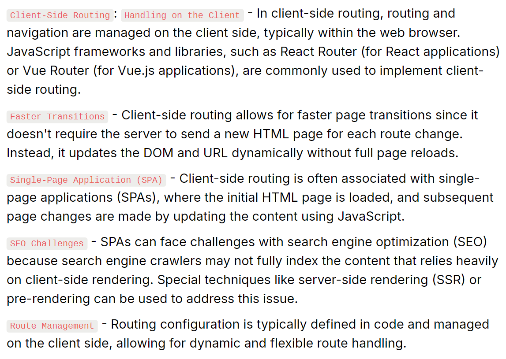
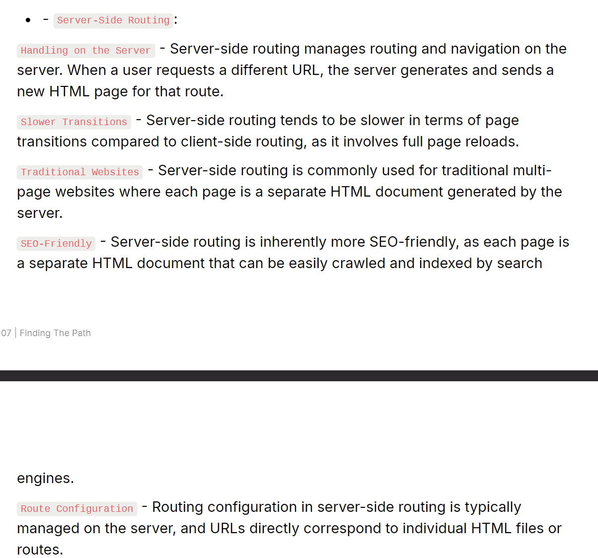
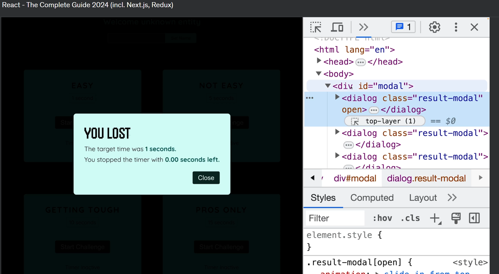
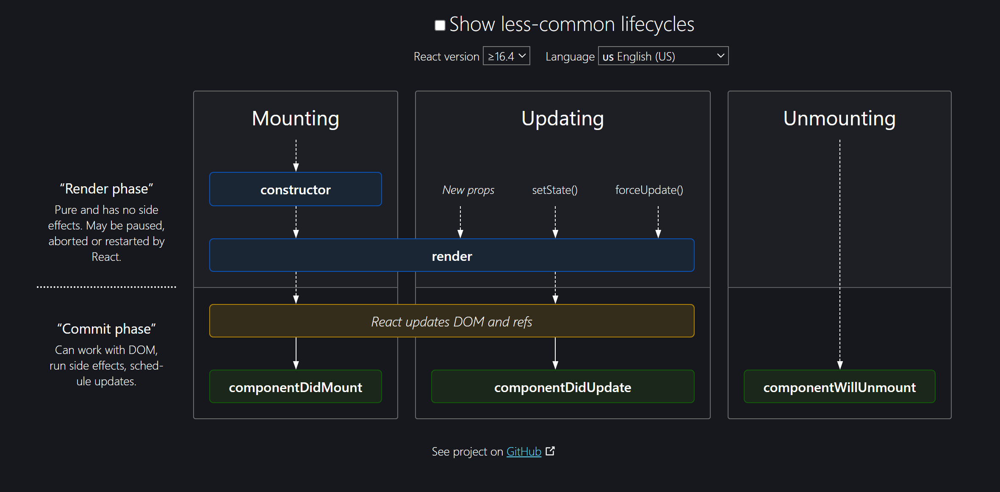

<details >
 <summary style="font-size: x-large; font-weight: bold">Basic Concepts</summary>

Quick Speed Run: https://learnweb3.io/degrees/ethereum-developer-degree/sophomore/intro-to-react-and-next-js/

<details >
 <summary style="font-size: large; font-weight: bold">useState()</summary>

❌Wrong way to update state variable
```js
const [currentImageNo, setCurrentImageNo] = useState(0);

useEffect(() => {
    setInterval(() => {
        setCurrentImageNo((currentImageNo + 1) % totalImage);
    },5000)
})
```

✅Right way to update state variable
```js
const [currentImageNo, setCurrentImageNo] = useState(0);

useEffect(() => {
    setInterval(() => {
        setCurrentImageNo(prevImageNo => (prevImageNo + 1) % totalImage);
    },5000)
})
```
In React, state updates inside a function use the state at the time the function was created.
This means that the `currentImageNo` in your setInterval callback will always be `0` because
it doesn't get the latest value from React's state.
</details>

<details >
 <summary style="font-size: large; font-weight: bold">Input Fields</summary>

```js
import React, { useState } from 'react';
import {Handle, Position} from "reactflow";
import validateTextUtil from "../../utils/validate-text.util";
import {extractVariables, isValidVariableName} from "../../utils/valid-variable-helper.util";
import {useStore} from "../../store";
import classes from "./templateNode.module.css";
import Icon from "../icon";


const TemplateNode = ({ label,icon, id, config, inputHandles=[], outputHandles=[] }) => {
    const [handles, setHandles] = useState({'input': true});
    const [textAreaHeight, setTextAreaHeight] = useState(0);
    const [errors, setErrors] = useState({});
    const updateNodeField = useStore((state) => state.updateNodeField);
    const setSelectedNode = useStore((state) => state.setSelectedNode);
    const selectedNodeId = useStore((state) => state.selectedNodeId);

    const [formValues, setFormValues] = useState(() =>
        config.reduce((acc, field) => {
            acc[field.name] = field.value || '';
            return acc;
        }, {})
    );


    const handleNodeSelect = (id) => {
        setSelectedNode(id);
    };
    const handleChange = (e, fieldName) => {
        const newValues = {
            ...formValues,
            [fieldName]: e.target.value,
        };
        setFormValues(newValues);
        updateNodeField(id, fieldName, e.target.value)
    };

    const handleTextChange = (e, fieldName, rules) => {
        handleChange(e, fieldName);

        const error = validateTextUtil(e.target.value, rules);
        setErrors({
            ...errors,
            [fieldName]: error,
        });
    }
    const handleTextareaChange = (e, fieldName) => {
        const textarea = e.target;
        textarea.style.height = 'auto'; // Reset the height
        textarea.style.height = `${textarea.scrollHeight}px`; // Set it to the scroll height
        setTextAreaHeight(textarea.scrollHeight);

        handleChange(e, fieldName);

        updateHandle(textarea.value);
    };

    const updateHandle = (value) => {
        const newHandles = extractVariables(value).reduce((acc, variable) => {
            if (isValidVariableName(variable)) {
                acc[variable] = true;
            }
            return acc;
        }, {});

        setHandles((prevHandles) => {
            const updatedHandles = { ...prevHandles };
            Object.keys(prevHandles).forEach((key) => {
                if (!newHandles[key]) {
                    delete updatedHandles[key];
                }
            });
            Object.keys(newHandles).forEach((key) => {
                if (!prevHandles[key]) {
                    updatedHandles[key] = true;
                }
            });
            return updatedHandles;
        });
    }


    const renderField = (field) => {

        const rules = field.validation || {};

        switch (field.type) {
            case 'text':
                return (
                    <div key={field.name} className={classes["node__fields__field"]}>
                        <label>{field.label}</label>
                        <input
                            type="text"
                            value={formValues[field.name]}
                            onChange={(e) => handleTextChange(e, field.name, rules)}
                        />
                        {errors[field.name] && <span style={{ color: 'red' }}>{errors[field.name]}</span>}
                    </div>
                );
            case 'textArea':
                return (
                    <div key={field.name} className={classes["node__fields__field"]}>
                        <label>{field.label}</label>
                        <textarea
                            value={formValues[field.name]}
                            onChange={(e) => handleTextareaChange(e, field.name)}
                            style={{ width: '90%', overflow: 'auto', resize: 'none', maxHeight: '300px' }}
                        />
                        {Object.keys(handles).map((variable, index) => (
                            <Handle
                                key={variable}
                                type="source"
                                position={Position.Left}
                                id={`${field.name}-${variable}`}
                                style={{top: `${((textAreaHeight+100)  / (Object.keys(handles).length + 1)) * (index + 1)}px`, left: '-2.5%', height: '15px', width: '15px',border: '2px solid #2a2de1', background: 'white'}}
                            />
                        ))}
                    </div>
                );
            case 'select':
                return (
                    <div key={field.name} className={classes["node__fields__field"]}>
                        <label>{field.label}</label>
                        <select
                            value={formValues[field.name]}
                            onChange={(e) => handleChange(e, field.name)}
                        >
                            {field.options.map((option) => (
                                <option key={option.value} value={option.value}>
                                    {option.label}
                                </option>
                            ))}
                        </select>
                    </div>
                );
            case 'radio':
                return (
                    <div key={field.name} className={classes["node__fields__field"]}>
                        <label>{field.label}</label>
                        {field.options.map((option) => (
                            <div className={classes["node__fields__field-radio"]}>
                                <input
                                    type="radio"
                                    name={field.name}
                                    id={field.name}
                                    value={option.value}
                                    checked={formValues[field.name] === option.value}
                                    onChange={(e) => handleChange(e, field.name)}
                                />
                                <label
                                    key={option.value}
                                    form={field.name}
                                >{option.label}
                                </label>
                            </div>
                        ))}
                    </div>
                );
            default:
                return (
                    <div key={field.name} className={classes["node__fields__field"]}>
                        <div>
                            <span>{formValues[field.name]}</span>
                        </div>
                    </div>
                );
        }
    };

    return (
        <div
            className={`${classes["node"]} ${selectedNodeId === id ? classes["selected"] : ''}`}
            onClick={() => handleNodeSelect(id)}
        >
            <div
                className={classes["node__header"]}
                style={{color: selectedNodeId === id ? '#585bef':'' }}
            >
                <Icon d={icon} color={selectedNodeId === id ? '#585bef':'#7d838e' }  size={"1em"}/>
                {label}
            </div>
            <form className={classes["node__fields"]}>{config.map(renderField)}</form>
            {inputHandles.map((inputHandle, index) => (
                <Handle
                    key={index}
                    type="target"
                    position={Position.Left}
                    id={`${id}-${inputHandle.type}`}
                    style={{top: `${(index + 1) * 50 / inputHandles.length}%`, left: '-2.5%', height: '15px', width: '15px',border: '2px solid #2a2de1', background: 'white'}}
                    className={classes["node-handle"]}
                />
            ))}
            {outputHandles.map((outputHandle, index) => (
                <Handle
                    key={index}
                    type="source"
                    position={Position.Right}
                    id={`${id}-${outputHandle.type}`}
                    style={{top: `${(index + 1) * 50 / outputHandles.length}%`, left: '97.5%', height: '15px', width: '15px',border: '2px solid #2a2de1', background: 'white'}}
                    className={classes["node-handle"]}
                />
            ))}
        </div>
    )
}

export default TemplateNode;
```
</details>


<details >
 <summary style="font-size: large; font-weight: bold">Conditional Rendering</summary>

<details >
 <summary style="font-size: medium; font-weight: bold">Conditional HTML</summary>

```js
function App() {
	const isAuthUser = useAuth();

  if (isAuthUser) {
    // if our user is authenticated, let them use the app
    return <AuthApp />;
  }

  // if user is not authenticated, show a different screen
  return <UnAuthApp />;
}
```


```js
function App() {
	const isAuthUser = useAuth();

  return (
    <>
      <h1>My App</h1>
      {isAuthUser ? <AuthApp /> : <UnAuthApp />}
    </>
  ) 
}
```
</details>

<details >
 <summary style="font-size: medium; font-weight: bold">Conditional Styling</summary>

1. **Class**
```js
<div
    className={`step ${
        currentStep > index + 1 || isComplete ? "complete" : ""
    } ${currentStep === index + 1 ? "active" : ""} `}
>
```

Use `.module.css` so that class name does not have any name conflict
```js
import classes from './filter-modal.component.module.css';

<div
    className={classes["modal__main__list__item-val__icon"]}
>
```

2. **Style**
`style` takes `object`. The First curly bracket is for writing JS in JSX, and the second  
is object of styling where all keys are camelCased, and values are in string.

We can write conditional styling in below two ways
```js
<div
    style={selectedSecondaryItem?.inputType === InputType.CHECKBOX ? {"borderRadius": "5px"} : {"borderRadius": "50%"}}
>
```

```js
<div
    style={{transform: startTransition ? "scaleX(1)" : "scaleX(0)"}}
>
```
</details>
</details>


<details >
 <summary style="font-size: large; font-weight: bold">Hooks</summary>

- Always define hooks at top of the component
- Never define inside any other function, if...else , loops or any block of code
- It's simply a regular JavaScript function. However, it becomes powerful 
when used within React, as it's provided to us by React itself. 
These pre-built functions have underlying logic developed by React developers. 
When we install React via npm, wegain access to these superpowers

<details >
 <summary style="font-size: medium; font-weight: bold">useEffect()</summary>

1. No second argument
```js
import { useEffect } from 'react';

function MyComponent() {
   useEffect(() => {
     // perform side effect here
   });
}
```
Run on every render

2. Second argument with empty array
```js
function MyComponent() {
   useEffect(() => {
     // perform side effect here
   }, []);
}
```
Run only on an initial component load

3. Second argument with non-empty array with single
```js
function MyComponent() {
    const [count, setCount] = useState(0);
   useEffect(() => {
     // perform side effect here
   }, [count]);
}
```
Run whenever value of `count` changes

4. Second argument with non-empty array with multiple values
```js
useEffect(() => {
  // Some code
}, [stateVar1, stateVar2, stateVar3, andSoOn]);
```
You can also similarly create side effects which are dependent on 
multiple state variables, not just one. If any of the dependent variables 
change, the side effect is run. You do this by just adding more state 
variables to the dependency array.

</details>

<details >
 <summary style="font-size: medium; font-weight: bold">useRef()</summary>

1. **No Re-Rendering**
Similar to `useState`, the `useRef` hook also allows us to store a variable in a component 
that can be updated over time. But, unlike state variables, updating the value of a ref 
variable does not cause the HTML view to re render.

    Therefore, if you had a `useRef` variable and you were displaying 
it's value in your HTML view, updating the variable will not update 
the HTML view.

```js
// Define a ref variable
const myNumber = useRef();
```

```js
// Access a ref variable
if (myNumber.current !== undefined) {
   ...
} 
```

```js
// Update a ref variable
myNumber.current = 1;
```

2. **Synchronous Updates**
Setting a new value for state variables happens asynchronously in React, 
which means if you try to use the state variable's value immediately after 
setting it to a new value, you might not actually see the new value being 
reflected as it happens asynchronously.



- When you run this, notice what happens on the view and what happens in the console. 
When you first click the button, the state variable should be updated to `1` - 
and that's what happens on the view, the web page displays `1`. But if you 
look at the browser console, the value `0` is printed instead of `1`. 
This pattern continues as you keep clicking the button.

- This is because the `setNumber` call runs asynchronously, and by the time 
we reach the `console.log(number)` line, the value hasn't been updated yet, 
so it prints the old value of number. When it does in fact gets updated, 
the HTML is re-rendered to display the new value.

- `useRef` on the other hand, allows for synchronous updates. When you update the 
value of a reference variable using `myVar.current = newValue` it is instantly updated, 
and there is no delay. This can come in handy sometimes.

3. **Referencing DOM Elements**

Another cool thing that `useRef` lets us do is that it allows us to refer directly to DOM elements.
This is something that is not possible with `useState`.

For example, you can reference an input element directly using `useRef`


When you run this above example, you will notice that as soon as the page loads, 
the `input` element is already in focus i.e. you can start typing without clicking on it first.
This is because we hold a reference to the `input` element, and have a `useEffect` 
that runs on page load due to having an empty dependency array, that focuses on 
the `input` element.
</details>

<details >
 <summary style="font-size: medium; font-weight: bold">Custom Hooks</summary>

Below custom hook checks for internet connection and update the 
status based on connection status

- Very useful when we want to clean our code and have single responsibility
- Prefix function name with `use`

```js
import { useEffect, useState } from "react";

const useOnlineStatus = () => {
  const [onlineStatus, setOnlineStatus] = useState(true);

  useEffect(() => {
    window.addEventListener("offline", () => {
      setOnlineStatus(false);
    });

    window.addEventListener("online", () => {
      setOnlineStatus(true);
    });
  }, []);

  // boolean value
  return onlineStatus;
};

export default useOnlineStatus;
```

Usage👇🏻
```js
import useOnlineStatus from "../utils/useOnlineStatus";

const Header = () => {
  const onlineStatus = useOnlineStatus();

  return (
          <li className="px-4">Online Status: {onlineStatus ? "✅" : "🔴"}</li>
  );
};

export default Header;
```

We will have same effect if we directly write same code directly in `Header` component.
So need to confuse how `onlineStatus` value is updated dynamically when we toggle between
`online` and `offline` status through our browser dev tools

</details>

</details>


<details >
 <summary style="font-size: large; font-weight: bold">API Calls</summary>

### 1. Get call


### 2. Post call


</details>

</details>


<details >
 <summary style="font-size: x-large; font-weight: bold">Important Concepts</summary>

- [React Intro](./namaste-react/1-Inception⭐.pdf) 
- [Bundler(Parcel)](./namaste-react/2-igniting-our-app⭐.pdf)
- [JSX & Babel](./namaste-react/3-laying-the-foundation⭐.pdf)
<details >
 <summary style="font-size: large; font-weight: bold">Virtual DOM</summary>

1.
- The crucial point about State variables is that whenever they update
  React triggers a reconciliationcycle and re-renders the component.
- This means that as soon as the data layer changes,React promptly updates the UI layer.
  The data layer isalways kept in sync with the UI layer.
- To achieve this rapid operation, React employs a reconciliation algorithm, also known
  as the **_diffing algorithm_** or **_React-Fibre_** which we will delve into further below

2. _But how does it all work behind the scenes?_
   When you create elements in React, you're actually creating virtual DOM objects.
   These virtual replicas are synced with the real DOM, a process known as "Reconciliation" or
   the React"diffing" algorithm.Essentially, every rendering cycle compares the new UI
   blueprint(updated VDOM) with the old one (previous VDOM) and makes precise changes
   to the actual DOM accordingly.It's important to understand these fundamentals in order
   to unlock a world of possibilities for front-end developers!

3. _Do you want to understand and dive deep into it?_
   Take a look at this awesome React Fiber architecturerepository
   on the web: https://github.com/acdlite/react-fiber-architecture


</details>


<details >
 <summary style="font-size: large; font-weight: bold">Client side Routing v/s Server Side Routing</summary>

#### Client Side Routing


#### Server Side Routing

</details>


<details >
 <summary style="font-size: large; font-weight: bold">Lazy Loading</summary>

Also called
- Chunking
- Code Splitting
- Dynamic Bundling
- On Demand loading

1. Whenever we want to load a component based on our demand like clicking a button or link 
we `Lazy` load such components.
2. It help to reduce the bundle size, as on initial load there is nothing loaded from that component
hence bundle size is reduced
3. When demand for that component we that component and same can be verified in dev tools
where we can see under `JS` section one new `js` was added

```js
const Grocery = () => {
  return (
    <h1>
      {" "}
      Our grocery online store, and we have a lot of child components inside
      this web page!!!
    </h1>
  );
};

export default Grocery;
```

```js
// App.js

import React, { lazy, Suspense, useEffect, useState } from "react";
import ReactDOM from "react-dom/client";
import Header from "./components/Header";
import Body from "./components/Body";
//import About from "./components/About";
import Contact from "./components/Contact";
import Error from "./components/Error";
import RestaurantMenu from "./components/RestaurantMenu";
import { createBrowserRouter, RouterProvider, Outlet } from "react-router-dom";
import UserContext from "./utils/UserContext";
import { Provider } from "react-redux";
import appStore from "./utils/appStore";
import Cart from "./components/Cart";

const Grocery = lazy(() => import("./components/Grocery"));

const About = lazy(() => import("./components/About"));

const AppLayout = () => {
    const [userName, setUserName] = useState();

    //authentication
    useEffect(() => {
        // Make an API call and send username and password
        const data = {
            name: "Akshay Saini",
        };
        setUserName(data.name);
    }, []);

    return (
        <Provider store={appStore}>
            <UserContext.Provider value={{ loggedInUser: userName, setUserName }}>
                <div className="app">
                    <Header />
                    <Outlet />
                </div>
            </UserContext.Provider>
        </Provider>
    );
};

const appRouter = createBrowserRouter([
    {
        path: "/",
        element: <AppLayout />,
        children: [
            {
                path: "/",
                element: <Body />,
            },
            {
                path: "/about",
                element: (
                    <Suspense fallback={<h1>Loading....</h1>}>
                        <About />
                    </Suspense>
                ),
            },
            {
                path: "/contact",
                element: <Contact />,
            },
            {
                path: "/grocery",
                element: (
                    <Suspense fallback={<h1>Loading....</h1>}>
                        <Grocery />
                    </Suspense>
                ),
            },
            {
                path: "/restaurants/:resId",
                element: <RestaurantMenu />,
            },
            {
                path: "/cart",
                element: <Cart />,
            },
        ],
        errorElement: <Error />,
    },
]);

const root = ReactDOM.createRoot(document.getElementById("root"));

root.render(<RouterProvider router={appRouter} />);
```

Here we are using `Suspense` because as soon as we try to visit `Grocery` component, 
there is a chance that it will take some time to load, hence we are using `Suspense`
to show loading indicator.

#### Suspense
In React, Suspense is a feature that allows us to declaratively manage asynchronous 
data fetching and code-splitting in our applications. It is primarily used in combination
with the lazy()function for dynamic imports and with the React.lazy()component to 
improve the user experience when loading data or components asynchronously

### Code-splitting Pattern

#### Advantage
- faster initial load time
- Improved performance
- Optimized resource usage
- Enhanced Caching:  Smaller bundles can benefit from browser caching. 
Since they are less likely to change frequently, browsers can cache
them, resulting in faster subsequent visits for returning users.
- Simpler maintenance
- Better mobile performance:  On mobile devices with limited bandwidth and processing power, code splitting can significantly enhance the user experience


#### Disadvantage
- Complex configuration
- Initial load time is longer
- Tool and framework support
- Testing complexity

Refer Namaste notes for more details
</details>


<details>
 <summary style="font-size: large; font-weight: bold">Portals</summary>

Portals are very useful when we want to render a component, somewhere 
than where it actually defined.

For example here we have a `ResultModal` component which is rendered in 
`TimerChallenge` component. But since modal are nested in final HTML
which is not right for accessibilty because modal are present at top 
everything so it make sense to come at top when it renders.

Hence in second argument we pass `document.getElementById('modal')` where 
we want to render this.

It is same like
```js
ReactDOM.createRoot(document.getElementById('root')).render(
    <React.StrictMode>
        <App />
    </React.StrictMode>,
)
```



```js
//ResultModal.jsx
import { forwardRef, useImperativeHandle, useRef } from 'react';
import { createPortal } from 'react-dom';

const ResultModal = forwardRef(function ResultModal(
  { targetTime, remainingTime, onReset },
  ref
) {
  const dialog = useRef();

  return createPortal(
    <dialog ref={dialog} className="result-modal">
      {userLost && <h2>You lost</h2>}
      {!userLost && <h2>Your Score: {score}</h2>}
      <p>
        The target time was <strong>{targetTime} seconds.</strong>
      </p>
      <p>
        You stopped the timer with{' '}
        <strong>{formattedRemainingTime} seconds left.</strong>
      </p>
      <form method="dialog" onSubmit={onReset}>
        <button>Close</button>
      </form>
    </dialog>,
    document.getElementById('modal')
  );
});

export default ResultModal;

```

```js
//TimerChallenge.jsx

import ResultModal from './ResultModal.jsx';

export default function TimerChallenge({ title, targetTime }) {

    return (
        <>
            <ResultModal
                ref={dialog}
                targetTime={targetTime}
                remainingTime={timeRemaining}
                onReset={handleReset}
            />
           ...
        </>
    );
}

```

```html
//index.html
<!DOCTYPE html>
<html lang="en">
  <head>
    <meta charset="UTF-8" />
    <link rel="icon" type="image/svg+xml" href="/vite.svg" />
    <meta name="viewport" content="width=device-width, initial-scale=1.0" />
    <title>Refs & Portals</title>
  </head>
  <body>
    <div id="modal"></div>
    <div id="content">
      <header>
        <h1>The <em>Almost</em> Final Countdown</h1>
        <p>Stop the timer once you estimate that time is (almost) up</p>
      </header>
      <div id="root"></div>
    </div>
    <script type="module" src="/src/main.jsx"></script>
  </body>
</html>
```
</details>

<details >
 <summary style="font-size: large; font-weight: bold">Higher Order Functions</summary>

**A higher-order component is a function that takes a component and 
returns a new component.**


```js
//components/RestaurantCard.js
import { useContext } from "react";
import { CDN_URL } from "../utils/constants";
import UserContext from "../utils/UserContext";

const RestaurantCard = (props) => {
  const { resData } = props;
  const { loggedInUser } = useContext(UserContext);

  const {
    cloudinaryImageId,
    name,
    avgRating,
    cuisines,
    costForTwo,
    deliveryTime,
  } = resData;

  return (
    <div
      data-testid="resCard"
      className="m-4 p-4 w-[250px] rounded-lg bg-gray-100 hover:bg-gray-200"
    >
      
      <h3 className="font-bold py-4 text-lg">{name}</h3>
      <h4>{cuisines.join(", ")}</h4>
      <h4>{avgRating} stars</h4>
      <h4>₹{costForTwo / 100} FOR TWO</h4>
      <h4>{deliveryTime} minutes</h4>
      <h4>User : {loggedInUser} </h4>
    </div>
  );
};


// Higher Order Component
// input - RestaurantCard =>> RestaurantCardPromoted
export const withPromtedLabel = (RestaurantCard) => {
  return (props) => {
    return (
      <div>
        <label className="absolute bg-black text-white m-2 p-2 rounded-lg">
          Promoted
        </label>
        <RestaurantCard {...props} />
      </div>
    );
  };
};

export default RestaurantCard;
```


Usage👇🏻
```js
//components/Body.js
import RestaurantCard, { withPromtedLabel } from "./RestaurantCard";

const Body = () => {

  const RestaurantCardPromoted = withPromtedLabel(RestaurantCard);

  return listOfRestaurants.length === 0 ? (
    <Shimmer />
  ) : (
      ...
      <div className="flex flex-wrap">
        {filteredRestaurant.map((restaurant) => (
          <Link
            key={restaurant?.info.id}
            to={"/restaurants/" + restaurant?.info.id}
          >
            {restaurant?.info.promoted ? (
              <RestaurantCardPromoted resData={restaurant?.info} />
            ) : (
              <RestaurantCard resData={restaurant?.info} />
            )}
          </Link>
        ))}
      </div>
          ...
  );
};

export default Body;
```
</details>

<details >
 <summary style="font-size: large; font-weight: bold">Controlled & Uncontrolled Components</summary>

- It is common to call a component with some local state “uncontrolled”. For example, the original Panel component with an isActive state variable is uncontrolled because its parent cannot influence whether the panel is active or not.

- In contrast, you might say a component is “controlled” when the important information in it is driven by props rather than its own local state. This lets the parent component fully specify its behavior. The final Panel component with the isActive prop is controlled by the Accordion component.

- Uncontrolled components are easier to use within their parents because they require less configuration. But they’re less flexible when you want to coordinate them together. Controlled components are maximally flexible, but they require the parent components to fully configure them with props.

- In practice, “controlled” and “uncontrolled” aren’t strict technical terms—each component usually has some mix of both local state and props. However, this is a useful way to talk about how components are designed and what capabilities they offer.

- When writing a component, consider which information in it should be controlled (via props), and which information should be uncontrolled (via state). But you can always change your mind and refactor later.
</details>


<details >
 <summary style="font-size: large; font-weight: bold">Class Components</summary>


<details >
 <summary style="font-size: medium; font-weight: bold">Basic</summary>

- Use below component just like functional components
```js
//👇🏻Alternative way to extend react component
// import {Component} from "react";
//class UserClass extends Component{...}

import React from "react";

class UserClass extends React.Component {
  constructor(props) {
    super(props);

    //Reserve Keywords "state"
    this.state = {
      count: 0
    };
  }

  render() {
    const { name, location } = this.props;
    const { count } = this.state;
    
    return (
      <div className="user-card">
        <h1>Count: {count}</h1>
          <button
              onClick={
                  () => {
                      //Never Update the state DIRECTLY
                      //Reserve keywords "setState"
                      this.setState({
                          count: this.state.count + 1
                      })
                  }
              }
          >
              Count Increase
          </button>
        <h2>Name: {name}</h2>
        <h3>Location: {location}</h3>
        <h4>Contact: @akshaymarch7</h4>
      </div>
    );
  }
}

export default UserClass;
```

Why we use `super(props)`?
1. **Calling the Parent Constructor**: In JavaScript, when you create a subclass using the `extends` keyword, you need to call the constructor of the parent class using `super()`. This ensures that the parent class (in this case, `React.Component`) is properly initialized. Without this call, the subclass cannot access `this`, leading to an error.

2. **Passing Props to the Parent**: By passing `props` to `super(props)`, you ensure that the parent class’s constructor receives the props. This is important for React components because the parent class (`React.Component`) uses these props to manage the component’s state and lifecycle methods.

</details>


<details >
 <summary style="font-size: medium; font-weight: bold">Mounting Life Cycle</summary>

Parent Component👇🏻
```js
//components/About.js
import User from "./User";
import UserClass from "./UserClass";
import { Component } from "react";

class About extends Component {
  constructor(props) {
    super(props);

    console.log("Parent Constructor");
  }

  componentDidMount() {
    console.log("Parent Component Did Mount");
  }

  render() {
    console.log("Parent Render");

    return (
      <div>
        <h1>About Class Component</h1>
        <UserClass name={"First"} location={"Dehradun Class"} />
        <UserClass name={"Second"} location={"Dehradun Class"} />
      </div>
    );
  }
}

export default About;
```

Child Component👇🏻
```js
//components/UserClass.js

import React from "react";

class UserClass extends React.Component {
  constructor(props) {
    super(props);

    this.state = {
      count: 0
    };
    
    console.log(this.props.name + " Child Constructor");
  }

    componentDidMount() {
        console.log(this.props.name + " Child Component Did Mount");
    }

  render() {
      console.log(this.props.name + " Child Render");
      
    const { name, location } = this.props;
    const { count } = this.state;
    
    return (
      <div className="user-card">
        <h1>Count: {count}</h1>
          <button
              onClick={() => {
                      this.setState({
                          count: this.state.count + 1
                      })
                }
              }
          >
              Count Increase
          </button>
        <h2>Name: {name}</h2>
        <h3>Location: {location}</h3>
        <h4>Contact: @akshaymarch7</h4>
      </div>
    );
  }
}

export default UserClass;
```

Console Output👇🏻
```js
Parent Constructor
Parent Render
First Child Constructor
First Child Render
Second Child Constructor
Second Child Render
First Child Component Did Mount
Second Child Component Did Mount
Parent Component Did Mount
```

https://projects.wojtekmaj.pl/react-lifecycle-methods-diagram/


- Above output shows sequence how a class component is created and rendered.
- `componentDidMount()` is used for API calling because it runs when component is rendered for the first time.
Same thing happens in functional components while `useEffect()` is used for API calling.
We want to load whatever we have then update the values whatever we receive from asynchronous API call
- Here both child's `componentDidMount()` console are called one after other because 
in Render phase `constructor()` & `render()` are called which is just Virtual DOM manipulation, but
in Commit phase `componentDidMount()` is called which is actual DOM manipulation and it is quite performance 
intensive task. Therefore React try to optimize this by calling them one after another.
</details>


<details >
 <summary style="font-size: medium; font-weight: bold">Updating(API Call) & Unmounting Life Cycle</summary>

```js
import React from "react";

class UserClass extends React.Component {
  constructor(props) {
    super(props);

    this.state = {
      userInfo: {
        name: "Dummy",
        location: "Default",
      },
    };
    console.log("Child Constructor");
  }

  //HERE WE CAN USE ASYNC BEFORE componentDidMount BUT SAME THING
  // CAN'T BE DONE IN useEffect()
  async componentDidMount() {
    console.log("Child Component Did Mount");
    // Api call

    const data = await fetch("https://api.github.com/users/akshaymarch7");
    const json = await data.json();

    this.setState({
      userInfo: json,
    });
    
    this.timer = setInterval(() => {
        console.log("Namaste React OP")
    }, 1000)
  }

  componentDidUpdate() {
    console.log("Component Did Update");
  }

  componentWillUnmount() {
    console.log("Component Will Unmount");
    
    // If we don't clear interval then it will run infinitely
    // and as many time as we load this page, number of console will increase
    clearInterval(this.timer);
  }

  render() {
    console.log(this.props.name + "Child Render");

    const { name, location, avatar_url } = this.state.userInfo;
    return (
      <div className="user-card">
        
        <h2>Name: {name}</h2>
        <h3>Location: {location}</h3>
        <h4>Contact: @akshaymarch7</h4>
      </div>
    );
  }
}

export default UserClass;
```

Output👇🏻
```js
  --- MOUNTING ----
 
  Constructor (dummy)
  Render (dummy)
       <HTML Dummy >
  Component Did Mount
       <API Call>
       <this.setState> -> State variable is updated
 
  ---- UPDATE -----
 
       render(APi data)
       <HTML (new API data>)
       componentDid Update
```

- Once we switch to another component then it will be unmounted and `componentWillUnmount()` will be called.

- In functional component we achieve same thing by using `useEffect()`. 
    1. `compuntDidMount()` & `componentWillUnmount()`
    ```js
    import React, { useEffect } from 'react';
    const ComponentExample => () => {
        useEffect(() => {
            // Anything in here is fired on component mount.
             const timer = setInterval(() => {
                    console.log("Namaste React OP")
                }, 1000)
            return () => {
                // Anything in here is fired on component unmount.
                  clearInterval(timer);
            }
        }, [])
    }
    ```
  2. `componentDidUpdate()`: For this case we use `useEffect()` with `[deps]` array.
  This is more efficient than `componentDidUpdate()` as it is called only when provided 
  dependency variable changes
  
- Closely read `setInterval()` example above to understand how to do clean up work
- The reasons why an asynchronous callback function cannot be called directly from a useEffect() hook. This is because the useEffect hook expects its effect function to return either a cleanup function or nothing at all. If you return a Promise, React doesn't know when or how to handle cleanup. This is due to the useEffect() hook's callback function's asynchronous execution and lack of blocking. Therefore, we must follow a specific pattern if we want to call an asynchronous function inside the useEffect() hook.
```js
import React, { useEffect } from 'react';

function App() {
  useEffect(() => {
    async function fetchData() {
      const response = await fetch('https://example.com/data');
      const data = await response.json();
      console.log(data);
    }

    fetchData();
  }, []);

  return <div>Hello World</div>;
}
```

**Note: Under the hood in Functional components, we are NOT using same concept to achieve this. 
Now it is just easier and cleaner to write** 
</details>


</details>

</details>


<details >
 <summary style="font-size: x-large; font-weight: bold">Hooks</summary>

<details >
 <summary style="font-size: large; font-weight: bold">useEffect() Polyfill</summary>

```js
import {useRef} from "react";

const useCustomEffect = (effect, deps) => {
    const isFirstRender = useRef(true);
    const prevDeps = useRef([]);

    // First Render
    if (isFirstRender.current) {
        isFirstRender.current = false;
        const cleanup = effect();
        return () => {
            if (cleanup && typeof cleanup === "function") {
                cleanup();
            }
        };
    }

    // Deps Changes and No Deps Array
    const depsChanged = deps
        ? JSON.stringify(deps) !== JSON.stringify(prevDeps.current)
        : true;

    if (depsChanged) {
        const cleanup = effect();
        // Cleanup
        if (cleanup && typeof cleanup === "function" && deps) {
            cleanup();
        }
    }

    prevDeps.current = deps || [];
};

export default useCustomEffect;

```
</details>

<details>
 <summary style="font-size: large; font-weight: bold">useMemo/useCallback</summary>

## useMemo

### Usecase-1

Very common problem in React since all the
component logic is re-computed every time the
component renders

```jsx
const result = useMemo(() => {
    /** slowFunction take lot of time 
     * to execute **/
  return slowFunction(a)
}, [a])
```
As long as a stays the same the slowFunction will
not be re-run and instead the cached value will be
used.

### Usecase-2(Referential Equality)

If you are unfamiliar with referential equality it essentially defines whether or not the references of two values are
the same. For example {} === {} is false because it is checking referential equality. While both of the objects are
empty, they reference different places in memory where the object is stored.

This referential equality is important when it comes to dependency arrays, for example in `useEffect`.
```jsx
function Component({ param1, param2 }) {
  const params = { param1, param2, param3: 5 }

  useEffect(() => {
    callApi(params)
  }, [params])
}
```

At first glance it may seem this `useEffect` works properly, but since the `params` object is created as a
new object each render this is actually going to cause the effect to run every render since the reference of
`params` changes each render. `useMemo` can fix this, though.

```jsx
function Component({ param1, param2 }) {
  const params = useMemo(() => {
    return { param1, param2, param3: 5 }
  }, [param1, param2])

  useEffect(() => {
    callApi(params)
  }, [params])
}
```

Now if `param1` and `param2` do not change the `params` variable will be set to the cached version of
`params` which means the reference for `params` will only change if `param1`, or `param2` change.
This referential equality is really useful when comparing objects in dependency arrays,
but if you need to use a function in a dependency array you can use the `useCallback` hook.

Referred Video: https://youtu.be/_AyFP5s69N4?si=V6u1dez7i-UGfCsl


## useCallback

`useCallback` works nearly identically to `useMemo` since it will cache a result based on an array of dependencies,
but `useCallback` is used **specifically for caching functions instead of caching values.**

```jsx
const handleReset = useCallback(() => {
  return doSomething(a, b)
}, [a, b])
```

Watch this video to understand in 8min: https://youtu.be/_AyFP5s69N4?si=GjVZrUXgoJgi_S9-

Referred article for both topic: https://blog.webdevsimplified.com/2020-05/memoization-in-react/

</details>

<details >
 <summary style="font-size: large; font-weight: bold">useMemo() Polyfill</summary>

```js
import { useRef, useEffect } from "react";

const areEqual = (prevDeps, nextDeps) => {
    if (prevDeps === null) return false;
    if (prevDeps.length !== nextDeps.length) return false;

    for (let i = 0; i < prevDeps.length; i++) {
        if (prevDeps[i] !== nextDeps[i]) {
            return false;
        }
    }

    return true;
};

const useCustomMemo = (cb, deps) => {
    // variable or state -> cached Value
    const memoizedRef = useRef(null);

    // Changes in deps
    if (!memoizedRef.current || !areEqual(memoizedRef.current.deps, deps)) {
        memoizedRef.current = {
            value: cb(),
            deps
        };
    }

    // cleanup logic
    useEffect(() => {
        return () => {
            memoizedRef.current = null;
        };
    }, []);

    // return the memoised value (if any)
    return memoizedRef.current.value;
};

export default useCustomMemo;

```
</details>

<details >
 <summary style="font-size: large; font-weight: bold">useThrottle() Hook</summary>

```js
import {useEffect} from "react";
import {useRef, useState} from "react";

const useThrottle = (value, delay) => {
    const [throttledValue, setThrottledValue] = useState(value);

    const lastExecuted = useRef(Date.now());

    useEffect(() => {
        const handler = setTimeout(() => {
            const now = Date.now();
            const timeElapsed = now - lastExecuted.current;

            if (timeElapsed >= delay) {
                setThrottledValue(value);
                lastExecuted.current = now;
            }
        }, delay - (Date.now() - lastExecuted.current));

        return () => {
            clearTimeout(handler);
        };
    }, [delay, value]);

    return throttledValue;
};

export default useThrottle;

```
</details>

</details>


<details >
 <summary style="font-size: x-large; font-weight: bold">State Management</summary>


<details >
 <summary style="font-size: large; font-weight: bold">Context</summary>

1. Creating a context
```js
import { createContext } from 'react';

//we can pass default value while creating context.
// It can be any value or object. Here we are passing 'light'
const ThemeContext = createContext('light');

const CartContext = createContext({
    items: [],
    addItemToCart: () => {},
    updateItemQuantity: () => {},
});
```

2. 
- Using a context: After creating context, we can access the context value anywhere in our app.
- Using context value like below is not very useful as you can just access default value,
you can't modify the value and get the data dynamically. It's not reactive
```js
import { useContext } from 'react';

const theme = useContext(ThemeContext);
const { items, updateItemQuantity } = useContext(CartContext);
```

3. Modifying context value and accessing the updated value as when they are updated
```js
import React, {createContext, useState, useContext, useEffect} from "react";

// we may not pass default value
const ThemeContext = createContext();

export const useTheme = () => {
    return useContext(ThemeContext);
};

export const ThemeProvider = ({children}) => {
    const [isDarkMode, setIsDarkMode] = useState(false);

    const toggleTheme = () => {
        setIsDarkMode((prevMode) => !prevMode);
    };

    const theme = isDarkMode ? "dark" : "light";

    useEffect(() => {
        document.documentElement.setAttribute("data-theme", theme);
    }, [isDarkMode]);

    return (
        <ThemeContext.Provider value={{theme, toggleTheme}}>
            {children}
        </ThemeContext.Provider>
    );
};

```
- Use the same name as while creating the context in `ThemeContext.Provider`. That is
connecting provider with the creation of context
- All the value and object inside `value` can be access through `useContext`.
- These value are accessible only to the child component who wrapped with `ThemeProvider`.

```js
import React from "react";
import {BrowserRouter as Router, Routes, Route} from "react-router-dom";
import "./App.css";

import {ThemeProvider} from "./theme-context.jsx";
import Home from "./pages/Home.jsx";
import About from "./pages/About.jsx";
import Blog from "./pages/Blog.jsx";
import Navbar from "./components/NavBar.jsx";

const App = () => {
    return (
        <ThemeProvider>
            <Router>
                <Navbar />
                <Routes>
                    <Route path="/" element={<Home />} />
                    <Route path="/about" element={<About />} />
                    <Route path="/blog" element={<Blog />} />
                </Routes>
            </Router>
        </ThemeProvider>
    );
};

export default App;
```

Note:
1. We can use same context multiple place and wrap different child in them and 
all will have there own value, independent what other context value are.
2. Refer whole code for context in [2-lld-Questions/dark-mode(context)](../../2-lld-Questions/dark-mode(context)/react/README.md)
</details>


<details >
 <summary style="font-size: large; font-weight: bold">Redux</summary>

<details >
 <summary style="font-size: medium; font-weight: bold">Intro</summary>

- The Redux Toolkit package is intended to be the standard way to write Redux logic.
- Redux creates big javascript `object` that holds the state of your application
- Object has further broken down into `Slice`. Like in below image we have `cart` & `user` slice 
- When we click on "add to cart" it calls `Dispatch` action which calls a 
function(`Reducer`) that updates the state of the `cart` slice store
- `Selector` is use to read the data, which is subscribed to update the cart value dynamically


</details>


<details >
 <summary style="font-size: medium; font-weight: bold">Usage</summary>

1. 
```bash
npm i @reduxjs/toolkit react-redux
```

2. Create store
```js
//utils/appStore.js

import { configureStore } from "@reduxjs/toolkit";
import cartReducer from "./cartSlice";

const appStore = configureStore({
  reducer: {
    cart: cartReducer,
  },
});

export default appStore;
```

3. Create Slice
```js
//utils/cartSlice.js

import { createSlice, current } from "@reduxjs/toolkit";

const cartSlice = createSlice({
    name: "cart",
    initialState: {
        items: [],
    },
    reducers: {
        addItem: (state, action) => {
            // Redux Toolkit uses immer behind the scenes
            state.items.push(action.payload);
        },
        removeItem: (state, action) => {
            state.items.pop();
        },
        //originalState = {items: ["pizza"]}
        clearCart: (state, action) => {
            //Redux toolkit - either Mutate the existing  state or return a new State
            
            //❌Appraoch-0: state = {items: []}; This will not work as we are changing the local state
            // not original state
            
            //Approach-1: state.items.length = 0; // originalState = { items: [] }
            //Approach-2:👇🏻
            return { items: [] }; // this new object will be replaced inside originalState = { items: [] }
        },
    },
});

export const { addItem, removeItem, clearCart } = cartSlice.actions;

export default cartSlice.reducer;
```

4. Add `Provider` to `App.js`
```js
//App.js
import ReactDOM from "react-dom/client";
import { createBrowserRouter, RouterProvider, Outlet } from "react-router-dom";
import UserContext from "./utils/UserContext";

import { Provider } from "react-redux";
import appStore from "./utils/appStore";


const AppLayout = () => {
  return (
    <Provider store={appStore}>
      <UserContext.Provider value={{ loggedInUser: userName, setUserName }}>
        <div className="app">
          <Header />
          <Outlet />
        </div>
      </UserContext.Provider>
    </Provider>
  );
};

const appRouter = createBrowserRouter([
  {
      path: "/",
      element: <AppLayout />,
      children: []
  },
]);

const root = ReactDOM.createRoot(document.getElementById("root"));

root.render(<RouterProvider router={appRouter} />);
```

5. Subscribe to cart items
```js
import { Link } from "react-router-dom";
import { useSelector } from "react-redux";

const Header = () => {

  // Subscribing to the store using a Selector
  const cartItems = useSelector((store) => store.cart.items);
  //console.log(cartItems);

  return (
    <div>
            <Link to="/cart">Cart - ({cartItems.length} items)</Link>
    </div>
  );
};

export default Header;
```
**Note: Only subscribe to part of the store you need to have better performance**

❌ Below code will have a performance hit, don't do this. Always subscribe like above code
```js
const store = useSelector();
const cartItems = store.cart.items;
```

6. Add items to cart
```js
//components/ItemList.js
import { useDispatch } from "react-redux";
import { addItem } from "../utils/cartSlice";

const ItemList = ({}) => {
  const dispatch = useDispatch();

  const handleAddItem = (item) => {
    // Dispatch an action
    dispatch(addItem(item));
  };

  return (
      <button onClick={() => handleAddItem("pizza....")}>Add +</button>
  );
};

export default ItemList;
```
</details>

</details>

</details>


<details >
 <summary style="font-size: x-large; font-weight: bold">react-router-dom</summary>

</details>


