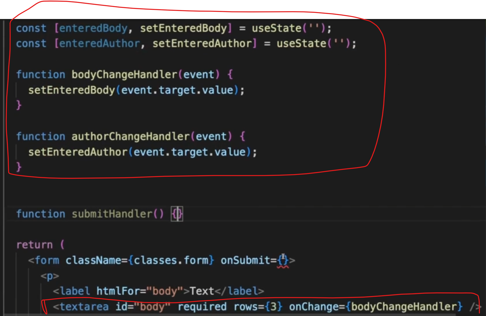
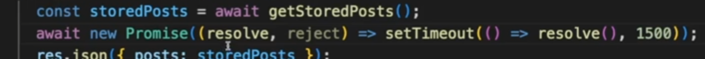
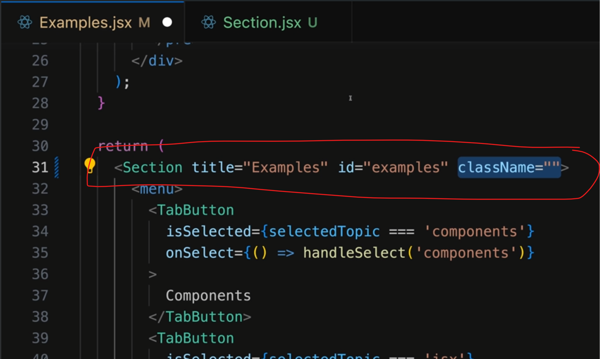
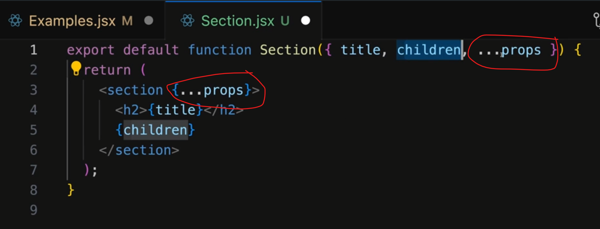
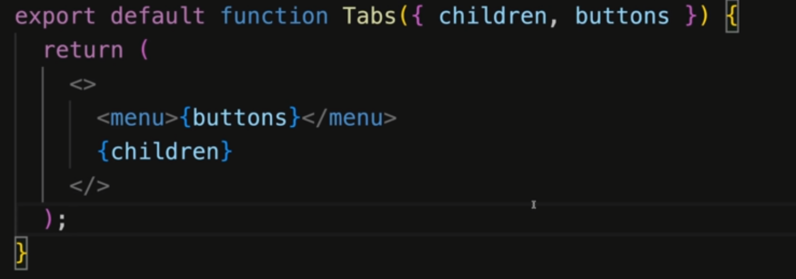
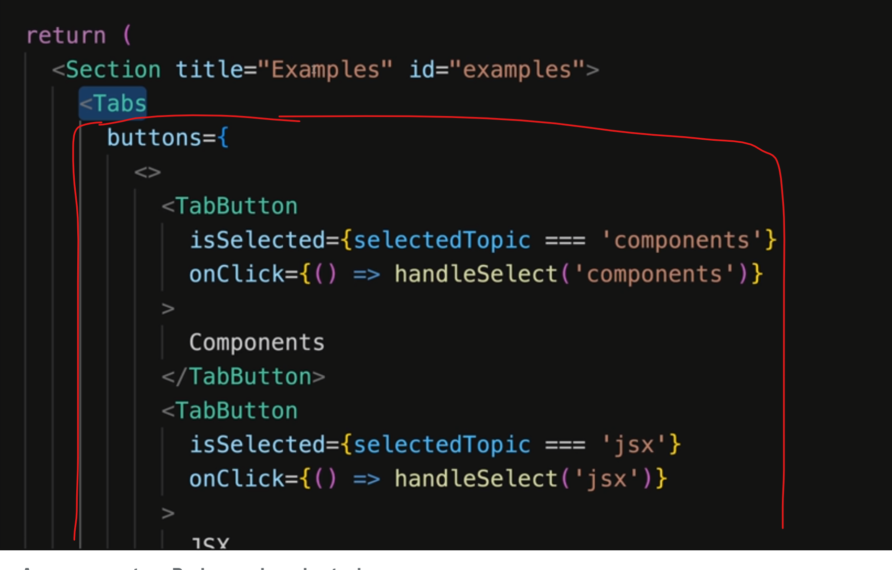
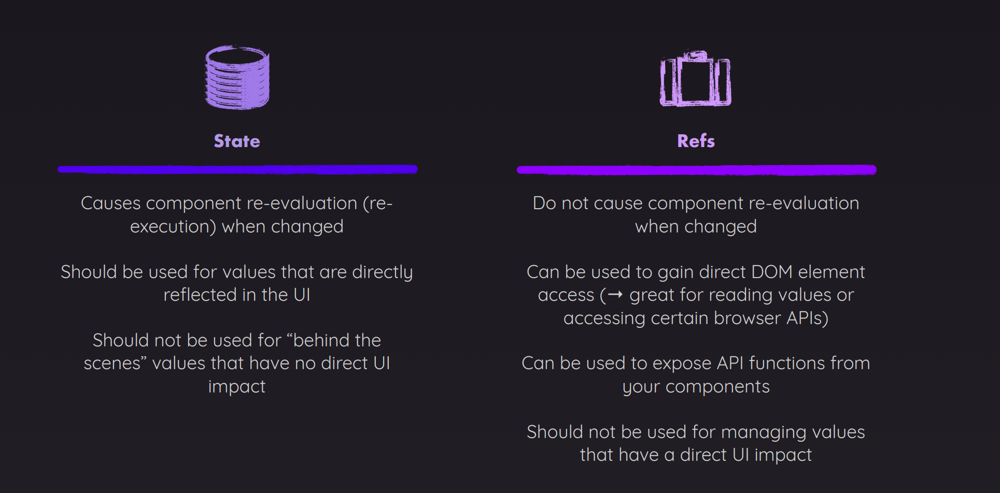

1. **Correct way to update array if we are using existing value ?**


When multiple states are parallely then we might get stale date we don't do
things like this.
Resource: https://www.udemy.com/course/nextjs-react-the-complete-guide/learn/lecture/41161580#questions

2. **Form**


3. Storing input box value


4. Post data to backend


5. Correct way to fetch data


* We should not use `fetchPosts()` directly without `useEffect` since end up in infinite loop
as `fetchPosts()` will update state and hence triggering `PostsList` component
to re-render which will happen in loop
* Also we can't turn `useEffect` function to `async` function, so we create `fetchPosts` function
instead

6. Delay function


7. Router


8. Better `props` syntax for many variable


9. Forwarding props



10. Multiple JSX slots


Resource: https://www.udemy.com/course/react-the-complete-guide-incl-redux/learn/lecture/39659754#overview

11. Right way to update 2-D array


12. `useRef`
```jsx
export default function Player() {
    const [enteredPlayerName, setEnteredPlayerName] = useState(null);
    const [submitted, setSubmitted] = useState(false);

    function handleChange(event) {
        setSubmitted(false);
        setEnteredPlayerName(event.target.value);
    }

    function handleClick() {
        setSubmitted(true);
    }

    return (
        <section id="player">
            <h2>Welcome {submitted ? enteredPlayerName : 'unknown entity'}</h2>
            <p>
                <input type="text" onChange={handleChange} value={enteredPlayerName} />
                <button onClick={handleClick}>Set Name</button>
            </p>
        </section>
    );
}
```
We can use `useRef` instead of two-way binding like above if we just 
want to read value
```jsx
export default function Player() {
    const playerName = useRef();

    const [enteredPlayerName, setEnteredPlayerName] = useState(null);

    function handleClick() {
        setEnteredPlayerName(playerName.current.value);
    }

    return (
        <section id="player">
            <h2>Welcome {enteredPlayerName ?? 'unknown entity'}</h2>
            <p>
                <input
                    ref={playerName}
                    type="text"
                />
                <button onClick={handleClick}>Set Name</button>
            </p>
        </section>
    );
}
```
Note: Don't try to overuse `useRef` to manipulate DOM as it is not
a good practice and we want React to handle DOM so that it remains Declarative 
code

1. `useRef` have good usecase when we don't want to change/handle
the DOM, but any variable state in function
2. `useRef` does not re render the component when they are updated
```jsx
/* We avoid using variable like this for controlling 
value, since this variable shared between all components
that are made by this component. useRef is has better usecase
 */
// let timer;

export default function TimerChallenge({ title, targetTime }) {
    const timer = useRef();

    const [timerStarted, setTimerStarted] = useState(false);
    const [timerExpired, setTimerExpired] = useState(false);

    function handleStart() {
        timer.current = setTimeout(() => {
            setTimerExpired(true);
        }, targetTime * 1000);

        setTimerStarted(true);
    }

    function handleStop() {
        clearTimeout(timer.current);
    }

    return (
        <section className="challenge">
            <h2>{title}</h2>
            {timerExpired && <p>You lost!</p>}
            <p className="challenge-time">
                {targetTime} second{targetTime > 1 ? 's' : ''}
            </p>
            <p>
                <button onClick={timerStarted ? handleStop : handleStart}>
                    {timerStarted ? 'Stop' : 'Start'} Challenge
                </button>
            </p>
            <p className={timerStarted ? 'active' : undefined}>
                {timerStarted ? 'Time is running...' : 'Timer inactive'}
            </p>
        </section>
    );
}

```
Referred video: https://www.udemy.com/course/react-the-complete-guide-incl-redux/learn/lecture/39836346#overview
