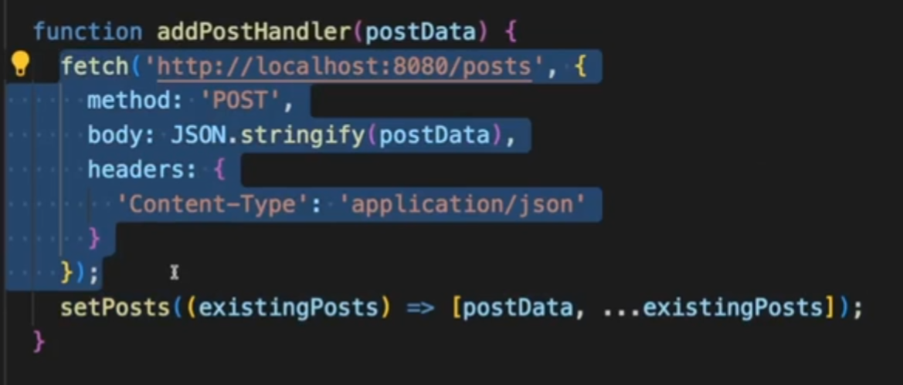
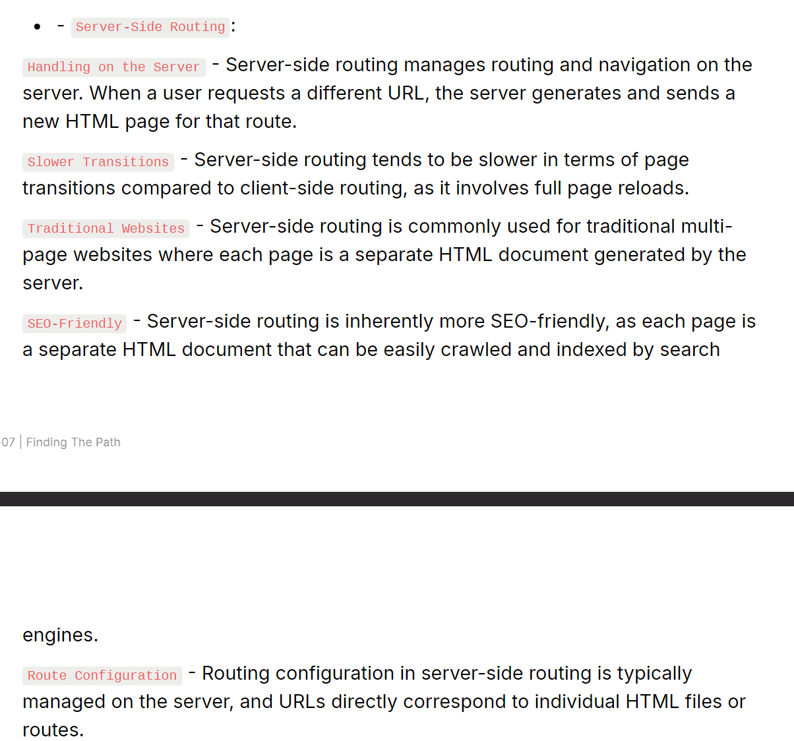
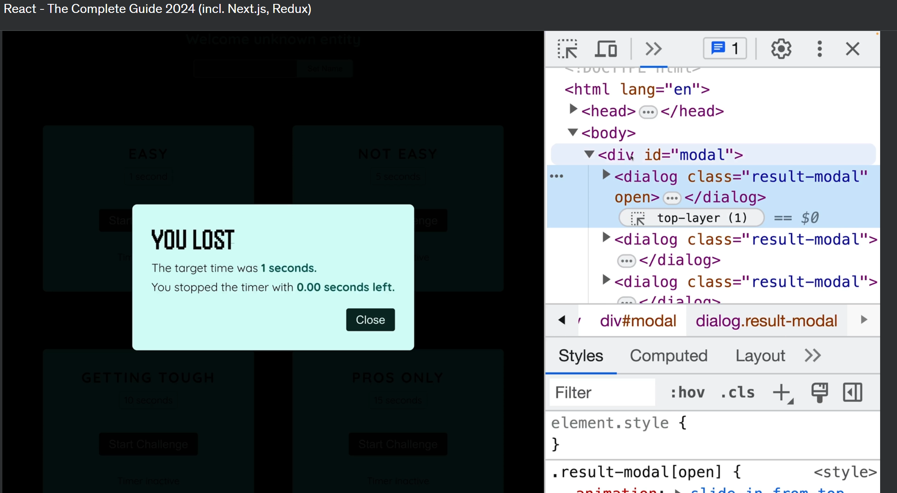
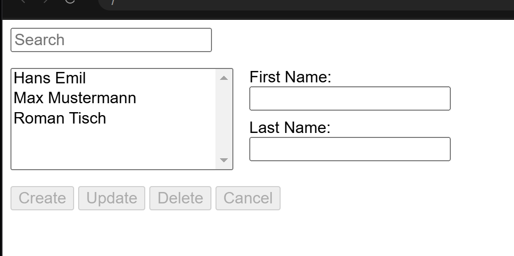

<details >
 <summary style="font-size: x-large; font-weight: bold">Basic Concepts</summary>

Quick Speed Run: https://learnweb3.io/degrees/ethereum-developer-degree/sophomore/intro-to-react-and-next-js/

For generating random Id: `crypto.randomUUID()` directly present in browser
<details >
 <summary style="font-size: large; font-weight: bold">Input Fields</summary>

```js
import React, { useState } from 'react';
import {Handle, Position} from "reactflow";
import validateTextUtil from "../../utils/validate-text.util";
import {extractVariables, isValidVariableName} from "../../utils/valid-variable-helper.util";
import {useStore} from "../../store";
import classes from "./templateNode.module.css";
import Icon from "../icon";


const TemplateNode = ({ label,icon, id, config, inputHandles=[], outputHandles=[] }) => {
    const [handles, setHandles] = useState({'input': true});
    const [textAreaHeight, setTextAreaHeight] = useState(0);
    const [errors, setErrors] = useState({});
    const updateNodeField = useStore((state) => state.updateNodeField);
    const setSelectedNode = useStore((state) => state.setSelectedNode);
    const selectedNodeId = useStore((state) => state.selectedNodeId);

    const [formValues, setFormValues] = useState(() =>
        config.reduce((acc, field) => {
            acc[field.name] = field.value || '';
            return acc;
        }, {})
    );


    const handleNodeSelect = (id) => {
        setSelectedNode(id);
    };
    const handleChange = (e, fieldName) => {
        const newValues = {
            ...formValues,
            [fieldName]: e.target.value,
        };
        setFormValues(newValues);
        updateNodeField(id, fieldName, e.target.value)
    };

    const handleTextChange = (e, fieldName, rules) => {
        handleChange(e, fieldName);

        const error = validateTextUtil(e.target.value, rules);
        setErrors({
            ...errors,
            [fieldName]: error,
        });
    }
    const handleTextareaChange = (e, fieldName) => {
        const textarea = e.target;
        textarea.style.height = 'auto'; // Reset the height
        textarea.style.height = `${textarea.scrollHeight}px`; // Set it to the scroll height
        setTextAreaHeight(textarea.scrollHeight);

        handleChange(e, fieldName);

        updateHandle(textarea.value);
    };

    const handleCheckboxChange = (e, fieldName) => {
        const value = e.target.value;
        setFormValues((prevValues) => {
            const currentValues = prevValues[fieldName] || [];
            if (e.target.checked) {
                return {
                    ...prevValues,
                    [fieldName]: [...currentValues, value],
                };
            } else {
                return {
                    ...prevValues,
                    [fieldName]: currentValues.filter((item) => item !== value),
                };
            }
        });
    };


    const updateHandle = (value) => {
        const newHandles = extractVariables(value).reduce((acc, variable) => {
            if (isValidVariableName(variable)) {
                acc[variable] = true;
            }
            return acc;
        }, {});

        setHandles((prevHandles) => {
            const updatedHandles = { ...prevHandles };
            Object.keys(prevHandles).forEach((key) => {
                if (!newHandles[key]) {
                    delete updatedHandles[key];
                }
            });
            Object.keys(newHandles).forEach((key) => {
                if (!prevHandles[key]) {
                    updatedHandles[key] = true;
                }
            });
            return updatedHandles;
        });
    }


    const renderField = (field) => {

        const rules = field.validation || {};

        switch (field.type) {
            case 'text':
                return (
                    <div key={field.name} className={classes["node__fields__field"]}>
                        <label htmlFor={field.label}>{field.label}</label>
                        <input
                            type="text"
                            value={formValues[field.name]}
                            onChange={(e) => handleTextChange(e, field.name, rules)}
                            id={field.label}
                        />
                        {errors[field.name] && <span style={{ color: 'red' }}>{errors[field.name]}</span>}
                    </div>
                );
            case 'textArea':
                return (
                    <div key={field.name} className={classes["node__fields__field"]}>
                        <label htmlFor={field.label}>{field.label}</label>
                        <textarea
                            value={formValues[field.name]}
                            onChange={(e) => handleTextareaChange(e, field.name)}
                            id={field.label}
                            style={{ width: '90%', overflow: 'auto', resize: 'none', maxHeight: '300px' }}
                        />
                        {Object.keys(handles).map((variable, index) => (
                            <Handle
                                key={variable}
                                type="source"
                                position={Position.Left}
                                id={`${field.name}-${variable}`}
                                style={{top: `${((textAreaHeight+100)  / (Object.keys(handles).length + 1)) * (index + 1)}px`, left: '-2.5%', height: '15px', width: '15px',border: '2px solid #2a2de1', background: 'white'}}
                            />
                        ))}
                    </div>
                );
            case 'select':
                return (
                    <div key={field.name} className={classes["node__fields__field"]}>
                        <label htmlFor={field.label}>{field.label}</label>
                        <select
                            value={formValues[field.name]}
                            onChange={(e) => handleChange(e, field.name)}
                            id={field.label}
                        >
                            {field.options.map((option) => (
                                <option key={option.value} value={option.value}>
                                    {option.label}
                                </option>
                            ))}
                        </select>
                    </div>
                );
            case 'radio':
                return (
                    <div key={field.name} className={classes["node__fields__field"]}>
                        <label>{field.label}</label>
                        {field.options.map((option) => (
                            <div className={classes["node__fields__field-radio"]}>
                                <input
                                    type="radio"
                                    name={field.name}
                                    id={field.name}
                                    value={option.value}
                                    checked={formValues[field.name] === option.value}
                                    onChange={(e) => handleChange(e, field.name)}
                                />
                                <label
                                    key={option.value}
                                    form={field.name}
                                    htmlFor={field.name}
                                >{option.label}
                                </label>
                            </div>
                        ))}
                    </div>
                );
            case 'checkbox':
                return (
                    <div key={field.name} className={classes["node__fields__field"]}>
                        <label>{field.label}</label>
                        {field.options.map((option) => (
                            <div className={classes["node__fields__field-checkbox"]}>
                                <input
                                    type="checkbox"
                                    name={field.name}
                                    id={`${field.name}-${option.value}`}
                                    value={option.value}
                                    checked={formValues[field.name]?.includes(option.value)}
                                    onChange={(e) => handleCheckboxChange(e, field.name)}
                                />
                                <label
                                    key={option.value}
                                    htmlFor={`${field.name}-${option.value}`}
                                >
                                    {option.label}
                                </label>
                            </div>
                        ))}
                    </div>
                );
            default:
                return (
                    <div key={field.name} className={classes["node__fields__field"]}>
                        <div>
                            <span>{formValues[field.name]}</span>
                        </div>
                    </div>
                );
        }
    };

    return (
        <div
            className={`${classes["node"]} ${selectedNodeId === id ? classes["selected"] : ''}`}
            onClick={() => handleNodeSelect(id)}
        >
            <div
                className={classes["node__header"]}
                style={{color: selectedNodeId === id ? '#585bef':'' }}
            >
                <Icon d={icon} color={selectedNodeId === id ? '#585bef':'#7d838e' }  size={"1em"}/>
                {label}
            </div>
            <form className={classes["node__fields"]}>{config.map(renderField)}</form>
            {inputHandles.map((inputHandle, index) => (
                <Handle
                    key={index}
                    type="target"
                    position={Position.Left}
                    id={`${id}-${inputHandle.type}`}
                    style={{top: `${(index + 1) * 50 / inputHandles.length}%`, left: '-2.5%', height: '15px', width: '15px',border: '2px solid #2a2de1', background: 'white'}}
                    className={classes["node-handle"]}
                />
            ))}
            {outputHandles.map((outputHandle, index) => (
                <Handle
                    key={index}
                    type="source"
                    position={Position.Right}
                    id={`${id}-${outputHandle.type}`}
                    style={{top: `${(index + 1) * 50 / outputHandles.length}%`, left: '97.5%', height: '15px', width: '15px',border: '2px solid #2a2de1', background: 'white'}}
                    className={classes["node-handle"]}
                />
            ))}
        </div>
    )
}

export default TemplateNode;
```

---
</details>


<details >
 <summary style="font-size: large; font-weight: bold">Conditional Rendering</summary>

<details >
 <summary style="font-size: medium; font-weight: bold">Conditional HTML</summary>

```js
function App() {
	const isAuthUser = useAuth();

  if (isAuthUser) {
    // if our user is authenticated, let them use the app
    return <AuthApp />;
  }

  // if user is not authenticated, show a different screen
  return <UnAuthApp />;
}
```


```js
function App() {
	const isAuthUser = useAuth();

  return (
    <>
      <h1>My App</h1>
      {isAuthUser ? <AuthApp /> : <UnAuthApp />}
    </>
  ) 
}
```

---
</details>

<details >
 <summary style="font-size: medium; font-weight: bold">Conditional Styling</summary>

1. **Class**
```js
<div
    className={`step ${
        currentStep > index + 1 || isComplete ? "complete" : ""
    } ${currentStep === index + 1 ? "active" : ""} `}
>
```

Use `.module.css` so that class name does not have any name conflict
```js
import classes from './filter-modal.component.module.css';

<div
    className={classes["modal__main__list__item-val__icon"]}
>
```

2. **Style**
### `style` takes `object`. The First curly bracket is for writing JS in JSX, and the second is object of styling where all `keys` are `camelCased`, and `values` are in `string`.

We can write conditional styling in below two ways
```js
<div
    style={selectedSecondaryItem?.inputType === InputType.CHECKBOX ? {borderRadius: "5px"} : {"borderRadius": "50%"}}
>
```

```js
<div
    style={{transform: startTransition ? "scaleX(1)" : "scaleX(0)"}}
>
```

---
</details>

---
</details>


<details >
 <summary style="font-size: large; font-weight: bold">Hooks</summary>

- Always define hooks at top of the component
- Never define inside any other function, if...else , loops or any block of code
- It's simply a regular JavaScript function. However, it becomes powerful 
when used within React, as it's provided to us by React itself. 
These pre-built functions have underlying logic developed by React developers. 
When we install React via npm, wegain access to these superpowers


<details >
 <summary style="font-size: medium; font-weight: bold">useState()</summary>

❌Wrong way to update state variable in `setInterval`
```js
const [currentImageNo, setCurrentImageNo] = useState(0);

useEffect(() => {
    setInterval(() => {
        setCurrentImageNo((currentImageNo + 1) % totalImage);
    },5000)
})
```

✅Right way to update state variable in `setInterval`
```js
const [currentImageNo, setCurrentImageNo] = useState(0);

useEffect(() => {
    setInterval(() => {
        setCurrentImageNo(prevImageNo => (prevImageNo + 1) % totalImage);
    },5000)
})
```
In React, state updates inside a function use the state at the time the function was created.
This means that the `currentImageNo` in your setInterval callback will always be `0` because
it doesn't get the latest value from React's state.


https://react.dev/reference/react/useState#updating-state-based-on-the-previous-state

### Updating Objects in State

- Treat all state in React as immutable.
- When you store objects in state, mutating them will not trigger renders and will change the state in previous render “snapshots”.
- Instead of mutating an object, create a new version of it, and trigger a re-render by setting state to it.
- You can use the {...obj, something: 'newValue'} object spread syntax to create copies of objects.
- Spread syntax is shallow: it only copies one level deep.
- To update a nested object, you need to create copies all the way up from the place you’re updating.
- To reduce repetitive copying code, use Immer.

https://react.dev/learn/updating-objects-in-state


## Queueing a Series of State Updates

```jsx
<button onClick={() => {
  setNumber(number + 5);
  setNumber(n => n + 1);
  setNumber(42);
}}>
```


- Setting state does not change the variable in the existing render, but it requests a new render.
- React processes state updates after event handlers have finished running. This is called `Batching`.
- To update some state multiple times in one event, you can use `setNumber(n => n + 1)` `Updater function`.

- After the event handler completes, React will trigger a re-render. 
During the re-render, React will process the queue. `Updater` functions run during rendering, so `updater` functions must be `pure` and only return the result. 
- **Don’t try to set state from inside of them or run other side effects.** 
- In Strict Mode, React will run each updater function twice (but discard the second result) to help you find mistakes.


https://react.dev/learn/queueing-a-series-of-state-updates
<details >
 <summary style="font-size: small; font-weight: bold">Important Example to go deep for above concept</summary>

Question: https://www.greatfrontend.com/questions/user-interface/grid-lights/v/e1b65101-e094-410b-8a43-63f32bcad8db

Below are two code and their logs, explain why logs are different even though logic for removing element from 'order' array is same

#### Code:1
````jsx
import { useState } from 'react';


export default function App() {
  const [order, setOrder] = useState([]);

  function updateCount (boxNo) {
    setOrder((prevOrder) => {
      const temp = [...prevOrder];
      temp.push(boxNo);

      if(temp.length === 8)
        deactivateCells();

      return temp;
    })
  }

  function deactivateCells () {
    const timer = setInterval(() => {
      // Use the callback version of setOrder to ensure
      // we are reading the most updated order value.
      setOrder((origOrder) => {
        // Make a clone to avoid mutation of the orders array.
        const newOrder = origOrder.slice();
        newOrder.pop();

        console.log("newOrder : ", newOrder);

        if (newOrder.length === 0) {
          clearInterval(timer);
        }

        return newOrder;
      });
    }, 300);
  }

  return (
    <div className="main">
      <div className="row">
        <div 
          className="box"
          style={{background: order.includes(0) ? 'green' : ''}}
          onClick={() => updateCount(0)}
        ></div>
        <div 
          className="box"
          style={{background: order.includes(1) ? 'green' : ''}}
          onClick={() => updateCount(1)}
        ></div>
        <div 
          className="box"
          style={{background: order.includes(2) ? 'green' : ''}}
          onClick={() => updateCount(2)}
        ></div>
      </div>
      <div className="mid">
        <div 
          className="box"
          style={{background: order.includes(3) ? 'green' : ''}}
          onClick={() => updateCount(3)}
        ></div>
        <div 
          className="box"
          style={{background: order.includes(5) ? 'green' : ''}}
          onClick={() => updateCount(5)}
        ></div>
      </div>
      <div className="row">
       <div 
          className="box"
          style={{background: order.includes(6) ? 'green' : ''}}
          onClick={() => updateCount(6)}
        ></div>
        <div 
          className="box"
          style={{background: order.includes(7) ? 'green' : ''}}
          onClick={() => updateCount(7)}
        ></div>
        <div 
          className="box"
          style={{background: order.includes(8) ? 'green' : ''}}
          onClick={() => updateCount(8)}
        ></div>
      </div>
    </div>
  );
}
````

#### Log-1:
```html
newOrder :  (7) [0, 1, 2, 5, 8, 7, 6]
App.js:28 newOrder :  (6) [0, 1, 2, 5, 8, 7]
App.js:28 newOrder :  (7) [0, 1, 2, 5, 8, 7, 6]
App.js:28 newOrder :  (6) [0, 1, 2, 5, 8, 7]
App.js:28 newOrder :  (5) [0, 1, 2, 5, 8]
App.js:28 newOrder :  (4) [0, 1, 2, 5]
App.js:28 newOrder :  (5) [0, 1, 2, 5, 8]
App.js:28 newOrder :  (4) [0, 1, 2, 5]
App.js:28 newOrder :  (3) [0, 1, 2]
App.js:28 newOrder :  (2) [0, 1]
App.js:28 newOrder :  (3) [0, 1, 2]
App.js:28 newOrder :  (2) [0, 1]
App.js:28 newOrder :  [0]
App.js:28 newOrder :  []
App.js:28 newOrder :  [0]
App.js:28 newOrder :  []
App.js:28 newOrder :  []
App.js:28 newOrder :  []
```


#### Code-2:

```jsx
import { useState } from 'react';


export default function App() {
    const [order, setOrder] = useState([]);

    function updateCount (boxNo) {
        console.log("prevOrder : ", order);
        const temp = [...order, boxNo];
        setOrder(temp);

        if(temp.length === 8)
            deactivateCells();
    }

    /** If we use below function instead of above, we will see
     * two blocks getting earse at a time, which is not expected
     * behavior we are looking for
     */
    //  function updateCount (boxNo) {
    //   setOrder((prevOrder) => {
    //     console.log("prevOrder : ", prevOrder);
    //     const temp = [...prevOrder];
    //     temp.push(boxNo);

    //     if(temp.length === 8)
    //       deactivateCells();

    //     return temp;
    //   })
    // }

    function deactivateCells () {
        const timer = setInterval(() => {
            // Use the callback version of setOrder to ensure
            // we are reading the most updated order value.
            setOrder((origOrder) => {
                // Make a clone to avoid mutation of the orders array.
                const newOrder = origOrder.slice();
                newOrder.pop();

                console.log("newOrder : ", newOrder);

                if (newOrder.length === 0) {
                    clearInterval(timer);
                }

                return newOrder;
            });
        }, 300);
    }

    return (
        <div className="main">
            <div className="row">
                <button
                    className="box"
                    style={{background: order.includes(0) ? 'green' : ''}}
                    onClick={() => updateCount(0)}
                    disabled={order.includes(0) || order.length === 8}
                ></button>
                <button
                    className="box"
                    style={{background: order.includes(1) ? 'green' : ''}}
                    onClick={() => updateCount(1)}
                    disabled={order.includes(1) || order.length === 8}
                ></button>
                <button
                    className="box"
                    style={{background: order.includes(2) ? 'green' : ''}}
                    onClick={() => updateCount(2)}
                    disabled={order.includes(2) || order.length === 8}
                ></button>
            </div>
            <div className="mid">
                <button
                    className="box"
                    style={{background: order.includes(3) ? 'green' : ''}}
                    onClick={() => updateCount(3)}
                    disabled={order.includes(3) || order.length === 8}
                ></button>
                <button
                    className="box"
                    style={{background: order.includes(5) ? 'green' : ''}}
                    onClick={() => updateCount(5)}
                    disabled={order.includes(5) || order.length === 8}
                ></button>
            </div>
            <div className="row">
                <button
                    className="box"
                    style={{background: order.includes(6) ? 'green' : ''}}
                    onClick={() => updateCount(6)}
                    disabled={order.includes(6) || order.length === 8}
                ></button>
                <button
                    className="box"
                    style={{background: order.includes(7) ? 'green' : ''}}
                    onClick={() => updateCount(7)}
                    disabled={order.includes(7) || order.length === 8}
                ></button>
                <button
                    className="box"
                    style={{background: order.includes(8) ? 'green' : ''}}
                    onClick={() => updateCount(8)}
                    disabled={order.includes(8) || order.length === 8}
                ></button>
            </div>
        </div>
    );
}

```


#### Log-2:
```html
newOrder :  (7) [0, 1, 2, 5, 8, 7, 6]
App.js:47 newOrder :  (7) [0, 1, 2, 5, 8, 7, 6]
App.js:47 newOrder :  (6) [0, 1, 2, 5, 8, 7]
App.js:47 newOrder :  (6) [0, 1, 2, 5, 8, 7]
App.js:47 newOrder :  (5) [0, 1, 2, 5, 8]
App.js:47 newOrder :  (5) [0, 1, 2, 5, 8]
App.js:47 newOrder :  (4) [0, 1, 2, 5]
App.js:47 newOrder :  (4) [0, 1, 2, 5]
App.js:47 newOrder :  (3) [0, 1, 2]
App.js:47 newOrder :  (3) [0, 1, 2]
App.js:47 newOrder :  (2) [0, 1]
App.js:47 newOrder :  (2) [0, 1]
App.js:47 newOrder :  [0]
App.js:47 newOrder :  [0]
App.js:47 newOrder :  []
App.js:47 newOrder :  []
```

---
</details>

---
</details>

<details >
 <summary style="font-size: medium; font-weight: bold">useEffect()</summary>

1. No second argument
```js
import { useEffect } from 'react';

function MyComponent() {
   useEffect(() => {
     // perform side effect here
   });
}
```
Run on every render

2. Second argument with empty array
```js
function MyComponent() {
   useEffect(() => {
     // perform side effect here
   }, []);
}
```
Run only on an initial component load

3. Second argument with non-empty array with single
```js
function MyComponent() {
    const [count, setCount] = useState(0);
   useEffect(() => {
     // perform side effect here
   }, [count]);
}
```
Run on an initial component load and whenever value of `count` changes

4. Second argument with non-empty array with multiple values
```js
useEffect(() => {
  // Some code
}, [stateVar1, stateVar2, stateVar3, andSoOn]);
```
You can also similarly create side effects which are dependent on 
multiple state variables, not just one. Run on an initial component load and if any of the dependent variables 
change, the side effect is run. You do this by just adding more state 
variables to the dependency array.

### Returns

1. **Always write `clean logic` to prevent `memory leaks` and unexpected behavior like below**

```js
useEffect(() => {
    const timerId = setInterval(() => {}, 500)
    
    //Below will remove the setInterval when component unmounts
    return () => {
        clearInterval(timerId);
    }
   }, []);
```


2. 

### `useEffect(setup, dependencies?)`
Call useEffect at the top level of your component to declare an Effect:
```js
function ChatRoom({ roomId }) {
  console.log("Chat Room called");
  const [serverUrl, setServerUrl] = useState('https://localhost:1234');

  useEffect(() => {
    console.log("UseEffect called");
    const connection = createConnection(serverUrl, roomId);
    connection.connect();
    return () => {
        console.log("Return called");
        connection.disconnect();
    };
  }, [serverUrl, roomId]);
  // ...
}
```

Output when it loads for first time
```js
Chat Room called
UseEffect called
```
Output when there is change in `serverUrl`
```js
Chat Room called
Return called
UseEffect called
```
- `setup`: The function with your Effect’s logic. Your setup function may also optionally return a cleanup function.
- When your component is added to the DOM, React will run your setup function.
- After every re-render with changed dependencies, React will first run the cleanup function (if you provided it) with the old values, and then run your setup function with the new values.
- After your component is removed from the DOM, React will run your cleanup function.

https://react.dev/reference/react/useEffect#useeffect


### Common pitfalls

1. **Stale closures**:

    - If you use state or props inside the effect without including them in the dependency array, you might end up with stale values.
    - Always include all state and props that the effect depends on in the dependency array.

   ```javascript
   const [count, setCount] = useState(0);

   useEffect(() => {
     const handle = setInterval(() => {
       console.log(count); // This might log stale values if `count` is not in the dependency array
     }, 1000);

     return () => clearInterval(handle);
   }, [count]); // Ensure `count` is included in the dependency array
   ```

2. **Functions as dependencies**:

    - Functions are recreated on every render, so including them in the dependency array can cause the effect to run more often than necessary.
    - Use `useCallback` to memoize functions if they need to be included in the dependency array.

   ```javascript
   const handleClick = useCallback(() => {
     // Handle click
   }, []);

   useEffect(() => {
     // This effect will not re-run unnecessarily because `handleClick` is memoized
   }, [handleClick]);
   ```
https://www.greatfrontend.com/questions/quiz/what-does-the-dependency-array-of-useeffect-affect?practice=practice&tab=quiz


<details >
 <summary style="font-size: medium; font-weight: bold">Good Traffic Light Example for `setTimeout()` & `setInterval()`</summary>

https://www.greatfrontend.com/questions/user-interface/traffic-light/

```jsx
import { useState, useEffect, useRef } from 'react';


export default function TrafficLight() {
  const [activeColor, setActiveColor] = useState('green');
  const [duration, setDuration] = useState(3000);

/**Without useInterval hook */
  useEffect(() => {
    const intervalId = setInterval(() => {
    // This might log stale values if `activeColor` is not in the dependency array
    if(activeColor === 'green'){ 
      setActiveColor('yellow');
      setDuration(1000);
    }

    if(activeColor === 'yellow'){
      setActiveColor('red');
      setDuration(4000);
    }

    if(activeColor === 'red'){
      setActiveColor('green');
      setDuration(9000);
    }
    }, duration)

    return () => {
      clearInterval(intervalId); //always clear Interval
    }

  }, [activeColor]) // Ensure `activeColor` is included in the dependency array


  /*Using useInterval hook
  useInterval(() => {
    if(activeColor === 'green'){
      setActiveColor('yellow');
      setDuration(1000);
    }

    if(activeColor === 'yellow'){
      setActiveColor('red');
      setDuration(4000);
    }

    if(activeColor === 'red'){
      setActiveColor('green');
      setDuration(9000);
    }
    }, duration)
  */

  return (
    <div className="traffic">
      <div className="light" style={{background: activeColor === 'red' ? 'red' : 'grey'}}></div>
      <div className="light" style={{background: activeColor === 'yellow' ? 'yellow' : 'grey'}}></div>
      <div className="light" style={{background: activeColor === 'green' ? 'green' : 'grey'}}></div>
    </div>
  )
}


function useInterval(callback, delay) {
  const savedCallback = useRef();


  useEffect(() => {
    savedCallback.current = callback;
  }, [callback]);

  useEffect(() => {
    function tick() {
      savedCallback.current();
    }

    if(delay !== null){
      let id = setInterval(tick, delay);
      return () => clearInterval(id);
    }
  }, [delay]);
}
```

---
</details>

---
</details>

<details >
 <summary style="font-size: medium; font-weight: bold">useRef()</summary>

1. **No Re-Rendering**
Similar to `useState`, the `useRef` hook also allows us to store a variable in a component 
that can be updated over time. But, unlike state variables, updating the value of a ref 
variable does not cause the HTML view to re render.

    Therefore, if you had a `useRef` variable and you were displaying 
it's value in your HTML view, updating the variable will not update 
the HTML view.

```js
// Define a ref variable
const myNumber = useRef();
```

```js
// Access a ref variable
if (myNumber.current !== undefined) {
   ...
} 
```

```js
// Update a ref variable
myNumber.current = 1;
```

2. **Synchronous Updates**
Setting a new value for state variables happens asynchronously in React, 
which means if you try to use the state variable's value immediately after 
setting it to a new value, you might not actually see the new value being 
reflected as it happens asynchronously.


- When you run this, notice what happens on the view and what happens in the console. 
When you first click the button, the state variable should be updated to `1` - 
and that's what happens on the view, the web page displays `1`. But if you 
look at the browser console, the value `0` is printed instead of `1`. 
This pattern continues as you keep clicking the button.

- This is because the `setNumber` call runs asynchronously, and by the time 
we reach the `console.log(number)` line, the value hasn't been updated yet, 
so it prints the old value of number. When it does in fact gets updated, 
the HTML is re-rendered to display the new value.

- `useRef` on the other hand, allows for synchronous updates. When you update the 
value of a reference variable using `myVar.current = newValue` it is instantly updated, 
and there is no delay. This can come in handy sometimes.

3. **Referencing DOM Elements**

Another cool thing that `useRef` lets us do is that it allows us to refer directly to DOM elements.
This is something that is not possible with `useState`.

For example, you can reference an input element directly using `useRef`


When you run this above example, you will notice that as soon as the page loads, 
the `input` element is already in focus i.e. you can start typing without clicking on it first.
This is because we hold a reference to the `input` element, and have a `useEffect` 
that runs on page load due to having an empty dependency array, that focuses on 
the `input` element.

---
</details>


---
</details>


<details >
 <summary style="font-size: large; font-weight: bold">API Calls</summary>

### 1. Get call


### 2. Post call


### Handling errors

It's important to handle errors that may occur during data fetching. You can use a `try-catch` block within the `useEffect` to catch and handle errors.

```javascript
useEffect(() => {
  async function fetchData() {
    try {
      const response = await fetch('https://api.example.com/data');
      const result = await response.json();
      setData(result);
    } catch (error) {
      console.error('Error fetching data:', error);
    } finally {
      setLoading(false);
    }
  }

  fetchData();
}, []);
```

### Using custom hooks

For better code reusability, you can create custom hooks to handle data fetching. This allows you to encapsulate the data fetching logic and reuse it across multiple components.

```javascript
import { useState, useEffect } from 'react';

function useFetch(url) {
  const [data, setData] = useState(null);
  const [loading, setLoading] = useState(true);
  const [error, setError] = useState(null);

  useEffect(() => {
    async function fetchData() {
      try {
        const response = await fetch(url);
        const result = await response.json();
        setData(result);
      } catch (error) {
        setError(error);
      } finally {
        setLoading(false);
      }
    }

    fetchData();
  }, [url]);

  return { data, loading, error };
}

export default useFetch;
```

You can then use this custom hook in your components:

```javascript
import React from 'react';
import useFetch from './useFetch';

function DataFetchingComponent() {
  const { data, loading, error } = useFetch('https://api.example.com/data');

  if (loading) {
    return <div>Loading...</div>;
  }

  if (error) {
    return <div>Error: {error.message}</div>;
  }

  return <div>{JSON.stringify(data)}</div>;
}
```

https://www.greatfrontend.com/questions/quiz/how-do-you-handle-asynchronous-data-loading-in-react-applications?practice=practice&tab=quiz

---
</details>


---
</details>


<details >
 <summary style="font-size: x-large; font-weight: bold">Important Concepts</summary>

- [React Intro](./namaste-react/1-Inception⭐.pdf) 
- [Bundler(Parcel)](./namaste-react/2-igniting-our-app⭐.pdf)
- [JSX & Babel](./namaste-react/3-laying-the-foundation⭐.pdf)
<details >
 <summary style="font-size: large; font-weight: bold">Virtual DOM</summary>

Virtual / Actual DOM, Diffing Algorithm, Reconciliation Cycle, React Fiber, UI / Data Layer

1.
- The crucial point about `State variables` is that whenever they update
  React triggers a `reconciliation cycle` and re-renders the component.
- This means that as soon as the `data layer` changes,React promptly updates the `UI layer`.
  The `data layer` is always kept **in sync** with the `UI layer`.
- To achieve this rapid operation, React employs a reconciliation algorithm, also known
  as the **_diffing algorithm_** or **_React-Fibre_** which we will delve into further below

2. _But how does it all work behind the scenes?_
   When you create elements in React, you're actually creating virtual DOM objects.
   These virtual replicas are synced with the real DOM, a process known as "Reconciliation" or
   the React"diffing" algorithm.Essentially, every rendering cycle compares the new UI
   blueprint(updated VDOM) with the old one (previous VDOM) and makes precise changes
   to the actual DOM accordingly.It's important to understand these fundamentals in order
   to unlock a world of possibilities for front-end developers!


3. **React Fiber** is a complete rewrite of **React's reconciliation** algorithm, introduced in React 16. It improves the rendering process by **breaking down rendering work into smaller units**, **allowing React to pause and resume work**, which makes the UI more responsive. This approach enables features like time slicing and suspense, which were not possible with the previous stack-based algorithm.

4. _Do you want to understand and dive deep into it?_
   Take a look at this awesome React Fiber architecture repository
   on the web: https://github.com/acdlite/react-fiber-architecture

5. Reconciliation Cycle: https://www.greatfrontend.com/questions/quiz/what-is-reconciliation-in-react?format=quiz

<details >
 <summary style="font-size: small; font-weight: bold">React Fiber</summary>


What is React Fiber and how is it an improvement over the previous approach?

## What is React Fiber and how is it an improvement over the previous approach?

### Introduction to React Fiber

React Fiber is a reimplementation of React's core algorithm for rendering and reconciliation. It was introduced in React 16 to address limitations in the previous stack-based algorithm. The primary goal of Fiber is to enable incremental rendering of the virtual DOM, which allows React to split rendering work into chunks and spread it out over multiple frames.

### Key improvements over the previous approach

#### Incremental rendering

The previous stack-based algorithm processed updates in a single, synchronous pass, which could lead to performance issues, especially with complex UIs. React Fiber breaks down rendering work into smaller units called "fibers," allowing React to pause and resume work. This makes the UI more responsive and prevents blocking the main thread for long periods.

#### Time slicing

React Fiber introduces the concept of time slicing, which allows React to prioritize updates based on their urgency. For example, user interactions like clicks and key presses can be prioritized over less critical updates. This ensures that the UI remains responsive even during heavy rendering tasks.

#### Concurrency

With Fiber, React can work on multiple tasks concurrently. This means that React can start rendering updates while still processing other tasks, leading to a smoother and more responsive user experience.

#### Error boundaries

React Fiber introduced error boundaries, which allow developers to catch and handle errors in the component tree gracefully. This was not possible with the previous stack-based algorithm, where errors could cause the entire application to crash.

#### Improved support for animations

Fiber's incremental rendering and time slicing capabilities make it easier to implement smooth animations and transitions. React can now prioritize animation frames and ensure that they are rendered in a timely manner, leading to a better user experience.

### Code example

Here's a simple example to illustrate how React Fiber improves rendering performance:

```jsx
class MyComponent extends React.Component {
  state = {
    items: Array.from({ length: 10000 }, (_, i) => i)
  };

  render() {
    return (
      <div>
        {this.state.items.map(item => (
          <div key={item}>{item}</div>
        ))}
      </div>
    );
  }
}
```

With the previous stack-based algorithm, rendering this component could cause the UI to freeze. With React Fiber, the rendering work is broken down into smaller units, allowing React to pause and resume work, keeping the UI responsive.

Referred: https://www.greatfrontend.com/questions/quiz/what-is-react-fiber-and-how-is-it-an-improvement-over-the-previous-approach?format=quiz

---
</details>

<details >
 <summary style="font-size: small; font-weight: bold">Why not to use index as key in React Lists</summary>

Suppose we've a list of elements, with key attribute as index.

```html
<ul>
  <li key=1>Milk</li>
  <li key=2>Eggs</li>
  <li key=3>Bread</li>
</ul>
```

Now, in case of any state change in the list, React just iterates over each list item in both the lists (React compares the Virtual DOM snapshot before the update and after the update), looks for changes and finally updates the RealDOM with only those changes.

If we add an item to the end of the list, React no longer needs to re-render the first 3 list items which are same. It will just add a new list item at the end.

```html
<ul>
  <li key=1>Milk</li>
  <li key=2>Eggs</li>
  <li key=3>Bread</li>
  <li key=4>Butter</li>
</ul>
```
But suppose we add the new item at the beginning of the list.

```html
<ul>
  <li key="1">Butter</li>
  <li key="2">Milk</li>
  <li key="3">Eggs</li>
  <li key="4">Bread</li>
</ul>
```

Now, the key of remaining list items also changes, which makes React re-render all the elements again, instead of just adding a new item at the end.

This can be avoided if we use some unique id as a key rather than index.
Let's again consider the same previous example but this time by using a unique id as key.
```html
<ul>
  <li key="12abc">Milk</li>
  <li key="23bcd">Eggs</li>
  <li key="34cde">Bread</li>
</ul>
```
Now even if we add element to the beginning or the end, we won't face an issue since keys are different.

---
</details>

---
</details>


<details >
 <summary style="font-size: large; font-weight: bold">Client side Routing v/s Server Side Routing</summary>

#### Client Side Routing


#### Server Side Routing


---
</details>


<details >
 <summary style="font-size: large; font-weight: bold">Lazy Loading</summary>

Also called
- Chunking
- Code Splitting
- Dynamic Bundling
- On Demand loading

1. Whenever we want to load a component based on our demand like clicking a button or link 
we `Lazy` load such components.
2. It help to reduce the bundle size, as on initial load there is nothing loaded from that component
hence bundle size is reduced
3. When demand for that component we that component and same can be verified in dev tools
where we can see under `JS` section one new `js` was added

```js
const Grocery = () => {
  return (
    <h1>
      {" "}
      Our grocery online store, and we have a lot of child components inside
      this web page!!!
    </h1>
  );
};

export default Grocery;
```

```js
// App.js

import React, { lazy, Suspense, useEffect, useState } from "react";
import ReactDOM from "react-dom/client";
import Header from "./components/Header";
import Body from "./components/Body";
//import About from "./components/About";
import Contact from "./components/Contact";
import Error from "./components/Error";
import RestaurantMenu from "./components/RestaurantMenu";
import { createBrowserRouter, RouterProvider, Outlet } from "react-router-dom";
import UserContext from "./utils/UserContext";
import { Provider } from "react-redux";
import appStore from "./utils/appStore";
import Cart from "./components/Cart";

const Grocery = lazy(() => import("./components/Grocery"));

const About = lazy(() => import("./components/About"));

const AppLayout = () => {
    const [userName, setUserName] = useState();

    //authentication
    useEffect(() => {
        // Make an API call and send username and password
        const data = {
            name: "Akshay Saini",
        };
        setUserName(data.name);
    }, []);

    return (
        <Provider store={appStore}>
            <UserContext.Provider value={{ loggedInUser: userName, setUserName }}>
                <div className="app">
                    <Header />
                    <Outlet />
                </div>
            </UserContext.Provider>
        </Provider>
    );
};

const appRouter = createBrowserRouter([
    {
        path: "/",
        element: <AppLayout />,
        children: [
            {
                path: "/",
                element: <Body />,
            },
            {
                path: "/about",
                element: (
                    <Suspense fallback={<h1>Loading....</h1>}>
                        <About />
                    </Suspense>
                ),
            },
            {
                path: "/contact",
                element: <Contact />,
            },
            {
                path: "/grocery",
                element: (
                    <Suspense fallback={<h1>Loading....</h1>}>
                        <Grocery />
                    </Suspense>
                ),
            },
            {
                path: "/restaurants/:resId",
                element: <RestaurantMenu />,
            },
            {
                path: "/cart",
                element: <Cart />,
            },
        ],
        errorElement: <Error />,
    },
]);

const root = ReactDOM.createRoot(document.getElementById("root"));

root.render(<RouterProvider router={appRouter} />);
```

Here we are using `Suspense` because as soon as we try to visit `Grocery` component, 
there is a chance that it will take some time to load, hence we are using `Suspense`
to show loading indicator.

#### Suspense
In React, Suspense is a feature that allows us to declaratively manage asynchronous 
data fetching and code-splitting in our applications. It is primarily used in combination
with the lazy()function for dynamic imports and with the React.lazy()component to 
improve the user experience when loading data or components asynchronously

### Code-splitting Pattern

#### Advantage
- faster initial load time
- Improved performance
- Optimized resource usage
- Enhanced Caching:  Smaller bundles can benefit from browser caching. 
Since they are less likely to change frequently, browsers can cache
them, resulting in faster subsequent visits for returning users.
- Simpler maintenance
- Better mobile performance:  On mobile devices with limited bandwidth and processing power, code splitting can significantly enhance the user experience


#### Disadvantage
- Complex configuration
- Initial load time is longer
- Tool and framework support
- Testing complexity

Refer Namaste notes for more details


### Code Splitting in Non-Route based

In React, code-splitting is typically associated with route-based splits using libraries like `react-router`. However, you can also achieve code-splitting when specific UI components are needed, like when a button is clicked, by using React's `lazy()` and `Suspense`.

Here's an example of how to implement code-splitting on a button click:

### 1. Main component (e.g. `App.js`)
```jsx
import React, { useState, Suspense } from 'react';

// Use React.lazy to dynamically import the component
const LazyComponent = React.lazy(() => import('./LazyComponent'));

function App() {
  const [showComponent, setShowComponent] = useState(false);

  const handleClick = () => {
    setShowComponent(true);
  };

  return (
    <div>
      <h1>Code Splitting Example</h1>
      <button onClick={handleClick}>Load Component</button>

      {showComponent && (
        <Suspense fallback={<div>Loading...</div>}>
          <LazyComponent />
        </Suspense>
      )}
    </div>
  );
}

export default App;
```

### 2. Lazy-loaded component (e.g. `LazyComponent.js`)
```jsx
import React from 'react';

function LazyComponent() {
  return (
    <div>
      <h2>This is a lazily loaded component!</h2>
    </div>
  );
}

export default LazyComponent;
```

### How it works:
1. `React.lazy()` is used to dynamically import `LazyComponent`.
2. `Suspense` handles the rendering of a fallback UI (like a loading spinner) while the lazy component is being loaded.
3. When the button is clicked, the `showComponent` state is set to `true`, and the lazy-loaded component is displayed.

This method ensures that the `LazyComponent` is only loaded when needed, reducing the initial bundle size.

GFE Blog: https://www.greatfrontend.com/blog/code-splitting-and-lazy-loading-in-react

---
</details>


<details>
 <summary style="font-size: large; font-weight: bold">Portals & `forwardRef`</summary>


### 1. Portals
Portals are very useful when we want to render a component, somewhere 
than where it actually defined.

Here is example of modal where we want to render it at `body` rather than in its parent
we use Portal to render it in `body` by defining second argument as `document.body

```jsx
//App.jsx

import { useState } from 'react';
import ModalDialog from './ModalDialog';

export default function App() {
    const [open, setOpen] = useState(false);

    return (
        <div>
            <button onClick={() => setOpen(true)}>
                Show modal
            </button>
            <ModalDialog
                open={open}
                title="Modal Title"
                onClose={() => {
                    setOpen(false);
                }}>
                One morning, when Gregor Samsa woke from troubled
                dreams, he found himself transformed in his bed into
                a horrible vermin. He lay on his armour-like back,
                and if he lifted his head a little he could see his
                brown belly, slightly domed and divided by arches
                into stiff sections.
            </ModalDialog>
        </div>
    );
}
```

```jsx
//ModalDialog.jsx

import { createPortal } from 'react-dom';

export default function ModalDialog({
    children,
    open = false,
    title,
    onClose,
}) {
    if (!open) {
        return null;
    }

    return createPortal(
        <div className="modal-overlay">
            <div className="modal">
                <h1 className="modal-title">{title}</h1>
                <div>{children}</div>
                <button onClick={onClose}>Close</button>
            </div>
        </div>,
        //render wrt `body`, we can also define 
        //id and render there like `document.getElementById('modal')`
        document.body,
    );
}

```

```css
/*style.css*/

body {
    font-family: sans-serif;
}

.modal-overlay {
    background-color: rgba(0, 0, 0, 0.7);

    /* The inset CSS property is a shorthand that corresponds to 
    the top, right, bottom, and/or left properties. It has the same 
    multi-value syntax of the margin shorthand. */
    inset: 0;

    /**Absolute - the element is positioned absolutely to its first positioned parent. 
    Fixed - the element is positioned related to the browser window.**/
    position: fixed;

    align-items: center;
    display: flex;
    justify-content: center;

    padding: 20px;
}

.modal {
    display: flex;
    flex-direction: column;
    justify-content: space-between;
    align-items: center;
    gap: 16px;

    background-color: white;
    padding: 24px;
}

.modal-title {
    margin: 0;
}

```

### 2. `forwardRef`

`forwardRef` lets your component expose a DOM node to parent component with a ref.

```js
const SomeComponent = forwardRef(render)
```

**Usage**
- Exposing a DOM node to the parent component
- Forwarding a ref through multiple components
- Exposing an imperative handle instead of a DOM node

#### Example: Focusing a text input

Clicking the button will focus the input. The Form component defines a ref and passes it to the MyInput component. The MyInput component forwards that ref to the browser `<input>`. This lets the Form component focus the `<input>`.

```jsx
//App.jsx
import { useRef } from 'react';
import MyInput from './MyInput.js';

export default function Form() {
    const ref = useRef(null);

    function handleClick() {
        ref.current.focus();
    }

    return (
        <form>
            <MyInput label="Enter your name:" ref={ref} />
            <button type="button" onClick={handleClick}>
                Edit
            </button>
        </form>
    );
}

```

```jsx
//MyInput.jsx

import { forwardRef } from 'react';

const MyInput = forwardRef(function MyInput(props, ref) {
  const { label, ...otherProps } = props;
  return (
    <label>
      {label}
      <input {...otherProps} ref={ref} />
    </label>
  );
});

export default MyInput;

```
Refer for live demo: https://react.dev/reference/react/forwardRef#examples

For More Details: https://react.dev/reference/react/forwardRef


<details >
 <summary style="font-size: medium; font-weight: bold">Portal & `forwardRef` example</summary>

For example here we have a `ResultModal` component which is rendered in
`TimerChallenge` component. But since modal are nested in final HTML
which is not right for accessibilty because modal are present at top
everything so it make sense to come at top when it renders.

Hence in second argument we pass `document.getElementById('modal')` where
we want to render this.

It is same like
```js
ReactDOM.createRoot(document.getElementById('root')).render(
    <React.StrictMode>
        <App />
    </React.StrictMode>,
)
```



```js
//ResultModal.jsx
import { forwardRef, useImperativeHandle, useRef } from 'react';
import { createPortal } from 'react-dom';

const ResultModal = forwardRef(function ResultModal(
  { targetTime, remainingTime, onReset },
  ref
) {
  const dialog = useRef();

  return createPortal(
    <dialog ref={dialog} className="result-modal">
      {userLost && <h2>You lost</h2>}
      {!userLost && <h2>Your Score: {score}</h2>}
      <p>
        The target time was <strong>{targetTime} seconds.</strong>
      </p>
      <p>
        You stopped the timer with{' '}
        <strong>{formattedRemainingTime} seconds left.</strong>
      </p>
      <form method="dialog" onSubmit={onReset}>
        <button>Close</button>
      </form>
    </dialog>,
    document.getElementById('modal')
  );
});

export default ResultModal;

```

```js
//TimerChallenge.jsx

import { useState, useRef } from 'react';

import ResultModal from './ResultModal.jsx';

// let timer;

export default function TimerChallenge({ title, targetTime }) {
    const timer = useRef();
    const dialog = useRef();

    const [timeRemaining, setTimeRemaining] = useState(targetTime * 1000);

    const timerIsActive = timeRemaining > 0 && timeRemaining < targetTime * 1000;

    if (timeRemaining <= 0) {
        clearInterval(timer.current);
        dialog.current.open();
    }

    function handleReset() {
        setTimeRemaining(targetTime * 1000);
    }

    function handleStart() {
        timer.current = setInterval(() => {
            setTimeRemaining((prevTimeRemaining) => prevTimeRemaining - 10);
        }, 10);
    }

    function handleStop() {
        dialog.current.open();
        clearInterval(timer.current);
    }
    
    return (
        <>
            <ResultModal
                ref={dialog}
                targetTime={targetTime}
                remainingTime={timeRemaining}
                onReset={handleReset}
            />
           ...
        </>
    );
}

```

```html
//index.html
<!DOCTYPE html>
<html lang="en">
  <head>
    <meta charset="UTF-8" />
    <link rel="icon" type="image/svg+xml" href="/vite.svg" />
    <meta name="viewport" content="width=device-width, initial-scale=1.0" />
    <title>Refs & Portals</title>
  </head>
  <body>
    <div id="modal"></div>
    <div id="content">
      <header>
        <h1>The <em>Almost</em> Final Countdown</h1>
        <p>Stop the timer once you estimate that time is (almost) up</p>
      </header>
      <div id="root"></div>
    </div>
    <script type="module" src="/src/main.jsx"></script>
  </body>
</html>
```

---
</details>


---
</details>

<details >
 <summary style="font-size: large; font-weight: bold">Higher Order Functions</summary>

**A higher-order component is a function that takes a component and 
returns a new component.**


```js
//components/RestaurantCard.js
import { useContext } from "react";
import { CDN_URL } from "../utils/constants";
import UserContext from "../utils/UserContext";

const RestaurantCard = (props) => {
  const { resData } = props;
  const { loggedInUser } = useContext(UserContext);

  const {
    cloudinaryImageId,
    name,
    avgRating,
    cuisines,
    costForTwo,
    deliveryTime,
  } = resData;

  return (
    <div
      data-testid="resCard"
      className="m-4 p-4 w-[250px] rounded-lg bg-gray-100 hover:bg-gray-200"
    >
      
      <h3 className="font-bold py-4 text-lg">{name}</h3>
      <h4>{cuisines.join(", ")}</h4>
      <h4>{avgRating} stars</h4>
      <h4>₹{costForTwo / 100} FOR TWO</h4>
      <h4>{deliveryTime} minutes</h4>
      <h4>User : {loggedInUser} </h4>
    </div>
  );
};


// Higher Order Component
// input - RestaurantCard =>> RestaurantCardPromoted
export const withPromtedLabel = (RestaurantCard) => {
  return (props) => {
    return (
      <div>
        <label className="absolute bg-black text-white m-2 p-2 rounded-lg">
          Promoted
        </label>
        <RestaurantCard {...props} />
      </div>
    );
  };
};

export default RestaurantCard;
```


Usage👇🏻
```js
//components/Body.js
import RestaurantCard, { withPromtedLabel } from "./RestaurantCard";

const Body = () => {

  const RestaurantCardPromoted = withPromtedLabel(RestaurantCard);

  return listOfRestaurants.length === 0 ? (
    <Shimmer />
  ) : (
      ...
      <div className="flex flex-wrap">
        {filteredRestaurant.map((restaurant) => (
          <Link
            key={restaurant?.info.id}
            to={"/restaurants/" + restaurant?.info.id}
          >
            {restaurant?.info.promoted ? (
              <RestaurantCardPromoted resData={restaurant?.info} />
            ) : (
              <RestaurantCard resData={restaurant?.info} />
            )}
          </Link>
        ))}
      </div>
          ...
  );
};

export default Body;
```


---
</details>

<details >
 <summary style="font-size: large; font-weight: bold">Controlled & Uncontrolled Components</summary>

- It is common to call a component with some local state “uncontrolled”. For example, the original Panel component with an isActive state variable is uncontrolled because its parent cannot influence whether the panel is active or not.

- In contrast, you might say a component is “controlled” when the important information in it is driven by props rather than its own local state. This lets the parent component fully specify its behavior. The final Panel component with the isActive prop is controlled by the Accordion component.

- Uncontrolled components are easier to use within their parents because they require less configuration. But they’re less flexible when you want to coordinate them together. Controlled components are maximally flexible, but they require the parent components to fully configure them with props.

- In practice, “controlled” and “uncontrolled” aren’t strict technical terms—each component usually has some mix of both local state and props. However, this is a useful way to talk about how components are designed and what capabilities they offer.

- When writing a component, consider which information in it should be controlled (via props), and which information should be uncontrolled (via state). But you can always change your mind and refactor later.

---
</details>


<details >
 <summary style="font-size: large; font-weight: bold">Class Components</summary>


<details >
 <summary style="font-size: medium; font-weight: bold">Basic</summary>

- Use below component just like functional components
```js
//👇🏻Alternative way to extend react component
// import {Component} from "react";
//class UserClass extends Component{...}

import React from "react";

class UserClass extends React.Component {
  constructor(props) {
    super(props);

    //Reserve Keywords "state"
    this.state = {
      count: 0
    };
  }

  render() {
    const { name, location } = this.props;
    const { count } = this.state;
    
    return (
      <div className="user-card">
        <h1>Count: {count}</h1>
          <button
              onClick={
                  () => {
                      //Never Update the state DIRECTLY
                      //Reserve keywords "setState"
                      this.setState({
                          count: this.state.count + 1
                      })
                  }
              }
          >
              Count Increase
          </button>
        <h2>Name: {name}</h2>
        <h3>Location: {location}</h3>
        <h4>Contact: @akshaymarch7</h4>
      </div>
    );
  }
}

export default UserClass;
```

Why we use `super(props)`?
1. **Calling the Parent Constructor**: In JavaScript, when you create a subclass using the `extends` keyword, you need to call the constructor of the parent class using `super()`. This ensures that the parent class (in this case, `React.Component`) is properly initialized. Without this call, the subclass cannot access `this`, leading to an error.

2. **Passing Props to the Parent**: By passing `props` to `super(props)`, you ensure that the parent class’s constructor receives the props. This is important for React components because the parent class (`React.Component`) uses these props to manage the component’s state and lifecycle methods.


---
</details>


<details >
 <summary style="font-size: medium; font-weight: bold">Mounting Life Cycle</summary>

Parent Component👇🏻
```js
//components/About.js
import User from "./User";
import UserClass from "./UserClass";
import { Component } from "react";

class About extends Component {
  constructor(props) {
    super(props);

    console.log("Parent Constructor");
  }

  componentDidMount() {
    console.log("Parent Component Did Mount");
  }

  render() {
    console.log("Parent Render");

    return (
      <div>
        <h1>About Class Component</h1>
        <UserClass name={"First"} location={"Dehradun Class"} />
        <UserClass name={"Second"} location={"Dehradun Class"} />
      </div>
    );
  }
}

export default About;
```

Child Component👇🏻
```js
//components/UserClass.js

import React from "react";

class UserClass extends React.Component {
  constructor(props) {
    super(props);

    this.state = {
      count: 0
    };
    
    console.log(this.props.name + " Child Constructor");
  }

    componentDidMount() {
        console.log(this.props.name + " Child Component Did Mount");
    }

  render() {
      console.log(this.props.name + " Child Render");
      
    const { name, location } = this.props;
    const { count } = this.state;
    
    return (
      <div className="user-card">
        <h1>Count: {count}</h1>
          <button
              onClick={() => {
                      this.setState({
                          count: this.state.count + 1
                      })
                }
              }
          >
              Count Increase
          </button>
        <h2>Name: {name}</h2>
        <h3>Location: {location}</h3>
        <h4>Contact: @akshaymarch7</h4>
      </div>
    );
  }
}

export default UserClass;
```

Console Output👇🏻
```js
Parent Constructor
Parent Render
First Child Constructor
First Child Render
Second Child Constructor
Second Child Render
First Child Component Did Mount
Second Child Component Did Mount
Parent Component Did Mount
```

https://projects.wojtekmaj.pl/react-lifecycle-methods-diagram/


- Above output shows sequence how a class component is created and rendered.
- `componentDidMount()` is used for API calling because it runs when component is rendered for the first time.
Same thing happens in functional components while `useEffect()` is used for API calling.
We want to load whatever we have then update the values whatever we receive from asynchronous API call
- Here both child's `componentDidMount()` console are called one after other because 
in Render phase `constructor()` & `render()` are called which is just Virtual DOM manipulation, but
in Commit phase `componentDidMount()` is called which is actual DOM manipulation and it is quite performance 
intensive task. Therefore React try to optimize this by calling them one after another.

---
</details>


<details >
 <summary style="font-size: medium; font-weight: bold">Updating(API Call) & Unmounting Life Cycle</summary>

```js
import React from "react";

class UserClass extends React.Component {
  constructor(props) {
    super(props);

    this.state = {
      userInfo: {
        name: "Dummy",
        location: "Default",
      },
    };
    console.log("Child Constructor");
  }

  //HERE WE CAN USE ASYNC BEFORE componentDidMount BUT SAME THING
  // CAN'T BE DONE IN useEffect()
  async componentDidMount() {
    console.log("Child Component Did Mount");
    // Api call

    const data = await fetch("https://api.github.com/users/akshaymarch7");
    const json = await data.json();

    this.setState({
      userInfo: json,
    });
    
    this.timer = setInterval(() => {
        console.log("Namaste React OP")
    }, 1000)
  }

  componentDidUpdate() {
    console.log("Component Did Update");
  }

  componentWillUnmount() {
    console.log("Component Will Unmount");
    
    // If we don't clear interval then it will run infinitely
    // and as many time as we load this page, number of console will increase
    clearInterval(this.timer);
  }

  render() {
    console.log(this.props.name + "Child Render");

    const { name, location, avatar_url } = this.state.userInfo;
    return (
      <div className="user-card">
        
        <h2>Name: {name}</h2>
        <h3>Location: {location}</h3>
        <h4>Contact: @akshaymarch7</h4>
      </div>
    );
  }
}

export default UserClass;
```

Output👇🏻
```js
  --- MOUNTING ----
 
  Constructor (dummy)
  Render (dummy)
       <HTML Dummy >
  Component Did Mount
       <API Call>
       <this.setState> -> State variable is updated
 
  ---- UPDATE -----
 
       render(APi data)
       <HTML (new API data>)
       componentDid Update
```

- Once we switch to another component then it will be unmounted and `componentWillUnmount()` will be called.

- In functional component we achieve same thing by using `useEffect()`. 
    1. `compuntDidMount()` & `componentWillUnmount()`
    ```js
    import React, { useEffect } from 'react';
    const ComponentExample => () => {
        useEffect(() => {
            // Anything in here is fired on component mount.
             const timer = setInterval(() => {
                    console.log("Namaste React OP")
                }, 1000)
            return () => {
                // Anything in here is fired on component unmount.
                  clearInterval(timer);
            }
        }, [])
    }
    ```
  2. `componentDidUpdate()`: For this case we use `useEffect()` with `[deps]` array.
  This is more efficient than `componentDidUpdate()` as it is called only when provided 
  dependency variable changes
  
- Closely read `setInterval()` example above to understand how to do clean up work
- The reasons why an asynchronous callback function cannot be called directly from a useEffect() hook. This is because the useEffect hook expects its effect function to return either a cleanup function or nothing at all. If you return a Promise, React doesn't know when or how to handle cleanup. This is due to the useEffect() hook's callback function's asynchronous execution and lack of blocking. Therefore, we must follow a specific pattern if we want to call an asynchronous function inside the useEffect() hook.
```js
import React, { useEffect } from 'react';

function App() {
  useEffect(() => {
    async function fetchData() {
      const response = await fetch('https://example.com/data');
      const data = await response.json();
      console.log(data);
    }

    fetchData();
  }, []);

  return <div>Hello World</div>;
}
```

**Note: Under the hood in Functional components, we are NOT using same concept to achieve this. 
Now it is just easier and cleaner to write** 

---
</details>


---
</details>


<details >
 <summary style="font-size: large; font-weight: bold">Error Boundary</summary>

By default, if your application throws an error during rendering, React will remove its UI from the screen. To prevent this, you can wrap a part of your UI into an error boundary. An error boundary is a special component that lets you display some fallback UI instead of the part that crashed—for example, an error message.


To implement an error boundary component, you need to provide `static getDerivedStateFromError` which lets you update state in response to an error and display an error message to the user. You can also optionally implement `componentDidCatch` to add some extra logic, for example, to log the error to an analytics service.

```jsx
class ErrorBoundary extends React.Component {
  constructor(props) {
    super(props);
    this.state = { hasError: false };
  }

  static getDerivedStateFromError(error) {
    // Update state so the next render will show the fallback UI.
    return { hasError: true };
  }

  componentDidCatch(error, info) {
    // Example "componentStack":
    //   in ComponentThatThrows (created by App)
    //   in ErrorBoundary (created by App)
    //   in div (created by App)
    //   in App
    logErrorToMyService(error, info.componentStack);
  }

  render() {
    if (this.state.hasError) {
      // You can render any custom fallback UI
      return this.props.fallback;
    }

    return this.props.children;
  }
}
```

Then you can wrap a part of your component tree with it:
```jsx
<ErrorBoundary fallback={<p>Something went wrong</p>}>
  <Profile />
</ErrorBoundary>
```

If Profile or its child component throws an error, ErrorBoundary will “catch” that error, display a fallback UI with the error message you’ve provided, and send a production error report to your error reporting service.


You don’t need to wrap every component into a separate error boundary. When you think about the granularity of error boundaries, consider where it makes sense to display an error message. For example, in a messaging app, it makes sense to place an error boundary around the list of conversations. It also makes sense to place one around every individual message. However, it wouldn’t make sense to place a boundary around every avatar.

>There is currently no way to write an error boundary as a function component. However, you don’t have to write the error boundary class yourself. For example, you can use [react-error-boundary](https://github.com/bvaughn/react-error-boundary) instead.

- Referred Article: https://react.dev/reference/react/Component#catching-rendering-errors-with-an-error-boundary
- Referred Video(7 min): https://www.youtube.com/watch?v=_FuDMEgIy7I

---
</details>


<details >
 <summary style="font-size: large; font-weight: bold">Strict Mode</summary>

Question: https://www.greatfrontend.com/questions/user-interface/job-board

```js
import { useState, useEffect } from 'react';


function Jobs({jobInfo}){

  return (
    <article className={"job"}>
    {
      jobInfo.url ? (
        <a href={jobInfo.url} target='blank'>
        <h2 className={"job__head"}>{jobInfo.title}</h2>
        </a>
      ) : 
      (<h2 className={"job__head"}>{jobInfo.title}</h2>)
    }
      <div className={"job__body"}>
        <div>By {jobInfo.by} </div> &#x2022;
        <div>{new Date(jobInfo.time).toLocaleString()}</div>
      </div>
    </article>
  )

}


const PAGE_SIZE = 6;
const API_URL = 'https://hacker-news.firebaseio.com/v0';

export default function App() {
  console.log("App rerender");
const [jobs, setJobs] = useState([]);
const [isFetching, setIsFetching] = useState(false);
const [jobIds, setJobIds] = useState();
const [currPageNo, setCurrPageNo] = useState(0);

useEffect(() => {
  console.log("UseEffect called");
  fetchJobs();
}, [currPageNo]);


const getJobIds = async () => {
  let ids = jobIds;
  if(!jobIds){
    const resp = await fetch(API_URL + '/jobstories.json');
    ids = await resp.json();
    console.log("ids : ", ids);
    setJobIds(ids);
  }

  return ids?.slice(currPageNo*PAGE_SIZE, currPageNo*PAGE_SIZE + PAGE_SIZE);
}

const fetchJobs = async () => {
  setIsFetching(true);
  const newJobIds = await getJobIds();

  console.log("newJobIds : ", newJobIds);

  const newUpdatedJobs = await Promise.all(newJobIds.map((id) => {
    return fetch(API_URL + `/item/${id}.json`).then((res) => res.json());
  }));

  setIsFetching(false);
  /**
   * setJobs((prevJobs) => [...prevJobs, ...newUpdatedJobs]);
   * Instead of doing like above which will actual add jobs twice 
   * in strict mode which is during development because App will render twice hence
   * useEffect will run twice to check for any side effect because of any API calls, async code etc.
   * 
   * We can use below code because even though App render twice but when `fetchJobs`
   * is called `jobs` state was empty, hence remain empty in both calls because of closure.
   * Therefore Jobs is updated twice with same Jobs if API return same Jobs both the time
   */
  setJobs([...jobs, ...newUpdatedJobs]);
}

  return (
    <div>
    {
      jobs.map((job) => (
        <Jobs key={job.id} jobInfo={job}/>
      ))
    }
    {
      jobIds && jobIds.length > jobs.length ? (
        <button
          onClick={() => setCurrPageNo(currPageNo + 1)}>
        {isFetching ? 'Loading...' : 'Load more Jobs'}
        </button>) : ''
    }
    {jobs.length}/{jobIds && jobIds.length}
    </div>
  );
}
```

---
</details>


---
</details>


<details >
 <summary style="font-size: x-large; font-weight: bold">Hooks</summary>

Hooks in React allow you to use state and other React features without writing a class. They make it easier to reuse stateful logic between components, improve code readability, and simplify the codebase by reducing the need for lifecycle methods. Hooks like useState and useEffect are commonly used to manage state and side effects in functional components.


<details >
 <summary style="font-size: large; font-weight: bold">Benefits</summary>

https://www.greatfrontend.com/questions/quiz/what-are-the-benefits-of-using-hooks-in-react?practice=practice&tab=quiz

### Simplified state management

Hooks like `useState` allow you to add state to functional components without converting them to class components. This makes the code more concise and easier to read.

```javascript
const [count, setCount] = useState(0);
```

### Improved code readability

Hooks help in breaking down complex components into smaller, reusable pieces of logic. This makes the code more modular and easier to understand.

### Reusable logic

Custom hooks allow you to extract and reuse stateful logic across multiple components. This promotes code reuse and reduces duplication.

```javascript
function useCustomHook() {
  const [state, setState] = useState(initialState);
  // Custom logic here
  return [state, setState];
}
```

### Reduced need for lifecycle methods

Hooks like `useEffect` can replace lifecycle methods such as `componentDidMount`, `componentDidUpdate`, and `componentWillUnmount`. This simplifies the component lifecycle management.

```javascript
useEffect(() => {
  // Side effect logic here
  return () => {
    // Cleanup logic here
  };
}, [dependencies]);
```

### Better separation of concerns

Hooks allow you to separate concerns by grouping related logic together. This makes the codebase more maintainable and easier to debug.

### Enhanced testing

Functional components with hooks are generally easier to test compared to class components. Hooks can be tested in isolation, making unit tests more straightforward.

## Further reading

- [React Hooks documentation](https://reactjs.org/docs/hooks-intro.html)
- [Using the State Hook](https://reactjs.org/docs/hooks-state.html)
- [Using the Effect Hook](https://reactjs.org/docs/hooks-effect.html)
- [Building Your Own Hooks](https://reactjs.org/docs/hooks-custom.html)

---
</details>

<details >
 <summary style="font-size: large; font-weight: bold">Simple Custom Hooks</summary>

Below custom hook checks for internet connection and update the
status based on connection status

- Very useful when we want to clean our code and have single responsibility
- Prefix function name with `use`

```js
import { useEffect, useState } from "react";

const useOnlineStatus = () => {
  const [onlineStatus, setOnlineStatus] = useState(true);

  useEffect(() => {
    window.addEventListener("offline", () => {
      setOnlineStatus(false);
    });

    window.addEventListener("online", () => {
      setOnlineStatus(true);
    });
  }, []);

  // boolean value
  return onlineStatus;
};

export default useOnlineStatus;
```

Usage👇🏻
```js
import useOnlineStatus from "../utils/useOnlineStatus";

const Header = () => {
  const onlineStatus = useOnlineStatus();

  return (
          <li className="px-4">Online Status: {onlineStatus ? "✅" : "🔴"}</li>
  );
};

export default Header;
```

We will have same effect if we directly write same code directly in `Header` component.
So need not to confuse how `onlineStatus` value is updated dynamically when we toggle between
`online` and `offline` status through our browser dev tools


---
</details>


<details >
 <summary style="font-size: large; font-weight: bold">Debounce/Throttle Hooks</summary>

<details >
 <summary style="font-size: medium; font-weight: bold">Debounce/Throttle Value Hooks</summary>

```js
import React, { useState } from "react";
import useDebounce from "./useDebounce"; // Import the debouncing custom hook
import useThrottle from "./useThrottle"; // Import the throttling custom hook

const MyComponent = () => {
  const [inputText, setInputText] = useState(""); // State to store the input text
  const debounceDelay = 500; // Delay for debouncing
  const throttleDelay = 500; // Delay for throttling
  const debouncedText = useDebounce(inputText, debounceDelay); // Apply debounce custom hook
  const throttledText = useThrottle(inputText, throttleDelay); // Apply throttle custom hook
  // Event handler to update the input text
  const handleChange = (e) => {
    setInputText(e.target.value);
  };
  return (
    <>
      <input
        type="text"
        placeholder="Type something..."
        value={inputText} // Use 'value' to display the input text
        onChange={handleChange} // Call handleChange on input change
      />
      <p>Default: {inputText}</p>
      <p>Debounced: {debouncedText}</p>
      <p>Throttled: {throttledText}</p>
    </>
  );
};
export default MyComponent;
```

```js
// Custom hook for debouncing text input
import React, { useState, useEffect } from "react";

const useDebounce = (text, delay) => {
  // State to store the debounced text
  const [debouncedText, setDebouncedText] = useState(text);

  useEffect(() => {
    // Create a timer that will execute the callback after the specified delay
    const debounceTimer = setTimeout(() => {
      setDebouncedText(text); // Update the debounced text with the latest input
    }, delay);

    // Cleanup function: Clear the timer if the component unmounts or the input changes
    return () => {
      clearTimeout(debounceTimer);
    };
  }, [text, delay]);

  return debouncedText; // Return the debounced text
};

export default useDebounce;
```


```js
// Custom hook for throttling text input
import React, { useState, useEffect, useRef } from "react";

const useThrottle = (text, delay) => {
  // State to store the throttled text
  const [throttledText, setThrottledText] = useState(text);
  const lastExecuted = useRef(Date.now()); // A ref to track the last execution time

  useEffect(() => {
    if (Date.now() - lastExecuted.current >= delay) {
      // If enough time has passed since the last execution, update the throttled text immediately
      lastExecuted.current = Date.now();
      setThrottledText(text);
    } else {
      // Otherwise, create a timer to update the throttled text after the delay
      const throttleTimer = setTimeout(() => {
        lastExecuted.current = Date.now();
        setThrottledText(text);
      }, delay);

      // Cleanup function: Clear the timer if the component unmounts or the input changes
      return () => clearTimeout(throttleTimer);
    }
  }, [text, delay]);

  return throttledText; // Return the throttled text
};

export default useThrottle;
```

https://medium.com/@itsanuragjoshi/debouncing-and-throttling-in-react-enhancing-user-experience-with-custom-hooks-bcaa897162ef

---
</details>

<details >
 <summary style="font-size: medium; font-weight: bold">Debounce Function Hooks</summary>

Normal JS Debounce:
```js
/**
 * @callback func
 * @param {number} wait
 * @return {Function}
 */
export default function debounce(func, wait = 0) {
  let timeoutID = null;
  return function (...args) {
    clearTimeout(timeoutID);

    timeoutID = setTimeout(() => {
      timeoutID = null; // Not strictly necessary but good to include.
      // Has the same `this` as the outer function's
      // as it's within an arrow function.
      func.apply(this, args);
    }, wait);
  };
}
```

Below example for Autocomplete where we are trying to debounce function call
which is use to fetch result from API, to reduce calls

```js
import {useState} from 'react'
import classes from './App.module.css'
import getGadgetService from "./services/get-gadget.service.js";
import useDebounce from "./hooks/use-debounce.js";

function App() {
  const [searchVal, setSearchVal] = useState('');
  const [results, setResults] = useState(['speaker']);

/**
 *Below function is getting the values for `results` from API
 * and updating. We don't want this to be called frequently
 */
  const updateResult = async (searchInput="") => {
      console.log("searchInput : ", searchInput);
      //Getting results from API
      const newResult = await getGadgetService(searchInput);
      setResults(newResult);
  }

/**
 * Here we used debouncing to restrict the number of time `updateResult`
 * should be called when used
 */
  const debouncedUpdatedResult = useDebounce(updateResult, 3000);

  const handleSearch = (val) => {
      setSearchVal(val);
      console.log("val : ", val);
      //here we are using a debounced version of `updatedResult`
      debouncedUpdatedResult(val);
  }


  return (
    <>
      <section className={classes['container']}>
          <input
              type="text"
              onChange={(evt) => handleSearch(evt.target.value)}
              value={searchVal}
              className={classes['container__search']}
          />
          <div className={classes['container__results']}>
              {
                  results.map((result) => (
                      <p
                          key={result}
                          onClick={(evt) => setSearchVal(evt.target.innerText)}
                          className={classes['container__results__result']}
                      >{result}</p>
                  ))
              }
          </div>
      </section>
    </>
  )
}

export default App
```

My `UseDebounce` made using normal debounce logic
```js
import {useRef} from "react";

function useDebounce(func, wait = 100){
    const timeoutId = useRef(null);

    function debounce(func, wait){
        return function(...args){
            clearTimeout(timeoutId.current);

            timeoutId.current = setTimeout(() => {
                return func.apply(this, args)
            }, wait);
        }
    }

    return debounce(func, wait);
}

export default useDebounce;
```

Improved `useDebounce`
```js
import { useCallback, useEffect, useRef } from "react";

function useDebounce(func, wait = 100) {
    const timeoutId = useRef(null);

    const debouncedFunc = useCallback(
        (...args) => {

            if (timeoutId.current) {
                clearTimeout(timeoutId.current);
            }
            timeoutId.current = setTimeout(() => {
                console.log("debounce called")
                func.apply(this, args);
            }, wait);
        },
        [func, wait],
    );


    //Clean timer to prevent memory leak
    useEffect(() => {
        return () => {
            if (timeoutId.current) {
                clearTimeout(timeoutId.current);
            }
        };
    }, []);

    return debouncedFunc;
}

export default useDebounce;
```

- **With useCallback:** Ensures that the debounced function (debouncedFetchResults) maintains a stable reference, leading to consistent behavior and avoiding unnecessary re-renders or resets.
- **Without useCallback:** The debounced function may be re-created on every render, leading to potential bugs or inefficiencies, especially in cases where the parent component frequently re-renders.

---
</details>

---
</details>


<details >
 <summary style="font-size: large; font-weight: bold">useEffect() Polyfill</summary>

```js
import {useRef} from "react";

const useCustomEffect = (effect, deps) => {
    const isFirstRender = useRef(true);
    const prevDeps = useRef([]);

    // First Render
    if (isFirstRender.current) {
        isFirstRender.current = false;
        const cleanup = effect();
        return () => {
            if (cleanup && typeof cleanup === "function") {
                cleanup();
            }
        };
    }

    // Deps Changes and No Deps Array
    const depsChanged = deps
        ? JSON.stringify(deps) !== JSON.stringify(prevDeps.current)
        : true;

    if (depsChanged) {
        const cleanup = effect();
        // Cleanup
        if (cleanup && typeof cleanup === "function" && deps) {
            cleanup();
        }
    }

    prevDeps.current = deps || [];
};

export default useCustomEffect;

```

---
</details>


<details >
 <summary style="font-size: large; font-weight: bold">useInterval() Custom Hook</summary>

```jsx
import React, { useState, useEffect, useRef } from 'react';
 
function useInterval(callback, delay) {
  const savedCallback = useRef();
 
  // Remember the latest callback.
  useEffect(() => {
    savedCallback.current = callback;
  }, [callback]);
 
  // Set up the interval.
  useEffect(() => {
    function tick() {
      savedCallback.current();
    }
    if (delay !== null) {
      let id = setInterval(tick, delay);
      return () => clearInterval(id);
    }
  }, [delay]);
}
```

### Usage-1
```jsx
import React, { useState, useEffect, useRef } from 'react';
 
function Counter() {
  let [count, setCount] = useState(0);
 
  useInterval(() => {
    // Your custom logic here
    setCount(count + 1);
  }, 1000);
 
  return <h1>{count}</h1>;
}
```

### Usage-2
What if I want to temporarily pause my interval? I can do this with state too:
```jsx
const [delay, setDelay] = useState(1000);
  const [isRunning, setIsRunning] = useState(true);
 
  useInterval(() => {
    setCount(count + 1);
  }, isRunning ? delay : null);
```

Full Explanation: https://overreacted.io/making-setinterval-declarative-with-react-hooks/

Used in https://www.greatfrontend.com/interviews/study/state-management/questions/user-interface/grid-lights/react

---
</details>


<details>
 <summary style="font-size: large; font-weight: bold">`useMemo`, `useCallback` & `React.memo / memo` [Increase React Performance]</summary>

## 1. `useMemo`

### Usecase-1

Very common problem in React since all the
component logic is re-computed every time the
component renders

```jsx
const result = useMemo(() => {
    /** slowFunction take lot of time 
     * to execute **/
  return slowFunction(a)
}, [a])
```
As long as a stays the same the slowFunction will
not be re-run and instead the cached value will be
used.

### Usecase-2(Referential Equality)

If you are unfamiliar with referential equality it essentially defines whether or not the references of two values are
the same. For example {} === {} is false because it is checking referential equality. While both of the objects are
empty, they reference different places in memory where the object is stored.

This referential equality is important when it comes to dependency arrays, for example in `useEffect`.
```jsx
function Component({ param1, param2 }) {
  const params = { param1, param2, param3: 5 }

  useEffect(() => {
    callApi(params)
  }, [params])
}
```

At first glance it may seem this `useEffect` works properly, but since the `params` object is created as a
new object each render this is actually going to cause the effect to run every render since the reference of
`params` changes each render. `useMemo` can fix this, though.

```jsx
function Component({ param1, param2 }) {
  const params = useMemo(() => {
    return { param1, param2, param3: 5 }
  }, [param1, param2])

  useEffect(() => {
    callApi(params)
  }, [params])
}
```

Now if `param1` and `param2` do not change the `params` variable will be set to the cached version of
`params` which means the reference for `params` will only change if `param1`, or `param2` change.
This referential equality is really useful when comparing objects in dependency arrays,
but if you need to use a function in a dependency array you can use the `useCallback` hook.

Referred Video: https://youtu.be/_AyFP5s69N4?si=V6u1dez7i-UGfCsl


## 2. `useCallback`


`useCallback` works nearly identically to `useMemo` since it will cache a result based on an array of dependencies,
but `useCallback` is used **specifically for caching functions instead of caching values.**

```jsx
const handleReset = useCallback(() => {
  return doSomething(a, b)
}, [a, b])
```

This syntax may look exactly the same as useMemo, but the main difference is that useMemo will call the function passed to it whenever its dependencies change and will return the value of that function call. useCallback on the other hand will not call the function passed to it and instead will return a new version of the function passed to it whenever the dependencies change. This means that as long as the dependencies do not change then useCallback will return the same function as before which maintains referential equality.

In order to further understand the differences between useCallback and useMemo here is a quick example where both will return the same value.

```js
useCallback(() => {
  return a + b
}, [a, b])

useMemo(() => {
  return () => a + b
}, [a, b])
```

As you can see `useCallback` will return the **`function passed to it`**, while `useMemo` is returning the result of the function passed to it.
Therefore, with `useMemo` we won't be able to pass parameters directly

### Referential Equality

Just like with `useMemo`, `useCallback` is used to maintain referential equality.

```js
function Parent() {
  const [items, setItems] = useState([])
  const handleLoad = res => setItems(res)

  return <Child onLoad={handleLoad} />
}

function Child({ onLoad }) {
  useEffect(() => {
    callApi(onLoad)
  }, [onLoad])
}
```

In the above example the `handleLoad` function is re-created every time the `Parent` component is rendered. This means that the `Child` component’s `useEffect` will re-run ever render since the `onLoad` function has a different referential equality each render. To fix this we need to wrap the `handleLoad` in a `useCallback`.

```js
function Parent() {
  const [items, setItems] = useState([])
  const handleLoad = useCallback(res => setItems(res), [])

  return <Child onLoad={handleLoad} />
}

function Child({ onLoad }) {
  useEffect(() => {
    callApi(onLoad)
  }, [onLoad])
}
```

Now the `handleLoad` function will never change, thus the `useEffect` in the `Child` component will not be called on each re-render.

Watch this video to understand in 8min: https://youtu.be/_AyFP5s69N4?si=GjVZrUXgoJgi_S9-


## 3. `React.memo` or `memo`

**`memo` lets you skip re-rendering a component when its props are unchanged.**

```js
import React from 'react';

React.memo(function Component(props) {
  // Do something
})
```

Same Thing only syntax changes

```js
import { memo } from 'react';

const SomeComponent = memo(function SomeComponent(props) {
  // ...
});
```
`memo(Component, arePropsEqual?)`


The component above will only re-render when the props of the component change now. This will not stop a component from re-rendering when the state or context inside of it change, though. This means that even if you wrap a component in `React.memo` it will still re-render when the internal state or context of the component changes.
**But React may still re-render it: memoization is a performance optimization, not a guarantee.**

**Usage**
1. Skipping re-rendering when props are unchanged
2. Updating a memoized component using state
3. Updating a memoized component using a context
4. Minimizing props changes
5. Specifying a custom comparison function

To know more about `arePropsEqual` and usage details refer to: https://react.dev/reference/react/memo#memo


Referred article for both topic: https://blog.webdevsimplified.com/2020-05/memoization-in-react/


### We can `useMemo()`, `useCallback()` and `React.memo()` all in combination to prevent unnecessary re-renders of child components.

Since each time parent is re-render it will re-render child components
### 1. To prevent unnecessary props changes we can use `useMemo()` for variable & `useCallback()` for functions.
### 2. Once we prevent unnecessary props changes, we can use `React.memo()` to skip re-rendering of child components when props are unchanged.

<details>
 <summary style="font-size: medium; font-weight: bold">useMemo Polyfill</summary>

```js
import { useRef, useEffect } from "react";

const areEqual = (prevDeps, nextDeps) => {
    if (prevDeps === null) return false;
    if (prevDeps.length !== nextDeps.length) return false;

    for (let i = 0; i < prevDeps.length; i++) {
        if (prevDeps[i] !== nextDeps[i]) {
            return false;
        }
    }

    return true;
};

const useCustomMemo = (cb, deps) => {
    // variable or state -> cached Value
    const memoizedRef = useRef(null);

    // Changes in deps
    if (!memoizedRef.current || !areEqual(memoizedRef.current.deps, deps)) {
        memoizedRef.current = {
            value: cb(),
            deps
        };
    }

    // cleanup logic
    useEffect(() => {
        return () => {
            memoizedRef.current = null;
        };
    }, []);

    // return the memoised value (if any)
    return memoizedRef.current.value;
};

export default useCustomMemo;
```

---
</details>

---
</details>


<details >
 <summary style="font-size: large; font-weight: bold">Click Outside & Keydown Hooks Used for Modal</summary>

Click Outside add two event listeners ```mousedown``` and ```touchstart``` which checks
if user has clicked outside of a provided element in first parameter if yes then it calls
`fn` function provided as second parameter

```jsx
import { createPortal } from 'react-dom';
import { useEffect, useRef, useId } from 'react';


export default function ModalDialog({
    children,
    open = false,
    title,
    onClose,
}) {

    /**
     * We can use below hook also to close modal when click outside
     * or use event bubbling concept like there in current solution
     */
    // const dialogRef = useRef(null);
    // useOnClickOutside(dialogRef, onClose);


    useOnKeyDown('Escape', onClose);

    const titleId = useId();
    const contentId = useId();

    if (!open) {
        return null;
    }

    return createPortal(
        <div
            onClick={onClose}
            className="modal-overlay"
        >
            <div
                aria-describedby={contentId}
                aria-labelledby={titleId}
                onClick={(event) => {
                    event.stopPropagation();
                }}
                // ref={dialogRef}
                className="modal"
            >
                <h1 className="modal-title" id={titleId}>{title}</h1>
                <div id={contentId}>{children}</div>
                <button onClick={onClose}>Close</button>
            </div>
        </div>,
        //render wrt `body`, we can also define 
        //id and render there like `document.getElementById('modal')`
        document.body,
    );
}


/**
 * Invokes a function when a key is pressed hook.
 */
function useOnKeyDown(key, fn) {
    useEffect(() => {
        function onKeyDown(event) {
            if (event.key === key) {
                fn();
            }
        }

        document.addEventListener('keydown', onKeyDown);

        return () => {
            console.log("cleanup called");
            document.removeEventListener('keydown', onKeyDown);
        };
    }, [fn]);
}


/**
 * Invokes a function when clicking outside an element.
 */
function useOnClickOutside(
    elRef,
    fn,
) {
    // Add event handling for close when clicking outside.
    useEffect(() => {
        function onClickOutside(
            event,
        ) {
            // No-op if clicked element is a descendant of element's contents.
            if (
                event.target instanceof Node &&
                elRef.current != null &&
                !elRef.current?.contains(event.target)
            ) {
                fn();
            }
        }

        document.addEventListener('mousedown', onClickOutside);
        document.addEventListener('touchstart', onClickOutside);

        return () => {
            document.removeEventListener(
                'mousedown',
                onClickOutside,
            );
            document.removeEventListener(
                'touchstart',
                onClickOutside,
            );
        };
    }, [fn]);
}
```

This from Modal 3 example: https://www.greatfrontend.com/questions/user-interface/modal-dialog-iii/solution

---
</details>


[//]: # (<details >)

[//]: # ( <summary style="font-size: large; font-weight: bold">useThrottle&#40;&#41; Hook</summary>)

[//]: # ()
[//]: # (```js)

[//]: # (import {useEffect} from "react";)

[//]: # (import {useRef, useState} from "react";)

[//]: # ()
[//]: # (const useThrottle = &#40;value, delay&#41; => {)

[//]: # (    const [throttledValue, setThrottledValue] = useState&#40;value&#41;;)

[//]: # ()
[//]: # (    const lastExecuted = useRef&#40;Date.now&#40;&#41;&#41;;)

[//]: # ()
[//]: # (    useEffect&#40;&#40;&#41; => {)

[//]: # (        const handler = setTimeout&#40;&#40;&#41; => {)

[//]: # (            const now = Date.now&#40;&#41;;)

[//]: # (            const timeElapsed = now - lastExecuted.current;)

[//]: # ()
[//]: # (            if &#40;timeElapsed >= delay&#41; {)

[//]: # (                setThrottledValue&#40;value&#41;;)

[//]: # (                lastExecuted.current = now;)

[//]: # (            })

[//]: # (        }, delay - &#40;Date.now&#40;&#41; - lastExecuted.current&#41;&#41;;)

[//]: # ()
[//]: # (        return &#40;&#41; => {)

[//]: # (            clearTimeout&#40;handler&#41;;)

[//]: # (        };)

[//]: # (    }, [delay, value]&#41;;)

[//]: # ()
[//]: # (    return throttledValue;)

[//]: # (};)

[//]: # ()
[//]: # (export default useThrottle;)

[//]: # ()
[//]: # (```)

[//]: # (</details>)


---
</details>


<details >
 <summary style="font-size: x-large; font-weight: bold">State Management</summary>


<details >
 <summary style="font-size: large; font-weight: bold">Context</summary>

1. Creating a context
```js
import { createContext } from 'react';

//we can pass default value while creating context.
// It can be any value or object. Here we are passing 'light'
const ThemeContext = createContext('light');

const CartContext = createContext({
    items: [],
    addItemToCart: () => {},
    updateItemQuantity: () => {},
});
```

2. 
- Using a context: After creating context, we can access the context value anywhere in our app.
- Using context value like below is not very useful as you can just access default value,
you can't modify the value and get the data dynamically. It's not reactive
```js
import { useContext } from 'react';

const theme = useContext(ThemeContext);
const { items, updateItemQuantity } = useContext(CartContext);
```

3. Modifying context value and accessing the updated value as when they are updated
```js
import React, {createContext, useState, useContext, useEffect} from "react";

// we may not pass default value
const ThemeContext = createContext();

export const useTheme = () => {
    return useContext(ThemeContext);
};

export const ThemeProvider = ({children}) => {
    const [isDarkMode, setIsDarkMode] = useState(false);

    const toggleTheme = () => {
        setIsDarkMode((prevMode) => !prevMode);
    };

    const theme = isDarkMode ? "dark" : "light";

    useEffect(() => {
        document.documentElement.setAttribute("data-theme", theme);
    }, [isDarkMode]);

    return (
        <ThemeContext.Provider value={{theme, toggleTheme}}>
            {children}
        </ThemeContext.Provider>
    );
};

```
- Use the same name as while creating the context in `ThemeContext.Provider`. That is
connecting provider with the creation of context
- All the value and object inside `value` can be access through `useContext`.
- These value are accessible only to the child component who wrapped with `ThemeProvider`.

```js
import React from "react";
import {BrowserRouter as Router, Routes, Route} from "react-router-dom";
import "./App.css";

import {ThemeProvider} from "./theme-context.jsx";
import Home from "./pages/Home.jsx";
import About from "./pages/About.jsx";
import Blog from "./pages/Blog.jsx";
import Navbar from "./components/NavBar.jsx";

const App = () => {
    return (
        <ThemeProvider>
            <Router>
                <Navbar />
                <Routes>
                    <Route path="/" element={<Home />} />
                    <Route path="/about" element={<About />} />
                    <Route path="/blog" element={<Blog />} />
                </Routes>
            </Router>
        </ThemeProvider>
    );
};

export default App;
```

Note:
1. We can use same context multiple place and wrap different child in them and 
all will have there own value, independent what other context value are.
2. Refer whole code for context in [2-lld-Questions/dark-mode(context)](../../2-lld-Questions/dark-mode(context)/react/README.md)


```js
import React from "react";
import {Link} from "react-router-dom";
import {useTheme} from "../theme-context.jsx";

const Navbar = () => {
    const {theme, toggleTheme} = useTheme();

    const toggleMode = () => {
        toggleTheme();
    };

    return (
        <nav className={`navbar ${theme}`}>
            <div>
                <Link to="/">Home</Link>
                <Link to="/about">About</Link>
                <Link to="/blog">Blog</Link>
            </div>
            <div className="mode-switch">
                <label>
                    <input
                        type="checkbox"
                        onChange={toggleMode}
                        checked={theme === "dark"}
                    />
                    <span className="slider round"></span>
                </label>
            </div>
        </nav>
    );
};

export default Navbar;

```


<details >
 <summary style="font-size: medium; font-weight: bold">What are some pitfalls about using context in React?</summary>


## TL;DR

Using context in React can lead to performance issues if not managed properly. It can cause unnecessary re-renders of components that consume the context, even if the part of the context they use hasn't changed. Additionally, overusing context for state management can make the code harder to understand and maintain. It's important to use context sparingly and consider other state management solutions like Redux or Zustand for more complex state needs.

---

## Pitfalls about using context in React

### Performance issues

One of the main pitfalls of using context in React is the potential for performance issues. When the context value changes, all components that consume the context will re-render, even if they don't use the part of the context that changed. This can lead to unnecessary re-renders and degrade the performance of your application.

#### Example

```jsx
const MyContext = React.createContext();

function ParentComponent() {
  const [value, setValue] = React.useState(0);

  return (
    <MyContext.Provider value={value}>
      <ChildComponent />
    </MyContext.Provider>
  );
}

function ChildComponent() {
  const value = React.useContext(MyContext);
  console.log('ChildComponent re-rendered');
  return <div>{value}</div>;
}
```

In this example, `ChildComponent` will re-render every time the `value` in `ParentComponent` changes, even if `ChildComponent` doesn't need to update.

### Overusing context

Using context for state management can make the code harder to understand and maintain. Context is best suited for global state that doesn't change frequently, such as theme settings or user authentication status. Overusing context for more complex state management can lead to a tangled and hard-to-follow codebase.

### Debugging difficulties

Debugging issues related to context can be challenging. Since context updates can trigger re-renders in multiple components, it can be difficult to trace the source of a bug or performance issue. This is especially true in larger applications with many context providers and consumers.

### Lack of fine-grained control

Context provides a way to pass data through the component tree without having to pass props down manually at every level. However, it lacks fine-grained control over which components should re-render when the context value changes. This can lead to performance bottlenecks if not managed carefully.

### Alternatives to context

For more complex state management needs, consider using other state management solutions like Redux, Zustand, or Recoil. These libraries provide more fine-grained control over state updates and can help avoid some of the pitfalls associated with using context.

https://www.greatfrontend.com/questions/quiz/what-are-some-pitfalls-about-using-context-in-react?format=quiz

## Further reading

- [React Context API](https://reactjs.org/docs/context.html)
- [React Performance Optimization](https://reactjs.org/docs/optimizing-performance.html)
- [Redux](https://redux.js.org/)
- [Zustand](https://github.com/pmndrs/zustand)
- [Recoil](https://recoiljs.org/)

---
</details>

<details >
 <summary style="font-size: medium; font-weight: bold">How would one optimize the performance of React contexts to reduce rerenders?</summary>

https://www.greatfrontend.com/questions/quiz/how-would-one-optimize-the-performance-of-react-contexts-to-reduce-rerenders?practice=practice&tab=quiz
## TL;DR

To optimize the performance of React contexts and reduce rerenders, you can use techniques such as memoizing context values, splitting contexts, and using selectors. Memoizing context values with `useMemo` ensures that the context value only changes when its dependencies change. Splitting contexts allows you to isolate state changes to specific parts of your application. Using selectors with libraries like `use-context-selector` can help you only rerender components that actually need the updated context value.

```javascript
const value = useMemo(() => ({ state, dispatch }), [state, dispatch]);
```

---

## How to optimize the performance of React contexts to reduce rerenders

### Memoizing context values

One of the most effective ways to reduce unnecessary rerenders is to memoize the context value. By using `useMemo`, you can ensure that the context value only changes when its dependencies change.

```javascript
import React, { createContext, useMemo, useState } from 'react';

const MyContext = createContext();

const MyProvider = ({ children }) => {
  const [state, setState] = useState(initialState);

  const value = useMemo(() => ({ state, setState }), [state]);

  return <MyContext.Provider value={value}>{children}</MyContext.Provider>;
};
```

### Splitting contexts

Another technique is to split your context into multiple smaller contexts. This way, you can isolate state changes to specific parts of your application, reducing the number of components that need to rerender.

```javascript
const UserContext = createContext();
const ThemeContext = createContext();

const UserProvider = ({ children }) => {
  const [user, setUser] = useState(null);

  return (
    <UserContext.Provider value={{ user, setUser }}>
      {children}
    </UserContext.Provider>
  );
};

const ThemeProvider = ({ children }) => {
  const [theme, setTheme] = useState('light');

  return (
    <ThemeContext.Provider value={{ theme, setTheme }}>
      {children}
    </ThemeContext.Provider>
  );
};
```

### Using selectors

Using selectors can help you only rerender components that actually need the updated context value. Libraries like `use-context-selector` can be very useful for this purpose.

```javascript
import { createContext, useContextSelector } from 'use-context-selector';

const MyContext = createContext();

const MyComponent = () => {
  const state = useContextSelector(MyContext, (v) => v.state);

  return <div>{state}</div>;
};
```

## Further reading

- [React Context API documentation](https://reactjs.org/docs/context.html)
- [useMemo Hook documentation](https://reactjs.org/docs/hooks-reference.html#usememo)
- [use-context-selector library](https://github.com/dai-shi/use-context-selector)

---
</details>

---
</details>


<details >
 <summary style="font-size: large; font-weight: bold">Redux</summary>

<details >
 <summary style="font-size: medium; font-weight: bold">Intro</summary>

- The Redux Toolkit package is intended to be the standard way to write Redux logic.
- Redux creates big javascript `object` that holds the state of your application
- Object has further broken down into `Slice`. Like in below image we have `cart` & `user` slice 
- When we click on "add to cart" it calls `Dispatch` action which calls a 
function(`Reducer`) that updates the state of the `cart` slice store
- `Selector` is use to read the data, which is subscribed to update the cart value dynamically


---
</details>


<details >
 <summary style="font-size: medium; font-weight: bold">Usage</summary>

1. 
```bash
npm i @reduxjs/toolkit react-redux
```

2. Create store
```js
//utils/appStore.js

import { configureStore } from "@reduxjs/toolkit";
import cartReducer from "./cartSlice";

const appStore = configureStore({
  reducer: {
    cart: cartReducer,
  },
});

export default appStore;
```

3. Create Slice
```js
//utils/cartSlice.js

import { createSlice, current } from "@reduxjs/toolkit";

const cartSlice = createSlice({
    name: "cart",
    initialState: {
        items: [],
    },
    reducers: {
        addItem: (state, action) => {
            // Redux Toolkit uses immer behind the scenes
            state.items.push(action.payload);
        },
        removeItem: (state, action) => {
            state.items.pop();
        },
        //originalState = {items: ["pizza"]}
        clearCart: (state, action) => {
            //Redux toolkit - either Mutate the existing  state or return a new State
            
            //❌Appraoch-0: state = {items: []}; This will not work as we are changing the local state
            // not original state
            
            //Approach-1: state.items.length = 0; // originalState = { items: [] }
            //Approach-2:👇🏻
            return { items: [] }; // this new object will be replaced inside originalState = { items: [] }
        },
    },
});

export const { addItem, removeItem, clearCart } = cartSlice.actions;

export default cartSlice.reducer;
```

4. Add `Provider` to `App.js`
```js
//App.js
import ReactDOM from "react-dom/client";
import { createBrowserRouter, RouterProvider, Outlet } from "react-router-dom";
import UserContext from "./utils/UserContext";

import { Provider } from "react-redux";
import appStore from "./utils/appStore";


const AppLayout = () => {
  return (
    <Provider store={appStore}>
      <UserContext.Provider value={{ loggedInUser: userName, setUserName }}>
        <div className="app">
          <Header />
          <Outlet />
        </div>
      </UserContext.Provider>
    </Provider>
  );
};

const appRouter = createBrowserRouter([
  {
      path: "/",
      element: <AppLayout />,
      children: []
  },
]);

const root = ReactDOM.createRoot(document.getElementById("root"));

root.render(<RouterProvider router={appRouter} />);
```

5. Subscribe to cart items
```js
import { Link } from "react-router-dom";
import { useSelector } from "react-redux";

const Header = () => {

  // Subscribing to the store using a Selector
  const cartItems = useSelector((store) => store.cart.items);
  //console.log(cartItems);

  return (
    <div>
            <Link to="/cart">Cart - ({cartItems.length} items)</Link>
    </div>
  );
};

export default Header;
```
**Note: Only subscribe to part of the store you need to have better performance**

❌ Below code will have a performance hit, don't do this. Always subscribe like above code
```js
const store = useSelector();
const cartItems = store.cart.items;
```

6. Add items to cart
```js
//components/ItemList.js
import { useDispatch } from "react-redux";
import { addItem } from "../utils/cartSlice";

const ItemList = ({}) => {
  const dispatch = useDispatch();

  const handleAddItem = (item) => {
    // Dispatch an action
    dispatch(addItem(item));
  };

  return (
      <button onClick={() => handleAddItem("pizza....")}>Add +</button>
  );
};

export default ItemList;
```

---
</details>


---
</details>

<details >
 <summary style="font-size: large; font-weight: bold">Reducer</summary>


**useReducer** is another React hook that provides a way to manage state in functional components. While it might seem similar to `useState`, it offers a more powerful and flexible approach for complex state management scenarios.

- Reducers require you to write a bit more code, but they help with debugging and testing.
- Reducers must be pure.
- Each action describes a single user interaction.
- Use Immer if you want to write reducers in a mutating style.

### Purpose of useReducer

* **Complex State Updates:** When state updates are derived from previous state or involve complex logic, `useReducer` can be more efficient and easier to reason about.
* **State Sharing Across Components:** If multiple components need to share and update the same state, `useReducer` can be used to create a global state provider and consumer.
* **Centralized State Management:** For larger applications with complex state management requirements, `useReducer` can help maintain a more organized and predictable state flow.

### Key Differences Between useReducer and useState

1. **Reducer Function:**
    * `useReducer` takes a reducer function as an argument. This reducer function takes the current state and an action as input and returns the new state.
    * `useState` doesn't require a reducer function. It directly updates the state based on the value passed to the setter function.

2. **Action Object:**
    * `useReducer` uses an action object to describe the state update. The action object typically contains a type property that identifies the action and potentially other data.
    * `useState` doesn't require an action object. The new state value is directly passed to the setter function.

3. **State Updates:**
    * `useReducer` allows for more complex state updates by providing a reducer function that can perform calculations or logic based on the current state and action.
    * `useState` is simpler to use for basic state updates.

### Example:
```jsx
// Using useState
function Counter() {
  const [count, setCount] = useState(0);

  return (
    <div>
      <p>Count: {count}</p>
      <button onClick={() => setCount(count + 1)}>Increment</button>
    </div>
  );
}

// Using useReducer
function Counter() {
  const [count, dispatch] = useReducer((state, action) => {
    switch (action.type) {
      case 'INCREMENT':
        return state + 1;
      default:
        return state;
    }
  }, 0);

  return (
    <div>
      <p>Count: {count}</p>
      <button onClick={() => dispatch({ type: 'INCREMENT' })}>Increment</button>
    </div>
  );
}
```

```jsx
import { useReducer } from 'react';
import AddTask from './AddTask.js';
import TaskList from './TaskList.js';

export default function TaskApp() {
  const [tasks, dispatch] = useReducer(tasksReducer, initialTasks);

  function handleAddTask(text) {
    dispatch({
      type: 'added',
      id: nextId++,
      text: text,
    });
  }

  function handleChangeTask(task) {
    dispatch({
      type: 'changed',
      task: task,
    });
  }

  function handleDeleteTask(taskId) {
    dispatch({
      type: 'deleted',
      id: taskId,
    });
  }

  return (
    <>
      <h1>Prague itinerary</h1>
      <AddTask onAddTask={handleAddTask} />
      <TaskList
        tasks={tasks}
        onChangeTask={handleChangeTask}
        onDeleteTask={handleDeleteTask}
      />
    </>
  );
}

function tasksReducer(tasks, action) {
  switch (action.type) {
    case 'added': {
      return [
        ...tasks,
        {
          id: action.id,
          text: action.text,
          done: false,
        },
      ];
    }
    case 'changed': {
      return tasks.map((t) => {
        if (t.id === action.task.id) {
          return action.task;
        } else {
          return t;
        }
      });
    }
    case 'deleted': {
      return tasks.filter((t) => t.id !== action.id);
    }
    default: {
      throw Error('Unknown action: ' + action.type);
    }
  }
}

let nextId = 3;
const initialTasks = [
  {id: 0, text: 'Visit Kafka Museum', done: true},
  {id: 1, text: 'Watch a puppet show', done: false},
  {id: 2, text: 'Lennon Wall pic', done: false},
];

```

https://react.dev/learn/extracting-state-logic-into-a-reducer

---
</details>

<details >
 <summary style="font-size: large; font-weight: bold">Context + Reducer</summary>

https://react.dev/learn/scaling-up-with-reducer-and-context

---
</details>


---
</details>


<details >
 <summary style="font-size: x-large; font-weight: bold">react-router-dom</summary>

<details >
 <summary style="font-size: large; font-weight: bold">Usage</summary>


---
</details>

---
</details>


<details >
 <summary style="font-size: x-large; font-weight: bold">React Optimization</summary>


#### 1. **Code Splitting:**
* **Dynamic Imports:** Use dynamic imports to load code on demand, reducing initial bundle size and improving perceived performance.
* **Code Splitting Libraries:** Consider using libraries like Webpack's Code Splitting or React Router's `codeSplitting` to automate the process.

#### 2. **Memoization:**
* **`useMemo` Hook:** Use `useMemo` to memoize expensive calculations or derived values, preventing unnecessary re-renders.
* **`useCallback` Hook:** Use `useCallback` to memoize functions passed as dependencies to other hooks, preventing unnecessary re-renders.

#### 3. **Component Optimization:**
* **List Rendering:** Optimize list rendering using techniques like keys and virtualized lists (e.g., `react-window`, `react-virtualized`) for large datasets.
<details >
 <summary style="font-size: small; font-weight: bold">Virtualization or Windowing Details</summary>

List virtualization, also known as windowing, is a technique used to efficiently render a large list of items in a UI without loading everything at once.

### Simple Explanation:
When you have a huge list of items (e.g., thousands of rows in a table), rendering all of them at once can slow down the app. **Virtualization** solves this problem by rendering only the items that are visible on the screen, plus a small buffer. As the user scrolls, the list dynamically updates to show only the new visible items, and discards the ones that have scrolled out of view.

### Key Concepts:

- **Virtual DOM**: The virtual DOM is a lightweight copy of the actual DOM that tracks changes to the UI, allowing virtualized lists to be updated more efficiently.

- **Windowing**: Instead of rendering the entire list, "windowing" renders a "window" of items that fit in the viewport. When the user scrolls, the window shifts to display more items.

- **Scroll Event**: Virtualized lists rely on the scroll event to detect when the user moves and adjust which items are displayed in the visible area.

- **Performance Optimization**: Virtualization improves performance by reducing the number of DOM nodes being rendered at any time, which is important for large datasets.

- **Buffering**: Sometimes, a few extra items above and below the visible area are rendered (buffered) to make scrolling smoother.

There are some popular React libraries out there, like react-window and [react-virtualized](https://github.com/bvaughn/react-virtualized?tab=readme-ov-file), which provides several reusable components for displaying lists, grids, and tabular data.

<details >
 <summary style="font-size: medium; font-weight: bold">React Implementation</summary>

In React, list virtualization is commonly implemented using libraries like **React Virtualized** or **React Window**. These libraries focus on rendering only the visible items in a list, which significantly boosts performance when dealing with large datasets.

### Implementation in React:

#### 1. **Using `react-window`**:
`react-window` is a lightweight, easy-to-use library for virtualizing lists and grids in React. It helps in rendering only the items that are visible within a window (viewport).

Here's a simple example of how it works:

```bash
npm install react-window
```

```jsx
import React from 'react';
import { FixedSizeList as List } from 'react-window';

const Row = ({ index, style }) => (
  <div style={style}>
    Row {index}
  </div>
);

const MyVirtualizedList = () => (
  <List
    height={400}    // The height of the window (visible area)
    itemCount={1000} // Total number of items
    itemSize={35}    // Height of each item
    width={300}      // Width of the list
  >
    {Row}
  </List>
);

export default MyVirtualizedList;
```

### Key Points:

- **FixedSizeList**: This component renders a list where each item has a fixed height.
- **Item Rendering**: The `Row` component receives props like `index` (which item is being rendered) and `style` (to position the item correctly).
- **Height and Width**: You define how much of the list will be visible by setting the `height` and `width` properties of the list. In the example above, only enough items to fill the 400px window height will be rendered at any given time.

#### 2. **Using `react-virtualized`**:
`react-virtualized` is more feature-rich and provides more complex virtualized components, such as virtualized tables, grids, and multi-column layouts.

Here's an example of using a **Virtualized List**:

```bash
npm install react-virtualized
```

```jsx
import React from 'react';
import { List } from 'react-virtualized';

const rowRenderer = ({ index, key, style }) => (
  <div key={key} style={style}>
    Row {index}
  </div>
);

const MyVirtualizedList = () => (
  <List
    width={300}        // Width of the list
    height={400}       // Height of the visible window
    rowCount={1000}    // Total number of rows
    rowHeight={35}     // Height of each row
    rowRenderer={rowRenderer} // Function to render each row
  />
);

export default MyVirtualizedList;
```

### Key Features of `react-virtualized`:
- **AutoSizer**: Automatically adjusts the list size based on the parent container.
- **WindowScroller**: Synchronizes the list's scroll position with the window scroll.
- **InfiniteLoader**: Efficiently loads additional data when the user scrolls to the end of the list.

### Performance Benefits:
- **Fewer DOM Elements**: Only visible elements are rendered in the DOM at any time, improving performance.
- **Smooth Scrolling**: The list re-renders items as you scroll, but does so efficiently, preventing jank or freezing.
- **Memory Usage**: Because only the visible portion of the list is kept in memory, virtualized lists use much less memory, especially for large datasets.

### When to Use:
- **Large Data Sets**: When rendering hundreds or thousands of items, list virtualization is essential to prevent performance bottlenecks.
- **Infinite Scrolling**: It works perfectly with infinite scroll patterns, where new items are loaded dynamically as the user scrolls.


---
</details>

---
</details>

* **Pure Components:** Use `PureComponent` for components that render the same output given the same props. This avoids unnecessary re-renders.
* **Conditional Rendering:** Use conditional rendering techniques like `if` statements or the ternary operator to avoid rendering unnecessary components.

#### 4. **Profiling and Optimization:**
* **Browser Developer Tools:** Use browser developer tools to profile your application and identify performance bottlenecks.
* **Performance Libraries:** Consider using performance libraries like React DevTools Profiler or the Chrome Performance tab to gain insights into rendering times, component updates, and memory usage.

#### 5. **Server-Side Rendering (SSR):**
* **Improved Time to Interactive:** SSR can improve perceived performance by rendering the initial HTML on the server, reducing the amount of JavaScript that needs to be downloaded and executed on the client.

#### 6. **Caching:**
* **Component Caching:** Use libraries like `react-query` or `swr` to cache data fetched from APIs, reducing the need for repeated network requests.
* **Browser Caching:** Leverage browser caching mechanisms to store static assets and reduce network traffic.
* **API Caching:** Use libraries like `react-query` or `swr` to cache data fetched from APIs, reducing the need for repeated network requests.

#### 7. **Lazy Loading:**
* **Images and Media:** Use `lazy` attribute for images and other media to defer loading until they are visible in the viewport.


#### 8. **Minification and Compression:**
* **Reduce File Size:** Minify JavaScript and CSS files to reduce their size and improve load times.
* **Compression:** Use compression techniques like Gzip to further reduce file size.
* **Tree Shaking:** Use tree shaking techniques to remove unused code and reduce bundle size. Mostly taken care by bundler like Webpack, Parcel, and Vite.


**Note:** Million Lint is a VSCode extension that speeds up your website! Your React app is slow. Million Lint surfaces problematic code and automatically suggests ways to improve it.https://million.dev/docs

---
</details>


<details >
 <summary style="font-size: x-large; font-weight: bold">Forms</summary>


<details >
 <summary style="font-size: large; font-weight: bold">Native</summary>

<details >
 <summary style="font-size: medium; font-weight: bold">Example: Contact Form</summary>

```jsx
import submitForm from './submitForm';

export default function App() {
  return (
    <form
      // Ignore the onSubmit prop, it's used by GFE to
      // intercept the form submit event to check your solution.
      onSubmit={submitForm}
      action="https://www.greatfrontend.com/api/questions/contact-form"
      method="post">
      <div>
        <label htmlFor="name-input">Name</label>
        <input id="name-input" name="name" type="text" />
      </div>
      <div>
        <label htmlFor="email-input">Email</label>
        <input id="email-input" name="email" type="email" />
      </div>
      <div>
        <label htmlFor="message-input">Message</label>
        <textarea
          id="message-input"
          name="message"></textarea>
      </div>
      <div>
        <button>Send</button>
      </div>
    </form>
  );
}
```

//./submitForm
```jsx
const SUBMIT_URL =
    'https://www.greatfrontend.com/api/questions/contact-form';

export default async function submitForm(event) {
    event.preventDefault();
    const form = event.target;

    try {
        if (form.action !== SUBMIT_URL) {
            alert('Incorrect form action value');
            return;
        }

        if (form.method.toLowerCase() !== 'post') {
            alert('Incorrect form method value');
            return;
        }

        const formData = new FormData(form);
        const response = await fetch(SUBMIT_URL, {
            method: 'POST',
            headers: {
                'Content-Type': 'application/json',
            },
            body: JSON.stringify({
                name: formData.get('name'),
                email: formData.get('email'),
                message: formData.get('message'),
            }),
        });

        const text = await response.text();
        alert(text);
    } catch (_) {
        alert('Error submitting form!');
    }
}


```

https://www.greatfrontend.com/questions/user-interface/contact-form/solution?practice=practice&tab=coding

---
</details>


<details >
 <summary style="font-size: medium; font-weight: bold">Example: User Database</summary>



```jsx
import { useState } from 'react';

const generateId = (() => {
  let id = 0;
  return () => `${id++}`;
})();

export default function App() {
  const [selected, setSelected] = useState(null);
  const [search, setSearch] = useState('');
  const [first, setFirst] = useState('');
  const [last, setLast] = useState('');
  const [users, setUsers] = useState([
    { first: 'Hans', last: 'Emil', id: generateId() },
    { first: 'Max', last: 'Mustermann', id: generateId() },
    { first: 'Roman', last: 'Tisch', id: generateId() },
  ]);

  const filteredUsers = users.filter(
    (user) =>
      user.first
        .toLowerCase()
        .includes(search.toLowerCase()) ||
      user.last
        .toLowerCase()
        .includes(search.toLowerCase()),
  );

  const hasSelectedUser = selected != null;

  const canCreateUser =
    !hasSelectedUser && first !== '' && last !== '';

  const canUpdateUser =
    hasSelectedUser && first !== '' && last !== '';

  function create() {
    setUsers(
      users.concat({
        first,
        last,
        id: generateId(),
      }),
    );
    setFirst('');
    setLast('');
  }

  function update() {
    const newUsers = [...users];
    const foundUser = newUsers.find(
      ({ id }) => selected === id,
    );
    foundUser.first = first;
    foundUser.last = last;
    setUsers(newUsers);
  }

  function del() {
    setUsers(users.filter((user) => user.id !== selected));
    cancel();
  }

  function cancel() {
    setSelected(null);
    setFirst('');
    setLast('');
  }

  function onSubmit(event) {
    // To prevent a page reload.
    event.preventDefault();
    const formData = new FormData(
      event.target,
      event.nativeEvent.submitter,
    );
    const intent = formData.get('intent');

    switch (intent) {
      case 'create':
        create();
        break;

      case 'update':
        update();
        break;

      case 'delete':
        del();
        break;

      case 'cancel':
        cancel();
        break;

      default:
        throw new Error(`Invalid intent: ${intent}`);
    }
  }

  return (
    <form className="app" onSubmit={onSubmit}>
      <div>
        <input
          aria-label="Search users"
          type="text"
          value={search}
          onChange={(e) => setSearch(e.target.value)}
          placeholder="Search"
        />
      </div>

      <div className="middle-row">
        <select
          size={5}
          className="users-list"
          value={selected}
          onChange={(e) => {
            const newSelected = e.target.value;
            setSelected(newSelected);

            const foundUser = users.find(
              ({ id }) => id === newSelected,
            );
            setFirst(foundUser.first);
            setLast(foundUser.last);
          }}>
          {filteredUsers.map((user) => (
            <option key={user.id} value={user.id}>
              {user.first} {user.last}
            </option>
          ))}
        </select>
        <div className="inputs">
          <label>
            First Name:
            <input
              type="text"
              required
              value={first}
              onChange={(e) => setFirst(e.target.value)}
            />
          </label>
          <label>
            Last Name:
            <input
              type="text"
              required
              value={last}
              onChange={(e) => setLast(e.target.value)}
            />
          </label>
        </div>
      </div>

      <div className="buttons">
        <button
          name="intent"
          value="create"
          disabled={!canCreateUser}>
          Create
        </button>
        <button
          name="intent"
          value="update"
          disabled={!canUpdateUser}>
          Update
        </button>
        <button
          name="intent"
          value="delete"
          disabled={!hasSelectedUser}>
          Delete
        </button>
        <button
          name="intent"
          value="cancel"
          disabled={!hasSelectedUser}>
          Cancel
        </button>
      </div>
    </form>
  );
}

```
https://www.greatfrontend.com/questions/user-interface/users-database/solution?practice=practice&tab=coding

---
</details>


<details >
 <summary style="font-size: medium; font-weight: bold">Example: Dice Roller</summary>


```jsx

import { useState } from 'react';

const NUMBER_OF_FACES = 6;
const MIN_NUMBER_OF_DICE = 1;
const MAX_NUMBER_OF_DICE = 12;

const DICE_FACE_DOT_POSITIONS = {
  1: ['dot--center'],
  2: ['dot--top-right', 'dot--bottom-left'],
  3: ['dot--top-right', 'dot--center', 'dot--bottom-left'],
  4: [
    'dot--top-left',
    'dot--top-right',
    'dot--bottom-left',
    'dot--bottom-right',
  ],
  5: [
    'dot--top-left',
    'dot--top-right',
    'dot--center',
    'dot--bottom-left',
    'dot--bottom-right',
  ],
  6: [
    'dot--top-left',
    'dot--top-right',
    'dot--center-left',
    'dot--center-right',
    'dot--bottom-left',
    'dot--bottom-right',
  ],
};

function rollDice(numberOfDice) {
  return Array.from({ length: numberOfDice }, () =>
    Math.max(Math.ceil(Math.random() * NUMBER_OF_FACES), 1),
  );
}

export default function App() {
  const [rolledDice, setRolledDice] = useState([]);

  return (
    <div className="wrapper">
      <form
        className="dice-form"
        onSubmit={(event) => {
          // To prevent a page reload.
          event.preventDefault();

          const data = new FormData(event.target);
          // Convert the input value to a number.
          const numberOfDice = +data.get('dice-count');
          setRolledDice(rollDice(numberOfDice));
        }}>
        <div>
          <label htmlFor="dice-input">Number of dice</label>
          <input
            id="dice-input"
            name="dice-count"
            required
            type="number"
            min={MIN_NUMBER_OF_DICE}
            max={MAX_NUMBER_OF_DICE}
          />
        </div>
        <button type="submit">Roll</button>
      </form>
      {rolledDice.length > 0 && (
        <div
          className="dice-list"
          role="status"
          aria-live="polite">
          {rolledDice.map((value, index) => (
            // Using index as key is acceptable here
            // as the Dice component is stateless.
            <Dice key={index} value={value} />
          ))}
          {/* Announced by screen readers. */}
          <div className="sr-only">
            Roll results: {rolledDice.join(', ')}
          </div>
        </div>
      )}
    </div>
  );
}

function Dice({ value }) {
  return (
    <div className="dice">
      <div className="dots">
        {DICE_FACE_DOT_POSITIONS[value].map(
          (dotPosition) => (
            <div
              key={dotPosition}
              className={['dot', dotPosition].join(' ')}
            />
          ),
        )}
      </div>
    </div>
  );
}
```
https://www.greatfrontend.com/questions/user-interface/dice-roller/solution?framework=react

---
</details>

---
</details>


<details >
 <summary style="font-size: large; font-weight: bold">Library</summary>

1. Multistep Form Custom Hook With React And TypeScript:
    1. https://www.youtube.com/watch?v=uDCBSnWkuH0
    2. https://github.com/WebDevSimplified/react-multistep-form/tree/main
2. React Hook Form (with Zod):
    1. https://www.youtube.com/watch?v=cc_xmawJ8Kg
    2. https://www.youtube.com/watch?v=qyzznUNe1ho
    3. https://github.com/piyush-eon/react-hook-form-tutorial/tree/master
3. Zod: https://www.youtube.com/watch?v=U9PYyMhDc_k
   

---
</details>


---
</details>


<details >
 <summary style="font-size: x-large; font-weight: bold">Questions</summary>


<details >
 <summary style="font-size: medium; font-weight: bold">What is the difference between state and props in React?</summary>

## TL;DR

In React, `state` is a local data storage that is managed within a component and can change over time, while `props` are read-only attributes passed from a parent component to a child component. State is used for data that changes within a component, whereas props are used to pass data and event handlers to child components.

### Key differences

- State is managed within the component, while props are passed from a parent component
- State can change over time, while props are immutable
- State is used for data that changes within a component, while props are used to pass data and event handlers to child components

---

https://www.greatfrontend.com/questions/quiz/what-is-the-difference-between-state-and-props-in-react?practice=practice&tab=quiz
### What is the difference between state and props in React?

### State

State is a built-in object in React components that holds data or information about the component. It is managed within the component and can change over time, usually in response to user actions or network responses. When the state changes, the component re-renders to reflect the new state.

- State is local to the component and cannot be accessed or modified outside of it
- State can be initialized in the constructor of a class component or using the `useState` hook in a functional component
- State changes are asynchronous and should be done using the `setState` method in class components or the updater function returned by `useState` in functional components

Example of state in a class component:

```jsx
class MyComponent extends React.Component {
  constructor(props) {
    super(props);
    this.state = {
      count: 0,
    };
  }

  increment = () => {
    this.setState({ count: this.state.count + 1 });
  };

  render() {
    return (
      <div>
        <p>Count: {this.state.count}</p>
        <button onClick={this.increment}>Increment</button>
      </div>
    );
  }
}
```

Example of state in a functional component:

```jsx
import React, { useState } from 'react';

function MyComponent() {
  const [count, setCount] = useState(0);

  return (
    <div>
      <p>Count: {count}</p>
      <button onClick={() => setCount(count + 1)}>Increment</button>
    </div>
  );
}
```

### Props

Props (short for properties) are read-only attributes passed from a parent component to a child component. They are used to pass data and event handlers down the component tree. Props are immutable, meaning they cannot be changed by the child component.

- Props are passed to the child component as an argument to the component function or as a property on the `this` object in class components
- Props allow components to be reusable by passing different data to them
- Props can be used to pass functions as well, enabling child components to communicate with parent components

Example of props in a class component:

```jsx
class ParentComponent extends React.Component {
  render() {
    return <ChildComponent message="Hello, World!" />;
  }
}

class ChildComponent extends React.Component {
  render() {
    return <p>{this.props.message}</p>;
  }
}
```

Example of props in a functional component:

```jsx
function ParentComponent() {
  return <ChildComponent message="Hello, World!" />;
}

function ChildComponent(props) {
  return <p>{props.message}</p>;
}
```


## Further reading

- [React documentation on state and lifecycle](https://reactjs.org/docs/state-and-lifecycle.html)
- [React documentation on components and props](https://reactjs.org/docs/components-and-props.html)
- [React Hooks documentation](https://reactjs.org/docs/hooks-intro.html)

---
</details>


<details >
 <summary style="font-size: medium; font-weight: bold">What are React Hooks, and how do they differ from class lifecycle methods?</summary>

**React Hooks** are functions that let you use state and other React features inside functional components. They were introduced in React 16.8 as a way to simplify component logic and make it easier to manage state and side effects.

#### Key Differences from Class Lifecycle Methods

1. **Functional Components:**
    * Hooks are primarily used with functional components, which are simpler and easier to understand than class components.
    * Functional components don't have lifecycle methods like `componentDidMount`, `componentDidUpdate`, and `componentWillUnmount`.

2. **State Management:**
    * In class components, state is managed within the component's instance.
    * In functional components, state is managed using the `useState` hook. This hook returns an array with two values: the current state and a function to update it.

3. **Side Effects:**
    * Class components use lifecycle methods like `componentDidMount` and `componentDidUpdate` to handle side effects (e.g., data fetching, subscriptions).
    * In functional components, side effects are managed using hooks like `useEffect`, `useLayoutEffect`, and `useCallback`. These hooks allow you to perform actions after a render or conditionally based on certain conditions.

4. **Context API:**
    * In class components, context is often managed using a class component that provides context to its children.
    * In functional components, the `useContext` hook is used to access context values.

#### Example:
```javascript
// Class component
class Counter extends Component {
  constructor(props) {
    super(props);
    this.state = { count: 0 };
  }

  componentDidMount() {
    // Side effect: fetch data
    fetch('https://api.example.com/data')
      .then(response => response.json())
      .then(data => this.setState({ data }));
  }

  render() {
    return <div>{this.state.count}</div>;
  }
}

// Functional component with hooks
function Counter() {
  const [count, setCount] = useState(0);
  const [data, setData] = useState(null);

  useEffect(() => {
    // Side effect: fetch data
    fetch('https://api.example.com/data')
      .then(response => response.json())
      .then(setData);
  }, []);

  return <div>{count}</div>;
}
```

As you can see, the functional component using hooks is often more concise and easier to read compared to the class component.

---
</details>


<details >
 <summary style="font-size: medium; font-weight: bold">Describe the concept of "lifting state up" in React and provide an example?</summary>


Sometimes, you want the state of two components to always change together. To do it, remove state from both of them, move it to their closest common parent, and then pass it down to them via props. This is known as lifting state up, and it’s one of the most common things you will do writing React code.
```jsx
import { useState } from 'react';

export default function Accordion() {
  const [activeIndex, setActiveIndex] = useState(0);
  return (
    <>
      <h2>Almaty, Kazakhstan</h2>
      <Panel
        title="About"
        isActive={activeIndex === 0}
        onShow={() => setActiveIndex(0)}
      >
        With a population of about 2 million, Almaty is Kazakhstan's largest city. From 1929 to 1997, it was its capital city.
      </Panel>
      <Panel
        title="Etymology"
        isActive={activeIndex === 1}
        onShow={() => setActiveIndex(1)}
      >
        The name comes from <span lang="kk-KZ">алма</span>, the Kazakh word for "apple" and is often translated as "full of apples". In fact, the region surrounding Almaty is thought to be the ancestral home of the apple, and the wild <i lang="la">Malus sieversii</i> is considered a likely candidate for the ancestor of the modern domestic apple.
      </Panel>
    </>
  );
}

function Panel({
  title,
  children,
  isActive,
  onShow
}) {
  return (
    <section className="panel">
      <h3>{title}</h3>
      {isActive ? (
        <p>{children}</p>
      ) : (
        <button onClick={onShow}>
          Show
        </button>
      )}
    </section>
  );
}

```

https://react.dev/learn/sharing-state-between-components#lifting-state-up-by-example


---
</details>


<details >
 <summary style="font-size: medium; font-weight: bold">How can you manage side effects in a React application?</summary>

**Side effects** in React refer to actions that have an external impact, such as:

* **Fetching data** from an API
* **Setting up subscriptions**
* **Modifying the DOM** directly

To effectively manage side effects in React, you can use the following strategies:

#### 1. **useEffect Hook:**
* **Essential for Side Effects:** The `useEffect` hook is the primary mechanism for handling side effects in functional components.
* **Cleanup Functions:** It allows you to specify a cleanup function that will be executed when the component is unmounted or re-rendered due to changes in dependencies.
* **Conditional Effects:** You can conditionally execute side effects based on dependencies. If dependencies change, the effect will be re-run.

```javascript
import { useEffect, useState } from 'react';

function MyComponent() {
  const [data, setData] = useState(null);

  useEffect(() => {
    const fetchData = async () => {
      const response = await fetch('https://api.example.com/data');
      const data = await response.json();
      setData(data);
    };

    fetchData();

    // Cleanup function (optional)
    return () => {
      // Cancel any ongoing requests or clean up subscriptions
    };
  }, []); // Empty dependency array: effect runs only once on mount

  return <div>{data}</div>;
}
```

#### 2. **useLayoutEffect Hook:**
* **DOM Mutations:** `useLayoutEffect` is similar to `useEffect` but runs after DOM mutations. Use it for side effects that need to be executed synchronously, such as reading layout information or setting up DOM event listeners.

#### 3. **Custom Hooks(Debouncing and Throttling):**
If your side effects involve actions that could be triggered frequently, such as input events, you might want to debounce or throttle them. This can be done using libraries like lodash.
* **Encapsulate Side Effects:** Create custom hooks to encapsulate common side effects, making your code more reusable and easier to manage.

```javascript
import { useEffect, useState } from 'react';

function useFetchData(url) {
  const [data, setData] = useState(null);

  useEffect(() => {
    const fetchData = async () => {
      const response = await fetch(url);
      const data = await response.json();
      setData(data);
    };

    fetchData();
  }, [url]);

  return data;
}

function MyComponent() {
  const data = useFetchData('https://api.example.com/data');

  return <div>{data}</div>;
}
```

#### 4. **Memoization:**
* **Prevent Re-renders:** Use `useMemo` and `useCallback` to memoize expensive calculations or functions passed as dependencies to other hooks, preventing unnecessary re-renders and side effects.

#### 5. **Context API:**
* **Shared State:** For complex state management and sharing data across components, consider using the Context API.

---
</details>


<details >
 <summary style="font-size: medium; font-weight: bold">How does React handle events differently from vanilla JavaScript?</summary>

**React's Event Handling vs. Vanilla JavaScript**

While both React and vanilla JavaScript handle events, there are some key differences in their approaches:

#### 1. **Synthetic Events:**
* **Abstraction Layer:** React introduces a layer of abstraction over native browser events. It creates synthetic events that are cross-browser compatible and provide additional features.
* **Event Pooling:** Synthetic events are pooled to optimize memory usage. This means the same event object can be reused for multiple events, reducing the overhead of creating new event objects.

#### 2. **Event Bubbling:**
* **Default Behavior:** React follows the default event bubbling behavior, where events propagate up the component hierarchy.
* **Event Propagation:** You can prevent event propagation using the `stopPropagation()` method on the synthetic event.

#### 3. **JSX Syntax:**
* **Simplified Syntax:** React uses JSX, a syntax extension for JavaScript, to handle events in a more concise and declarative way.
* **Event Handlers:** Event handlers are defined as attributes on JSX elements, using the `onClick`, `onMouseOver`, `onSubmit`, etc., conventions.

#### 4. **Automatic Binding:**
* **No Need for `bind`:** In React, event handlers are automatically bound to the component's instance, eliminating the need for manual binding.

### Example:
```javascript
// Vanilla JavaScript
const button = document.getElementById('myButton');
button.addEventListener('click', () => {
  console.log('Button clicked');
});

// React
function MyComponent() {
  const handleClick = () => {
    console.log('Button clicked');
  };

  return <button onClick={handleClick}>Click me</button>;
}
```

In the React example, the `handleClick` function is automatically bound to the component's instance, and the `onClick` attribute is used to attach the handler to the button element.

**Key Points to Remember:**
* React's event handling is designed to be more consistent and efficient than vanilla JavaScript.
* Synthetic events provide a cross-browser compatible abstraction.
* JSX simplifies event handling syntax.
* Automatic binding eliminates the need for manual binding.

---
</details>


<details >
 <summary style="font-size: medium; font-weight: bold">Explain the difference between optimistic and pessimistic updates in React.</summary>

When dealing with asynchronous operations like fetching data from an API or performing mutations, React applications can handle updates in two primary ways: optimistic and pessimistic.

#### Optimistic Updates
* **Immediate Update:** Optimistic updates immediately update the UI based on the expected outcome of the asynchronous operation.
* **Placeholder Data:** This can involve using placeholder data or loading indicators to provide a more responsive user experience.
* **Rollback:** If the asynchronous operation fails, the UI is rolled back to its previous state.

**Benefits:**
* Improved perceived performance
* Better user experience

**Challenges:**
* Potential for inconsistencies if the asynchronous operation fails

#### Pessimistic Updates
* **Wait for Response:** Pessimistic updates wait for the asynchronous operation to complete before updating the UI.
* **No Rollback:** This approach is more conservative and avoids potential inconsistencies but can lead to a slower perceived performance.

**Benefits:**
* Ensures data consistency
* Reduces the risk of errors

**Challenges:**
* Can lead to a slower perceived performance

#### Choosing the Right Approach
The choice between optimistic and pessimistic updates depends on several factors:

* **User Experience:** If a fast perceived performance is crucial, optimistic updates might be preferable.
* **Data Consistency:** If data consistency is paramount, pessimistic updates might be a better choice.
* **Error Handling:** Consider how errors will be handled and whether optimistic updates can be rolled back effectively.

**Example:**
```javascript
// Optimistic update
const fetchData = async () => {
  setIsLoading(true);
  try {
    const data = await fetch('https://api.example.com/data').json();
    setData(data);
  } catch (error) {
    // Handle error, possibly roll back to previous state
  } finally {
    setIsLoading(false);
  }
};

// Pessimistic update
const fetchData = async () => {
  setIsLoading(true);
  try {
    const data = await fetch('https://api.example.com/data').json();
    setData(data);
  } catch (error) {
    // Handle error
  } finally {
    setIsLoading(false);
  }
};
```

In the optimistic approach, the `setIsLoading` state is updated immediately to show a loading indicator, providing a faster perceived experience. In the pessimistic approach, the UI is updated only after the data is successfully fetched.

By carefully considering the trade-offs, you can choose the approach that best suits your application's requirements and provides the desired user experience.


---
</details>


<details >
 <summary style="font-size: medium; font-weight: bold">What is PropTypes, and how does it contribute to type checking in React?</summary>

**PropTypes** is a utility library that provides type checking for React components. It helps ensure that components receive the correct types of props, preventing potential runtime errors and making your code more maintainable.

#### Key Features of PropTypes:

* **Type Definitions:** You can specify the expected types for each prop, such as `string`, `number`, `bool`, `array`, `object`, `func`, and more.
* **Custom Types:** Create custom type definitions to represent more complex data structures.
* **Required vs. Optional:** Indicate whether a prop is required or optional.
* **Default Values:** Define default values for optional props.
* **Validation:** PropTypes checks that the props passed to a component match the defined types. If a mismatch is found, a warning or error is logged to the console.

#### Example:
```javascript
import PropTypes from 'prop-types';

function MyComponent({ name, age }) {
  return (
    <div>
      <p>Name: {name}</p>
      <p>Age: {age}</p>
    </div>
  );
}

MyComponent.propTypes = {
  name: PropTypes.string.isRequired,
  age: PropTypes.number.isRequired
};
```

In this example, the `MyComponent` component defines `name` and `age` props as required strings and numbers, respectively. If a component tries to pass an invalid type for these props, a warning will be logged.

#### Benefits of Using PropTypes:

* **Improved Code Quality:** Ensures that components receive the correct data types, reducing the likelihood of runtime errors.
* **Better Documentation:** Provides clear documentation of expected prop types, making it easier for other developers to understand and use your components.
* **Enhanced Maintainability:** Makes it easier to refactor and modify components without introducing unintended side effects.

**Note:** While PropTypes is a valuable tool, it's important to consider its limitations. It doesn't guarantee type safety at runtime, and it can add some overhead to your code. In some cases, TypeScript or Flow may provide more robust type checking capabilities.


---
</details>


<details >
 <summary style="font-size: medium; font-weight: bold">Describe the role and benefits of using a CSS-in-JS library with React?</summary>

**CSS-in-JS Libraries with React**

CSS-in-JS libraries provide a different approach to styling React components compared to traditional CSS files. They allow you to define styles directly within JavaScript code, offering several advantages:

#### Benefits of CSS-in-JS:

1. **Component-Level Styling:** Styles can be scoped to specific components, reducing the risk of style conflicts and making it easier to manage styles for complex applications.
2. **Dynamic Styling:** Styles can be dynamically generated based on component state or props, enabling more complex and interactive UI elements.
3. **Theming:** CSS-in-JS libraries often provide built-in theming capabilities, making it easy to create multiple themes for your application.
4. **JSX Integration:** Styles can be defined directly within JSX, making the code more concise and readable.
5. **CSS-in-JS Specific Features:** Many libraries offer additional features like CSS variables, atomic design principles, and utility-first methodologies.

#### Popular CSS-in-JS Libraries:

* **Styled Components:** One of the most popular options, Styled Components provides a declarative API for creating styled components.
* **Emotion:** Another popular choice, Emotion offers a flexible and performant way to style React components.
* **Linaria:** Linaria is a zero-runtime CSS-in-JS library that extracts styles at build time, improving performance.
* **JSS:** JSS provides a powerful API for creating styles using JavaScript objects.

#### Example (Styled Components):
```javascript
import styled from 'styled-components';

const Button = styled.button`
  background-color: blue;
  color: white;
  padding: 10px 20px;
  border: none;
  cursor: pointer;
`;
```

In this example, a `Button` component is created using Styled Components. The styles for the button are defined directly within the JavaScript code, making it easier to manage and reuse.

**By using a CSS-in-JS library, you can create more maintainable, scalable, and visually appealing React applications.**

---
</details>


<details >
 <summary style="font-size: medium; font-weight: bold">What are the differences between useRef and createRef?</summary>


---
</details>


<details >
 <summary style="font-size: medium; font-weight: bold">What is the difference between React Node, React Element, and a React Component?</summary>

https://www.greatfrontend.com/questions/quiz/what-is-the-difference-between-react-node-react-element-and-a-react-component?practice=practice&tab=quiz
## TL;DR

A React Node is any renderable unit in React, such as an element, string, number, or `null`. A React Element is an immutable object describing what to render, created using JSX or `React.createElement`. A React Component is a function or class that returns React Elements, enabling the creation of reusable UI pieces.

---

## React node

A **React Node** is the most basic unit in the React rendering system. It can be a React element, a string, a number, a boolean, or `null`. Essentially, anything that can be rendered in React is a React Node.

```jsx
const stringNode = 'Hello, world!';
const numberNode = 123;
const booleanNode = true;
const nullNode = null;
const elementNode = <div>Hello, world!</div>;
```

## React element

A **React Element** is an immutable, plain object representing what you want to see on the screen. It includes the type (such as a string for HTML tags or a React component), props, and children. React elements are created using JSX syntax or `React.createElement`.

```jsx
const element = <div className="greeting">Hello, world!</div>;

// Using React.createElement
const element = React.createElement(
  'div',
  { className: 'greeting' },
  'Hello, world!',
);
```

## React component

A **React Component** is a reusable piece of the UI that can accept inputs (props) and returns React elements describing the UI. There are two types of components: function components and class components.

- **Function components**: These are simpler and are just functions that take props as an argument and return a React element.

  ```jsx
  function Welcome(props) {
    return <h1>Hello, {props.name}</h1>;
  }
  ```

- **Class components**: These are ES6 classes that extend `React.Component` and must have a `render` method returning a React element.
  ```jsx
  class Welcome extends React.Component {
    render() {
      return <h1>Hello, {this.props.name}</h1>;
    }
  }
  ```

## Further reading

- [React documentation: Rendering elements](https://reactjs.org/docs/rendering-elements.html)
- [React documentation: Components and props](https://reactjs.org/docs/components-and-props.html)
- [React documentation: JSX in depth](https://reactjs.org/docs/jsx-in-depth.html)
- [React documentation: State and lifecycle](https://reactjs.org/docs/state-and-lifecycle.html)

---
</details>


<details >
 <summary style="font-size: medium; font-weight: bold">What is JSX and how does it work?</summary>

https://www.greatfrontend.com/questions/quiz/what-is-jsx-and-how-does-it-work?practice=practice&tab=quiz
## TL;DR

JSX stands for JavaScript XML. It is a syntax extension for JavaScript that allows you to write HTML-like code within JavaScript. JSX makes it easier to create React components by allowing you to write what looks like HTML directly in your JavaScript code. Under the hood, JSX is transformed into JavaScript function calls, typically using a tool like Babel. For example, `<div>Hello, world!</div>` in JSX is transformed into `React.createElement('div', null, 'Hello, world!')`.

---

## What is JSX and how does it work?

### What is JSX?

JSX stands for JavaScript XML. It is a syntax extension for JavaScript that allows you to write HTML-like code within JavaScript. JSX is primarily used with React to describe what the UI should look like.

### How does JSX work?

JSX is not valid JavaScript by itself. It needs to be transformed into regular JavaScript before it can be executed by the browser. This transformation is usually done by a tool like Babel.

### JSX syntax

JSX allows you to write HTML-like tags directly in your JavaScript code. For example:

```jsx
const element = <h1>Hello, world!</h1>;
```

### Transformation process

When you write JSX, it is transformed into JavaScript function calls. For example, the JSX code:

```jsx
const element = <h1>Hello, world!</h1>;
```

is transformed into:

```javascript
const element = React.createElement('h1', null, 'Hello, world!');
```

### Embedding expressions

You can embed JavaScript expressions inside JSX using curly braces `{}`. For example:

```jsx
const name = 'John';
const element = <h1>Hello, {name}!</h1>;
```

### Attributes in JSX

You can use quotes to specify string literals as attributes and curly braces to embed JavaScript expressions. For example:

```jsx
const element = ;
```

### JSX is an expression

After compilation, JSX expressions become regular JavaScript function calls and evaluate to JavaScript objects. This means you can use JSX inside if statements, for loops, and assign it to variables.

### JSX prevents injection attacks

By default, React DOM escapes any values embedded in JSX before rendering them. This ensures that you can never inject anything that's not explicitly written in your application.

## Further reading

- [React JSX documentation](https://reactjs.org/docs/introducing-jsx.html)
- [Babel](https://babeljs.io/)
- [MDN Web Docs on JSX](https://developer.mozilla.org/en-US/docs/Web/JavaScript/Reference/JSX)

---
</details>


<details >
 <summary style="font-size: medium; font-weight: bold">What are React Fragments used for?</summary>

https://www.greatfrontend.com/questions/quiz/what-are-react-fragments-used-for?practice=practice&tab=quiz

## TL;DR

### Adding keys to fragments

If you need to add keys to the elements within a fragment, you must use the full `React.Fragment` syntax. This is useful when rendering a list of elements.

```jsx
return (
  <React.Fragment>
    {items.map((item) => (
      <ChildComponent key={item.id} />
    ))}
  </React.Fragment>
);
```

React Fragments are used to group multiple elements without adding extra nodes to the DOM. This is useful when you want to return multiple elements from a component's render method without wrapping them in an additional HTML element. You can use the shorthand syntax `<>...</>` or the `React.Fragment` syntax.

```jsx
return (
  <>
    <ChildComponent1 />
    <ChildComponent2 />
  </>
);
```

---

## What are React Fragments used for?

### Grouping multiple elements

React Fragments allow you to group multiple elements without adding extra nodes to the DOM. This is particularly useful when you want to return multiple elements from a component's render method but don't want to introduce unnecessary wrapper elements.

### Avoiding unnecessary DOM nodes

Using React Fragments helps in avoiding unnecessary DOM nodes, which can be beneficial for performance and maintaining a cleaner DOM structure. This is especially important in complex applications where additional nodes can lead to increased memory usage and slower rendering times.

### Syntax

There are two ways to use React Fragments:

1. **Shorthand syntax**: This is the most concise way to use fragments. It uses empty tags `<>...</>`.

   ```jsx
   return (
     <>
       <ChildComponent1 />
       <ChildComponent2 />
     </>
   );
   ```

2. **Full syntax**: This uses `React.Fragment` and can be useful if you need to add keys to the fragment.

   ```jsx
   return (
     <React.Fragment>
       <ChildComponent1 />
       <ChildComponent2 />
     </React.Fragment>
   );
   ```


### Use cases

- **Returning multiple elements from a component**: When a component needs to return multiple sibling elements, using a fragment can help avoid unnecessary wrapper elements.
- **Rendering lists**: When rendering a list of elements, fragments can be used to group the list items without adding extra nodes to the DOM.
- **Conditional rendering**: When conditionally rendering multiple elements, fragments can help keep the DOM structure clean.

## Further reading

- [React Fragments - Official Documentation](https://reactjs.org/docs/fragments.html)
- [React Fragments - A Complete Guide](https://www.freecodecamp.org/news/react-fragments-complete-guide/)
- [When to use React Fragments](https://blog.logrocket.com/when-to-use-react-fragments/)

---
</details>


<details >
 <summary style="font-size: medium; font-weight: bold">How do you reset a component's state in React?</summary>

https://www.greatfrontend.com/questions/quiz/how-do-you-reset-a-components-state-in-react?practice=practice&tab=quiz

## TL;DR

To reset a component's state in React, you can set the state back to its initial value. This can be done by defining an initial state and then using the `setState` function to reset it. For example, if you have a state object like this:

```javascript
const [state, setState] = useState(initialState);
```

You can reset it by calling:

```javascript
setState(initialState);
```

---

## How do you reset a component's state in React?

### Using functional components with hooks

In functional components, you can use the `useState` hook to manage state. To reset the state, you can simply call the `setState` function with the initial state value.

#### Example

```javascript
import React, { useState } from 'react';

const MyComponent = () => {
  const initialState = { count: 0, text: '' };
  const [state, setState] = useState(initialState);

  const resetState = () => {
    setState(initialState);
  };

  return (
    <div>
      <p>Count: {state.count}</p>
      <p>Text: {state.text}</p>
      <button onClick={resetState}>Reset</button>
    </div>
  );
};

export default MyComponent;
```

### Using class components

In class components, you can reset the state by calling `this.setState` with the initial state value.

#### Example

```javascript
import React, { Component } from 'react';

class MyComponent extends Component {
  constructor(props) {
    super(props);
    this.initialState = { count: 0, text: '' };
    this.state = this.initialState;
  }

  resetState = () => {
    this.setState(this.initialState);
  };

  render() {
    return (
      <div>
        <p>Count: {this.state.count}</p>
        <p>Text: {this.state.text}</p>
        <button onClick={this.resetState}>Reset</button>
      </div>
    );
  }
}

export default MyComponent;
```

### Using a function to generate initial state

Sometimes, the initial state might be derived from props or other dynamic sources. In such cases, you can use a function to generate the initial state.

#### Example

```javascript
import React, { useState } from 'react';

const MyComponent = (props) => {
  const getInitialState = () => ({ count: props.initialCount, text: '' });
  const [state, setState] = useState(getInitialState);

  const resetState = () => {
    setState(getInitialState());
  };

  return (
    <div>
      <p>Count: {state.count}</p>
      <p>Text: {state.text}</p>
      <button onClick={resetState}>Reset</button>
    </div>
  );
};

export default MyComponent;
```

## Further reading

- [React useState Hook](https://reactjs.org/docs/hooks-state.html)
- [React Component State](https://reactjs.org/docs/state-and-lifecycle.html)
- [React Functional Components](https://reactjs.org/docs/components-and-props.html#function-and-class-components)

---
</details>


<details >
 <summary style="font-size: medium; font-weight: bold">XYZ</summary>


---
</details>

#### Explain the concept of Higher-Order Components (HOCs) and provide use cases.
#### Explain the concept of controlled and uncontrolled components in form handling.
#### What are the best practices for structuring a React project?
#### How do you manage complex animations in React, and which libraries can be used?

---
</details>


<details >
 <summary style="font-size: x-large; font-weight: bold">Useful Things</summary>

<details >
 <summary style="font-size: large; font-weight: bold">Less Known Fact</summary>


Here `intializeCount` is called without parenthesis because we don't want it be called
every time component re-render. If put parenthesis, it will still yield same result, 
but it will be called every time component re-render.

---
</details>

<details >
 <summary style="font-size: large; font-weight: bold">Most Common React Events</summary>

In React, event handlers like `onClick`, `onBlur`, and others are used to handle events triggered by the user, such as clicks, focus changes, key presses, etc. These event handlers are camelCase versions of standard HTML events and are passed to elements as props.

Here's a list of the most common React events with examples for each:

### 1. **onClick**
Triggered when the user clicks on an element.

```jsx
function ClickExample() {
  const handleClick = () => {
    alert('Button clicked!');
  };

  return <button onClick={handleClick}>Click Me</button>;
}
```

### 2. **onChange**
Triggered when the value of an input, textarea, or select element changes.

```jsx
function ChangeExample() {
  const handleChange = (event) => {
    console.log('Input changed to:', event.target.value);
  };

  return <input type="text" onChange={handleChange} />;
}
```

### 3. **onBlur**
Triggered when an element loses focus.

```jsx
function BlurExample() {
  const handleBlur = () => {
    alert('Input lost focus');
  };

  return <input type="text" onBlur={handleBlur} />;
}
```

### 4. **onFocus**
Triggered when an element receives focus.

```jsx
function FocusExample() {
  const handleFocus = () => {
    alert('Input is focused');
  };

  return <input type="text" onFocus={handleFocus} />;
}
```

### 5. **onSubmit**
Triggered when a form is submitted.

```jsx
function SubmitExample() {
  const handleSubmit = (event) => {
    event.preventDefault();
    alert('Form submitted');
  };

  return (
    <form onSubmit={handleSubmit}>
      <input type="text" placeholder="Enter text" />
      <button type="submit">Submit</button>
    </form>
  );
}
```

### 6. **onKeyPress**
Triggered when a key is pressed.

```jsx
function KeyPressExample() {
  const handleKeyPress = (event) => {
    if (event.key === 'Enter') {
      alert('Enter key pressed');
    }
  };

  return <input type="text" onKeyPress={handleKeyPress} />;
}
```

### 7. **onMouseEnter**
Triggered when the mouse enters an element.

```jsx
function MouseEnterExample() {
  const handleMouseEnter = () => {
    alert('Mouse entered the area');
  };

  return <div onMouseEnter={handleMouseEnter} style={{ width: '200px', height: '200px', background: 'lightblue' }}>Hover over me</div>;
}
```

### 8. **onMouseLeave**
Triggered when the mouse leaves an element.

```jsx
function MouseLeaveExample() {
  const handleMouseLeave = () => {
    alert('Mouse left the area');
  };

  return <div onMouseLeave={handleMouseLeave} style={{ width: '200px', height: '200px', background: 'lightcoral' }}>Hover over me</div>;
}
```

### 9. **onDoubleClick**
Triggered when an element is double-clicked.

```jsx
function DoubleClickExample() {
  const handleDoubleClick = () => {
    alert('Button double clicked!');
  };

  return <button onDoubleClick={handleDoubleClick}>Double Click Me</button>;
}
```

### 10. **onContextMenu**
Triggered when the context menu is opened (usually by right-clicking).

```jsx
function ContextMenuExample() {
  const handleContextMenu = (event) => {
    event.preventDefault();
    alert('Context menu opened');
  };

  return <div onContextMenu={handleContextMenu} style={{ width: '200px', height: '200px', background: 'lightgreen' }}>Right-click me</div>;
}
```

### 11. **onDragStart**
Triggered when a drag action is initiated on an element.

```jsx
function DragStartExample() {
  const handleDragStart = () => {
    alert('Drag started');
  };

  return <div draggable onDragStart={handleDragStart} style={{ width: '100px', height: '100px', background: 'lightcoral' }}>Drag me</div>;
}
```

### 12. **onDrop**
Triggered when an element is dropped.

```jsx
function DropExample() {
  const handleDrop = (event) => {
    event.preventDefault();
    alert('Dropped!');
  };

  const handleDragOver = (event) => {
    event.preventDefault(); // Necessary to allow drop
  };

  return (
    <div onDrop={handleDrop} onDragOver={handleDragOver} style={{ width: '200px', height: '200px', background: 'lightyellow' }}>
      Drop something here
    </div>
  );
}
```

### 13. **onInput**
Triggered when the value of an input element is received.

```jsx
function InputExample() {
  const handleInput = (event) => {
    console.log('Current input value:', event.target.value);
  };

  return <input type="text" onInput={handleInput} />;
}
```

### 14. **onScroll**
Triggered when an element is scrolled.

```jsx
function ScrollExample() {
  const handleScroll = () => {
    console.log('Scrolled!');
  };

  return (
    <div onScroll={handleScroll} style={{ width: '300px', height: '150px', overflowY: 'scroll', border: '1px solid black' }}>
      <div style={{ height: '500px' }}>Scroll me</div>
    </div>
  );
}
```

### 15. **onWheel**
Triggered when the mouse wheel is used.

```jsx
function WheelExample() {
  const handleWheel = (event) => {
    if (event.deltaY > 0) {
      alert('Scrolled down');
    } else {
      alert('Scrolled up');
    }
  };

  return <div onWheel={handleWheel} style={{ width: '200px', height: '200px', background: 'lightblue' }}>Scroll with mouse wheel</div>;
}
```

### 16. **onResize** (used with `window` object)
Triggered when the browser window is resized (usually attached via `window`).

```jsx
import { useEffect } from 'react';

function ResizeExample() {
  useEffect(() => {
    const handleResize = () => {
      alert('Window resized');
    };

    window.addEventListener('resize', handleResize);

    return () => {
      window.removeEventListener('resize', handleResize);
    };
  }, []);

  return <div>Resize the window to see the effect</div>;
}
```

### 17. **onKeyDown**
Triggered when a key is pressed down.

```jsx
function KeyDownExample() {
  const handleKeyDown = (event) => {
    console.log('Key pressed down:', event.key);
  };

  return <input type="text" onKeyDown={handleKeyDown} />;
}
```

### 18. **onKeyUp**
Triggered when a key is released.

```jsx
function KeyUpExample() {
  const handleKeyUp = (event) => {
    console.log('Key released:', event.key);
  };

  return <input type="text" onKeyUp={handleKeyUp} />;
}
```

### 19. **onInput**
Triggered when the value of an input is received.

```jsx
function InputExample() {
  const handleInput = (event) => {
    console.log('Input value:', event.target.value);
  };

  return <input type="text" onInput={handleInput} />;
}
```

### 20. **onTouchStart, onTouchMove, onTouchEnd**
Triggered by touch events in mobile devices.

```jsx
function TouchExample() {
  const handleTouchStart = () => {
    console.log('Touch started');
  };

  const handleTouchEnd = () => {
    console.log('Touch ended');
  };

  return (
    <div onTouchStart={handleTouchStart} onTouchEnd={handleTouchEnd} style={{ width: '200px', height: '200px', background: 'lightblue' }}>
      Touch here
    </div>
  );
}
```

These event handlers enable React to respond to a wide range of user interactions, making it easier to build interactive UIs.

---
</details>


---
</details>

Must Watch for large Codebase : https://www.youtube.com/watch?v=l8knG0BPr-o


