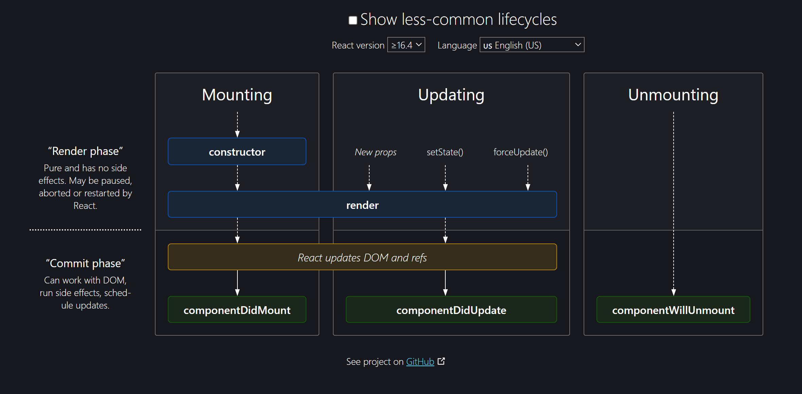

<details >
 <summary style="font-size: x-large; font-weight: bold">Basic Concepts</summary>

Quick Speed Run: https://learnweb3.io/degrees/ethereum-developer-degree/sophomore/intro-to-react-and-next-js/


<details >
 <summary style="font-size: large; font-weight: bold">Input Fields</summary>

```js
import React, { useState } from 'react';
import {Handle, Position} from "reactflow";
import validateTextUtil from "../../utils/validate-text.util";
import {extractVariables, isValidVariableName} from "../../utils/valid-variable-helper.util";
import {useStore} from "../../store";
import classes from "./templateNode.module.css";
import Icon from "../icon";


const TemplateNode = ({ label,icon, id, config, inputHandles=[], outputHandles=[] }) => {
    const [handles, setHandles] = useState({'input': true});
    const [textAreaHeight, setTextAreaHeight] = useState(0);
    const [errors, setErrors] = useState({});
    const updateNodeField = useStore((state) => state.updateNodeField);
    const setSelectedNode = useStore((state) => state.setSelectedNode);
    const selectedNodeId = useStore((state) => state.selectedNodeId);

    const [formValues, setFormValues] = useState(() =>
        config.reduce((acc, field) => {
            acc[field.name] = field.value || '';
            return acc;
        }, {})
    );


    const handleNodeSelect = (id) => {
        setSelectedNode(id);
    };
    const handleChange = (e, fieldName) => {
        const newValues = {
            ...formValues,
            [fieldName]: e.target.value,
        };
        setFormValues(newValues);
        updateNodeField(id, fieldName, e.target.value)
    };

    const handleTextChange = (e, fieldName, rules) => {
        handleChange(e, fieldName);

        const error = validateTextUtil(e.target.value, rules);
        setErrors({
            ...errors,
            [fieldName]: error,
        });
    }
    const handleTextareaChange = (e, fieldName) => {
        const textarea = e.target;
        textarea.style.height = 'auto'; // Reset the height
        textarea.style.height = `${textarea.scrollHeight}px`; // Set it to the scroll height
        setTextAreaHeight(textarea.scrollHeight);

        handleChange(e, fieldName);

        updateHandle(textarea.value);
    };

    const updateHandle = (value) => {
        const newHandles = extractVariables(value).reduce((acc, variable) => {
            if (isValidVariableName(variable)) {
                acc[variable] = true;
            }
            return acc;
        }, {});

        setHandles((prevHandles) => {
            const updatedHandles = { ...prevHandles };
            Object.keys(prevHandles).forEach((key) => {
                if (!newHandles[key]) {
                    delete updatedHandles[key];
                }
            });
            Object.keys(newHandles).forEach((key) => {
                if (!prevHandles[key]) {
                    updatedHandles[key] = true;
                }
            });
            return updatedHandles;
        });
    }


    const renderField = (field) => {

        const rules = field.validation || {};

        switch (field.type) {
            case 'text':
                return (
                    <div key={field.name} className={classes["node__fields__field"]}>
                        <label htmlFor={field.label}>{field.label}</label>
                        <input
                            type="text"
                            value={formValues[field.name]}
                            onChange={(e) => handleTextChange(e, field.name, rules)}
                            id={field.label}
                        />
                        {errors[field.name] && <span style={{ color: 'red' }}>{errors[field.name]}</span>}
                    </div>
                );
            case 'textArea':
                return (
                    <div key={field.name} className={classes["node__fields__field"]}>
                        <label htmlFor={field.label}>{field.label}</label>
                        <textarea
                            value={formValues[field.name]}
                            onChange={(e) => handleTextareaChange(e, field.name)}
                            id={field.label}
                            style={{ width: '90%', overflow: 'auto', resize: 'none', maxHeight: '300px' }}
                        />
                        {Object.keys(handles).map((variable, index) => (
                            <Handle
                                key={variable}
                                type="source"
                                position={Position.Left}
                                id={`${field.name}-${variable}`}
                                style={{top: `${((textAreaHeight+100)  / (Object.keys(handles).length + 1)) * (index + 1)}px`, left: '-2.5%', height: '15px', width: '15px',border: '2px solid #2a2de1', background: 'white'}}
                            />
                        ))}
                    </div>
                );
            case 'select':
                return (
                    <div key={field.name} className={classes["node__fields__field"]}>
                        <label htmlFor={field.label}>{field.label}</label>
                        <select
                            value={formValues[field.name]}
                            onChange={(e) => handleChange(e, field.name)}
                            id={field.label}
                        >
                            {field.options.map((option) => (
                                <option key={option.value} value={option.value}>
                                    {option.label}
                                </option>
                            ))}
                        </select>
                    </div>
                );
            case 'radio':
                return (
                    <div key={field.name} className={classes["node__fields__field"]}>
                        <label>{field.label}</label>
                        {field.options.map((option) => (
                            <div className={classes["node__fields__field-radio"]}>
                                <input
                                    type="radio"
                                    name={field.name}
                                    id={field.name}
                                    value={option.value}
                                    checked={formValues[field.name] === option.value}
                                    onChange={(e) => handleChange(e, field.name)}
                                />
                                <label
                                    key={option.value}
                                    form={field.name}
                                    htmlFor={field.name}
                                >{option.label}
                                </label>
                            </div>
                        ))}
                    </div>
                );
            default:
                return (
                    <div key={field.name} className={classes["node__fields__field"]}>
                        <div>
                            <span>{formValues[field.name]}</span>
                        </div>
                    </div>
                );
        }
    };

    return (
        <div
            className={`${classes["node"]} ${selectedNodeId === id ? classes["selected"] : ''}`}
            onClick={() => handleNodeSelect(id)}
        >
            <div
                className={classes["node__header"]}
                style={{color: selectedNodeId === id ? '#585bef':'' }}
            >
                <Icon d={icon} color={selectedNodeId === id ? '#585bef':'#7d838e' }  size={"1em"}/>
                {label}
            </div>
            <form className={classes["node__fields"]}>{config.map(renderField)}</form>
            {inputHandles.map((inputHandle, index) => (
                <Handle
                    key={index}
                    type="target"
                    position={Position.Left}
                    id={`${id}-${inputHandle.type}`}
                    style={{top: `${(index + 1) * 50 / inputHandles.length}%`, left: '-2.5%', height: '15px', width: '15px',border: '2px solid #2a2de1', background: 'white'}}
                    className={classes["node-handle"]}
                />
            ))}
            {outputHandles.map((outputHandle, index) => (
                <Handle
                    key={index}
                    type="source"
                    position={Position.Right}
                    id={`${id}-${outputHandle.type}`}
                    style={{top: `${(index + 1) * 50 / outputHandles.length}%`, left: '97.5%', height: '15px', width: '15px',border: '2px solid #2a2de1', background: 'white'}}
                    className={classes["node-handle"]}
                />
            ))}
        </div>
    )
}

export default TemplateNode;
```
</details>


<details >
 <summary style="font-size: large; font-weight: bold">Conditional Rendering</summary>

<details >
 <summary style="font-size: medium; font-weight: bold">Conditional HTML</summary>

```js
function App() {
	const isAuthUser = useAuth();

  if (isAuthUser) {
    // if our user is authenticated, let them use the app
    return <AuthApp />;
  }

  // if user is not authenticated, show a different screen
  return <UnAuthApp />;
}
```


```js
function App() {
	const isAuthUser = useAuth();

  return (
    <>
      <h1>My App</h1>
      {isAuthUser ? <AuthApp /> : <UnAuthApp />}
    </>
  ) 
}
```
</details>

<details >
 <summary style="font-size: medium; font-weight: bold">Conditional Styling</summary>

1. **Class**
```js
<div
    className={`step ${
        currentStep > index + 1 || isComplete ? "complete" : ""
    } ${currentStep === index + 1 ? "active" : ""} `}
>
```

Use `.module.css` so that class name does not have any name conflict
```js
import classes from './filter-modal.component.module.css';

<div
    className={classes["modal__main__list__item-val__icon"]}
>
```

2. **Style**
`style` takes `object`. The First curly bracket is for writing JS in JSX, and the second  
is object of styling where all keys are camelCased, and values are in string.

We can write conditional styling in below two ways
```js
<div
    style={selectedSecondaryItem?.inputType === InputType.CHECKBOX ? {"borderRadius": "5px"} : {"borderRadius": "50%"}}
>
```

```js
<div
    style={{transform: startTransition ? "scaleX(1)" : "scaleX(0)"}}
>
```
</details>
</details>


<details >
 <summary style="font-size: large; font-weight: bold">Hooks</summary>

- Always define hooks at top of the component
- Never define inside any other function, if...else , loops or any block of code
- It's simply a regular JavaScript function. However, it becomes powerful 
when used within React, as it's provided to us by React itself. 
These pre-built functions have underlying logic developed by React developers. 
When we install React via npm, wegain access to these superpowers


<details >
 <summary style="font-size: medium; font-weight: bold">useState()</summary>

❌Wrong way to update state variable
```js
const [currentImageNo, setCurrentImageNo] = useState(0);

useEffect(() => {
    setInterval(() => {
        setCurrentImageNo((currentImageNo + 1) % totalImage);
    },5000)
})
```

✅Right way to update state variable
```js
const [currentImageNo, setCurrentImageNo] = useState(0);

useEffect(() => {
    setInterval(() => {
        setCurrentImageNo(prevImageNo => (prevImageNo + 1) % totalImage);
    },5000)
})
```
In React, state updates inside a function use the state at the time the function was created.
This means that the `currentImageNo` in your setInterval callback will always be `0` because
it doesn't get the latest value from React's state.
</details>

<details >
 <summary style="font-size: medium; font-weight: bold">useEffect()</summary>

1. No second argument
```js
import { useEffect } from 'react';

function MyComponent() {
   useEffect(() => {
     // perform side effect here
   });
}
```
Run on every render

2. Second argument with empty array
```js
function MyComponent() {
   useEffect(() => {
     // perform side effect here
   }, []);
}
```
Run only on an initial component load

3. Second argument with non-empty array with single
```js
function MyComponent() {
    const [count, setCount] = useState(0);
   useEffect(() => {
     // perform side effect here
   }, [count]);
}
```
Run on an initial component load and whenever value of `count` changes

4. Second argument with non-empty array with multiple values
```js
useEffect(() => {
  // Some code
}, [stateVar1, stateVar2, stateVar3, andSoOn]);
```
You can also similarly create side effects which are dependent on 
multiple state variables, not just one. Run on an initial component load and if any of the dependent variables 
change, the side effect is run. You do this by just adding more state 
variables to the dependency array.

### Returns

1. **Always write `clean logic` to prevent `memory leaks` and unexpected behavior like below**

```js
useEffect(() => {
    const timerId = setInterval(() => {}, 500)
    
    //Below will remove the setInterval when component unmounts
    return () => {
        clearInterval(timerId);
    }
   }, []);
```


2. 

### `useEffect(setup, dependencies?)`
Call useEffect at the top level of your component to declare an Effect:
```js
function ChatRoom({ roomId }) {
  console.log("Chat Room called");
  const [serverUrl, setServerUrl] = useState('https://localhost:1234');

  useEffect(() => {
    console.log("UseEffect called");
    const connection = createConnection(serverUrl, roomId);
    connection.connect();
    return () => {
        console.log("Return called");
        connection.disconnect();
    };
  }, [serverUrl, roomId]);
  // ...
}
```

Output when it loads for first time
```js
Chat Room called
UseEffect called
```
Output when there is change in `serverUrl`
```js
Chat Room called
Return called
UseEffect called
```
- `setup`: The function with your Effect’s logic. Your setup function may also optionally return a cleanup function.
- When your component is added to the DOM, React will run your setup function.
- After every re-render with changed dependencies, React will first run the cleanup function (if you provided it) with the old values, and then run your setup function with the new values.
- After your component is removed from the DOM, React will run your cleanup function.

https://react.dev/reference/react/useEffect#useeffect
</details>

<details >
 <summary style="font-size: medium; font-weight: bold">useRef()</summary>

1. **No Re-Rendering**
Similar to `useState`, the `useRef` hook also allows us to store a variable in a component 
that can be updated over time. But, unlike state variables, updating the value of a ref 
variable does not cause the HTML view to re render.

    Therefore, if you had a `useRef` variable and you were displaying 
it's value in your HTML view, updating the variable will not update 
the HTML view.

```js
// Define a ref variable
const myNumber = useRef();
```

```js
// Access a ref variable
if (myNumber.current !== undefined) {
   ...
} 
```

```js
// Update a ref variable
myNumber.current = 1;
```

2. **Synchronous Updates**
Setting a new value for state variables happens asynchronously in React, 
which means if you try to use the state variable's value immediately after 
setting it to a new value, you might not actually see the new value being 
reflected as it happens asynchronously.


- When you run this, notice what happens on the view and what happens in the console. 
When you first click the button, the state variable should be updated to `1` - 
and that's what happens on the view, the web page displays `1`. But if you 
look at the browser console, the value `0` is printed instead of `1`. 
This pattern continues as you keep clicking the button.

- This is because the `setNumber` call runs asynchronously, and by the time 
we reach the `console.log(number)` line, the value hasn't been updated yet, 
so it prints the old value of number. When it does in fact gets updated, 
the HTML is re-rendered to display the new value.

- `useRef` on the other hand, allows for synchronous updates. When you update the 
value of a reference variable using `myVar.current = newValue` it is instantly updated, 
and there is no delay. This can come in handy sometimes.

3. **Referencing DOM Elements**

Another cool thing that `useRef` lets us do is that it allows us to refer directly to DOM elements.
This is something that is not possible with `useState`.

For example, you can reference an input element directly using `useRef`


When you run this above example, you will notice that as soon as the page loads, 
the `input` element is already in focus i.e. you can start typing without clicking on it first.
This is because we hold a reference to the `input` element, and have a `useEffect` 
that runs on page load due to having an empty dependency array, that focuses on 
the `input` element.
</details>


</details>


<details >
 <summary style="font-size: large; font-weight: bold">API Calls</summary>

### 1. Get call


### 2. Post call


</details>

</details>


<details >
 <summary style="font-size: x-large; font-weight: bold">Important Concepts</summary>

- [React Intro](./namaste-react/1-Inception⭐.pdf) 
- [Bundler(Parcel)](./namaste-react/2-igniting-our-app⭐.pdf)
- [JSX & Babel](./namaste-react/3-laying-the-foundation⭐.pdf)
<details >
 <summary style="font-size: large; font-weight: bold">Virtual DOM</summary>

1.
- The crucial point about `State variables` is that whenever they update
  React triggers a `reconciliation cycle` and re-renders the component.
- This means that as soon as the `data layer` changes,React promptly updates the `UI layer`.
  The `data layer` is always kept **in sync** with the `UI layer`.
- To achieve this rapid operation, React employs a reconciliation algorithm, also known
  as the **_diffing algorithm_** or **_React-Fibre_** which we will delve into further below

2. _But how does it all work behind the scenes?_
   When you create elements in React, you're actually creating virtual DOM objects.
   These virtual replicas are synced with the real DOM, a process known as "Reconciliation" or
   the React"diffing" algorithm.Essentially, every rendering cycle compares the new UI
   blueprint(updated VDOM) with the old one (previous VDOM) and makes precise changes
   to the actual DOM accordingly.It's important to understand these fundamentals in order
   to unlock a world of possibilities for front-end developers!

3. _Do you want to understand and dive deep into it?_
   Take a look at this awesome React Fiber architecture repository
   on the web: https://github.com/acdlite/react-fiber-architecture


<details >
 <summary style="font-size: medium; font-weight: bold">Why not to use index as key in React Lists</summary>

Suppose we've a list of elements, with key attribute as index.

```html
<ul>
  <li key=1>Milk</li>
  <li key=2>Eggs</li>
  <li key=3>Bread</li>
</ul>
```

Now, in case of any state change in the list, React just iterates over each list item in both the lists (React compares the Virtual DOM snapshot before the update and after the update), looks for changes and finally updates the RealDOM with only those changes.

If we add an item to the end of the list, React no longer needs to re-render the first 3 list items which are same. It will just add a new list item at the end.

```html
<ul>
  <li key=1>Milk</li>
  <li key=2>Eggs</li>
  <li key=3>Bread</li>
  <li key=4>Butter</li>
</ul>
```
But suppose we add the new item at the beginning of the list.

```html
<ul>
  <li key="1">Butter</li>
  <li key="2">Milk</li>
  <li key="3">Eggs</li>
  <li key="4">Bread</li>
</ul>
```

Now, the key of remaining list items also changes, which makes React re-render all the elements again, instead of just adding a new item at the end.

This can be avoided if we use some unique id as a key rather than index.
Let's again consider the same previous example but this time by using a unique id as key.
```html
<ul>
  <li key="12abc">Milk</li>
  <li key="23bcd">Eggs</li>
  <li key="34cde">Bread</li>
</ul>
```
Now even if we add element to the beginning or the end, we won't face an issue since keys are different.
</details>
</details>


<details >
 <summary style="font-size: large; font-weight: bold">Client side Routing v/s Server Side Routing</summary>

#### Client Side Routing


#### Server Side Routing

</details>


<details >
 <summary style="font-size: large; font-weight: bold">Lazy Loading</summary>

Also called
- Chunking
- Code Splitting
- Dynamic Bundling
- On Demand loading

1. Whenever we want to load a component based on our demand like clicking a button or link 
we `Lazy` load such components.
2. It help to reduce the bundle size, as on initial load there is nothing loaded from that component
hence bundle size is reduced
3. When demand for that component we that component and same can be verified in dev tools
where we can see under `JS` section one new `js` was added

```js
const Grocery = () => {
  return (
    <h1>
      {" "}
      Our grocery online store, and we have a lot of child components inside
      this web page!!!
    </h1>
  );
};

export default Grocery;
```

```js
// App.js

import React, { lazy, Suspense, useEffect, useState } from "react";
import ReactDOM from "react-dom/client";
import Header from "./components/Header";
import Body from "./components/Body";
//import About from "./components/About";
import Contact from "./components/Contact";
import Error from "./components/Error";
import RestaurantMenu from "./components/RestaurantMenu";
import { createBrowserRouter, RouterProvider, Outlet } from "react-router-dom";
import UserContext from "./utils/UserContext";
import { Provider } from "react-redux";
import appStore from "./utils/appStore";
import Cart from "./components/Cart";

const Grocery = lazy(() => import("./components/Grocery"));

const About = lazy(() => import("./components/About"));

const AppLayout = () => {
    const [userName, setUserName] = useState();

    //authentication
    useEffect(() => {
        // Make an API call and send username and password
        const data = {
            name: "Akshay Saini",
        };
        setUserName(data.name);
    }, []);

    return (
        <Provider store={appStore}>
            <UserContext.Provider value={{ loggedInUser: userName, setUserName }}>
                <div className="app">
                    <Header />
                    <Outlet />
                </div>
            </UserContext.Provider>
        </Provider>
    );
};

const appRouter = createBrowserRouter([
    {
        path: "/",
        element: <AppLayout />,
        children: [
            {
                path: "/",
                element: <Body />,
            },
            {
                path: "/about",
                element: (
                    <Suspense fallback={<h1>Loading....</h1>}>
                        <About />
                    </Suspense>
                ),
            },
            {
                path: "/contact",
                element: <Contact />,
            },
            {
                path: "/grocery",
                element: (
                    <Suspense fallback={<h1>Loading....</h1>}>
                        <Grocery />
                    </Suspense>
                ),
            },
            {
                path: "/restaurants/:resId",
                element: <RestaurantMenu />,
            },
            {
                path: "/cart",
                element: <Cart />,
            },
        ],
        errorElement: <Error />,
    },
]);

const root = ReactDOM.createRoot(document.getElementById("root"));

root.render(<RouterProvider router={appRouter} />);
```

Here we are using `Suspense` because as soon as we try to visit `Grocery` component, 
there is a chance that it will take some time to load, hence we are using `Suspense`
to show loading indicator.

#### Suspense
In React, Suspense is a feature that allows us to declaratively manage asynchronous 
data fetching and code-splitting in our applications. It is primarily used in combination
with the lazy()function for dynamic imports and with the React.lazy()component to 
improve the user experience when loading data or components asynchronously

### Code-splitting Pattern

#### Advantage
- faster initial load time
- Improved performance
- Optimized resource usage
- Enhanced Caching:  Smaller bundles can benefit from browser caching. 
Since they are less likely to change frequently, browsers can cache
them, resulting in faster subsequent visits for returning users.
- Simpler maintenance
- Better mobile performance:  On mobile devices with limited bandwidth and processing power, code splitting can significantly enhance the user experience


#### Disadvantage
- Complex configuration
- Initial load time is longer
- Tool and framework support
- Testing complexity

Refer Namaste notes for more details
</details>


<details>
 <summary style="font-size: large; font-weight: bold">Portals & `forwardRef`</summary>


### 1. Portals
Portals are very useful when we want to render a component, somewhere 
than where it actually defined.

For example here we have a `ResultModal` component which is rendered in 
`TimerChallenge` component. But since modal are nested in final HTML
which is not right for accessibilty because modal are present at top 
everything so it make sense to come at top when it renders.

Hence in second argument we pass `document.getElementById('modal')` where 
we want to render this.

It is same like
```js
ReactDOM.createRoot(document.getElementById('root')).render(
    <React.StrictMode>
        <App />
    </React.StrictMode>,
)
```


```js
//ResultModal.jsx
import { forwardRef, useImperativeHandle, useRef } from 'react';
import { createPortal } from 'react-dom';

const ResultModal = forwardRef(function ResultModal(
  { targetTime, remainingTime, onReset },
  ref
) {
  const dialog = useRef();

  return createPortal(
    <dialog ref={dialog} className="result-modal">
      {userLost && <h2>You lost</h2>}
      {!userLost && <h2>Your Score: {score}</h2>}
      <p>
        The target time was <strong>{targetTime} seconds.</strong>
      </p>
      <p>
        You stopped the timer with{' '}
        <strong>{formattedRemainingTime} seconds left.</strong>
      </p>
      <form method="dialog" onSubmit={onReset}>
        <button>Close</button>
      </form>
    </dialog>,
    document.getElementById('modal')
  );
});

export default ResultModal;

```

```js
//TimerChallenge.jsx

import ResultModal from './ResultModal.jsx';

export default function TimerChallenge({ title, targetTime }) {

    return (
        <>
            <ResultModal
                ref={dialog}
                targetTime={targetTime}
                remainingTime={timeRemaining}
                onReset={handleReset}
            />
           ...
        </>
    );
}

```

```html
//index.html
<!DOCTYPE html>
<html lang="en">
  <head>
    <meta charset="UTF-8" />
    <link rel="icon" type="image/svg+xml" href="/vite.svg" />
    <meta name="viewport" content="width=device-width, initial-scale=1.0" />
    <title>Refs & Portals</title>
  </head>
  <body>
    <div id="modal"></div>
    <div id="content">
      <header>
        <h1>The <em>Almost</em> Final Countdown</h1>
        <p>Stop the timer once you estimate that time is (almost) up</p>
      </header>
      <div id="root"></div>
    </div>
    <script type="module" src="/src/main.jsx"></script>
  </body>
</html>
```

### 2. `forwardRef`

`forwardRef` lets your component expose a DOM node to parent component with a ref.

```js
const SomeComponent = forwardRef(render)
```

**Usage**
- Exposing a DOM node to the parent component
- Forwarding a ref through multiple components
- Exposing an imperative handle instead of a DOM node

For More Details: https://react.dev/reference/react/forwardRef
</details>

<details >
 <summary style="font-size: large; font-weight: bold">Higher Order Functions</summary>

**A higher-order component is a function that takes a component and 
returns a new component.**


```js
//components/RestaurantCard.js
import { useContext } from "react";
import { CDN_URL } from "../utils/constants";
import UserContext from "../utils/UserContext";

const RestaurantCard = (props) => {
  const { resData } = props;
  const { loggedInUser } = useContext(UserContext);

  const {
    cloudinaryImageId,
    name,
    avgRating,
    cuisines,
    costForTwo,
    deliveryTime,
  } = resData;

  return (
    <div
      data-testid="resCard"
      className="m-4 p-4 w-[250px] rounded-lg bg-gray-100 hover:bg-gray-200"
    >
      
      <h3 className="font-bold py-4 text-lg">{name}</h3>
      <h4>{cuisines.join(", ")}</h4>
      <h4>{avgRating} stars</h4>
      <h4>₹{costForTwo / 100} FOR TWO</h4>
      <h4>{deliveryTime} minutes</h4>
      <h4>User : {loggedInUser} </h4>
    </div>
  );
};


// Higher Order Component
// input - RestaurantCard =>> RestaurantCardPromoted
export const withPromtedLabel = (RestaurantCard) => {
  return (props) => {
    return (
      <div>
        <label className="absolute bg-black text-white m-2 p-2 rounded-lg">
          Promoted
        </label>
        <RestaurantCard {...props} />
      </div>
    );
  };
};

export default RestaurantCard;
```


Usage👇🏻
```js
//components/Body.js
import RestaurantCard, { withPromtedLabel } from "./RestaurantCard";

const Body = () => {

  const RestaurantCardPromoted = withPromtedLabel(RestaurantCard);

  return listOfRestaurants.length === 0 ? (
    <Shimmer />
  ) : (
      ...
      <div className="flex flex-wrap">
        {filteredRestaurant.map((restaurant) => (
          <Link
            key={restaurant?.info.id}
            to={"/restaurants/" + restaurant?.info.id}
          >
            {restaurant?.info.promoted ? (
              <RestaurantCardPromoted resData={restaurant?.info} />
            ) : (
              <RestaurantCard resData={restaurant?.info} />
            )}
          </Link>
        ))}
      </div>
          ...
  );
};

export default Body;
```


</details>

<details >
 <summary style="font-size: large; font-weight: bold">Controlled & Uncontrolled Components</summary>

- It is common to call a component with some local state “uncontrolled”. For example, the original Panel component with an isActive state variable is uncontrolled because its parent cannot influence whether the panel is active or not.

- In contrast, you might say a component is “controlled” when the important information in it is driven by props rather than its own local state. This lets the parent component fully specify its behavior. The final Panel component with the isActive prop is controlled by the Accordion component.

- Uncontrolled components are easier to use within their parents because they require less configuration. But they’re less flexible when you want to coordinate them together. Controlled components are maximally flexible, but they require the parent components to fully configure them with props.

- In practice, “controlled” and “uncontrolled” aren’t strict technical terms—each component usually has some mix of both local state and props. However, this is a useful way to talk about how components are designed and what capabilities they offer.

- When writing a component, consider which information in it should be controlled (via props), and which information should be uncontrolled (via state). But you can always change your mind and refactor later.
</details>


<details >
 <summary style="font-size: large; font-weight: bold">Class Components</summary>


<details >
 <summary style="font-size: medium; font-weight: bold">Basic</summary>

- Use below component just like functional components
```js
//👇🏻Alternative way to extend react component
// import {Component} from "react";
//class UserClass extends Component{...}

import React from "react";

class UserClass extends React.Component {
  constructor(props) {
    super(props);

    //Reserve Keywords "state"
    this.state = {
      count: 0
    };
  }

  render() {
    const { name, location } = this.props;
    const { count } = this.state;
    
    return (
      <div className="user-card">
        <h1>Count: {count}</h1>
          <button
              onClick={
                  () => {
                      //Never Update the state DIRECTLY
                      //Reserve keywords "setState"
                      this.setState({
                          count: this.state.count + 1
                      })
                  }
              }
          >
              Count Increase
          </button>
        <h2>Name: {name}</h2>
        <h3>Location: {location}</h3>
        <h4>Contact: @akshaymarch7</h4>
      </div>
    );
  }
}

export default UserClass;
```

Why we use `super(props)`?
1. **Calling the Parent Constructor**: In JavaScript, when you create a subclass using the `extends` keyword, you need to call the constructor of the parent class using `super()`. This ensures that the parent class (in this case, `React.Component`) is properly initialized. Without this call, the subclass cannot access `this`, leading to an error.

2. **Passing Props to the Parent**: By passing `props` to `super(props)`, you ensure that the parent class’s constructor receives the props. This is important for React components because the parent class (`React.Component`) uses these props to manage the component’s state and lifecycle methods.

</details>


<details >
 <summary style="font-size: medium; font-weight: bold">Mounting Life Cycle</summary>

Parent Component👇🏻
```js
//components/About.js
import User from "./User";
import UserClass from "./UserClass";
import { Component } from "react";

class About extends Component {
  constructor(props) {
    super(props);

    console.log("Parent Constructor");
  }

  componentDidMount() {
    console.log("Parent Component Did Mount");
  }

  render() {
    console.log("Parent Render");

    return (
      <div>
        <h1>About Class Component</h1>
        <UserClass name={"First"} location={"Dehradun Class"} />
        <UserClass name={"Second"} location={"Dehradun Class"} />
      </div>
    );
  }
}

export default About;
```

Child Component👇🏻
```js
//components/UserClass.js

import React from "react";

class UserClass extends React.Component {
  constructor(props) {
    super(props);

    this.state = {
      count: 0
    };
    
    console.log(this.props.name + " Child Constructor");
  }

    componentDidMount() {
        console.log(this.props.name + " Child Component Did Mount");
    }

  render() {
      console.log(this.props.name + " Child Render");
      
    const { name, location } = this.props;
    const { count } = this.state;
    
    return (
      <div className="user-card">
        <h1>Count: {count}</h1>
          <button
              onClick={() => {
                      this.setState({
                          count: this.state.count + 1
                      })
                }
              }
          >
              Count Increase
          </button>
        <h2>Name: {name}</h2>
        <h3>Location: {location}</h3>
        <h4>Contact: @akshaymarch7</h4>
      </div>
    );
  }
}

export default UserClass;
```

Console Output👇🏻
```js
Parent Constructor
Parent Render
First Child Constructor
First Child Render
Second Child Constructor
Second Child Render
First Child Component Did Mount
Second Child Component Did Mount
Parent Component Did Mount
```

https://projects.wojtekmaj.pl/react-lifecycle-methods-diagram/


- Above output shows sequence how a class component is created and rendered.
- `componentDidMount()` is used for API calling because it runs when component is rendered for the first time.
Same thing happens in functional components while `useEffect()` is used for API calling.
We want to load whatever we have then update the values whatever we receive from asynchronous API call
- Here both child's `componentDidMount()` console are called one after other because 
in Render phase `constructor()` & `render()` are called which is just Virtual DOM manipulation, but
in Commit phase `componentDidMount()` is called which is actual DOM manipulation and it is quite performance 
intensive task. Therefore React try to optimize this by calling them one after another.
</details>


<details >
 <summary style="font-size: medium; font-weight: bold">Updating(API Call) & Unmounting Life Cycle</summary>

```js
import React from "react";

class UserClass extends React.Component {
  constructor(props) {
    super(props);

    this.state = {
      userInfo: {
        name: "Dummy",
        location: "Default",
      },
    };
    console.log("Child Constructor");
  }

  //HERE WE CAN USE ASYNC BEFORE componentDidMount BUT SAME THING
  // CAN'T BE DONE IN useEffect()
  async componentDidMount() {
    console.log("Child Component Did Mount");
    // Api call

    const data = await fetch("https://api.github.com/users/akshaymarch7");
    const json = await data.json();

    this.setState({
      userInfo: json,
    });
    
    this.timer = setInterval(() => {
        console.log("Namaste React OP")
    }, 1000)
  }

  componentDidUpdate() {
    console.log("Component Did Update");
  }

  componentWillUnmount() {
    console.log("Component Will Unmount");
    
    // If we don't clear interval then it will run infinitely
    // and as many time as we load this page, number of console will increase
    clearInterval(this.timer);
  }

  render() {
    console.log(this.props.name + "Child Render");

    const { name, location, avatar_url } = this.state.userInfo;
    return (
      <div className="user-card">
        
        <h2>Name: {name}</h2>
        <h3>Location: {location}</h3>
        <h4>Contact: @akshaymarch7</h4>
      </div>
    );
  }
}

export default UserClass;
```

Output👇🏻
```js
  --- MOUNTING ----
 
  Constructor (dummy)
  Render (dummy)
       <HTML Dummy >
  Component Did Mount
       <API Call>
       <this.setState> -> State variable is updated
 
  ---- UPDATE -----
 
       render(APi data)
       <HTML (new API data>)
       componentDid Update
```

- Once we switch to another component then it will be unmounted and `componentWillUnmount()` will be called.

- In functional component we achieve same thing by using `useEffect()`. 
    1. `compuntDidMount()` & `componentWillUnmount()`
    ```js
    import React, { useEffect } from 'react';
    const ComponentExample => () => {
        useEffect(() => {
            // Anything in here is fired on component mount.
             const timer = setInterval(() => {
                    console.log("Namaste React OP")
                }, 1000)
            return () => {
                // Anything in here is fired on component unmount.
                  clearInterval(timer);
            }
        }, [])
    }
    ```
  2. `componentDidUpdate()`: For this case we use `useEffect()` with `[deps]` array.
  This is more efficient than `componentDidUpdate()` as it is called only when provided 
  dependency variable changes
  
- Closely read `setInterval()` example above to understand how to do clean up work
- The reasons why an asynchronous callback function cannot be called directly from a useEffect() hook. This is because the useEffect hook expects its effect function to return either a cleanup function or nothing at all. If you return a Promise, React doesn't know when or how to handle cleanup. This is due to the useEffect() hook's callback function's asynchronous execution and lack of blocking. Therefore, we must follow a specific pattern if we want to call an asynchronous function inside the useEffect() hook.
```js
import React, { useEffect } from 'react';

function App() {
  useEffect(() => {
    async function fetchData() {
      const response = await fetch('https://example.com/data');
      const data = await response.json();
      console.log(data);
    }

    fetchData();
  }, []);

  return <div>Hello World</div>;
}
```

**Note: Under the hood in Functional components, we are NOT using same concept to achieve this. 
Now it is just easier and cleaner to write** 
</details>


</details>


<details >
 <summary style="font-size: large; font-weight: bold">Error Boundary</summary>

By default, if your application throws an error during rendering, React will remove its UI from the screen. To prevent this, you can wrap a part of your UI into an error boundary. An error boundary is a special component that lets you display some fallback UI instead of the part that crashed—for example, an error message.


To implement an error boundary component, you need to provide `static getDerivedStateFromError` which lets you update state in response to an error and display an error message to the user. You can also optionally implement `componentDidCatch` to add some extra logic, for example, to log the error to an analytics service.

```jsx
class ErrorBoundary extends React.Component {
  constructor(props) {
    super(props);
    this.state = { hasError: false };
  }

  static getDerivedStateFromError(error) {
    // Update state so the next render will show the fallback UI.
    return { hasError: true };
  }

  componentDidCatch(error, info) {
    // Example "componentStack":
    //   in ComponentThatThrows (created by App)
    //   in ErrorBoundary (created by App)
    //   in div (created by App)
    //   in App
    logErrorToMyService(error, info.componentStack);
  }

  render() {
    if (this.state.hasError) {
      // You can render any custom fallback UI
      return this.props.fallback;
    }

    return this.props.children;
  }
}
```

Then you can wrap a part of your component tree with it:
```jsx
<ErrorBoundary fallback={<p>Something went wrong</p>}>
  <Profile />
</ErrorBoundary>
```

If Profile or its child component throws an error, ErrorBoundary will “catch” that error, display a fallback UI with the error message you’ve provided, and send a production error report to your error reporting service.


You don’t need to wrap every component into a separate error boundary. When you think about the granularity of error boundaries, consider where it makes sense to display an error message. For example, in a messaging app, it makes sense to place an error boundary around the list of conversations. It also makes sense to place one around every individual message. However, it wouldn’t make sense to place a boundary around every avatar.

>There is currently no way to write an error boundary as a function component. However, you don’t have to write the error boundary class yourself. For example, you can use [react-error-boundary](https://github.com/bvaughn/react-error-boundary) instead.

- Referred Article: https://react.dev/reference/react/Component#catching-rendering-errors-with-an-error-boundary
- Referred Video(7 min): https://www.youtube.com/watch?v=_FuDMEgIy7I
</details>

</details>


<details >
 <summary style="font-size: x-large; font-weight: bold">Hooks</summary>

<details >
 <summary style="font-size: large; font-weight: bold">Simple Custom Hooks</summary>

Below custom hook checks for internet connection and update the
status based on connection status

- Very useful when we want to clean our code and have single responsibility
- Prefix function name with `use`

```js
import { useEffect, useState } from "react";

const useOnlineStatus = () => {
  const [onlineStatus, setOnlineStatus] = useState(true);

  useEffect(() => {
    window.addEventListener("offline", () => {
      setOnlineStatus(false);
    });

    window.addEventListener("online", () => {
      setOnlineStatus(true);
    });
  }, []);

  // boolean value
  return onlineStatus;
};

export default useOnlineStatus;
```

Usage👇🏻
```js
import useOnlineStatus from "../utils/useOnlineStatus";

const Header = () => {
  const onlineStatus = useOnlineStatus();

  return (
          <li className="px-4">Online Status: {onlineStatus ? "✅" : "🔴"}</li>
  );
};

export default Header;
```

We will have same effect if we directly write same code directly in `Header` component.
So need not to confuse how `onlineStatus` value is updated dynamically when we toggle between
`online` and `offline` status through our browser dev tools


</details>


<details >
 <summary style="font-size: large; font-weight: bold">Debounce/Throttle Hooks</summary>

<details >
 <summary style="font-size: medium; font-weight: bold">Debounce/Throttle Value Hooks</summary>

```js
import React, { useState } from "react";
import useDebounce from "./useDebounce"; // Import the debouncing custom hook
import useThrottle from "./useThrottle"; // Import the throttling custom hook

const MyComponent = () => {
  const [inputText, setInputText] = useState(""); // State to store the input text
  const debounceDelay = 500; // Delay for debouncing
  const throttleDelay = 500; // Delay for throttling
  const debouncedText = useDebounce(inputText, debounceDelay); // Apply debounce custom hook
  const throttledText = useThrottle(inputText, throttleDelay); // Apply throttle custom hook
  // Event handler to update the input text
  const handleChange = (e) => {
    setInputText(e.target.value);
  };
  return (
    <>
      <input
        type="text"
        placeholder="Type something..."
        value={inputText} // Use 'value' to display the input text
        onChange={handleChange} // Call handleChange on input change
      />
      <p>Default: {inputText}</p>
      <p>Debounced: {debouncedText}</p>
      <p>Throttled: {throttledText}</p>
    </>
  );
};
export default MyComponent;
```

```js
// Custom hook for debouncing text input
import React, { useState, useEffect } from "react";

const useDebounce = (text, delay) => {
  // State to store the debounced text
  const [debouncedText, setDebouncedText] = useState(text);

  useEffect(() => {
    // Create a timer that will execute the callback after the specified delay
    const debounceTimer = setTimeout(() => {
      setDebouncedText(text); // Update the debounced text with the latest input
    }, delay);

    // Cleanup function: Clear the timer if the component unmounts or the input changes
    return () => {
      clearTimeout(debounceTimer);
    };
  }, [text, delay]);

  return debouncedText; // Return the debounced text
};

export default useDebounce;
```


```js
// Custom hook for throttling text input
import React, { useState, useEffect, useRef } from "react";

const useThrottle = (text, delay) => {
  // State to store the throttled text
  const [throttledText, setThrottledText] = useState(text);
  const lastExecuted = useRef(Date.now()); // A ref to track the last execution time

  useEffect(() => {
    if (Date.now() - lastExecuted.current >= delay) {
      // If enough time has passed since the last execution, update the throttled text immediately
      lastExecuted.current = Date.now();
      setThrottledText(text);
    } else {
      // Otherwise, create a timer to update the throttled text after the delay
      const throttleTimer = setTimeout(() => {
        lastExecuted.current = Date.now();
        setThrottledText(text);
      }, delay);

      // Cleanup function: Clear the timer if the component unmounts or the input changes
      return () => clearTimeout(throttleTimer);
    }
  }, [text, delay]);

  return throttledText; // Return the throttled text
};

export default useThrottle;
```

https://medium.com/@itsanuragjoshi/debouncing-and-throttling-in-react-enhancing-user-experience-with-custom-hooks-bcaa897162ef
</details>

<details >
 <summary style="font-size: medium; font-weight: bold">Debounce Function Hooks</summary>

Normal JS Debounce:
```js
/**
 * @callback func
 * @param {number} wait
 * @return {Function}
 */
export default function debounce(func, wait = 0) {
  let timeoutID = null;
  return function (...args) {
    clearTimeout(timeoutID);

    timeoutID = setTimeout(() => {
      timeoutID = null; // Not strictly necessary but good to include.
      // Has the same `this` as the outer function's
      // as it's within an arrow function.
      func.apply(this, args);
    }, wait);
  };
}
```

Below example for Autocomplete where we are trying to debounce function call
which is use to fetch result from API, to reduce calls

```js
import {useState} from 'react'
import classes from './App.module.css'
import getGadgetService from "./services/get-gadget.service.js";
import useDebounce from "./hooks/use-debounce.js";

function App() {
  const [searchVal, setSearchVal] = useState('');
  const [results, setResults] = useState(['speaker']);

/**
 *Below function is getting the values for `results` from API
 * and updating. We don't want this to be called frequently
 */
  const updateResult = async (searchInput="") => {
      console.log("searchInput : ", searchInput);
      //Getting results from API
      const newResult = await getGadgetService(searchInput);
      setResults(newResult);
  }

/**
 * Here we used debouncing to restrict the number of time `updateResult`
 * should be called when used
 */
  const debouncedUpdatedResult = useDebounce(updateResult, 3000);

  const handleSearch = (val) => {
      setSearchVal(val);
      console.log("val : ", val);
      //here we are using a debounced version of `updatedResult`
      debouncedUpdatedResult(val);
  }


  return (
    <>
      <section className={classes['container']}>
          <input
              type="text"
              onChange={(evt) => handleSearch(evt.target.value)}
              value={searchVal}
              className={classes['container__search']}
          />
          <div className={classes['container__results']}>
              {
                  results.map((result) => (
                      <p
                          key={result}
                          onClick={(evt) => setSearchVal(evt.target.innerText)}
                          className={classes['container__results__result']}
                      >{result}</p>
                  ))
              }
          </div>
      </section>
    </>
  )
}

export default App
```

My `UseDebounce` made using normal debounce logic
```js
import {useRef} from "react";

function useDebounce(func, wait = 100){
    const timeoutId = useRef(null);

    function debounce(func, wait){
        return function(...args){
            clearTimeout(timeoutId.current);

            timeoutId.current = setTimeout(() => {
                return func.apply(this, args)
            }, wait);
        }
    }

    return debounce(func, wait);
}

export default useDebounce;
```

Improved `useDebounce`
```js
import { useCallback, useEffect, useRef } from "react";

function useDebounce(func, wait = 100) {
    const timeoutId = useRef(null);

    const debouncedFunc = useCallback(
        (...args) => {

            if (timeoutId.current) {
                clearTimeout(timeoutId.current);
            }
            timeoutId.current = setTimeout(() => {
                console.log("debounce called")
                func.apply(this, args);
            }, wait);
        },
        [func, wait],
    );


    //Clean timer to prevent memory leak
    useEffect(() => {
        return () => {
            if (timeoutId.current) {
                clearTimeout(timeoutId.current);
            }
        };
    }, []);

    return debouncedFunc;
}

export default useDebounce;
```

- **With useCallback:** Ensures that the debounced function (debouncedFetchResults) maintains a stable reference, leading to consistent behavior and avoiding unnecessary re-renders or resets.
- **Without useCallback:** The debounced function may be re-created on every render, leading to potential bugs or inefficiencies, especially in cases where the parent component frequently re-renders.
</details>
</details>


<details >
 <summary style="font-size: large; font-weight: bold">useEffect() Polyfill</summary>

```js
import {useRef} from "react";

const useCustomEffect = (effect, deps) => {
    const isFirstRender = useRef(true);
    const prevDeps = useRef([]);

    // First Render
    if (isFirstRender.current) {
        isFirstRender.current = false;
        const cleanup = effect();
        return () => {
            if (cleanup && typeof cleanup === "function") {
                cleanup();
            }
        };
    }

    // Deps Changes and No Deps Array
    const depsChanged = deps
        ? JSON.stringify(deps) !== JSON.stringify(prevDeps.current)
        : true;

    if (depsChanged) {
        const cleanup = effect();
        // Cleanup
        if (cleanup && typeof cleanup === "function" && deps) {
            cleanup();
        }
    }

    prevDeps.current = deps || [];
};

export default useCustomEffect;

```
</details>


<details>
 <summary style="font-size: large; font-weight: bold">`useMemo`, `useCallback` & `React.memo / memo` [Increase React Performance]</summary>

## 1. `useMemo`

### Usecase-1

Very common problem in React since all the
component logic is re-computed every time the
component renders

```jsx
const result = useMemo(() => {
    /** slowFunction take lot of time 
     * to execute **/
  return slowFunction(a)
}, [a])
```
As long as a stays the same the slowFunction will
not be re-run and instead the cached value will be
used.

### Usecase-2(Referential Equality)

If you are unfamiliar with referential equality it essentially defines whether or not the references of two values are
the same. For example {} === {} is false because it is checking referential equality. While both of the objects are
empty, they reference different places in memory where the object is stored.

This referential equality is important when it comes to dependency arrays, for example in `useEffect`.
```jsx
function Component({ param1, param2 }) {
  const params = { param1, param2, param3: 5 }

  useEffect(() => {
    callApi(params)
  }, [params])
}
```

At first glance it may seem this `useEffect` works properly, but since the `params` object is created as a
new object each render this is actually going to cause the effect to run every render since the reference of
`params` changes each render. `useMemo` can fix this, though.

```jsx
function Component({ param1, param2 }) {
  const params = useMemo(() => {
    return { param1, param2, param3: 5 }
  }, [param1, param2])

  useEffect(() => {
    callApi(params)
  }, [params])
}
```

Now if `param1` and `param2` do not change the `params` variable will be set to the cached version of
`params` which means the reference for `params` will only change if `param1`, or `param2` change.
This referential equality is really useful when comparing objects in dependency arrays,
but if you need to use a function in a dependency array you can use the `useCallback` hook.

Referred Video: https://youtu.be/_AyFP5s69N4?si=V6u1dez7i-UGfCsl


## 2. `useCallback`


`useCallback` works nearly identically to `useMemo` since it will cache a result based on an array of dependencies,
but `useCallback` is used **specifically for caching functions instead of caching values.**

```jsx
const handleReset = useCallback(() => {
  return doSomething(a, b)
}, [a, b])
```

This syntax may look exactly the same as useMemo, but the main difference is that useMemo will call the function passed to it whenever its dependencies change and will return the value of that function call. useCallback on the other hand will not call the function passed to it and instead will return a new version of the function passed to it whenever the dependencies change. This means that as long as the dependencies do not change then useCallback will return the same function as before which maintains referential equality.

In order to further understand the differences between useCallback and useMemo here is a quick example where both will return the same value.

```js
useCallback(() => {
  return a + b
}, [a, b])

useMemo(() => {
  return () => a + b
}, [a, b])
```

As you can see `useCallback` will return the **`function passed to it`**, while `useMemo` is returning the result of the function passed to it.
Therefore, with `useMemo` we won't be able to pass parameters directly

### Referential Equality

Just like with `useMemo`, `useCallback` is used to maintain referential equality.

```js
function Parent() {
  const [items, setItems] = useState([])
  const handleLoad = res => setItems(res)

  return <Child onLoad={handleLoad} />
}

function Child({ onLoad }) {
  useEffect(() => {
    callApi(onLoad)
  }, [onLoad])
}
```

In the above example the `handleLoad` function is re-created every time the `Parent` component is rendered. This means that the `Child` component’s `useEffect` will re-run ever render since the `onLoad` function has a different referential equality each render. To fix this we need to wrap the `handleLoad` in a `useCallback`.

```js
function Parent() {
  const [items, setItems] = useState([])
  const handleLoad = useCallback(res => setItems(res), [])

  return <Child onLoad={handleLoad} />
}

function Child({ onLoad }) {
  useEffect(() => {
    callApi(onLoad)
  }, [onLoad])
}
```

Now the `handleLoad` function will never change, thus the `useEffect` in the `Child` component will not be called on each re-render.

Watch this video to understand in 8min: https://youtu.be/_AyFP5s69N4?si=GjVZrUXgoJgi_S9-


## 3. `React.memo` or `memo`

**`memo` lets you skip re-rendering a component when its props are unchanged.**

```js
import React from 'react';

React.memo(function Component(props) {
  // Do something
})
```

Same Thing only syntax changes

```js
import { memo } from 'react';

const SomeComponent = memo(function SomeComponent(props) {
  // ...
});
```
`memo(Component, arePropsEqual?)`


The component above will only re-render when the props of the component change now. This will not stop a component from re-rendering when the state or context inside of it change, though. This means that even if you wrap a component in `React.memo` it will still re-render when the internal state or context of the component changes.
**But React may still re-render it: memoization is a performance optimization, not a guarantee.**

**Usage**
1. Skipping re-rendering when props are unchanged
2. Updating a memoized component using state
3. Updating a memoized component using a context
4. Minimizing props changes
5. Specifying a custom comparison function

To know more about `arePropsEqual` and usage details refer to: https://react.dev/reference/react/memo#memo


Referred article for both topic: https://blog.webdevsimplified.com/2020-05/memoization-in-react/


<details>
 <summary style="font-size: medium; font-weight: bold">useMemo Polyfill</summary>

```js
import { useRef, useEffect } from "react";

const areEqual = (prevDeps, nextDeps) => {
    if (prevDeps === null) return false;
    if (prevDeps.length !== nextDeps.length) return false;

    for (let i = 0; i < prevDeps.length; i++) {
        if (prevDeps[i] !== nextDeps[i]) {
            return false;
        }
    }

    return true;
};

const useCustomMemo = (cb, deps) => {
    // variable or state -> cached Value
    const memoizedRef = useRef(null);

    // Changes in deps
    if (!memoizedRef.current || !areEqual(memoizedRef.current.deps, deps)) {
        memoizedRef.current = {
            value: cb(),
            deps
        };
    }

    // cleanup logic
    useEffect(() => {
        return () => {
            memoizedRef.current = null;
        };
    }, []);

    // return the memoised value (if any)
    return memoizedRef.current.value;
};

export default useCustomMemo;
```
</details>
</details>


[//]: # (<details >)

[//]: # ( <summary style="font-size: large; font-weight: bold">useThrottle&#40;&#41; Hook</summary>)

[//]: # ()
[//]: # (```js)

[//]: # (import {useEffect} from "react";)

[//]: # (import {useRef, useState} from "react";)

[//]: # ()
[//]: # (const useThrottle = &#40;value, delay&#41; => {)

[//]: # (    const [throttledValue, setThrottledValue] = useState&#40;value&#41;;)

[//]: # ()
[//]: # (    const lastExecuted = useRef&#40;Date.now&#40;&#41;&#41;;)

[//]: # ()
[//]: # (    useEffect&#40;&#40;&#41; => {)

[//]: # (        const handler = setTimeout&#40;&#40;&#41; => {)

[//]: # (            const now = Date.now&#40;&#41;;)

[//]: # (            const timeElapsed = now - lastExecuted.current;)

[//]: # ()
[//]: # (            if &#40;timeElapsed >= delay&#41; {)

[//]: # (                setThrottledValue&#40;value&#41;;)

[//]: # (                lastExecuted.current = now;)

[//]: # (            })

[//]: # (        }, delay - &#40;Date.now&#40;&#41; - lastExecuted.current&#41;&#41;;)

[//]: # ()
[//]: # (        return &#40;&#41; => {)

[//]: # (            clearTimeout&#40;handler&#41;;)

[//]: # (        };)

[//]: # (    }, [delay, value]&#41;;)

[//]: # ()
[//]: # (    return throttledValue;)

[//]: # (};)

[//]: # ()
[//]: # (export default useThrottle;)

[//]: # ()
[//]: # (```)

[//]: # (</details>)

</details>


<details >
 <summary style="font-size: x-large; font-weight: bold">State Management</summary>


<details >
 <summary style="font-size: large; font-weight: bold">Context</summary>

1. Creating a context
```js
import { createContext } from 'react';

//we can pass default value while creating context.
// It can be any value or object. Here we are passing 'light'
const ThemeContext = createContext('light');

const CartContext = createContext({
    items: [],
    addItemToCart: () => {},
    updateItemQuantity: () => {},
});
```

2. 
- Using a context: After creating context, we can access the context value anywhere in our app.
- Using context value like below is not very useful as you can just access default value,
you can't modify the value and get the data dynamically. It's not reactive
```js
import { useContext } from 'react';

const theme = useContext(ThemeContext);
const { items, updateItemQuantity } = useContext(CartContext);
```

3. Modifying context value and accessing the updated value as when they are updated
```js
import React, {createContext, useState, useContext, useEffect} from "react";

// we may not pass default value
const ThemeContext = createContext();

export const useTheme = () => {
    return useContext(ThemeContext);
};

export const ThemeProvider = ({children}) => {
    const [isDarkMode, setIsDarkMode] = useState(false);

    const toggleTheme = () => {
        setIsDarkMode((prevMode) => !prevMode);
    };

    const theme = isDarkMode ? "dark" : "light";

    useEffect(() => {
        document.documentElement.setAttribute("data-theme", theme);
    }, [isDarkMode]);

    return (
        <ThemeContext.Provider value={{theme, toggleTheme}}>
            {children}
        </ThemeContext.Provider>
    );
};

```
- Use the same name as while creating the context in `ThemeContext.Provider`. That is
connecting provider with the creation of context
- All the value and object inside `value` can be access through `useContext`.
- These value are accessible only to the child component who wrapped with `ThemeProvider`.

```js
import React from "react";
import {BrowserRouter as Router, Routes, Route} from "react-router-dom";
import "./App.css";

import {ThemeProvider} from "./theme-context.jsx";
import Home from "./pages/Home.jsx";
import About from "./pages/About.jsx";
import Blog from "./pages/Blog.jsx";
import Navbar from "./components/NavBar.jsx";

const App = () => {
    return (
        <ThemeProvider>
            <Router>
                <Navbar />
                <Routes>
                    <Route path="/" element={<Home />} />
                    <Route path="/about" element={<About />} />
                    <Route path="/blog" element={<Blog />} />
                </Routes>
            </Router>
        </ThemeProvider>
    );
};

export default App;
```

Note:
1. We can use same context multiple place and wrap different child in them and 
all will have there own value, independent what other context value are.
2. Refer whole code for context in [2-lld-Questions/dark-mode(context)](../../2-lld-Questions/dark-mode(context)/react/README.md)


```js
import React from "react";
import {Link} from "react-router-dom";
import {useTheme} from "../theme-context.jsx";

const Navbar = () => {
    const {theme, toggleTheme} = useTheme();

    const toggleMode = () => {
        toggleTheme();
    };

    return (
        <nav className={`navbar ${theme}`}>
            <div>
                <Link to="/">Home</Link>
                <Link to="/about">About</Link>
                <Link to="/blog">Blog</Link>
            </div>
            <div className="mode-switch">
                <label>
                    <input
                        type="checkbox"
                        onChange={toggleMode}
                        checked={theme === "dark"}
                    />
                    <span className="slider round"></span>
                </label>
            </div>
        </nav>
    );
};

export default Navbar;

```
</details>


<details >
 <summary style="font-size: large; font-weight: bold">Redux</summary>

<details >
 <summary style="font-size: medium; font-weight: bold">Intro</summary>

- The Redux Toolkit package is intended to be the standard way to write Redux logic.
- Redux creates big javascript `object` that holds the state of your application
- Object has further broken down into `Slice`. Like in below image we have `cart` & `user` slice 
- When we click on "add to cart" it calls `Dispatch` action which calls a 
function(`Reducer`) that updates the state of the `cart` slice store
- `Selector` is use to read the data, which is subscribed to update the cart value dynamically


</details>


<details >
 <summary style="font-size: medium; font-weight: bold">Usage</summary>

1. 
```bash
npm i @reduxjs/toolkit react-redux
```

2. Create store
```js
//utils/appStore.js

import { configureStore } from "@reduxjs/toolkit";
import cartReducer from "./cartSlice";

const appStore = configureStore({
  reducer: {
    cart: cartReducer,
  },
});

export default appStore;
```

3. Create Slice
```js
//utils/cartSlice.js

import { createSlice, current } from "@reduxjs/toolkit";

const cartSlice = createSlice({
    name: "cart",
    initialState: {
        items: [],
    },
    reducers: {
        addItem: (state, action) => {
            // Redux Toolkit uses immer behind the scenes
            state.items.push(action.payload);
        },
        removeItem: (state, action) => {
            state.items.pop();
        },
        //originalState = {items: ["pizza"]}
        clearCart: (state, action) => {
            //Redux toolkit - either Mutate the existing  state or return a new State
            
            //❌Appraoch-0: state = {items: []}; This will not work as we are changing the local state
            // not original state
            
            //Approach-1: state.items.length = 0; // originalState = { items: [] }
            //Approach-2:👇🏻
            return { items: [] }; // this new object will be replaced inside originalState = { items: [] }
        },
    },
});

export const { addItem, removeItem, clearCart } = cartSlice.actions;

export default cartSlice.reducer;
```

4. Add `Provider` to `App.js`
```js
//App.js
import ReactDOM from "react-dom/client";
import { createBrowserRouter, RouterProvider, Outlet } from "react-router-dom";
import UserContext from "./utils/UserContext";

import { Provider } from "react-redux";
import appStore from "./utils/appStore";


const AppLayout = () => {
  return (
    <Provider store={appStore}>
      <UserContext.Provider value={{ loggedInUser: userName, setUserName }}>
        <div className="app">
          <Header />
          <Outlet />
        </div>
      </UserContext.Provider>
    </Provider>
  );
};

const appRouter = createBrowserRouter([
  {
      path: "/",
      element: <AppLayout />,
      children: []
  },
]);

const root = ReactDOM.createRoot(document.getElementById("root"));

root.render(<RouterProvider router={appRouter} />);
```

5. Subscribe to cart items
```js
import { Link } from "react-router-dom";
import { useSelector } from "react-redux";

const Header = () => {

  // Subscribing to the store using a Selector
  const cartItems = useSelector((store) => store.cart.items);
  //console.log(cartItems);

  return (
    <div>
            <Link to="/cart">Cart - ({cartItems.length} items)</Link>
    </div>
  );
};

export default Header;
```
**Note: Only subscribe to part of the store you need to have better performance**

❌ Below code will have a performance hit, don't do this. Always subscribe like above code
```js
const store = useSelector();
const cartItems = store.cart.items;
```

6. Add items to cart
```js
//components/ItemList.js
import { useDispatch } from "react-redux";
import { addItem } from "../utils/cartSlice";

const ItemList = ({}) => {
  const dispatch = useDispatch();

  const handleAddItem = (item) => {
    // Dispatch an action
    dispatch(addItem(item));
  };

  return (
      <button onClick={() => handleAddItem("pizza....")}>Add +</button>
  );
};

export default ItemList;
```
</details>

</details>

</details>


<details >
 <summary style="font-size: x-large; font-weight: bold">react-router-dom</summary>

</details>


<details >
 <summary style="font-size: x-large; font-weight: bold">React Optimization</summary>

1.  **Virtualize Long Lists**
    1.  List virtualization, or windowing, is a technique to improve performance when rendering a long list of data. This technique only renders a small subset of rows at any given time and can dramatically reduce the time it takes to re-render the components, as well as the number of DOM nodes created. 
    2. There are some popular React libraries out there, like react-windowand [react-virtualized](https://github.com/bvaughn/react-virtualized?tab=readme-ov-file), which provides several reusable components for displaying lists, grids, and tabular data.

2. Million Lint is a VSCode extension that speeds up your website! Your React app is slow. Million Lint surfaces problematic code and automatically suggests ways to improve it.https://million.dev/docs
</details>


<details >
 <summary style="font-size: x-large; font-weight: bold">Questions</summary>


### 1. How does the virtual DOM work in React, and why is it important?

Keyword: Virtual / Actual DOM, Diffing Algorithm, Reconciliation Cycle, React Fiber, UI / Data Layer

### 2. What are React Hooks, and how do they differ from class lifecycle methods?


**React Hooks** are functions that let you use state and other React features inside functional components. They were introduced in React 16.8 as a way to simplify component logic and make it easier to manage state and side effects.

#### Key Differences from Class Lifecycle Methods

1. **Functional Components:**
    * Hooks are primarily used with functional components, which are simpler and easier to understand than class components.
    * Functional components don't have lifecycle methods like `componentDidMount`, `componentDidUpdate`, and `componentWillUnmount`.

2. **State Management:**
    * In class components, state is managed within the component's instance.
    * In functional components, state is managed using the `useState` hook. This hook returns an array with two values: the current state and a function to update it.

3. **Side Effects:**
    * Class components use lifecycle methods like `componentDidMount` and `componentDidUpdate` to handle side effects (e.g., data fetching, subscriptions).
    * In functional components, side effects are managed using hooks like `useEffect`, `useLayoutEffect`, and `useCallback`. These hooks allow you to perform actions after a render or conditionally based on certain conditions.

4. **Context API:**
    * In class components, context is often managed using a class component that provides context to its children.
    * In functional components, the `useContext` hook is used to access context values.

#### Example:
```javascript
// Class component
class Counter extends Component {
  constructor(props) {
    super(props);
    this.state = { count: 0 };
  }

  componentDidMount() {
    // Side effect: fetch data
    fetch('https://api.example.com/data')
      .then(response => response.json())
      .then(data => this.setState({ data }));
  }

  render() {
    return <div>{this.state.count}</div>;
  }
}

// Functional component with hooks
function Counter() {
  const [count, setCount] = useState(0);
  const [data, setData] = useState(null);

  useEffect(() => {
    // Side effect: fetch data
    fetch('https://api.example.com/data')
      .then(response => response.json())
      .then(setData);
  }, []);

  return <div>{count}</div>;
}
```

As you can see, the functional component using hooks is often more concise and easier to read compared to the class component.

### 3. Explain the concept of Higher-Order Components (HOCs) and provide use cases.

### 4. What is Context API, and how does it help in managing global state?

### 5. How does React's reconciliation algorithm work?

### 6. Describe the concept of "lifting state up" in React and provide an example.

Sometimes, you want the state of two components to always change together. To do it, remove state from both of them, move it to their closest common parent, and then pass it down to them via props. This is known as lifting state up, and it’s one of the most common things you will do writing React code.
```jsx
import { useState } from 'react';

export default function Accordion() {
  const [activeIndex, setActiveIndex] = useState(0);
  return (
    <>
      <h2>Almaty, Kazakhstan</h2>
      <Panel
        title="About"
        isActive={activeIndex === 0}
        onShow={() => setActiveIndex(0)}
      >
        With a population of about 2 million, Almaty is Kazakhstan's largest city. From 1929 to 1997, it was its capital city.
      </Panel>
      <Panel
        title="Etymology"
        isActive={activeIndex === 1}
        onShow={() => setActiveIndex(1)}
      >
        The name comes from <span lang="kk-KZ">алма</span>, the Kazakh word for "apple" and is often translated as "full of apples". In fact, the region surrounding Almaty is thought to be the ancestral home of the apple, and the wild <i lang="la">Malus sieversii</i> is considered a likely candidate for the ancestor of the modern domestic apple.
      </Panel>
    </>
  );
}

function Panel({
  title,
  children,
  isActive,
  onShow
}) {
  return (
    <section className="panel">
      <h3>{title}</h3>
      {isActive ? (
        <p>{children}</p>
      ) : (
        <button onClick={onShow}>
          Show
        </button>
      )}
    </section>
  );
}

```

https://react.dev/learn/sharing-state-between-components#lifting-state-up-by-example

### 7. What is the purpose of the useReducer hook, and how does it compare to useState?


**useReducer** is another React hook that provides a way to manage state in functional components. While it might seem similar to `useState`, it offers a more powerful and flexible approach for complex state management scenarios.

### Purpose of useReducer

* **Complex State Updates:** When state updates are derived from previous state or involve complex logic, `useReducer` can be more efficient and easier to reason about.
* **State Sharing Across Components:** If multiple components need to share and update the same state, `useReducer` can be used to create a global state provider and consumer.
* **Centralized State Management:** For larger applications with complex state management requirements, `useReducer` can help maintain a more organized and predictable state flow.

### Key Differences Between useReducer and useState

1. **Reducer Function:**
    * `useReducer` takes a reducer function as an argument. This reducer function takes the current state and an action as input and returns the new state.
    * `useState` doesn't require a reducer function. It directly updates the state based on the value passed to the setter function.

2. **Action Object:**
    * `useReducer` uses an action object to describe the state update. The action object typically contains a type property that identifies the action and potentially other data.
    * `useState` doesn't require an action object. The new state value is directly passed to the setter function.

3. **State Updates:**
    * `useReducer` allows for more complex state updates by providing a reducer function that can perform calculations or logic based on the current state and action.
    * `useState` is simpler to use for basic state updates.

### Example:
```javascript
// Using useState
function Counter() {
  const [count, setCount] = useState(0);

  return (
    <div>
      <p>Count: {count}</p>
      <button onClick={() => setCount(count + 1)}>Increment</button>
    </div>
  );
}

// Using useReducer
function Counter() {
  const [count, dispatch] = useReducer((state, action) => {
    switch (action.type) {
      case 'INCREMENT':
        return state + 1;
      default:
        return state;
    }
  }, 0);

  return (
    <div>
      <p>Count: {count}</p>
      <button onClick={() => dispatch({ type: 'INCREMENT' })}>Increment</button>
    </div>
  );
}
```

In this example, the `useReducer` approach provides a more structured way to handle state updates, especially if more complex actions were involved. It also sets the stage for potentially sharing this state across multiple components using a global state provider.

### 8. How can you optimize the performance of a React application?


#### 1. **Code Splitting:**
* **Dynamic Imports:** Use dynamic imports to load code on demand, reducing initial bundle size and improving perceived performance.
* **Code Splitting Libraries:** Consider using libraries like Webpack's Code Splitting or React Router's `codeSplitting` to automate the process.

#### 2. **Memoization:**
* **`useMemo` Hook:** Use `useMemo` to memoize expensive calculations or derived values, preventing unnecessary re-renders.
* **`useCallback` Hook:** Use `useCallback` to memoize functions passed as dependencies to other hooks, preventing unnecessary re-renders.

#### 3. **Component Optimization:**
* **Pure Components:** Use `PureComponent` for components that render the same output given the same props. This avoids unnecessary re-renders.
* **Conditional Rendering:** Use conditional rendering techniques like `if` statements or the ternary operator to avoid rendering unnecessary components.
* **List Rendering:** Optimize list rendering using techniques like keys and virtualized lists (e.g., `react-window`, `react-virtualized`) for large datasets.

#### 4. **Profiling and Optimization:**
* **Browser Developer Tools:** Use browser developer tools to profile your application and identify performance bottlenecks.
* **Performance Libraries:** Consider using performance libraries like React DevTools Profiler or the Chrome Performance tab to gain insights into rendering times, component updates, and memory usage.

#### 5. **Server-Side Rendering (SSR):**
* **Improved Time to Interactive:** SSR can improve perceived performance by rendering the initial HTML on the server, reducing the amount of JavaScript that needs to be downloaded and executed on the client.

#### 6. **Caching:**
* **Component Caching:** Use libraries like `react-query` or `swr` to cache data fetched from APIs, reducing the need for repeated network requests.
* **Browser Caching:** Leverage browser caching mechanisms to store static assets and reduce network traffic.
* **API Caching:** Use libraries like `react-query` or `swr` to cache data fetched from APIs, reducing the need for repeated network requests.

#### 7. **Lazy Loading:**
* **Images and Media:** Use `lazy` attribute for images and other media to defer loading until they are visible in the viewport.


#### 8. **Minification and Compression:**
* **Reduce File Size:** Minify JavaScript and CSS files to reduce their size and improve load times.
* **Compression:** Use compression techniques like Gzip to further reduce file size.
* **Tree Shaking:** Use tree shaking techniques to remove unused code and reduce bundle size. Mostly taken care by bundler like Webpack, Parcel, and Vite.

By implementing these strategies, you can significantly improve the performance of your React application, resulting in a better user experience.


### 9. Explain the role of keys in React lists and why they are important.

### 10. What are React Portals, and when should they be used?

### 11. Describe the benefits and limitations of server-side rendering (SSR) with Next.js.

### 12. How do you implement code splitting in a React application?

### 13. What are custom hooks, and how can they help in reusing logic across components?

### 14. Explain the concept of controlled and uncontrolled components in form handling.

### 15. How can you manage side effects in a React application?


**Side effects** in React refer to actions that have an external impact, such as:

* **Fetching data** from an API
* **Setting up subscriptions**
* **Modifying the DOM** directly

To effectively manage side effects in React, you can use the following strategies:

#### 1. **useEffect Hook:**
* **Essential for Side Effects:** The `useEffect` hook is the primary mechanism for handling side effects in functional components.
* **Cleanup Functions:** It allows you to specify a cleanup function that will be executed when the component is unmounted or re-rendered due to changes in dependencies.
* **Conditional Effects:** You can conditionally execute side effects based on dependencies. If dependencies change, the effect will be re-run.

```javascript
import { useEffect, useState } from 'react';

function MyComponent() {
  const [data, setData] = useState(null);

  useEffect(() => {
    const fetchData = async () => {
      const response = await fetch('https://api.example.com/data');
      const data = await response.json();
      setData(data);
    };

    fetchData();

    // Cleanup function (optional)
    return () => {
      // Cancel any ongoing requests or clean up subscriptions
    };
  }, []); // Empty dependency array: effect runs only once on mount

  return <div>{data}</div>;
}
```

#### 2. **useLayoutEffect Hook:**
* **DOM Mutations:** `useLayoutEffect` is similar to `useEffect` but runs after DOM mutations. Use it for side effects that need to be executed synchronously, such as reading layout information or setting up DOM event listeners.

#### 3. **Custom Hooks(Debouncing and Throttling):**
If your side effects involve actions that could be triggered frequently, such as input events, you might want to debounce or throttle them. This can be done using libraries like lodash.
* **Encapsulate Side Effects:** Create custom hooks to encapsulate common side effects, making your code more reusable and easier to manage.

```javascript
import { useEffect, useState } from 'react';

function useFetchData(url) {
  const [data, setData] = useState(null);

  useEffect(() => {
    const fetchData = async () => {
      const response = await fetch(url);
      const data = await response.json();
      setData(data);
    };

    fetchData();
  }, [url]);

  return data;
}

function MyComponent() {
  const data = useFetchData('https://api.example.com/data');

  return <div>{data}</div>;
}
```

#### 4. **Memoization:**
* **Prevent Re-renders:** Use `useMemo` and `useCallback` to memoize expensive calculations or functions passed as dependencies to other hooks, preventing unnecessary re-renders and side effects.

#### 5. **Context API:**
* **Shared State:** For complex state management and sharing data across components, consider using the Context API.


### 16. Discuss the trade-offs between using Redux and the Context API for state management.

### 17. What are fragments in React, and when should they be used?

### 18. How does React handle events differently from vanilla JavaScript?
**React's Event Handling vs. Vanilla JavaScript**

While both React and vanilla JavaScript handle events, there are some key differences in their approaches:

#### 1. **Synthetic Events:**
* **Abstraction Layer:** React introduces a layer of abstraction over native browser events. It creates synthetic events that are cross-browser compatible and provide additional features.
* **Event Pooling:** Synthetic events are pooled to optimize memory usage. This means the same event object can be reused for multiple events, reducing the overhead of creating new event objects.

#### 2. **Event Bubbling:**
* **Default Behavior:** React follows the default event bubbling behavior, where events propagate up the component hierarchy.
* **Event Propagation:** You can prevent event propagation using the `stopPropagation()` method on the synthetic event.

#### 3. **JSX Syntax:**
* **Simplified Syntax:** React uses JSX, a syntax extension for JavaScript, to handle events in a more concise and declarative way.
* **Event Handlers:** Event handlers are defined as attributes on JSX elements, using the `onClick`, `onMouseOver`, `onSubmit`, etc., conventions.

#### 4. **Automatic Binding:**
* **No Need for `bind`:** In React, event handlers are automatically bound to the component's instance, eliminating the need for manual binding.

### Example:
```javascript
// Vanilla JavaScript
const button = document.getElementById('myButton');
button.addEventListener('click', () => {
  console.log('Button clicked');
});

// React
function MyComponent() {
  const handleClick = () => {
    console.log('Button clicked');
  };

  return <button onClick={handleClick}>Click me</button>;
}
```

In the React example, the `handleClick` function is automatically bound to the component's instance, and the `onClick` attribute is used to attach the handler to the button element.

**Key Points to Remember:**
* React's event handling is designed to be more consistent and efficient than vanilla JavaScript.
* Synthetic events provide a cross-browser compatible abstraction.
* JSX simplifies event handling syntax.
* Automatic binding eliminates the need for manual binding.


### 19. Describe the use case and implementation of suspense and lazy loading in React.

### 20. How can you use React.memo to optimize component rendering?

### 21. What are the common pitfalls of using useEffect, and how can they be avoided?

### 22. How do you handle errors in React components, and what are error boundaries?

### 23. Explain the difference between optimistic and pessimistic updates in React.


When dealing with asynchronous operations like fetching data from an API or performing mutations, React applications can handle updates in two primary ways: optimistic and pessimistic.

#### Optimistic Updates
* **Immediate Update:** Optimistic updates immediately update the UI based on the expected outcome of the asynchronous operation.
* **Placeholder Data:** This can involve using placeholder data or loading indicators to provide a more responsive user experience.
* **Rollback:** If the asynchronous operation fails, the UI is rolled back to its previous state.

**Benefits:**
* Improved perceived performance
* Better user experience

**Challenges:**
* Potential for inconsistencies if the asynchronous operation fails

#### Pessimistic Updates
* **Wait for Response:** Pessimistic updates wait for the asynchronous operation to complete before updating the UI.
* **No Rollback:** This approach is more conservative and avoids potential inconsistencies but can lead to a slower perceived performance.

**Benefits:**
* Ensures data consistency
* Reduces the risk of errors

**Challenges:**
* Can lead to a slower perceived performance

#### Choosing the Right Approach
The choice between optimistic and pessimistic updates depends on several factors:

* **User Experience:** If a fast perceived performance is crucial, optimistic updates might be preferable.
* **Data Consistency:** If data consistency is paramount, pessimistic updates might be a better choice.
* **Error Handling:** Consider how errors will be handled and whether optimistic updates can be rolled back effectively.

**Example:**
```javascript
// Optimistic update
const fetchData = async () => {
  setIsLoading(true);
  try {
    const data = await fetch('https://api.example.com/data').json();
    setData(data);
  } catch (error) {
    // Handle error, possibly roll back to previous state
  } finally {
    setIsLoading(false);
  }
};

// Pessimistic update
const fetchData = async () => {
  setIsLoading(true);
  try {
    const data = await fetch('https://api.example.com/data').json();
    setData(data);
  } catch (error) {
    // Handle error
  } finally {
    setIsLoading(false);
  }
};
```

In the optimistic approach, the `setIsLoading` state is updated immediately to show a loading indicator, providing a faster perceived experience. In the pessimistic approach, the UI is updated only after the data is successfully fetched.

By carefully considering the trade-offs, you can choose the approach that best suits your application's requirements and provides the desired user experience.

### 24. What is PropTypes, and how does it contribute to type checking in React?

**PropTypes** is a utility library that provides type checking for React components. It helps ensure that components receive the correct types of props, preventing potential runtime errors and making your code more maintainable.

#### Key Features of PropTypes:

* **Type Definitions:** You can specify the expected types for each prop, such as `string`, `number`, `bool`, `array`, `object`, `func`, and more.
* **Custom Types:** Create custom type definitions to represent more complex data structures.
* **Required vs. Optional:** Indicate whether a prop is required or optional.
* **Default Values:** Define default values for optional props.
* **Validation:** PropTypes checks that the props passed to a component match the defined types. If a mismatch is found, a warning or error is logged to the console.

#### Example:
```javascript
import PropTypes from 'prop-types';

function MyComponent({ name, age }) {
  return (
    <div>
      <p>Name: {name}</p>
      <p>Age: {age}</p>
    </div>
  );
}

MyComponent.propTypes = {
  name: PropTypes.string.isRequired,
  age: PropTypes.number.isRequired
};
```

In this example, the `MyComponent` component defines `name` and `age` props as required strings and numbers, respectively. If a component tries to pass an invalid type for these props, a warning will be logged.

#### Benefits of Using PropTypes:

* **Improved Code Quality:** Ensures that components receive the correct data types, reducing the likelihood of runtime errors.
* **Better Documentation:** Provides clear documentation of expected prop types, making it easier for other developers to understand and use your components.
* **Enhanced Maintainability:** Makes it easier to refactor and modify components without introducing unintended side effects.

**Note:** While PropTypes is a valuable tool, it's important to consider its limitations. It doesn't guarantee type safety at runtime, and it can add some overhead to your code. In some cases, TypeScript or Flow may provide more robust type checking capabilities.

### 25. How can you implement dark mode in a React application?

### 26. Describe the role and benefits of using a CSS-in-JS library with React.

**CSS-in-JS Libraries with React**

CSS-in-JS libraries provide a different approach to styling React components compared to traditional CSS files. They allow you to define styles directly within JavaScript code, offering several advantages:

#### Benefits of CSS-in-JS:

1. **Component-Level Styling:** Styles can be scoped to specific components, reducing the risk of style conflicts and making it easier to manage styles for complex applications.
2. **Dynamic Styling:** Styles can be dynamically generated based on component state or props, enabling more complex and interactive UI elements.
3. **Theming:** CSS-in-JS libraries often provide built-in theming capabilities, making it easy to create multiple themes for your application.
4. **JSX Integration:** Styles can be defined directly within JSX, making the code more concise and readable.
5. **CSS-in-JS Specific Features:** Many libraries offer additional features like CSS variables, atomic design principles, and utility-first methodologies.

#### Popular CSS-in-JS Libraries:

* **Styled Components:** One of the most popular options, Styled Components provides a declarative API for creating styled components.
* **Emotion:** Another popular choice, Emotion offers a flexible and performant way to style React components.
* **Linaria:** Linaria is a zero-runtime CSS-in-JS library that extracts styles at build time, improving performance.
* **JSS:** JSS provides a powerful API for creating styles using JavaScript objects.

#### Example (Styled Components):
```javascript
import styled from 'styled-components';

const Button = styled.button`
  background-color: blue;
  color: white;
  padding: 10px 20px;
  border: none;
  cursor: pointer;
`;
```

In this example, a `Button` component is created using Styled Components. The styles for the button are defined directly within the JavaScript code, making it easier to manage and reuse.

**By using a CSS-in-JS library, you can create more maintainable, scalable, and visually appealing React applications.**

### 27. What are the differences between useRef and createRef?

### 28. How can you handle data fetching in a React component?

### 29. What are the best practices for structuring a React project?

### 30. How do you manage complex animations in React, and which libraries can be used?
</details>
