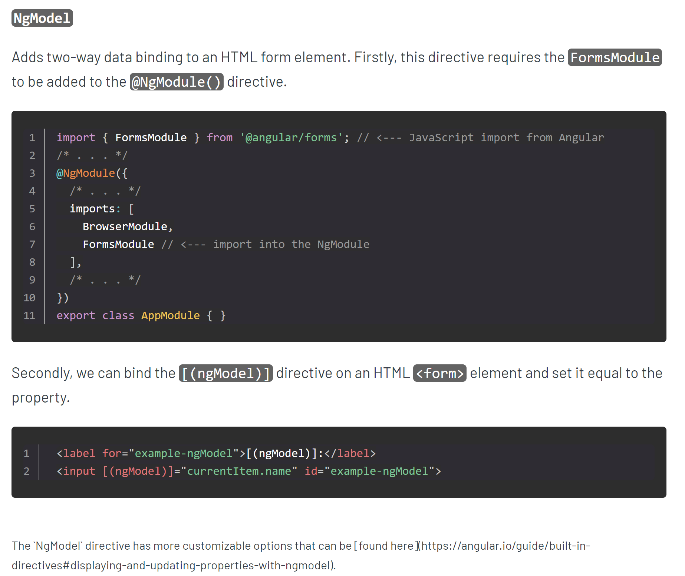

### Angular Cheat Sheet

1. https://github.com/delprzemo/angular-cheatsheet
2. https://angular.io/guide/cheatsheet
2. https://zerotomastery.io/cheatsheets/angular-cheat-sheet/
3. https://www.interviewbit.com/angular-cheat-sheet/

<details >
 <summary style="font-size: medium; font-weight: bold">Post API Call</summary>

```ts
import { HttpClient } from "@angular/common/http";
import { Injectable } from "@angular/core";
import { Observable } from "rxjs";
import { environment } from "src/environments/environment";

@Injectable({
  providedIn: "root",
})
export class EditRuleService {
  constructor(private http: HttpClient) {}

  editFirewallRule(ruleDetails): Observable<any> {
    return this.http.post<any>(
      environment.jobServiceBaseUrl + "/firewall/rule/edit",
      ruleDetails,
      {
        responseType: "text" as "json",
      }
    );
  }
}
```

---
</details>

<details >
 <summary style="font-size: medium; font-weight: bold">Two Way Binding</summary>




---
</details>

<details >
 <summary style="font-size: medium; font-weight: bold">Input and Output</summary>

**Input() To pass value into child component**

Sample child component implementation

```ts
export class SampleComponent {
	@Input() value: any/string/object/…;
	...
}
```

Sample parent component usage

```angular2html
<app-sample-component [value]="myValue"></app-sampe-component>
```


**Output() Emiting event to parent component**

Sample child component

```ts
@Output() myEvent: EventEmitter<MyModel> = new EventEmitter();
onRemoved(item: MyModel) {
	this.myEvent.emit(item);
}
```

Sample parent component

```angular2html
<app-my-component 
(myEvent)="someFunction()"></app-my-component>
```
onRemoved in child component is calling someFunction in parent component

---
</details>


<details >
 <summary style="font-size: medium; font-weight: bold">ViewChild decorator</summary>

In order to have access to child component/directive/element

```ts
@ViewChild(NumberComponent)
private numberComponent: NumberComponent;
increase() {
this.numberComponent.increaseByOne(); //method from child component
}
decrease() {
this.numberComponent.decreaseByOne();  //method from child component
}
```

```ts
@ViewChild(BiosVersionsComponent) biosVersionsComponent: BiosVersionsComponent;
```

---
</details>
