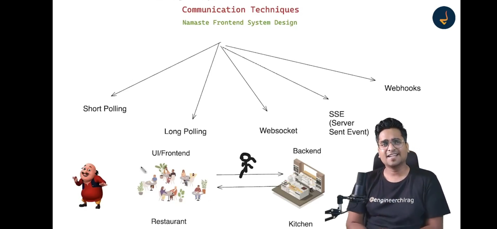
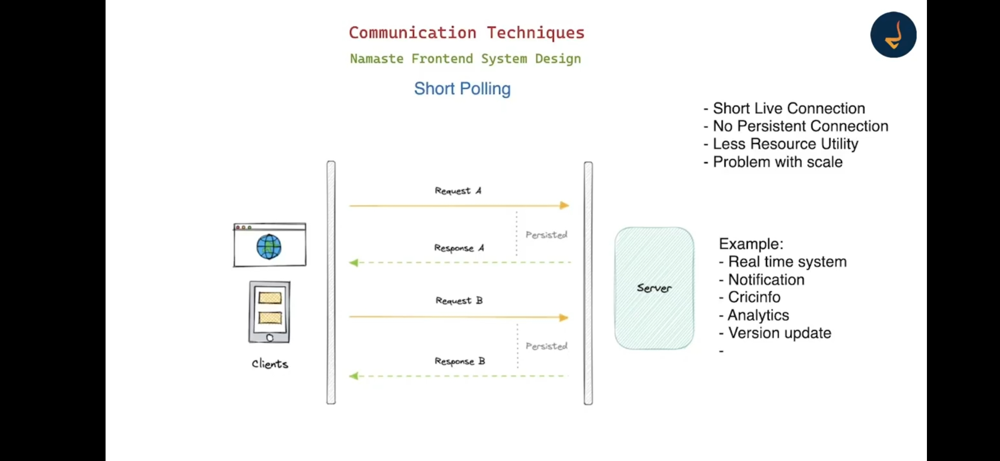
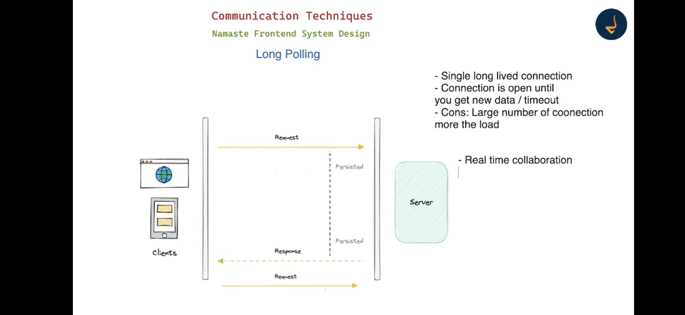
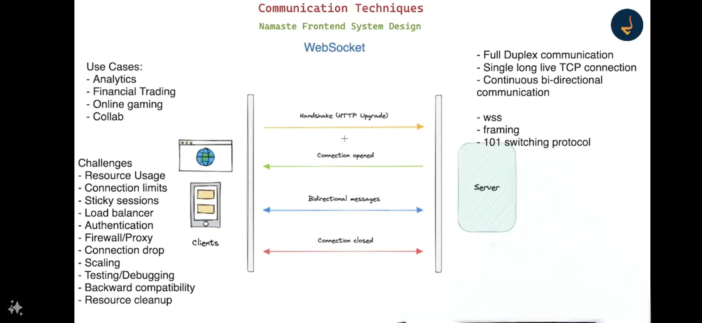
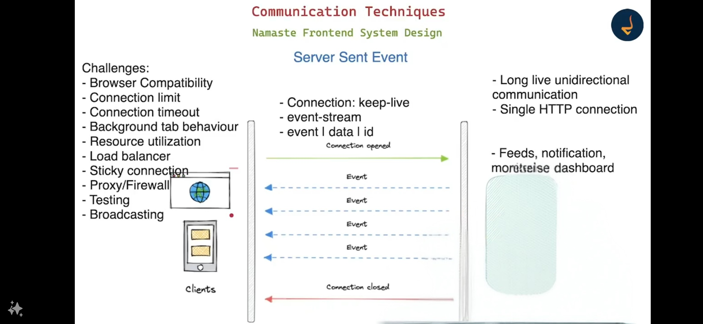
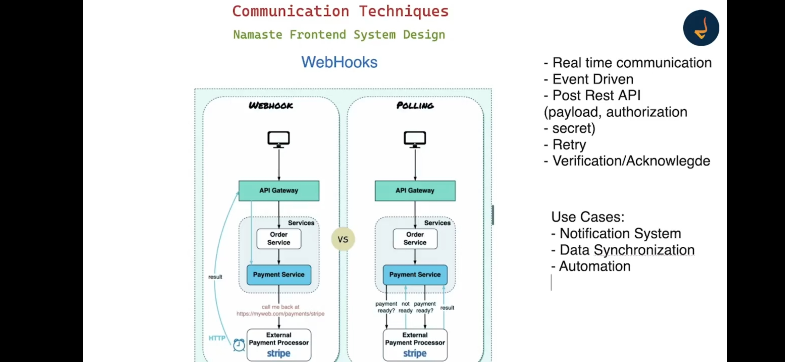
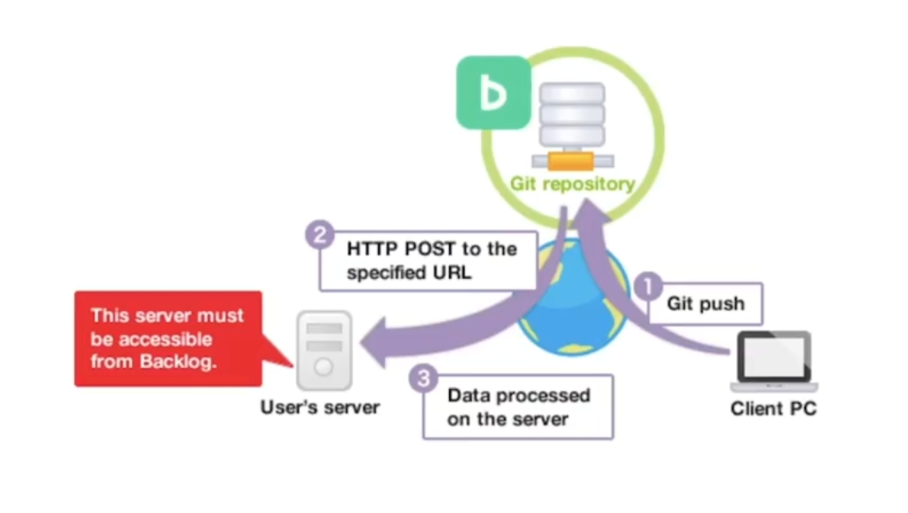
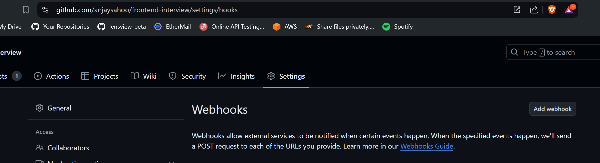
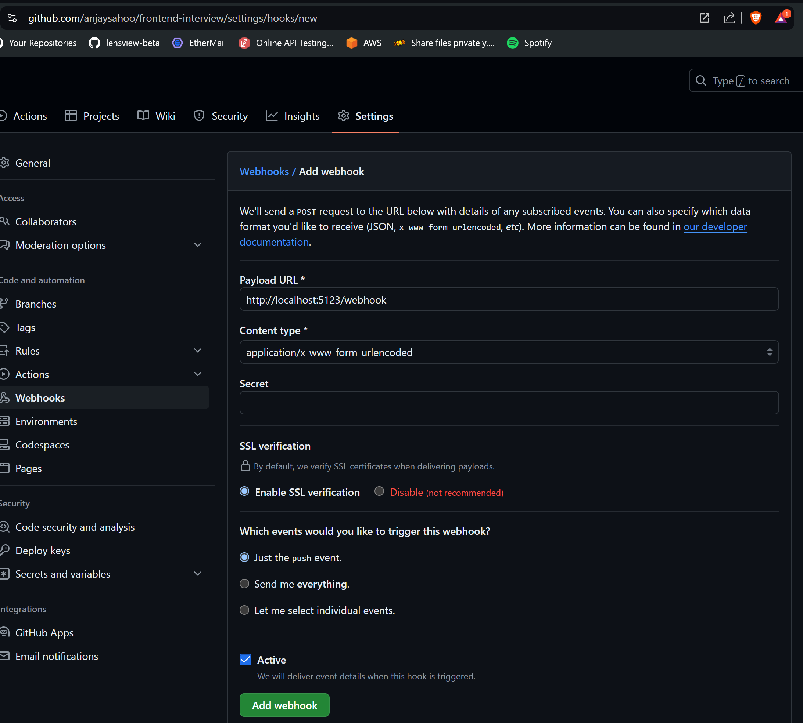

# Communication



<details >
 <summary style="font-size: large; font-weight: bold">Short Polling</summary>

Short polling is like you are giving order to waiter and he is bringing the order right away to you.
This will keep on happening until you stop giving order



- Always clear `setInterval` after you don't need it.
- For a small application, this is a fine approach, but for a large application where millions
  of calls are made to server it will have performance issue as many time we may not get things which we are
  expecting, and it will create an unnecessary burden on server

Backend
```js
const express = require('express');
const app = express();

let data = 'Initial Data';

app.get('/', (req, res) => {
  res.sendFile(__dirname + '/index.html');
});

app.get('/getData', (req, res) => {
  res.send({
    data
  });
});

// Use post/put to update
app.get('/updateData', (req, res) => {
  data = 'Updated Data';
  res.send({
    data
  })
})

const port = process.env.PORT || 5011;
app.listen(port, () => {
  console.log(`Server is running on port ${port}`);
});
```

Frontend
```html
<!DOCTYPE html>
<html lang="en">
<head>
  <meta charset="UTF-8">
  <meta name="viewport" content="width=device-width, initial-scale=1.0">
  <title>Short Polling Example</title>
</head>
<body>

<h1>Short Polling Example</h1>
<div id="data-container"></div>

<script>

    async function getData() {
      try {
        const response = await fetch('/getData');
        const result = await response.json();
        document.getElementById('data-container').innerHTML = result.data;
      } catch(e) {
        console.log(e);
      }
    }

    let intervalId;
    function shortPolling() {
      intervalId = setInterval(() => {
        getData();
      }, 5000);
    }

    shortPolling();

    // Navigation or user action or target condition
    // clearInterval(intervalId);
    
</script>

</body>
</html>
```

Complete Code: https://github.com/namastedev/namaste-frontend-system-design/tree/master/CommunicationTechniques/shortPolling


---
</details>


<details >
 <summary style="font-size: large; font-weight: bold">Long Polling</summary>

Long polling is like you have given the order and the waiter is standing in the kitchen till
the food is cooked. Once food is cooked, the waiter comes with the order. 



Usecase:
1. Payment processing where we ok to wait till the payment is processed
2. Google Docs where we're editing the document in collaboration mode, where we are ok to wait till
we receive any change from another user

Backend
```js
const express = require('express');
const app = express();

let data = 'Initial Data';

const waitingClients = [];

app.get('/', (req, res) => {
  res.sendFile(__dirname + '/index.html');
});

app.get('/getData', (req, res) => {
  if (data !== req.query.lastData) {
    res.json({ data });
  } else {
    waitingClients.push(res);
  }
});

// Use post/put to update
app.get('/updateData', (req, res) => {
  data = req.query.data;

  while(waitingClients.length > 0) {
    const client = waitingClients.pop();
    client.json({ data });
  }

  res.send({ success: 'Data updated successfully'})
})

const port = process.env.PORT || 5011;
app.listen(port, () => {
  console.log(`Server is running on port ${port}`);
});
```

Frontend
```html
<!DOCTYPE html>
<html lang="en">
<head>
  <meta charset="UTF-8">
  <meta name="viewport" content="width=device-width, initial-scale=1.0">
  <title>Long Polling Example</title>
</head>
<body>

<h1>Long Polling Example</h1>
<div id="data-container"></div>

<script>


    async function getData(lastData) {
      try {
        const response = await fetch(`/getData?lastData=${lastData}`);
        const result = await response.json();
        document.getElementById('data-container').innerHTML = result.data;
        getData(result.data);
      } catch(e) {
        console.log(e);
        // please handle error scenario
      }
    }

    getData();

    
</script>

</body>
</html>
```

Complete Code: https://github.com/namastedev/namaste-frontend-system-design/tree/master/CommunicationTechniques/longPolling

Step to check this long polling feature
1. Once you load application `Initial Data` is shown. This will be done instantly as there is no previous data
2. After we receive the data, one more request with current data is made.
3. This request will be in pending state, till someone update the `data` variable through `updateData` API
4. Once someone updates the data, this request will be fulfilled.
5. The Same thing keeps happening in the loop


---
</details>


<details >
 <summary style="font-size: large; font-weight: bold">Web Socket</summary>

Its like there is a direct connection between you and the kitchen. Order are given instantly to you with no delay


Backend
```js
const express = require('express');
const { createServer } = require('node:http');
const { join } = require('node:path');
const { Server } = require('socket.io');

const app = express();
const server = createServer(app);
const io = new Server(server);

app.get('/', (req, res) => {
  res.sendFile(join(__dirname, 'index.html'));
});

io.on('connection', (socket) => {
  console.log('Connection established');

  socket.on('chat message', (msg) => {
    console.log('received message', msg);
    io.emit('chat message', msg);
  });

  socket.on('disconnect', () => {
    console.log('User disconnected!');
  })
});

server.listen(3000, () => {
  console.log('server running at http://localhost:3000');
});
```

Frontend
```html
<!DOCTYPE html>
<html>
<head>
  <meta name="viewport" content="width=device-width,initial-scale=1.0">
  <title>Socket.IO chat</title>
  <style>
      body { margin: 0; padding-bottom: 3rem; font-family: -apple-system, BlinkMacSystemFont, "Segoe UI", Roboto, Helvetica, Arial, sans-serif; }

      #form { background: rgba(0, 0, 0, 0.15); padding: 0.25rem; position: fixed; bottom: 0; left: 0; right: 0; display: flex; height: 3rem; box-sizing: border-box; backdrop-filter: blur(10px); }
      #input { border: none; padding: 0 1rem; flex-grow: 1; border-radius: 2rem; margin: 0.25rem; }
      #input:focus { outline: none; }
      #form > button { background: #333; border: none; padding: 0 1rem; margin: 0.25rem; border-radius: 3px; outline: none; color: #fff; }

      #messages { list-style-type: none; margin: 0; padding: 0; }
      #messages > li { padding: 0.5rem 1rem; }
      #messages > li:nth-child(odd) { background: #efefef; }
  </style>
</head>
<body>
  <ul id="messages"></ul>
  <form id="form" action="">
    <input id="input" autocomplete="off" /><button>Send</button>
  </form>
  <script src="/socket.io/socket.io.js" ></script>
  <script>
    const socket = window.io();
    const form = document.getElementById('form');
    const input = document.getElementById('input');
    const messages = document.getElementById('messages');

    form.addEventListener('submit', (e) => {
      e.preventDefault();
      if (input.value) {
        console.log(input.value);
        //The Message is broadcast to all clients that are connected
        socket.emit('chat message', input.value);
        input.value = '';
      }
    });

    socket.on('chat message', (msg) => {
      const item = document.createElement('li');
      item.textContent = msg;
      messages.appendChild(item);
    });

  </script>
</body>
</html>
```

Full Code: https://github.com/namastedev/namaste-frontend-system-design/tree/master/CommunicationTechniques/webSocket

---
</details>


<details >
 <summary style="font-size: large; font-weight: bold">Server Sent Event</summary>



- It is only server sent event
- Connection Limit: There is limit to the number of connections you can have for each domain on your browser. So you can't create such multiple connection as it might affect other API call and performance will be decreased
- Background Tab behavior: Browser may not listen to the server sent events when a background tab is opened.

Backend
```js
const express = require('express');
const app = express();
const { join } = require('node:path');

app.get('/sse', (req, res) => {
  // setup sse logic
  res.setHeader('Content-Type', 'text/event-stream');
  res.setHeader('Cache-Control', 'no-cache');
  res.setHeader('Connection', 'keep-alive');
  
  res.write('data: Welcome to Server sent event \n\n');

  const intervalId = setInterval(() => {
    res.write(`data: Server Time ${new Date().toLocaleDateString()} \n\n`)
  }, 5000);

  req.on('close', () => {
    clearInterval(intervalId);
  })

});

app.get('/', (req, res) => {
    res.sendFile(join(__dirname, 'index.html'));
  });

const port = 3000;
app.listen(port, () => {
  console.log(`Server is running on http://localhost:${port}`);
});
```


Frontend(Vanilla JS)
```html
<!DOCTYPE html>
<html lang="en">
  <head>
    <meta charset="UTF-8" />
    <meta name="viewport" content="width=device-width, initial-scale=1.0" />
    <title>SSE Example</title>
  </head>
  <body>
    <h1>Server-Sent Events Example</h1>
    <div id="sse-data"></div>

    <script>
      // Setup sse connection
      const eventSource = new EventSource("/sse");

      eventSource.onmessage = (event) => {
        console.log(event.data);
        const sseDataRef= document.getElementById('sse-data');
        sseDataRef.innerHTML += `<p>${event.data}</p>`;
      };
    </script>
  </body>
</html>
```

Full code: https://github.com/namastedev/namaste-frontend-system-design/tree/master/CommunicationTechniques/sse

Frontend(React)
```jsx
const [data, setData] = useState<{ num: number } | null>();
useEffect(() => {
    const evtSource = new EventSource("http://localhost:4000/event-source");
    evtSource.onmessage = (event) => {
      if (event.data) {
        setData(JSON.parse(event.data));
      }
    };
}, []);
```

For good extensive explanation: https://www.greatfrontend.com/questions/quiz/what-are-server-sent-events?format=quiz
Referred from: https://dev.to/lagoni/how-to-implement-eventsource-and-sse-in-your-frontend-and-backend-18co

---
</details>


<details >
 <summary style="font-size: large; font-weight: bold">Webhooks</summary>



In this payment gateway example, when we make a payment using Webhook, we don't have 
to keep polling whether the payment is successful or not. Here we can pass API Endpoint, which 
payment gateway can call with the right payload and secret key. The Server then can verify the payment.



This can best explain through Github webhooks


Backend
```js
const express = require("express");
const bodyParser = require("body-parser");

const app = express();
const port = 3000;

app.use(bodyParser.json());

// Webhook endpoint
app.post("/webhook", (req, res) => {
  // Extract the payload from the incoming POST request
  const payload = req.body;

  // Log the received payload (you might want to process it in a more meaningful way)
  console.log("Received webhook payload:", payload);

  // Optionally, send a response to the sender to acknowledge receipt
  res.status(200).send("Webhook received successfully");
});


app.listen(port, () => {
  console.log(`Server is running on http://localhost:${port}`);
});
```



Here in Payload URL we can configure our server URL which
need to be called with the right payload and secret key.

---
</details>
