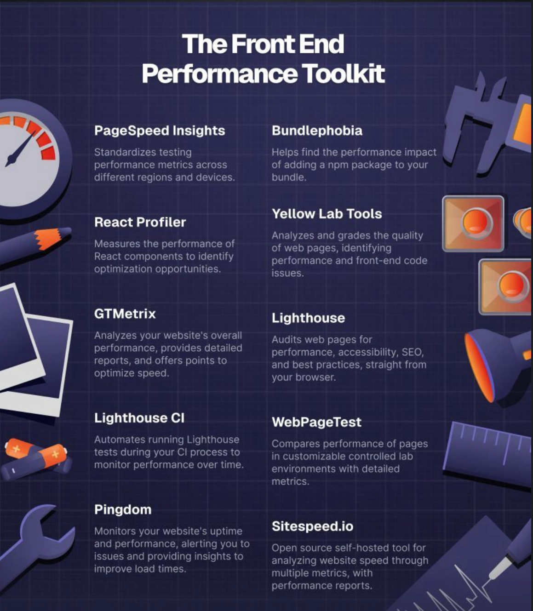
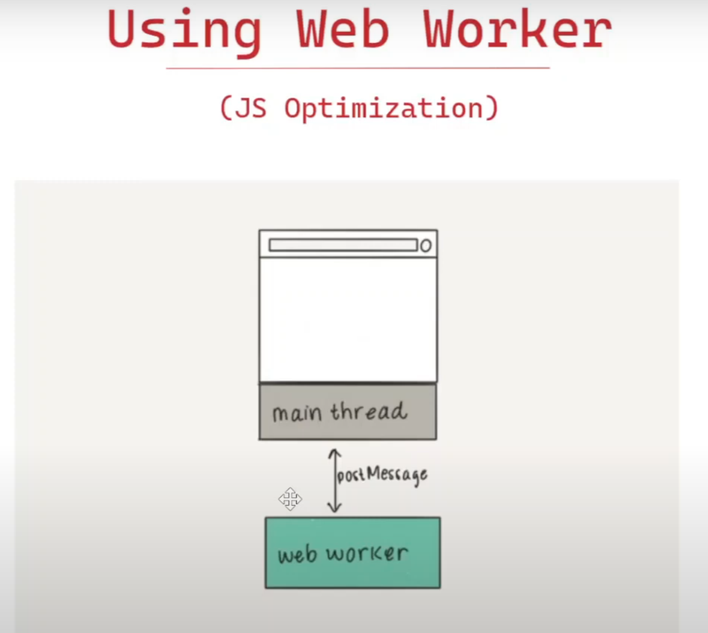
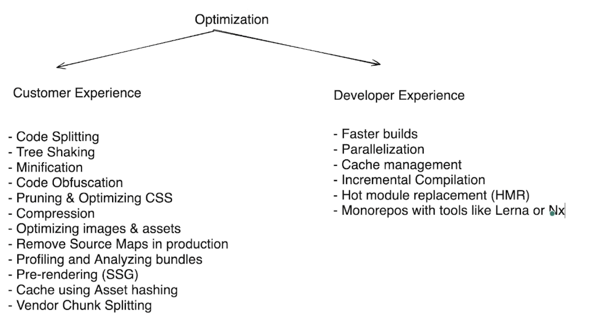

# Performance


Get lot of insights for performance from Cloudflare Radar: https://radar.cloudflare.com/quality


<details >
 <summary style="font-size: x-large; font-weight: bold">Performance Monitoring(Web Vitals)</summary>

https://web.dev/articles/vitals


`Interaction to Next Paint (INP)` was initially developed as an experimental metric to address the runtime performance issues present on the web more comprehensively than `First Input Delay (FID)`.


<details >
 <summary style="font-size: large; font-weight: bold">LCP(Largest Contentful Paint)</summary>

LCP reports the render time of the largest image or text block visible in the viewport, relative to when the user first navigated to the page.


In the first example, the Instagram logo is loaded relatively early and it remains the largest element even as other content is progressively shown. In the Google Search results page example, the largest element is a paragraph of text that is displayed before any of the images or logo finish loading. Since all the individual images are smaller than this paragraph, it remains the largest element throughout the load process.

---
</details>


<details >
 <summary style="font-size: large; font-weight: bold">CLS(Cumulative Layout Shift)</summary>

CLS is a measure of the largest burst of layout shift scores for every unexpected layout shift that occurs during the entire lifecycle of a page.


---
</details>


<details >
 <summary style="font-size: large; font-weight: bold">INP(Interaction to Next Paint)</summary>

INP is a metric that assesses a page's overall responsiveness to user interactions by observing the latency of all click, tap, and keyboard interactions that occur throughout the lifespan of a user's visit to a page. The final INP value is the longest interaction observed, ignoring outliers.


INP is the successor metric to First Input Delay (FID). While both are responsiveness metrics, FID only measured the input delay of the first interaction on a page. INP improves on FID by observing all interactions on a page, beginning from the input delay, to the time it takes to run event handlers, and finally up until the browser has painted the next frame.

---
</details>

Do this in browser using LightHouse


---
</details>


<details >
 <summary style="font-size: x-large; font-weight: bold">Performance Tools</summary>

### Real User Data Monitoring
1. [CRUX](https://developer.chrome.com/docs/crux)
2. [pagespeed.web.dev](https://pagespeed.web.dev/analysis/https-lensview-io/wn663h5be9?form_factor=mobile) (Free)
3. [requestmetrics.com](https://requestmetrics.com/)(Free)
4. [clarity.microsoft.com/](https://clarity.microsoft.com/)(Free)
4. NewRelic
5. Sentry
6. Google Analytics
7. PingDom: LensView result -> https://tools.pingdom.com/#64fef24db4000000


### Simulated Data
1. [webpagetest.org](https://www.webpagetest.org/result/240712_BiDcDP_2W9/)
   1. 


### Developer Mode 
1. LightHouse
   - Always used in Incognito mode, an installed extension might affect the result
   - Dock the dev tool section, as putting it in bottom or right side will affect screen size
   - Choose the right device (Mobile or Desktop) then start test
2. Network Tab
3. Performance Tab




---
</details>


<details >
 <summary style="font-size: x-large; font-weight: bold">Network Optimization</summary>

1. Critical Rendering Path
2. Minimize the number of HTTP requests
3. Async loading of JS: async / defer
4. Avoid Redirection
5. Resource Hinting
6. Early Hints
7. HTTP upgrade methods (http1.1 vs http2 vs http3)
8. Compression: brotli / gzip 
9. HTTP caching: Cache Control 
10. Caching using Service Worker

<details >
 <summary style="font-size: large; font-weight: bold">Critical Rendering Path</summary>

Go through the details how CRP works in [Networking section(How the web work -> CRP)](../09-networking/readme.md#disadvantage)


## _First packet is of 14KB_

- Above point is important as we can make our app such that all required bear minimum 
HTML, CSS & JS are bundle together whose size is below 14KB. This will allow our app
to show something to user very quickly then we can start putting other required files
in parallel.
- This might be straight forward in Vanilla JS project but framework also we have tools and plugin to achieve this

---
</details>


<details >
 <summary style="font-size: large; font-weight: bold">Minimize the number of HTTP requests</summary>

Challenges
- Connection Time(TCP, SSL): Each request we make has to go through the multiple connection like TCP, SSL etc which can take time and slow down our app
- Browser Limit per domain(6-10 max parallel calls can be made)

Solution
- Inline CSS
- Inline JS
- Base64 for image
- SVG for image

Here by applying above solution we trying to reduce network which can be costlier in terms of application performance

Example:

**Scenario-1:** 
- When we are loading our style is being loaded from file
- All the images are used as .png file


Here you can see how there are more network calls and because of this there quite gap between FCP & LCP


**Scenario-2:**
- When we insert the required CSS in head tag directly in `index.html`
- Replace all the images with SVG


Here we have only one network call and it is very fast. There is very little gap between FCP & LCP

We only need to add the required CSS, which is needed when the user first navigated to the page, and we have very fast LCP

---
</details>


<details >
 <summary style="font-size: large; font-weight: bold">Async loading of JS</summary>

For more details refer [HTML section](../01-html/readme.md)


```html
<!-- index.html -->
<head>
    <script src="index.js"></script>
</head>
<body>
...
</body>
```

```js
//index.js
function addListner() {
  document.querySelectorAll(".card").forEach((card) =>
    card.addEventListener("click", function () {
      alert("Hi");
    })
  );
}

// We will not get error even though JS file has ran before HTML loads
// because below line will add lister once window is loaded
window.onload = addListner;
```

**Scenario-1:**
Script tag with no special attributes


**Scenario-2:**
Script tag with `async` attribute


**Scenario-3:**
Script tag with `defer` attribute


---
</details>


<details >
 <summary style="font-size: large; font-weight: bold">Avoid Redirection</summary>

- Avoid redirection from http to https
- Use website https://hstspreload.org/ to register your domain. So that whenever we call our domain with http then this website takes care of redirection and our server never gets the https request


---
</details>


<details >
 <summary style="font-size: large; font-weight: bold">Resource Hinting</summary>


<details >
 <summary style="font-size: medium; font-weight: bold">Preconnect</summary>

The `preconnect` hint is used to establish a connection to another origin from where you are fetching critical resources. For example, you may be hosting your images or assets on a CDN or other cross-origin:

```html
<head>
   <link rel="preconnect" href="https://cdn.glitch.global" /<
</head>
```


https://learn-performance-resource-hints.glitch.me/1

A common use case for preconnect is Google Fonts.

```html
<link rel="preconnect" href="https://fonts.googleapis.com">
<link rel="preconnect" href="https://fonts.gstatic.com" crossorigin>
```
The crossorigin attribute is used to indicate whether a resource must be fetched using Cross-Origin Resource Sharing (CORS). When using the preconnect hint, if the resource being downloaded from the origin uses CORS—such as font files—then you need to add the crossorigin attribute to the preconnect hint.

**Note:** If you omit the `crossorigin` attribute, the browser opens a new connection when it downloads the font files, and doesn't reuse the connection opened with the `preconnect` hints.

https://web.dev/learn/performance/resource-hints?continue=https%3A%2F%2Fweb.dev%2Flearn%2Fperformance%23article-https%3A%2F%2Fweb.dev%2Flearn%2Fperformance%2Fresource-hints#preconnect

---
</details>


<details >
 <summary style="font-size: medium; font-weight: bold">dns-prefetch</summary>

While opening connections to cross-origin servers early can significantly improve initial page load time, it may not be either reasonable or possible to establish connections to many cross-origin servers at once. If you're concerned that you may be overusing preconnect, a much less costly resource hint is the dns-prefetch hint.

Per its name, dns-prefetch doesn't establish a connection to a cross-origin server, but rather just performs the DNS lookup for it ahead of time. A DNS lookup occurs when a domain name is resolved to its underlying IP address. While layers of DNS caches at the device and network levels help to make this a generally fast process, it still takes some amount of time.

```html
<link rel="dns-prefetch" href="https://fonts.googleapis.com">
<link rel="dns-prefetch" href="https://fonts.gstatic.com">
```

DNS lookups are fairly inexpensive, and because of their relatively small cost, they may be a more appropriate tool in some cases than a preconnect. In particular, it may be a desirable resource hint to use in cases of links that navigate to other websites that you think the user is likely to follow. dnstradamus is one such tool that does this automatically using JavaScript, and uses the Intersection Observer API to inject dns-prefetch hints into the current page's HTML when links to other websites are scrolled into the user's viewport.

https://web.dev/learn/performance/resource-hints?continue=https%3A%2F%2Fweb.dev%2Flearn%2Fperformance%23article-https%3A%2F%2Fweb.dev%2Flearn%2Fperformance%2Fresource-hints#dns-prefetch

---
</details>


<details >
 <summary style="font-size: medium; font-weight: bold">Preload</summary>

The `preload` resource hint instructs the browser to initiate a request for a resource. This is helpful when a critical resource is not immediately discoverable, for example a `background-image` URL.

This demo uses uses CSS `background-image` to create the image grid below, as opposed to `img` elements. To download the first image quicker, the page includes a `preload` hint for the first image resource.


```html
<link rel="preload"
      href="https://cdn.glitch.global/db01a8e4-9230-4c5c-977d-85d0e0c3e74c/image-1.jpg?v=1669198400523"
      as="image" />
```


https://learn-performance-resource-hints.glitch.me/3

### Usecase👇🏻


`preload` directives should be limited to late-discovered critical resources. The most common use cases are font files, CSS files fetched through `@import` declarations, or CSS `background-image` resources that are likely to be `Largest Contentful Paint (LCP)` candidates. In such cases, these files wouldn't be discovered by the `preload scanner` as the resource is referenced in external resources.


https://web.dev/learn/performance/resource-hints?continue=https%3A%2F%2Fweb.dev%2Flearn%2Fperformance%23article-https%3A%2F%2Fweb.dev%2Flearn%2Fperformance%2Fresource-hints#preload

---
</details>


<details >
 <summary style="font-size: medium; font-weight: bold">Prefetch</summary>

The prefetch directive is used to initiate a low priority request for a resource likely to be used for future navigations:

```html
<link rel="prefetch" href="/next-page.css" as="style">
```
This directive largely follows the same format as the `preload` directive, only the `<link>` element's rel attribute uses a value of `prefetch` instead. Unlike the `preload` directive, however, `prefetch` is largely speculative in that you're initiating a fetch for a resource for a future navigation that may or may not happen.

There are times when `prefetch` can be beneficial—for example, if you've identified a user flow on your website that most users follow to completion, a `prefetch` for a render-critical resource for those future pages can help to reduce load times for them.

Note: Given the speculative nature of prefetch, its use comes with the potential downside that data used to fetch the resource may go unused if the user does not navigate to the page that ends up needing the prefetched resource. Rely on your analytics or other data sources for your website's usage patterns to decide for yourself if using prefetch is a good idea. Alternatively, you can use the Save-Data hint to opt out of prefetches for users who have specified a preference for reduced data usage

https://web.dev/learn/performance/resource-hints?continue=https%3A%2F%2Fweb.dev%2Flearn%2Fperformance%23article-https%3A%2F%2Fweb.dev%2Flearn%2Fperformance%2Fresource-hints#prefetch

---
</details>


<details >
 <summary style="font-size: medium; font-weight: bold">Fetchpriority</summary>

You can use the `Fetch Priority API` through its fetchpriority attribute to increase the priority of a resource. You can use the attribute with `<link>`, ``, and `<script>` elements.

This demo assigns a fetchpriority="high" to the first, larger image, while a fetchpriority="low" to the remaining images.


https://learn-performance-resource-hints.glitch.me/5

By default, images are fetched with a lower priority. After layout, if the image is found to be within the initial viewport, the priority is increased to **High** priority. In the preceding HTML snippet, fetchpriority immediately tells the browser to download the larger LCP image with a **High** priority, while the less important thumbnail images are downloaded with a lower priority.

Modern browsers load resources in two phases. The first phase is reserved for critical resources and ends once all blocking scripts have been downloaded and executed. During this phase, **Low** priority resources may be delayed from downloading. By using `fetchpriority="high"` you can increase the priority of a resource, enabling the browser to download it during the first phase.

https://web.dev/learn/performance/resource-hints?continue=https%3A%2F%2Fweb.dev%2Flearn%2Fperformance%23article-https%3A%2F%2Fweb.dev%2Flearn%2Fperformance%2Fresource-hints#fetch_priority_api

---
</details>


---
</details>

<details >
 <summary style="font-size: large; font-weight: bold">Early Hints</summary>

Websites have become more sophisticated over time. As such, it's not unusual that a server needs to perform non-trivial work (for example, access to databases, or CDNs accessing the origin server) to produce the HTML for the requested page. Unfortunately, this "server think-time" results in extra latency before the browser can start rendering the page. Indeed, the connection effectively goes idle for as long as it takes the server to prepare the response


Early Hints is an HTTP status code (`103 Early Hints`) used to send a preliminary HTTP response ahead of a final response. This allows a server to send hints to the browser about critical subresources (for example, style sheets for the page, critical JavaScript) or origins that will be likely used by the page, while the server is busy generating the main resource. The browser can use those hints to warm up connections, and request subresources, while waiting for the main resource. In other words, Early Hints helps the browser take advantage of such "server think-time" by doing some work in advance, thereby speeding up page loads.


In some cases, the performance improvement to the Largest Contentful Paint can go from several hundred milliseconds, as observed by Shopify and by Cloudflare, and up to a second faster, as seen in this before and after comparison:


https://developer.chrome.com/docs/web-platform/early-hints#:~:text=The%20browser%20can%20use%20those,thereby%20speeding%20up%20page%20loads.

---
</details>


<details >
 <summary style="font-size: large; font-weight: bold">HTTP upgrade methods</summary>


- HTTP 1.0 was finalized and fully documented in 1996. Every
  request to the same server requires a separate TCP connection.

- HTTP 1.1 was published in 1997. A TCP connection can be left
  open for reuse (persistent connection), but it doesn’t solve the HOL
  (head-of-line) blocking issue.
   - **HOL blocking** - when the number of allowed parallel requests in the
     browser is used up, subsequent requests need to wait for the former
     ones to complete.
     53

- HTTP 2.0 was published in 2015. It addresses HOL issue through
  request multiplexing, which eliminates HOL blocking at the application
  layer, but HOL still exists at the transport (TCP) layer.
  As you can see in the diagram, HTTP 2.0 introduced the concept of
  HTTP “streams”: an abstraction that allows multiplexing different HTTP
  exchanges onto the same TCP connection. Each stream doesn’t need
  to be sent in order.

- HTTP 3.0 first draft was published in 2020. It is the proposed
  successor to HTTP 2.0. It uses QUIC instead of TCP for the underlying
  transport protocol, thus removing HOL blocking in the transport layer.
  QUIC is based on UDP. It introduces streams as first-class citizens at
  the transport layer. QUIC streams share the same QUIC connection,
  so no additional handshakes and slow starts are required to create
  new ones, but QUIC streams are delivered independently such that in
  most cases packet loss affecting one stream doesn't affect others.

Referred Video: https://www.youtube.com/watch?v=a-sBfyiXysI&t=2s


Two main factors dictate which HTTP version will be used for a website:

1. **Server Configuration:** The web server software that hosts the website plays a crucial role. The server administrator configures it to support specific HTTP versions (e.g., HTTP/1.1, HTTP/2). A website can only use a version that the server actively supports.

2. **Client Capabilities:** The web browser or client application used to access the website also has its part. Modern browsers typically support the latest HTTP versions (e.g., HTTP/2). However, older browsers might be limited to earlier versions (e.g., HTTP/1.1).

Here's how the negotiation happens:

* When you try to access a website, your browser initiates a connection with the server.
* The server sends a response header that includes information about the supported HTTP versions.
* The browser checks its own capabilities and negotiates the highest mutually supported version for optimal communication.

In most cases, with modern browsers and up-to-date servers, you'll automatically use the most efficient HTTP version available.


#### HTTP/2 & HTTP/3 both need https connection.

Therefore we need to setup our server with SSL certificate to enable `https` connection, then
we use library `spdy` on express server to setup HTTP/2

Below is small example to see this in action

#### HTTP/1.1
When using HTTP/1.1, browsers impose a per-domain limit of 6-8 connections, depending on the browser implementation. This allows at most 6-8 concurrent requests per domain.


#### HTTP/2
With the HTTP/2 protocol, browsers have to open only 1 connection per domain. However, thanks to its multiplexing feature, HTTP/2 does not quite raise the limit, but simply removes the theoretical limit on the number of concurrent requests per domain.

It is virtually unlimited in the sense that browsers and servers may limit the number of concurrent requests via the HTTP/2 configuration parameter called SETTINGS_MAX_CONCURRENT_STREAMS.

In practice, typical limits are around 100 but could be larger (or, less commonly, smaller), depending on browser implementation and on the server you connect to


All request are done in parallel in HTTP/2.


```js
//index.js

const express = require("express");
const spdy = require('spdy');
const fs = require("fs");


const PORT = 3010;
const app = express();

app.use(express.static('public'));

app.get('/', (req, res) => {
   console.log(req.url);
   res.sendFile(__dirname + '/index.html');
});

const CERT_DIR = `${__dirname}/cert`;

const server = spdy.createServer(
        {
           key: fs.readFileSync(`${CERT_DIR}/server.key`),
           cert: fs.readFileSync(`${CERT_DIR}/server.cert`),
        },
        app
);

server.listen(PORT, () => {
   console.log(`Server started at https://localhost:${PORT}`);
});
```

Complete code: https://github.com/namastedev/namaste-frontend-system-design/tree/master/Performance/Network%20Optimization/example4


---
</details>


<details >
 <summary style="font-size: large; font-weight: bold">Compression: brotli / gzip</summary>

Brotli is a newer compression algorithm which can provide even better text compression results than gzip. According to CertSimple, Brotli performance is:

- `14% smaller than gzip` for JavaScript
- `21% smaller than gzip` for HTML
- `17% smaller than gzip` for CSS

1. To use Brotli, your server must support **HTTPS**. 
2. Brotli is supported in the latest versions of most browsers. 
Browsers that support Brotli will include br in Accept-Encoding headers:
   `Accept-Encoding: gzip, deflate, br`


To know how to set things up: https://web.dev/articles/codelab-text-compression-brotli

---
</details>


<details >
 <summary style="font-size: large; font-weight: bold">Caching</summary>

- Use Cache Policy(cache-control, expire, etag, last-modified)
- Service Worker
To know more refer Database module

---
</details>


---
</details>


<details >
 <summary style="font-size: x-large; font-weight: bold">Rendering Pattern</summary>


In Short all rendering pattern: https://www.youtube.com/watch?v=Dkx5ydvtpCA

One of the main aims of all rendering patterns is to optimize how we ship and execute JS on the client side. More JS means less performant website.


For more detailed description of below content go through this article: https://www.debugbear.com/blog/server-side-rendering
<details >
 <summary style="font-size: large; font-weight: bold">Client Side Rendering(CSR)</summary>

### What is Rendering?

In web development, rendering means the process of converting application code into interactive web pages. The page HTML is generated by a JavaScript engine. With client-side rendering, this is always done on the frontend. The browser then takes the generated HTML to visually render the page.
We get the dynamic part by hitting API during a render period. This can be done server-side or user-side.


- If you use client-side rendering, it’s the user’s browser that generates the entire app, including the `user interface (UI)`, `data`, and `functionality`. No server is involved in the process, except to store the client-side code and data and transfer it to the browser.

- In CSR apps, the HTML file only contains a blank `root` (often also named `app`) element and a `script` tag. The root element is populated by the browser that downloads and processes the JavaScript bundle to render all the other elements:

```html
<!doctype html>
<html lang="en">
  <head>
    <meta charset="UTF-8" />
    <title>CSR</title>
  </head>
  <body>
    <div id="root"><!-- blank --></div>
    <script src="/bundle.js"></script>
  </body>
</html>
```

- Since the browser needs to download and run the whole application code before the content appears on the screen, the first page load is usually slow with client-side rendering (server-side rendering splits this process between the client and server).

- As a result, users see a blank screen or loading spinner for a relatively long time. This leads to a poorer user experience and higher bounce rates (see Google’s discussion of how page load time impacts bounce rates).


---
</details>


<details >
 <summary style="font-size: large; font-weight: bold">Server Side Rendering(SSR)</summary>

- Server-side rendering, also known as universal or isomorphic rendering
-  SSR generates the static HTML markup on the server using a backend runtime such as Node.js that can run the JavaScript code to build the UI components.


All HTML elements inside the root element were rendered on the server:

```html
<!doctype html>
<html lang="en">
  <head>
    <meta charset="UTF-8" />
    <title>SSR</title>
  </head>
  <body>
    <div id="root">
      <div class="container">
        <h2>Stay Updated</h2>
        <form method="post">
          <input
            type="email"
            name="email"
            placeholder="Enter your email"
            required
          />
          <button type="submit">Subscribe</button>
        </form>
      </div>
    </div>
    <script src="/bundle.js"></script>
  </body>
</html>
```

### Steps in the server-side rendering process

**An SSR app processes the same JavaScript code on both the client and server side — this is why it’s also called universal rendering.**


1. **Client’s HTTP request** – When the user enters the URL into the browser’s address bar, it establishes an HTTP connection with the server, then sends the server a request for the HTML document.
2. **Data fetching** – The server fetches any required data from the database or third-party APIs.
3. **Server-side pre-rendering** – The server compiles the JavaScript components into static HTML.
4. **Server’s HTTP response** – The server sends this HTML document to the client.
5. **Page load and rendering** – The client downloads the HTML file and displays the static components on the page.
6. **Hydration** – The client downloads the JavaScript file(s) embedded into the HTML, processes the code, and attaches event listeners to the components. This process is also called hydration or rehydration.

Note that the flowchart below starts with Step 4 when the browser gets the server’s response:


Universal JavaScript code that also runs on the server side
- React uses the `ReactDomServer` object together with the `hydrateRoot()` method.
- Vue has a `createSSRApp()` method and a corresponding server-side rendering API.
- Angular has its in-house server-side rendering tool called `Angular Universal`.

### Advantages
1. **SEO:** These days, search engine bots can easily crawl static HTML, but they still tend to have problems with indexing JavaScript-generated content. Even though Google can now index synchronous JavaScript, JavaScript SEO is a complicated question with several drawbacks such as delays in JavaScript indexing.
2. Faster initial page loads
3. **Faster Largest Contentful Paint (LCP):**  As the largest content element (either an image or text block) is part of the static content your server pre-renders, SSR will display it faster on the screen.
4. **Lower Cumulative Layout Shift (CLS):** With server-side rendering, the browser doesn’t have to go over the rendering process step by step, which typically results in fewer random layout shifts and, therefore, better CLS scores.
5. **Fewer issues with social media indexing:** For example, Facebook’s Open Graph Protocol and Twitter Cards don’t support client-side rendering.
6. **Better for accessibility:** As the server sends pre-rendered content to the browser, SSR apps are more suitable for people who use older devices with less powerful CPUs.
7. **Data Fetching:** Server Components allow you to move data fetching to the server, closer to your data source. This can improve performance by reducing time it takes to fetch data needed for rendering, and the number of requests the client needs to make.
8. **Security:** Server Components allow you to keep sensitive data and logic on the server, such as tokens and API keys, without the risk of exposing them to the client. 
9. **Caching:** By rendering on the server, the result can be cached and reused on subsequent requests and across users. This can improve performance and reduce cost by reducing the amount of rendering and data fetching done on each request.
10. **Streaming:** Server Components allow you to split the rendering work into chunks and stream them to the client as they become ready. This allows the user to see parts of the page earlier without having to wait for the entire page to be rendered on the server.
11. **Bundle Size:** We can reduce bundle size of our app by moving part of code which uses bigger library to server and get the outcome from server.


### Disadvantages
1. If you have any API which takes more time to load, then client will not recieve anything until that API call is made, slow API act like bottleneck.
This will increase LCP(Largest Contentful Paint).
2. Increased complexity
3. **Potentially higher First Input Delay (FID):** With server-side rendering, the browser displays static content faster (which leads to a better LCP), but it still needs time to hydrate the application. As a result, the app looks ready for interaction while the code is still being processed in the background. If the user tries to interact with the app during this period of time, there will be a delay in the browser’s response.
4. **Less efficient caching:** With client-side rendering, you can speed up your app by taking full advantage of browser caching. The initial page HTML is the same for all pages, so you can cache it and load it from a content delivery network (CDN) along with the JavaScript code.With server-side rendering, the page HTML is different for each page, so it’s harder to cache this on a CDN.
5. **Higher costs:** As client-side apps don’t need a server, you can deploy them to a free or cheap static storage service such as Netlifly or Amazon S3. However, you’ll need to pay for a server or at least a “serverless” backend to deploy an SSR application, which means higher running costs.


#### Nextjs14 code -> Use `getServerSideProps` for making route SSR
```js
import Image from 'next/image';

const Tutorials = ({ video }) => {
  return (
      <li className='mb-6'>
        <a
          href={`https://www.youtube.com/watch?v=${video.id}`}
          target='_blank'
          rel='noopener noreferrer'
          className='hover:opacity-80'
        >
          <Image
            src={video.image}
            alt={video.title}
            width={420}
            height={200}
            className='mb-4 rounded-md'
          />
          <h4>{video.title}</h4>
          <div>
            {video.views} &bull; {video.published}
          </div>
        </a>
      </li>
  )
}

export default function Home({ videos }) {
  return (
    <>
    <h1>Tutorials</h1>
    <ul>
        {videos?.map((video, index) => (
          <Tutorials video={video} key={index} />
        ))}
      </ul>
    </>
  )
}

// This gets called on every request
export async function getServerSideProps() {
  // Fetch data from external API
  // await new Promise((resolve) => setTimeout(resolve, 3000))
  const res = await fetch('http://localhost:4000/tutorials');
  const videos = await res.json()
  // Pass data to the page via props
  return { props: { videos } }
}
```

---
</details>


<details >
 <summary style="font-size: large; font-weight: bold">Static Site Generation(SSG)</summary>

During the build time itself all the data will be fetched from API and rendered final HTML is generated
which served whenever we access the page. Even something got changed after that like new images or any data updated,
those thing won't be reflected on the page. It will just show the same content which there during the build time.


#### Nextjs14 code -> Use `getStaticProps` for making route SSG
```js
import Image from 'next/image';

const Tutorials = ({ video }) => {
  return (
      <li className='mb-6'>
        <a
          href={`https://www.youtube.com/watch?v=${video.id}`}
          target='_blank'
          rel='noopener noreferrer'
          className='hover:opacity-80'
        >
          <Image
            src={video.image}
            alt={video.title}
            width={420}
            height={200}
            className='mb-4 rounded-md'
          />
          <h4>{video.title}</h4>
          <div>
            {video.views} &bull; {video.published}
          </div>
        </a>
      </li>
  )
}

export default function Home({ videos }) {
  return (
    <>
    <h1>Tutorials</h1>
    <ul>
        {videos?.map((video, index) => (
          <Tutorials video={video} key={index} />
        ))}
      </ul>
    </>
  )
}

// This gets called on every request
export async function getStaticProps() {
  // Fetch data from external API
  await new Promise((resolve) => setTimeout(resolve, 3000))
  const res = await fetch('http://localhost:4000/tutorials');
  const videos = await res.json()
  // Pass data to the page via props
  return { props: { videos } }
}
```

---
</details>


<details >
 <summary style="font-size: large; font-weight: bold">React Server Component(RSC)</summary>

Read full details about RSC here: https://vercel.com/blog/understanding-react-server-components


---
</details>


<details >
 <summary style="font-size: large; font-weight: bold">Qwik(Resumability)</summary>


Short Video from Fireship: https://www.youtube.com/watch?v=x2eF3YLiNhY
Must read article to understand `Hydration` & `Resumability`: https://www.builder.io/blog/hydration-is-pure-overhead


The hard part of hydration is knowing `WHAT` event handlers we need and `WHERE` they need to be attached.

- `WHAT`: The event handler is a closure that contains the behavior of the event handler. It is what should happen if a user triggers this event.
- `WHERE`: The location of the DOM element where the WHAT needs to be attached to (includes the event type.)

The added complication is that WHAT is a closure that closes over APP_STATE and FRAMEWORK_STATE:

- `APP_STATE`: the state of the application. APP_STATE is what most people think of as the state. Without APP_STATE, your application has nothing dynamic to show to the user.
- `FRAMEWORK_STATE`: the internal state of the framework. Without FRAMEWORK_STATE, the framework does not know which DOM nodes to update or when the framework should update them. Examples are component-tree, and references to render functions.


Hydration is recovering event handlers by downloading and re-executing all components in the SSR/SSG-rendered HTML. The site is sent to the client twice, once as HTML, and again as JavaScript. Additionally, the framework must eagerly execute the JavaScript to recover `WHAT`, `WHERE`, `APP_STATE`, and `FRAMEWORK_STATE`. All this work just to retrieve something the server already had but discarded!


---
</details>


---
</details>


<details >
 <summary style="font-size: x-large; font-weight: bold">Assets Optimization</summary>

<details >
 <summary style="font-size: large; font-weight: bold">Image Optimization</summary>

```html
<picture>
  <source 
    type="image/avif"
    srcset="/image.avif?width=100 100w, /image.avif?width=200 200w, /image.avif?width=400 400w, /image.avif?width=800 800w" />
  <source 
    type="image/webp"
    srcset="/image.webp?width=100 100w, /image.webp?width=200 200w, /image.webp?width=400 400w, /image.webp?width=800 800w" />
  
</picture>
```

1. **For high priority images:**
The above image is a good default, and best for images that may be below the fold ((that is, images that will be in the browser’s viewport immediately on first load)).

For your highest priority images, you should remove loading="lazy" and decoding="async" and consider adding fetchpriority="high" if this is your absolute highest priority image, like your LCP image:

2. **For vectors (like SVGs):**

Also, for vector formats such as SVG, we don't need to provide multiple sizes and formats, and can just include the below:
```html
<!-- for SVG -->

```

Note that we completely removed the <picture> and <source> tags, as well as removed the srcset and sizes attributes, as they are no longer needed.

For high priority SVGs, the same rules mentioned above apply (remove loading and decoding, and optionally add fetchpriority="high" for your LCP image)

3. **An easier way**
These days, you almost never need write all of that stuff by hand. Frameworks like NextJS and Qwik, as well as platforms like Cloudinary and Builder.io, provide image components that make this straightforward, and look instead like the below:

```html
<!-- 😍 -->
<Image 
  src="/image.png" 
  alt="Builder.io drag and drop interface" />
```

Referred article: https://www.builder.io/blog/fast-images
<br/>
Referred Video: https://youtu.be/9JDlZxR8gVw?si=qHDyy-zadGpeBGCs&t=336


<details >
 <summary style="font-size: medium; font-weight: bold">1. Why you should (generally) avoid `background-image` in CSS</summary>

```css
/* 🚩 */
.hero {
  background-image: image-set(url("/image-1x.png") 1x, url("/image-2x.png") 2x);
}
```

1. Outside of using SVGs, there's virtually no case where every visitor to your site should receive the exact same image file, given the vast amount of screen sizes and resolutions individuals have these days.
2. We could write some bloated CSS that combined media queries and image-set
3. With an image tag, you have the link to the src right in the HTML. So the browser can fetch the initial HTML, scan for images, and begin fetching high-priority images immediately.
4. you can work around some things, like inlining CSS, preloading images, and pre-connecting to origins. But, as you read on, you will see additional advantages you get with the HTML `img` tag that you sadly don’t get with `background-image` in CSS.

5. When to consider a background image
   1.  For instance, if you have a very small image you want to tile with `background-repeat` , there isn’t an easy way to accomplish repeating (that I know of) with img tags.
   2.  But for any image that is larger than, say, 50px, I would highly suggest avoiding setting it in CSS and instead using an img tag for virtually everything.


---
</details>


<details >
 <summary style="font-size: medium; font-weight: bold"> 2. Browser-native lazy loading</summary>


1. As now your visitors won’t automatically download images that are not even in the viewport for `loading='lazy'`.
2. `loading='eager'` will fetch the images on high priority
3.  Ideally, do not lazy load images “above the fold” (that is, images that will be in the browser’s viewport immediately on first load). That will help ensure your most critical images load as soon as possible, and all others will load only as needed.


---
</details>


<details >
 <summary style="font-size: medium; font-weight: bold">3. Optimal sizing for all screen sizes and resolutions</summary>


```html

```

1. One important thing to note is that this is a more powerful version than you get with `image-set` in CSS, because you can use the `w unit` in an `img` `srcset`.
2. What is useful about it is that it takes both size and resolution into account. So, if the image is currently displaying `200px` wide, on a `2x pixel density` device, with the above `srcset` the browser will know to grab the `400w` image (that is, the image that is `400px` wide, so it displays perfectly at `2x pixel density`). Similarly, the same image on a `1x pixel density` image will grab the `200w` image.


---
</details>


<details >
 <summary style="font-size: medium; font-weight: bold">4. Modern formats with the `picture` tag</summary>


- **Most Optimized Image Formates: AVIF > WebP > PNG**
  So it is always good to check if browser support these than use most optimized one.

- Inside the `<picture>` tag we can define these format and based on browser support first most
  optimized one will be used, otherwise fallback to the next one.

```html
<picture>
  <source 
    type="image/avif"
    srcset="/image.avif?width=100 100w, /image.avif?width=200 200w, /image.avif?width=400 400w, /image.avif?width=800 800w, ...">
  <source 
    type="image/webp"
    srcset="/image.webp?width=100 100w, /image.webp?width=200 200w, /image.webp?width=400 400w, /image.webp?width=800 800w, ...">
  
</picture>
```

---
</details>


<details >
 <summary style="font-size: medium; font-weight: bold">5. Don’t forget the `aspect-ratio`</summary>

1. It’s important to keep in mind that we also want to avoid layout shifts. This happens when an image loads if you don’t specify a precise size for the image ahead of the image downloading. There are two ways you can accomplish this.
   1. The first is to specify a `width` and `height` attribute for your image. And optionally, but often a good idea, set the images `height` to `auto` in CSS so that the image is properly responsive as the screen size changes:
   ```html
        
   ```
   2. Alternatively, you can also just use the newer `aspect-ratio` property in CSS to always have the right aspect ratio automatically. With this option, you don’t need to know the exact width and height of your image, just its aspect ratio:
   ```html
    
   ```
2. `aspect-ratio` also pairs great with `object-fit` and `object-position`, which are quite similar to `background-size` and `background-position` for background images, respectively.

```css
.my-image {
    aspect-ratio: 5 / 3;
    width: 100%;
    /* Fill the available space, even if the 
       image has a different intrinsic aspect ratio */
    object-fit: cover;
}
```

---
</details>


<details >
 <summary style="font-size: medium; font-weight: bold">6. Async image decoding</summary>

Additionally, you can specify decoding="async" to images to allow the browser to move the image decoding off of the main thread. MDN recommends to [use this for off-screen images.](https://developer.mozilla.org/en-US/docs/Web/API/HTMLImageElement/decoding#usage_notes)
```html

```

---
</details>


<details >
 <summary style="font-size: medium; font-weight: bold">7. Resource hints</summary>

1. One last, and more advanced option, is `fetchpriority`. This can be helpful to hint to the browser if an image is extra high priority, such as your LCP image.
2. Or, to lower the priority of images, such as if you have images that are above the fold but not of high importance, such as on other pages of a carousel:
````html
<div class="carousel">
  
  
  
</div>
````

---
</details>


<details >
 <summary style="font-size: medium; font-weight: bold">8. Add your `alt` text, kids</summary>

1. Yes, alt text is critical for accessibility and SEO, and is not to be overlooked:
```html

```

2. Or, for images that are purely presentational (like abstract shapes, colors, or gradients), you can explicitly mark them as presentation only with the `role` attribute:
```html

```

---
</details>


<details >
 <summary style="font-size: medium; font-weight: bold">9. Understanding the sizes attribute</summary>


1. One important caveat to srcset attribute mentioned above is that browsers need to know the size an image will render at in order to pick the best sized image to fetch.

2. Meaning, once the image has rendered, the browser knows its actual display size, multiples that by the pixel density, and fetches the closest possible image in size in the srcset.

3. But for your initial page load, browsers like chrome have a preload scanner that looks for img tags in the HTML to begin prefetching them immediately.

4. The thing is - this happens even before the page has rendered. For instance, our CSS hasn't even been fetched yet, so we have no indication as to how the image will display and at what size. As a result, the browser has to make some assumptions.

5. By default the browser will assume all images are 100vw - aka the full page width. That's anywhere from a little to a whole lot larger than they actually are. So that is far from optimal.

This is where the sizes attribute comes in handy:

```html

```

6. With this attribute, we can tell the browser at various window sizes, how large to expect our image to be (either exactly, with an exact pixel value like 500px, or relative to the window, such as 50vw to say it should display around 50% of the window width).

7. So in the example above, a 900px wide screen will not match either of the first two caluses, and instead match the fallback clause that specifies for larger screens assume the image will display at 50vw.

8. So since 50vw * 900px = 450px the browser will aim for a 450px wide image for a 1x pixel density display, a 900px wide image for 2x pixel density, etc. It will then look for the closest match in the srcset and use that as the image to prefetch.


---
</details>


<details >
 <summary style="font-size: medium; font-weight: bold">10. Image Compression</summary>


---
</details>


<details >
 <summary style="font-size: medium; font-weight: bold">11. Adaptive Media Loading</summary>


---
</details>


<details >
 <summary style="font-size: medium; font-weight: bold">12. Small Image with Blur Effect</summary>


While loading we can get extremely low quality images and blur to smooth out the image,
which give good user experience.


---
</details>


<details >
 <summary style="font-size: medium; font-weight: bold">13. Solid Primary Color as Background</summary>


---
</details>


<details >
 <summary style="font-size: medium; font-weight: bold">14. CSS Sprites</summary>


Here instead of getting each logo separately we can club all logo together 
and based on our need we just show targeted logo through CSS trick

---
</details>


---
</details>


<details >
 <summary style="font-size: large; font-weight: bold">Video Optimization</summary>

1.

Since all modern browsers support the H.264 codec, MP4 can be used as the fallback for legacy browsers. The WebM version can use the newer AV1 codec, which is not yet as widely supported, or the earlier VP9 codec, which is better supported than AV1, but typically doesn't compress as well as AV1.

2. 

GIF usually takes more time than normal video

3. Thumbnail


4.

Check Netflix system design video: https://youtu.be/-Sn48geZruk?si=CU3mKk4MZPaEZwyY

5.

Check Netflix system design video: https://youtu.be/-Sn48geZruk?si=CU3mKk4MZPaEZwyY

6.


7.


---
</details>


<details >
 <summary style="font-size: large; font-weight: bold">Font Optimization</summary>


1.


Use FOUT by defining `font-display: swap;` like in the example above. This will swap the
font when actual font is available. While FOIT just show empty screen if `font-display` is not defined
https://web.dev/articles/avoid-invisible-text


2.

WOFF2 enjoys wide browser support and the best compression—up to 30% better than WOFF. The reduced file size leads to quicker download times. The WOFF2 format is often the only one needed for full compatibility across modern browsers.

3.


4.

For small font-family use Data URI. It can hold the font data in base64 format.

5.


6.


We can split font into subset and don't download all, but only what is required

7.


If font is not required on fold then just download it asynchronously 

8. Different approach to load font


9.


We can download font programmatically using library like `fontfaceobserver`, initially we can
have default `sans-serif` font then per our need to use class `fonts-loaded` which hold our custom fonts


For more font performance check: 
1. https://learn-performance-fonts.glitch.me/1
2. https://web.dev/learn/performance/optimize-web-fonts?continue=https%3A%2F%2Fweb.dev%2Flearn%2Fperformance%23article-https%3A%2F%2Fweb.dev%2Flearn%2Fperformance%2Foptimize-web-fonts#block

---
</details>


<details >
 <summary style="font-size: large; font-weight: bold">CSS Optimization</summary>

1.


Try to load only required css at start because loading all CSS at a time will reduce performance.
From above CPR(Critical Path Rendering) after loading all CSS we need to also parse the CSS 
then build CSSOM which JS need to merge with DOM to make render tree

2.

We may be writing CSS for different devices and screen. So it is good idea to split such css,
then use above `media` attribute to define different type and broswer will use these to load 
only that css file is screen user is using


---
</details>


<details >
 <summary style="font-size: large; font-weight: bold">JS Optimization</summary>

1. For Async JS loading details refer [HTML section](../01-html/readme.md)

2.


After loading JS, computation also have performance impact. So we can use `Web Worker` 
to off load some task from `Main Thread` to `Web Worker`. This is quite useful in case of 
whiteboard, document editor etc.

We communicate with Web Worker using `postMessage`


---
</details>


---
</details>


<details >
 <summary style="font-size: x-large; font-weight: bold">Build Optimization</summary>





Parcel Feature:
- Hot Module Replacement (HMR)
- File Watcher Algorithm - C++
- Bundling
- Minify Code
- Cleaning our code
- Dev and production build
- Igniting Our App!  Namaste-React )8Super fast build algorithm
- Image Optimization
- Caching while development
- Compression
- Compatible with older browser versions
- Https on dev
- Image Optimization
- Port No
- Consistency Hashing Algorithm
- Zero Config
- Tree Shaking

<details >
 <summary style="font-size: large; font-weight: bold">NPX</summary>

https://dev.to/orlikova/understanding-npx-1m4#:~:text=npx%20stands%20for%20Node%20Package,installing%20them%20on%20your%20system.
1. **What is npx?**

npx stands for Node Package eXecute. This command-line utility, bundled with npm version 5.2.0 and above, allows developers to execute Node.js packages directly from the npm registry without globally installing them on your system.

2. **How Does npx Work?**

- **Checks for Local Installation**: When you run npx <package-name>, npx first looks for a local installation of the package in your project.

- **Executes if Found:** If the package is installed locally, npx executes the package's associated command.

- **Temporary Installation**: If the package is not found npx downloads the package from the npm registry into a temporary cache and adds the necessary executables to your PATH for the execution.

- **Runs the Command**: npx executes the command in the temporary environment, ensuring it uses the correct version and dependencies.

- **Cleanup**: After execution, npx deletes the temporary installation of the package.

If the package exists in your project's package.json, npx will use the version specified there. You can use npx <package-name>@<version> to execute a specific version of a package.

3. **When to Use npx**

One-Off Commands
When you need to use a command-line tool only once or occasionally, npx eliminates the need for a permanent global installation. This keeps your global environment clean and avoids potential version conflicts.

**Examples:**

**Project Initialization:** Create projects without globally installing framework-specific CLIs (e.g., npx create-react-app my-app, npx vue create my-vue-project).
Linting and Formatting: Run code quality tools without installing them globally (e.g., npx eslint ., npx prettier --write .).
Experimenting with New Packages
Test drive different packages or specific versions of packages without committing to a full installation. This is great for evaluating tools before deciding to include them in your project.

**Examples:**

**Trying a Testing Framework:** Explore a new testing framework like Jest (e.g., npx jest --init).
Using a Different Linter: Experiment with an alternative linter (e.g., npx jshint .).

4. **When Not to Use npx**

* **Frequently Used Commands**
For tools you use often (like Vue CLI, TypeScript, etc.), global installation (`npm install -gz) is more efficient.

* **Projects with Tight Dependency Control**
In projects requiring precise versions of tools, install them as project dependencies (npm install) for consistency.

* **Packages Requiring Frequent Updates**
If a tool needs regular updates, a local project installation (npm install) avoids repeated downloads with npx.

* **Long-Running Processes**
npx is meant for short tasks. For ongoing processes, install the package either globally or locally.

---
</details>

---
</details>


<details >
 <summary style="font-size: x-large; font-weight: bold">Question</summary>


<details >
 <summary style="font-size: medium; font-weight: bold">What is progressive rendering?</summary>

https://www.greatfrontend.com/questions/quiz/what-is-progressive-rendering?practice=practice&tab=quiz

Progressive rendering is the name given to techniques used to improve the performance of a webpage (in particular, improve perceived load time) to render content for display as quickly as possible.

It used to be much more prevalent in the days before broadband internet but it is still used in modern development as mobile data connections are becoming increasingly popular (and unreliable)!

## Lazy loading of images

Images on the page are not loaded all at once. The image is only loaded when the user scrolls into/near the part of the page that displays the image.

- `` is a modern way to instruct the browser to defer loading of images that are outside of the screen until the user scrolls near them.
- Use JavaScript to watch the scroll position and load the image when the image is about to come on screen (by comparing the coordinates of the image with the scroll position).

## Prioritizing visible content (or above-the-fold rendering)

Include only the minimum CSS/content/scripts necessary for the amount of page that would be rendered in the users browser first to display as quickly as possible, you can then use deferred scripts or listen for the `DOMContentLoaded`/`load` event to load in other resources and content.

## Async HTML fragments

Flushing parts of the HTML to the browser as the page is constructed on the back end. More details on the technique can be found [here](http://www.ebaytechblog.com/2014/12/08/async-fragments-rediscovering-progressive-html-rendering-with-marko/).

## Other modern techniques

- [Progressive hydration](https://www.patterns.dev/posts/progressive-hydration/)
- [Streaming server-side rendering](https://www.patterns.dev/posts/server-side-rendering/)
- [Selective hydration](https://www.patterns.dev/posts/react-selective-hydration/)

---
</details>

---
</details>
