# Database & Caching

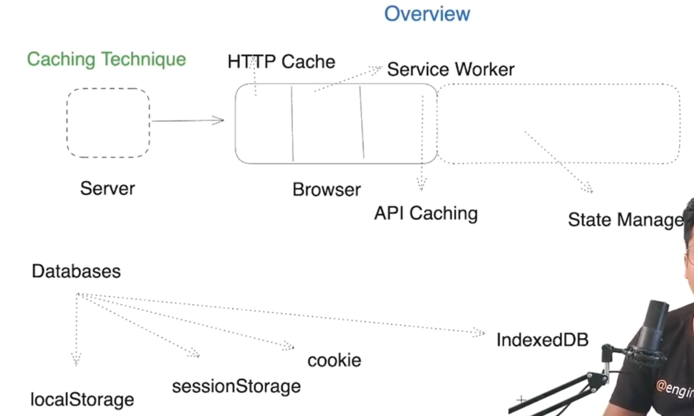

<details >
 <summary style="font-size: large; font-weight: bold">Local Storage & Session Storage</summary>
<details >
 <summary style="font-size: medium; font-weight: bold">GreatFrontend Notes</summary>

https://www.greatfrontend.com/questions/quiz/describe-the-difference-between-a-cookie-sessionstorage-and-localstorage?practice=practice&tab=quiz

## TL;DR

All of the following are mechanisms of storing data on the client, the user's browser in this case. `localStorage` and `sessionStorage` both implement the [Web Storage API interface](https://developer.mozilla.org/en-US/docs/Web/API/Web_Storage_API).

- **Cookies**: Suitable for server-client communication, small storage capacity, can be persistent or session-based, domain-specific. Sent to the server on every request.
- **`localStorage`**: Suitable for long-term storage, data persists even after the browser is closed, accessible across all tabs and windows of the same origin, highest storage capacity among the three.
- **`sessionStorage`**: Suitable for temporary data within a single page session, data is cleared when the tab or window is closed, has a higher storage capacity compared to cookies.

Here's a table summarizing the 3 client storage mechanisms.

| Property | Cookie | `localStorage` | `sessionStorage` |
| --- | --- | --- | --- |
| Initiator | Client or server. Server can use `Set-Cookie` header | Client | Client |
| Lifespan | As specified | Until deleted | Until tab is closed |
| Persistent across browser sessions | If a future expiry date is set | Yes | No |
| Sent to server with every HTTP request | Yes, sent via `Cookie` header | No | No |
| Total capacity (per domain) | 4kb | 5MB | 5MB |
| Access | Across windows/tabs | Across windows/tabs | Same tab |
| Security | JavaScript cannot access `HttpOnly` cookies | None | None |

---

## Storage on the web

Cookies, `localStorage`, and `sessionStorage`, are all storage mechanisms on the client (web browser). It is useful to store data on the client for client-only state like access tokens, themes, personalized layouts, so that users can have a consistent experience on a website across tabs and usage sessions.

These client-side storage mechanisms have the following common properties:

- This means the clients can read and modify the values (except for `HttpOnly` cookies).
- Key-value based storage.
- They are only able to store values as strings. Non-strings will have to be serialized into a string (e.g. `JSON.stringify()`) in order to be stored.

### Use cases for each storage mechanism

Since cookies have a relatively low maximum size, it is not advisable to store all your client-side data within cookies. The distinguishing properties about cookies are that cookies are sent to the server on every HTTP request so the low maximum size is a feature that prevents your HTTP requests from being too large due to cookies. Automatic expiry of cookies is a useful feature as well.

With that in mind, the best kind of data to store within cookies is small pieces of data that needs to be transmitted to the server, such as auth tokens, session IDs, analytics tracking IDs, GDPR cookie consent, language preferences that are important for authentication, authorization, and rendering on the server. These values are sometimes sensitive and can benefit from the `HttpOnly`, `Secure`, and `Expires`/`Max-Age` capabilities that cookies provide.

`localStorage` and `sessionStorage` both implement the [Web Storage API interface](https://developer.mozilla.org/en-US/docs/Web/API/Web_Storage_API). Web Storages have a generous total capacity of 5MB, so storage size is usually not a concern. The key difference is that values stored in Web Storage are not automatically sent along HTTP requests.

While you can manually include values from Web Storage when making AJAX/`fetch()` requests, the browser does not include them in the initial request / first load of the page. Hence Web Storage should not be used to store data that is relied on by the server for the initial rendering of the page if server-side rendering is being used (typically authentication/authorization-related information). `localStorage` is most suitable for user preferences data that do not expire, like themes and layouts (if it is not important for the server to render the final layout). `sessionStorage` is most suitable for temporary data that only needs to be accessible within the current browsing session, such as form data (useful to preserve data during accidental reloads).

The following sections dive deeper into each client storage mechanism.

### Cookies

Cookies are used to store small pieces of data on the client side that can be sent back to the server with every HTTP request.

- **Storage capacity**: Limited to around 4KB for all cookies.
- **Lifespan**: Cookies can have a specific expiration date set using the `Expires` or `Max-Age` attributes. If no expiration date is set, the cookie is deleted when the browser is closed (session cookie).
- **Access**: Cookies are domain-specific and can be shared across different pages and subdomains within the same domain.
- **Security**: Cookies can be marked as `HttpOnly` to prevent access from JavaScript, reducing the risk of XSS attacks. They can also be secured with the `Secure` flag to ensure they are sent only when HTTPS is used.

```js
// Set a cookie for the name/key `auth_token` with an expiry.
document.cookie =
  'auth_token=abc123def; expires=Fri, 31 Dec 2024 23:59:59 GMT; path=/';

// Read all cookies. There's no way to read specific cookies using `document.cookie`.
// You have to parse the string yourself.
console.log(document.cookie); // auth_token=abc123def

// Delete the cookie with the name/key `auth_token` by setting an
// expiry date in the past. The value doesn't matter.
document.cookie = 'auth_token=; expires=Thu, 01 Jan 1970 00:00:00 GMT; path=/';
```

It is a pain to read/write to cookies. `document.cookie` returns a single string containing all the key/value pairs delimited by `;` and you have to parse the string yourself. The [`js-cookie`](https://github.com/js-cookie/js-cookie) npm library provides a simple and lightweight API for reading/writing cookies in JavaScript.

A modern native way of accessing cookies is via the [Cookie Store API](https://developer.mozilla.org/en-US/docs/Web/API/Cookie_Store_API) which is only available on HTTPS pages.

```js
// Set a cookie. More options are available too.
cookieStore.set('auth_token', 'abc123def');

// Async method to access a single cookie and do something with it.
cookieStore.get('auth_token').then(...);

// Async method to get all cookies.
cookieStore.getAll().then(...);

// Async method to delete a single cookie.
cookieStore.delete('auth_token').then(() =>
  console.log('Cookie deleted')
);
```

The CookieStore API is relatively new and may not be supported in all browsers (supported in latest Chrome and Edge as of June 2024). Refer to [caniuse.com](https://caniuse.com/mdn-api_cookiestore) for the latest compatibility.

### `localStorage`

`localStorage` is used for storing data that persists even after the browser is closed and reopened. It is designed for long-term storage of data.

- **Storage capacity**: Typically around 5MB per origin (varies by browser).
- **Lifespan**: Data in `localStorage` persists until explicitly deleted by the user or the application.
- **Access**: Data is accessible within all tabs and windows of the same origin.
- **Security**: All JavaScript on the page have access to values within `localStorage`.

```js
// Set a value in localStorage.
localStorage.setItem('key', 'value');

// Get a value from localStorage.
console.log(localStorage.getItem('key'));

// Remove a value from localStorage.
localStorage.removeItem('key');

// Clear all data in localStorage.
localStorage.clear();
```

### `sessionStorage`

`sessionStorage` is used to store data for the duration of the page session. It is designed for temporary storage of data.

- **Storage Capacity**: Typically around 5MB per origin (varies by browser).
- **Lifespan**: Data in `sessionStorage` is cleared when the page session ends (i.e., when the browser or tab is closed). Reloading the page does not destroy data within `sessionStorage`.
- **Access**: Data is only accessible within the current tab or window. Different tabs or windows with the same page will have different `sessionStorage` objects.
- **Security**: All JavaScript on the same page have access to values within `sessionStorage` for that page.

```js
// Set a value in sessionStorage.
sessionStorage.setItem('key', 'value');

// Get a value from sessionStorage.
console.log(sessionStorage.getItem('key'));

// Remove a value from sessionStorage.
sessionStorage.removeItem('key');

// Clear all data in sessionStorage.
sessionStorage.clear();
```

## Notes

There are also other client-side storage mechanisms like [IndexedDB](https://developer.mozilla.org/en-US/docs/Web/API/IndexedDB_API) which is more powerful than the above-mentioned technologies but more complicated to use.

## References

- [What is the difference between localStorage, sessionStorage, session and cookies?](https://stackoverflow.com/questions/19867599/what-is-the-difference-between-localstorage-sessionstorage-session-and-cookies)

---
</details>

### Local Storage
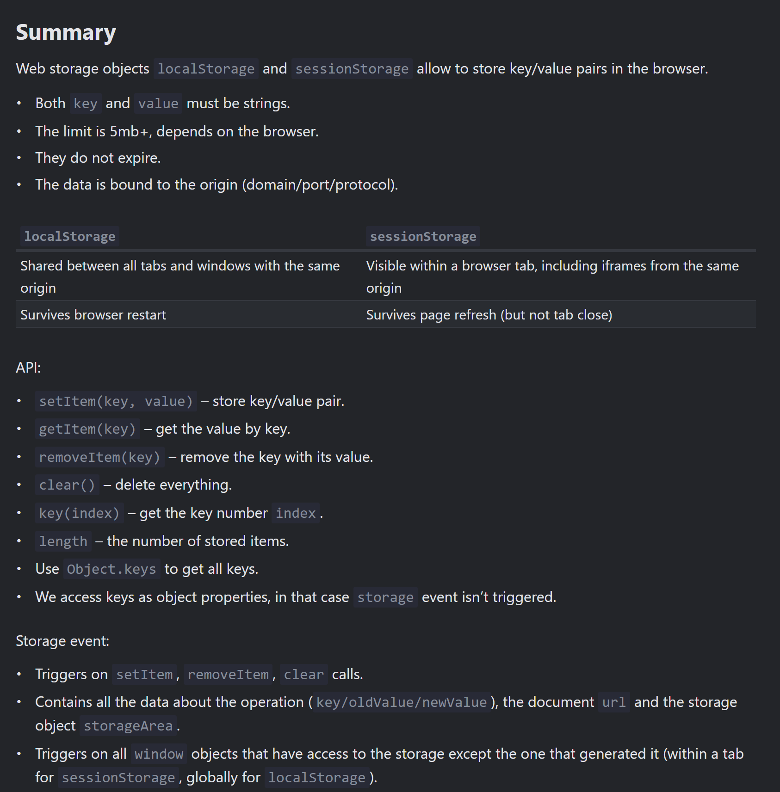
MUST Read if time permits: https://javascript.info/localstorage
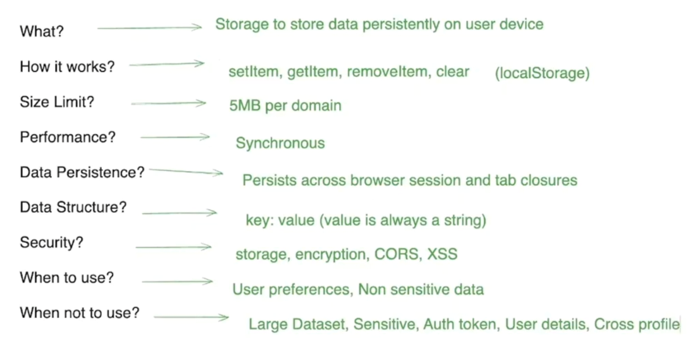
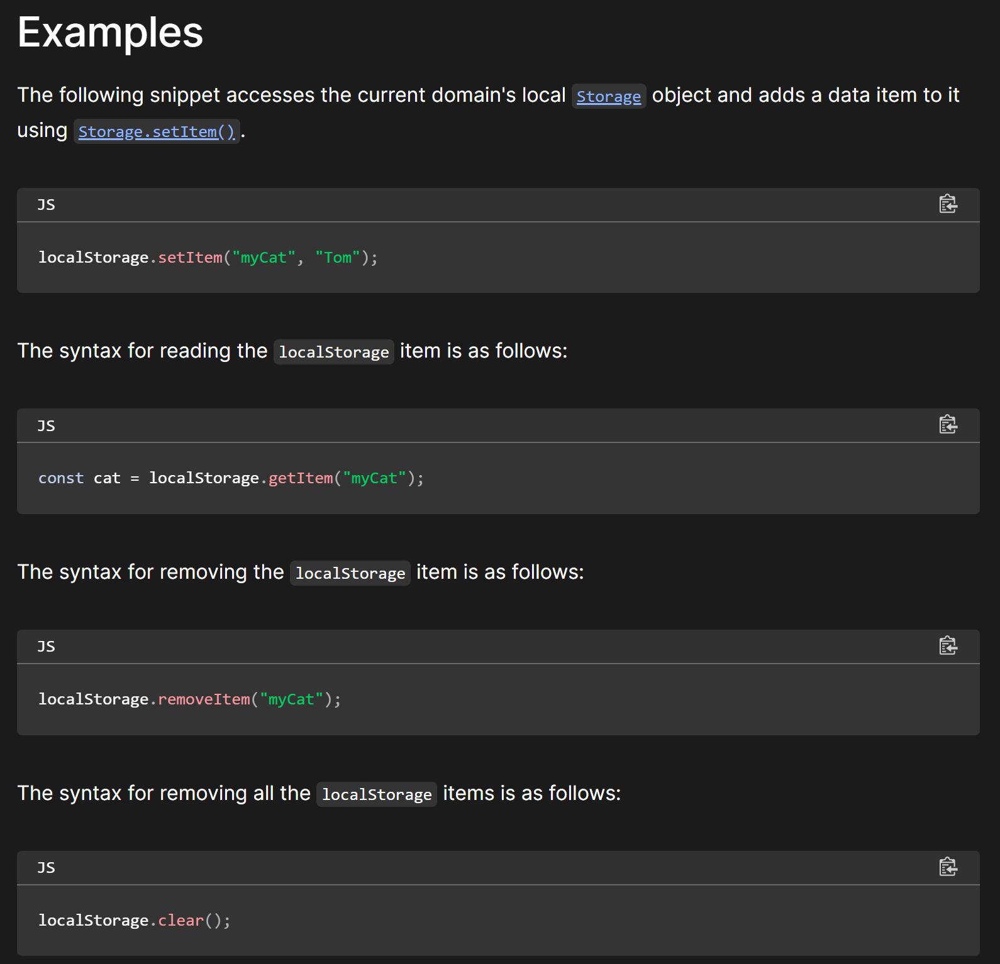

Disadvantages

1. **Security Concerns:** One of the primary drawbacks of localStorage is that it is not inherently secure. Data stored in localStorage is easily accessible through browser developer tools, making it vulnerable to cross-site scripting (XSS) attacks. Malicious scripts injected into a website can easily access and manipulate data stored in localStorage, compromising sensitive user information.
2. **Limited Storage Capacity:** localStorage has a relatively small storage capacity (usually around 5 MB per domain). This limitation can be a bottleneck for applications with large data requirements, leading to suboptimal performance and user experience.
3. **Blocking the Main Thread:** When data is read or written to localStorage, it operates synchronously and can potentially block the main thread, affecting the responsiveness of the web application. This is particularly problematic for applications that require quick and seamless user interactions.


#### Local Storage Security

- If your application is vulnerable to XSS attacks, malicious scripts injected into your web pages can access and manipulate data in local storage, since JavaScript running on a page has access to it. This can lead to data theft or tampering.
- Storing sensitive data such as user authentication tokens and personal data in local storage without proper encryption can expose the data to potential attacks.
- Unless removed explicitly, data in local storage persist indefinitely thereby increasing the risk of data exposure.
- Although local storage follows the same-origin policy, there are techniques such as CSRF attacks that can be used to trick a user into performing actions that lead to data being stored in local storage.

Here are some ways to mitigate local storage security risks in your application:

- Encrypt sensitive data such as user authentication and personal settings/data before storing it to local storage.
- Validate user inputs to prevent XSS attacks.
- Frequently clear outdated or unnecessary data from local storage.
- Implement proper access controls and authorization checks.

Encryption Library
1. https://github.com/softvar/secure-ls
   1. Good Discussion: https://security.stackexchange.com/questions/223782/is-encrypting-localstorage-data-more-secure
   2. An attacker has full control over the client, and therefore has complete access to the encryption keys and methods. In short, this cannot actually protect anything from an attacker.
      Normally client-side encryption at least provides a small layer of protection to slow down attackers, but protections around client-side JavaScript tend to be the easier to circumvent than similar steps in apps or desktop applications.
2. https://github.com/digitalfortress-tech/localstorage-slim?tab=readme-ov-file
3. https://stackoverflow.com/questions/54039031/encrypting-and-decryption-local-storage-values
https://developer.mozilla.org/en-US/docs/Web/API/Window/localStorage

### Session Storage 

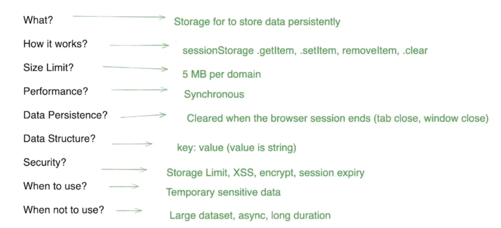

- Duplicating a tab copies the tab's sessionStorage into the new tab.

https://developer.mozilla.org/en-US/docs/Web/API/Window/sessionStorage

#### Session Storage Security

- Similar to other web storage mechanisms, session storage can be vulnerable to XSS attacks
- Potential attackers can hijack user's session and gain access to the data stored. This makes it crucial to implement robust session management and authentication mechanisms
- Sensitive data stored in session storage such as user authentication tokens can be exposed, if an attacker gains access to the user's device or compromises the browser session

To mitigate these security risks when using session storage, consider the following best practices:

- Encrypt sensitive data before storing it to add an additional layer of security
- Always validate user inputs to prevent XSS attacks
- Clear data from session storage as soon as it's no longer needed to reduce or prevent the risk of data exposure
- Implement strong session management to ensure your application is secure and includes mechanisms to prevent session hijacking
<br>

**Always do serialize the data using `JSON.stringify` while storing and deserialize using `JSON.parse` while fetching data**

---
</details>


<details >
 <summary style="font-size: large; font-weight: bold">Cookies</summary>

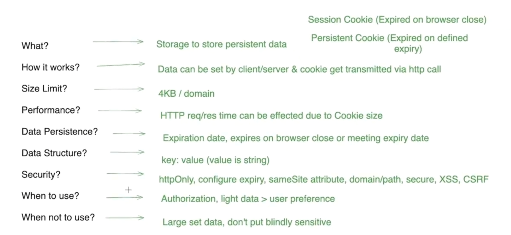

Extremely well written notes(MUST READ IF TIME PERMIT): https://javascript.info/cookie

- Transferred on every HTTP request

### Use Cases

- **Session management:** Cookies are usually used to manage user sessions. They store temporary information, therefore, helping users stay logged in as they navigate through different pages of the website. Some other examples are shopping carts, game scores, or anything else the server should remember.
- **Personalization:** Cookies are also used to store user preferences and settings, enabling websites to tailor the experience to individual users. This could include things like theme settings, language preference and other settings.
- **Tracking:** Cookies are often used by websites and advertisers to record and analyze user behavior.


### `document.cookie`
- `document.cookie` provides access to cookies.
- ```js
   document.cookie = "user=John"; // update only cookie named 'user'
   alert(document.cookie); // show all cookies
   ```
- ```js
   // special characters (spaces) need encoding
   let name = "my name";
   let value = "John Smith"
   
   // encodes the cookie as my%20name=John%20Smith
   document.cookie = encodeURIComponent(name) + '=' + encodeURIComponent(value);
   
   alert(document.cookie); // ...; my%20name=John%20Smith
   ```
- You can only set/update a single cookie at a time using `document.cookie`.
- Name/value must be encoded.
- One cookie may not exceed 4KB in size. The number of cookies allowed on a domain is around 20+ (varies by browser).


### Cookie attributes:

- `path=/`, by default current path, makes the cookie visible only under that path.
- `domain=site.com`, by default a cookie is visible on the current domain only. If the domain is set explicitly, the cookie becomes visible on subdomains.
- `expires` or `max-age` sets the cookie expiration time. Without them, the cookie dies when the browser is closed.
  - ```js
    document.cookie = "user=John; path=/; expires=Tue, 19 Jan 2038 03:14:07 GMT"
    ```
- `secure` makes the cookie HTTPS-only.
  - This attribute forbids any JavaScript access to the cookie. 
  - We can’t see such a cookie or manipulate it using document.cookie.
  - The web server uses the Set-Cookie header to set a cookie.
- `samesite` forbids the browser to send the cookie with requests coming from outside the site. This helps to prevent XSRF attacks.

### Cookie Security

- Cookie security is the act of protecting the information stored in cookies, which websites use as small text files to retain user preferences and sessions.
- While cookies enhance user experiences, they can also expose security risks such as session hijacking, cross-site scripting(XSS), and cross-site request forgery(CSRF).

Here are some ways to mitigate the security risks associated with cookies:

- Validate and sanitize user inputs to prevent XSS attacks that might target cookies
- Make sure to implement proper authentication and authorization mechanisms to prevent session hijacking
- Use secure HTTPS connections to transmit cookies
- Regularly audit and validate cookies to prevent unauthorized usage
- Implement secure cookie attributes like HttpOnly and Secure to limit cookie exposure

### Additionally:

- The browser may forbid third-party cookies, e.g. Safari does that by default. There is also work in progress to implement this in Chrome.
- When setting a tracking cookie for EU citizens, GDPR requires to ask for permission.


### Clear-Site-Data
- The Clear-Site-Data header clears browsing data (cookies, storage, cache) associated with the requesting website. It allows web developers to have more control over the data stored by a client browser for their origins.
- It always good practice to clear user data on log out, this header help us achieve this in very efficient way.

```js
app.get('/logout', (req, res) => {
    res.setHeader('Clear-Site-Data', '"cache", "cookies", "storage"')
    res.redirect('/');
})
```

The Clear-Site-Data header accepts one or more directives. If all types of data should be cleared, the wildcard directive ("*") can be used.
```html
// Wild card
Clear-Site-Data: "*"
```

https://developer.mozilla.org/en-US/docs/Web/HTTP/Headers/Clear-Site-Data

---
</details>


<details >
 <summary style="font-size: large; font-weight: bold">IndexedDB</summary>

IndexedDB can be thought of as a **“localStorage on steroids”**. It’s a simple key-value database, powerful enough for offline apps, yet simple to use.

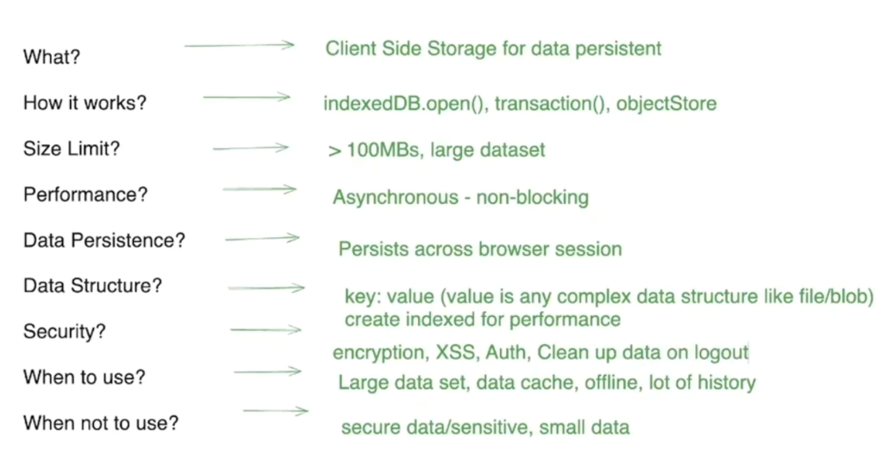

A Minimalistic Wrapper for IndexedDB: https://dexie.org/

Example: https://github.com/namastedev/namaste-frontend-system-design/tree/master/Databases%26Caching/indexedDb

For more detail refer: https://javascript.info/indexeddb

---
</details>


<details >
 <summary style="font-size: large; font-weight: bold">Normalization</summary>


During defining complex state, we should normalized data to make light weight and fast.

```js
const state = {
    users: [
      { id: 1, name: 'Alice', posts: [ { id: 101, title: 'Post 1', comments: [{ id: 201, text: 'Comment 1' }] }] },
      { id: 2, name: 'Bob', posts: [ { id: 102, title: 'Post 2', comments: [{ id: 202, text: 'Comment 2' }] }] },
    ],
    tags: [
      { id: 301, name: 'Tech', posts: [ { id: 101 }, { id: 102 } ] },
      { id: 302, name: 'Travel', posts: [ { id: 102 } ] },
    ],
  };

  // Normalized Data

  const state1 = {
    users: {
        byIds: {
            1: { id: 1, name: 'Alice', posts: [ 101 ] },
            2: { id: 2, name: 'Bob', posts: [ 102] },
        },
        allIds: [1, 2]
    },
    posts: {
        byIds: {
            101: { id: 101, title: 'Post 1', comments: [201] },
            102: { id: 102, title: 'Post 2', comments: [202] }
        },
        allIds: [101, 102]
    },
    comments: {
        byIds: {
            201: { id: 201, text: 'Comment 1' },
            202: { id: 202, text: 'Comment 2' }
        },
        allIds: [201, 202]
    },
    tags: {
        byIds: {
            301: { id: 301, name: 'Tech', posts: [ 101, 102 ] },
            302: { id: 302, name: 'Travel', posts: [ 102 ] }
        },
        allIds: [301, 302]
    }
  }
```

---
</details>


<details >
 <summary style="font-size: large; font-weight: bold">HTTP Caching</summary>

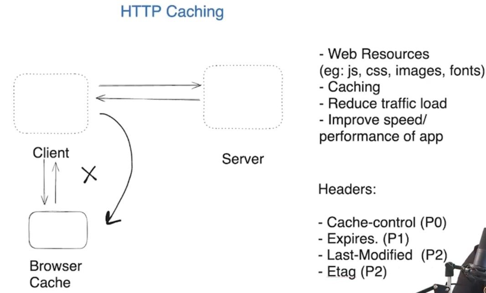

Let say we are requesting for a image from server then if caching is enabled,
then we first check browser cache then if not found then we fetch from server and store it in browser cache.

**In above image look for priority of different caching headers**

Without Caching
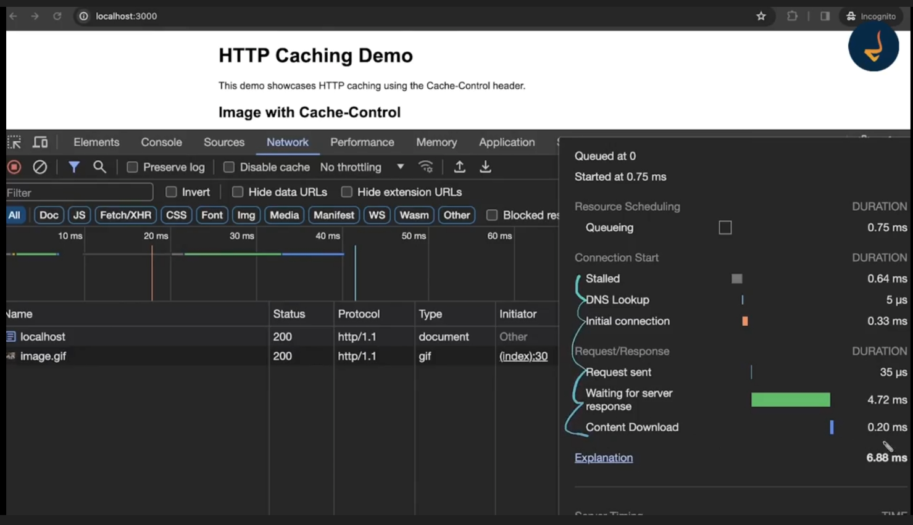

With Caching


Few caching headers are by default enabled in express. We can disabled them by using below code
```js
app.use(express.static(path.join(__dirname, 'public'), {
  etag: false,
  cacheControl: false,
  lastModified: false
}));
```

### Cache-Control

```js
const express = require('express');
const path = require('path');
const app = express();

app.use((req, res, next) => {
    res.setHeader('Cache-Control', 'public, max-age=86400');// 24 hour
    next();
})

const PORT = 3000;
app.listen(PORT, () => {
    console.log(`Server is running on http://localhost:${PORT}`);
});
```
With above cache-control configuration we will use browser cache for next 24 hours to get the images

https://developer.mozilla.org/en-US/docs/Web/HTTP/Headers/Cache-Control
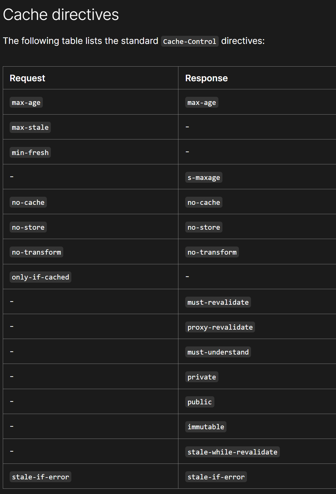

### Expires

```js
const express = require('express');
const path = require('path');
const app = express();

app.use((req, res, next) => {
    res.setHeader('Expires', 'Sat, 23 Dec 2023 11:20:39 GMT')
    next();
})

const PORT = 3000;
app.listen(PORT, () => {
    console.log(`Server is running on http://localhost:${PORT}`);
});
```
With above expire configuration we will use browser cache for specified date to get the images


### last-modified

```js
const express = require('express');
const path = require('path');
const app = express();

app.use(express.static(path.join(__dirname, 'public'), {
  etag: false,
  cacheControl: false,
  lastModified: true
}));

const PORT = 3000;
app.listen(PORT, () => {
  console.log(`Server is running on http://localhost:${PORT}`);
});
```

https://developer.mozilla.org/en-US/docs/Web/HTTP/Headers/Last-Modified


When last-modified is enabled we make server call and status code is `304`.

The Last-Modified response HTTP header contains a date and time when the origin server believes the resource was last modified. It is used as a validator to determine if the resource is the same as the previously stored one. Less accurate than an `ETag` header, it is a fallback mechanism

### ETag

```js
app.use(express.static(path.join(__dirname, 'public'), {
  etag: true,
  cacheControl: false,
  lastModified: true
}));

```

Here a unique hash is generated for the image and until that hash doesn't match on server till that
time we will use browser cache.

The ETag (or entity tag) HTTP response header is an identifier for a specific version of a resource. It lets caches be more efficient and save bandwidth, as a web server does not need to resend a full response if the content was not changed. Additionally, etags help to prevent simultaneous updates of a resource from overwriting each other ("mid-air collisions").

If the resource at a given URL changes, a new Etag value must be generated. A comparison of them can determine whether two representations of a resource are the same.

https://developer.mozilla.org/en-US/docs/Web/HTTP/Headers/ETag


Complete Code: https://github.com/namastedev/namaste-frontend-system-design/tree/master/Databases%26Caching/httpCaching

### Challenges

How can we invalidate our cache? How can we fetch data from server and not from cache if Http caching is enabled?

```html
<body>
    <div id="content">
        <h1>HTTP Caching Demo</h1>
        <p>This demo showcases HTTP caching using the Cache-Control header.</p>

        <h2>Image with Cache-Control</h2>
        <p>This image will be cached based on the Cache-Control header.</p>
        

        <h2>Fetch New Image</h2>
        <p>Click the button to fetch a new image without using the cache.</p>
        <button onclick="fetchNewImage()">Fetch New Image</button>
    </div>

    <script>
        function fetchNewImage() {
            // Generate a random query parameter to bypass caching
            const randomQuery = Math.random().toString(36).substring(7);
            
            // Update the image source with the new query parameter
            const imgElement = document.getElementById('cachedImage');
            imgElement.src = `image.gif?${randomQuery}`;
        }
    </script>
</body>
```
We can update the URL with some random query parameter to bypass caching. Browser will treat this as a new URL, hence force us to get it from server


---
</details>


<details >
 <summary style="font-size: large; font-weight: bold">Service Worker</summary>

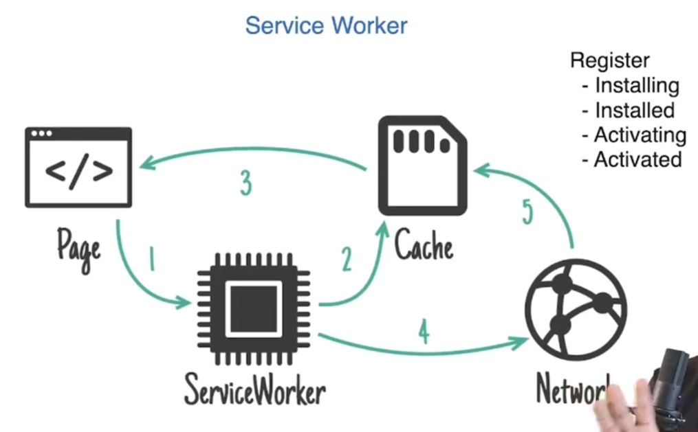


Service worker code
```js
//sw.js
const CACHE_NAME = 'my-cache-v1';

//Below are URLs which we will be caching
const urlsToCache = [
    '/',
    '/index.html',
    '/styles.css',
    '/app.js',
    '/image.gif'
];

// STEP-2: Installation of all URLs we want to cache
self.addEventListener('install', event => {
    event.waitUntil(
        caches.open(CACHE_NAME)
            .then(cache => cache.addAll(urlsToCache))
    );
});


//STEP-3: Below code will check if requested URL is present in cache or fetch request from server
self.addEventListener('fetch', event => {
    event.respondWith(
        caches.match(event.request)
            .then(response => {
                return response || fetch(event.request);
            })
    );
});
```

Registering Service Worker
```html
//index.html

<!DOCTYPE html>
<html lang="en">
  <head>
    <meta charset="UTF-8" />
    <meta name="viewport" content="width=device-width, initial-scale=1.0" />
    <title>Service Worker Example</title>
    <link rel="stylesheet" href="/styles.css" />
  </head>
  <body>
    <h1>Hello, Service Worker!</h1>
    
    <script src="/app.js"></script>

    <script>
        // STEP-1: Service Worker Registration
        if ("serviceWorker" in navigator) {
          navigator.serviceWorker
            .register("/sw.js")
            .then((registration) => {
              console.log(
                "Service Worker registered with scope:",
                registration.scope
              );
            })
            .catch((error) => {
              console.error("Service Worker registration failed:", error);
            });
        }
      </script>
  </body>
</html>
```

Full Code: https://github.com/namastedev/namaste-frontend-system-design/tree/master/Databases%26Caching/serviceWorker


---
</details>


<details >
 <summary style="font-size: large; font-weight: bold">API Caching(Fetch/Network/Request Policy)</summary>

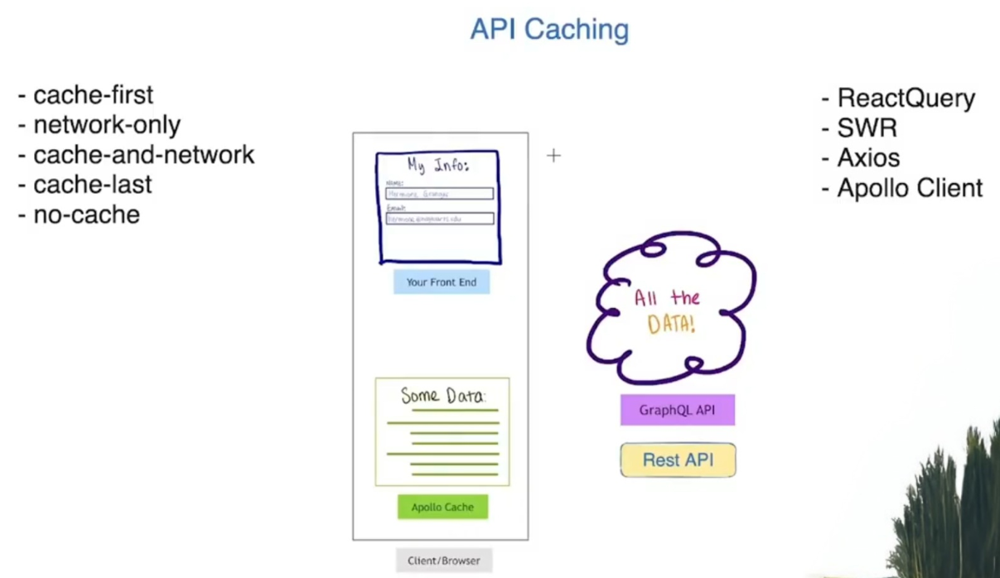


For Graphql, we can use 
- Apollo Client.
- React Query
- URQL
- SWR

For REST, we can use
- Axios


### Fetch/Network/Request Policy

- `cache-first` (the default in URQL) prefers cached results and falls back to sending an API request when no prior result is cached.
- `cache-and-network` returns cached results but also always sends an API request, which is perfect for displaying data quickly while keeping it up-to-date.
- `network-only` will always send an API request and will ignore cached results.
- `cache-only` will always return cached results or null.

The `cache-and-network` policy is particularly useful, since it allows us to display data instantly if it has been cached, but also refreshes data in our cache in the background. This means though that fetching will be false for cached results although an API request may still be ongoing in the background.

LensView Code
```js
  const authenticatedClient: Client = createClient({
    url: VITE_LENS_API_URL,
    requestPolicy: "cache-and-network",
    fetchOptions: {
      headers: {
        "x-access-token": `Bearer ${accessToken}`
      }
    }
  });
```

https://commerce.nearform.com/open-source/urql/docs/basics/document-caching/#:~:text=cache%2Dand%2Dnetwork%20returns%20cached,return%20cached%20results%20or%20null%20.

---
</details>


<details >
 <summary style="font-size: large; font-weight: bold">State Management</summary>

- In-memory

Redux
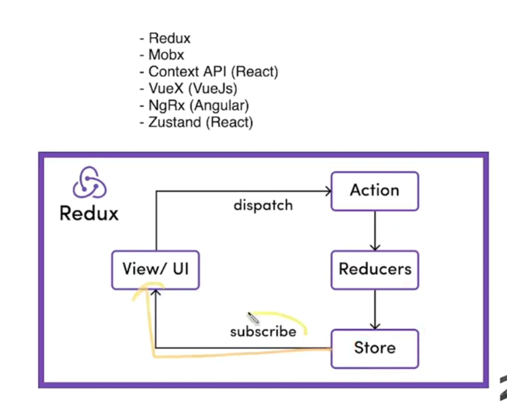

MobX


Context API


VueX


NgRX
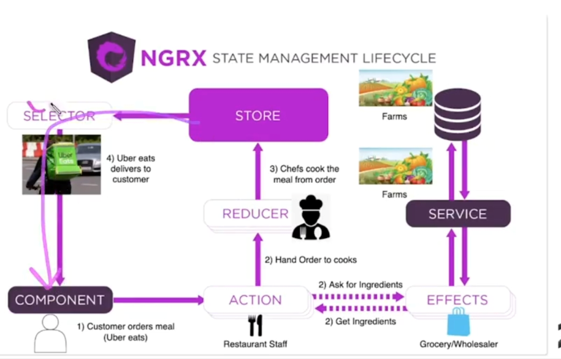

---
</details>
