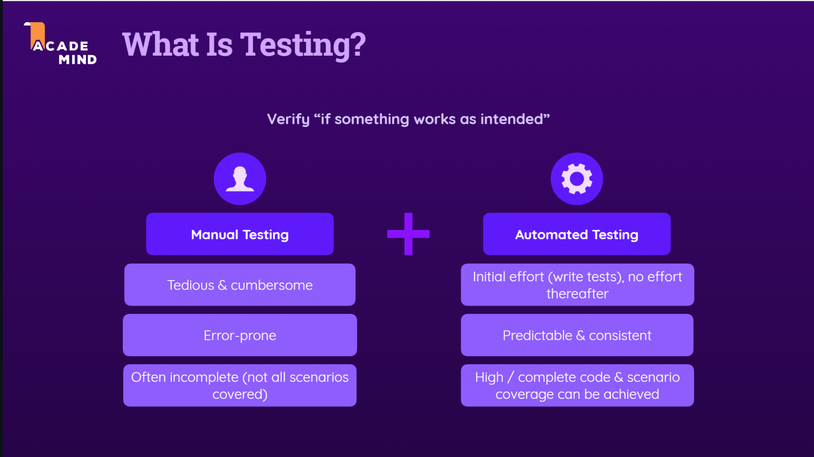
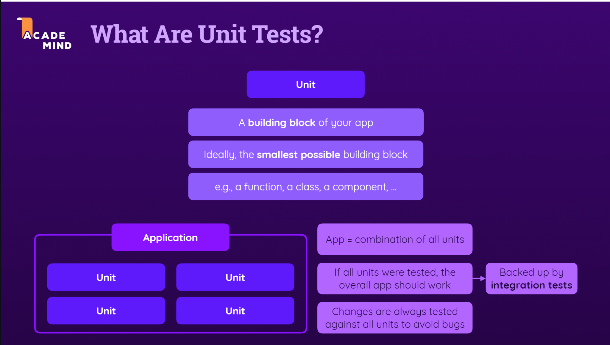
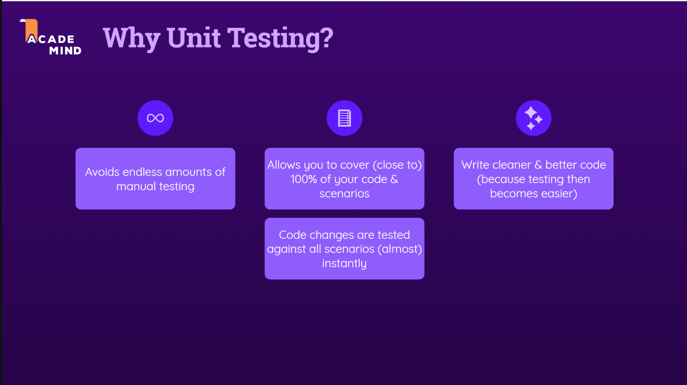
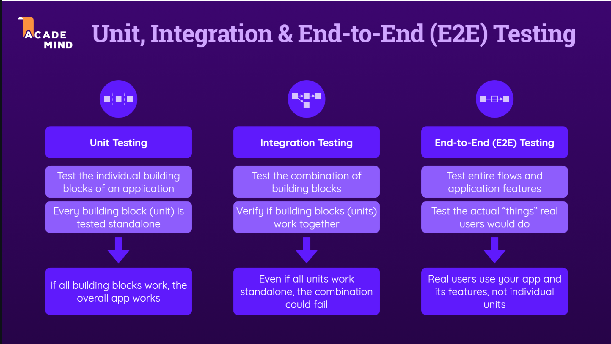
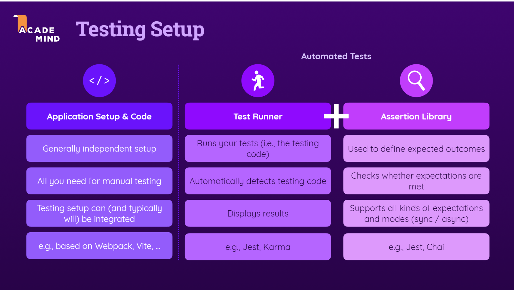
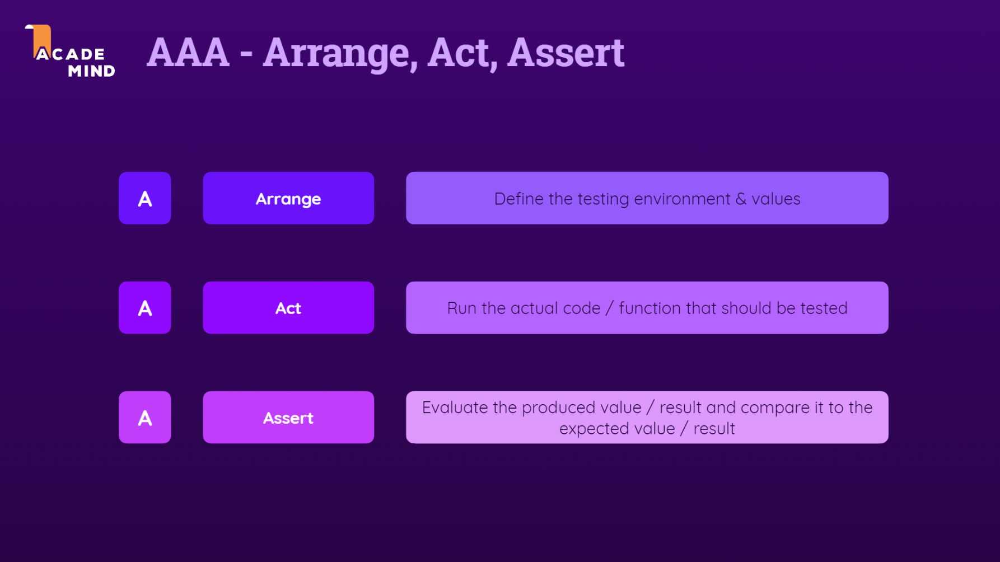
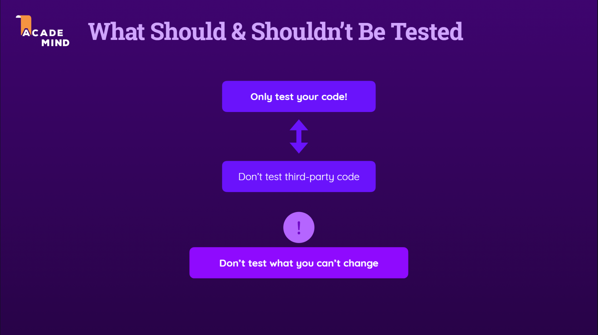
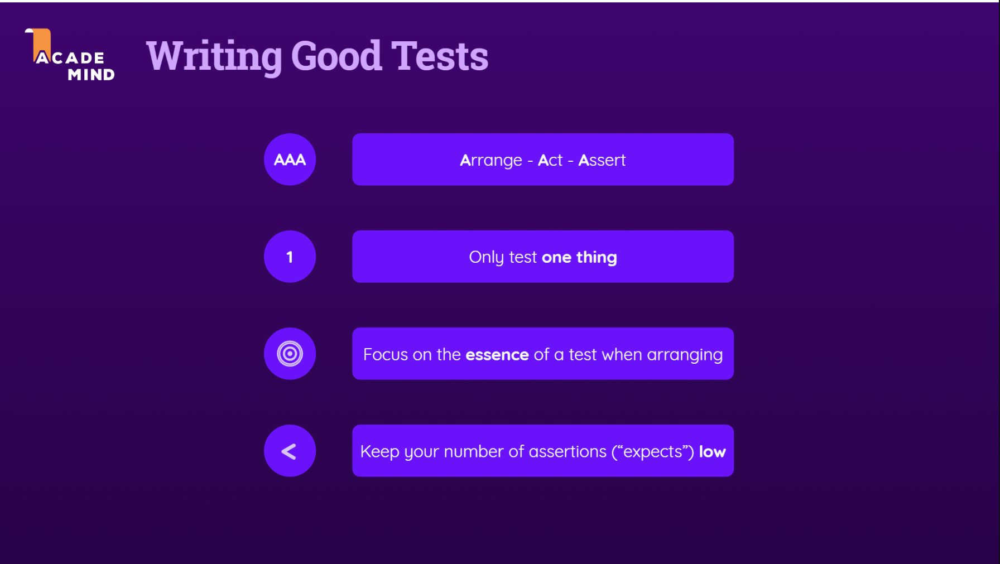
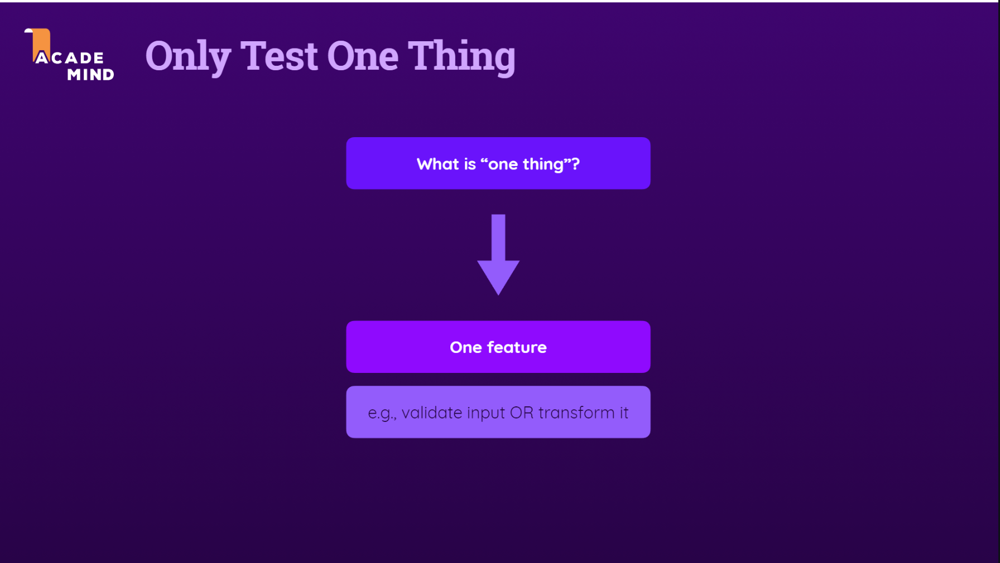
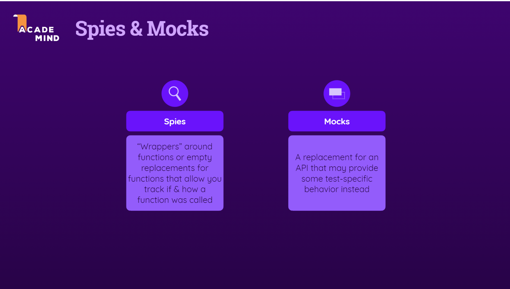

## Unit Testing

<details >
 <summary style="font-size: large; font-weight: bold">Basic</summary>









- JEST has problem using project with ES module(`import`/`export`)
- Hence Vitest is a better choice using the same as JEST

### Vitest

1. `npm i --save-dev vitest`
2. 
```json
{
    "scripts": {
        "test": "vitest --run --reporter verbose",
        "test:watch": "vitest",
        "start": "http-server -c-1"
    },
    "devDependencies": {
        "http-server": "^14.1.0",
        "install": "^0.13.0",
        "npm": "^8.6.0",
        "vitest": "^0.9.0"
    }
}
```

3.
```js
// math.js

export function add(numbers) {
  let sum = 0;

  for (const number of numbers) {
    sum += number;
  }
  return sum;
}
```

```js
// math.test.js

// import { test } from 'vitest'; // same as 'it'
import { it, expect } from 'vitest';

import { add } from './math';

it('should summarize all number values in an array', () => {
const result = add([1, 2, 3]);
expect(result).toBe(6);
});
```
</details>


<details >
 <summary style="font-size: large; font-weight: bold">AAA Pattern</summary>




```js
//math.test.js

import { it, expect } from 'vitest';

import { add } from './math';

it('should summarize all number values in an array', () => {
  // Arrange
  const numbers = [1, 2];

  // Act
  const result = add(numbers);

  // Assert
  const expectedResult = numbers.reduce(
    (prevValue, curValue) => prevValue + curValue,
    0
  );
  expect(result).toBe(expectedResult);
});
```
**Note:** 
1. Keep things simple, so for example

`const numbers = [1, 2, 3];` & `const numbers = [1, 2];`
has same implication on test so writing, so we should avoid 
writing test which are redundant.

2. Writing more test cases
```js
//math.test.js

it('should yield NaN if a least one invalid number is provided', () => {
  const inputs = ['invalid', 1];

  const result = add(inputs);

  expect(result).toBeNaN();
});

it('should yield a correct sum if an array of numeric string values is provided', () => {
  const numbers = ['1', '2'];

  const result = add(numbers);

  const expectedResult = numbers.reduce(
    (prevValue, curValue) => +prevValue + +curValue,
    0
  );
  expect(result).toBe(expectedResult)
})
```

Fixing function
```js
// math.js

export function add(numbers) {
  let sum = 0;

  for (const number of numbers) {
    sum += +number;
  }
  return sum;
}
```

3. Multiple expectations

```js

it('should yield NaN for non-transformable values', () => {
  const input = 'invalid';
  const input2 = {};

  const result = transformToNumber(input);
  const result2 = transformToNumber(input2);

  expect(result).toBeNaN();
  expect(result2).toBeNaN();
});
```

We could write multiple expectations in scenarios like above where
expectations are similar, but mostly writing separately is better.
</details>


<details >
 <summary style="font-size: large; font-weight: bold">Checking for Errors</summary>

```js
//math.test.js

it('should throw an error if no value is passed into the function', () => {
  const resultFn = () => {
    add();
  };
  expect(resultFn).toThrow();
});
```

Since during error we won't be getting any return value, so we
can use `try/catch` to check for errors.But above is better choice by wrapping
it into a arrow function.


```js
//math.test.js

it('should throw an error if provided with multiple arguments instead of an array', () => {
  const num1 = 1;
  const num2 = 2;

  const resultFn = () => {
    add(num1, num2);
  };

  expect(resultFn).toThrow(/is not iterable/);
});
```

**Note:** adding regular expression `/is not iterable/` help us to check for exact we are expecting 
rather than any other type of error.
</details>


<details >
 <summary style="font-size: large; font-weight: bold">Organise Multiple Test Functions(Test Suites)</summary>

When writing for below file, which has two functions

```js
export function validateStringNotEmpty(value) {
  if (value.trim().length === 0) {
    throw new Error('Invalid input - must not be empty.');
  }
}

export function validateNumber(number) {
  if (isNaN(number) || typeof number !== 'number') {
    throw new Error('Invalid number input.');
  }
}
```

We can organise output result by using `describe` like below

```js
import { it, expect, describe } from 'vitest';

import { validateNumber, validateStringNotEmpty } from './validation';

describe('validateStringNotEmpty()', () => {
  it('should throw an error, if an empty string is provided', () => {
    const input = '';
    const validationFn = () => validateStringNotEmpty(input);
    expect(validationFn).toThrow();
  });

  it('should throw an error with a message that contains a reason (must not be empty)', () => {
    const input = '';
    const validationFn = () => validateStringNotEmpty(input);
    expect(validationFn).toThrow(/must not be empty/);
  });

  it('should throw an error if a long string of blanks is provided', () => {
    const input = '';
    const validationFn = () => validateStringNotEmpty(input);
    expect(validationFn).toThrow();
  });

  it('should throw an error if any other value than a string is provided', () => {
    const inputNum = 1;
    const inputBool = 1;
    const inputObj = {};

    const validationFnNum = () => validateStringNotEmpty(inputNum);
    const validationFnBool = () => validateStringNotEmpty(inputBool);
    const validationFnObj = () => validateStringNotEmpty(inputObj);

    expect(validationFnNum).toThrow();
    expect(validationFnBool).toThrow();
    expect(validationFnObj).toThrow();
  });

  it('should not throw an error, if a non-empty string is provided', () => {
    const input = 'valid';
    const validationFn = () => validateStringNotEmpty(input);
    expect(validationFn).not.toThrow();
  });
});

describe('validateNumber()', () => {
  it('should throw an error if NaN is provided', () => {
    const input = NaN;
    const validationFn = () => validateNumber(input);
    expect(validationFn).toThrow();
  });

  it('should throw an error with a message that contains a reason (invalid number)', () => {
    const input = NaN;
    const validationFn = () => validateNumber(input);
    expect(validationFn).toThrow(/Invalid number/);
  });

  it('should throw an error if a non-numeric value is provided', () => {
    const input = '1';
    const validationFn = () => validateNumber(input);
    expect(validationFn).toThrow();
  });

  it('should not throw an error, if a number is provided', () => {
    const input = 1;
    const validationFn = () => validateNumber(input);
    expect(validationFn).not.toThrow();
  });
});
```

1. Use name of the function in `describe`
2. We nest more `describe` inside `describe` for better organising, 
but one level is enough
</details>


<details >
 <summary style="font-size: large; font-weight: bold">Writing Good tests</summary>







### Code Coverage

An important aspect of testing is to achieve good code coverage. This means, that you want to write tests for the majority of your code (both code files and line of code).

There are tools that help you measure your code coverage - actually Vitest comes with a built-in functionality: https://vitest.dev/guide/features.html#coverage

It is worth noting though, that the goal is not necessarily 100% coverage. There always can be some code that doesn't need any tests (e.g., because it merely calls other functions that are tested already).

In addition, achieving (close to) full code coverage also isn't any guarantee that you wrote good tests. You could cover 100% of your code with meaningless tests after all. Or you could missing important tests (that should test important behaviors). The code would still technically be covered by tests in such scenarios.

So don't see a high amount of code coverage as the ultimate goal!


<details >
 <summary style="font-size: medium; font-weight: bold">Example</summary>

```js
import { extractNumbers } from './src/parser.js';
import {
    validateStringNotEmpty,
    validateNumber,
} from './src/util/validation.js';
import { add } from './src/math.js';
import { transformToNumber } from './src/util/numbers.js';

const form = document.querySelector('form');
const output = document.getElementById('result');

function formSubmitHandler(event) {
    event.preventDefault();
    const formData = new FormData(form);
    const numberInputs = extractNumbers(formData);

    let result = '';

    try {
        const numbers = [];
        for (const numberInput of numberInputs) {
            validateStringNotEmpty(numberInput);
            const number = transformToNumber(numberInput);
            validateNumber(number);
            numbers.push(number);
        }
        result = add(numbers).toString();
    } catch (error) {
        result = error.message;
    }

    let resultText = '';

    if (result === 'invalid') {
        resultText = 'Invalid input. You must enter valid numbers.';
    } else if (result !== 'no-calc') {
        resultText = 'Result: ' + result;
    }

    output.textContent = resultText;
}

form.addEventListener('submit', formSubmitHandler);
```

We should refactor such a function into small functions, so that we 
can easily write tests for them.
</details>
</details>


<details >
 <summary style="font-size: large; font-weight: bold">Integration Test</summary>

When we have functions within function and try to test that function
then we are actually doing `Integration test`.

1. It is recommended to write integration tests as well because it may happen
things doesn't work as expected when we test together
2. We may argue that we can just write Integration test as it will test 
nest functions also, but unit test help us identify issue in much better way,
hence we always try to maintain balance, with writing more Unit test than
Integration test

```js
// numbers.js

import { validateStringNotEmpty, validateNumber } from './validation.js';

export function transformToNumber(value) {
  // return NaN;
  return +value;
}

export function cleanNumbers(numberValues) {
  const numbers = [];
  for (const numberInput of numberValues) {
    validateStringNotEmpty(numberInput);
    const number = transformToNumber(numberInput);
    validateNumber(number);
    numbers.push(number);
  }
  return numbers;
}
```

```js
// numbers.test.js

import { describe, it, expect } from 'vitest';

import { cleanNumbers, transformToNumber } from './numbers';

describe('transformToNumber()', () => {
    it('should transform a string number to a number of type number', () => {
        const input = '1';

        const result = transformToNumber(input);

        expect(result).toBeTypeOf('number');
    });

    it('should transform a string number to a number of type number', () => {
        const input = '1';

        const result = transformToNumber(input);

        expect(result).toBe(+input);
    });

    it('should yield NaN for non-transformable values', () => {
        const input = 'invalid';
        const input2 = {};

        const result = transformToNumber(input);
        const result2 = transformToNumber(input2);

        expect(result).toBeNaN();
        expect(result2).toBeNaN();
    });
});

describe('cleanNumbers()', () => {
    it('should return an array of number values if an array of string number values is provided', () => {
        const numberValues = ['1', '2'];

        const cleanedNumbers = cleanNumbers(numberValues);

        expect(cleanedNumbers[0]).toBeTypeOf('number');
    });

    it('should throw an error if an array with at least one empty string is provided', () => {
        const numberValues = ['', 1];

        const cleanFn = () => cleanNumbers(numberValues);

        expect(cleanFn).toThrow();
    })
});

```

Referred code: https://github.com/academind/js-testing-practical-guide-code/tree/05-integration-tests/code/03-finished

</details>


<details >
 <summary style="font-size: large; font-weight: bold">Advance Testing Concepts</summary>

<details >
 <summary style="font-size: medium; font-weight: bold">`toBe()` vs `toEqual()`</summary>


```js
it('should return an array of number values if an array of string number values is provided', () => {
    const numberValues = ['1', '2'];

    const cleanedNumbers = cleanNumbers(numberValues);

    // expect(cleanedNumbers[0]).toBeTypeOf('number');
    expect(cleanedNumbers).toBe([1, 2]); // Will return wrong result
  });
```

`toBe()` compare for exact equality which works for `primitive type`, but for above
reference type object it fails to compare.

So we can use `toEqual()` for that.
<br>
`expect(cleanedNumbers).toEqual([1, 2]);`
</details>


<details >
 <summary style="font-size: medium; font-weight: bold">Testing Asynchronous Code</summary>


<details >
 <summary style="font-size: small; font-weight: bold">Asynchronous Code with Callbacks</summary>

```js
import jwt from 'jsonwebtoken';

export function generateToken(userEmail, doneFn) {
  jwt.sign({ email: userEmail }, 'secret123', doneFn);
}

// generateToken('test@test.com', (err, token) => {
//   console.log(token);
// });
```

**JWT Generation**:
  - `jwt.sign()`: This function creates a JWT.
  - The payload `{ email: userEmail }` is the data that will be embedded in the token.
  - `'secret123'` is the secret key used to sign the token. It is crucial for the security of the token.
  - `doneFn` is the callback function which will receive the token or an error if one occurs during token generation.

1. **Wrong Solution-1**
```js
it('should generate a token value', () => {
  const testUserEmail = 'test@test.com';

  generateToken(testUserEmail, (err, token) => {
    expect(token).toBeDefined();
  });
});

```

2. **Wrong Solution-2**
```js
it('should generate a token value', (done) => {
  const testUserEmail = 'test@test.com';

  generateToken(testUserEmail, (err, token) => {
    expect(token).toBeDefined();
    done();
  });
});

```

Both above solution will not work as expected

3. **Right Solution**
```js
it('should generate a token value', (done) => {
  const testUserEmail = 'test@test.com';

  generateToken(testUserEmail, (err, token) => {
    // expect(token).toBeDefined();

    try {
      expect(token).toBeDefined();
      // expect(token).toBe(2);
      done();
    } catch (err) {
      done(err);
    }
  });
});
```

- Without `done`, the test framework will consider the test complete as soon as it reaches the end of 
the test function. Since generateToken is asynchronous, the test might complete before the token is
generated and the callback is invoked.
- `try-catch`
  - **Uncaught Exceptions:**
    If an assertion fails or an error is thrown, it will not be caught. 
    This can lead to the test framework not marking the test as failed properly.
  - **No Detailed Error Reporting:**
    Without catching and passing the error to done(err), the test framework might not provide a clear 
    indication of what went wrong, leading to less informative error messages.
</details>


<details >
 <summary style="font-size: small; font-weight: bold">Asynchronous Code with Promise</summary>

```js
import jwt from 'jsonwebtoken';

export function generateTokenPromise(userEmail) {
  const promise = new Promise((resolve, reject) => {
    jwt.sign({ email: userEmail }, 'secret123', (error, token) => {
      if (error) {
        reject(error);
      } else {
        resolve(token);
      }
    });
  });

  return promise;
}

// generateTokenPromise('test@test.com').then((token) => console.log(token));
```

**Solution-1**
```js
it('should generate a token value', () => {
  const testUserEmail = 'test@test.com';

  expect(generateTokenPromise(testUserEmail)).resolves.toBeDefined();
});
```
We can use built in promise methods like `resolves` and `rejects` in `expect()`
to check the result of the promise.

We should actually `return` the promise assertion in our tests:
```js
it('should generate a token value', () => {
  const testUserEmail = 'test@test.com';

  return expect(generateTokenPromise(testUserEmail)).resolves.toBeDefined();
});
```
This guarantees that Vitest / Jest wait for the promise to be resolved.

You don't need to return when using async / await 
(since a function annotated with async returns a promise implicitly).

**Solution-2**
```js
import { expect, it } from 'vitest';
import { generateTokenPromise } from './async-example';


it('should generate a token value', async () => {
  const testUserEmail = 'test@test.com';

  const token = await generateTokenPromise(testUserEmail);

  expect(token).toBeDefined();
});
```

Or we can use `async/await` in our tests as well.

</details>


</details>


<details >
 <summary style="font-size: medium; font-weight: bold">Hooks</summary>

```js
//hook.js
export class User {
  constructor(email) {
    this.email = email;
  }

  updateEmail(newEmail) {
    this.email = newEmail;
  }

  clearEmail() {
    this.email = '';
  }
}
```

```js
import { it, expect, beforeAll, beforeEach, afterEach, afterAll } from 'vitest';

import { User } from './hooks';

const testEmail = 'test@test.com';
let user;

beforeAll(() => {
  user = new User(testEmail);
  console.log('beforeAll()');
});
beforeEach(() => {
  user = new User(testEmail);
  console.log('beforeEach()');
});
afterEach(() => {
  // user = new User(testEmail);
  console.log('afterEach()');
});
afterAll(() => {
  console.log('afterAll()');
});

it('should update the email', () => {
  const newTestEmail = 'test2@test.com';

  user.updateEmail(newTestEmail);

  expect(user.email).toBe(newTestEmail);
});

it('should have an email property', () => {
  expect(user).toHaveProperty('email');
});

it('should store the provided email value', () => {
  expect(user.email).toBe(testEmail);
});

it('should clear the email', () => {
  user.clearEmail();

  expect(user.email).toBe('');
});

it('should still have an email property after clearing the email', () => {
  user.clearEmail();

  expect(user).toHaveProperty('email');
});
```

1. Here if we try to use `user` variable globally without `beforeAll` or `beforeEach` we 
will get wrong results. All of these hooks execute as there name suggests
2. We can use them in `describe`(Test Suites) block as well, which isolates them from each other.
`beforeAll()` & `afterAll()` found very useful in such a scenarios.
</details>


<details >
 <summary style="font-size: medium; font-weight: bold">Concurrent Tests</summary>

1. If we want some tests to run concurrently to save some time then we can use
`it.concurrent()` or `test.concurrent()`

```js
it.concurrent('should update the email', () => {
  const newTestEmail = 'test2@test.com';

  user.updateEmail(newTestEmail);

  expect(user.email).toBe(newTestEmail);
});

it.concurrent('should have an email property', () => {
  expect(user).toHaveProperty('email');
});
```

2. If we use it in `describe` block then all the tests inside that will
run in parallel

3. Even when not adding the .concurrent property / annotation, tests that are stored in 
different files are executed concurrently (i.e., in parallel). This is done by both 
Vitest and Jest - ensuring that your tests run in a short amount of time.

4. With `.concurrent` you can enforce this behavior also inside the individual files 
(i.e., tests that live in one and the same file are executed concurrently).

5. Concurrent execution can reduce the amount of time your tests need to execute. 
**A downside of concurrent execution is, that tests that perform clashing (global) 
state manipulations may interfere with each other.**
</details>

</details>


<details >
 <summary style="font-size: large; font-weight: bold">Mocking & Spies</summary>

There could be a multiple scenario where our `test code` is actually manipulating / triggering 
`Database` or `other external` resources. In such cases we can use `Spies` & `Mock`




<details >
 <summary style="font-size: medium; font-weight: bold">Spies</summary>

```js
//data.js

import writeData from './util/io.js';

export function generateReportData(logFn) {
  const data = 'Some dummy data for this demo app';
  if (logFn) {
    logFn(data);
  }

  return data;
}

export async function storeData(data) {
  if (!data) {
    throw new Error('No data received!');
  }
  await writeData(data, 'data.txt');
}
```


```js
//data.test.js
import { describe, it, expect, vi } from 'vitest';

import { generateReportData } from './data';

describe('generateReportData()', () => {
  it('should execute logFn if provided', () => {
    const logger = vi.fn();

    generateReportData(logger);

    expect(logger).toBeCalled();
  });
});
```

In Jest we can use `jest` in place of `vi`.
These are Spies which act as replacement for functions like `logFn` and 
track if and how function was called.

We will get error if we remove 
```js
if (logFn) {
    logFn(data);
  }
```

since our test spy will see this function call missing. 
</details>


<details >
 <summary style="font-size: medium; font-weight: bold">Mocks</summary>

```js
//io.js
import path from 'path';
import { promises as fs } from 'fs';

export default function writeData(data, filename) {
  const storagePath = path.join(process.cwd(), 'data', filename);
  return fs.writeFile(storagePath, data);
}
```

```js
import { it, expect, vi } from 'vitest';
import { promises as fs } from 'fs';

import writeData from './io';

vi.mock('fs');

it('should execute the writeFile method', () => {
  const testData = 'Test';
  const testFilename = 'test.txt';

  writeData(testData, testFilename)

  // return expect(writeData(testData, testFilename)).resolves.toBeUndefined();
  expect(fs.writeFile).toBeCalled();
});
```

Here `vi.mock('fs')` replace any `fs` calls with our mock.

**Note:** 
1. `vi.mock()` is hoisted to the top, but in Jest we need to define at the top
2. It won't affect other files. So if there are file where we didn't mocked thing like
above then those will run first after that we run mocked file. That's why it is good practice to 
mock the API where is needed


<details >
 <summary style="font-size: small; font-weight: bold">Custom Mocks</summary>

We can also pass functions to our mocks

```js
import { it, expect, vi } from 'vitest';
import { promises as fs } from 'fs';

import writeData from './io';

vi.mock('fs');
vi.mock('path', () => {
  return {
    default: {
      join: (...args) => {
        return args[args.length - 1]
      }
    }
  };
});

it('should execute the writeFile method', () => {
  const testData = 'Test';
  const testFilename = 'test.txt';

  writeData(testData, testFilename)

  // return expect(writeData(testData, testFilename)).resolves.toBeUndefined();
  // expect(fs.writeFile).toBeCalled();
  expect(fs.writeFile).toBeCalledWith(testFilename, testData);
});
```

Refer this video for better understanding: https://www.udemy.com/course/javascript-unit-testing-the-practical-guide/learn/lecture/31878020#notes

</details>


<details >
 <summary style="font-size: small; font-weight: bold">Managing Custom Mocks Globally(__mocks__ folder)</summary>

```js
// __mocks__/fs.js

import { vi } from 'vitest';

export const promises = {
  writeFile: vi.fn((path, data) => {
    return new Promise((resolve, reject) => {
      resolve();
    });
  })
}
```

```js
import { it, expect, vi } from 'vitest';
import { promises as fs } from 'fs';

import writeData from './io';

vi.mock('fs');
vi.mock('path', () => {
  return {
    default: {
      join: (...args) => {
        return args[args.length - 1]
      }
    }
  };
});

it('should execute the writeFile method', () => {
  const testData = 'Test';
  const testFilename = 'test.txt';

  writeData(testData, testFilename)

  // return expect(writeData(testData, testFilename)).resolves.toBeUndefined();
  // expect(fs.writeFile).toBeCalled();
  expect(fs.writeFile).toBeCalledWith(testFilename, testData);
});

it('should return a promise that resolves to no value if called correctly', () => {
  const testData = 'Test';
  const testFilename = 'test.txt';

  writeData(testData, testFilename)

  return expect(writeData(testData, testFilename)).resolves.toBeUndefined();
  // expect(fs.writeFile).toBeCalled();
  // expect(fs.writeFile).toBeCalledWith(testFilename, testData);
});
```

Refer this video for better understanding: https://www.udemy.com/course/javascript-unit-testing-the-practical-guide/learn/lecture/31878022#notes
</details>


<details >
 <summary style="font-size: small; font-weight: bold">Overriding Custom Mocks</summary>

```js
import { describe, it, expect, vi } from 'vitest';

import { generateReportData } from './data';

describe('generateReportData()', () => {
  it('should execute logFn if provided', () => {
    const logger = vi.fn();

    logger.mockImplementationOnce(() => {});

    generateReportData(logger);

    expect(logger).toBeCalled();
  });
});
```

`logger.mockImplementationOnce(() => {});` will override the first call to `logger`
</details>

</details>


</details>


<details >
 <summary style="font-size: large; font-weight: bold">Mocking in Frontend</summary>


<details >
 <summary style="font-size: medium; font-weight: bold">Global Function Mocking</summary>

```js
//http.js

import {HttpError} from './errors.js';

export async function sendDataRequest(data) {
  const response = await fetch('https://dummy-site.dev/posts', {
    method: 'POST',
    headers: {
      'Content-Type': 'application/json',
    },
    body: JSON.stringify(data),
  });

  const responseData = await response.json();

  if (!response.ok) {
    throw new HttpError(response.status, 'Sending the request failed.', responseData);
  }

  return responseData;
}
```

```js
// http.test.js

import { it, vi, expect } from 'vitest';

import { sendDataRequest } from './http';

const testResponseData = { testKey: 'testData' };

const testFetch = vi.fn((url, options) => {
  return new Promise((resolve, reject) => {
    const testResponse = {
      ok: true,
      json() {
        return new Promise((resolve, reject) => {
          resolve(testResponseData);
        });
      },
    };
    resolve(testResponse);
  });
});

vi.stubGlobal('fetch', testFetch);

it('should return any available response data', () => {
  const testData = { key: 'test' };

  return expect(sendDataRequest(testData)).resolves.toEqual(testResponseData);
});
```


1. Here we can't mock things like `fs` because it was coming through some library,
`fetch` is present globally hence we need to use `vi.stubGlobal('fetch', testFetch);`
in order to mock `fetch`
2. 
   - You can, of course, also use third-party libraries in frontend JavaScript projects though. 
   For example, the `axios` library is a very popular library for sending HTTP requests from 
   the frontend.
   - In case you're working with such a library, instead of a global value, you can mock that 
     library as you learned in the previous section (i.e., use `vi.mock('axios')`, 
     provide a `__mocks__/axios.js` file if necessary etc.).

https://www.udemy.com/course/javascript-unit-testing-the-practical-guide/learn/lecture/31878062#notes

</details>


<details >
 <summary style="font-size: medium; font-weight: bold">Handling Reject Properly</summary>

To check `body: JSON.stringify(data)` if this works in `http.js`

```js

const testFetch = vi.fn((url, options) => {
  return new Promise((resolve, reject) => {
    if (typeof options.body !== 'string') {
      return reject('Not a string.');
    }
    const testResponse = {
      ok: true,
      json() {
        return new Promise((resolve, reject) => {
          resolve(testResponseData);
        });
      },
    };
    resolve(testResponse);
  });
});


it('should convert the provided data to JSON before sending the request', async () => {
  const testData = { key: 'test' };

  let errorMessage;

  try {
    await sendDataRequest(testData);
  } catch (error) {
    errorMessage = error;
  }

  expect(errorMessage).not.toBe('Not a string.');
});
```
</details>


<details >
 <summary style="font-size: medium; font-weight: bold">Mocking Selected Place</summary>

Since here we are test scenario when `response.ok` is `false`, we need to mock that part.
Hence we are using `mockImplementationOnce`

```js
import { HttpError } from './errors';

it('should throw an HttpError in case of non-ok responses', () => {
  testFetch.mockImplementationOnce((url, options) => {
    return new Promise((resolve, reject) => {
      const testResponse = {
        ok: false,
        json() {
          return new Promise((resolve, reject) => {
            resolve(testResponseData);
          });
        },
      };
      resolve(testResponse);
    });
  });

  const testData = { key: 'test' };

  return expect(sendDataRequest(testData)).rejects.toBeInstanceOf(HttpError);
});
```
</details>


<details >
 <summary style="font-size: medium; font-weight: bold">Local Mock Value(Mindset)</summary>

```js
// post.js
import { sendDataRequest } from '../util/http.js';
import { validateNotEmpty } from '../util/validation.js';

export function savePost(postData) {
  postData.created = new Date();
  return sendDataRequest(postData);
}

export function extractPostData(form) {
  const title = form.get('title');
  const content = form.get('content');

  validateNotEmpty(title, 'A title must be provided.');
  validateNotEmpty(content, 'Content must not be empty!');

  return { title, content };
}
```

We may first think of mocking `form` with `vi.fn()`, but we don't need
to complicate things but to have mindset what we exactly need. Here
setting simple `local mock value` help us get this tested

```js
//posts.test.js
import { beforeEach, describe, expect, it } from 'vitest';

import { extractPostData } from './posts';

const testTitle = 'Test title';
const testContent = 'Test content';
let testFormData;

describe('extractPostData()', () => {
  beforeEach(() => {
    testFormData = {
      title: testTitle,
      content: testContent,
      get(identifier) {
        return this[identifier];
      },
    };
  });

  it('should extract title and content from the provided form data', () => {
    const data = extractPostData(testFormData);

    expect(data.title).toBe(testTitle);
    expect(data.content).toBe(testContent);
  });
});
```
</details>

</details>


<details >
 <summary style="font-size: large; font-weight: bold">Testing & The DOM(Frontend Javascript Testing)</summary>

1. Alike mocking things like for `fetch` we may mock things like `document` but
it will very complex thing to do. That's why Jest & Vitest both provide 
environment based testing.
2. By default is `Node.js`, we update this in `package.json` to `"test": "vitest --run --environment happy-dom"`


3. 
Here we are able to access `fs` & `path` because even though we switched to `happy-dom` 
which is justed emulated version of browser not real browser

```js
//dom.js
export function showError(message) {
  const errorContainerElement = document.getElementById('errors');
  const errorMessageElement = document.createElement('p');
  errorMessageElement.textContent = message;
  errorContainerElement.innerHTML = '';
  errorContainerElement.append(errorMessageElement);
}
```

```js
//dom.test.js
import fs from 'fs';
import path from 'path';

import { it, vi } from 'vitest';
import { Window } from 'happy-dom';

import { showError } from './dom';

// Get the content of index.html
const htmlDocPath = path.join(process.cwd(), 'index.html');
const htmlDocumentContent = fs.readFileSync(htmlDocPath).toString();

// Create fake browser through window
const window = new Window();
const document = window.document;

// Set the content of index.html in fake browser document
document.write(htmlDocumentContent);

// Replace `document` globally with our fake document
vi.stubGlobal('document', document);

it('first test', () => {
  showError('test');
})
```

4. Writing first test

```js
// dom.test.js
it('should add an error paragraph to the id="errors" element', () => {
  showError('Test');

  const errorsEl = document.getElementById('errors');
  const errorParagraph = errorsEl.firstElementChild;

  expect(errorParagraph).not.toBeNull();
});
```

5. Complete code which contain clean up work we need to do before each test
because we are trying to manipulate same DOM, hence second test written below 
will fail if we don't do clean up work before each test

```js
// dom.test.js

import fs from 'fs';
import path from 'path';

import { beforeEach, expect, it, vi } from 'vitest';
import { Window } from 'happy-dom';

import { showError } from './dom';

const htmlDocPath = path.join(process.cwd(), 'index.html');
const htmlDocumentContent = fs.readFileSync(htmlDocPath).toString();

const window = new Window();
const document = window.document;
vi.stubGlobal('document', document);

// Clean-Up work
beforeEach(() => {
  document.body.innerHTML = '';
  document.write(htmlDocumentContent);
});

it('should add an error paragraph to the id="errors" element', () => {
  showError('Test');

  const errorsEl = document.getElementById('errors');
  const errorParagraph = errorsEl.firstElementChild;

  expect(errorParagraph).not.toBeNull();
});

it('should not contain an error paragraph initially', () => {
  const errorsEl = document.getElementById('errors');
  const errorParagraph = errorsEl.firstElementChild;

  expect(errorParagraph).toBeNull();
});
```

6. More tests
```js
// dom.test.js

it('should output the provided message in the error paragraph', () => {
  const testErrorMessage = 'Test';

  showError(testErrorMessage);

  const errorsEl = document.getElementById('errors');
  const errorParagraph = errorsEl.firstElementChild;

  expect(errorParagraph.textContent).toBe(testErrorMessage);
});
```
</details>


<details>
 <summary style="font-size: large; font-weight: bold">Testing Setup</summary>

1. Remove Karma & Jasmine
```bash
npm uninstall @types/jasmine jasmine-core karma karma-chrome-launcher karma-coverage karma-coverage-istanbul-reporter karma-jasmine karma-jasmine-html-reporter
```

2. Remove below from `angular.json`
```js
 "test": { 
  "builder": "@angular-devkit/build-angular:karma", 
  "options": { 
    "main": "src/test.ts", 
    "polyfills": "src/polyfills.ts", 
    "tsConfig": "tsconfig.spec.json", 
    "[get-default-user.service.mock.ts](..%2Fcxp-sv-windows-configurations%2Fsrc%2Fapp%2Fservices%2Fget-default-user%2Fget-default-user.service.mock.ts)karmaConfig": "karma.conf.js", 
    "assets": [ 
      "src/favicon.ico", 
      "src/assets" 
    ], 
    "styles": [ 
      "src/styles.scss", 
      "node_modules/bootstrap/dist/css/bootstrap.css", 
      "node_modules/@cxd/nui/dist/css/nui.min.css" 
    ], 
    "scripts": [  
     "node_modules/@cxd/nui/dist/js/nui.js" 
    ] 
  } 
},
```

3. Remove `karma.conf.js` & `src/test.ts`
4. Delete `package-lock.json` file
5. Install Jest: `npm i –-save-dev @types/jest jest-preset-angular`
6. In src folder create file `src/setup-jest.ts` and paste below content
   <br>
   `import 'jest-preset-angular/setup-jest';`
7. Update below code in `tsconfig.spec.json`
```js
"types": [ 
  "jest", 
  "node" 
]
```

```js
"files": [ 
  "src/setup.jest.ts", 
  "src/polyfills.ts" 
],
```
8. Create `jest.config.js` in root
```js
module.exports = {
   moduleNameMapper: {
      '^src/(.*)$': '<rootDir>/src/$1',
   },
  preset: "jest-preset-angular", 
  setupFilesAfterEnv: ["<rootDir>/src/setup.jest.ts"] 
};
```
9. In `package.json` add the below scripts
```json
"test": "jest", 
"test:watch": "jest --watch", 
"test:coverage": "jest --coverage", 
```
</details>


<details>
 <summary style="font-size: large; font-weight: bold">Key Points To Remember</summary>

1. **Keep things simple**

   So for example `const numbers = [1, 2, 3];` & `const numbers = [1, 2];`
   has same implication on test so writing, so we should avoid
   writing test which are redundant.


2. **Keep tests small and focused**

   Write small, focused tests that test one specific piece of functionality.
   Avoid writing monolithic tests that try to cover too much ground.

  ```js

it('should yield NaN for non-transformable values', () => {
  const input = 'invalid';
  const input2 = {};

  const result = transformToNumber(input);
  const result2 = transformToNumber(input2);

  expect(result).toBeNaN();
  expect(result2).toBeNaN();
});
```

We could write multiple expectations in scenarios like above where
expectations are similar, but mostly writing separately is better.


3. **Test in isolation**

   Most of the time your functions, components, services etc have dependencies to get something.
   Use mocks and stubs to isolate from its dependencies in unit tests.
   This ensures that your tests focus on _Unit Testing_.

   **_Testing in isolation will also force you to keep your components small.
   Avoid large, monolith components at all costs._**


4. **Don’t rely on code coverage**

   Use code coverage to measure quality but **_don’t stress over 100% coverage._**

   It can be misleading to only rely on lines covered, **make sure to write a
   test for critical scenarios.**


5. **Follow AAA pattern**

   Organise your tests into three sections.

- Arrange (setup)
- Act (perform the action or call the method)
- Assert (verify the expected outcome)

```js
it('should add two numbers', () => {
    // Arrange
    const a = 5;
    const b = 3;

    // Act
    const result = service.add(a, b);

    // Assert
    expect(result).toBe(8);
  });
```


6. **Unit Testing v/s Integration Testing**

    - While writing unit test, we may start writing some _Integration Test,_
      and we may not even realize it. There should be clear separation between both.
      Follow **_Testing isolation_** principle to be able to achieve this

    - In NSP we have End-to-End test done by the testing team. Hence, our first
      priority should be writing unit test then integration testing

    - Therefore, we don't need to use `TestBed` for _Unit Test_ as they help us
      simulate DOM interaction also which is not _Pure Unit Testing_.
      A nice article to understand this: https://dev.to/angular/unit-testing-in-angular-to-testbed-or-not-to-testbed-3g3b


7. **Organising Code & Files**

    1. Try to extract out function from component class in `utils` folder such that
       we can write unit test separately.
    2. Below are folder structure on how to organize files, same can be extrapolated for others
   ```
   .
   └── src/
   └── app/
   ├── components/
   │   └── default-user/
   │       ├── default-user.component.html
   │       ├── default-user.component.scss
   │       ├── default-user.component.spec.ts
   │       └── default-user.component.ts
   ├── services/
   │   └── get-default-user/
   │       ├── get-default-user.service.mock.ts
   │       ├── get-default-user.service.spec.ts
   │       └── get-default-user.service.ts
   ├── utils/
   │   └── formatted-time/
   │       ├── formatted-time.util.mock.ts
   │       ├── formatted-time.util.spec.ts
   │       └── formatted-time.util.ts
   ```

   <details>
    <summary style="font-size: small; font-weight: bold">Class</summary>

    1. Focus on naming and how it is organized
   ```js
   // default-user.component.ts
   export class DefaultUserComponent {
    
      getUserData() {
      ...
      }
   
      enableSubmit() {
      ....
      }
      
   }
   ```

   ```js
   // Don't use TestBed here for unit testing
   describe('DefaultUserComponent-UnitTest', () => {

      beforeEach(() => {
          ...
      })

      it('should create', () => {
         expect(component).toBeTruthy();
      });

      
      
      describe('getUserData()', () => {
          
         it('get user data when called', () => {
            ....
         });
      })


      describe('enableSubmit()', () => {
   
         it('enable submit button', () => {
         ....
         });
      })
    })
   
   describe('DefaultUserComponent-UnitTest', () => {

      beforeEach(() => {
          ...
      })

      it('should create', () => {
         expect(component).toBeTruthy();
      });

      
      
      describe('getUserData()', () => {
          
         it('get user data when called', () => {
            ....
         });
      })


      describe('enableSubmit()', () => {
   
         it('enable submit button', () => {
         ....
         });
      })
    })
   
   
   // Use TestBed here for DOM & other integration testing
   describe('DefaultUserComponent-IntegrationTest', () => {
   ....
   })
   ```
   </details>

   <details>
    <summary style="font-size: small; font-weight: bold">Mocks</summary>

   Write mocks for each service or function in same folder such that they can be
   directly used in other test file where they have dependency. Write proper return value
   for a success scenario if any. Put an error scenario in 0th case

   ```js
   import {of, throwError} from "rxjs";

   class LicenseServiceMock {
   
   result;
   
   licenseService = {
   getDetails: jest.fn().mockImplementation(() => {
   
         switch (this.result) {
           case 0:
             return throwError(() => 'error')
           case 1:
             return of({
               customerCode: 'HDFC',
               institutionName: 'NCR',
               terminalUsed: 10,
               terminalLimit: 10,
               remoteBIOSManagement: false,
               windowsPasswordManagement: true
             })
           case 2:
             return of({
               customerCode: 'HDFC',
               institutionName: 'NCR',
               terminalUsed: 10,
               terminalLimit: 10,
               remoteBIOSManagement: false,
               windowsPasswordManagement: false
             })
           default:
             return of({});
         }
       })
   } as any;
   
   setResult = (value) => {
   this.result = value;
   }
   
   }
   
   export default LicenseServiceMock;

   ```
   </details>

Referred Articles:
1. https://onthecode.co.uk/blog/angular-unit-testing-best-practices
2. https://dev.to/this-is-angular/unit-testing-in-angular-170l
3. https://infinum.com/handbook/frontend/angular/angular-guidelines-and-best-practices/testing
4. https://blog.pragmatists.com/test-doubles-fakes-mocks-and-stubs-1a7491dfa3da
5. https://jestjs.io/docs/manual-mocks#mocking-user-modules
6. https://jestjs.io/docs/es6-class-mocks
6. https://github.com/testing-library/angular-testing-library/blob/main/apps/example-app/src/app/examples/00-single-component.spec.ts
7. https://timdeschryver.dev/blog/good-testing-practices-with-angular-testing-library#working-with-containers-and-components
8. https://timdeschryver.dev/blog/getting-the-most-value-out-of-your-angular-component-tests
9. https://www.youtube.com/watch?v=bv9z_UfSqgM
10. https://blog.stackademic.com/testing-http-based-services-within-angular-16-with-jest-c9e867e22632
</details>
