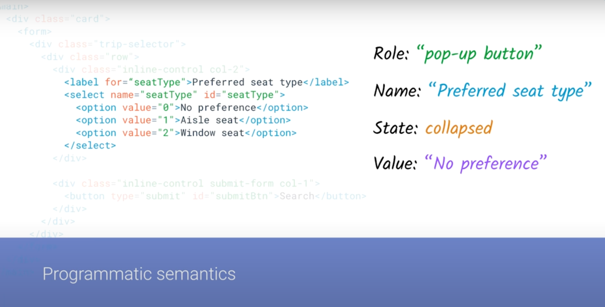

# Accessibility(a11y)

#### _Web accessibility means that people with disabilities can use the web (perceive, understand, navigate, interact & contribute to the web)_


<details >
 <summary style="font-size: x-large; font-weight: bold">Assistive technologies</summary>

- Keyboard only
- Screen reader
- Mouse & Pointer Devices
- Touchscreen Gestures
- Screen Magnifier


---
</details>


<details >
 <summary style="font-size: x-large; font-weight: bold">Accessibility Standards</summary>

_WCAG (Web Content Accessibility Guidelines)_

https://webaim.org/standards/wcag/checklist


**WebAIM(WCAG Principle)**

- Perceivable
- Operable
- Robust
- Understandable


---
</details>


<details >
 <summary style="font-size: x-large; font-weight: bold">Screen Reader</summary>

Referred Video: https://youtu.be/g2tzEil5TL0?si=KB55mkrFR6nxuE79
##### Semantic


##### Accessibility tree


### 1. Accessible HTML


- Document Structure

  (`<header>`, `<nav>`, `<main>`, `<footer>`, `<aside>`, `<article>`, `<section>`)

- Headings

  (`<h1>`, `<h2>`, `<h3>`, `<h4>`, `<h5>`, `<h6>`)

- Lists

  (`<ul>`, `<ol>`, `<li>`)

- Links & Buttons

  (`<a>`, `<button>`)

- Form elements

  (`<label>`, `<input type="email">`)

- Tables

  (`<table>`, `<tr>`, `<td>`, `<th>`, `<caption>`,`<tfoot>`)

- Images

  (``)

- Audio/Video

  (Transcript, Open Text Captions)

- CSS class hidden

<details >
 <summary style="font-size: small; font-weight: bold">Why just use `Button` instead of div?</summary>

https://youtu.be/CZGqnp06DnI?si=c0sQLuGzBrXDt9rT


- It is not auto-focusable and we need to add `tabindex="0"` to it.
- Screen reader does not announce it as button.


- We lose capability to click it through keyboards


- Disable does not work as expected

---
</details>

<details >
 <summary style="font-size: small; font-weight: bold">How to increase screen accessibility in case of Images?</summary>

[//]: # (**_How to increase screen accessibility in case of Images?_**)

https://web.dev/learn/accessibility/images
1. **Decorative Images**: A decorative image is a visual element that doesn't add additional context or information that allows the user to better understand the context.
- ``
-
```html
<!-- All of these choices lead to the same result. -->


```
- When you add a background image with CSS, a screen reader will not detect the image file.

2. **Informative images**: An informative image is an image that conveys a simple concept, idea, or emotion. Types of informative images include photos of real-world objects, essential icons, simple drawings, and images of text.
- Descriptions using `` elements are achieved by including the `alt` attribute
- `<svg>` elements **do not** use the `alt` attribute
```html
  <svg role="img"...>
     <title>Cartoon drawing of a red, black, and gray ladybug.</title>
  </svg>
```

3. **Functional images**: A functional image is connected to an action. An example of a functional image is a logo that links to the home page, a magnifying glass used as a search button, or a social media icon that directs you to a different website or app.
```html
<div title="Navigate to the homepage">
   <a href="/">
      </img>
   </a>
</div>
```
You can see from the code snippet that "Navigate to the homepage" is the wrapper title, and the image alternative text is "Lovely Ladybugs for your Lawn." When you listen to the logo code with a screen reader, you hear both the visual and the action conveyed in one image.

4. **Complex images**: https://web.dev/learn/accessibility/images#complex_images
   


---
</details>


### 2. ARIA(Accessible Rich Internet Applications)

<details >
 <summary style="font-size: large; font-weight: bold">Intro </summary>

https://www.youtube.com/watch?v=g9Qff0b-lHk&t=339s


1.

Here adding `role` and `aria-checked` attributes help `div`
to behave like checkbox

2.

We can also modify semantics for better screen readers

3.

We can express more through ARIA, like above is a tree and which
is not possible otherwise through any built-in methods

4.


5.


6.

`role="alert"` help to announce immediately when it appears

<br>


So ARIA surgically added attributes to our DOM tree to make
things accessible where we don't have built in support

**ARIA Capabilities Summary**


---
</details>


<details >
 <summary style="font-size: large; font-weight: bold">The art of labelling </summary>


https://youtu.be/8dCUzOiMRy4?si=oG_zgtQvypoDpvG8
1. `aria-label` attributes


This is very useful in places where we don't have built in support
like checkboxes, select, radio etc

2. `aria-labelledby` attributes


Here we are able to reference another element with `aria-labelledby`


It can also self-reference itself to give better accessibility


---
</details>


<details >
 <summary style="font-size: large; font-weight: bold">States & Properties</summary>

Google a11ycast Youtube: https://youtu.be/88tfx3jLV_M?si=r_JU2za9q_M3_SsQ

MDN: https://developer.mozilla.org/en-US/docs/Web/Accessibility/ARIA/Attributes

---
</details>


---
</details>


<details >
 <summary style="font-size: x-large; font-weight: bold">Focus Management</summary>


<details >
 <summary style="font-size: large; font-weight: bold">Tab Navigation</summary>

1. _**Html dictates focus order**_

   https://youtu.be/Pe0Ce1WtnUM?si=ZVK3HocBBwRvlWMf

Here visually `I should` button is at last but in focus appears first

2. By default focusable tag

- `<a>`
- `<button>`
- `<input>`
- `<select>`
- `<textarea>`
- `<iframe>`

3. Manually give focus using `tabindex = "0 | 1,2,3 ... | -1"`.

   https://youtu.be/Pe0Ce1WtnUM?si=zYYvSFUdhSDF3CzP
   1. But avoid using it if tag is by default-focusable

   

   2. Using `tabindex = "-1"` we can skip the focus.
   3. Also we can add focus programmatically using `focus()` like in above example
   4. Avoid using `tabindex` value **greater than 0**.
   `tabindex` > 0 will be on top of the tab order
   5. Always try to _**Higher in the tab order = earlier in the DOM**_


---
</details>


<details >
 <summary style="font-size: large; font-weight: bold">Keyboard Shortcuts</summary>

- We can create keyboard shortcut using JS
- Like twitter has got many shortcut
  
- 

---
</details>


<details >
 <summary style="font-size: large; font-weight: bold">Skip Links</summary>

Short Explanation: https://www.w3schools.com/accessibility/accessibility_skip_links.php
<br>
Long Verbose: https://css-tricks.com/how-to-create-a-skip-to-content-link/

The most common skip link is the first interactive element on a page. 
It takes the user to the main content, past the global elements like the logo, 
search and navigation. It is almost always hidden until it receives focus.

---
</details>


<details >
 <summary style="font-size: large; font-weight: bold">Active Element</summary>

Whenever we open a modal then once we close the modal focus again should go
back to where we left. But it is not always the case.

To achieve this do something like below

```js
/** A modal is about to be opened */
/** Store the current new item */

const currentItem = document.activeElement;

/** Open the modal */
/** On modal close, refocus on the new item they had opened */

currentItem.focus();
```

---
</details>

<details >
 <summary style="font-size: large; font-weight: bold">Tab Trapping</summary>


When we make any modal there is good chance if you don't handle it then
clicking `tab` button focus may go outside the modal.

To handle this, we need to do  `tab trapping`, using techniques
like below.
Using this focus remains withing modal itself

```js
// Trap focus within the modal
  modal.addEventListener('keydown', function (e) {
    const isTabPressed = e.key === 'Tab' || e.keyCode === 9;

    if (isTabPressed) {
      // Check if the last focusable element is focused
      if (e.shiftKey) {
        // Shift + Tab: Check if focus is on the first focusable element
        if (document.activeElement === modal) {
          e.preventDefault();
          modal.focus(); // Move focus to the last focusable element
        }
      } else {
        // Tab: Check if focus is on the last focusable element
        const focusableElements = modal.querySelectorAll('button, [href], input, select, textarea, [tabindex]:not([tabindex="-1"])');
        const lastFocusable = focusableElements[focusableElements.length - 1];

        if (document.activeElement === lastFocusable) {
          e.preventDefault();
          modal.focus(); // Move focus to the first focusable element
        }
      }
    }
  });
```


For more details: https://youtu.be/JS68faEUduk?si=w_7xmWPDPU-o9Oe4

---
</details>


<details >
 <summary style="font-size: large; font-weight: bold">Page Navigation</summary>

- Skip link
- aria-live
- contentElement.focus()


---
</details>


---
</details>


<details >
 <summary style="font-size: x-large; font-weight: bold">Color Contrast</summary>

https://youtu.be/LBmLspdAtxM?si=7PuaKfX9GwfU9mUn


- `em` instead of `px` for font size
- `prefers-color-scheme` & `prefers-contrast`

---
</details>

<details >
 <summary style="font-size: x-large; font-weight: bold">Tools</summary>


---
</details>


<details >
 <summary style="font-size: x-large; font-weight: bold">Questions</summary>

<details >
 <summary style="font-size: medium; font-weight: bold">What is difference using nav tag instead of defining aria-role</summary>


## Aria

https://css-tricks.com/why-how-and-when-to-use-semantic-html-and-aria/

_
ChatGPT?_

The `<nav>` element is a semantic HTML5 element used to define a section of navigation links on a webpage. It's used to mark up blocks of navigation links, such as menus, tables of contents, and indexes.

On the other hand, ARIA (Accessible Rich Internet Applications) attributes like role are used to enhance the accessibility of web content. The role attribute specifies the role of an element in the document structure. It can be used to indicate to assistive technologies, like screen readers, how an element should be interpreted.

Using the `<nav>` element is preferred over manually defining aria-role="navigation" for navigation sections because:

- **Semantic Meaning:** `<nav>` carries semantic meaning inherently. It clearly signifies to both humans and machines that the enclosed content represents navigation links.
- **Accessibility:** While ARIA roles can enhance accessibility, relying on semantic HTML elements like `<nav>` reduces the need for additional attributes and ensures better compatibility with assistive technologies.
- **Readability and Maintainability:** Semantic HTML improves code readability and maintainability. Using `<nav>` makes the code cleaner and more understandable compared to manually adding ARIA attributes.
  In summary, while both methods can achieve similar results, using semantic HTML elements like `<nav>` is generally preferred because it promotes better accessibility, readability, and maintainability of the code.

```html
<nav>: Represents a section of navigation links.
Instead of aria-role="navigation".
<main>: Represents the main content of the document.
Instead of aria-role="main".
<article>: Represents an independent piece of content that is self-contained and can be distributed and reused independently.
Instead of aria-role="article".
<section>: Represents a generic section of a document or application.
Instead of aria-role="region" (when used for generic sections).
<aside>: Represents content tangentially related to the content around it, such as sidebars.
Instead of aria-role="complementary".
<header>: Represents introductory content, typically containing headings and/or navigational aids.
Instead of aria-role="banner" (when used for page headers).
<footer>: Represents a footer for its nearest sectioning content or sectioning root element.
Instead of aria-role="contentinfo".
<figure>: Represents self-contained content, typically with an optional caption, such as images or diagrams.
Instead of aria-role="figure".
<figcaption>: Represents the caption or legend for a figure element.
Instead of aria-role="caption".
<dialog>: Represents a dialog box or other interactive component.
Instead of aria-role="dialog".
<menu>: The <menu> HTML element is described in the HTML 
    specification as a semantic alternative to <ul>, 
    but treated by browsers (and exposed through the accessibility tree) 
    as no different than <ul>. It represents an unordered list of items
   (which are represented by <li> elements).
```

---
</details>


<details >
 <summary style="font-size: medium; font-weight: bold">What are the different ways to visually hide content (and make it available only for screen readers)?</summary>

https://www.greatfrontend.com/questions/quiz/what-are-the-different-ways-to-visually-hide-content-and-make-it-available-only-for-screen-readers?practice=practice&tab=quiz

These techniques are related to accessibility (a11y).

## Small/zero size

`width: 1px; height: 1px` and a combination of using CSS clip to make the element take up (barely any) space on the screen at all.

Using `width: 0; height; 0` is not recommended because search engines might penalize this thinking it has a malicious intention, like keyword stuffing.

## Absolute positioning

`position: absolute; left: -99999px` will position an element way outside of the screen. However, as per [WebAIM's article](https://webaim.org/techniques/css/invisiblecontent/):

> Navigable elements, such as links and form controls, should not be hidden off-screen. They would still be navigable by sighted keyboard users, but would not be visible to them, unless they are styled to become visible when they receive keyboard focus.

Use this only when your contents contain only text.

## Text indentation

`text-indent: -9999px`. This only works on text within the `block` elements. Similar to the absolute positioning technique above, focusable elements given this style will still be focusable, causing confusion for sighted users who use keyboard navigation.

## Incorrect ways

The following ways are incorrect because they hide content from the user **AND** screen readers, which is incorrect if the purpose is to expose to screen readers only.

- `display: none`
- `visibility: hidden`
- `hidden` attribute

## Techniques in the wild

Ideally, it is recommended to combine the above approaches to make sure it works properly in all browsers.

Instead of implementing your own way to remove an element from the rendering tree and the a11y tree, you are recommended to use one of the following approaches from mature CSS frameworks, which have been battle-tested on many websites.

### Tailwind CSS

```css
.sr-only {
  position: absolute;
  width: 1px;
  height: 1px;
  padding: 0;
  margin: -1px;
  overflow: hidden;
  clip: rect(0, 0, 0, 0);
  white-space: nowrap;
  border-width: 0;
}
```

### Bootstrap CSS

```css
.visually-hidden,
.visually-hidden-focusable:not(:focus):not(:focus-within) {
  position: absolute !important;
  width: 1px !important;
  height: 1px !important;
  padding: 0 !important;
  margin: -1px !important;
  overflow: hidden !important;
  clip: rect(0, 0, 0, 0) !important;
  white-space: nowrap !important;
  border: 0 !important;
}
```

## References

- [CSS in Action - Invisible Content Just for Screen Reader Users](https://webaim.org/techniques/css/invisiblecontent/)

---
</details>

---
</details>
