# Security

### Types of attack
1. XSS 
2. CSRF 
3. IFrame Protection 
4. Security Headers 
5. Client-Storage Security 
6. Secure Communication (HTTPS)
7. Dependency Security 
8. Compliance and Regulations 
9. Input Validation and Sanitization 
10. Server-Side Request Forgery (SSRF)
11. Server-side JavaScript Injection (SSJI)
12. Feature Policy | Permissions-Policy 
13. Subresource Integrity (SRI)
14. Cross-Origin Resource Sharing (CORS)


<details >
 <summary style="font-size: x-large; font-weight: bold">XSS(Cross-Site Scripting)</summary>


### Type vulnerability
1. User session hacking
2. Unauthorized activities
3. Capturing keystrokes
4. Stealing critical information
5. Phishing attack

### How this attacks are possible?
1. If user is able to insert any script(JS) into your website then they can render there HTML,CSS & JS which can mimic like your website and do sort of attack mentioned here
2. This mostly happen through user input

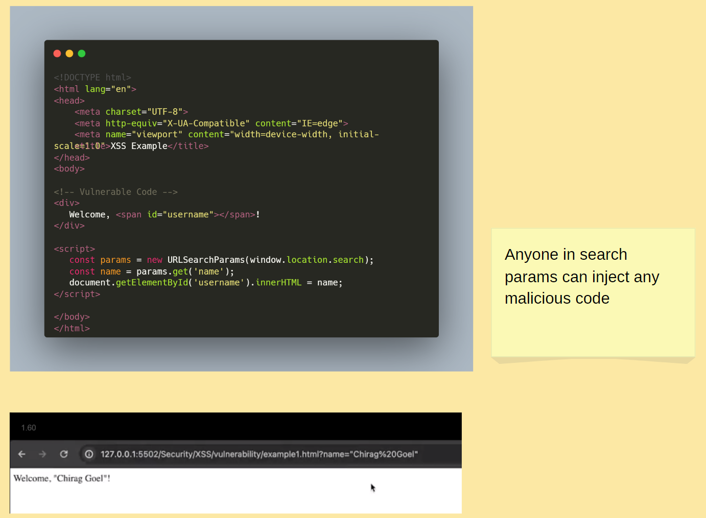
https://github.com/namastedev/namaste-frontend-system-design/blob/master/Security/XSS/vulnerability/example1.html


<details >
 <summary style="font-size: large; font-weight: bold">User Session Hacking</summary>

```html
<!DOCTYPE html>
<html lang="en">
<head>
    <meta charset="UTF-8">
    <meta http-equiv="X-UA-Compatible" content="IE=edge">
    <meta name="viewport" content="width=device-width, initial-scale=1.0">
    <title>XSS Example</title>
</head>
<body>

<!-- Vulnerable Code -->
<div>
    Welcome, <span id="username"></span>!
 </div>

<script>
    // Function to set a cookie, mostly this will be set from server
    function setCookie(name, value, days) {
        const date = new Date();
        date.setTime(date.getTime() + (days * 24 * 60 * 60 * 1000));
        const expires = "expires=" + date.toUTCString();
        document.cookie = name + "=" + value + ";" + expires + ";path=/";
    }

    // Example: Set a cookie named "exampleCookie" with value "Hello, Cookie!" that expires in 7 days
    setCookie("exampleCookie", "Hello, Cookie!", 7);
</script>

<!-- Vulnerable Code -->
<script>
    const params = new URLSearchParams(window.location.search);
    const name = params.get('name');
    document.getElementById('username').innerHTML = `${name}`;
 </script>

</body>
</html>
```

Here user can pass malicious code in url param like below. We need to use `encodeURIComponent` to encode below code, so that special character interpreted correctly
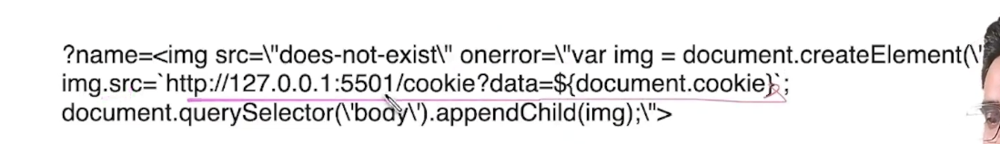

Hacker able to hit his own server with our user cookies information. Cookies can be holding authorization details
which will help hacker to hijack the user session
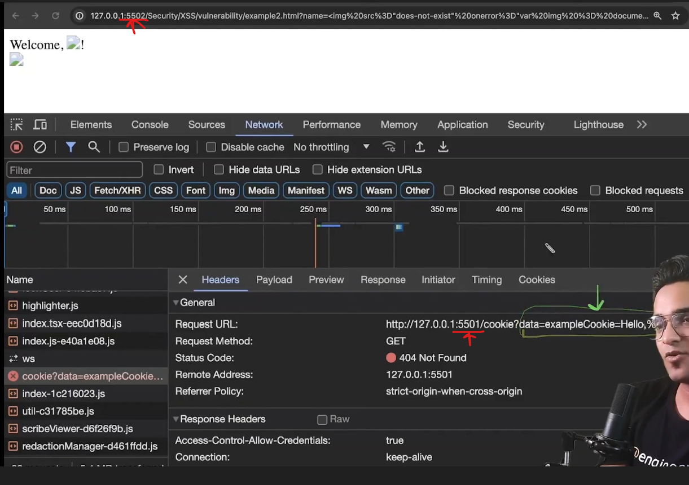
User cookies hijacked by hacker.
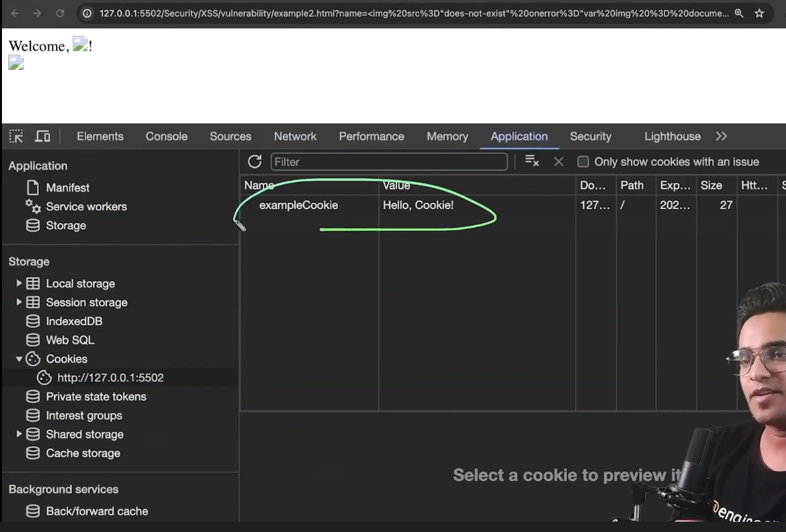
</details>


<details >
 <summary style="font-size: large; font-weight: bold">Unauthorized activities</summary>

```html
<!DOCTYPE html>
<html lang="en">
  <head>
    <meta charset="UTF-8" />
    <meta http-equiv="X-UA-Compatible" content="IE=edge" />
    <meta name="viewport" content="width=device-width, initial-scale=1.0" />
    <title>XSS Example</title>
  </head>
  <body>
    <!-- Vulnerable Code -->
    <div>
      Welcome, <span id="username"></span>! TimeZone,
      <span id="timezone"></span>!
    </div>

    <script>
      // Function to set a cookie, mostly this will be set from server
      function setCookie(name, value, days) {
        const date = new Date();
        date.setTime(date.getTime() + days * 24 * 60 * 60 * 1000);
        const expires = "expires=" + date.toUTCString();
        document.cookie = name + "=" + value + ";" + expires + ";path=/";
      }

      // Example: Set a cookie named "exampleCookie" with value "Hello, Cookie!" that expires in 7 days
      setCookie("exampleCookie", "Hello, Cookie!", 7);
    </script>

    <!-- Vulnerable Code -->
    <script>
      const params = new URLSearchParams(window.location.search);
      const name = params.get("name");
      document.getElementById("username").innerHTML = name;
    </script>

    <script>
      function createPost(title, description) {
        var xhr = new XMLHttpRequest();
        xhr.open("POST", '/post', true);
        console.log(document.cookie);
        xhr.withCredentials = true;
        xhr.setRequestHeader(
          "Content-type",
          "application/x-www-form-urlencoded"
        );
        xhr.send(`txtName=${title}&mtxMessage=${description}`);
      }
    </script>
  </body>
</html>
```

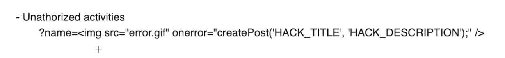


Since Hacker was able to hit his own server with our user cookies information. So any unauthorized activities can be done by hacker.
</details>


<details >
 <summary style="font-size: large; font-weight: bold">Capturing Key strokes</summary>

Just like session we can pass malicious code which can track our user keystrokes activities and send it to hacker server
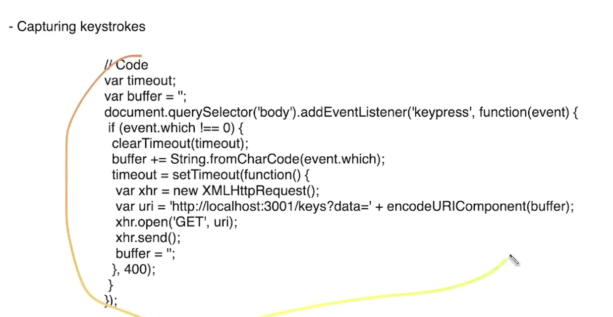
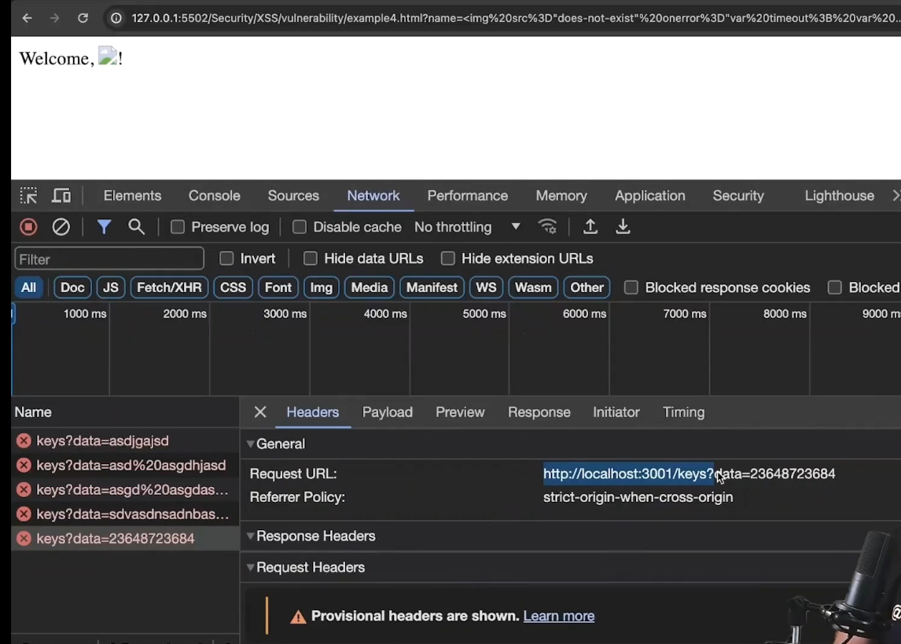
</details>


<details >
 <summary style="font-size: large; font-weight: bold">Stealing critical information</summary>

Same like above we can pass malicious code in params and it steals all user details by tacking whole HTML page
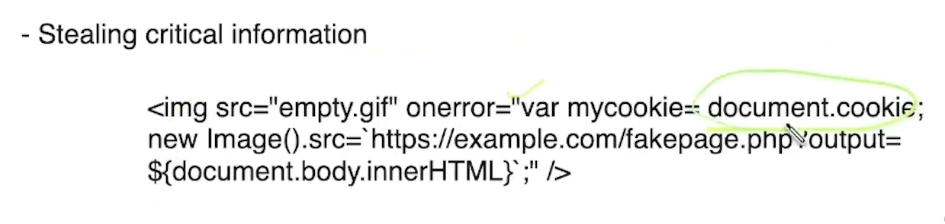
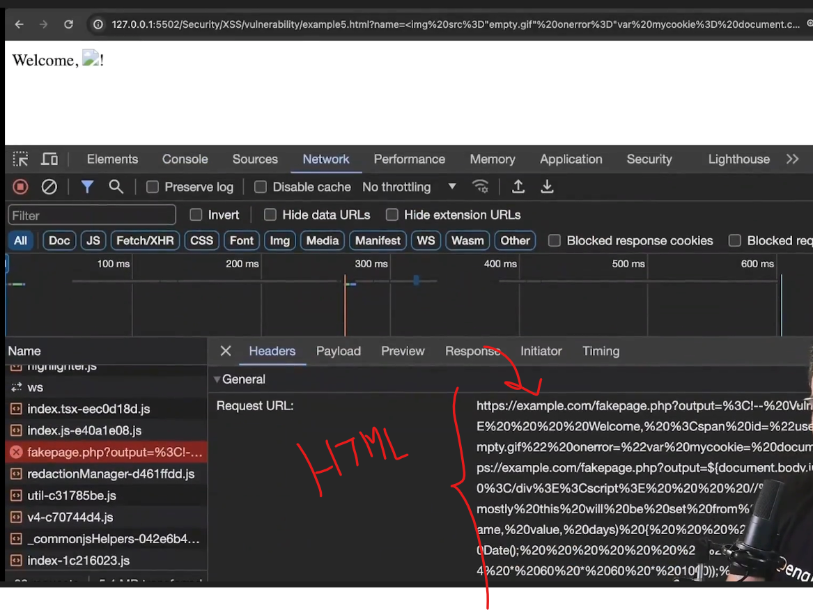
</details>


<details >
 <summary style="font-size: large; font-weight: bold">Phishing attack</summary>

Again like above malicious form was injected through params and now user was tricked thinking this real form and
might share their username and password which be sent to hacker
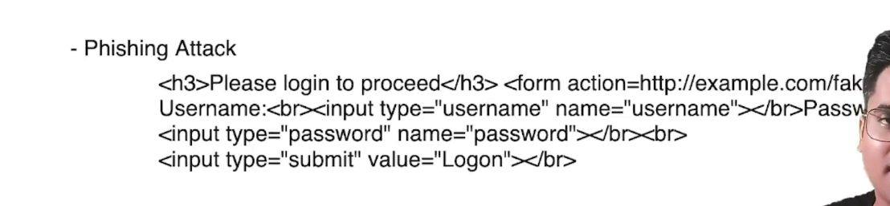
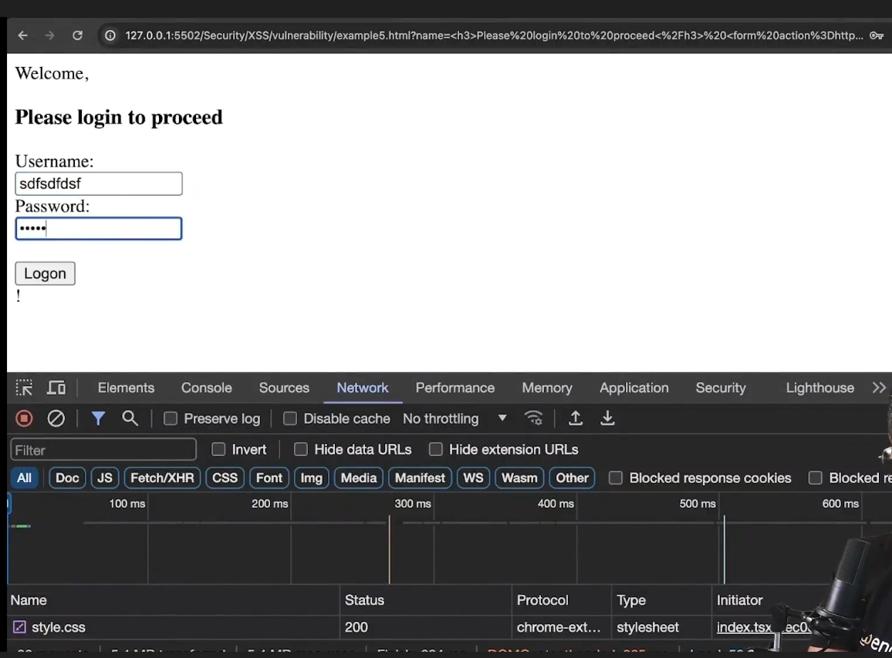
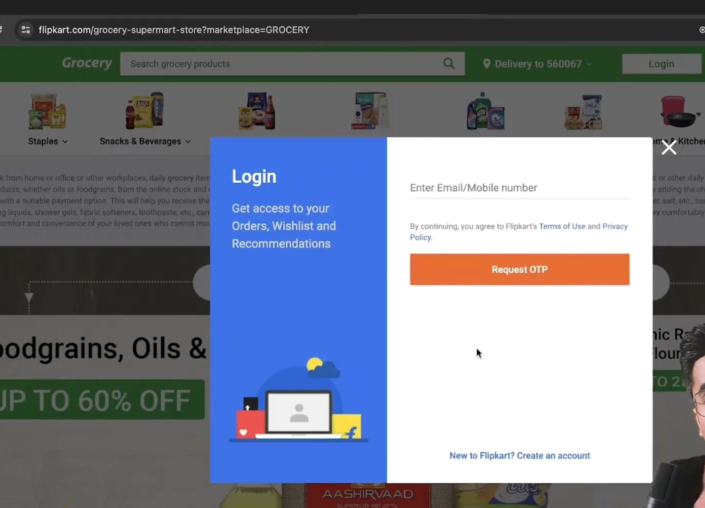
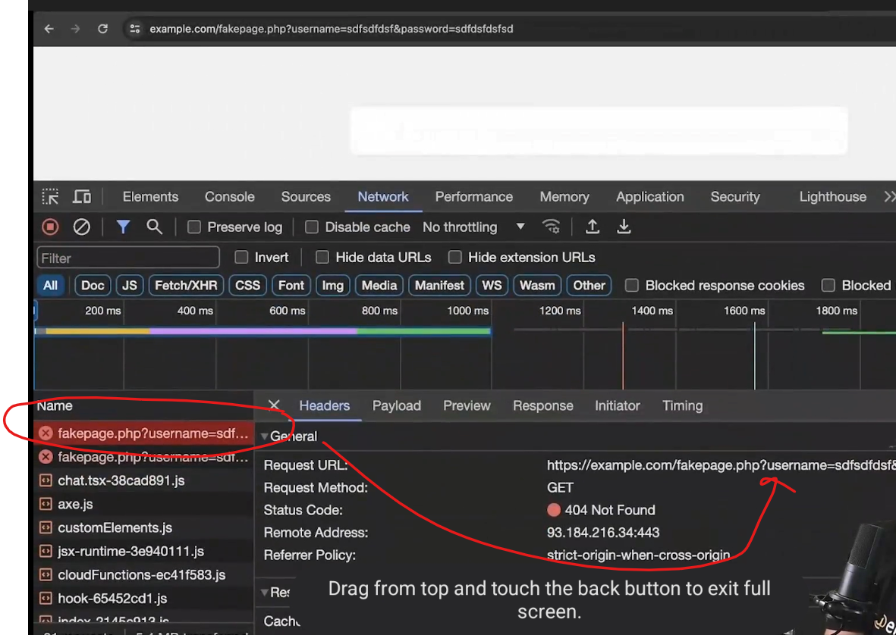
</details>


### Mitigation
1. List all possible way to take input 
2. In place of of innerHTML with “textContent” (For Older Browsers)
3. Escaping 
4. Use library like React 
5. Sanitize using DOMPurify 
6. CSP Headers (Content Security Policy)
7. Avoid using eval

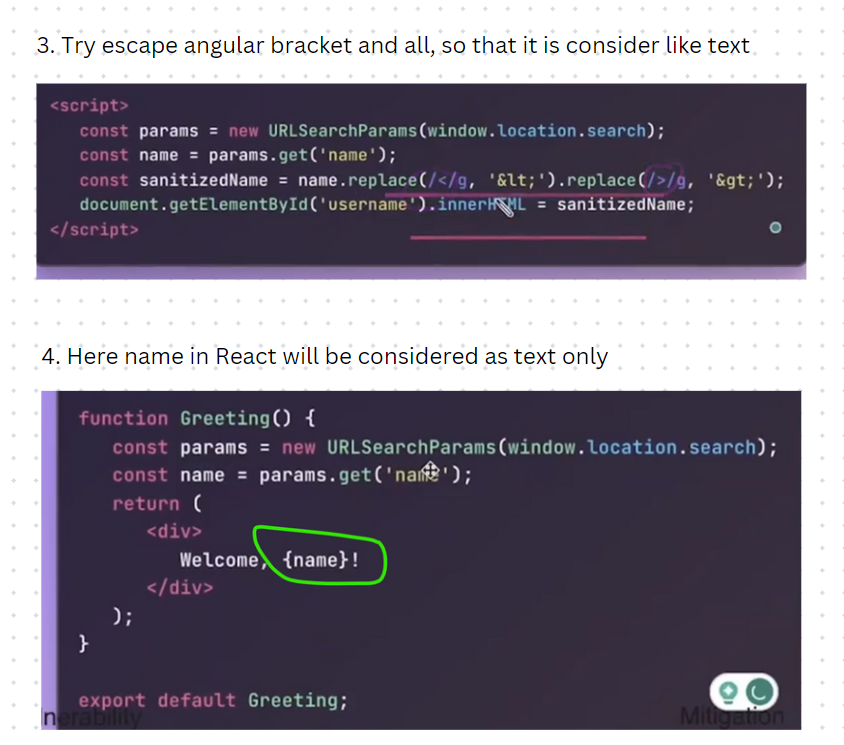


<details >
 <summary style="font-size: large; font-weight: bold">Content Security Policy(CSP)</summary>


<details >
 <summary style="font-size: medium; font-weight: bold">Allowed Sources</summary>

```js
const express = require("express");

const PORT = 3010;
const app = express();

//CSP middleware
app.use((req, res, next) => {
    res.setHeader(
        'Content-Security-Policy',
        "default-src 'self';" + 
        "script-src 'self' http://unsecure.com;"
    );
    next();
})

app.use(express.static('public'));

app.get('/', (req, res) => {
    console.log(req.url);
    res.sendFile(__dirname + '/index.html');
});

app.listen(PORT, () => {
    console.log(`Server started at http://locolhost:${PORT}`);
});
```

- We above CSP policy `"default-src 'self';"` we can make sure that we don't allow any other source to load anything like images, js etc.
- If we want to allow any other sources then we add `script-src 'self' http://unsecure.com;`


Without Any CSP policy, we are able to load linked image here
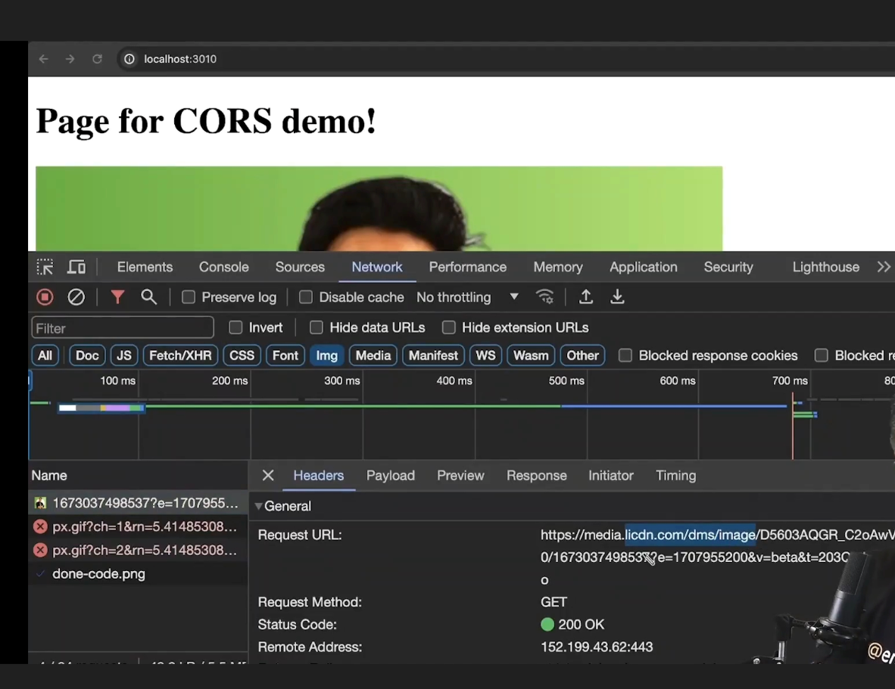

With CSP policy, it was restricted
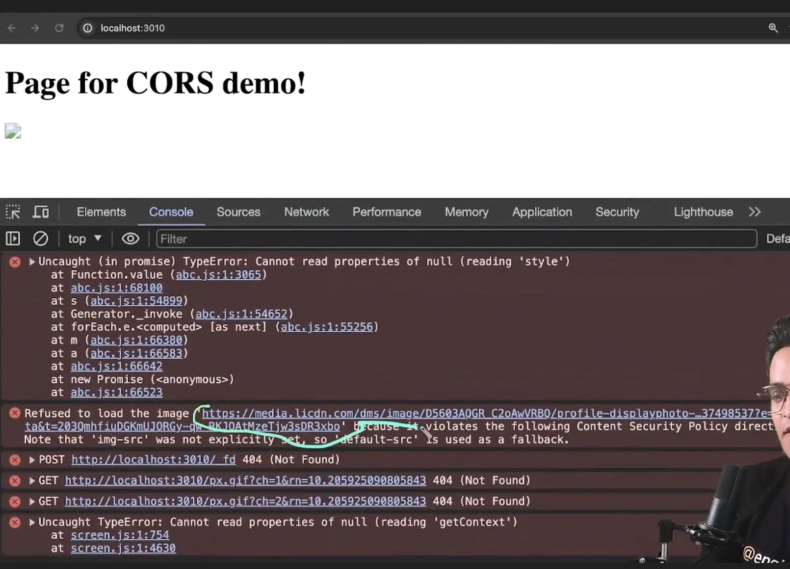
</details>


<details >
 <summary style="font-size: medium; font-weight: bold">Script Nonce</summary>

Middleware
```js
app.use((req, res, next) => {
    res.setHeader(
        'Content-Security-Policy',
        "default-src 'self';" + 
        "script-src 'self' 'nonce-randomKey' 'unsafe-inline' http://unsecure.com;"
    );
    next();
})
```

```html
<!DOCTYPE html>
<html lang="en">
<head>
    <meta charset="UTF-8">
    <meta name="viewport" content="width=device-width, initial-scale=1.0">
    <title>Document</title>
    <script src="http://unsecure.com/abc.js"></script>
    
    //script with nonce
    <script nonce="randomKey">
        console.log('My trusted code!')
    </script>

    <script>
        console.log('My non-trusted code!')
    </script>
</head>
<body>
    <h1>Page for CORS demo!</h1>
    
</body>
</html>
```

Here with above CSP set are able to execute only `trusted code` which has `nonce` set
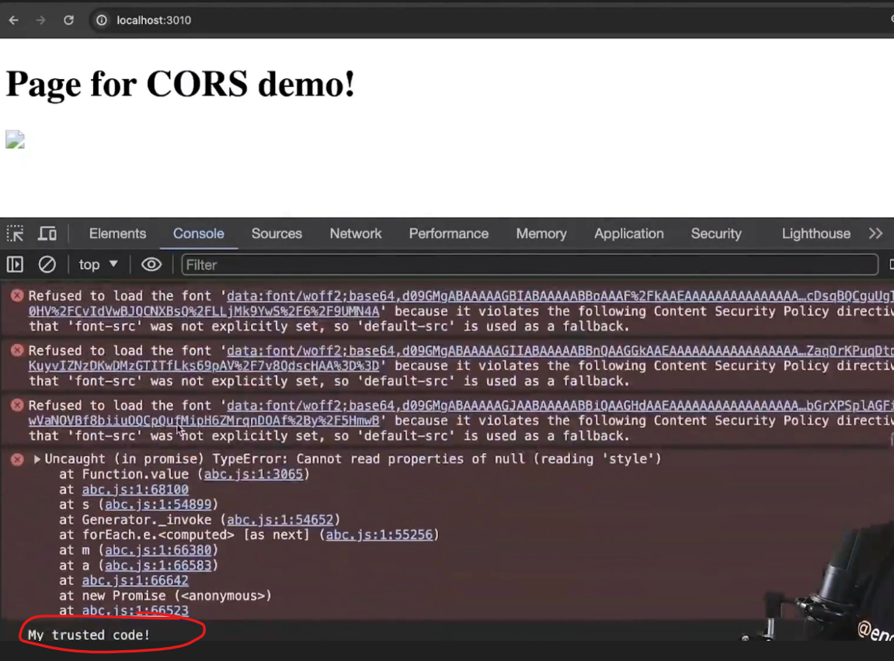
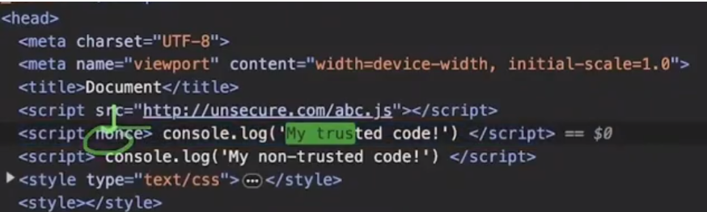
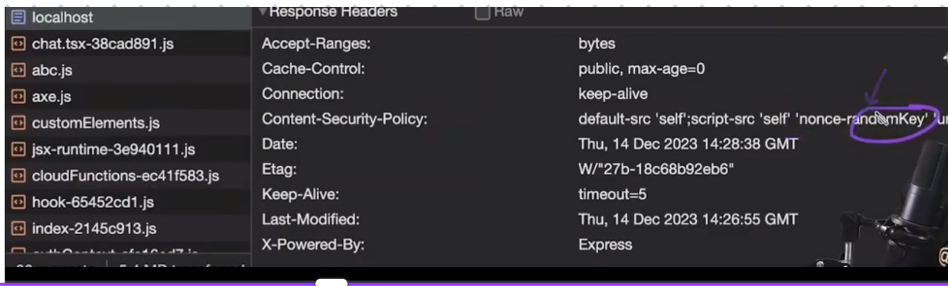
</details>


<details >
 <summary style="font-size: medium; font-weight: bold">Report-only mode</summary>

- Works only on HTTPS
- `report-to default; report-uri URL`
</details>

</details>

</details>
