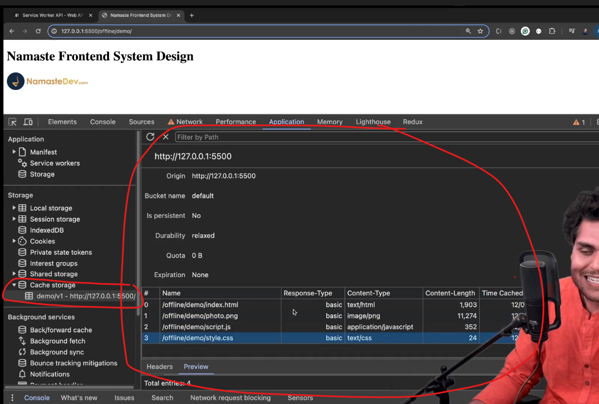

**Web Workers enable background JavaScript execution, while Service Workers act as a proxy between the browser and the network, enabling offline capabilities, caching, and push notifications.**


<details >
 <summary style="font-size: x-large; font-weight: bold">What are workers in JavaScript used for?</summary>

https://www.greatfrontend.com/questions/quiz/what-are-workers-in-javascript-used-for
## TL;DR

Workers in JavaScript are background threads that allow you to run scripts in parallel with the main execution thread, without blocking or interfering with the user interface. Their key features include:

- **Parallel processing**: Workers run in a separate thread from the main thread, allowing your web page to remain responsive to user interactions while the worker performs its tasks. It's useful for moving CPU-intensive work off the main thread and be free from JavaScript's single-threaded nature.
- **Communication**: Uses `postMessage()` and `onmessage`/ `'message'` event for messaging.
- **Access to web APIs**: Workers have access to various Web APIs, including `fetch()`, IndexedDB, and Web Storage, allowing them to perform tasks like data fetching and persisting data independently.
- **No DOM access**: **Workers cannot directly manipulate the DOM**, thus cannot interact with the UI, ensuring they don't accidentally interfere with the main thread's operation.

There are three main types of workers in JavaScript:

- **Web workers / Dedicated workers**
    - Run scripts in background threads, separate from the main UI thread.
    - Useful for CPU-intensive tasks like data processing, calculations, etc.
    - Cannot directly access or manipulate the DOM.
- **Service workers**
    - Act as network proxies, handling requests between the app and network.
    - Enable offline functionality, caching, and push notifications.
    - Runs independently of the web page, even when it's closed.
- **Shared workers**
    - Can be shared by multiple scripts running in different windows or frames, as long as they're in the same domain.
    - Scripts communicate with the shared worker by sending and receiving messages.
    - Useful for coordinating tasks across different parts of a web page.

---

## Workers in JavaScript

Workers in JavaScript are a way to run scripts in background threads, separate from the main execution thread of a web page. This allows for long-running or computationally intensive tasks to be offloaded from the main thread, preventing the user interface from becoming unresponsive or janky.

## Web workers / Dedicated workers

- Run scripts in background threads separate from the main UI thread.
- Designed for CPU-intensive tasks like data processing, mathematical computations, etc. Generally the non-async work.
- Cannot directly access the DOM or other main thread resources for security.
- Communicates with main thread via asynchronous message passing – `postMessage()` and `onmessage`/ `'message'`.
- Terminated when main script is unloaded or explicitly terminated.

Web workers can be used for:

- Image/video processing
- Data compression
- Complex math

### Creating a web worker

To create a web worker, you need a separate JavaScript file that contains the code for the worker. Here's an example:

**`main.js` (main script)**

```js
// Check if the browser supports workers
if (window.Worker) {
  // Create a new Worker
  const myWorker = new Worker('worker.js');

  // Post a message to the worker
  myWorker.postMessage('Hello, Worker!');

  // Listen for messages from the worker
  myWorker.onmessage = function (event) {
    console.log('Message from Worker:', event.data);
  };

  // Error handling
  myWorker.onerror = function (error) {
    console.error('Error from Worker:', error);
  };
}
```

**`worker.js` (worker script)**

```js
// Listen for messages from the main script
onmessage = function (event) {
  console.log('Message from Main Script:', event.data);

  // Perform a task (e.g., some computation)
  const result = event.data + ' - Processed by Worker';

  // Post the result back to the main script
  postMessage(result);
};
```

In this example:

- `main.js` creates a worker using the `Worker` constructor and specifies `worker.js` as the script to run in the worker thread.
- It posts a message to the worker using `postMessage()`.
- The worker script (`worker.js`) listens for messages from the main script using `onmessage`.
- After processing the message, the worker posts a message back to the main script using `postMessage()`.
- The main script listens for messages from the worker using `onmessage` on the `Worker` instance.

### Service workers

- Act as a network proxy between web app, browser, and network.
- Can intercept and handle network requests, cache resources.
- Enable offline functionality and push notifications.
- Have a lifecycle managed by the browser (install, activate, update).
- No access to DOM and main thread resources for security.

Service workers can be used for:

- Caching
- Offline support
- Request handling
- Background sync

#### Creating a service worker

**`main.js` (main script)**

```js
if ('serviceWorker' in navigator) {
  navigator.serviceWorker
    .register('/service-worker.js')
    .then(function (registration) {
      console.log('Service Worker registered:', registration);
    })
    .catch(function (err) {
      console.log('Service Worker registration failed:', err);
    });
}
```

**`service-worker.js` (service worker script)**

```js
self.addEventListener('fetch', function (event) {
  event.respondWith(
    caches.match(event.request).then(function (response) {
      // return cached response if available
      if (response) {
        return response;
      }

      // Otherwise, fetch from network
      return fetch(event.request);
    }),
  );
});
```

In this example:

- The main script registers a service worker at `/service-worker.js`
- The service worker listens for the `fetch()` event, which is fired whenever the browser makes a network request
- The service worker first checks if the requested resource is cached using `caches.match(event.request)`
- If it is, it returns the cached response. Otherwise, it fetches the resource from the network using `fetch(event.request)`

### Bonus: Shared workers

- **Scope**: Can be accessed from multiple scripts in different windows/tabs/iframes
- **Sharing of data**: Allow data sharing between browser contexts via a messaging interface
- **Browser support**: Limited support, especially [not available on Android browsers](https://issues.chromium.org/issues/40290702)

#### Use cases for shared workers:

- State sharing across multiple windows.

### Bonus: Worklets

The `Worklet` interface is a lightweight version of Web Workers and gives developers access to low-level parts of the rendering pipeline. With Worklets, you can run JavaScript and WebAssembly code to do graphics rendering or audio processing where high performance is required.

You are not expected to know about worklets, so it won't be covered in great detail. Read more about [worklets on MDN](https://developer.mozilla.org/en-US/docs/Web/API/Worklet).

## Considerations and limitations

- **Same-Origin policy**: Workers must comply with the same-origin policy, meaning the script that creates the worker and the worker script itself must be from the same origin
- **No DOM access**: Workers do not have direct access to the DOM. They can communicate with the main thread through messages
- **Performance**: Creating and managing workers incurs overhead. They should be used judiciously for tasks that truly benefit from parallel execution
- **Error handling**: Proper error handling mechanisms should be in place to handle any issues within the worker scripts

## Further reading

- [Worker - MDN](https://developer.mozilla.org/en-US/docs/Web/API/Worker)
- [Using Web Workers - MDN](https://developer.mozilla.org/en-US/docs/Web/API/Web_Workers_API/Using_web_workers)
- [Service Worker API - MDN](https://developer.mozilla.org/en-US/docs/Web/API/Service_Worker_API)
- [Understanding web workers in JavaScript with real world example](https://javascript.plainenglish.io/understanding-web-workers-in-js-with-real-world-example-1629a283aeec?gi=89cf0dd4c3f4)
- [Web worker, Service worker, and Worklets: A comprehensive guide](https://dev.to/bharat5604/web-worker-service-worker-and-worklets-a-comprehensive-guide-1f64)

---
</details>


<details >
 <summary style="font-size: x-large; font-weight: bold">Service Worker</summary>

- Service workers essentially act as proxy servers that sit between web applications, the browser, and the network (when available). 
- They are intended, among other things, to enable the creation of effective offline experiences, intercept network requests, and take appropriate action based on whether the network is available, and update assets residing on the server. 
- They will also allow access to push notifications and background sync APIs.
- Browser provides **separate thread** to service worker, which does not impact website performance.
- It works only on **HTTPS**, for security reasons. In firefox we can't open this in private window also.
- It does not work all browsers, but it is supported by most of them.
- A service worker is an event-driven worker
- It **can't access DOM, local storage, session storage**
- We can have multiple service workers for a single website. We can define scope of service worker to be at root or any folder

https://developer.mozilla.org/en-US/docs/Web/API/Service_Worker_API

Difference between Service Worker and Web Worker: 
1. https://dev.to/bharat5604/web-worker-service-worker-and-worklets-a-comprehensive-guide-1f64
2. https://www.dhiwise.com/post/web-workers-vs-service-workers-in-javascript
### Setting Up Service Worker

```html
//index.html

<!DOCTYPE html>
<html lang="en">
  <head>
    <meta charset="UTF-8" />
    <meta name="viewport" content="width=device-width, initial-scale=1.0" />
    <title>Namaste Frontend System Design</title>
    <link rel="stylesheet" href="./style.css" />
    <link rel="manifest" href="./manifest.json" />
  </head>
  <body>
    <h1>Namaste Frontend System Design</h1>
    
    <script src="./script.js"></script>
  </body>
</html>
```

1. Create a `sw.js` file. We can name it whatever we want.
2. Register the service worker.
```js
//script.js

// Check if service worker is supported by our browser
if (navigator.serviceWorker) {
  // Register the service worker

  navigator.serviceWorker
    .register("./sw.js", {
      scope: "./",
    })
    .then((res) => {
      console.log("Service worker registered successfully");
    })
    .catch((err) => {
      console.log("Error registering service worker", err);
    });
}
```

3. Service worker are Event-Driven. Below are some events that are triggered by the service worker.
```js
//sw.js

self.addEventListener("install", (e) => {

});

self.addEventListener("activate", (e) => {

});

self.addEventListener("fetch", (e) => {

});
```

4. All the data which is needed to render a page like html, css, js etc are stored by service worker in `cache storage`.

```js
//sw.js

const CACHE_NAME = "demo/v7";

const CACHE_FILES = [
  "./index.html",
  "./style.css",
  "./photo.png",
  "./script.js",
];

self.addEventListener("install", (e) => {
  e.waitUntil(
    caches.open(CACHE_NAME).then((cache) => {
      cache.addAll(CACHE_FILES);
    })
  );
});
```


5. How to use service worker?

Always first fetch data from network and if user is offline then fetch data from cache as backup
```js
//sw.js

self.addEventListener("fetch", (e) => {
    // Offline exprience
    // Whenever a file is requested,
    // 1. fetch from network, update my cache 2. cache as a fallback

    e.respondWith(
        fetch(e.request)
            .then((res) => {
                // update my cache
                const cloneData = res.clone();
                caches.open(CACHE_NAME).then((cache) => {
                    cache.put(e.request, cloneData);
                });
                console.log("returning from network");
                return res;
            })
            .catch(() => {
                console.log("returning from cache");
                return caches.match(e.request).then((file) => file);
            })
    );
});
```
With this whenever we have fetch call then it is intercepted by our service work and we try to get data from server
if fetch was successful then cache is updated and we return the response.

But if something goes wrong like server is down, network issue etc then we return from cache.


6. Clean-Up Step: Once start having multiple version of the same service work, then cleaning previous version cached data is 
important. We can do this during `activate` event

```js
self.addEventListener("activate", (e) => {
  // Clean up useless cache
  e.waitUntil(
    caches.keys().then((keyList) => {
      return Promise.all(
        keyList.map((key) => {
          if (key != CACHE_NAME) {
            return caches.delete(key);
          }
        })
      );
    })
  );
});
```
### Here are the two primary strategies:

1. **Cache-First Strategy :** Show data from the cache first, then make an API call in the background to update the cache.

    **Use Case:**
    When you want to prioritize faster load times and offline availability.
    Ideal for content that doesn’t change frequently.

2. **Network-First Strategy:** Make an API call first to fetch the latest data, then cache the response, and fall back to the cache if the network request fails.

    **Use Case:**
    When you want to ensure the user always gets the most up-to-date data.
    Ideal for dynamic content that changes frequently.

**Tips for choosing the Right Strategy:**

1. **Cache-First Strategy** is generally better for applications where performance and offline access are critical, and the data doesn’t change too often, such as news articles, blogs, or static content.
2. **Network-First Strategy** is more suitable for applications where the most recent data is important, such as social media feeds, stock prices, or real-time applications.


We can however also use a combination of both Strategies. For example, you might use a cache-first strategy for static assets (like images and CSS) and a network-first strategy for dynamic API calls.

**How to create a service worker in a react application**: https://engagespot.co/blog/how-to-create-a-service-worker-in-a-react-application

---
</details>


<details >
 <summary style="font-size: x-large; font-weight: bold">Progressive Web App</summary>


---
</details>

