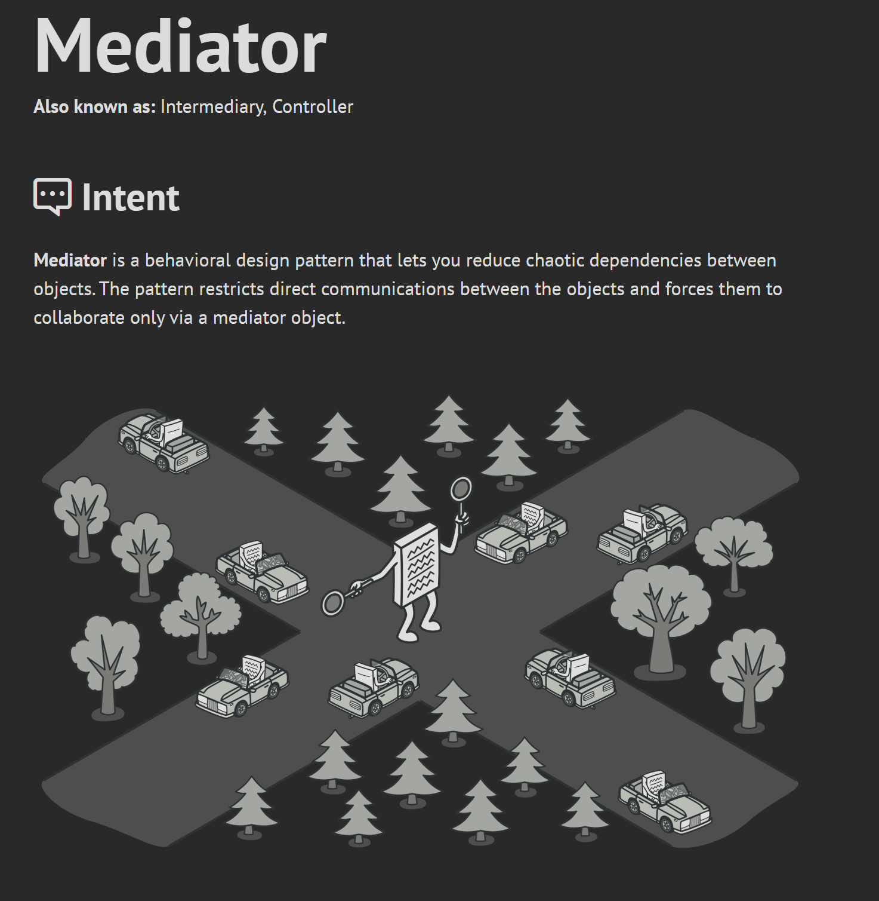

# HLD

 

Referred Video: https://youtu.be/sV_4pOGosnU?si=PXspG159hZdboh9Y

Referred Video: https://youtu.be/QemIfzcEeMM?si=q8f2_Qy3aLAB5mgv

 
Samosa Wala Journey

Referred Video: https://youtu.be/44mOnnt5pic?si=4Kujw-bc-teDK2dP

Design Patterns: https://www.patterns.dev/vanilla

 
SEO

1. Canonical tags: Helps ignore any other version which leads to same URL like https://flipkart.com/ and https://www.flipkart.com/ will lead to same URL

2. If you don't want SEO to index few things then use robots.txt to avoid indexing such routes

3. Site map help you list all the pages in your website, which can be used by search engines

 
Design Pattern

Quick Explanation: https://www.youtube.com/watch?v=tv-_1er1mWI

### Creational Design Pattern

1. 
2. 
3. 
4. 

### Structural Design Pattern

1. 
2. 

### Behavioral Design Pattern

1. 
2. 
3. 
4. 

1. https://refactoring.guru/design-patterns/singleton
2. https://javascriptpatterns.vercel.app/patterns

