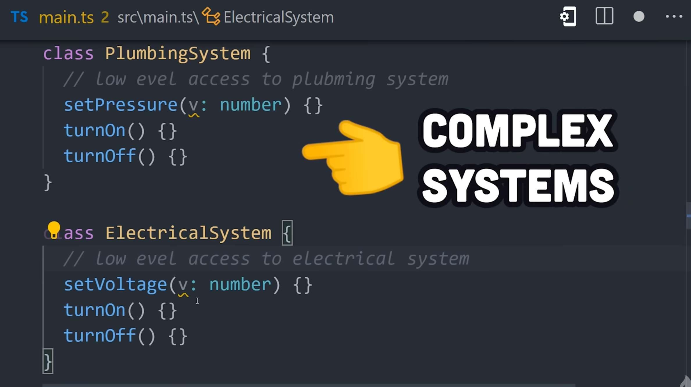

# HLD

 

Referred Video: https://youtu.be/sV_4pOGosnU?si=PXspG159hZdboh9Y

Referred Video: https://youtu.be/QemIfzcEeMM?si=q8f2_Qy3aLAB5mgv

 
Samosa Wala Journey

Referred Video: https://youtu.be/44mOnnt5pic?si=4Kujw-bc-teDK2dP

---

Design Patterns: https://www.patterns.dev/vanilla

 
SEO

1. Canonical tags: Helps ignore any other version which leads to same URL like https://flipkart.com/ and https://www.flipkart.com/ will lead to same URL

2. If you don't want SEO to index few things then use robots.txt to avoid indexing such routes

3. Site map help you list all the pages in your website, which can be used by search engines

---

 
Design Pattern

Quick Explanation: https://www.youtube.com/watch?v=tv-_1er1mWI

 
Creational Design Pattern

Creational design pattern deals with how we create `object`

 
Singleton

1. 
   

---

 
Prototype

2. 
   
   Here because prototype chaining we are able to get value in from `chad.eatBrains()`

---

 
Builder

3. 
   We want to run a hot dog stand
   
   In above solution we need to keep track of where to put things while using `HotDog`

But in `Builder Design pattern` we can define things like below

---

 
Factory Method

4. 
   
   Without factory we have lot of extra overhead while creating `object`
   
   

---

---

 
Structural Design Pattern

 
Facade

1. 

It is used hide all low level complex things from user like below electric system

Almost all packages are using `Facade Design System` like Jquery

---

 
Proxy

2. 

In Vue 

By Proxy we are replacing the original with substitute such that we can keep track of changes
and do changes in DOM as per need in Vue

---

---

 
Behavioral Design Pattern

 
Iterator

1. 
   
   
    Our programming language give this with `for`

Creating own iterator for this `range` function

We add below `Symbol` to use `for ... of`

---

 
Observer

2. 

---

 
Mediator

3. 

To know if the runway is clear or not each airplane need to communicate with each other

Practical example in express.js app

This way we have separation of concern and remove code duplication
---

 
State

4. 

---

---

1. https://refactoring.guru/design-patterns/singleton
2. https://javascriptpatterns.vercel.app/patterns

---

 
Mono Repo Vs Micro Repo

1. https://www.youtube.com/watch?v=x3cANGNPyx0
2. https://www.youtube.com/watch?v=9iU_IE6vnJ8

---

https://www.greatfrontend.com/front-end-system-design-playbook/framework
