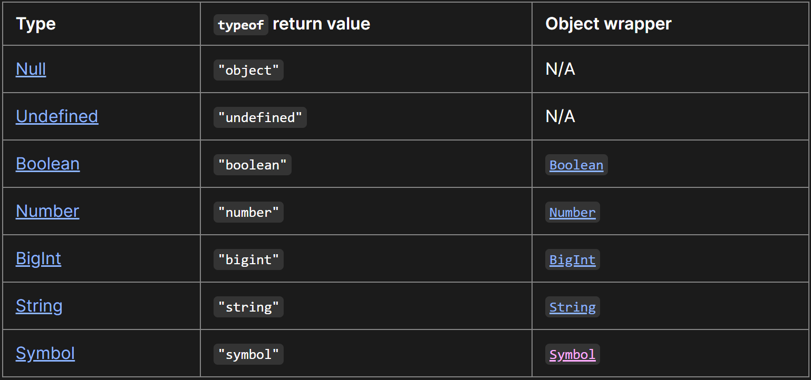
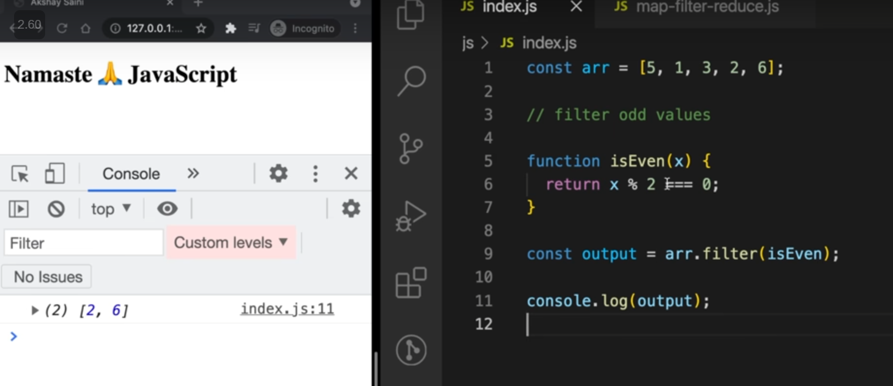
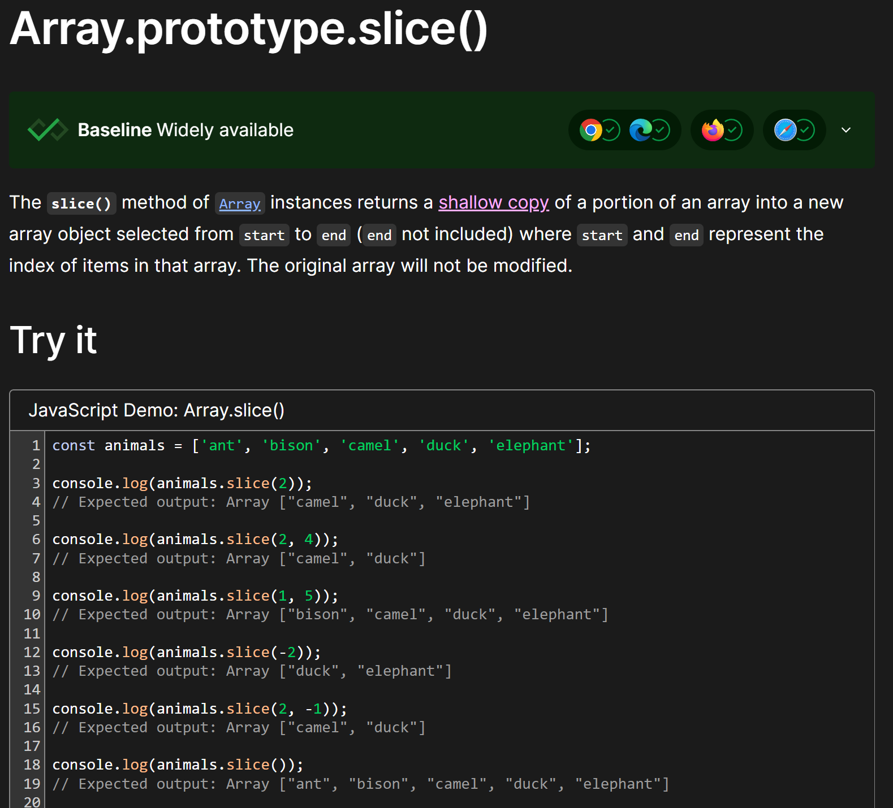

<details >
 <summary style="font-size: x-large; font-weight: bold">Looping through an `Array`</summary>

```javascript
const scores = [22, 54, 76, 92, 43, 33];
```
The `for…in` loop is an easier way to loop through arrays as it gives us the key
```javascript
for (i in scores) {
    console.log(scores[i]);
}
```

The `for...of` Loop iterates over iterable objects such as arrays, sets, maps, strings, and so on. 
It has the same syntax as the for...in loop, but instead of getting the key, 
it gets the element itself.
```javascript
for (score of scores) {
    console.log(score);
}
```

```javascript
scores.forEach((score) => {
    console.log(score);
});
```
Output
```
22
54
76
92
43
33
```

Referred Article: https://www.freecodecamp.org/news/how-to-loop-through-an-array-in-javascript-js-iterate-tutorial/

#### Looping Array fixed number of time in React

```jsx
{
    Array(10).fill(null).map((_, index) => <p key={index}>Hello</p>)
}
```

```jsx
{
    [...Array(10)].map((_, index) => <p key={index}>Hello</p>)
}
```


Right way to update 2-D array


<details >
 <summary style="font-size: medium; font-weight: bold">Good/Tricky Examples</summary>

```js
let score = Array(4).fill(Array(4)).map(a => a.fill(0));
```
This is wrong way to initialize an array.

In this case, you're creating an array with 4 elements using Array(4). Then you use fill(Array(4)) to fill each of those elements with the same array reference (which is [0, 0, 0, 0]). This means all elements in the outer array refer to the same inner array. Finally, you use map to apply fill(0) to each inner array. This fills each inner array with zeros.


#### Right Way to fill 2D Array
```js
let score = Array(4).fill().map(() => Array(4).fill(0));
```
</details >
</details >


<details >
 <summary style="font-size: x-large; font-weight: bold">Looping through an `Object`</summary>

We have three object static methods, which are:

1. `Object.keys()`

2. `Object.values()`

3. `Object.entries()`

```javascript
const population = {
  male: 4,
  female: 93,
  others: 10
};

let populationArr = Object.entries(population);

console.log(populationArr);
```

```
[["male", 4], ["female", 93], ["others", 10]]
```

```javascript
for ([key, value] of populationArr){
  console.log(key);
}
```

Referred Article: https://www.freecodecamp.org/news/how-to-iterate-over-objects-in-javascript/

</details>

<details >
 <summary style="font-size: x-large; font-weight: bold">`typeof()`</summary>



```javascript
typeof([])
// "object"

//Check if an object is an array
Array.isArray([])
```

Referred Article: https://developer.mozilla.org/en-US/docs/Web/JavaScript/Data_structures#bigint_type

</details>

<details >
 <summary style="font-size: x-large; font-weight: bold">map, filter & reduce</summary>

### `map()`


### `filter()`



### `reduce()`

We use reduce whenever we want to reduce an array to a single value.
This single value can be anything like string, number, array, Object,etc.


acc: accumulator
curr: current
second param: initial value of `accumulator`

### Example


Referred Video: https://youtu.be/zdp0zrpKzIE?si=B6N_S7e4XUy7SoOd
</details>


<details >
 <summary style="font-size: x-large; font-weight: bold">Slice, Splice & Split</summary>

### `slice()`




https://developer.mozilla.org/en-US/docs/Web/JavaScript/Reference/Global_Objects/Array/slice

https://developer.mozilla.org/en-US/docs/Web/JavaScript/Reference/Global_Objects/String/slice


### `splice()`


https://developer.mozilla.org/en-US/docs/Web/JavaScript/Reference/Global_Objects/Array/splice

### `split()`


https://developer.mozilla.org/en-US/docs/Web/JavaScript/Reference/Global_Objects/String/split


### `substring()` v/s `slice()`

The choice between `slice()` and `substring()` in JavaScript depends on your specific use case and requirements. Both methods are used to extract a portion of a string, but they have some differences in behavior:

1. **Parameters**:
    - `slice(startIndex, endIndex)`: Accepts two parameters. `startIndex` is the index at which to begin extraction (inclusive), and `endIndex` is the index at which to end extraction (exclusive).
    - `substring(startIndex, endIndex)`: Also accepts two parameters. `startIndex` is the index at which to begin extraction, and `endIndex` is the index at which to end extraction. However, if `startIndex` is greater than `endIndex`, `substring()` will swap the two arguments.

2. **Negative Indices**:
    - `slice()` allows negative indices, which count from the end of the string. For example, `-1` refers to the last character of the string.
    - `substring()` does not accept negative indices. If negative values are provided, it treats them as if they were `0`.

3. **Mutability**:
    - Both methods do not modify the original string; they return a new string.

4. **Compatibility**:
    - `slice()` is part of the ECMAScript standard and is supported in all modern browsers.
    - `substring()` is also widely supported but may behave differently in some older browsers, particularly with negative indices.

Here are some scenarios where you might choose one over the other:

- If you need to extract a substring based on an index range and you want to support negative indices or if you're working with APIs that return negative indices (e.g., `slice(-3)` to get the last 3 characters), then `slice()` is a better choice.
- If you need to ensure that the start index is less than or equal to the end index, and you don't need to handle negative indices, `substring()` could be more convenient because it automatically swaps the indices if necessary.

In general, both methods are quite similar, and the choice between them often comes down to personal preference or specific requirements of the task at hand.
</details>


<details >
 <summary style="font-size: x-large; font-weight: bold">Sort Array</summary>


https://developer.mozilla.org/en-US/docs/Web/JavaScript/Reference/Global_Objects/Array/sort

```js
let nums1 = [1,5,2,9,6];
let nums2 = [1,5,2,9,6];

nums1.sort((a, b) => b - a); //[9, 6, 5, 2, 1]
nums2.sort((a, b) => a - b); //[1, 2, 5, 6, 9]
```
</details>


<details >
 <summary style="font-size: x-large; font-weight: bold">Map</summary>


https://developer.mozilla.org/en-US/docs/Web/JavaScript/Reference/Global_Objects/Map

```js
const frequencyMap = new Map();

// Check key is present or not
if (frequencyMap.has(value)) {
   frequencyMap.set(value, frequencyMap.get(value) + 1);
} else {
   frequencyMap.set(value, 1);
}

// Iterate over map
for (const [key, count] of frequencyMap.entries()) {
   
}

```
</details>
