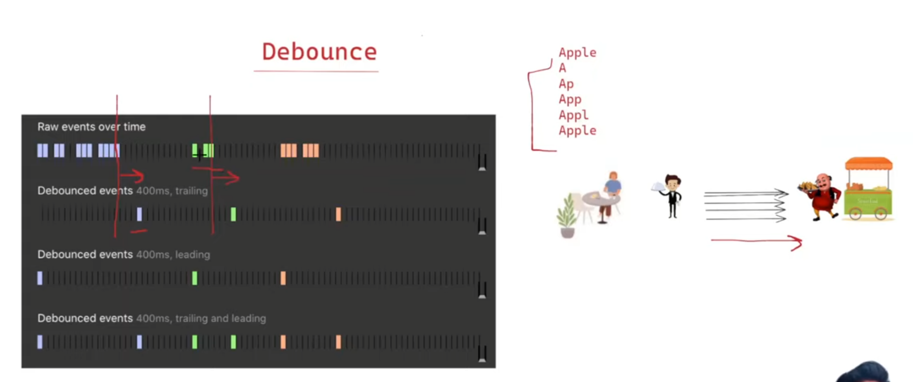
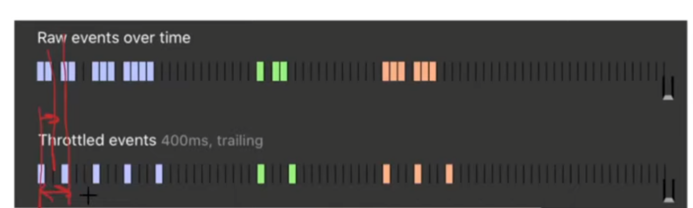

# Debounce



**Trailing Debounce:** Here the waiter goes to moto bhai only when the customer pauses for a certain time 
from last order, and it places the order to Moto bhai whatever he has written finally in his diary

**Leading Debounce:** Here the waiter goes immediately to moto bhai and places the order for the 
things he has written in his diary if there was nothing said before that for a certain time


Below is code for trialing debounce
```javascript
function debounce(cb, delay = 1000) {
    let timeout

    return (...args) => {
        clearTimeout(timeout)
        timeout = setTimeout(() => {
            cb(...args)
        }, delay)
    }
}
```

Weird Caveat in order to take care of edge case

- With Arrow Function
```javascript
/**
 * @callback func
 * @param {number} wait
 * @return {Function}
 */
export default function debounce(func, wait = 0) {
  let timeoutID = null;
  return function (...args) {
    clearTimeout(timeoutID);

    timeoutID = setTimeout(() => {
      timeoutID = null; // Not strictly necessary but good to include.
      // Has the same `this` as the outer function's
      // as it's within an arrow function.
      func.apply(this, args);
    }, wait);
  };
}
```

- With Normal Function, we use extra variable `context` to keep reference of `this`
```js
/**
 * @param {Function} func
 * @param {number} wait
 * @return {Function}
 */
export default function debounce(func, wait = 0) {
  let timeoutID = null;
  return function (...args) {
    // Keep a reference to `this` so that
    // func.apply() can access it.
    const context = this;
    clearTimeout(timeoutID);

    timeoutID = setTimeout(function () {
      timeoutID = null; // Not strictly necessary but good to do this.
      func.apply(context, args);
    }, wait);
  };
}

```
To understand above code, please go through the 
1. `call()`, `apply()` & `bind()` in important concept
2. `this` in [important concept](../this-call-apply-bind/chirag-this-call-apply-bind/readme.md)
3. Lastly go through this for more details: https://www.greatfrontend.com/questions/javascript/debounce?list=one-week

### Use case
1. Autocomplete


# Throttle


**Trailing Throttle:** In pistol shooting game we can use it to limit the number of bullets fired.
So we don't allow a bullet to be fired until the difference between last fired bullet is greater than 400ms




Below is code for trialing throttle
```javascript
function throttle(cb, delay = 1000) {
    let shouldWait = false
    let waitingArgs
    const timeoutFunc = () => {
        if (waitingArgs == null) {
            shouldWait = false
        } else {
            cb(...waitingArgs)
            waitingArgs = null
            setTimeout(timeoutFunc, delay)
        }
    }

    return (...args) => {
        if (shouldWait) {
            waitingArgs = args
            return
        }

        cb(...args)
        shouldWait = true

        setTimeout(timeoutFunc, delay)
    }
}
```


### Use case
1. Mouse tracking
2. Window resizing


## Referred Videos
1. https://www.youtube.com/watch?v=cjIswDCKgu0
2. https://youtu.be/IKRbWT6LqIY?si=IoOgDRnxJB8yi6pW&t=2201
