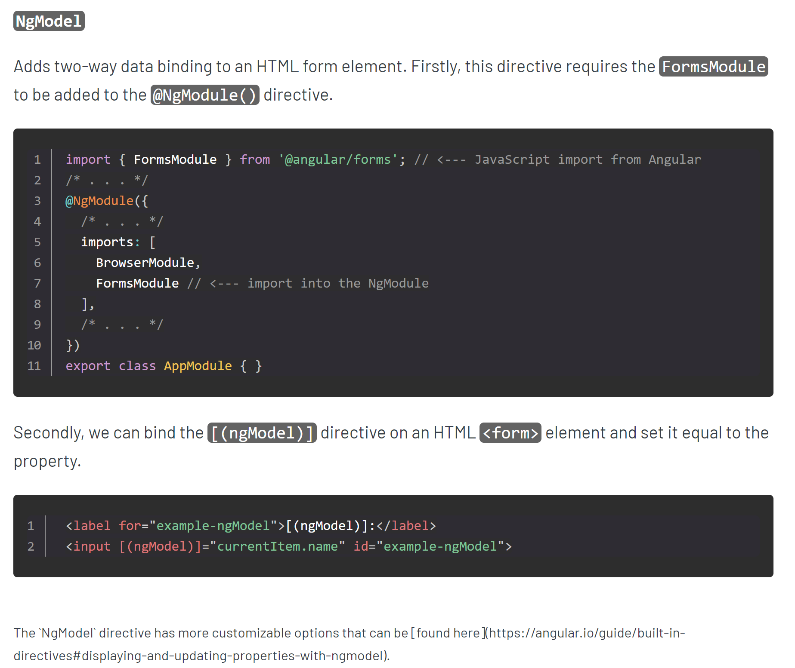

### Angular Cheat Sheet

1. https://github.com/delprzemo/angular-cheatsheet
2. https://angular.io/guide/cheatsheet
2. https://zerotomastery.io/cheatsheets/angular-cheat-sheet/
3. https://www.interviewbit.com/angular-cheat-sheet/

<details >
 <summary style="font-size: medium; font-weight: bold">Post API Call</summary>

```ts
import { HttpClient } from "@angular/common/http";
import { Injectable } from "@angular/core";
import { Observable } from "rxjs";
import { environment } from "src/environments/environment";

@Injectable({
  providedIn: "root",
})
export class EditRuleService {
  constructor(private http: HttpClient) {}

  editFirewallRule(ruleDetails): Observable<any> {
    return this.http.post<any>(
      environment.jobServiceBaseUrl + "/firewall/rule/edit",
      ruleDetails,
      {
        responseType: "text" as "json",
      }
    );
  }
}
```
</details>

<details >
 <summary style="font-size: medium; font-weight: bold">Two Way Binding</summary>



</details>
