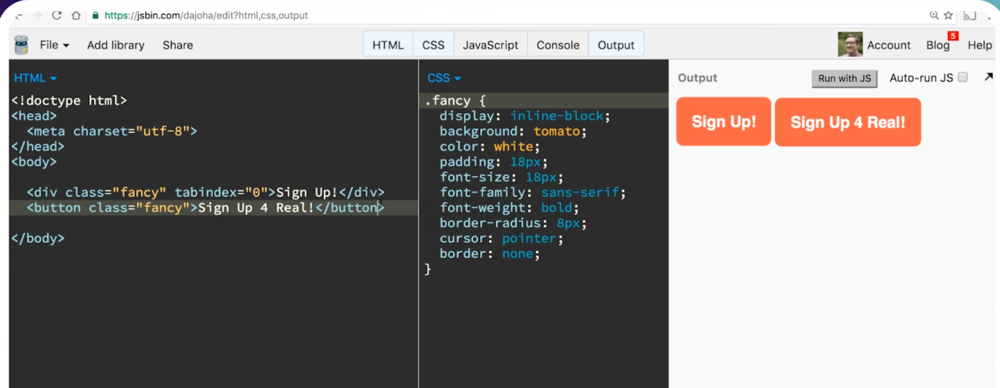
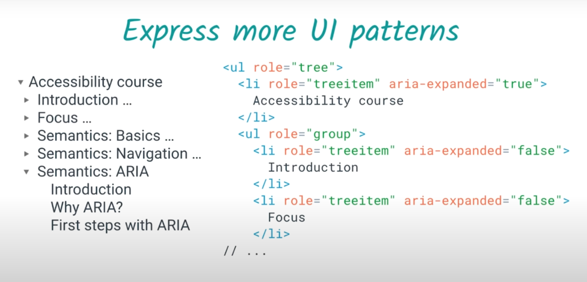

# Accessibility(a11y)

#### _Web accessibility means that people with disabilities can use the web (perceive, understand, navigate, interact & contribute to the web)_


<details >
 <summary style="font-size: x-large; font-weight: bold">Assistive technologies</summary>

- Keyboard only
- Screen reader
- Mouse & Pointer Devices
- Touchscreen Gestures
- Screen Magnifier

</details>


<details >
 <summary style="font-size: x-large; font-weight: bold">Accessibility Standards</summary>

_WCAG (Web Content Accessibility Guidelines)_

https://webaim.org/standards/wcag/checklist


**WebAIM(WCAG Principle)**

- Perceivable
- Operable
- Robust
- Understandable

</details>


<details >
 <summary style="font-size: x-large; font-weight: bold">Screen Reader</summary>

Referred Video: https://youtu.be/g2tzEil5TL0?si=KB55mkrFR6nxuE79
##### Semantic


##### Accessibility tree


### 1. Accessible HTML


- Document Structure

  (`<header>`, `<nav>`, `<main>`, `<footer>`, `<aside>`, `<article>`, `<section>`)

- Headings

  (`<h1>`, `<h2>`, `<h3>`, `<h4>`, `<h5>`, `<h6>`)

- Lists

  (`<ul>`, `<ol>`, `<li>`)

- Links & Buttons

  (`<a>`, `<button>`)

- Form elements

  (`<label>`, `<input type="email">`)

- Tables

  (`<table>`, `<tr>`, `<td>`, `<th>`, `<caption>`,`<tfoot>`)

- Images

  (``)

- Audio/Video

  (Transcript, Open Text Captions)

- CSS class hidden

<details >
 <summary style="font-size: small; font-weight: bold">Why just use `Button` instead of div?</summary>

https://youtu.be/CZGqnp06DnI?si=c0sQLuGzBrXDt9rT



- It is not auto-focusable and we need to add `tabindex="0"` to it.
- Screen reader does not announce it as button.


- We lose capability to click it through keyboards


- Disable does not work as expected
</details>

<details >
 <summary style="font-size: small; font-weight: bold">How to increase screen accessibility in case of Images?</summary>

[//]: # (**_How to increase screen accessibility in case of Images?_**)

https://web.dev/learn/accessibility/images
1. **Decorative Images**: A decorative image is a visual element that doesn't add additional context or information that allows the user to better understand the context.
- ``
-
```html
<!-- All of these choices lead to the same result. -->


```
- When you add a background image with CSS, a screen reader will not detect the image file.

2. **Informative images**: An informative image is an image that conveys a simple concept, idea, or emotion. Types of informative images include photos of real-world objects, essential icons, simple drawings, and images of text.
- Descriptions using `` elements are achieved by including the `alt` attribute
- `<svg>` elements **do not** use the `alt` attribute
```html
  <svg role="img"...>
     <title>Cartoon drawing of a red, black, and gray ladybug.</title>
  </svg>
```

3. **Functional images**: A functional image is connected to an action. An example of a functional image is a logo that links to the home page, a magnifying glass used as a search button, or a social media icon that directs you to a different website or app.
```html
<div title="Navigate to the homepage">
   <a href="/">
      </img>
   </a>
</div>
```
You can see from the code snippet that "Navigate to the homepage" is the wrapper title, and the image alternative text is "Lovely Ladybugs for your Lawn." When you listen to the logo code with a screen reader, you hear both the visual and the action conveyed in one image.

4. **Complex images**: https://web.dev/learn/accessibility/images#complex_images
   


</details>


### 2. ARIA(Accessible Rich Internet Applications)

<details >
 <summary style="font-size: large; font-weight: bold">Intro </summary>

https://www.youtube.com/watch?v=g9Qff0b-lHk&t=339s


1.

Here adding `role` and `aria-checked` attributes help `div`
to behave like checkbox

2.

We can also modify semantics for better screen readers

3.

We can express more through ARIA, like above is a tree and which
is not possible otherwise through any built-in methods

4.


5.


6.

`role="alert"` help to announce immediately when it appears

<br>


So ARIA surgically added attributes to our DOM tree to make
things accessible where we don't have built in support

**ARIA Capabilities Summary**


</details>


<details >
 <summary style="font-size: large; font-weight: bold">The art of labelling </summary>


https://youtu.be/8dCUzOiMRy4?si=oG_zgtQvypoDpvG8
1. `aria-label` attributes


This is very useful in places where we don't have built in support
like checkboxes, select, radio etc

2. `aria-labelledby` attributes


Here we are able to reference another element with `aria-labelledby`


It can also self-reference itself to give better accessibility

</details>


<details >
 <summary style="font-size: large; font-weight: bold">States & Properties</summary>
</details>


</details>


<details >
 <summary style="font-size: x-large; font-weight: bold">Assistive technologies</summary>


</details>


<details >
 <summary style="font-size: x-large; font-weight: bold">Assistive technologies</summary>


</details>


<details >
 <summary style="font-size: x-large; font-weight: bold">Assistive technologies</summary>


</details>


