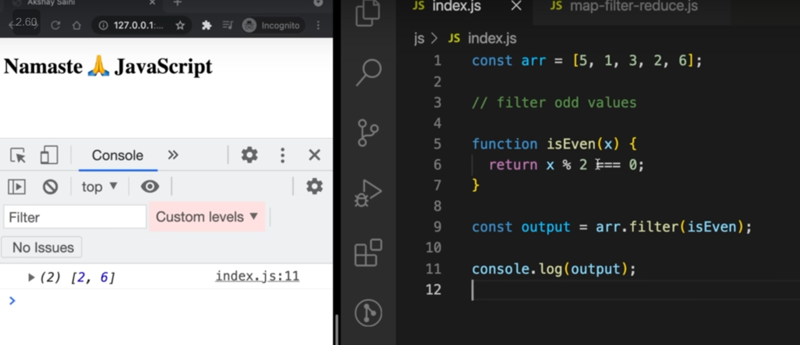

<details >
 <summary style="font-size: x-large; font-weight: bold">Looping through an `Array`</summary>

```javascript
const scores = [22, 54, 76, 92, 43, 33];
```
The `for…in` loop is an easier way to loop through arrays as it gives us the key
```javascript
for (i in scores) {
    console.log(scores[i]);
}
```

The `for...of` Loop iterates over iterable objects such as arrays, sets, maps, strings, and so on. 
It has the same syntax as the for...in loop, but instead of getting the key, 
it gets the element itself.
```javascript
for (score of scores) {
    console.log(score);
}
```

```javascript
scores.forEach((score) => {
    console.log(score);
});
```
Output
```
22
54
76
92
43
33
```

Referred Article: https://www.freecodecamp.org/news/how-to-loop-through-an-array-in-javascript-js-iterate-tutorial/

#### Looping Array fixed number of time in React

```jsx
{
    Array(10).fill(null).map((_, index) => <p key={index}>Hello</p>)
}
```

```jsx
{
    [...Array(10)].map((_, index) => <p key={index}>Hello</p>)
}
```
</details >


<details >
 <summary style="font-size: x-large; font-weight: bold">Looping through an `Object`</summary>

We have three object static methods, which are:

1. `Object.keys()`

2. `Object.values()`

3. `Object.entries()`

```javascript
const population = {
  male: 4,
  female: 93,
  others: 10
};

let populationArr = Object.entries(population);

console.log(populationArr);
```

```
[["male", 4], ["female", 93], ["others", 10]]
```

```javascript
for ([key, value] of populationArr){
  console.log(key);
}
```

Referred Article: https://www.freecodecamp.org/news/how-to-iterate-over-objects-in-javascript/

</details>

<details >
 <summary style="font-size: x-large; font-weight: bold">`typeof()`</summary>


```javascript
typeof([])
// "object"

//Check if an object is an array
Array.isArray([])
```

Referred Article: https://developer.mozilla.org/en-US/docs/Web/JavaScript/Data_structures#bigint_type

</details>

<details >
 <summary style="font-size: x-large; font-weight: bold">map, filter & reduce</summary>

### `map()`


### `filter()`



### `reduce()`

We use reduce whenever we want to reduce an array to a single value.
This single value can be anything like string, number, array, Object,etc.


acc: accumulator
curr: current
second param: initial value of `accumulator`

### Example


Referred Video: https://youtu.be/zdp0zrpKzIE?si=B6N_S7e4XUy7SoOd
</details>
