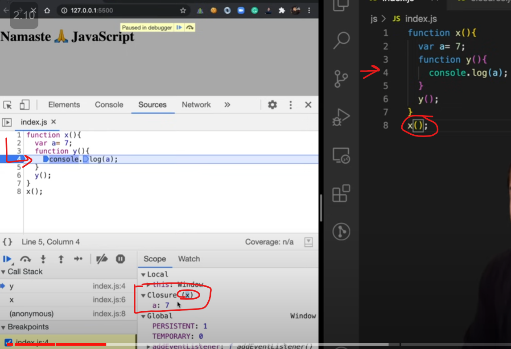
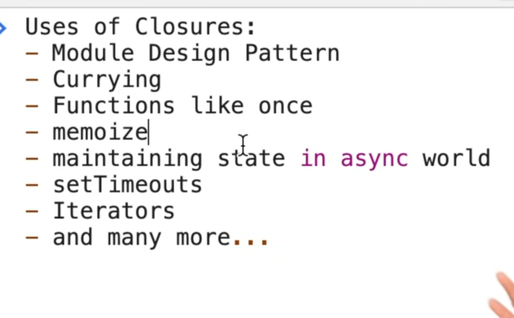
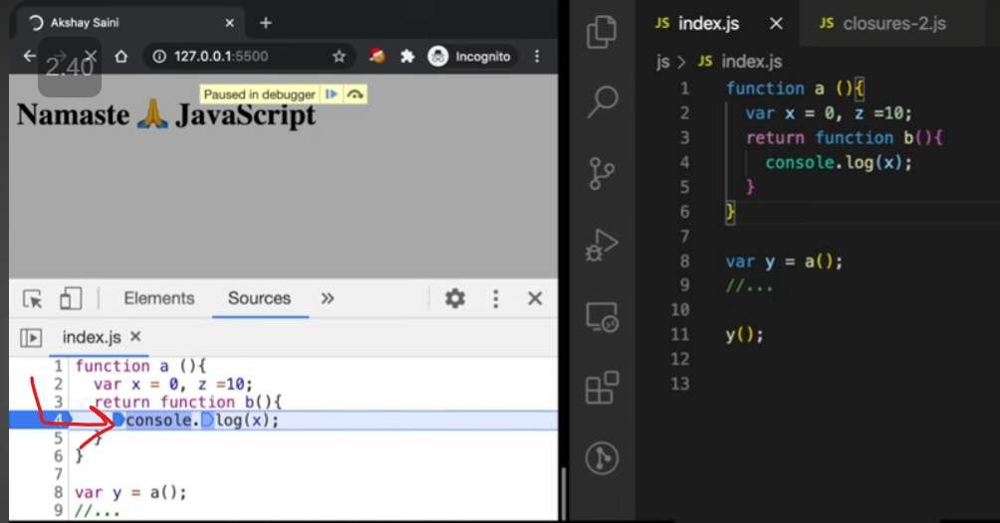
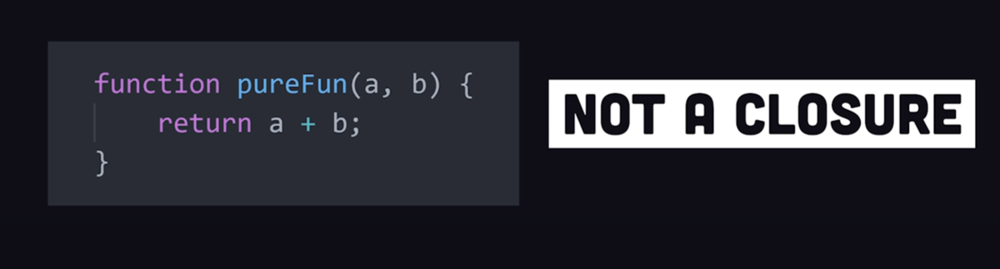
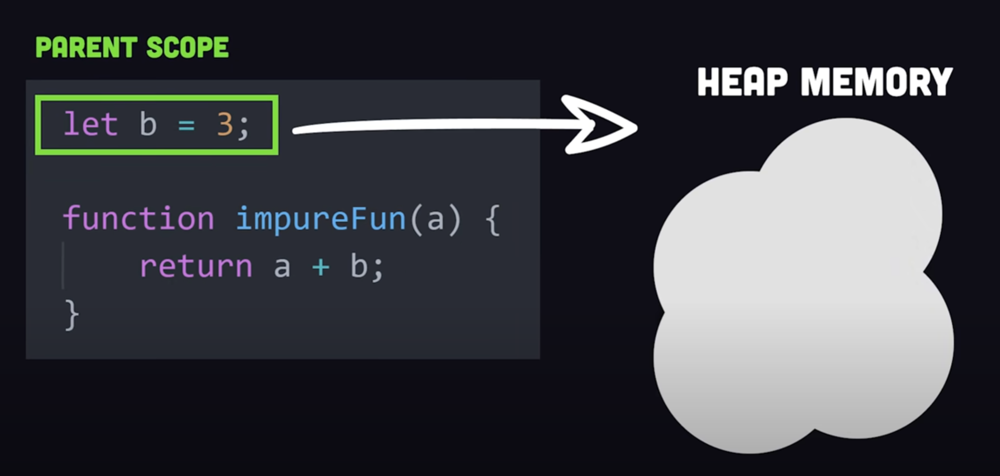
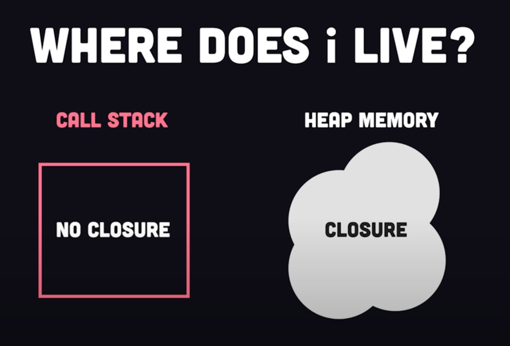

## Closure

Here even though `x()` execution context is removed from
`call stack` after line _8_, but when `z()` execute it remembers the value of 
`a` because of `closure` hence print `7`

### Function with its `lexical` scope bundle together is called closure

How to create closure?

Whenever we want to create Closure then just create a function wraping
variables & functions in them

**Few more examples**

Here we have closure of both `x()` and `z()`

Using Closure to know the button clicked count without any global variable

### Closure Usecase

Data Privacy & Security(Encapsulation)

Here count can only be increased through `counter()` function

Here both `counter1` & `counter2` has access to its own copy of `count`

### Disadvantage of closure

1. Since it uses `Heap` memory so over use of closure can led to memory leak

Referred Video: https://youtu.be/qikxEIxsXco?si=DNd_PMIGTem9dGZM

 
`setTimeout` Closure

## 

Here 5 copy of `setTimeout` are referring to same copy of `i` hence will print 6
all the time

Here since `let` is block scoped so every copy of `setTimeout` closure will have its own 
value of `i`

How to solve this with `var` only?

Here using `Closure` we can solve this

Referred Video:https://youtu.be/eBTBG4nda2A?si=d1TUmSR3h1IO4CFM

 
Closure Questions

1. 

Here since `a` was not there in local scope so we scope chain towards global scope
and if it is not there then we get `Reference error` of `a` not defined.

2. **Garbage Collector**

Here `x` value is garbage collected once `a()` execution is done

Here `x` is not garbage collected because of closure

3. **Smart Garbage Collection**

Here `z` is garbage collected once we reach line _4_, hence we get `Reference error`

 
From Fireship.io

### When ever, a function tries to access a variable which is not created in that function; then it is called as closure.

1. 
2. 
3. 
4. 
5. In closure values are stored inside heap. Stacks are shortly lived while heaps are long-lived.

6. It requires 

7. **Usecase**

a. To prevent data leakage

b. Many javascript functions are callback-based functions

### Famous Tricky Questions
1. 
Ans. 

In `let` i is not hoisted

In case `var` `i` lived in Heap while in `let` it was in Stack

2. 
Referred Video: https://www.youtube.com/watch?v=3a0I8ICR1Vg

### Referred Video: https://www.youtube.com/watch?v=vKJpN5FAeF4

