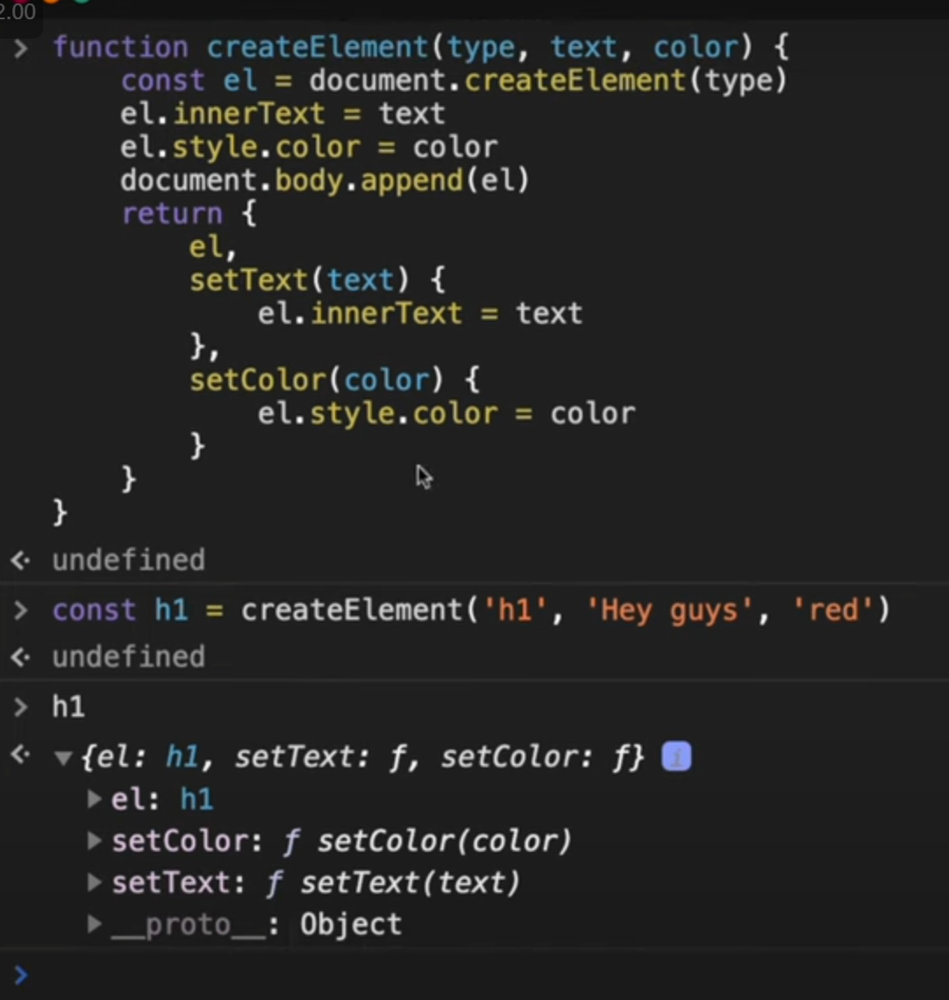

## Functions

<details >
 <summary style="font-size: medium; font-weight: bold">Function Statement vs Function Expression</summary>

`Function Statement` are also called `Function Declaration`


Understand this by knowing `Execution Context`
</details>

<details >
 <summary style="font-size: medium; font-weight: bold">Anonymous Functions</summary>

A function without any name are called `Anonymous Function`


Anonymous function are used as value like above or we get syntax error
</details>

<details >
 <summary style="font-size: medium; font-weight: bold">Named Functions Expression</summary>


Red : Argument 

Green: parameter
</details>


<details >
 <summary style="font-size: medium; font-weight: bold">First Class Function</summary>

The ability to use function as value and return it as a value is called `First Class Function`

</details>

Referred Video: https://youtu.be/SHINoHxvTso?si=T8jxyj-IHrnRx2tx

<details >
 <summary style="font-size: medium; font-weight: bold">Factory Functions</summary>

It is very similar to actual factory where we raw material and get finished
product.

Factory function just create `Object`'s and return them

```js
function factory() {
    return {...}
}
```

### Problems

Why we can't just create `Object` itself directly instead of using `factory` function?
1. There are lot of thing in common but few slight differences in all objects
   
   Because of this there is lot of code duplicaton
2. 
   Object value can be updated like above which can again create problem


### Solution


1. Not very complex like `Class`
2. No code duplication
3. Can't inject any bug through updating any value directly

Example


Referred Video: https://youtu.be/lE_79wkP-1U?si=Yskr4mqmfg8Nd51r

</details>


<details >
 <summary style="font-size: medium; font-weight: bold">Pure / Impure Function</summary>


</details>


<details >
 <summary style="font-size: medium; font-weight: bold">Closure Questions</summary>
</details>


<details >
 <summary style="font-size: medium; font-weight: bold">Closure Questions</summary>
</details>
