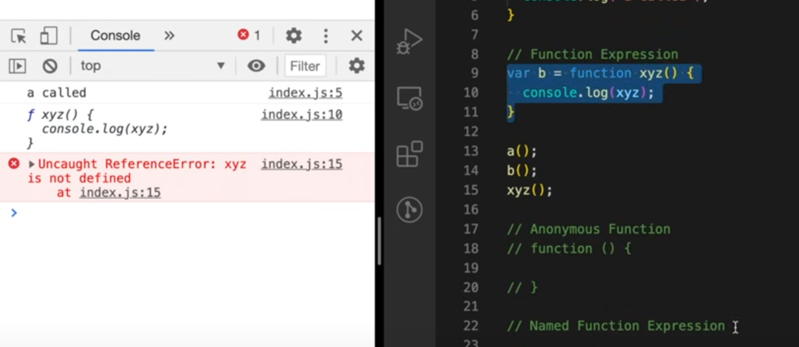
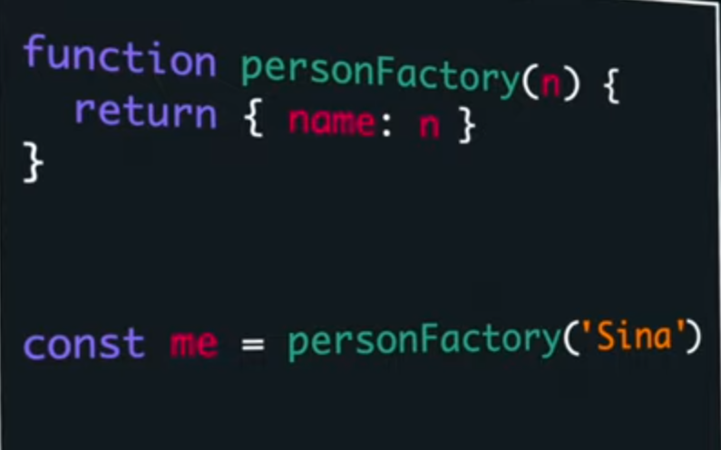
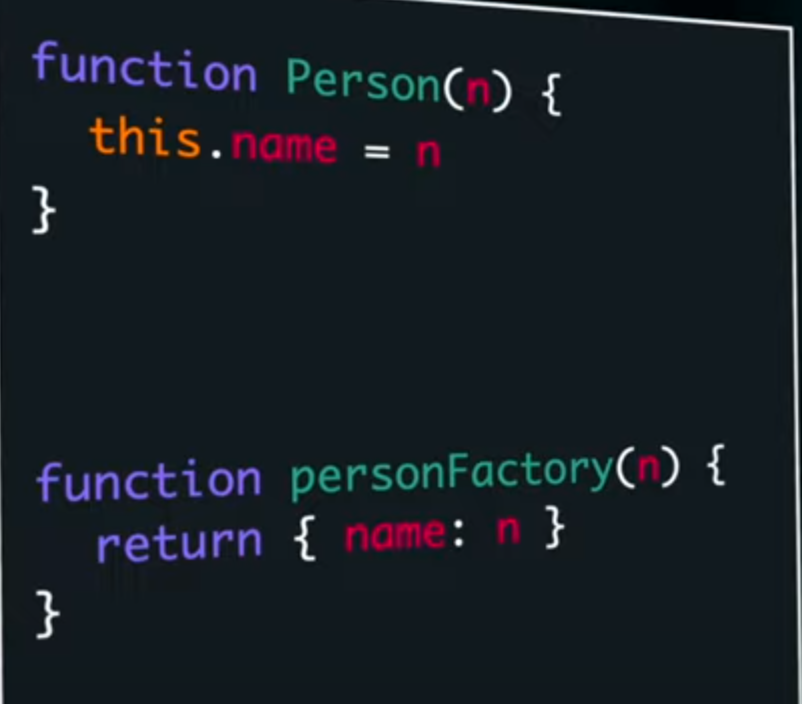
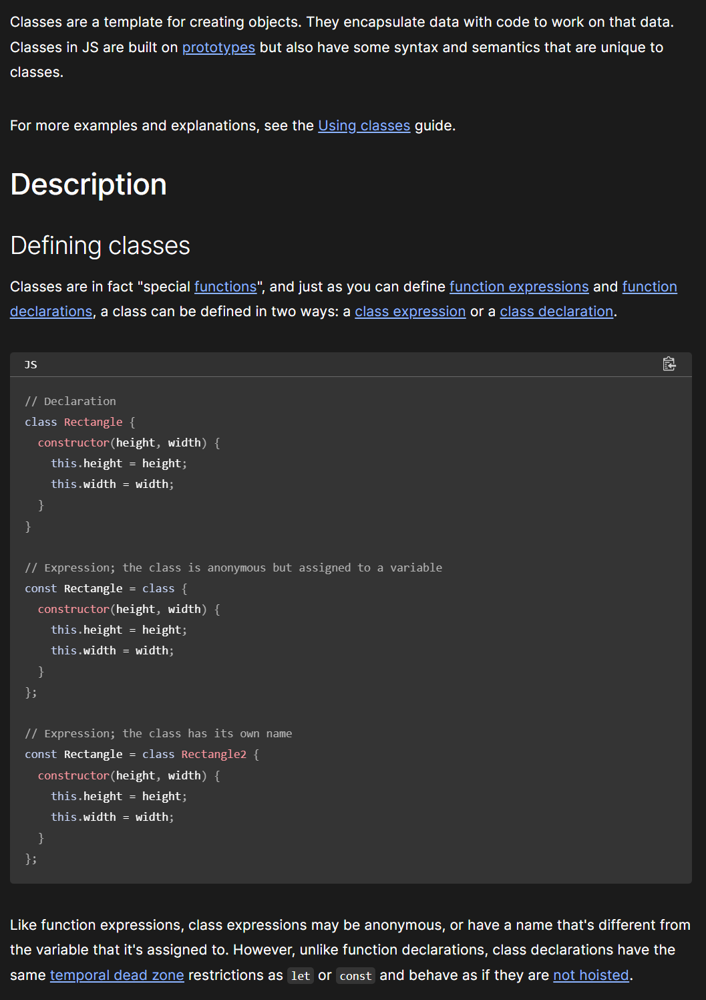
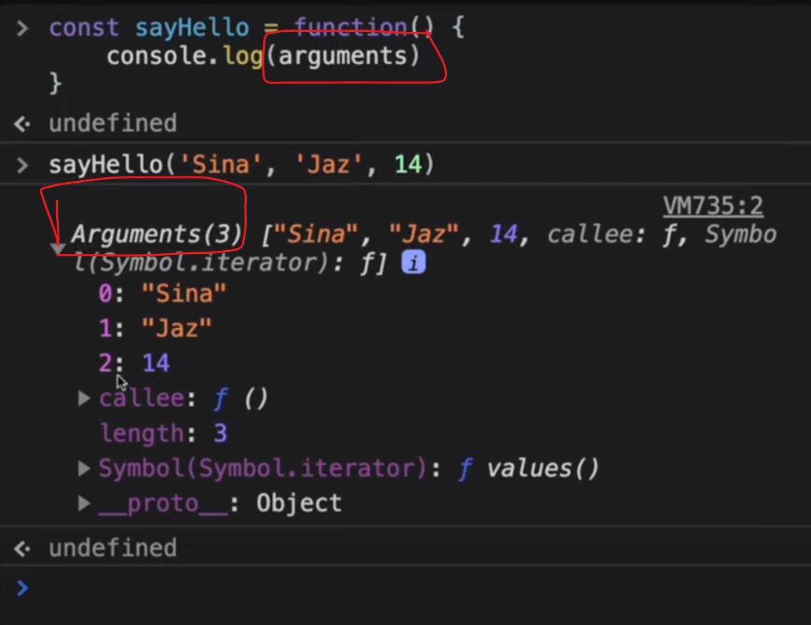
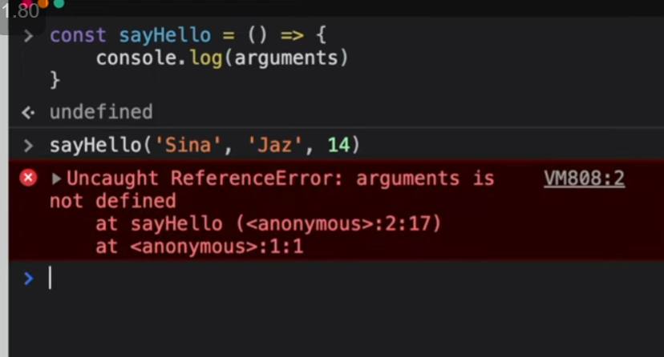

## Functions

<details >
 <summary style="font-size: medium; font-weight: bold">Function Statement vs Function Expression</summary>

`Function Statement` are also called `Function Declaration`


Understand this by knowing `Execution Context`
</details>


<details >
 <summary style="font-size: medium; font-weight: bold">Anonymous Functions</summary>

A function without any name are called `Anonymous Function`


Anonymous function are used as value like above or we get syntax error
</details>


<details >
 <summary style="font-size: medium; font-weight: bold">Named Functions Expression</summary>




Red : Argument 

Green: parameter
</details>


<details >
 <summary style="font-size: medium; font-weight: bold">First Class Function</summary>

The ability to use function as value and return it as a value is called `First Class Function`

</details>

Referred Video: https://youtu.be/SHINoHxvTso?si=T8jxyj-IHrnRx2tx


<details >
 <summary style="font-size: medium; font-weight: bold">Factory Functions</summary>

It is very similar to actual factory where we raw material and get finished
product.

Factory function just create `Object`'s and return them

```js
function factory() {
    return {...}
}
```

### Problems

Why we can't just create `Object` itself directly instead of using `factory` function?
1. There are lot of thing in common but few slight differences in all objects
   
   Because of this there is lot of code duplicaton
2. 
   Object value can be updated like above which can again create problem


### Solution


1. Not very complex like `Class`
2. No code duplication
3. Can't inject any bug through updating any value directly

Example


Referred Video: https://youtu.be/lE_79wkP-1U?si=Yskr4mqmfg8Nd51r

</details>


<details >
 <summary style="font-size: medium; font-weight: bold">Pure / Impure Function</summary>


</details>


<details >
 <summary style="font-size: medium; font-weight: bold">Constructor Function</summary>

`Constructor functions` create object for us just like `Factory Function`


Just like a waiter giving order to cook, they have blueprint of how they should
pass order info so that there is less waste of time. Same thing is for
constructor function we define blueprint of object and pass the changed part to it.


Using `new` automatically add above 2 lines, therefore we need not to return 
anything unlike `Factory Function`


Referred Video: https://youtu.be/I37qHG0DxmE?si=7BGR0tQStjXih67o
</details>


<details >
 <summary style="font-size: medium; font-weight: bold">Factory Function v/s Constructor Function v/s Class</summary>

`Factory Function`

Factory function just create Object's and return them


`Constructor Function`

Constructor function also create object for us and provide kind of blueprint how the 
object should be created.


Both side-by-side



### In case of Factory Function


So here in case of `factory function` when we changed function definition for
`me` object , it didn't affect `you` object. As each object get there own space
for this function and we have separate copy of this function.

Two issues with this
1. Take extra space
2. No clear inheritance

Way to fix this 
1.


This is not very great as `speak` function is present on every single Object 

2. 

This is bit better than above as we are able to send it to `__proto__`

### In case of Contructor Function


Here after adding new function to constructor function using above code
we are able to add this function to every object created using this constructor function


We can now also change the function and it will be reflected in every object created 
using this constructor function.

**This is now showing clear inheritance of object created from constructor function.**

1. This show clear benefit that using `constructor function` for creating object,
we have **clear inheritance**
2. But we use `factory function` for creating object.
   - It is lot simpler than `constructor function`, as we don't have use `new` keyword and all
   - We have also **Data Privacy**, as each one is getting its own copy so there is very less
   chance of manipulation of data

### Classes

It is exactly same like `Constructor Function` and use same prototype concept. It was
introduce in ES6


Referred Video: https://youtu.be/fbuyliXlDGI?si=bg1whNVtEbIY2ci5
</details>


<details >
 <summary style="font-size: medium; font-weight: bold">Arrow Function</summary>


In normal function we have `arguments` object are present




</details>


<details >
 <summary style="font-size: medium; font-weight: bold">Closure Questions</summary>
</details>


<details >
 <summary style="font-size: medium; font-weight: bold">Closure Questions</summary>
</details>


<details >
 <summary style="font-size: medium; font-weight: bold">Closure Questions</summary>
</details>
