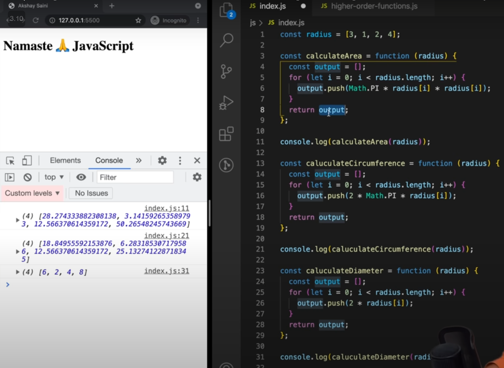
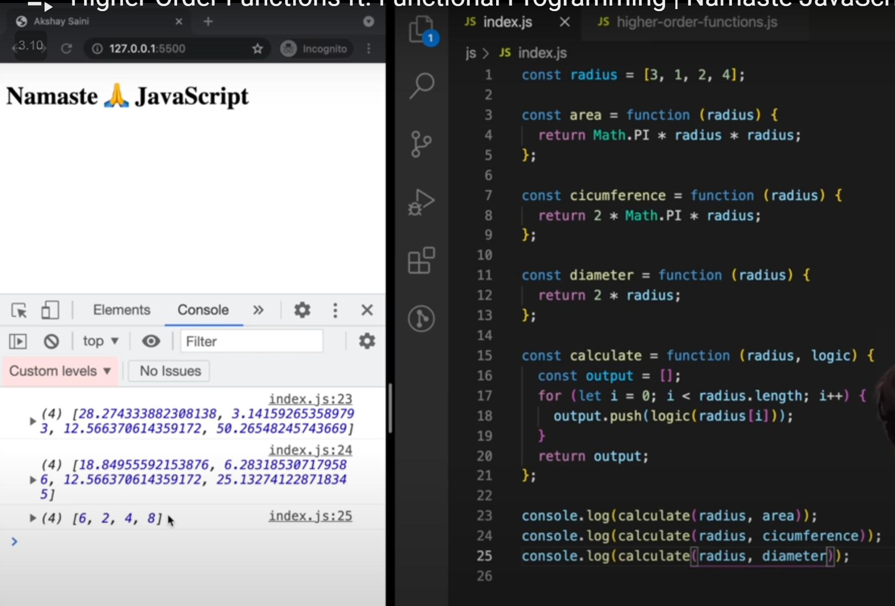
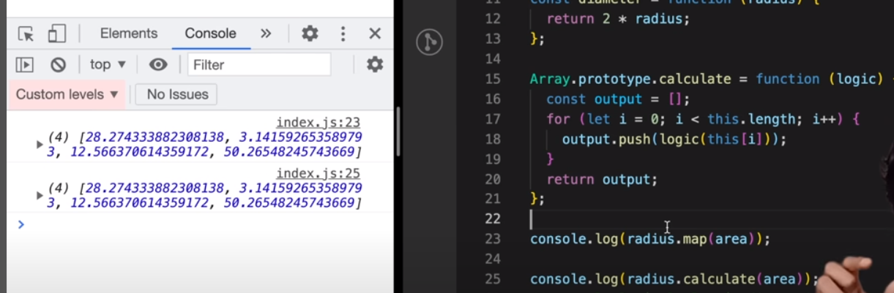

## Functional Programming

### Without Functional Programming

### With Functional Programming

### Higher Order Functions

Function that takes another function as argument(callback function) is known as **Higher order functions.**
Ex: map(), reduce(), filter(), ...etc

1. Follow DRY(Don't Repeat Yourself) principle while coding.
2. Use function to stop writing repeating line of codes.
3. It is this ability that function can be stored, passed and returned,  they are called **first class citizens.**
4. If  we use Array.property.function-name. This function is accessible to any array in your code.

