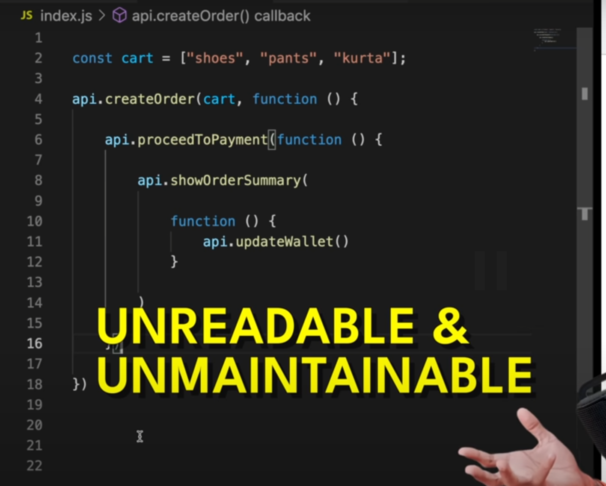
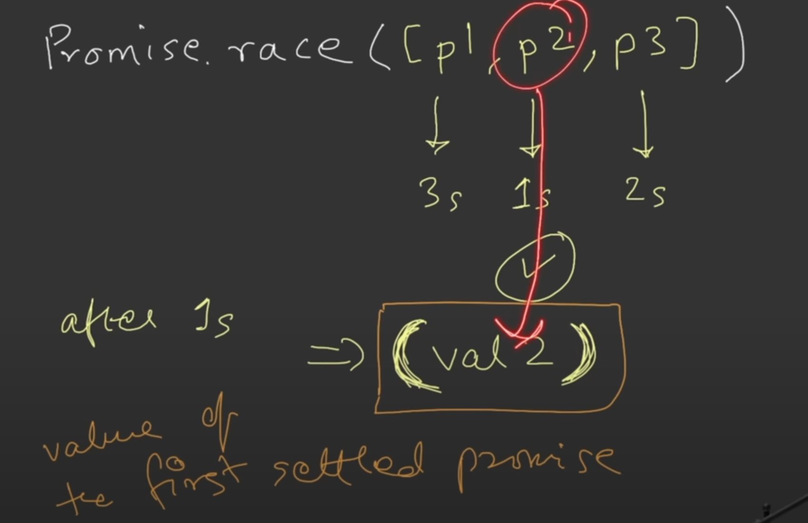

 
Callback

Callback are used to handle asynchronous code. 
It is a function that is passed as an argument to another function. 

### Callback Hell

One function called inside another because each one need to happen
after the other. 

Like in first create order -> Proceed To payment -> show order summary

### Inversion of Control

Here execution of `proceedToPayment` is dependent on `createOrder` function,
hence we have lost the control over it. There code multiple issues
with `createOrder` function which will affect `proceedToPayment` function.

 
Promise

### A `Promise` is an object representing the eventual completion or failure of an asynchronous operation.

 
Namaste JS

Alike in callback we where passing function we are attaching `proceedToPayment` function to it.
This gives more control over it.

Initially `user` will be undefined but after line 15 `user` will have `promise` object.
It has two value
1. PromiseState (pending, fulfilled, rejected)
2. PromiseResult

Solving Callback Hell

Referred Video: https://youtu.be/ap-6PPAuK1Y?si=XgXdtziWUV-JRDId

**Creating a Promise**

 
Maximilian Schwarzmüller

Go through these below video for more details:
https://www.udemy.com/course/javascript-the-complete-guide-2020-beginner-advanced/learn/lecture/16329906#overview

Great follow-up question:
https://www.greatfrontend.com/questions/javascript/promise-all

Nice article by Builder.io:
https://www.builder.io/blog/promises

 
Promise API's

 
Promise.all()

1. All success cases

2. Some failure cases

As soon we get error from any one promise error is thrown and no other 
promise will be executed.

 
Promise.allSettled()

 
Promise.race()

Value of **first settled promise** will be returned irresptive of error or failure

 
Promise.any()

Value of **first success settled promise** will be returned

If all error case then **aggregateError** is thrown

Referred Video: https://youtu.be/DlTVt1rZjIo?si=UlMdAtzKcaydIACp

 
Async / Await

### Async functions Always return a promise

If we returning Promise in async function then it will same like above and it 
return Promise of promise

**For async/await go through the Maximilian Schwarzmüller video**

