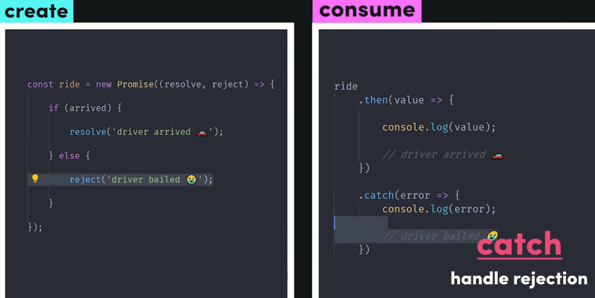

## Promise

Go through these below video for more details:
https://www.udemy.com/course/javascript-the-complete-guide-2020-beginner-advanced/learn/lecture/16329906#overview

Great follow-up question:
https://www.greatfrontend.com/questions/javascript/promise-all

Nice article by Builder.io:
https://www.builder.io/blog/promises
