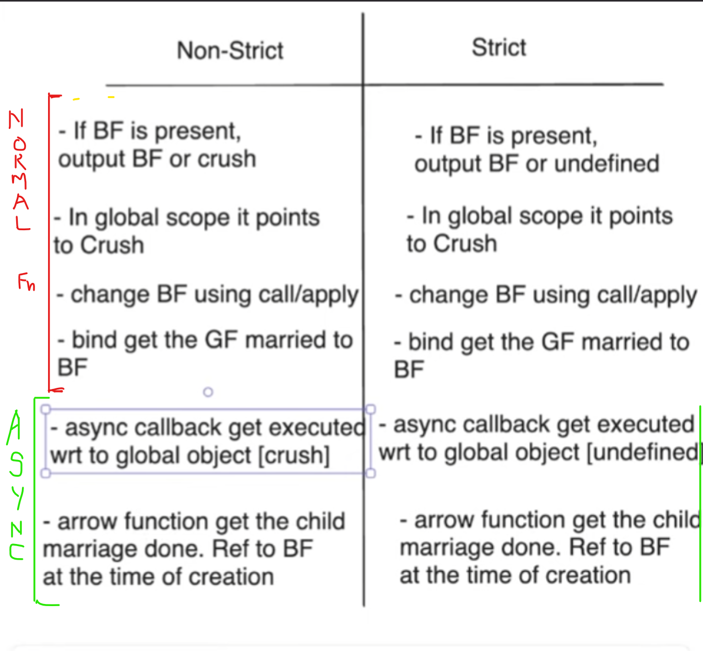

## Synchronous Scenarios

All `undefined` output in below cases in `Non-Strict` mode will return `window` object


All Below code are in `Strict` Mode

Object Definitions:-

```js
"use strict";

console.log('Direct Strict mode log:', typeof this === 'undefined')

function myFunction() {
    console.log('Strict mode:', typeof this === 'undefined'); // Logs true
}

myFunction();

let bfKapoorObject = {
    name: "Ranbir Kapoor",
    age: 41,
    gfFunction: function() {
        console.log("Kapoor Normal Function : ", this)
    },
    gfArrowFunction: () => {
        console.log("Kapoor Arrow Function : ", this)
    }
}

let bfSinghObject = {
    name: "Ranbir Singh",
    age: 38,
    gfFunction() {
        console.log("Singh Normal Function : ", this)
    },
    gfArrowFunction: () => {
        console.log("Singh Arrow Function : ", this)
    }
}
```
### Normal BF Calls

```js

//Case-1
console.log("With BF Normal Function : ");
bfKapoorObject.gfFunction()

//Case-2
console.log("With BF Arrow Function : ");
bfKapoorObject.gfArrowFunction();

//Case-3
console.log("Without BF Normal Function: ");
const withoutBfNormalGfFn = bfKapoorObject.gfFunction;
withoutBfNormalGfFn();

//Case-4
console.log("Without BF Arrow Function: ");
const withoutBfArrowGfFn = bfKapoorObject.gfArrowFunction;
withoutBfArrowGfFn();
```

Output:


### Change BF Techniques using `call()`/`apply()`

```js
//Case-1
console.log("Call: With BF Normal Function : ");
bfKapoorObject.gfFunction.call(bfSinghObject)

//Case-2
console.log("Call: With BF Arrow Function : ");
bfKapoorObject.gfArrowFunction.call(bfSinghObject);

//Case-3
console.log("Call: Without BF Normal Function: ");
const withoutBfNormallGfCallFn = bfKapoorObject.gfFunction;
withoutBfNormallGfCallFn.call(bfSinghObject);

//Case-4
console.log("Call: Without BF Arrow Function: ");
const withoutBfArrowGfCallFn = bfKapoorObject.gfArrowFunction;
withoutBfArrowGfCallFn.call(bfSinghObject);
```

Output: 


### Marry BF using `bind()`

```js
//Case-1
console.log("Bind: BF Normal Function: ");
const BfNormalGfBindFn = bfKapoorObject.gfFunction.bind(bfSinghObject);
BfNormalGfBindFn();

//Case-2
console.log("Bind: BF Arrow Function: ");
const BfArrowGfBindFn = bfKapoorObject.gfArrowFunction.bind(bfSinghObject);
BfArrowGfBindFn();
```

Output:


We use `call()` for changing BF and `bind()` for marrying 🙃


Here we are getting above error as `gfFunction()` is not return anything,
it is just logging the value


When function is called without any Object with it we call `crush`😛


All `Async Callback` is executed wrt global scope therefore
it give **crush in non-strict** mode and **`undefined` in strict mode**


Here `setTimeOut()` is async callback, hence `Arrow Function`
behave differently in regular and async callabck.
In async callback child marriage is done by arrow function, which means 
we bind the obj value during creation of arrow function


`innerPrint()` function was executed in global scope because there was no 
object was associated with it when it was called


But here `innerPrint()` was executed in `obj` scope hence its value was printed


Referred Video: https://www.youtube.com/watch?v=hwoU8NCICSE


